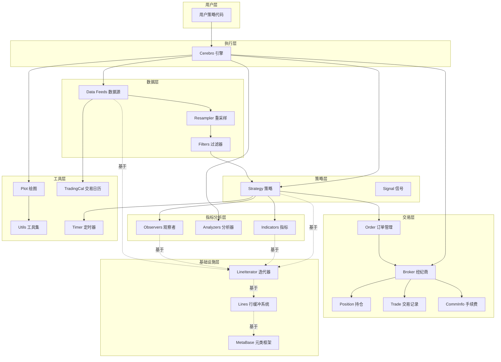
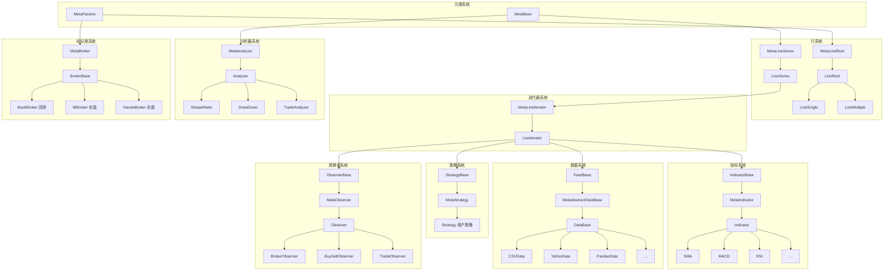
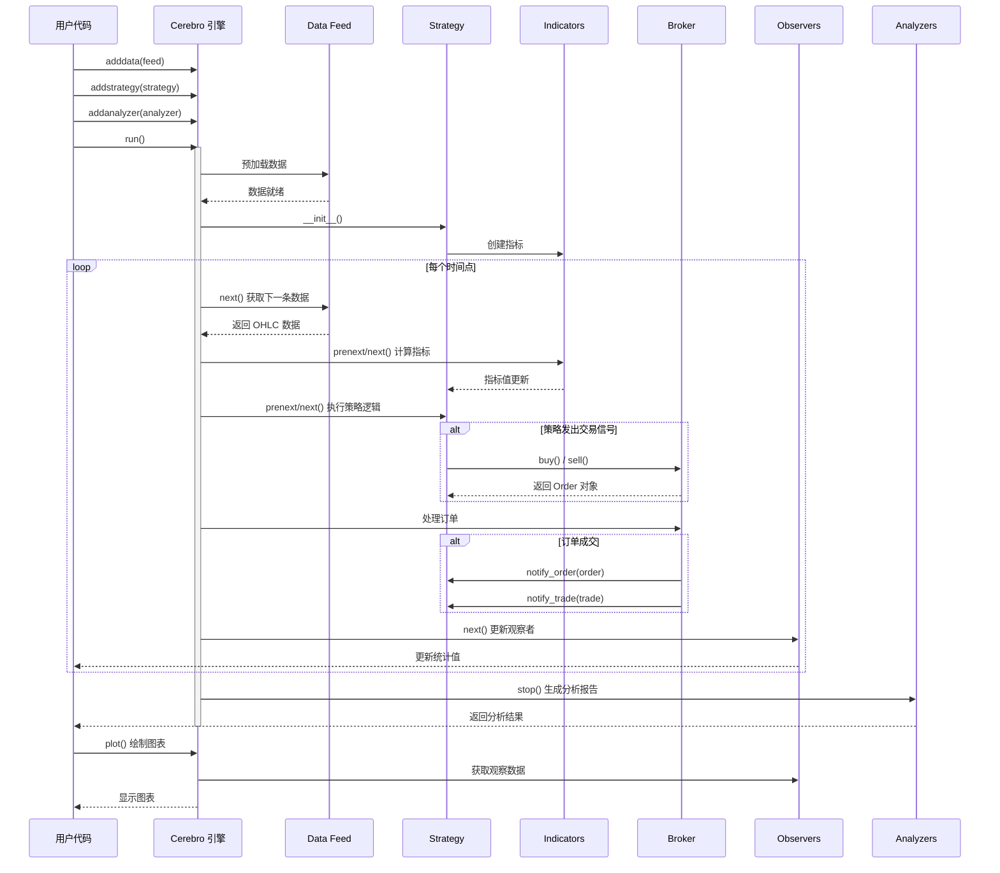
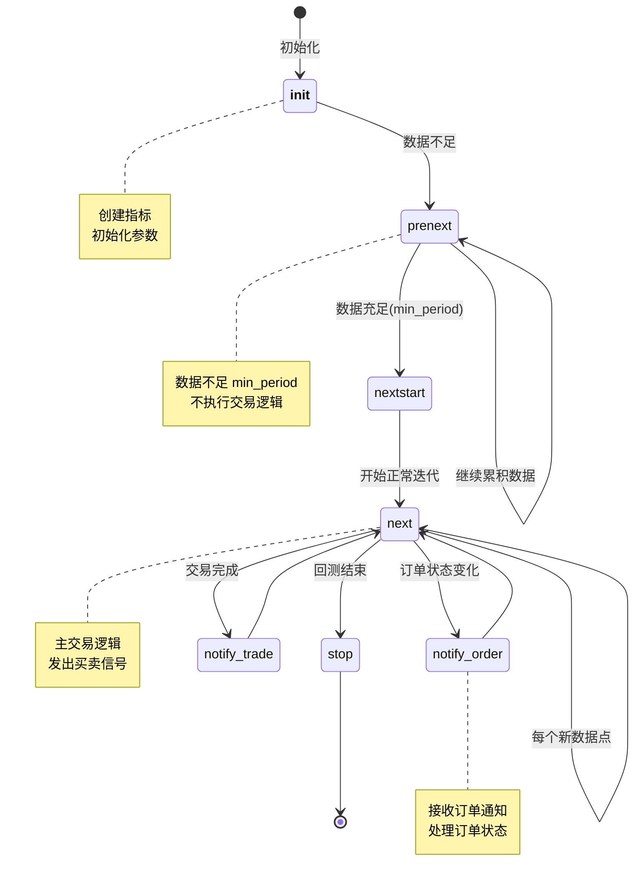
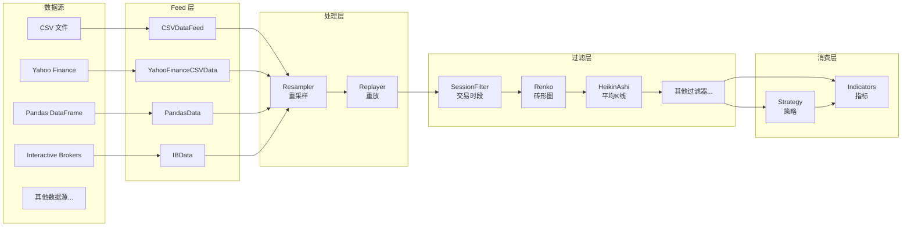
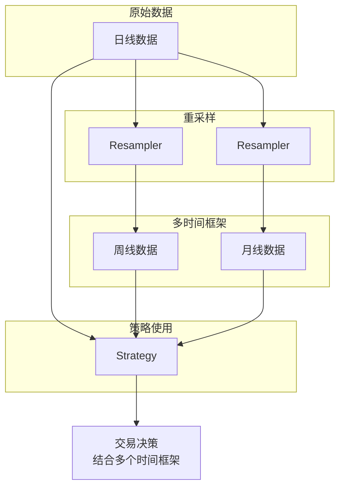
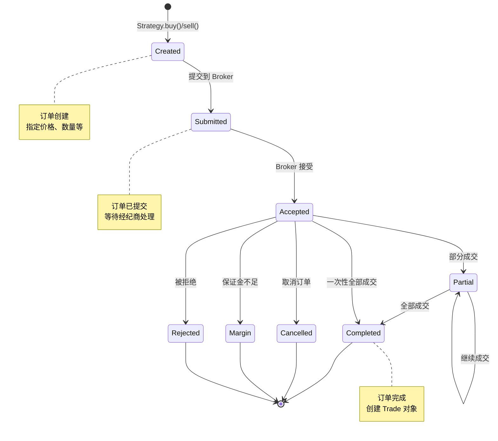
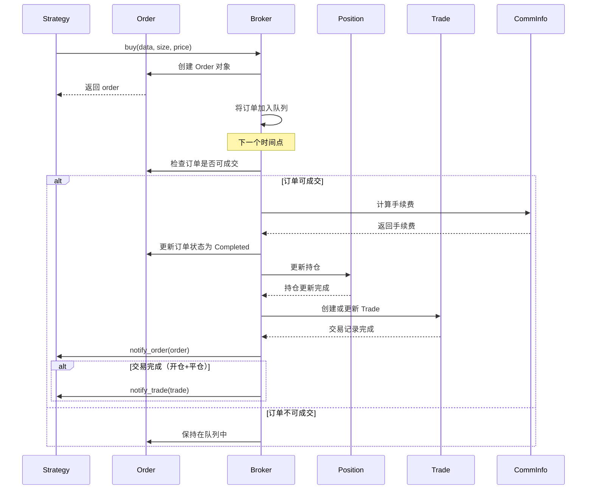
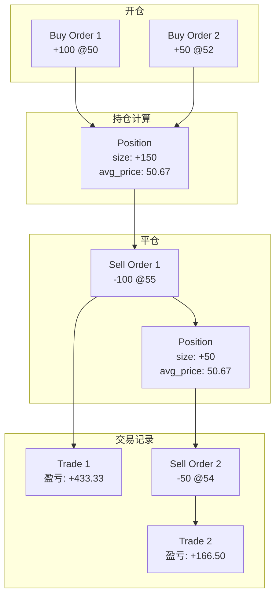

# Backtrader 项目架构文档

## 目录
- [项目概述](#项目概述)
- [整体架构](#整体架构)
- [核心模块](#核心模块)
- [目录结构](#目录结构)
- [类继承关系](#类继承关系)
- [执行流程](#执行流程)
- [数据流](#数据流)
- [订单交易流](#订单交易流)
- [架构设计特点](#架构设计特点)

---

## 项目概述

**Backtrader** 是一个功能强大的 Python 量化交易回测和实盘交易框架，支持：
- 策略回测与优化
- 多数据源、多时间框架
- 技术指标计算（51+ 内置指标）
- 性能分析（16+ 分析器）
- 可视化绘图
- 实盘交易接入（IB、Oanda 等）

---

## 整体架构

### 架构层次图



---

## 核心模块

### 1. 引擎模块

| 模块 | 文件 | 行数 | 功能描述 |
|------|------|------|----------|
| **Cerebro** | `cerebro.py` | ~1700 | 核心引擎，管理整个回测/实盘流程 |
| **Strategy** | `strategy.py` | ~1900 | 策略基类，定义策略接口和生命周期 |
| **Feed** | `feed.py` | ~820 | 数据源基类，管理 OHLC 数据流 |
| **Broker** | `broker.py` | ~200 | 经纪商基类接口 |
| **BackBroker** | `brokers/bbroker.py` | ~1400 | 完整的回测经纪商实现 |

### 2. 基础设施模块

| 模块 | 文件 | 功能描述 |
|------|------|----------|
| **MetaBase** | `metabase.py` | 元类框架，提供参数化和对象创建定制 |
| **LineRoot** | `lineroot.py` | 行缓冲基类，定义行操作接口 |
| **LineBuffer** | `linebuffer.py` | 行缓冲实现，高效存储时间序列数据 |
| **LineSeries** | `lineseries.py` | 线系列容器和描述符，管理多条行数据 |
| **LineIterator** | `lineiterator.py` | 线迭代器，迭代各组件的计算 |

### 3. 数据和交易模块

| 模块 | 文件 | 功能描述 |
|------|------|----------|
| **DataSeries** | `dataseries.py` | 数据序列基类（OHLC, DateTime） |
| **Order** | `order.py` | 订单对象，包含执行位、成交记录 |
| **Position** | `position.py` | 持仓对象，记录大小和成本 |
| **Trade** | `trade.py` | 交易记录，关联一对或多个订单 |
| **CommInfo** | `comminfo.py` | 手续费信息，计算手续费和滑点 |

### 4. 插件模块

| 类型 | 数量 | 目录 | 功能 |
|------|------|------|------|
| **Indicators** | 51+ | `indicators/` | 技术指标库（SMA, EMA, MACD, RSI等） |
| **Feeds** | 18+ | `feeds/` | 数据源插件（CSV, Yahoo, Pandas, IB等） |
| **Analyzers** | 16+ | `analyzers/` | 性能分析工具（Sharpe, Drawdown等） |
| **Observers** | 7+ | `observers/` | 实时统计观察器 |
| **Brokers** | 4 | `brokers/` | 经纪商实现（BackBroker, IB, Oanda等） |
| **Filters** | 8 | `filters/` | 数据转换过滤器（Renko, Heikin-Ashi等） |
| **Sizers** | 2 | `sizers/` | 头寸大小计算 |
| **Stores** | 4 | `stores/` | 数据存储接口 |

### 5. 工具模块

| 模块 | 文件/目录 | 功能 |
|------|-----------|------|
| **Plot** | `plot/` | Matplotlib 绘图引擎 |
| **Timer** | `timer.py` | 定时器管理 |
| **TradingCal** | `tradingcal.py` | 交易日历和时段管理 |
| **Resampler** | `resamplerfilter.py` | 数据重采样和重放 |
| **Writer** | `writer.py` | 数据输出到 CSV |
| **Utils** | `utils/` | 实用工具集 |

---

## 目录结构

```
backtrader/
├── __init__.py                 # 主入口，导出所有公共接口
├── cerebro.py                  # 核心引擎
├── strategy.py                 # 策略基类
├── feed.py                     # 数据源基类
├── order.py                    # 订单管理
├── broker.py                   # 经纪商基类
├── position.py                 # 持仓管理
├── trade.py                    # 交易记录管理
│
├── metabase.py                 # 元类基础设施
├── lineroot.py                 # 行缓冲基础类
├── linebuffer.py               # 行缓冲实现
├── lineseries.py               # 线系列容器
├── lineiterator.py             # 线迭代器
├── dataseries.py               # 数据序列
│
├── indicator.py                # 指标基类
├── observer.py                 # 观察者基类
├── analyzer.py                 # 分析器基类
├── resamplerfilter.py          # 数据重采样
├── timer.py                    # 定时器
├── tradingcal.py               # 交易日历
├── writer.py                   # 数据输出器
├── sizer.py                    # 头寸大小管理
├── store.py                    # 数据存储接口
├── comminfo.py                 # 手续费信息
├── fillers.py                  # 委托成交策略
├── errors.py                   # 错误定义
├── functions.py                # 实用函数
├── talib.py                    # TA-Lib 支持
├── version.py                  # 版本信息
│
├── feeds/                      # 数据源插件（18 个）
│   ├── csvgeneric.py
│   ├── pandafeed.py
│   ├── yahoo.py
│   ├── ibdata.py
│   └── ...
│
├── indicators/                 # 指标库（51 个）
│   ├── basicops.py
│   ├── macd.py
│   ├── rsi.py
│   ├── bollinger.py
│   └── ...
│
├── analyzers/                  # 分析器（16 个）
│   ├── sharpe.py
│   ├── returns.py
│   ├── drawdown.py
│   ├── tradeanalyzer.py
│   └── ...
│
├── brokers/                    # 经纪商（4 个）
│   ├── bbroker.py
│   ├── ibbroker.py
│   ├── oandabroker.py
│   └── vcbroker.py
│
├── stores/                     # 数据存储（4 个）
│   ├── ibstore.py
│   ├── oandastore.py
│   └── ...
│
├── observers/                  # 观察者（7 个）
│   ├── broker.py
│   ├── buysell.py
│   ├── trades.py
│   └── ...
│
├── filters/                    # 数据过滤器（8 个）
│   ├── session.py
│   ├── renko.py
│   ├── heikinashi.py
│   └── ...
│
├── sizers/                     # 头寸大小计算（2 个）
│   ├── fixedsize.py
│   └── percents_sizer.py
│
├── plot/                       # 绘图模块
│   ├── plot.py
│   ├── scheme.py
│   ├── finance.py
│   └── ...
│
├── utils/                      # 实用工具库
│   ├── py3.py
│   ├── date.py
│   ├── autodict.py
│   └── ...
│
└── commissions/                # 手续费计算
```

---

## 类继承关系

### 核心类继承树



### 关键基类和派生类

#### LineIterator 派生体系
```
LineIterator (lineiterator.py)
├── StrategyBase → Strategy (用户策略)
├── IndicatorBase → Indicator → 51+ 技术指标
├── ObserverBase → Observer → 7+ 观察者
└── FeedBase → DataBase → 18+ 数据源
```

#### Broker 派生体系
```
BrokerBase (broker.py)
├── BackBroker (回测经纪商)
├── IBBroker (Interactive Brokers)
├── OandaBroker (Oanda 外汇)
└── VCBroker (Visual Chart)
```

#### Analyzer 派生体系
```
Analyzer (analyzer.py)
├── SharpeRatio (夏普比率)
├── DrawDown (最大回撤)
├── Returns (收益率)
├── TradeAnalyzer (交易分析)
├── SQN (系统质量数)
└── ... (11+ 其他分析器)
```

---

## 执行流程

### Cerebro 执行流程图



### Strategy 生命周期



---

## 数据流

### 数据流转图



### 多时间框架数据



---

## 订单交易流

### 订单生命周期



### 交易执行流程



### 持仓管理



---

## 架构设计特点

### 1. 元编程驱动

Backtrader 大量使用 Python 元类（Metaclass）实现灵活的参数化和对象创建：

- **MetaParams**: 提供参数化机制，支持继承和覆盖
- **MetaBase**: 提供统一的基类功能
- **MetaLineIterator**: 实现行迭代逻辑
- **MetaStrategy, MetaIndicator**: 特定组件的元类

```python
class Strategy(metaclass=MetaStrategy):
    params = (
        ('period', 20),
        ('devfactor', 2.0),
    )

    def __init__(self):
        # params.period 自动可用
        self.sma = bt.indicators.SMA(period=self.params.period)
```

### 2. 行缓冲机制（Lines）

高效的时间序列数据管理系统：

- **LineBuffer**: 底层缓冲区，存储实际数据
- **LineSeries**: 管理多条 Line（如 OHLC）
- **Line 访问**: 支持 `data.close[0]`（当前）、`data.close[-1]`（前一个）

```python
# 示例：访问行数据
current_close = self.data.close[0]
previous_close = self.data.close[-1]
close_5_days_ago = self.data.close[-5]
```

### 3. 事件驱动架构

通过 `notify_*` 方法实现组件间通信：

- `notify_order(order)`: 订单状态变化通知
- `notify_trade(trade)`: 交易完成通知
- `notify_timer(timer)`: 定时器触发通知
- `notify_data(data)`: 数据状态变化通知

### 4. 插件化设计

所有主要组件都是可扩展的插件：

- **Feeds**: 18+ 数据源插件
- **Indicators**: 51+ 指标插件
- **Analyzers**: 16+ 分析器插件
- **Brokers**: 4 个经纪商插件
- **Filters**: 8 个过滤器插件

用户可以轻松扩展任何插件：

```python
class MyCustomIndicator(bt.Indicator):
    lines = ('myline',)

    def __init__(self):
        self.lines.myline = self.data.close * 2

    def next(self):
        self.lines.myline[0] = self.data.close[0] * 2
```

### 5. 多时间框架支持

支持在单一策略中使用多个不同时间周期的数据：

```python
cerebro = bt.Cerebro()
cerebro.adddata(daily_data)
cerebro.adddata(weekly_data)
cerebro.adddata(monthly_data)

class MyStrategy(bt.Strategy):
    def __init__(self):
        self.daily = self.datas[0]
        self.weekly = self.datas[1]
        self.monthly = self.datas[2]
```

### 6. 向量化计算支持

Indicator 支持 `once()` 方法进行向量化计算，大幅提升性能：

```python
class MyIndicator(bt.Indicator):
    def next(self):
        # 逐点计算（慢）
        self.lines.out[0] = self.data[0] * 2

    def once(self, start, end):
        # 向量化计算（快）
        dst = self.lines.out.array
        src = self.data.array
        dst[start:end] = src[start:end] * 2
```

### 7. 灵活的经纪商抽象

统一的 Broker 接口，支持：
- **BackBroker**: 完整的回测经纪商
- **IBBroker**: Interactive Brokers 实盘
- **OandaBroker**: Oanda 外汇实盘
- 可自定义手续费、滑点、成交策略

### 8. 可扩展的分析系统

16+ 内置分析器，涵盖：
- **性能指标**: Sharpe, Calmar, VWR, SQN
- **风险指标**: Drawdown, TimeDrawDown
- **交易统计**: TradeAnalyzer, Transactions
- **收益分析**: Returns, TimeReturn, PeriodStats

---

## 项目统计

| 指标 | 数量/信息 |
|------|-----------|
| 主要 Python 文件 | 50+ |
| 总代码行数 | ~12,000+ |
| 内置指标 | 51 |
| 数据源 | 18 |
| 分析器 | 16 |
| 经纪商实现 | 4 |
| Python 版本支持 | 3.2+ |
| 主要依赖 | matplotlib (可选) |
| 许可证 | GPLv3 |

---

## 关键类接口

### Cerebro 主要接口

```python
class Cerebro:
    # 数据管理
    def adddata(self, data)
    def replaydata(self, data)
    def resampledata(self, data)

    # 策略管理
    def addstrategy(self, strategy, *args, **kwargs)
    def optstrategy(self, strategy, **kwargs)  # 参数优化

    # 组件管理
    def addbroker(self, broker)
    def addsizer(self, sizer)
    def addanalyzer(self, analyzer)
    def addobserver(self, observer)
    def addwriter(self, writer)
    def addtz(self, tz)
    def addcalendar(self, cal)

    # 执行
    def run(self, **kwargs)
    def plot(self, **kwargs)
```

### Strategy 主要接口

```python
class Strategy:
    # 生命周期方法
    def __init__(self)
    def prenext(self)
    def nextstart(self)
    def next(self)
    def start(self)
    def stop(self)

    # 交易方法
    def buy(self, data=None, size=None, price=None, **kwargs)
    def sell(self, data=None, size=None, price=None, **kwargs)
    def close(self, data=None, size=None, **kwargs)
    def cancel(self, order)

    # 通知方法
    def notify_order(self, order)
    def notify_trade(self, trade)
    def notify_cashvalue(self, cash, value)
    def notify_fund(self, cash, value, fundvalue, shares)
    def notify_timer(self, timer)
```

### Indicator 主要接口

```python
class Indicator:
    lines = ('line1', 'line2', ...)  # 定义输出线
    params = (('period', 20),)        # 定义参数

    def __init__(self)
    def prenext(self)
    def nextstart(self)
    def next(self)
    def once(self, start, end)       # 向量化计算
```

### Broker 主要接口

```python
class Broker:
    def submit(self, order)
    def cancel(self, order)
    def buy(self, owner, data, size, price=None, **kwargs)
    def sell(self, owner, data, size, price=None, **kwargs)

    def getvalue(self, datas=None)
    def getcash(self)
    def getposition(self, data)

    def addcommissioninfo(self, comminfo)
    def setcommission(self, commission=0.0, ...)
```

---

## 使用示例

### 基本回测流程

```python
import backtrader as bt

# 1. 创建策略
class MyStrategy(bt.Strategy):
    params = (('period', 20),)

    def __init__(self):
        self.sma = bt.indicators.SMA(period=self.params.period)

    def next(self):
        if self.data.close[0] > self.sma[0]:
            self.buy()
        elif self.data.close[0] < self.sma[0]:
            self.sell()

# 2. 创建 Cerebro
cerebro = bt.Cerebro()

# 3. 添加数据
data = bt.feeds.YahooFinanceCSVData(dataname='AAPL.csv')
cerebro.adddata(data)

# 4. 添加策略
cerebro.addstrategy(MyStrategy)

# 5. 设置初始资金
cerebro.broker.setcash(100000.0)

# 6. 添加分析器
cerebro.addanalyzer(bt.analyzers.SharpeRatio, _name='sharpe')
cerebro.addanalyzer(bt.analyzers.DrawDown, _name='drawdown')

# 7. 运行回测
results = cerebro.run()

# 8. 获取分析结果
sharpe = results[0].analyzers.sharpe.get_analysis()
drawdown = results[0].analyzers.drawdown.get_analysis()

print(f'Sharpe Ratio: {sharpe}')
print(f'Max Drawdown: {drawdown.max.drawdown:.2f}%')

# 9. 绘制图表
cerebro.plot()
```

---

## 扩展资源

- **官方文档**: https://www.backtrader.com/
- **GitHub**: https://github.com/mementum/backtrader
- **社区**: https://community.backtrader.com/

---

**文档生成时间**: 2026-02-06
**Backtrader 版本**: 基于项目当前代码库分析
