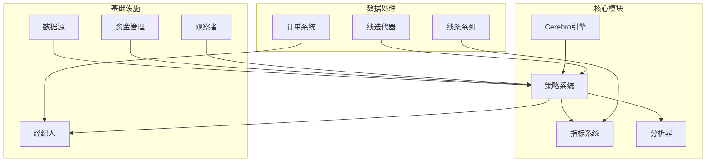
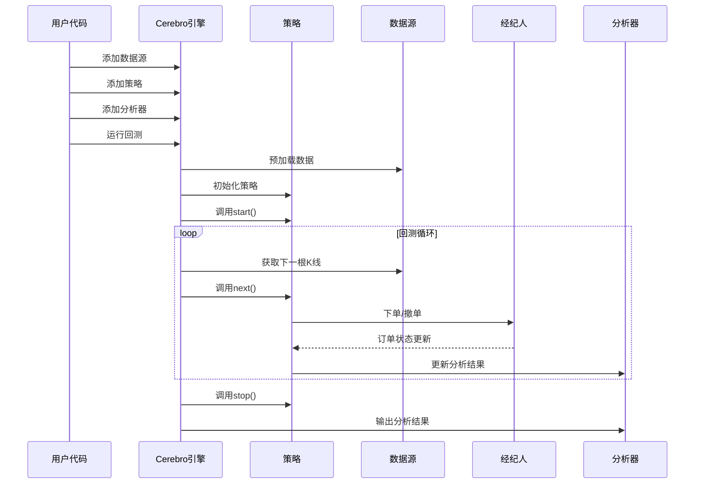
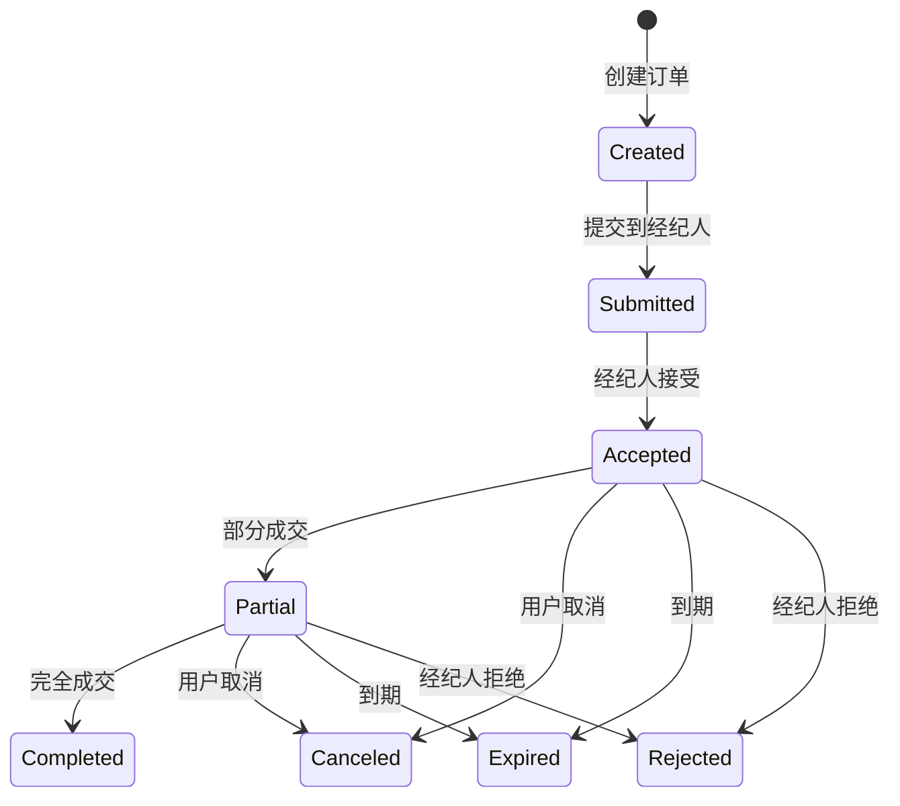
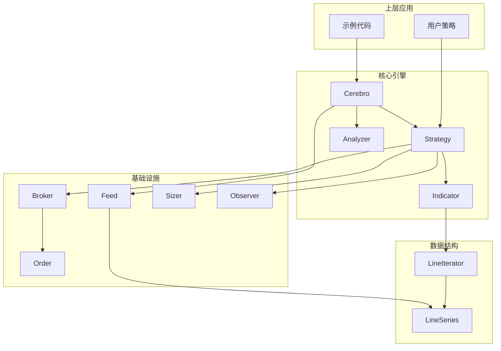

# API参考手册

<cite>
**本文档中引用的文件**
- [backtrader/__init__.py](file://backtrader/__init__.py)
- [backtrader/cerebro.py](file://backtrader/cerebro.py)
- [backtrader/strategy.py](file://backtrader/strategy.py)
- [backtrader/indicator.py](file://backtrader/indicator.py)
- [backtrader/broker.py](file://backtrader/broker.py)
- [backtrader/feed.py](file://backtrader/feed.py)
- [backtrader/analyzer.py](file://backtrader/analyzer.py)
- [backtrader/order.py](file://backtrader/order.py)
- [backtrader/observer.py](file://backtrader/observer.py)
- [backtrader/sizer.py](file://backtrader/sizer.py)
- [backtrader/lineiterator.py](file://backtrader/lineiterator.py)
- [backtrader/lineseries.py](file://backtrader/lineseries.py)
- [samples/strategy-selection/strategy-selection.py](file://samples/strategy-selection/strategy-selection.py)
- [samples/data-pandas/data-pandas.py](file://samples/data-pandas/data-pandas.py)
- [samples/multi-example/mult-values.py](file://samples/multi-example/mult-values.py)
</cite>

## 目录
1. [简介](#简介)
2. [项目结构](#项目结构)
3. [核心组件](#核心组件)
4. [架构概览](#架构概览)
5. [详细组件分析](#详细组件分析)
6. [依赖关系分析](#依赖关系分析)
7. [性能考虑](#性能考虑)
8. [故障排除指南](#故障排除指南)
9. [结论](#结论)
10. [附录](#附录)

## 简介

Backtrader是一个功能强大的Python量化交易回测框架，提供了完整的算法交易开发环境。本API参考手册旨在为开发者提供Backtrader所有公共接口的详细文档，包括Cerebro引擎、策略系统、指标计算、订单管理、数据分析等核心功能。

Backtrader的核心设计理念是模块化和可扩展性，允许用户通过继承基础类来实现自定义功能。框架支持多种数据源、执行器、分析器和可视化工具，适用于从简单技术分析到复杂多资产组合策略的开发需求。

## 项目结构

Backtrader采用清晰的模块化架构，主要组件分布如下：



**图表来源**
- [backtrader/cerebro.py](file://backtrader/cerebro.py#L60-L294)
- [backtrader/strategy.py](file://backtrader/strategy.py#L107-L106)
- [backtrader/indicator.py](file://backtrader/indicator.py#L90-L165)

**章节来源**
- [backtrader/__init__.py](file://backtrader/__init__.py#L24-L91)

## 核心组件

### Cerebro引擎

Cerebro是Backtrader的核心调度引擎，负责协调整个回测流程。它管理数据源、策略、分析器、观察者和执行器之间的交互。

**主要功能特性：**
- 多数据源支持和时间同步
- 策略生命周期管理
- 分析器结果收集
- 可视化输出生成
- 性能优化选项配置

**关键参数配置：**
- `preload`: 是否预加载数据
- `runonce`: 是否启用向量化模式
- `live`: 实时模式开关
- `maxcpus`: 最大CPU核心数
- `stdstats`: 默认观察者开关
- `exactbars`: 内存管理模式

**章节来源**
- [backtrader/cerebro.py](file://backtrader/cerebro.py#L61-L294)

### 策略系统

策略系统提供了灵活的交易逻辑实现框架，支持多种策略类型和生命周期管理。

**核心方法：**
- `start()`: 策略启动回调
- `next()`: 主要交易逻辑
- `nextstart()`: 首次满足最小周期后的回调
- `prenext()`: 最小周期未满足时的回调
- `stop()`: 策略停止回调

**订单管理方法：**
- `buy()`: 创建买入订单
- `sell()`: 创建卖出订单
- `cancel()`: 取消订单
- `order_target_size()`: 目标数量下单

**章节来源**
- [backtrader/strategy.py](file://backtrader/strategy.py#L107-L780)

### 指标系统

指标系统提供了丰富的技术分析工具，支持自定义指标开发。

**核心类层次：**
- `IndicatorBase`: 指标基类
- `LinePlotterIndicator`: 绘图指标
- `MetaIndicator`: 指标元类

**计算模式：**
- 向量化模式 (`runonce=True`)
- 事件驱动模式 (`runonce=False`)
- 预计算模式 (`once()`)

**章节来源**
- [backtrader/indicator.py](file://backtrader/indicator.py#L90-L165)

### 数据源系统

数据源系统支持多种数据格式和来源，包括CSV文件、实时数据流和第三方API。

**主要数据源类型：**
- CSV数据源: `BacktraderCSVData`, `YahooFinanceCSVData`
- Pandas数据源: `PandasData`
- 实时数据源: 支持IB、OANDA等
- 自定义数据源: 通过继承`AbstractDataBase`

**数据处理功能：**
- 时间序列对齐
- 数据过滤和转换
- 重采样和回放
- 会话时间管理

**章节来源**
- [backtrader/feed.py](file://backtrader/feed.py#L122-L598)

## 架构概览

Backtrader采用分层架构设计，确保各组件间的松耦合和高内聚。



**图表来源**
- [backtrader/cerebro.py](file://backtrader/cerebro.py#L296-L408)
- [backtrader/strategy.py](file://backtrader/strategy.py#L393-L493)

## 详细组件分析

### Cerebro引擎API详解

#### 数据管理API

**添加数据源：**
```python
def adddata(self, data, name=None):
    """
    添加数据源到回测引擎
    
    参数:
        data: AbstractDataBase实例
        name: 数据名称（可选）
    
    返回:
        添加的数据源实例
    """
```

**数据链式处理：**
```python
def chaindata(self, *args, **kwargs):
    """
    将多个数据源链接成单一数据流
    支持时间序列对齐和合并
    """
```

**章节来源**
- [backtrader/cerebro.py](file://backtrader/cerebro.py#L752-L800)

#### 策略管理API

**添加策略：**
```python
def addstrategy(self, stratcls, *args, **kwargs):
    """
    添加策略到回测系统
    
    参数:
        stratcls: 策略类或实例
        *args, **kwargs: 策略初始化参数
    
    返回:
        策略实例索引
    """
```

**批量策略执行：**
```python
def optstrategy(self, stratcls, **kwargs):
    """
    执行参数优化策略
    支持多参数组合测试
    """
```

**章节来源**
- [backtrader/cerebro.py](file://backtrader/cerebro.py#L800-L900)

#### 分析器管理API

**添加分析器：**
```python
def addanalyzer(self, ancls, *args, **kwargs):
    """
    添加分析器到策略
    支持嵌套分析器和子分析器
    """
```

**结果获取：**
```python
def run(self, *args, **kwargs):
    """
    执行回测并返回结果
    支持优化模式和性能统计
    """
```

**章节来源**
- [backtrader/cerebro.py](file://backtrader/cerebro.py#L643-L648)

### 策略基类API详解

#### 生命周期方法

**策略初始化：**
```python
def __init__(self):
    """
    策略构造函数
    在此方法中定义指标、参数和初始状态
    """
```

**启动回调：**
```python
def start(self):
    """
    回测开始时调用
    适合进行一次性初始化操作
    """
```

**主循环方法：**
```python
def next(self):
    """
    每个时间步调用的主要交易逻辑
    当所有数据达到最小周期时触发
    """
```

**停止回调：**
```python
def stop(self):
    """
    回测结束时调用
    适合清理资源和输出最终结果
    """
```

**章节来源**
- [backtrader/strategy.py](file://backtrader/strategy.py#L393-L493)

#### 信号处理API

**信号添加：**
```python
def signal_add(self, sigtype, sigcls, *sigargs, **sigkwargs):
    """
    添加信号到策略
    支持多类型信号组合
    """
```

**信号策略集成：**
```python
def signal_strategy(self, stratcls, *args, **kwargs):
    """
    设置信号策略处理器
    支持基于信号的自动化交易
    """
```

**章节来源**
- [backtrader/strategy.py](file://backtrader/strategy.py#L592-L610)

### 指标基类API详解

#### 计算方法

**向量化计算：**
```python
def once(self, start, end):
    """
    向量化计算方法
    在预加载模式下一次性计算所有数据
    """
```

**事件驱动计算：**
```python
def next(self):
    """
    事件驱动计算方法
    每个时间步调用一次
    """
```

**最小周期管理：**
```python
def prenext(self):
    """
    最小周期未满足时的计算
    用于处理指标初始化阶段
    """
```

**章节来源**
- [backtrader/indicator.py](file://backtrader/indicator.py#L126-L137)

#### 参数设置API

**参数定义：**
```python
class MyIndicator(Indicator):
    params = (
        ('period', 30),
        ('multiplier', 2.0),
    )
```

**动态参数调整：**
```python
def __init__(self):
    self.p.period = 50  # 运行时修改参数
```

**章节来源**
- [backtrader/indicator.py](file://backtrader/indicator.py#L90-L165)

### 订单系统API详解

#### 订单类型

**标准订单类型：**
- `Market`: 市价单
- `Limit`: 限价单  
- `Stop`: 止损单
- `StopLimit`: 止损限价单
- `StopTrail`: 移动止损单

**订单状态管理：**
```python
def execute(self, dt, size, price, closed, closedvalue, closedcomm, opened, openedvalue, openedcomm, margin, pnl, psize, pprice):
    """
    订单执行回调
    处理部分成交和完全成交情况
    """
```

**章节来源**
- [backtrader/order.py](file://backtrader/order.py#L528-L594)

#### 订单生命周期



**图表来源**
- [backtrader/order.py](file://backtrader/order.py#L250-L258)

### 经纪人接口API详解

#### 基础接口方法

**资金管理：**
```python
def getcash(self):
    """获取可用现金"""
    pass

def getvalue(self, datas=None):
    """获取总资产价值"""
    pass
```

**订单执行：**
```python
def buy(self, owner, data, size, price=None, plimit=None, exectype=None, valid=None, tradeid=0, oco=None, trailamount=None, trailpercent=None, **kwargs):
    """创建买入订单"""
    pass

def sell(self, owner, data, size, price=None, plimit=None, exectype=None, valid=None, tradeid=0, oco=None, trailamount=None, trailpercent=None, **kwargs):
    """创建卖出订单"""
    pass
```

**章节来源**
- [backtrader/broker.py](file://backtrader/broker.py#L112-L163)

#### 佣金计算

**佣金方案配置：**
```python
def setcommission(self, commission=0.0, margin=None, mult=1.0, commtype=None, percabs=True, stocklike=False, interest=0.0, interest_long=False, leverage=1.0, automargin=False, name=None):
    """
    设置佣金方案
    支持比例和绝对值两种模式
    """
```

**章节来源**
- [backtrader/broker.py](file://backtrader/broker.py#L85-L110)

### 数据源接口API详解

#### 数据加载机制

**数据预加载：**
```python
def preload(self):
    """预加载所有历史数据"""
    while self.load():
        pass
```

**增量加载：**
```python
def load(self):
    """
    加载下一条数据
    返回True表示成功加载，False表示数据结束
    """
```

**章节来源**
- [backtrader/feed.py](file://backtrader/feed.py#L438-L536)

#### 数据过滤和转换

**过滤器链：**
```python
def addfilter(self, p, *args, **kwargs):
    """
    添加数据过滤器
    支持链式过滤和自定义转换
    """
```

**重采样功能：**
```python
def resample(self, **kwargs):
    """重采样到更高时间框架"""
    self.addfilter(Resampler, **kwargs)

def replay(self, **kwargs):
    """回放缓冲区数据"""
    self.addfilter(Replayer, **kwargs)
```

**章节来源**
- [backtrader/feed.py](file://backtrader/feed.py#L592-L596)

### 分析器接口API详解

#### 分析器生命周期

**初始化和清理：**
```python
def start(self):
    """分析器启动时调用"""
    pass

def next(self):
    """每个时间步调用"""
    pass

def stop(self):
    """分析器停止时调用"""
    pass
```

**通知机制：**
```python
def notify_order(self, order):
    """订单通知"""
    pass

def notify_trade(self, trade):
    """交易通知"""
    pass
```

**章节来源**
- [backtrader/analyzer.py](file://backtrader/analyzer.py#L190-L245)

#### 结果输出

**分析结果获取：**
```python
def get_analysis(self):
    """
    返回分析结果字典
    支持自定义结果格式
    """
    return self.rets
```

**打印功能：**
```python
def print(self, *args, **kwargs):
    """使用Writer输出结果"""
    writer = bt.WriterFile(*args, **kwargs)
    writer.start()
    pdct = dict()
    pdct[self.__class__.__name__] = self.get_analysis()
    writer.writedict(pdct)
    writer.stop()
```

**章节来源**
- [backtrader/analyzer.py](file://backtrader/analyzer.py#L255-L286)

### 观察者和资金管理API

#### 观察者系统

**观察者基类：**
```python
class Observer(with_metaclass(MetaObserver, ObserverBase)):
    def start(self):
        """观察者启动"""
        pass
        
    def next(self):
        """每个时间步调用"""
        pass
```

**默认观察者：**
- `BuySell`: 买卖信号显示
- `Trade`: 交易记录
- `Broker`: 现金和价值跟踪

**章节来源**
- [backtrader/observer.py](file://backtrader/observer.py#L46-L69)

#### 资金管理系统

**资金管理基类：**
```python
class Sizer(with_metaclass(MetaParams, object)):
    def getsizing(self, data, isbuy):
        """
        计算下单数量
        基于当前资金和市场条件
        """
        comminfo = self.broker.getcommissioninfo(data)
        return self._getsizing(comminfo, self.broker.getcash(), data, isbuy)
```

**章节来源**
- [backtrader/sizer.py](file://backtrader/sizer.py#L29-L82)

## 依赖关系分析

Backtrader的组件间依赖关系体现了清晰的分层架构：



**图表来源**
- [backtrader/cerebro.py](file://backtrader/cerebro.py#L296-L320)
- [backtrader/strategy.py](file://backtrader/strategy.py#L770-L800)

**章节来源**
- [backtrader/lineiterator.py](file://backtrader/lineiterator.py#L148-L146)
- [backtrader/lineseries.py](file://backtrader/lineseries.py#L444-L449)

## 性能考虑

### 内存优化策略

**精确缓冲模式：**
- `exactbars=True`: 最小化内存占用
- `exactbars=-1`: 保持数据完整性但减少内存
- `exactbars=-2`: 策略级别优化

**运行模式选择：**
- `runonce=True`: 向量化计算，速度更快
- `runonce=False`: 事件驱动，内存更省
- `live=True`: 实时模式，禁用预加载

### 并行计算

**多核优化：**
```python
cerebro.run(maxcpus=4, optdatas=True, optreturn=True)
```

**优化策略：**
- `optdatas=True`: 预加载数据到主进程
- `optreturn=True`: 返回简化对象提高速度

## 故障排除指南

### 常见问题诊断

**数据长度不匹配：**
```python
# 症状：指标计算异常
# 解决：检查数据源时间对齐
```

**订单执行失败：**
```python
# 症状：订单状态为Rejected
# 检查：资金不足、价格限制、市场暂停
```

**内存溢出：**
```python
# 症状：内存使用持续增长
# 解决：启用exactbars模式或减少数据量
```

### 调试技巧

**启用详细日志：**
```python
cerebro.addwriter(bt.WriterFile, csv=True)
```

**交易历史记录：**
```python
strategy.set_tradehistory(True)
```

**章节来源**
- [backtrader/cerebro.py](file://backtrader/cerebro.py#L345-L408)
- [backtrader/strategy.py](file://backtrader/strategy.py#L495-L496)

## 结论

Backtrader提供了一个功能完整、设计优雅的量化交易回测框架。其模块化的架构设计使得开发者可以灵活地组合各种组件来构建复杂的交易策略。

**主要优势：**
- 完整的API文档和示例代码
- 灵活的策略开发框架
- 丰富的技术指标库
- 强大的数据分析能力
- 良好的性能表现

**适用场景：**
- 技术分析研究
- 算法交易策略开发
- 多资产组合管理
- 风险管理和绩效评估

通过深入理解本API参考手册，开发者可以充分利用Backtrader的强大功能来构建高质量的量化交易解决方案。

## 附录

### API索引

**Cerebro核心API：**
- `adddata()`, `addstrategy()`, `addanalyzer()`
- `run()`, `optstrategy()`, `plot()`
- `addwriter()`, `addsizer()`, `setbroker()`

**策略API：**
- `buy()`, `sell()`, `cancel()`
- `notify_order()`, `notify_trade()`
- `getposition()`, `order_target_size()`

**指标API：**
- `once()`, `next()`, `prenext()`
- `plotinfo`, `plotlines`
- `advance()`, `qbuffer()`

**数据源API：**
- `load()`, `preload()`, `next()`
- `addfilter()`, `resample()`, `replay()`
- `date2num()`, `num2date()`

### 实际使用示例

**基础策略示例：**
```python
# 参考: samples/strategy-selection/strategy-selection.py
class St0(bt.SignalStrategy):
    def __init__(self):
        sma1, sma2 = bt.ind.SMA(period=10), bt.ind.SMA(period=30)
        crossover = bt.ind.CrossOver(sma1, sma2)
        self.signal_add(bt.SIGNAL_LONG, crossover)
```

**多数据源示例：**
```python
# 参考: samples/multi-example/mult-values.py
data0 = bt.feeds.YahooFinanceCSVData(dataname=args.data0)
cerebro.adddata(data0, name='d0')
data1 = bt.feeds.YahooFinanceCSVData(dataname=args.data1)
cerebro.adddata(data1, name='d1')
```

**Pandas数据集成：**
```python
# 参考: samples/data-pandas/data-pandas.py
dataframe = pandas.read_csv(datapath, parse_dates=True, index_col=0)
data = bt.feeds.PandasData(dataname=dataframe)
```