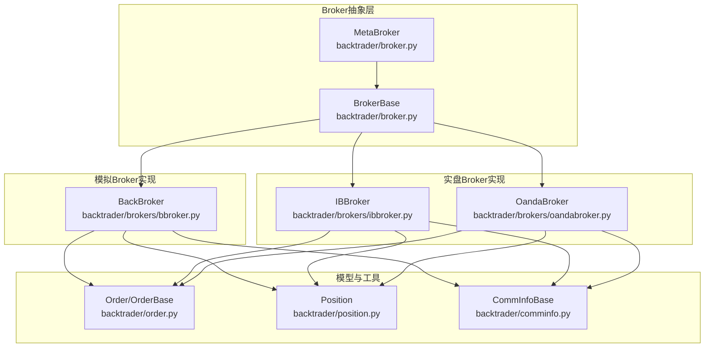
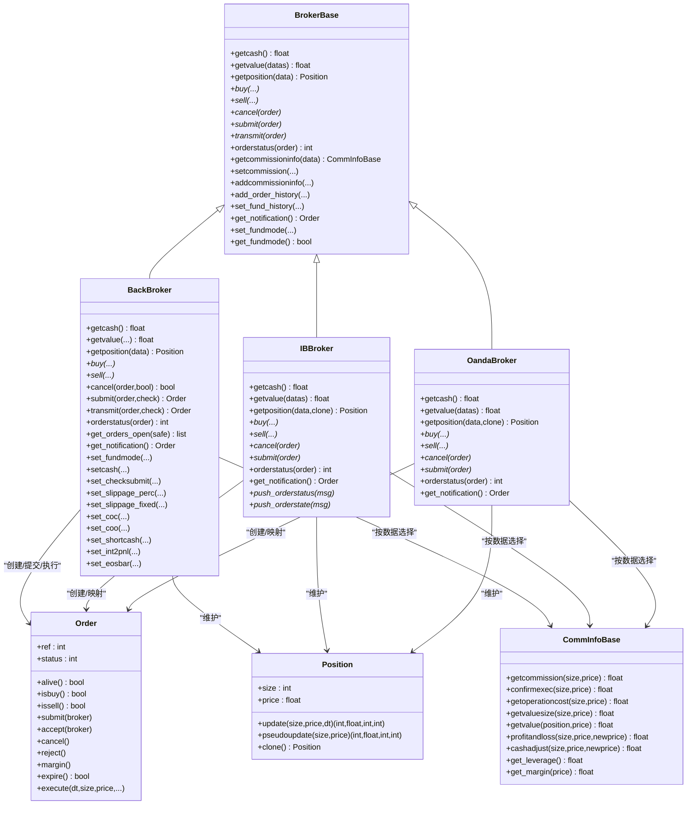
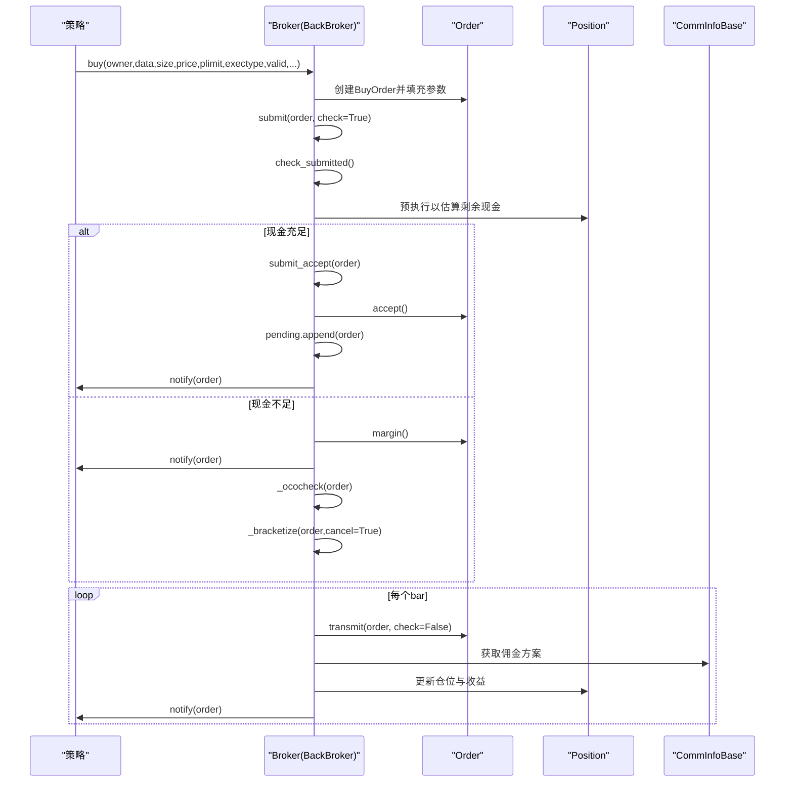
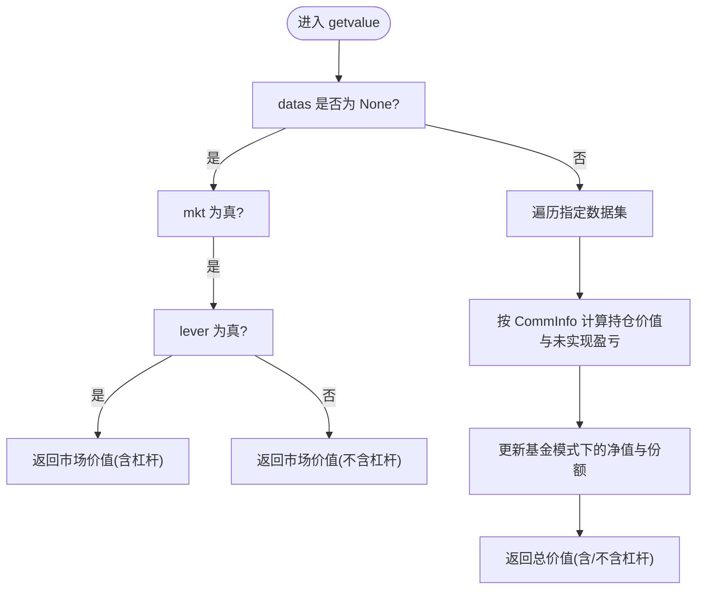
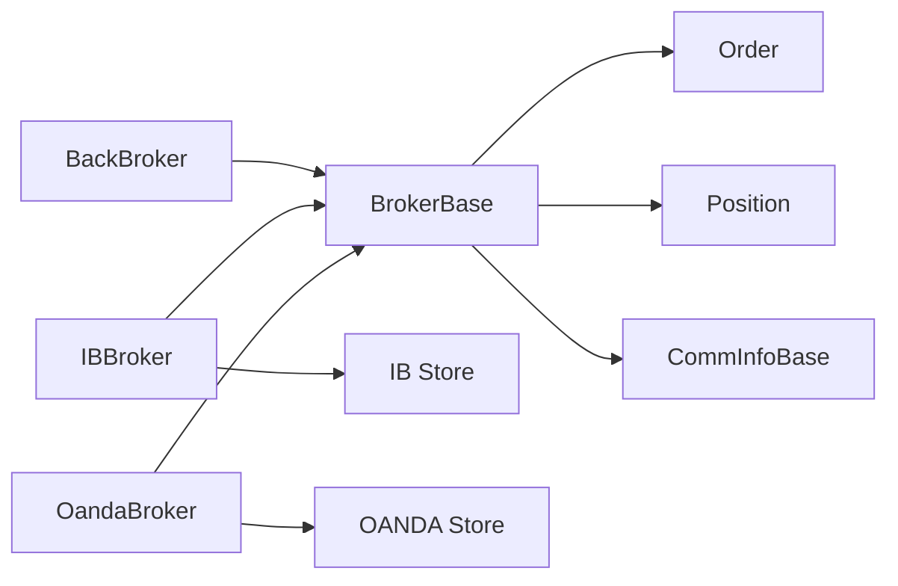

# Broker接口API

<cite>
**本文档引用的文件**
- [backtrader/broker.py](file://backtrader/broker.py)
- [backtrader/brokers/bbroker.py](file://backtrader/brokers/bbroker.py)
- [backtrader/order.py](file://backtrader/order.py)
- [backtrader/position.py](file://backtrader/position.py)
- [backtrader/comminfo.py](file://backtrader/comminfo.py)
- [backtrader/brokers/__init__.py](file://backtrader/brokers/__init__.py)
- [backtrader/brokers/ibbroker.py](file://backtrader/brokers/ibbroker.py)
- [backtrader/brokers/oandabroker.py](file://backtrader/brokers/oandabroker.py)
</cite>

## 目录
1. [简介](#简介)
2. [项目结构](#项目结构)
3. [核心组件](#核心组件)
4. [架构总览](#架构总览)
5. [详细组件分析](#详细组件分析)
6. [依赖关系分析](#依赖关系分析)
7. [性能考虑](#性能考虑)
8. [故障排除指南](#故障排除指南)
9. [结论](#结论)
10. [附录](#附录)

## 简介
本文件为Backtrader框架中Broker接口的完整API参考文档，覆盖订单管理、资金管理、仓位管理、佣金计算、历史数据与通知、账户管理等关键能力，并结合真实Broker实现（如BackBroker、IBBroker、OandaBroker）给出使用说明与最佳实践。文档同时提供顺序图、类图与流程图，帮助读者快速理解Broker的工作机制与调用流程。

## 项目结构
Backtrader的Broker相关代码主要分布在以下模块：
- 基础抽象与元类：backtrader/broker.py
- 模拟Broker实现：backtrader/brokers/bbroker.py
- 订单模型与状态机：backtrader/order.py
- 仓位模型：backtrader/position.py
- 佣金方案基类：backtrader/comminfo.py
- Broker导出入口：backtrader/brokers/__init__.py
- 实盘Broker实现示例：backtrader/brokers/ibbroker.py、backtrader/brokers/oandabroker.py

图表来源
- [backtrader/broker.py](file://backtrader/broker.py#L32-L169)
- [backtrader/brokers/bbroker.py](file://backtrader/brokers/bbroker.py#L36-L1238)
- [backtrader/order.py](file://backtrader/order.py#L222-L642)
- [backtrader/position.py](file://backtrader/position.py#L28-L207)
- [backtrader/comminfo.py](file://backtrader/comminfo.py#L30-L329)
- [backtrader/brokers/__init__.py](file://backtrader/brokers/__init__.py#L27-L43)

章节来源
- [backtrader/broker.py](file://backtrader/broker.py#L32-L169)
- [backtrader/brokers/bbroker.py](file://backtrader/brokers/bbroker.py#L36-L242)
- [backtrader/brokers/__init__.py](file://backtrader/brokers/__init__.py#L27-L43)

## 核心组件
本节概述Broker接口的核心职责与对外API，涵盖订单生命周期、资金与价值计算、佣金方案、通知与历史记录等。

- 订单管理
  - 下单：buy(owner, data, size, price=None, plimit=None, exectype=None, valid=None, tradeid=0, oco=None, trailamount=None, trailpercent=None, **kwargs)
  - 下单：sell(owner, owner, data, size, price=None, plimit=None, exectype=None, valid=None, tradeid=0, oco=None, trailamount=None, trailpercent=None, **kwargs)
  - 取消：cancel(order, bracket=False)
  - 提交：submit(order, check=True)
  - 接受：submit_accept(order)
  - 执行：transmit(order, check=True)
  - 订单状态：orderstatus(order)

- 资金与价值
  - 现金：getcash()
  - 总资产：getvalue(datas=None, mkt=False, lever=False)
  - 基金份额：get_fundshares()
  - 基金净值：get_fundvalue()
  - 杠杆：get_leverage()

- 仓位管理
  - 单数据仓位：getposition(data)
  - 开仓订单集合：get_orders_open(safe=False)

- 佣金与费用
  - 佣金方案：getcommissioninfo(data)
  - 设置佣金：setcommission(commission=0.0, margin=None, mult=1.0, commtype=None, percabs=True, stocklike=False, interest=0.0, interest_long=False, leverage=1.0, automargin=False, name=None)
  - 追加佣金方案：addcommissioninfo(comminfo, name=None)

- 历史与通知
  - 订单历史：add_order_history(orders, notify=False)
  - 基金历史：set_fund_history(fund)
  - 通知队列：get_notification()

- 账户与模式
  - 基金模式开关：set_fundmode(fundmode, fundstartval=None)
  - 基金模式查询：get_fundmode()
  - 参数配置：setcash(cash)、set_checksubmit(checksubmit)、set_slippage_perc(...)、set_slippage_fixed(...)、set_coc(coc)、set_coo(coo)、set_shortcash(shortcash)、set_int2pnl(int2pnl)、set_eosbar(eosbar)

章节来源
- [backtrader/broker.py](file://backtrader/broker.py#L49-L169)
- [backtrader/brokers/bbroker.py](file://backtrader/brokers/bbroker.py#L362-L686)

## 架构总览
下图展示Broker抽象层与具体实现之间的继承与协作关系，以及与订单、仓位、佣金方案的交互。

图表来源
- [backtrader/broker.py](file://backtrader/broker.py#L49-L169)
- [backtrader/brokers/bbroker.py](file://backtrader/brokers/bbroker.py#L36-L1238)
- [backtrader/brokers/ibbroker.py](file://backtrader/brokers/ibbroker.py#L68-L200)
- [backtrader/brokers/oandabroker.py](file://backtrader/brokers/oandabroker.py#L60-L200)
- [backtrader/order.py](file://backtrader/order.py#L222-L642)
- [backtrader/position.py](file://backtrader/position.py#L28-L207)
- [backtrader/comminfo.py](file://backtrader/comminfo.py#L30-L329)

## 详细组件分析

### 订单管理API
- 方法清单与职责
  - buy：创建并提交买单，支持市价、限价、止损、停损限价、跟踪止损等执行类型；支持oco联动、止盈止损组合、跟踪点差等。
  - sell：创建并提交卖单，行为与buy一致。
  - cancel：从待执行队列移除订单并标记取消，触发通知与OCO/Bracket联动处理。
  - submit/transmit：提交订单至系统，可选择是否进行保证金/现金检查；接受后进入待执行队列。
  - orderstatus：根据引用或实例查询订单状态。

- 订单状态机
  - 状态枚举：Created、Submitted、Accepted、Partial、Completed、Canceled、Expired、Margin、Rejected。
  - 生命周期：创建→提交→接受→部分成交→完成或取消/过期/保证金不足→通知与历史记录。

图表来源
- [backtrader/brokers/bbroker.py](file://backtrader/brokers/bbroker.py#L532-L591)
- [backtrader/brokers/bbroker.py](file://backtrader/brokers/bbroker.py#L687-L806)
- [backtrader/order.py](file://backtrader/order.py#L450-L523)
- [backtrader/position.py](file://backtrader/position.py#L124-L207)
- [backtrader/comminfo.py](file://backtrader/comminfo.py#L239-L246)

章节来源
- [backtrader/broker.py](file://backtrader/broker.py#L145-L163)
- [backtrader/brokers/bbroker.py](file://backtrader/brokers/bbroker.py#L647-L686)
- [backtrader/order.py](file://backtrader/order.py#L250-L523)

### 资金管理API
- getcash/getvalue
  - getcash：返回当前可用现金。
  - getvalue：返回总资产，支持按数据集聚合、市场价值、杠杆价值等维度。
- 基金模式
  - set_fundmode/get_fundmode：启用/查询基金模式，用于按基金份额与净值评估收益。
  - get_fundshares/get_fundvalue：基金份额与净值。
- 现金注入
  - add_cash：向系统注入/提取现金，支持负值表示提取。

图表来源
- [backtrader/brokers/bbroker.py](file://backtrader/brokers/bbroker.py#L405-L488)
- [backtrader/comminfo.py](file://backtrader/comminfo.py#L206-L228)

章节来源
- [backtrader/broker.py](file://backtrader/broker.py#L112-L128)
- [backtrader/brokers/bbroker.py](file://backtrader/brokers/bbroker.py#L362-L417)

### 仓位管理API
- getposition(data)
  - 返回指定数据的Position对象，包含size与price等。
- get_orders_open(safe=False)
  - 返回未完全成交的订单集合，safe=True时返回克隆副本避免外部修改。

章节来源
- [backtrader/broker.py](file://backtrader/broker.py#L142-L143)
- [backtrader/brokers/bbroker.py](file://backtrader/brokers/bbroker.py#L492-L505)
- [backtrader/position.py](file://backtrader/position.py#L28-L207)

### 佣金计算API
- getcommissioninfo(data)
  - 按数据名匹配或默认方案返回CommInfoBase。
- setcommission/addcommissioninfo
  - 设置/追加佣金方案，支持百分比/固定费用、保证金、杠杆、自动保证金等。
- CommInfoBase核心方法
  - getcommission/confirmexec：按成交量与价格计算佣金。
  - getoperationcost/getvaluesize/getvalue：按Stock-like/Futures-like场景计算操作成本、市值与持仓价值。
  - profitandloss/cashadjust：计算平仓盈亏与按价格差异调整的现金变动。
  - get_leverage/get_margin：杠杆与保证金查询。

章节来源
- [backtrader/broker.py](file://backtrader/broker.py#L77-L111)
- [backtrader/comminfo.py](file://backtrader/comminfo.py#L30-L329)

### 历史数据与通知API
- add_order_history：批量添加订单历史，支持通知开关。
- set_fund_history：设置基金历史序列，驱动净值与份额回放。
- get_notification：从通知队列取出下一个订单事件，用于观察器与策略消费。

章节来源
- [backtrader/broker.py](file://backtrader/broker.py#L69-L76)
- [backtrader/brokers/bbroker.py](file://backtrader/brokers/bbroker.py#L632-L646)
- [backtrader/brokers/bbroker.py](file://backtrader/brokers/bbroker.py#L283-L289)

### 账户与参数配置API
- setcash/set_checksubmit/set_slippage_perc/set_slippage_fixed/set_coc/set_coo/set_shortcash/set_int2pnl/set_eosbar
  - 配置初始现金、提交检查、滑点、Cheat-On-Close/Open、短期现金处理、利息归属、会话结束bar处理等。
- set_fundmode/set_fundstartval
  - 启用基金模式并设置起始净值。

章节来源
- [backtrader/brokers/bbroker.py](file://backtrader/brokers/bbroker.py#L368-L369)
- [backtrader/brokers/bbroker.py](file://backtrader/brokers/bbroker.py#L326-L361)
- [backtrader/brokers/bbroker.py](file://backtrader/brokers/bbroker.py#L291-L304)

### 实盘Broker实现要点
- IBBroker/OandaBroker
  - 将内部Order映射为实盘订单对象，接收推送的状态消息并转换为内部订单状态。
  - 支持通知边界标记、过期检测、Bracket联动取消等。

章节来源
- [backtrader/brokers/ibbroker.py](file://backtrader/brokers/ibbroker.py#L68-L200)
- [backtrader/brokers/ibbroker.py](file://backtrader/brokers/ibbroker.py#L393-L430)
- [backtrader/brokers/ibbroker.py](file://backtrader/brokers/ibbroker.py#L565-L575)
- [backtrader/brokers/oandabroker.py](file://backtrader/brokers/oandabroker.py#L149-L200)

## 依赖关系分析
- 组件耦合
  - BrokerBase通过MetaBroker实现别名映射（如get_cash↔getcash），提升API一致性。
  - BackBroker强依赖Order/Position/CommInfoBase，形成完整的下单-执行-结算闭环。
  - 实盘Broker通过消息推送桥接外部系统状态，保持与内部状态机一致。
- 外部依赖
  - 实盘Broker依赖对应Store（IB、OANDA等）提供的网络与认证能力。
- 循环依赖
  - 无直接循环依赖；通知与状态转换通过队列与引用解耦。

图表来源
- [backtrader/broker.py](file://backtrader/broker.py#L32-L47)
- [backtrader/brokers/bbroker.py](file://backtrader/brokers/bbroker.py#L36-L1238)
- [backtrader/brokers/ibbroker.py](file://backtrader/brokers/ibbroker.py#L30-L42)
- [backtrader/brokers/oandabroker.py](file://backtrader/brokers/oandabroker.py#L29-L38)

章节来源
- [backtrader/broker.py](file://backtrader/broker.py#L32-L47)
- [backtrader/brokers/__init__.py](file://backtrader/brokers/__init__.py#L27-L43)

## 性能考虑
- 滑点与填充
  - 支持百分比/固定点数滑点，可配置开盘价滑点、匹配边界与越界滑点策略，减少不必要回测波动。
- 保证金检查
  - 提交前可开启checksubmit，避免无效执行导致的额外计算。
- 基金模式
  - 在基金模式下，净值与份额随资金变动实时更新，适合长周期收益归因分析。
- 通知与历史
  - 使用队列进行通知边界标记，降低状态同步开销；批量历史导入可减少逐条通知成本。

## 故障排除指南
- 订单被拒绝/保证金不足
  - 现象：订单状态变为Margin或Rejected。
  - 排查：确认cash与CommInfoBase的保证金/费用计算是否正确；检查滑点与填充策略。
- 订单未成交
  - 现象：订单长时间处于Submitted/Accepted。
  - 排查：确认执行类型与价格条件（限价、止损触发）；检查数据流与会话结束bar设置。
- 实盘Broker状态不同步
  - 现象：内部状态与外部推送不一致。
  - 排查：检查push_orderstatus/push_orderstate处理逻辑；确保通知边界标记与去重逻辑生效。

章节来源
- [backtrader/brokers/bbroker.py](file://backtrader/brokers/bbroker.py#L558-L591)
- [backtrader/brokers/ibbroker.py](file://backtrader/brokers/ibbroker.py#L413-L430)
- [backtrader/brokers/ibbroker.py](file://backtrader/brokers/ibbroker.py#L565-L575)

## 结论
Broker接口在Backtrader中承担“下单—执行—结算—反馈”的核心职责。通过抽象层与多种实现（模拟/实盘），用户可在统一API下完成策略开发与部署。建议在策略中：
- 明确佣金方案与滑点策略；
- 合理配置资金与杠杆；
- 使用通知与历史接口进行可观测性与回测验证；
- 在实盘环境中配合Store与消息推送完善状态同步。

## 附录
- 常用参数速览
  - 现金：cash（初始）、checksubmit（提交检查）、fundmode/fundstartval（基金模式）。
  - 滑点：slip_perc/slip_fixed/slip_open/slip_match/slip_limit/slip_out。
  - 作弊：coc/coo（Cheat-On-Close/Open）。
  - 其他：int2pnl、shortcash、eosbar。

章节来源
- [backtrader/brokers/bbroker.py](file://backtrader/brokers/bbroker.py#L224-L242)