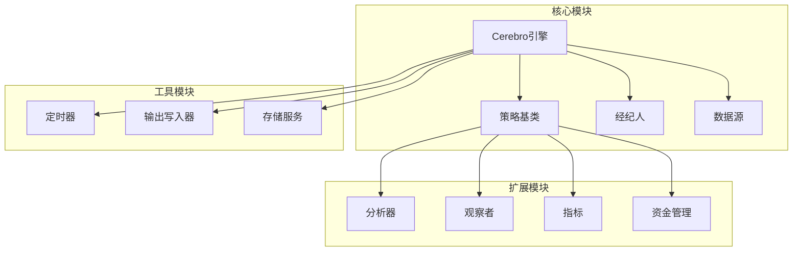
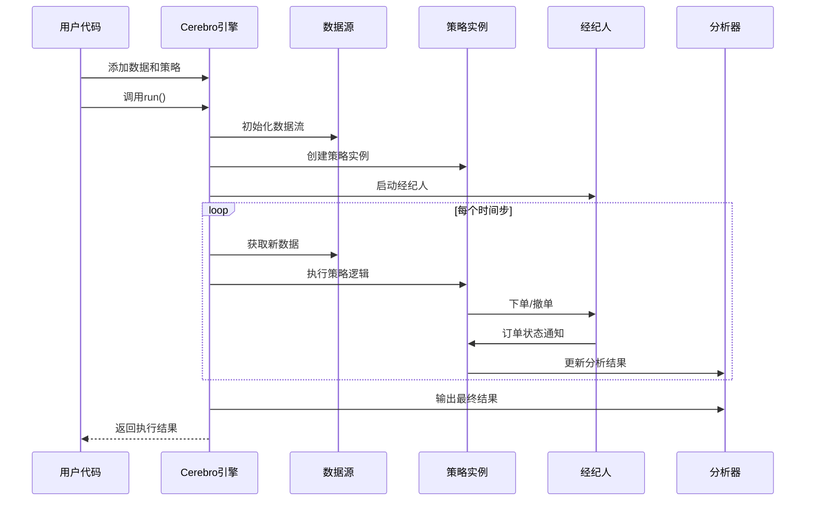
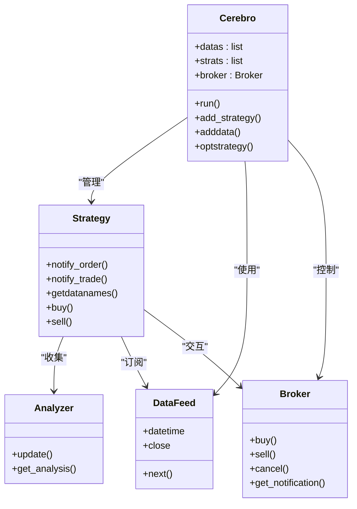

# Cerebro引擎API

<cite>
**本文档引用的文件**
- [backtrader/cerebro.py](file://backtrader/cerebro.py)
- [backtrader/strategy.py](file://backtrader/strategy.py)
- [backtrader/errors.py](file://backtrader/errors.py)
- [samples/optimization/optimization.py](file://samples/optimization/optimization.py)
- [samples/multidata-strategy/multidata-strategy.py](file://samples/multidata-strategy/multidata-strategy.py)
</cite>

## 目录
1. [简介](#简介)
2. [项目结构](#项目结构)
3. [核心组件](#核心组件)
4. [架构概览](#架构概览)
5. [详细组件分析](#详细组件分析)
6. [依赖关系分析](#依赖关系分析)
7. [性能考虑](#性能考虑)
8. [故障排除指南](#故障排除指南)
9. [结论](#结论)
10. [附录](#附录)

## 简介

Cerebro引擎是Backtrader框架的核心执行引擎，负责协调数据流、策略执行、订单管理和分析器运行。本文档提供了Cerebro类的完整API参考，涵盖所有公共方法、属性配置和使用模式。

## 项目结构

Backtrader项目采用模块化设计，Cerebro引擎位于核心模块中：



**图表来源**
- [backtrader/cerebro.py](file://backtrader/cerebro.py#L60-L327)
- [backtrader/strategy.py](file://backtrader/strategy.py#L107-L105)

## 核心组件

### Cerebro类概述

Cerebro类是Backtrader的主控制器，负责管理整个交易回测流程。它继承自MetaParams元类，支持丰富的配置参数和扩展功能。

**章节来源**
- [backtrader/cerebro.py](file://backtrader/cerebro.py#L60-L294)

### 主要属性配置

Cerebro引擎提供了全面的配置选项，用于控制执行行为和性能优化：

| 参数名 | 默认值 | 类型 | 描述 |
|--------|--------|------|------|
| `preload` | `True` | 布尔值 | 是否预加载数据到内存 |
| `runonce` | `True` | 布尔值 | 启用向量化运行模式 |
| `live` | `False` | 布尔值 | 实时模式开关 |
| `maxcpus` | `None` | 整数 | 优化时使用的CPU核心数 |
| `stdstats` | `True` | 布尔值 | 自动添加标准观察者 |
| `exactbars` | `False` | 整数/布尔值 | 内存节省模式设置 |

**章节来源**
- [backtrader/cerebro.py](file://backtrader/cerebro.py#L61-L272)

## 架构概览

Cerebro引擎采用分层架构设计，确保各组件间的松耦合和高内聚：



**图表来源**
- [backtrader/cerebro.py](file://backtrader/cerebro.py#L1030-L1163)
- [backtrader/cerebro.py](file://backtrader/cerebro.py#L1171-L1338)

## 详细组件分析

### 数据管理API

#### adddata() 方法

adddata()方法用于向Cerebro引擎添加数据源，支持多种数据格式和命名机制。

**方法签名**: `adddata(data, name=None)`

**参数说明**:
- `data`: 数据源实例，必须是有效的数据提供者
- `name`: 可选的数据名称，用于标识和绘图

**返回值**: 返回添加的数据实例

**使用示例**:
```python
# 基本用法
data = bt.feeds.YahooFinanceCSVData(dataname='AAPL.csv')
cerebro.adddata(data)

# 命名数据源
cerebro.adddata(data, name='AAPL')
```

**章节来源**
- [backtrader/cerebro.py](file://backtrader/cerebro.py#L752-L774)

#### getdatanames() 和 datas 属性

获取系统中所有数据源的名称列表和访问接口。

**方法签名**: `getdatanames()`

**返回值**: 数据源名称列表

**属性访问**: `datas` 属性提供对数据源的直接访问

**章节来源**
- [backtrader/strategy.py](file://backtrader/strategy.py#L758-L768)

### 策略管理API

#### add_strategy() 方法

添加策略到Cerebro引擎，支持参数传递和实例化。

**方法签名**: `add_strategy(strategy, *args, **kwargs)`

**参数说明**:
- `strategy`: 策略类（非实例）
- `*args, **kwargs`: 传递给策略构造函数的参数

**返回值**: 策略索引号，用于后续关联其他组件

**使用示例**:
```python
# 添加简单策略
cerebro.add_strategy(SimpleStrategy, period=20, stake=100)

# 添加带参数的策略
cerebro.add_strategy(MultiSignalStrategy, 
                     sma_period=(10, 20, 30),
                     rsi_threshold=(30, 70))
```

**章节来源**
- [backtrader/cerebro.py](file://backtrader/cerebro.py#L908-L920)

#### getstrategies() 和 strategy 属性

获取系统中已添加的策略信息。

**方法签名**: `getstrategies()` (内部使用)

**属性访问**: `strategy` 属性提供对当前策略的访问

**章节来源**
- [backtrader/cerebro.py](file://backtrader/cerebro.py#L908-L920)

### 运行控制API

#### run() 方法

核心执行方法，启动完整的回测或实盘交易流程。

**方法签名**: `run(**kwargs)`

**参数说明**:
- `**kwargs`: 运行时覆盖的配置参数

**返回值**:
- 非优化模式：策略实例列表
- 优化模式：嵌套的策略实例列表

**运行模式控制**:
- `preload`: 控制数据预加载
- `runonce`: 控制向量化执行
- `live`: 启用实时模式

**章节来源**
- [backtrader/cerebro.py](file://backtrader/cerebro.py#L1030-L1163)

#### runstop() 方法

请求停止当前运行的策略执行。

**方法签名**: `runstop()`

**使用场景**: 在策略内部或其他线程中安全地停止执行

**章节来源**
- [backtrader/cerebro.py](file://backtrader/cerebro.py#L1025-L1028)

### 优化API

#### optstrategy() 方法

设置策略优化参数，支持多维参数空间搜索。

**方法签名**: `optstrategy(strategy, *args, **kwargs)`

**参数说明**:
- `strategy`: 要优化的策略类
- `*args, **kwargs`: 优化参数，必须是可迭代对象

**优化规则**:
- 单值参数：`(value,)` 形式
- 多值参数：`(val1, val2, val3)`
- 范围参数：`range(start, end)`

**使用示例**:
```python
# 一维优化
cerebro.optstrategy(MyStrategy, period=(10, 15, 20, 25))

# 多维优化
cerebro.optstrategy(MyStrategy, 
                   sma_period=range(10, 30),
                   rsi_period=range(5, 15))
```

**章节来源**
- [backtrader/cerebro.py](file://backtrader/cerebro.py#L859-L906)

#### optimize() 方法

执行策略优化流程，支持并行计算。

**方法签名**: `optimize()`

**性能优化特性**:
- `optdatas`: 优化数据预加载
- `optreturn`: 优化返回值格式
- `maxcpus`: 并行CPU核心数

**章节来源**
- [backtrader/cerebro.py](file://backtrader/cerebro.py#L1011-L1012)

### 回调函数注册API

#### 通知方法

Cerebro引擎提供多种通知回调机制：

**notify_order() 方法**
- 接收订单状态变化通知
- 在策略类中重写以处理订单事件

**notify_trade() 方法**
- 接收交易完成通知
- 提供交易详情和收益信息

**notify_store() 方法**
- 接收存储服务通知
- 处理外部数据源状态变化

**notify_data() 方法**
- 接收数据源状态通知
- 处理数据连接和状态变化

**章节来源**
- [backtrader/strategy.py](file://backtrader/strategy.py#L47-L53)
- [backtrader/strategy.py](file://backtrader/strategy.py#L750-L756)

### 定时器API

#### add_timer() 方法

设置定时器触发机制，支持复杂的时间调度。

**方法签名**: `add_timer(when, offset, repeat, weekdays, monthdays, allow, tzdata, strats, cheat, *args, **kwargs)`

**定时器类型**:
- 固定时间：`datetime.time` 实例
- 会话时间：`SESSION_START`, `SESSION_END`
- 周期重复：通过 `repeat` 参数设置

**高级功能**:
- `cheat` 参数：允许在开盘前执行
- `tzdata` 参数：时区处理
- `strats` 参数：同时通知策略

**章节来源**
- [backtrader/cerebro.py](file://backtrader/cerebro.py#L446-L543)

### 数据预处理API

#### replaydata() 和 resampledata() 方法

处理数据重播和重采样需求。

**replaydata() 方法**:
- 将高频率数据重播为低频率
- 支持时间框架转换

**resampledata() 方法**:
- 对数据进行重采样处理
- 保持原始数据完整性

**章节来源**
- [backtrader/cerebro.py](file://backtrader/cerebro.py#L812-L848)

## 依赖关系分析

Cerebro引擎与各个组件之间的依赖关系如下：



**图表来源**
- [backtrader/cerebro.py](file://backtrader/cerebro.py#L300-L327)
- [backtrader/strategy.py](file://backtrader/strategy.py#L107-L105)

**章节来源**
- [backtrader/cerebro.py](file://backtrader/cerebro.py#L300-L327)
- [backtrader/strategy.py](file://backtrader/strategy.py#L107-L105)

## 性能考虑

### 内存优化策略

Cerebro引擎提供了多种内存节省模式：

1. **exactbars 模式** (`exactbars=1`): 最大化内存节省
2. **部分保存模式** (`exactbars=-1`): 保留关键数据
3. **条件保存模式** (`exactbars=-2`): 基于绘图需求保存

### 并行计算优化

- `maxcpus` 参数控制优化时的并行度
- `optdatas` 和 `optreturn` 参数优化数据预加载和返回值格式
- 多进程池自动管理CPU资源分配

### 执行模式选择

- **向量化模式** (`runonce=True`): 最高性能，适合大数据集
- **事件驱动模式** (`runonce=False`): 更精确的时序控制
- **实时模式** (`live=True`): 适用于实盘交易

## 故障排除指南

### 常见错误类型

**BacktraderError**: 基础异常类，所有其他异常的父类

**StrategySkipError**: 策略跳过异常，在策略初始化阶段抛出

**ModuleImportError**: 模块导入失败异常

**章节来源**
- [backtrader/errors.py](file://backtrader/errors.py#L28-L51)

### 错误处理最佳实践

1. **策略初始化检查**: 在 `__init__` 方法中验证参数有效性
2. **数据完整性验证**: 确保数据源正确加载和同步
3. **内存使用监控**: 使用 `exactbars` 参数控制内存占用
4. **异常捕获**: 合理捕获和处理运行时异常

### 调试技巧

- 使用 `cerebro.run(runonce=False)` 切换到事件驱动模式进行调试
- 启用 `tradehistory` 参数跟踪交易历史
- 利用 `notify_*` 方法接收详细的系统状态通知

## 结论

Cerebro引擎提供了完整而强大的交易回测和实盘交易基础设施。其模块化设计、灵活的配置选项和丰富的扩展能力使其成为Backtrader框架的核心支柱。通过合理使用本文档介绍的API，开发者可以构建高效、可靠的交易策略测试和部署系统。

## 附录

### 实际使用示例

以下是一些基于真实示例文件的实际使用模式：

**基础回测示例**:
```python
import backtrader as bt

# 创建Cerebro引擎实例
cerebro = bt.Cerebro()

# 添加数据
data = bt.feeds.YahooFinanceCSVData(dataname='AAPL.csv')
cerebro.adddata(data)

# 添加策略
cerebro.add_strategy(MyStrategy, period=20)

# 设置经纪商参数
cerebro.broker.setcash(100000)
cerebro.broker.setcommission(0.001)

# 运行回测
results = cerebro.run()
```

**优化示例**:
```python
# 设置优化参数
cerebro.optstrategy(MyStrategy, 
                   period=range(10, 30),
                   stake=(10, 50, 100))

# 执行优化
opt_results = cerebro.run()
```

**章节来源**
- [samples/multidata-strategy/multidata-strategy.py](file://samples/multidata-strategy/multidata-strategy.py#L117-L164)
- [samples/optimization/optimization.py](file://samples/optimization/optimization.py#L51-L101)