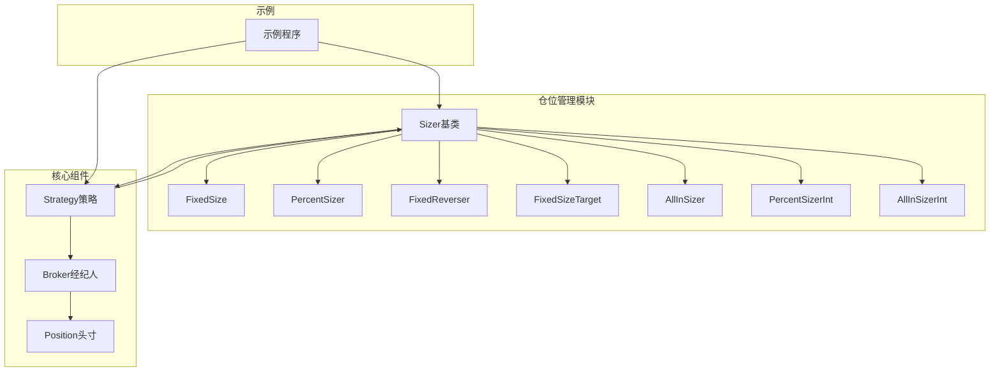
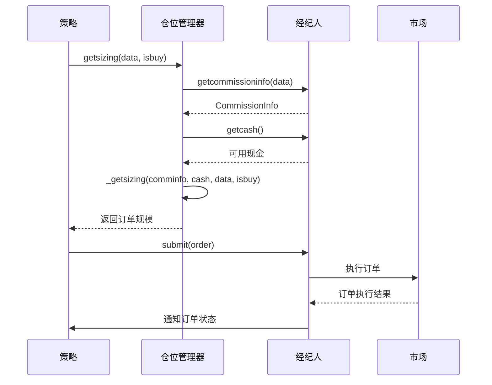
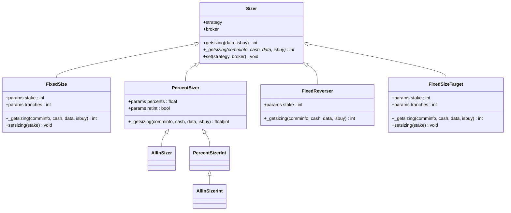
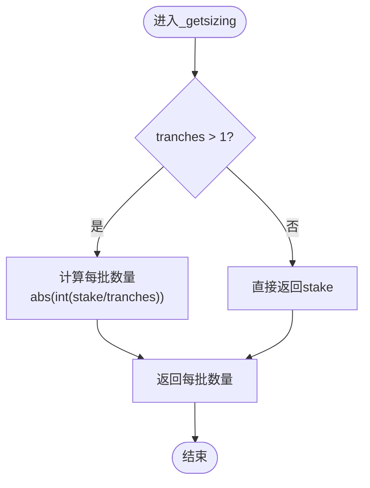
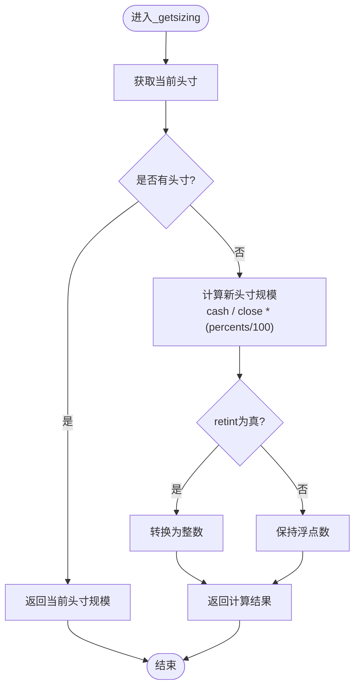
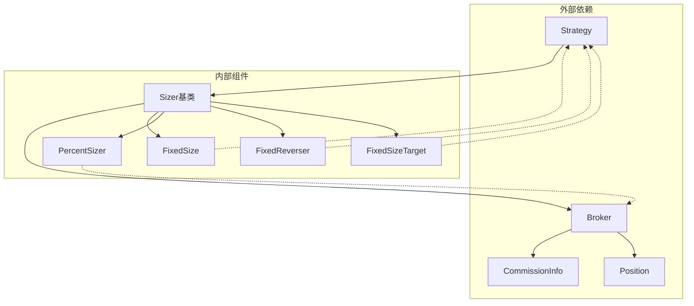

# 仓位管理API

<cite>
**本文档引用的文件**
- [sizer.py](file://backtrader/sizer.py)
- [fixedsize.py](file://backtrader/sizers/fixedsize.py)
- [percents_sizer.py](file://backtrader/sizers/percents_sizer.py)
- [__init__.py](file://backtrader/sizers/__init__.py)
- [strategy.py](file://backtrader/strategy.py)
- [broker.py](file://backtrader/broker.py)
- [position.py](file://backtrader/position.py)
- [sizertest.py](file://samples/sizertest/sizertest.py)
</cite>

## 目录
1. [简介](#简介)
2. [项目结构](#项目结构)
3. [核心组件](#核心组件)
4. [架构概览](#架构概览)
5. [详细组件分析](#详细组件分析)
6. [依赖关系分析](#依赖关系分析)
7. [性能考虑](#性能考虑)
8. [故障排除指南](#故障排除指南)
9. [结论](#结论)
10. [附录：完整API参考](#附录完整api参考)

## 简介

Backtrader的仓位管理系统是量化交易框架的核心组成部分，负责控制订单规模和风险管理。本文档提供了完整的Sizer基类API参考，包括仓位计算方法、配置API、参数获取方法、内置仓位管理器、验证机制、调整方法和通知机制的详细说明。

仓位管理器（Sizers）在策略执行过程中动态决定每次交易的订单规模，确保交易符合预设的风险管理和资金管理规则。系统支持多种内置的仓位管理策略，从简单的固定数量到基于账户价值的百分比策略。

## 项目结构

Backtrader的仓位管理相关文件组织如下：



**图表来源**
- [sizer.py](file://backtrader/sizer.py#L29-L84)
- [fixedsize.py](file://backtrader/sizers/fixedsize.py#L27-L109)
- [percents_sizer.py](file://backtrader/sizers/percents_sizer.py#L29-L91)

**章节来源**
- [sizer.py](file://backtrader/sizer.py#L1-L85)
- [__init__.py](file://backtrader/sizers/__init__.py#L24-L29)

## 核心组件

### Sizer基类

Sizer基类是所有仓位管理器的抽象基类，定义了标准的接口和生命周期管理。它提供了以下核心功能：

- **上下文设置**：通过`set()`方法注入策略和经纪人上下文
- **尺寸计算**：通过`getsizing()`方法协调底层计算逻辑
- **扩展点**：子类必须实现`_getsizing()`方法

### 内置仓位管理器

系统提供了多种内置的仓位管理器，满足不同的交易需求：

1. **FixedSize**：固定数量的仓位管理
2. **PercentSizer**：基于账户价值百分比的仓位管理
3. **FixedReverser**：反转策略的固定数量管理
4. **FixedSizeTarget**：目标头寸大小的管理

**章节来源**
- [sizer.py](file://backtrader/sizer.py#L29-L84)
- [fixedsize.py](file://backtrader/sizers/fixedsize.py#L27-L109)
- [percents_sizer.py](file://backtrader/sizers/percents_sizer.py#L29-L91)

## 架构概览



**图表来源**
- [sizer.py](file://backtrader/sizer.py#L50-L52)
- [broker.py](file://backtrader/broker.py#L77-L83)

## 详细组件分析

### Sizer基类详细分析

#### 核心方法

**getsizing()方法**
- **功能**：协调仓位计算流程
- **参数**：
  - `data`：目标数据源
  - `isbuy`：布尔值，True表示买入，False表示卖出
- **返回值**：实际要执行的订单规模

**_getsizing()方法**
- **功能**：子类必须实现的核心计算逻辑
- **参数**：
  - `comminfo`：佣金信息对象
  - `cash`：可用现金
  - `data`：目标数据
  - `isbuy`：交易方向
- **返回值**：订单规模（绝对值）

**set()方法**
- **功能**：设置策略和经纪人上下文
- **参数**：
  - `strategy`：策略实例
  - `broker`：经纪人实例
- **作用**：为子类提供访问策略API的能力

#### 类关系图



**图表来源**
- [sizer.py](file://backtrader/sizer.py#L29-L84)
- [fixedsize.py](file://backtrader/sizers/fixedsize.py#L27-L109)
- [percents_sizer.py](file://backtrader/sizers/percents_sizer.py#L29-L91)

**章节来源**
- [sizer.py](file://backtrader/sizer.py#L29-L84)

### FixedSize仓位管理器

#### 功能特性
- **固定数量**：无论市场条件如何，始终返回相同的订单规模
- **分批交易**：支持通过`tranches`参数实现分批建仓
- **兼容性**：提供`setsizing()`方法用于向后兼容

#### 参数配置
- `stake`：默认值1，表示每次交易的基础数量
- `tranches`：默认值1，表示分批次数

#### 计算逻辑



**图表来源**
- [fixedsize.py](file://backtrader/sizers/fixedsize.py#L43-L47)

**章节来源**
- [fixedsize.py](file://backtrader/sizers/fixedsize.py#L27-L56)

### PercentSizer仓位管理器

#### 功能特性
- **百分比策略**：基于账户价值的百分比计算订单规模
- **智能处理**：区分首次建仓和已有头寸的处理逻辑
- **精度控制**：支持整数或浮点数返回

#### 参数配置
- `percents`：默认值20，表示账户价值的百分比
- `retint`：默认值False，控制返回值类型

#### 计算逻辑



**图表来源**
- [percents_sizer.py](file://backtrader/sizers/percents_sizer.py#L44-L54)

**章节来源**
- [percents_sizer.py](file://backtrader/sizers/percents_sizer.py#L29-L91)

### FixedReverser仓位管理器

#### 功能特性
- **反转策略**：根据现有头寸状态决定订单规模
- **智能逻辑**：开仓时使用基础stake，反转时使用2×stake

#### 计算逻辑
- **开仓**：返回`stake`
- **反转**：返回`2 × stake`
- **平仓**：逻辑由策略层处理

**章节来源**
- [fixedsize.py](file://backtrader/sizers/fixedsize.py#L59-L76)

### FixedSizeTarget仓位管理器

#### 功能特性
- **目标管理**：专注于达到特定的目标头寸规模
- **分批实现**：支持分批建仓到目标规模
- **边界控制**：确保不会超过目标规模

**章节来源**
- [fixedsize.py](file://backtrader/sizers/fixedsize.py#L78-L109)

## 依赖关系分析



**图表来源**
- [sizer.py](file://backtrader/sizer.py#L47-L48)
- [broker.py](file://backtrader/broker.py#L77-L83)

**章节来源**
- [strategy.py](file://backtrader/strategy.py#L102-L102)
- [broker.py](file://backtrader/broker.py#L77-L83)

## 性能考虑

### 计算复杂度
- **时间复杂度**：O(1)，所有仓位管理器的计算都是常数时间
- **空间复杂度**：O(1)，不创建额外的数据结构

### 优化建议
1. **缓存策略**：对于复杂的仓位管理器，可以考虑缓存计算结果
2. **批量处理**：在多数据源场景下，避免重复计算相同的参数
3. **内存管理**：注意不要在仓位管理器中存储大量临时数据

## 故障排除指南

### 常见问题

**问题1：仓位管理器未生效**
- 检查是否正确调用了`cerebro.addsizer()`
- 确认策略中没有覆盖默认的仓位管理器设置

**问题2：订单规模异常**
- 验证`_getsizing()`方法的返回值是否为正数
- 检查佣金和滑点对订单规模的影响

**问题3：分批交易问题**
- 确认`tranches`参数设置合理
- 检查每批数量的计算逻辑

### 调试技巧
1. 在`_getsizing()`方法中添加日志输出
2. 使用简单的测试策略验证仓位管理器行为
3. 检查经纪人提供的现金和头寸信息

**章节来源**
- [sizertest.py](file://samples/sizertest/sizertest.py#L70-L101)

## 结论

Backtrader的仓位管理系统提供了灵活而强大的工具，允许开发者精确控制交易规模和风险管理。通过理解基类接口和内置管理器的实现原理，用户可以：

1. **选择合适的策略**：根据交易目标选择适当的仓位管理器
2. **自定义扩展**：基于基类开发符合特定需求的仓位管理策略
3. **优化性能**：利用系统的高效实现获得最佳执行性能
4. **确保可靠性**：通过完善的错误处理和验证机制保证交易安全

## 附录：完整API参考

### Sizer基类API

| 方法 | 参数 | 返回值 | 描述 |
|------|------|--------|------|
| `getsizing(data, isbuy)` | `data`: 数据源, `isbuy`: 是否买入 | `int`: 订单规模 | 协调仓位计算流程 |
| `_getsizing(comminfo, cash, data, isbuy)` | `comminfo`: 佣金信息, `cash`: 现金, `data`: 数据, `isbuy`: 方向 | `int`: 订单规模 | 子类必须实现的核心方法 |
| `set(strategy, broker)` | `strategy`: 策略实例, `broker`: 经纪人实例 | `void` | 设置上下文 |

### FixedSize API

| 方法/属性 | 参数 | 返回值 | 描述 |
|-----------|------|--------|------|
| `params.stake` | 无 | `int` | 默认订单规模 |
| `params.tranches` | 无 | `int` | 分批次数 |
| `_getsizing(...)` | 同基类 | `int` | 计算订单规模 |
| `setsizing(stake)` | `stake`: 新规模 | `void` | 更新订单规模 |

### PercentSizer API

| 方法/属性 | 参数 | 返回值 | 描述 |
|-----------|------|--------|------|
| `params.percents` | 无 | `float` | 百分比值 |
| `params.retint` | 无 | `bool` | 是否返回整数 |
| `_getsizing(...)` | 同基类 | `float|int` | 计算百分比规模 |

### 使用示例

#### 基本固定数量策略
```python
# 在策略中使用固定数量
cerebro.addsizer(bt.sizers.FixedSize, stake=100)
```

#### 百分比策略
```python
# 使用百分比策略
cerebro.addsizer(bt.sizers.PercentSizer, percents=25)
```

#### 自定义长仓策略
```python
class LongOnly(bt.Sizer):
    params = (('stake', 1),)
    
    def _getsizing(self, comminfo, cash, data, isbuy):
        if isbuy:
            return self.p.stake
        return 0  # 不进行卖出
```

**章节来源**
- [sizertest.py](file://samples/sizertest/sizertest.py#L46-L68)
- [fixedsize.py](file://backtrader/sizers/fixedsize.py#L27-L56)
- [percents_sizer.py](file://backtrader/sizers/percents_sizer.py#L29-L91)