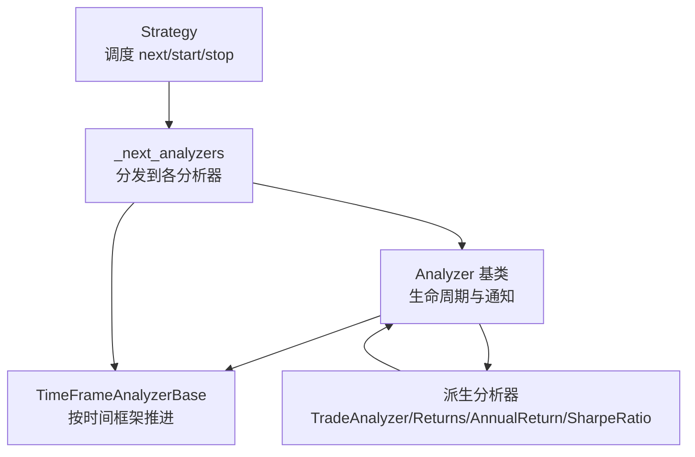
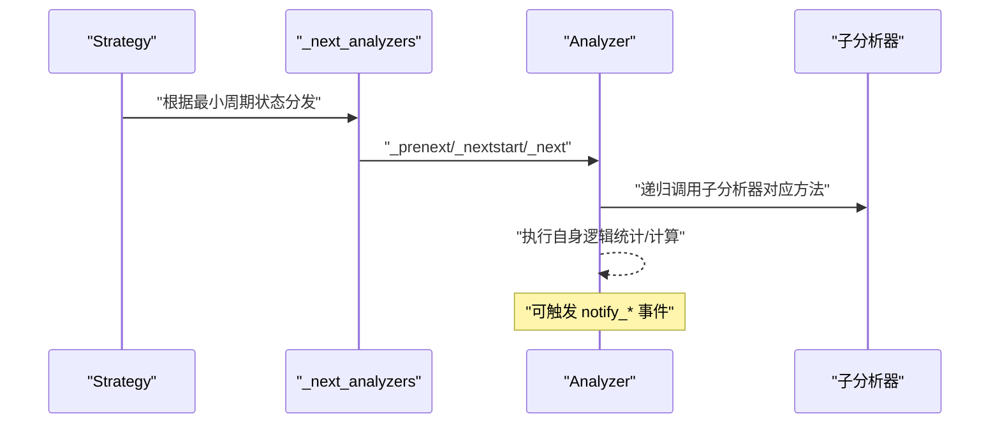
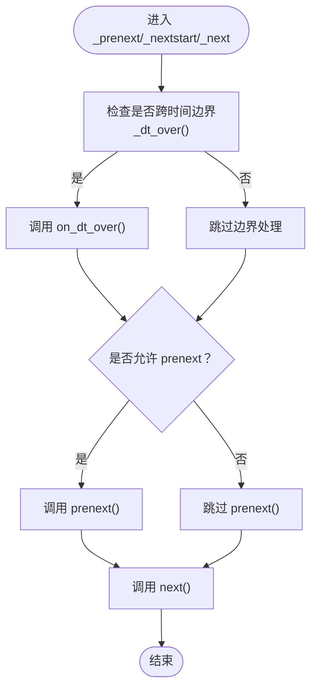
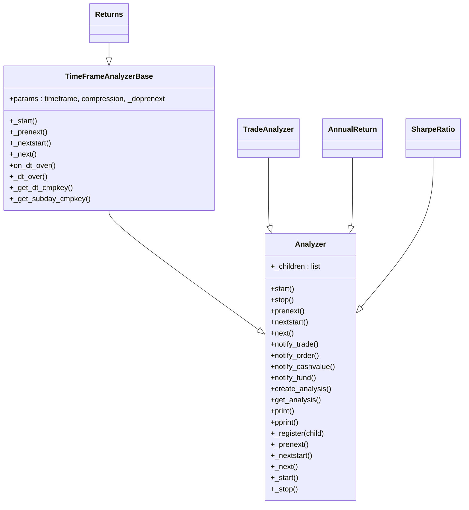
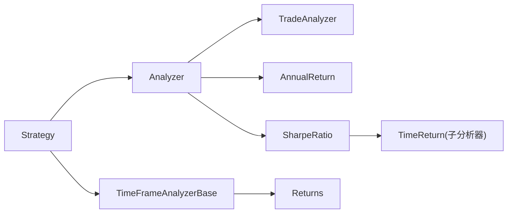

# 分析器API

<cite>
**本文引用的文件**
- [backtrader/analyzer.py](file://backtrader/analyzer.py)
- [backtrader/strategy.py](file://backtrader/strategy.py)
- [backtrader/analyzers/__init__.py](file://backtrader/analyzers/__init__.py)
- [backtrader/analyzers/tradeanalyzer.py](file://backtrader/analyzers/tradeanalyzer.py)
- [backtrader/analyzers/returns.py](file://backtrader/analyzers/returns.py)
- [backtrader/analyzers/annualreturn.py](file://backtrader/analyzers/annualreturn.py)
- [backtrader/analyzers/sharpe.py](file://backtrader/analyzers/sharpe.py)
- [samples/analyzer-annualreturn/analyzer-annualreturn.py](file://samples/analyzer-annualreturn/analyzer-annualreturn.py)
- [backtrader/errors.py](file://backtrader/errors.py)
</cite>

## 目录
1. [简介](#简介)
2. [项目结构](#项目结构)
3. [核心组件](#核心组件)
4. [架构总览](#架构总览)
5. [详细组件分析](#详细组件分析)
6. [依赖关系分析](#依赖关系分析)
7. [性能考量](#性能考量)
8. [故障排查指南](#故障排查指南)
9. [结论](#结论)
10. [附录：API参考与示例](#附录api参考与示例)

## 简介
本文件为 Analyzer 基类及其派生分析器的完整 API 参考与实践指南。内容覆盖：
- 分析数据收集方法：__init__()、start()、stop()、next()、prenext()、nextstart() 等生命周期与数据驱动调用约定
- 分析配置 API：参数系统（params）、环境访问（strategy、datas、dataX、dataX_Y 等）
- 结果获取 API：get_analysis()、print()、pprint() 等
- 组合与嵌套：add_analyzer()、attach（通过父分析器注册子分析器）等
- 参数与结果存储：create_analysis()、rets 字典/容器约定
- 通知机制：notify_* 系列（notify_trade、notify_order、notify_cashvalue、notify_fund）
- 生命周期管理：reset()、clear()（在策略侧进行状态清理）
- 数据验证与异常处理：边界条件、零除保护、类型与范围校验
- 实战示例：基于官方样例的开发与使用模式

## 项目结构
Analyzer 基类位于 backtrader/analyzer.py，派生分析器位于 backtrader/analyzers/ 子模块；策略侧负责调度分析器的生命周期与数据流。

图表来源
- [backtrader/analyzer.py](file://backtrader/analyzer.py#L89-L137)
- [backtrader/analyzer.py](file://backtrader/analyzer.py#L299-L305)
- [backtrader/strategy.py](file://backtrader/strategy.py#L381-L388)

章节来源
- [backtrader/analyzer.py](file://backtrader/analyzer.py#L89-L137)
- [backtrader/strategy.py](file://backtrader/strategy.py#L349-L388)

## 核心组件
- Analyzer 基类：定义生命周期钩子、通知接口、结果容器与打印输出
- TimeFrameAnalyzerBase：按时间框架推进（日线、周线、月线、年线、分钟/秒/微秒），支持 on_dt_over 回调
- 派生分析器：如 TradeAnalyzer、Returns、AnnualReturn、SharpeRatio 等，覆盖交易统计、收益计算、夏普比率等

章节来源
- [backtrader/analyzer.py](file://backtrader/analyzer.py#L89-L137)
- [backtrader/analyzer.py](file://backtrader/analyzer.py#L299-L305)
- [backtrader/analyzers/tradeanalyzer.py](file://backtrader/analyzers/tradeanalyzer.py#L31-L75)
- [backtrader/analyzers/returns.py](file://backtrader/analyzers/returns.py#L30-L95)
- [backtrader/analyzers/annualreturn.py](file://backtrader/analyzers/annualreturn.py#L30-L48)
- [backtrader/analyzers/sharpe.py](file://backtrader/analyzers/sharpe.py#L33-L125)

## 架构总览
分析器在策略运行时被调度执行，遵循“最小周期到达”原则，分别在 prenext、nextstart、next 三个阶段被调用，并接收通知事件。

图表来源
- [backtrader/strategy.py](file://backtrader/strategy.py#L381-L388)
- [backtrader/analyzer.py](file://backtrader/analyzer.py#L148-L201)

章节来源
- [backtrader/strategy.py](file://backtrader/strategy.py#L349-L388)
- [backtrader/analyzer.py](file://backtrader/analyzer.py#L148-L201)

## 详细组件分析

### Analyzer 基类 API
- 生命周期与数据流
  - __init__：实例化与初始化，通常在派生类中重写以设置内部状态
  - start()：开始阶段，适合初始化外部资源或基准值
  - stop()：结束阶段，适合最终计算与收尾
  - prenext()：最小周期未满足前的每根K线调用，默认转发至 next()
  - nextstart()：首次达到最小周期时调用一次
  - next()：最小周期满足后的常规调用
- 通知机制
  - notify_trade(trade)、notify_order(order)、notify_cashvalue(cash, value)、notify_fund(cash, value, fundvalue, shares)
- 结果容器与输出
  - create_analysis()：默认创建有序字典 rets，派生类可自定义容器类型
  - get_analysis()：返回分析结果（默认返回 rets）
  - print()/pprint()：将结果写入 WriterFile 或使用 pprint 输出

章节来源
- [backtrader/analyzer.py](file://backtrader/analyzer.py#L118-L137)
- [backtrader/analyzer.py](file://backtrader/analyzer.py#L218-L245)
- [backtrader/analyzer.py](file://backtrader/analyzer.py#L247-L268)
- [backtrader/analyzer.py](file://backtrader/analyzer.py#L270-L286)

### TimeFrameAnalyzerBase 时间框架推进器
- 参数
  - timeframe/compression：继承自 Analyzer 的 params，用于控制时间粒度
  - _doprenext：是否在时间边界触发 prenext
- 关键行为
  - _start：确定实际时间框架与压缩比，计算初始 dtcmp/dtkey
  - _prenext/_nextstart/_next：在时间边界触发 on_dt_over() 后再执行 next/prenext
  - _dt_over()：判断当前策略时间是否跨过一个时间边界
  - _get_dt_cmpkey/_get_subday_cmpkey：生成比较键与边界时间点

图表来源
- [backtrader/analyzer.py](file://backtrader/analyzer.py#L315-L342)
- [backtrader/analyzer.py](file://backtrader/analyzer.py#L346-L446)

章节来源
- [backtrader/analyzer.py](file://backtrader/analyzer.py#L299-L305)
- [backtrader/analyzer.py](file://backtrader/analyzer.py#L315-L342)
- [backtrader/analyzer.py](file://backtrader/analyzer.py#L346-L446)

### 派生分析器示例

#### TradeAnalyzer（交易统计）
- 职责：统计开平仓次数、净盈亏、胜率、最长连胜/连败、多空分布、持有周期等
- 关键点：
  - create_analysis() 使用 AutoOrderedDict，避免无交易时的空字典
  - stop() 中调用 _close() 完善嵌套结构
  - notify_trade() 中更新各类统计指标

章节来源
- [backtrader/analyzers/tradeanalyzer.py](file://backtrader/analyzers/tradeanalyzer.py#L68-L75)
- [backtrader/analyzers/tradeanalyzer.py](file://backtrader/analyzers/tradeanalyzer.py#L76-L209)

#### Returns（对数收益）
- 职责：按时间框架计算复合/平均/年化/百分比化收益
- 关键点：
  - start() 中检测 fundmode 并保存期初净值
  - stop() 计算期初/期末净值并产出 rtot/ravg/rnorm/rnorm100
  - _on_dt_over() 计数子期

章节来源
- [backtrader/analyzers/returns.py](file://backtrader/analyzers/returns.py#L104-L125)
- [backtrader/analyzers/returns.py](file://backtrader/analyzers/returns.py#L154-L155)

#### AnnualReturn（年度收益）
- 职责：按自然年计算年度回报序列与字典
- 关键点：
  - stop() 遍历数据，按年聚合期初/期末净值，产出有序字典

章节来源
- [backtrader/analyzers/annualreturn.py](file://backtrader/analyzers/annualreturn.py#L50-L87)

#### SharpeRatio（夏普比率）
- 职责：基于 TimeReturn 或 AnnualReturn 计算夏普比率，支持风险无率转换与样本修正
- 关键点：
  - 支持 legacyannual 模式或基于 TimeReturn 的新式模式
  - stop() 中进行均值、标准差与比率计算，含零除保护

章节来源
- [backtrader/analyzers/sharpe.py](file://backtrader/analyzers/sharpe.py#L134-L204)

### 分析器组合与嵌套
- 父子注册
  - Analyzer._register(child)：父分析器将子分析器加入 _children 列表
  - MetaAnalyzer.donew/postinit：自动建立父子关系与注册
- 调度传播
  - Analyzer._prenext/_nextstart/_next/_start/_stop：逐层向下传播到子分析器
  - Strategy._next_analyzers：根据最小周期状态分发到各分析器

图表来源
- [backtrader/analyzer.py](file://backtrader/analyzer.py#L89-L137)
- [backtrader/analyzer.py](file://backtrader/analyzer.py#L299-L305)
- [backtrader/analyzers/tradeanalyzer.py](file://backtrader/analyzers/tradeanalyzer.py#L31-L31)
- [backtrader/analyzers/returns.py](file://backtrader/analyzers/returns.py#L30-L30)
- [backtrader/analyzers/annualreturn.py](file://backtrader/analyzers/annualreturn.py#L30-L30)
- [backtrader/analyzers/sharpe.py](file://backtrader/analyzers/sharpe.py#L33-L33)

章节来源
- [backtrader/analyzer.py](file://backtrader/analyzer.py#L42-L86)
- [backtrader/analyzer.py](file://backtrader/analyzer.py#L145-L201)
- [backtrader/strategy.py](file://backtrader/strategy.py#L381-L388)

## 依赖关系分析
- Analyzer 依赖策略对象（strategy）与数据源（datas/dataX/dataX_Y 等别名属性）
- TimeFrameAnalyzerBase 依赖 TimeFrame 常量与策略 datetime
- 派生分析器之间存在组合关系（如 SharpeRatio 内部使用 TimeReturn/AnnualReturn）

图表来源
- [backtrader/strategy.py](file://backtrader/strategy.py#L349-L388)
- [backtrader/analyzer.py](file://backtrader/analyzer.py#L52-L72)
- [backtrader/analyzers/sharpe.py](file://backtrader/analyzers/sharpe.py#L138-L141)

章节来源
- [backtrader/strategy.py](file://backtrader/strategy.py#L349-L388)
- [backtrader/analyzer.py](file://backtrader/analyzer.py#L52-L72)
- [backtrader/analyzers/sharpe.py](file://backtrader/analyzers/sharpe.py#L138-L141)

## 性能考量
- 时间框架推进成本：TimeFrameAnalyzerBase 在每个周期内计算 dtcmp/dtkey，建议合理设置 timeframe/compression，避免过细粒度过高导致频繁边界判断
- 统计累积复杂度：TradeAnalyzer 等在 notify_trade 中进行大量字段更新，注意数据规模与嵌套层级
- I/O 输出：print()/pprint() 会触发 WriterFile 或 pprint，批量输出时建议合并批次或减少频率

## 故障排查指南
- 零除与负对数
  - Returns.stop() 对零除与负值返回特殊标量，确保上层逻辑能正确处理
- 参数不一致
  - TimeFrameAnalyzerBase 依赖 data._timeframe/_compression，若传入 None 将回退到数据源默认值
- 异常类型
  - StrategySkipError：在策略初始化阶段抛出以跳过该策略
  - ModuleImportError/FromModuleImportError：模块缺失导致的导入异常

章节来源
- [backtrader/analyzers/returns.py](file://backtrader/analyzers/returns.py#L127-L135)
- [backtrader/analyzer.py](file://backtrader/analyzer.py#L308-L310)
- [backtrader/errors.py](file://backtrader/errors.py#L33-L51)

## 结论
Analyzer 基类提供了统一的生命周期、通知与结果输出接口，TimeFrameAnalyzerBase 扩展了按时间框架推进的能力。派生分析器通过组合与嵌套实现复杂统计与指标计算。开发者应遵循：
- 明确在何时更新 rets
- 正确处理边界条件与异常
- 合理选择时间框架参数
- 使用 print()/pprint() 进行调试与输出

## 附录：API参考与示例

### 生命周期与数据流 API
- __init__：实例化与参数解析
- start()：初始化外部资源（如基准净值）
- stop()：最终计算与收尾
- prenext()：最小周期未满足时的每根K线
- nextstart()：首次达到最小周期时调用一次
- next()：最小周期满足后的常规调用
- notify_*：交易、订单、资金、净值变更通知

章节来源
- [backtrader/analyzer.py](file://backtrader/analyzer.py#L218-L245)
- [backtrader/analyzer.py](file://backtrader/analyzer.py#L202-L216)

### 结果获取与输出 API
- create_analysis()：创建结果容器（默认 OrderedDict）
- get_analysis()：返回结果（默认 rets）
- print()/pprint()：输出结果到 WriterFile 或 pprint

章节来源
- [backtrader/analyzer.py](file://backtrader/analyzer.py#L247-L268)
- [backtrader/analyzer.py](file://backtrader/analyzer.py#L270-L286)

### 组合与嵌套 API
- 父子注册：_register(child)，由 MetaAnalyzer 自动完成
- 传播调用：_prenext/_nextstart/_next/_start/_stop 逐层向下
- 策略调度：_next_analyzers 根据最小周期状态分发

章节来源
- [backtrader/analyzer.py](file://backtrader/analyzer.py#L42-L86)
- [backtrader/analyzer.py](file://backtrader/analyzer.py#L145-L201)
- [backtrader/strategy.py](file://backtrader/strategy.py#L381-L388)

### 参数与结果存储 API
- params：通过 Analyzer.params 定义分析器参数
- create_analysis()/get_analysis()：约定结果容器与返回格式
- rets：默认结果容器（可替换为 AutoOrderedDict 等）

章节来源
- [backtrader/analyzer.py](file://backtrader/analyzer.py#L247-L268)
- [backtrader/analyzers/tradeanalyzer.py](file://backtrader/analyzers/tradeanalyzer.py#L68-L75)

### 通知机制 API
- notify_trade(trade)、notify_order(order)、notify_cashvalue(cash, value)、notify_fund(cash, value, fundvalue, shares)

章节来源
- [backtrader/analyzer.py](file://backtrader/analyzer.py#L202-L216)

### 生命周期管理 API
- reset()/clear()：在策略侧进行状态清理与重置（例如在 run 循环前后）

章节来源
- [backtrader/strategy.py](file://backtrader/strategy.py#L349-L353)

### 实战示例与最佳实践
- 添加多个分析器并运行：参见样例脚本中的 cerebro.addanalyzer(...) 与 cerebro.run()
- 使用 TimeReturn/SharpeRatio：按时间框架计算收益与风险指标
- 使用 TradeAnalyzer：跟踪交易统计与盈亏分布

章节来源
- [samples/analyzer-annualreturn/analyzer-annualreturn.py](file://samples/analyzer-annualreturn/analyzer-annualreturn.py#L160-L174)