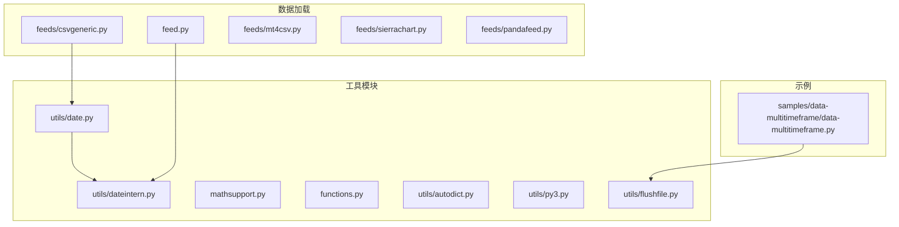
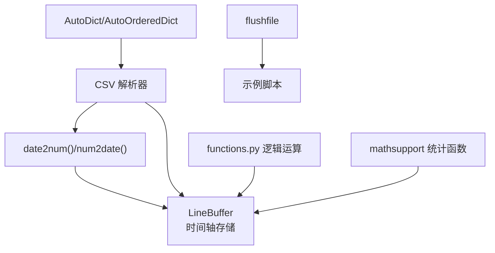
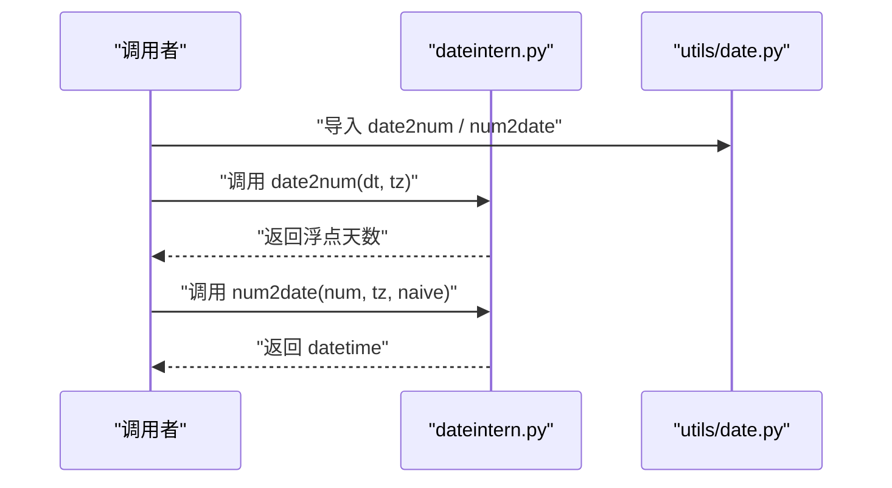
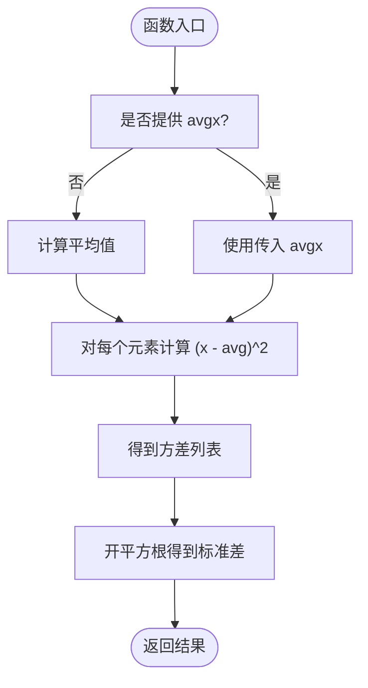
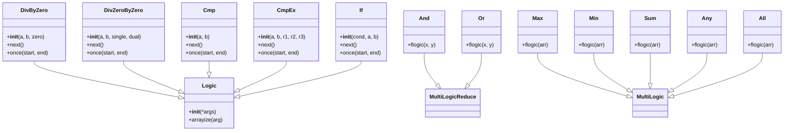
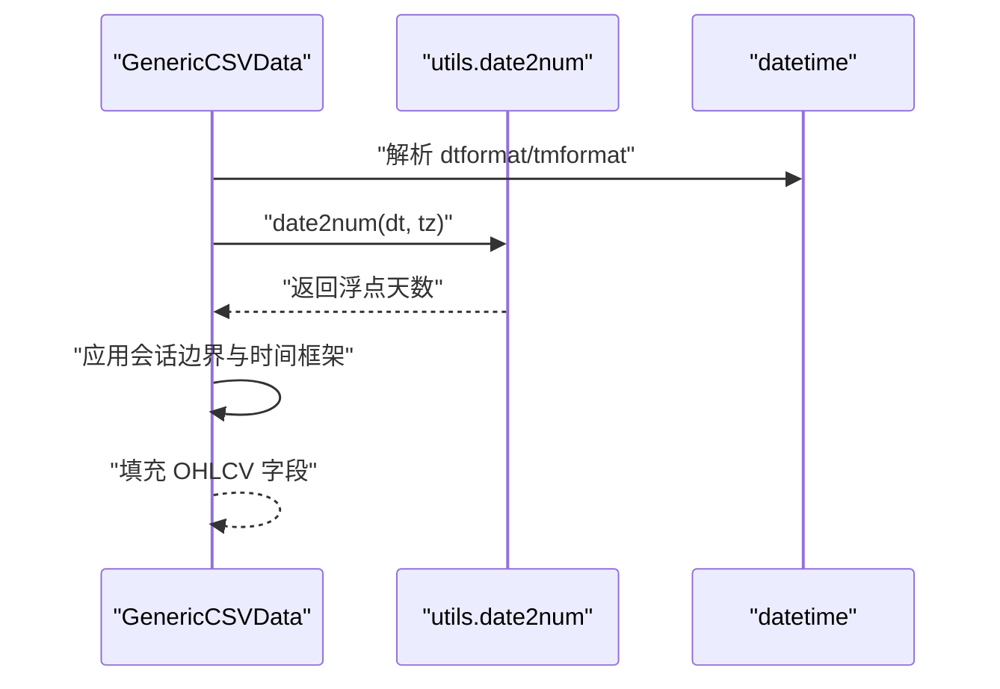
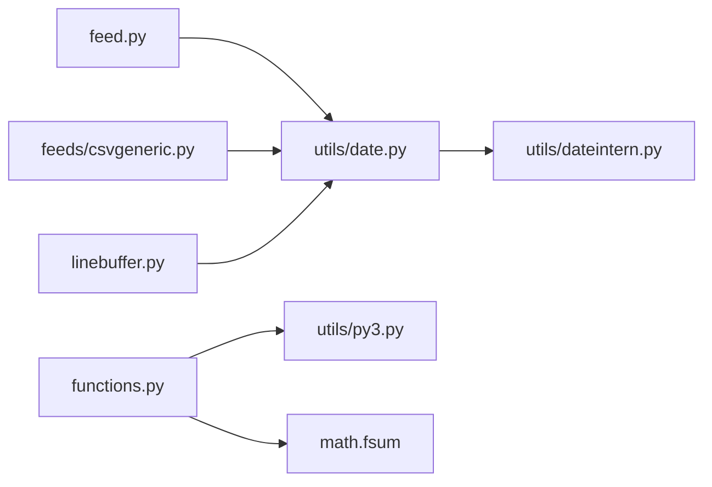

# 工具函数API

<cite>
**本文档引用的文件**
- [backtrader/utils/date.py](file://backtrader/utils/date.py)
- [backtrader/utils/dateintern.py](file://backtrader/utils/dateintern.py)
- [backtrader/utils/__init__.py](file://backtrader/utils/__init__.py)
- [backtrader/mathsupport.py](file://backtrader/mathsupport.py)
- [backtrader/functions.py](file://backtrader/functions.py)
- [backtrader/utils/autodict.py](file://backtrader/utils/autodict.py)
- [backtrader/utils/py3.py](file://backtrader/utils/py3.py)
- [backtrader/utils/flushfile.py](file://backtrader/utils/flushfile.py)
- [backtrader/linebuffer.py](file://backtrader/linebuffer.py)
- [backtrader/feed.py](file://backtrader/feed.py)
- [backtrader/feeds/csvgeneric.py](file://backtrader/feeds/csvgeneric.py)
- [backtrader/feeds/mt4csv.py](file://backtrader/feeds/mt4csv.py)
- [backtrader/feeds/sierrachart.py](file://backtrader/feeds/sierrachart.py)
- [backtrader/feeds/pandafeed.py](file://backtrader/feeds/pandafeed.py)
- [samples/data-multitimeframe/data-multitimeframe.py](file://samples/data-multitimeframe/data-multitimeframe.py)
</cite>

## 目录
1. [简介](#简介)
2. [项目结构](#项目结构)
3. [核心组件](#核心组件)
4. [架构总览](#架构总览)
5. [详细组件分析](#详细组件分析)
6. [依赖关系分析](#依赖关系分析)
7. [性能考虑](#性能考虑)
8. [故障排除指南](#故障排除指南)
9. [结论](#结论)
10. [附录](#附录)

## 简介
本文件为 Backtrader 工具函数的完整 API 参考，覆盖以下类别：
- 日期与时间处理：num2date()、date2num()、time2num()、num2dt()、num2time() 等
- 数学运算：average()、variance()、standarddev() 等
- 数据转换：类型转换与数组构造（如 array、zeros、ones 的替代用法）
- 字符串处理：str2num()、num2str() 等转换规则
- 文件处理：CSV 读取、数据解析与 Pandas 集成
- 调试与日志：flushfile、日志工具与常见问题定位
- 参数验证与错误处理：输入校验、异常传播与边界条件

本参考文档面向不同技术背景的用户，既提供高层概览，也给出代码级的来源定位，便于快速查阅与深入理解。

## 项目结构
Backtrader 将工具函数按功能域组织在多个子模块中：
- 时间与日期：backtrader.utils.date 与 backtrader.utils.dateintern
- 数学支持：backtrader.mathsupport
- 逻辑与数组运算：backtrader.functions
- 辅助容器与兼容层：backtrader.utils.{autodict, py3, flushfile}
- 数据加载与解析：backtrader.feeds.* 以及 backtrader.feed 基类
- 示例与使用：samples 中的演示脚本

**图表来源**
- [backtrader/utils/date.py](file://backtrader/utils/date.py#L25-L29)
- [backtrader/utils/dateintern.py](file://backtrader/utils/dateintern.py#L149-L240)
- [backtrader/mathsupport.py](file://backtrader/mathsupport.py#L27-L65)
- [backtrader/functions.py](file://backtrader/functions.py#L37-L259)
- [backtrader/utils/autodict.py](file://backtrader/utils/autodict.py#L29-L146)
- [backtrader/utils/py3.py](file://backtrader/utils/py3.py#L27-L134)
- [backtrader/utils/flushfile.py](file://backtrader/utils/flushfile.py#L27-L57)
- [backtrader/feed.py](file://backtrader/feed.py#L649-L747)
- [backtrader/feeds/csvgeneric.py](file://backtrader/feeds/csvgeneric.py#L32-L161)
- [backtrader/feeds/mt4csv.py](file://backtrader/feeds/mt4csv.py#L36-L52)
- [backtrader/feeds/sierrachart.py](file://backtrader/feeds/sierrachart.py#L28-L39)
- [backtrader/feeds/pandafeed.py](file://backtrader/feeds/pandafeed.py#L204-L244)
- [samples/data-multitimeframe/data-multitimeframe.py](file://samples/data-multitimeframe/data-multitimeframe.py#L31)

**章节来源**
- [backtrader/utils/date.py](file://backtrader/utils/date.py#L25-L29)
- [backtrader/utils/dateintern.py](file://backtrader/utils/dateintern.py#L149-L240)
- [backtrader/mathsupport.py](file://backtrader/mathsupport.py#L27-L65)
- [backtrader/functions.py](file://backtrader/functions.py#L37-L259)
- [backtrader/utils/autodict.py](file://backtrader/utils/autodict.py#L29-L146)
- [backtrader/utils/py3.py](file://backtrader/utils/py3.py#L27-L134)
- [backtrader/utils/flushfile.py](file://backtrader/utils/flushfile.py#L27-L57)
- [backtrader/feed.py](file://backtrader/feed.py#L649-L747)
- [backtrader/feeds/csvgeneric.py](file://backtrader/feeds/csvgeneric.py#L32-L161)
- [backtrader/feeds/mt4csv.py](file://backtrader/feeds/mt4csv.py#L36-L52)
- [backtrader/feeds/sierrachart.py](file://backtrader/feeds/sierrachart.py#L28-L39)
- [backtrader/feeds/pandafeed.py](file://backtrader/feeds/pandafeed.py#L204-L244)
- [samples/data-multitimeframe/data-multitimeframe.py](file://samples/data-multitimeframe/data-multitimeframe.py#L31)

## 核心组件
本节概述各工具函数类别及其职责：
- 日期时间处理：提供浮点数与 datetime/time 的双向转换，时区解析与本地化
- 数学运算：提供平均值、方差、标准差等统计函数
- 逻辑与数组运算：基于 LineActions 的多值逻辑与聚合运算
- 数据结构与兼容：自动字典树、有序字典、Python 版本兼容
- 文件与数据加载：CSV 解析、Pandas 集成、会话时间处理
- 调试与日志：输出刷新、日志配置与实用工具

**章节来源**
- [backtrader/utils/date.py](file://backtrader/utils/date.py#L25-L29)
- [backtrader/utils/dateintern.py](file://backtrader/utils/dateintern.py#L149-L240)
- [backtrader/mathsupport.py](file://backtrader/mathsupport.py#L27-L65)
- [backtrader/functions.py](file://backtrader/functions.py#L37-L259)
- [backtrader/utils/autodict.py](file://backtrader/utils/autodict.py#L29-L146)
- [backtrader/utils/py3.py](file://backtrader/utils/py3.py#L27-L134)
- [backtrader/feed.py](file://backtrader/feed.py#L649-L747)
- [backtrader/feeds/csvgeneric.py](file://backtrader/feeds/csvgeneric.py#L32-L161)
- [backtrader/feeds/pandafeed.py](file://backtrader/feeds/pandafeed.py#L204-L244)
- [backtrader/utils/flushfile.py](file://backtrader/utils/flushfile.py#L27-L57)

## 架构总览
Backtrader 工具函数围绕“时间序列数据”这一核心抽象展开：
- 时间序列数据以“浮点数天数”表示，通过 date2num()/num2date() 在数值与 datetime 间转换
- LineActions 体系提供可并行化的数组级逻辑运算（与指标管线集成）
- CSV 加载器将外部数据规范化为统一的时间轴与 OHLCV 字段
- 自动字典与有序字典用于构建嵌套配置与结果结构
- flushfile 提供跨平台输出刷新，提升交互体验

**图表来源**
- [backtrader/utils/dateintern.py](file://backtrader/utils/dateintern.py#L202-L240)
- [backtrader/linebuffer.py](file://backtrader/linebuffer.py#L50-L200)
- [backtrader/feeds/csvgeneric.py](file://backtrader/feeds/csvgeneric.py#L100-L161)
- [backtrader/functions.py](file://backtrader/functions.py#L37-L259)
- [backtrader/mathsupport.py](file://backtrader/mathsupport.py#L27-L65)
- [backtrader/utils/autodict.py](file://backtrader/utils/autodict.py#L47-L146)
- [backtrader/utils/flushfile.py](file://backtrader/utils/flushfile.py#L27-L57)
- [samples/data-multitimeframe/data-multitimeframe.py](file://samples/data-multitimeframe/data-multitimeframe.py#L31)

## 详细组件分析

### 日期与时间处理 API
- num2date(x, tz=None, naive=True)
  - 功能：将自公元 0001-01-01 以来的“天数”（含小数部分代表时分秒）转换为 datetime 对象；若传入 tz 则进行时区转换；naive=True 返回无时区信息的 datetime
  - 输入：x 为浮点数或序列；tz 为时区对象或字符串（通过 tzparse 解析）；naive 控制是否移除时区信息
  - 输出：datetime 实例或序列
  - 注意：对微秒进行补偿以避免舍入误差导致的日期跳变
  - 参考：[num2date 实现](file://backtrader/utils/dateintern.py#L149-L191)

- num2dt(num, tz=None, naive=True)
  - 功能：返回日期部分（date）
  - 参考：[num2dt 实现](file://backtrader/utils/dateintern.py#L194-L195)

- num2time(num, tz=None, naive=True)
  - 功能：返回时间部分（time）
  - 参考：[num2time 实现](file://backtrader/utils/dateintern.py#L198-L199)

- date2num(dt, tz=None)
  - 功能：将 datetime 转换为“自 0001-01-01 起的天数”（含时分秒），自动处理时区偏移
  - 输入：dt 为 datetime 实例；tz 可选，用于本地化
  - 输出：浮点数
  - 参考：[date2num 实现](file://backtrader/utils/dateintern.py#L202-L227)

- time2num(tm)
  - 功能：将 time/datetime.time 的时分秒微秒转换为“相对于一天的比例”
  - 参考：[time2num 实现](file://backtrader/utils/dateintern.py#L230-L240)

- 时区工具
  - UTC、TZLocal：UTC 与本地时区实例
  - Localizer(tz)：为时区对象注入 localize 方法
  - tzparse(tz)：解析字符串时区，优先使用 pytz，失败回退到 Localizer
  - 参考：[时区工具实现](file://backtrader/utils/dateintern.py#L48-L137)

- 导出接口
  - backtrader.utils.date 将上述函数与常量统一导出
  - 参考：[导出声明](file://backtrader/utils/date.py#L25-L29)

**图表来源**
- [backtrader/utils/dateintern.py](file://backtrader/utils/dateintern.py#L149-L227)
- [backtrader/utils/date.py](file://backtrader/utils/date.py#L25-L29)

**章节来源**
- [backtrader/utils/dateintern.py](file://backtrader/utils/dateintern.py#L149-L240)
- [backtrader/utils/date.py](file://backtrader/utils/date.py#L25-L29)

### 数学运算 API
- average(x, bessel=False)
  - 功能：计算平均值；当 bessel=True 时使用 N-1 作为分母（贝塞尔校正）
  - 输入：x 为可迭代对象
  - 输出：浮点数
  - 参考：[average 实现](file://backtrader/mathsupport.py#L27-L38)

- variance(x, avgx=None)
  - 功能：计算每个元素与均值的平方差，得到方差列表
  - 输入：x 为可迭代对象；avgx 可选，若未提供则先计算均值
  - 输出：列表
  - 参考：[variance 实现](file://backtrader/mathsupport.py#L41-L51)

- standarddev(x, avgx=None, bessel=False)
  - 功能：计算标准差；可选择贝塞尔校正
  - 输入：x 为可迭代对象；avgx 可选；bessel 控制分母
  - 输出：浮点数
  - 参考：[standarddev 实现](file://backtrader/mathsupport.py#L54-L65)

**图表来源**
- [backtrader/mathsupport.py](file://backtrader/mathsupport.py#L27-L65)

**章节来源**
- [backtrader/mathsupport.py](file://backtrader/mathsupport.py#L27-L65)

### 逻辑与数组运算 API
Backtrader 的 functions.py 提供基于 LineActions 的数组级逻辑与聚合运算，适用于指标管线中的批量计算。

- DivByZero(a, b, zero=0.0)
  - 功能：安全除法，避免除零；当 b==0 时返回 zero
  - 参数：a 分子，b 分母，zero 除零时的替代值
  - 参考：[DivByZero 类](file://backtrader/functions.py#L43-L74)

- DivZeroByZero(a, b, single=+inf, dual=0.0)
  - 功能：处理 0/0 与 x/0 的特殊情况；0/0 返回 dual，0/x 返回 single
  - 参考：[DivZeroByZero 类](file://backtrader/functions.py#L76-L117)

- Cmp(a, b)
  - 功能：比较两个值（使用 utils.py3.cmp），返回 -1/0/1
  - 参考：[Cmp 类](file://backtrader/functions.py#L120-L136)

- CmpEx(a, b, r1, r2, r3)
  - 功能：三路分支比较，根据 a vs b 的比较结果返回 r1/r2/r3
  - 参考：[CmpEx 类](file://backtrader/functions.py#L139-L169)

- If(cond, a, b)
  - 功能：条件选择，cond 为真返回 a，否则返回 b
  - 参考：[If 类](file://backtrader/functions.py#L172-L190)

- And/MultiLogicReduce
  - 功能：多值逻辑与（短路）
  - 参考：[And 类](file://backtrader/functions.py#L229-L230)

- Or/MultiLogicReduce
  - 功能：多值逻辑或（短路）
  - 参考：[Or 类](file://backtrader/functions.py#L237-L238)

- Max/Min/Sum/Any/All
  - 功能：多值聚合运算，Sum 使用 math.fsum 保证精度
  - 参考：[Max/Min/Sum/Any/All](file://backtrader/functions.py#L241-L259)

**图表来源**
- [backtrader/functions.py](file://backtrader/functions.py#L37-L259)
- [backtrader/utils/py3.py](file://backtrader/utils/py3.py#L96)

**章节来源**
- [backtrader/functions.py](file://backtrader/functions.py#L43-L190)
- [backtrader/functions.py](file://backtrader/functions.py#L217-L259)
- [backtrader/utils/py3.py](file://backtrader/utils/py3.py#L96)

### 数据转换与数组操作 API
- 类型转换
  - float(x)、int(x)、bool(x)：标准内置类型转换，用于将字符串或数值字段转换为数值
  - 在 CSV 解析中广泛使用 float() 处理 OHLCV 字段
  - 参考：[CSV 解析中的类型转换](file://backtrader/feeds/csvgeneric.py#L154-L156)

- 数组与序列
  - array()：Backtrader 内部使用 array.array('d') 存储数值序列，配合 LineBuffer 管线化处理
  - zeros()/ones()：可通过 array.array('d') 初始化或通过列表推导实现
  - 参考：[LineBuffer 初始化与数组类型](file://backtrader/linebuffer.py#L114-L115)

- 字符串处理
  - str2num()/num2str()：在 CSV 解析中将字符串时间戳与数值字段互转
  - dtformat/tmformat：控制日期/时间字段的解析格式
  - 参考：[GenericCSVData 参数与解析](file://backtrader/feeds/csvgeneric.py#L32-L70)

**章节来源**
- [backtrader/feeds/csvgeneric.py](file://backtrader/feeds/csvgeneric.py#L100-L156)
- [backtrader/linebuffer.py](file://backtrader/linebuffer.py#L114-L115)

### 文件处理 API
- CSV 读取与解析
  - GenericCSVData：通用 CSV 数据加载器，支持 dtformat/tmformat、nullvalue、timeframe 等参数
  - MT4CSVData/SierraChartCSVData：针对特定平台的 CSV 字段映射
  - 参考：[GenericCSVData 定义](file://backtrader/feeds/csvgeneric.py#L32-L70)，[MT4 映射](file://backtrader/feeds/mt4csv.py#L36-L52)，[SierraChart 映射](file://backtrader/feeds/sierrachart.py#L28-L39)

- Pandas 集成
  - PandasData：从 DataFrame 加载数据，自动列名映射与大小写不敏感匹配
  - 参考：[PandasData 启动与列映射](file://backtrader/feeds/pandafeed.py#L204-L244)

- 会话时间与日期转换
  - 在加载 CSV 时，根据 sessionstart/sessionend 与 date2num 进行会话边界调整
  - 参考：[会话时间处理](file://backtrader/feeds/csvgeneric.py#L118-L136)

**图表来源**
- [backtrader/feeds/csvgeneric.py](file://backtrader/feeds/csvgeneric.py#L100-L136)
- [backtrader/utils/dateintern.py](file://backtrader/utils/dateintern.py#L202-L227)

**章节来源**
- [backtrader/feeds/csvgeneric.py](file://backtrader/feeds/csvgeneric.py#L32-L161)
- [backtrader/feeds/mt4csv.py](file://backtrader/feeds/mt4csv.py#L36-L52)
- [backtrader/feeds/sierrachart.py](file://backtrader/feeds/sierrachart.py#L28-L39)
- [backtrader/feeds/pandafeed.py](file://backtrader/feeds/pandafeed.py#L204-L244)

### 调试与日志 API
- flushfile
  - 功能：包装文件对象，确保 write 后立即 flush，解决 Windows 平台 stdout 缓冲问题
  - 使用：在示例脚本中导入并替换 sys.stdout/sys.stderr
  - 参考：[flushfile 实现](file://backtrader/utils/flushfile.py#L27-L57)，[示例使用](file://samples/data-multitimeframe/data-multitimeframe.py#L31)

- 日志工具（第三方/扩展）
  - real_trade/bybit/utils/logger.py：提供 setup_logger/get_logger，支持级别映射与格式化
  - 参考：[日志工具实现](file://real_trade/bybit/utils/logger.py#L16-L58)

**章节来源**
- [backtrader/utils/flushfile.py](file://backtrader/utils/flushfile.py#L27-L57)
- [samples/data-multitimeframe/data-multitimeframe.py](file://samples/data-multitimeframe/data-multitimeframe.py#L31)
- [real_trade/bybit/utils/logger.py](file://real_trade/bybit/utils/logger.py#L16-L58)

## 依赖关系分析
- utils/date.py 作为统一入口，导出 dateintern 中的核心函数与常量
- feed.py 引入 tzparse 用于解析时区参数
- feeds.* 依赖 utils.date2num 进行日期标准化
- linebuffer.py 依赖 utils.num2date/time2num 进行显示与格式化
- functions.py 依赖 utils.py3.cmp 与 math.fsum 等

**图表来源**
- [backtrader/utils/date.py](file://backtrader/utils/date.py#L25-L29)
- [backtrader/utils/dateintern.py](file://backtrader/utils/dateintern.py#L149-L240)
- [backtrader/feed.py](file://backtrader/feed.py#L649-L747)
- [backtrader/feeds/csvgeneric.py](file://backtrader/feeds/csvgeneric.py#L100-L136)
- [backtrader/linebuffer.py](file://backtrader/linebuffer.py#L44)
- [backtrader/functions.py](file://backtrader/functions.py#L24-L28)
- [backtrader/utils/py3.py](file://backtrader/utils/py3.py#L96)

**章节来源**
- [backtrader/utils/date.py](file://backtrader/utils/date.py#L25-L29)
- [backtrader/feed.py](file://backtrader/feed.py#L649-L747)
- [backtrader/feeds/csvgeneric.py](file://backtrader/feeds/csvgeneric.py#L100-L136)
- [backtrader/linebuffer.py](file://backtrader/linebuffer.py#L44)
- [backtrader/functions.py](file://backtrader/functions.py#L24-L28)

## 性能考虑
- 浮点精度：使用 math.fsum 计算平均值与时间累加，减少累积舍入误差
- 数组存储：LineBuffer 使用 array.array('d') 存储数值，提高内存效率与访问速度
- 时区处理：tzparse 与 Localizer 避免重复解析，提升 CSV 加载性能
- 批处理：functions.py 的 once(start,end) 循环批量更新，减少 Python 层循环开销

[本节为通用指导，无需列出具体文件来源]

## 故障排除指南
- 除零与不定式
  - 使用 DivByZero/DivZeroByZero 替代常规除法，明确零值与 0/0 的返回策略
  - 参考：[DivByZero/DivZeroByZero](file://backtrader/functions.py#L43-L117)

- 日期边界与舍入误差
  - num2date 对微秒进行补偿，避免 999990+ 微秒导致的日期跳变
  - 参考：[num2date 微秒补偿](file://backtrader/utils/dateintern.py#L172-L173)，[num2date 最终补偿](file://backtrader/utils/dateintern.py#L188-L189)

- CSV 字段缺失
  - 使用 nullvalue 占位；若列不存在且默认映射为负值，则抛出异常提示
  - 参考：[PandasData 列映射异常](file://backtrader/feeds/pandafeed.py#L225-L230)

- 输出缓冲问题（Windows）
  - 使用 flushfile 包装 stdout/stderr，确保实时输出
  - 参考：[flushfile 实现](file://backtrader/utils/flushfile.py#L27-L57)

**章节来源**
- [backtrader/functions.py](file://backtrader/functions.py#L43-L117)
- [backtrader/utils/dateintern.py](file://backtrader/utils/dateintern.py#L172-L189)
- [backtrader/feeds/pandafeed.py](file://backtrader/feeds/pandafeed.py#L225-L230)
- [backtrader/utils/flushfile.py](file://backtrader/utils/flushfile.py#L27-L57)

## 结论
Backtrader 的工具函数围绕“时间序列数据”的高效处理与一致化抽象构建，涵盖日期时间转换、统计运算、逻辑与数组运算、文件解析与调试工具。通过统一的 API 与严格的参数验证，开发者可以可靠地在指标、策略与数据加载流程中复用这些能力。

[本节为总结性内容，无需列出具体文件来源]

## 附录
- 常用别名与导出
  - backtrader.utils.date 导出：num2date、num2dt、date2num、time2num、num2time、UTC、TZLocal、Localizer、tzparse、TIME_MAX、TIME_MIN
  - 参考：[导出声明](file://backtrader/utils/date.py#L25-L29)

- 示例脚本
  - samples/data-multitimeframe/data-multitimeframe.py 展示了 flushfile 的使用与时间序列打印
  - 参考：[示例脚本](file://samples/data-multitimeframe/data-multitimeframe.py#L31)

**章节来源**
- [backtrader/utils/date.py](file://backtrader/utils/date.py#L25-L29)
- [samples/data-multitimeframe/data-multitimeframe.py](file://samples/data-multitimeframe/data-multitimeframe.py#L31)