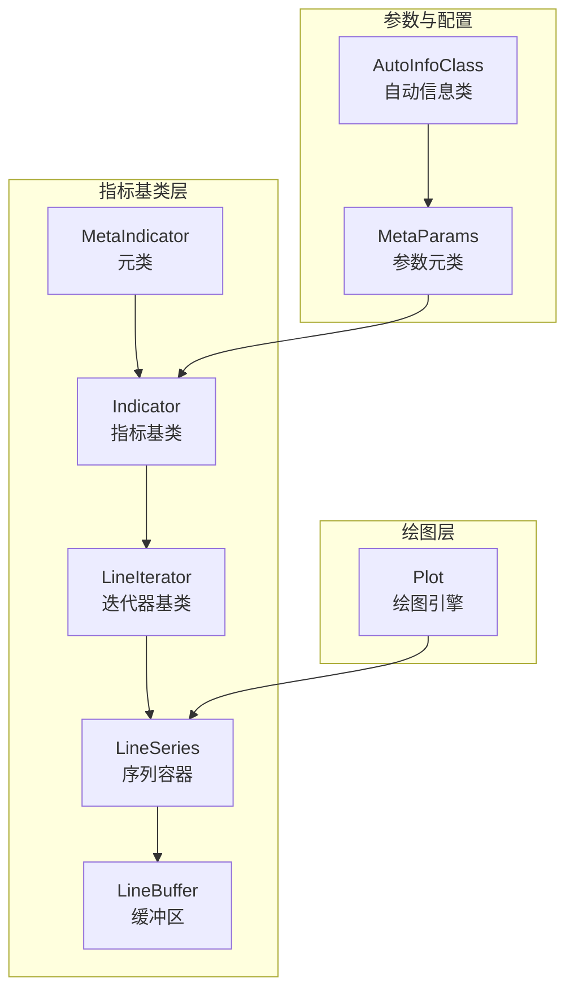
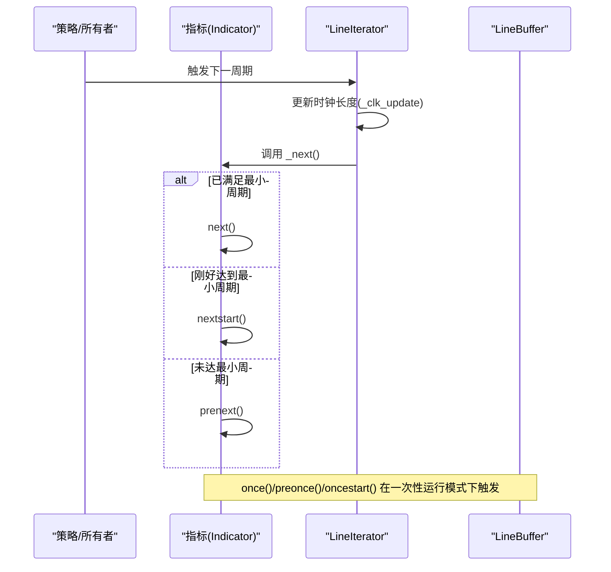
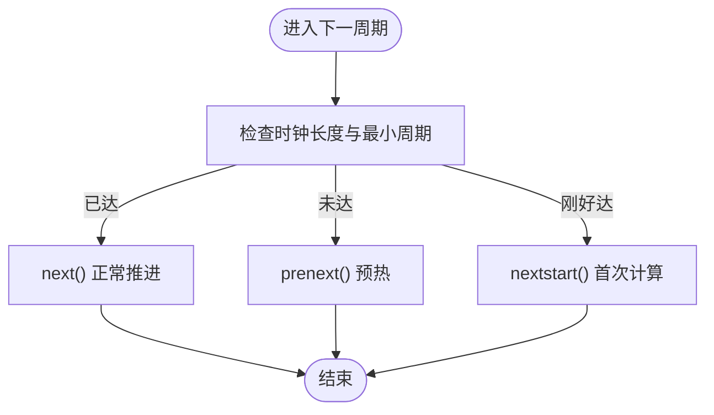
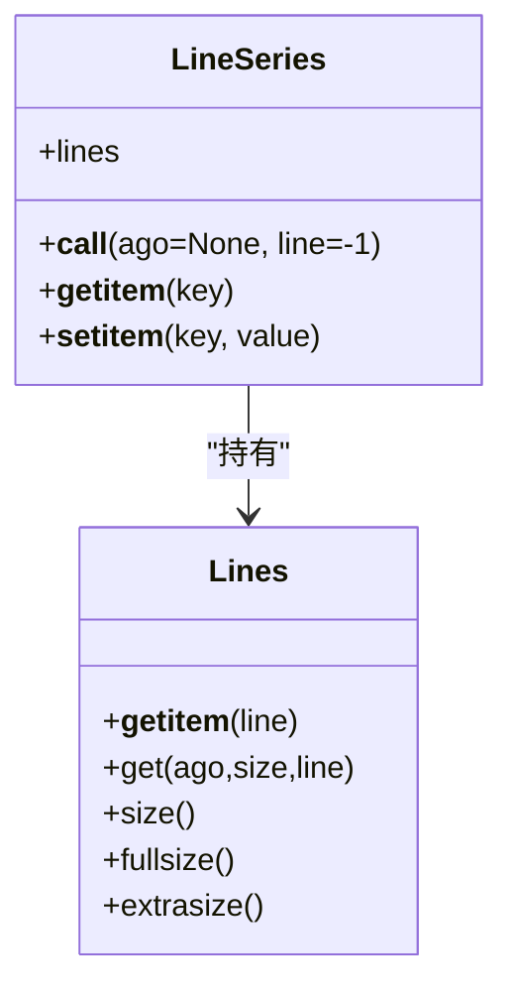
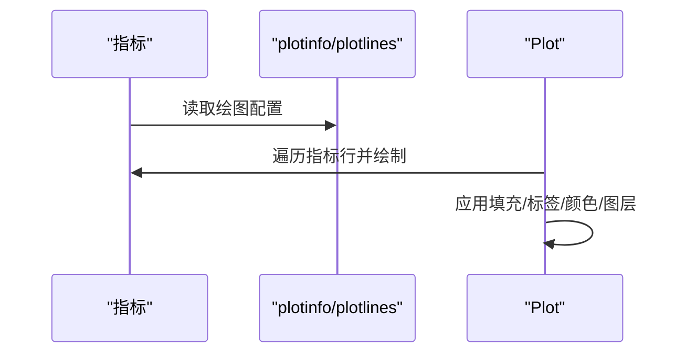
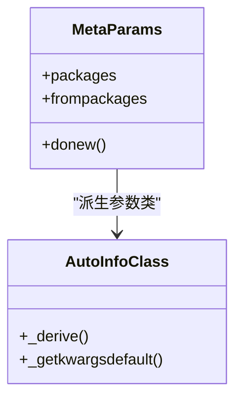
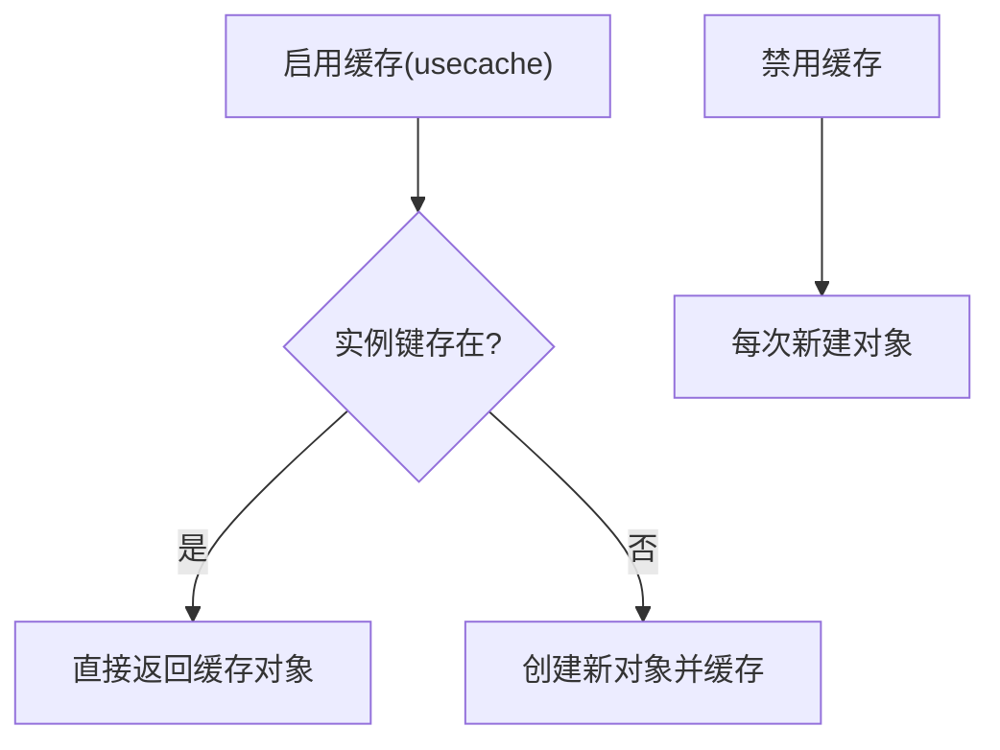
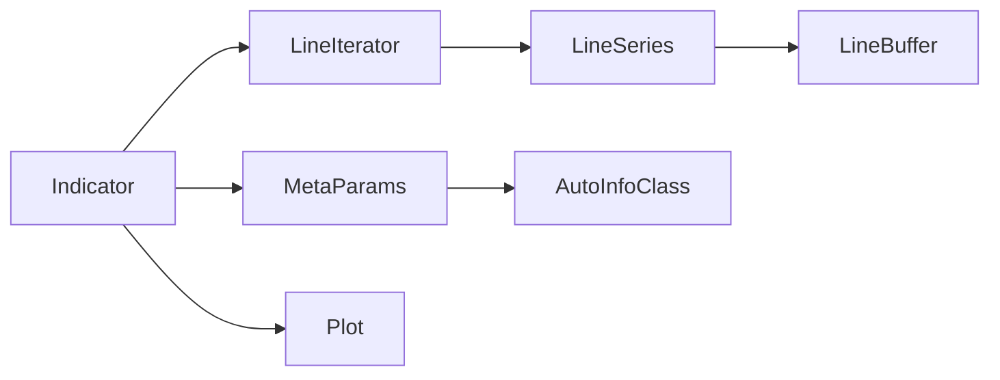

# 指标API

<cite>
**本文引用的文件**
- [backtrader/indicator.py](file://backtrader/indicator.py)
- [backtrader/lineiterator.py](file://backtrader/lineiterator.py)
- [backtrader/lineseries.py](file://backtrader/lineseries.py)
- [backtrader/metabase.py](file://backtrader/metabase.py)
- [backtrader/linebuffer.py](file://backtrader/linebuffer.py)
- [backtrader/plot/plot.py](file://backtrader/plot/plot.py)
- [backtrader/errors.py](file://backtrader/errors.py)
- [backtrader/indicators/sma.py](file://backtrader/indicators/sma.py)
- [backtrader/indicators/macd.py](file://backtrader/indicators/macd.py)
- [backtrader/indicators/bollinger.py](file://backtrader/indicators/bollinger.py)
</cite>

## 目录
1. [简介](#简介)
2. [项目结构](#项目结构)
3. [核心组件](#核心组件)
4. [架构总览](#架构总览)
5. [详细组件分析](#详细组件分析)
6. [依赖关系分析](#依赖关系分析)
7. [性能考虑](#性能考虑)
8. [故障排查指南](#故障排查指南)
9. [结论](#结论)
10. [附录：示例与最佳实践](#附录示例与最佳实践)

## 简介
本文件为 Backtrader 指标（Indicator）基类的完整 API 参考，覆盖以下主题：
- 指标生命周期与调用时机：__init__()、__call__()、once()、next()、preonce()、oncestart()、nextstart()、prenext() 的职责与触发条件
- 指标配置参数：period、subplot、plot、plotlines 等的作用与使用方式
- 指标结果访问：[0]、[-1] 索引访问与 lines[] 属性的使用
- 图表显示与组合：add_to_plot()、plot() 等方法的使用场景
- 参数传递与验证：params 的派生、默认值、校验与异常处理
- 自定义指标开发：继承 Indicator 基类的要求与必须实现的方法
- 缓存与性能优化：指标对象缓存、内存缓冲策略、最小周期管理
- 实际开发与使用示例：基于仓库内现有指标的路径指引

## 项目结构
Backtrader 指标体系由多层基础类协作构成：
- 元类与基类：MetaIndicator、Indicator、LineIterator、LineSeries、LineBuffer
- 参数系统：AutoInfoClass、MetaParams
- 绘图系统：Plot 组件
- 示例指标：sma、macd、bollinger 等

**图表来源**
- [backtrader/indicator.py](file://backtrader/indicator.py#L32-L91)
- [backtrader/lineiterator.py](file://backtrader/lineiterator.py#L148-L489)
- [backtrader/lineseries.py](file://backtrader/lineseries.py#L444-L645)
- [backtrader/metabase.py](file://backtrader/metabase.py#L93-L332)
- [backtrader/plot/plot.py](file://backtrader/plot/plot.py#L1-L887)

**章节来源**
- [backtrader/indicator.py](file://backtrader/indicator.py#L32-L91)
- [backtrader/lineiterator.py](file://backtrader/lineiterator.py#L148-L489)
- [backtrader/lineseries.py](file://backtrader/lineseries.py#L444-L645)
- [backtrader/metabase.py](file://backtrader/metabase.py#L93-L332)
- [backtrader/plot/plot.py](file://backtrader/plot/plot.py#L1-L887)

## 核心组件
- MetaIndicator：负责指标类的实例化缓存、子类注册、once/next 行为桥接
- Indicator：指标主类，封装 advance、preonce_via_prenext、oncestart_via_nextstart、once_via_next 等流程
- LineIterator：提供 next/once/prenext/nextstart 的调度逻辑，维护 _minperiod、_clock、_lineiterators
- LineSeries：提供 lines[] 访问、plotinfo/plotlines 配置、__call__() 返回延迟或耦合视图
- LineBuffer：提供缓冲区操作（forward/rewind/advance/extend）、索引访问 [ago]、绑定 oncebinding
- AutoInfoClass/MetaParams：参数派生与默认值注入，支持 params、plotinfo、plotlines 的自动类生成
- Plot：将指标线条绘制到 Matplotlib 轴上，支持填充、标签、颜色、图层等

**章节来源**
- [backtrader/indicator.py](file://backtrader/indicator.py#L32-L165)
- [backtrader/lineiterator.py](file://backtrader/lineiterator.py#L148-L489)
- [backtrader/lineseries.py](file://backtrader/lineseries.py#L444-L645)
- [backtrader/linebuffer.py](file://backtrader/linebuffer.py#L50-L830)
- [backtrader/metabase.py](file://backtrader/metabase.py#L93-L332)
- [backtrader/plot/plot.py](file://backtrader/plot/plot.py#L1-L887)

## 架构总览
指标在运行时的生命周期与调用顺序如下：

**图表来源**
- [backtrader/lineiterator.py](file://backtrader/lineiterator.py#L259-L354)
- [backtrader/indicator.py](file://backtrader/indicator.py#L95-L137)

## 详细组件分析

### 指标生命周期与调用时机
- __init__(): 子类构造函数中完成 self.lines[] 赋值与内部指标装配；参数通过 params 注入
- __call__(): 返回延迟视图或耦合视图，用于跨时间步取值或对齐不同时间框架
- preonce(start,end): 一次性运行模式下，在最小周期前的预热阶段调用
- oncestart(start,end): 最小周期到达时仅一次调用
- once(start,end): 一次性运行模式下的常规计算区间
- prenext(): 未达最小周期时的预热阶段
- nextstart(): 达到最小周期时的首次计算
- next(): 正常推进阶段的每步计算

**图表来源**
- [backtrader/lineiterator.py](file://backtrader/lineiterator.py#L259-L354)
- [backtrader/linebuffer.py](file://backtrader/linebuffer.py#L612-L634)

**章节来源**
- [backtrader/lineiterator.py](file://backtrader/lineiterator.py#L259-L354)
- [backtrader/linebuffer.py](file://backtrader/linebuffer.py#L612-L634)
- [backtrader/indicator.py](file://backtrader/indicator.py#L95-L137)

### 指标配置参数与行为控制
- period：通过 params 定义，影响最小周期与均线等指标的窗口大小
- subplot：plotinfo 中的 subplot 控制是否独立子图
- plot/plotlines：控制是否绘制及线条样式（线型、颜色、填充、标签等）
- plotinfo：全局绘图配置（如图层、横纵线、边距、图例位置等）

这些配置在指标类中以类变量形式声明，并由 MetaLineSeries/MetaParams 在实例化时解析为实例属性。

**章节来源**
- [backtrader/lineseries.py](file://backtrader/lineseries.py#L305-L442)
- [backtrader/metabase.py](file://backtrader/metabase.py#L203-L294)
- [backtrader/plot/plot.py](file://backtrader/plot/plot.py#L382-L577)

### 指标结果访问 API
- [0]：获取当前索引（0）的值
- [-1]：兼容历史行为，默认映射到 0；当 minusall=True 时可返回全部行
- lines[]：通过索引或别名访问具体行；支持 size()/fullsize()/extrasize() 查询行列规模
- __call__(ago, line=-1)：返回延迟视图或耦合视图，用于跨时间步取值或对齐不同时间框架

**图表来源**
- [backtrader/lineseries.py](file://backtrader/lineseries.py#L512-L573)
- [backtrader/lineseries.py](file://backtrader/lineseries.py#L231-L303)

**章节来源**
- [backtrader/lineseries.py](file://backtrader/lineseries.py#L512-L573)
- [backtrader/lineseries.py](file://backtrader/lineseries.py#L231-L303)

### 图表显示与组合 API
- plotinfo/plotlines：在指标类中声明绘图行为与样式
- 绘图引擎：Plot 将指标线条绘制到轴上，支持填充区域、标签、颜色、zorder、图例等
- 绑定与耦合：bindlines()/bind2lines() 将指标行绑定到所有者行，实现联动更新

**图表来源**
- [backtrader/plot/plot.py](file://backtrader/plot/plot.py#L382-L577)
- [backtrader/lineiterator.py](file://backtrader/lineiterator.py#L223-L257)

**章节来源**
- [backtrader/plot/plot.py](file://backtrader/plot/plot.py#L382-L577)
- [backtrader/lineiterator.py](file://backtrader/lineiterator.py#L223-L257)

### 参数传递机制与验证
- params：通过 MetaParams 自动派生，支持默认值、包导入、from 包导入
- AutoInfoClass：递归派生 plotinfo/plotlines，合并基类与新定义
- 参数校验：可在 __init__ 或业务逻辑中进行范围与类型检查，抛出自定义异常

**图表来源**
- [backtrader/metabase.py](file://backtrader/metabase.py#L203-L294)
- [backtrader/metabase.py](file://backtrader/metabase.py#L93-L182)

**章节来源**
- [backtrader/metabase.py](file://backtrader/metabase.py#L203-L294)
- [backtrader/metabase.py](file://backtrader/metabase.py#L93-L182)

### 自定义指标开发 API
- 继承关系：class MyInd(Indicator)
- 必须实现：
  - __init__()：完成 self.lines[] 赋值与内部指标装配
  - next()：正常推进阶段的计算逻辑
  - 可选 override：preonce/oncestart/once、prenext/nextstart
- 配置：
  - params：定义输入参数与默认值
  - lines：定义输出行名称
  - plotinfo/plotlines：定义绘图样式
- 数据接入：通过 self.data/self.datas 获取数据源，使用 self.lines[...] 写入结果

**章节来源**
- [backtrader/indicators/sma.py](file://backtrader/indicators/sma.py#L27-L46)
- [backtrader/indicators/macd.py](file://backtrader/indicators/macd.py#L27-L64)
- [backtrader/indicators/bollinger.py](file://backtrader/indicators/bollinger.py#L27-L64)

### 指标缓存机制与性能优化
- 指标对象缓存：MetaIndicator.usecache()/cleancache() 控制与清理
- 行缓冲优化：LineBuffer.qbuffer()/minbuffer() 限制内存占用
- 最小周期传播：LineIterator._minperiod/max([...]) 保证计算顺序与正确性
- 一次性运行：_once() 预热+首帧+常规区间+绑定同步

**图表来源**
- [backtrader/indicator.py](file://backtrader/indicator.py#L39-L65)
- [backtrader/linebuffer.py](file://backtrader/linebuffer.py#L121-L148)

**章节来源**
- [backtrader/indicator.py](file://backtrader/indicator.py#L39-L65)
- [backtrader/linebuffer.py](file://backtrader/linebuffer.py#L121-L148)

## 依赖关系分析
- 指标类依赖 LineIterator 的调度与最小周期管理
- 指标类通过 LineSeries 提供的 lines[] 与 plotinfo/plotlines 进行结果存储与可视化
- 参数系统通过 MetaParams/AutoInfoClass 为指标提供统一的参数派生与默认值注入
- 绘图系统通过 Plot 对指标行进行渲染

**图表来源**
- [backtrader/indicator.py](file://backtrader/indicator.py#L90-L165)
- [backtrader/lineiterator.py](file://backtrader/lineiterator.py#L148-L489)
- [backtrader/lineseries.py](file://backtrader/lineseries.py#L444-L645)
- [backtrader/metabase.py](file://backtrader/metabase.py#L203-L332)
- [backtrader/plot/plot.py](file://backtrader/plot/plot.py#L1-L887)

**章节来源**
- [backtrader/indicator.py](file://backtrader/indicator.py#L90-L165)
- [backtrader/lineiterator.py](file://backtrader/lineiterator.py#L148-L489)
- [backtrader/lineseries.py](file://backtrader/lineseries.py#L444-L645)
- [backtrader/metabase.py](file://backtrader/metabase.py#L203-L332)
- [backtrader/plot/plot.py](file://backtrader/plot/plot.py#L1-L887)

## 性能考虑
- 使用 qbuffer() 限制行缓冲大小，避免内存膨胀
- 合理设置 params.period，避免过长窗口导致计算与存储开销
- 在一次性运行模式下，利用 preonce/oncestart/once 提升初始化效率
- 通过 usecache() 减少重复实例化成本（注意缓存键哈希约束）

[本节为通用建议，无需特定文件引用]

## 故障排查指南
- 参数非法：在 __init__ 中进行范围与类型检查，必要时抛出自定义异常
- 运行期异常：StrategySkipError 可用于跳过策略初始化阶段的问题策略
- 绘图异常：确认 plotinfo/plotlines 配置正确，且指标行数量与样式一致

**章节来源**
- [backtrader/errors.py](file://backtrader/errors.py#L28-L52)

## 结论
Backtrader 指标体系通过清晰的生命周期划分、强大的参数系统与绘图集成，提供了灵活而高性能的量化指标开发框架。遵循本文档的 API 要求与最佳实践，可高效构建稳定、可维护的指标模块。

[本节为总结，无需特定文件引用]

## 附录：示例与最佳实践
- SMA 指标：展示 lines 赋值与 Average 的使用
  - 参考路径：[backtrader/indicators/sma.py](file://backtrader/indicators/sma.py#L27-L46)
- MACD 指标：展示多行输出、移动平均与绘图样式
  - 参考路径：[backtrader/indicators/macd.py](file://backtrader/indicators/macd.py#L27-L64)
- 布林带：展示多行与 plotlines 配置
  - 参考路径：[backtrader/indicators/bollinger.py](file://backtrader/indicators/bollinger.py#L27-L64)
- 绘图：Plot 引擎如何遍历指标行并应用样式
  - 参考路径：[backtrader/plot/plot.py](file://backtrader/plot/plot.py#L382-L577)

[本节为示例汇总，无需特定文件引用]