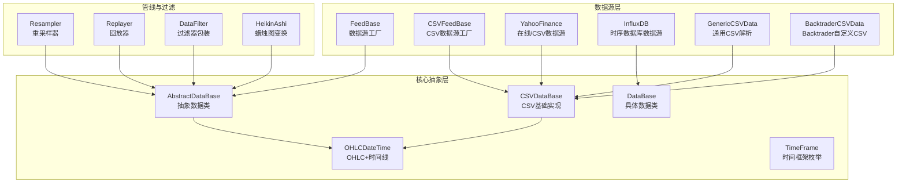
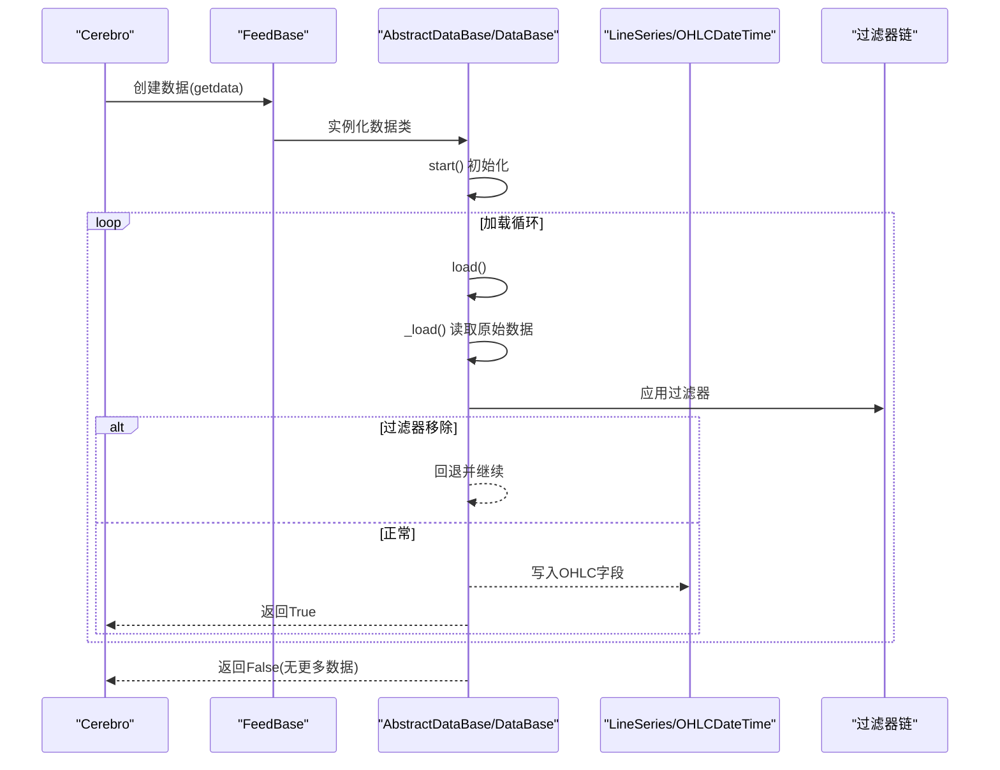
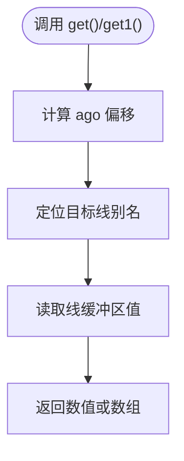
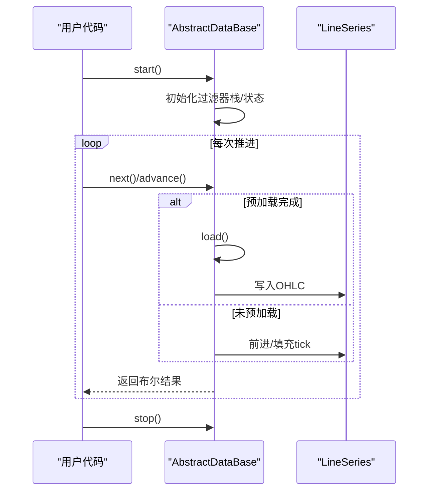
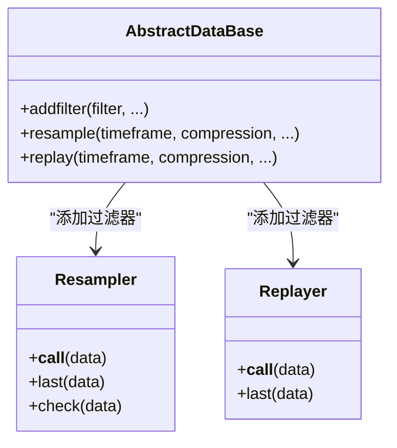
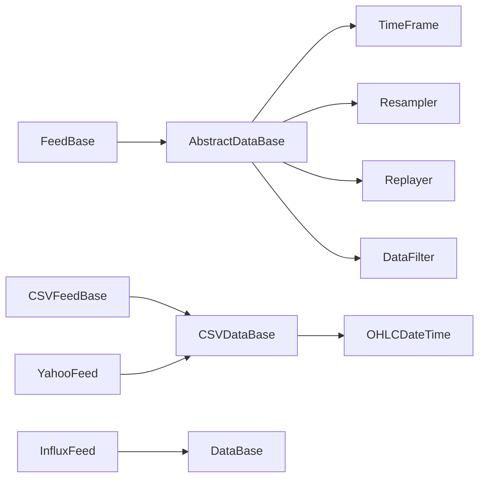

# 数据源API

<cite>
**本文引用的文件**
- [feed.py](file://backtrader/feed.py)
- [dataseries.py](file://backtrader/dataseries.py)
- [lineseries.py](file://backtrader/lineseries.py)
- [resamplerfilter.py](file://backtrader/resamplerfilter.py)
- [datafilter.py](file://backtrader/filters/datafilter.py)
- [heikinashi.py](file://backtrader/filters/heikinashi.py)
- [csvgeneric.py](file://backtrader/feeds/csvgeneric.py)
- [yahoo.py](file://backtrader/feeds/yahoo.py)
- [influxfeed.py](file://backtrader/feeds/influxfeed.py)
- [btcsv.py](file://backtrader/feeds/btcsv.py)
- [data-resample.py](file://samples/data-resample/data-resample.py)
- [data-replay.py](file://samples/data-replay/data-replay.py)
- [data-pandas.py](file://samples/data-pandas/data-pandas.py)
</cite>

## 目录
1. [简介](#简介)
2. [项目结构](#项目结构)
3. [核心组件](#核心组件)
4. [架构总览](#架构总览)
5. [详细组件分析](#详细组件分析)
6. [依赖关系分析](#依赖关系分析)
7. [性能考量](#性能考量)
8. [故障排查指南](#故障排查指南)
9. [结论](#结论)
10. [附录](#附录)

## 简介
本文件为Backtrader数据源（Feed）API的完整参考文档，覆盖以下方面：
- 数据获取方法：get()、get1()、haslivedata() 等
- 数据配置API：setenvironment()、setmarket()、settimezone() 等
- 数据流控制API：start()、stop()、pause()、resume() 等
- 数据格式API：getdataname()、getdatetime()、getopen()、gethigh()、getlow()、getclose()、getvolume() 等
- 数据对齐与重采样API：setusedatetime()、setcompression()、setresample() 等
- 数据过滤API：setfilter()、getfilter() 等
- 数据通知API：notify_data() 等
- 数据验证与异常处理
- 实际数据源实现与使用示例

## 项目结构
Backtrader将数据源抽象为“数据类”和“数据源基类”，通过统一的管线完成数据加载、过滤、对齐与回放。

图表来源
- [feed.py](file://backtrader/feed.py#L603-L635)
- [feed.py](file://backtrader/feed.py#L122-L123)
- [feed.py](file://backtrader/feed.py#L649-L662)
- [resamplerfilter.py](file://backtrader/resamplerfilter.py#L435-L461)
- [resamplerfilter.py](file://backtrader/resamplerfilter.py#L563-L612)
- [datafilter.py](file://backtrader/filters/datafilter.py#L27-L42)
- [heikinashi.py](file://backtrader/filters/heikinashi.py#L28-L55)
- [csvgeneric.py](file://backtrader/feeds/csvgeneric.py#L32-L86)
- [yahoo.py](file://backtrader/feeds/yahoo.py#L37-L92)
- [influxfeed.py](file://backtrader/feeds/influxfeed.py#L41-L62)

章节来源
- [feed.py](file://backtrader/feed.py#L603-L635)
- [feed.py](file://backtrader/feed.py#L122-L123)
- [dataseries.py](file://backtrader/dataseries.py#L33-L58)
- [lineseries.py](file://backtrader/lineseries.py#L444-L478)

## 核心组件
- 抽象数据类 AbstractDataBase：提供数据生命周期管理、时间转换、过滤栈、通知队列、预加载、加载管线等能力。
- 数据类 DataBase：具体数据类，继承自 AbstractDataBase。
- CSV数据类 CSVDataBase：负责打开文件、读取行并解析为OHLC等字段。
- 工厂类 FeedBase：统一创建数据实例，传递参数。
- 时间框架 TimeFrame：定义时间粒度（Ticks、Seconds、Minutes、Days、Weeks、Months、Years）。
- 线序列 LineSeries：提供 get()、get1() 等访问接口；OHLCDateTime 定义标准字段别名。
- 过滤器链：SimpleFilterWrapper、DataFilter、HeikinAshi 等。
- 对齐与重采样：Resampler、Replayer。

章节来源
- [feed.py](file://backtrader/feed.py#L122-L123)
- [feed.py](file://backtrader/feed.py#L202-L207)
- [feed.py](file://backtrader/feed.py#L438-L444)
- [feed.py](file://backtrader/feed.py#L471-L537)
- [dataseries.py](file://backtrader/dataseries.py#L107-L113)
- [dataseries.py](file://backtrader/dataseries.py#L33-L58)
- [lineseries.py](file://backtrader/lineseries.py#L237-L242)

## 架构总览
Backtrader数据源采用“工厂+抽象类+管线”的架构。数据从数据源加载到 AbstractDataBase 的线序列中，经过过滤器链处理后对外提供统一的OHLC数据访问接口。

图表来源
- [feed.py](file://backtrader/feed.py#L617-L627)
- [feed.py](file://backtrader/feed.py#L438-L444)
- [feed.py](file://backtrader/feed.py#L471-L537)

## 详细组件分析

### 数据获取与访问API
- get(ago=0, size=1, line=0)：从指定线的 ago 偏移位置读取 size 长度的数据块。由 LineSeries 提供。
- get1(ago=0, line=0)：读取单个值，是 get() 的特例。
- haslivedata()：是否为实时数据源（默认 False，需子类覆写）。
- getdataname()/getname()：获取数据名称（由 AbstractDataBase 维护 _dataname/_name）。
- getdatetime()/getopen()/gethigh()/getlow()/getclose()/getvolume()：通过 OHLCDateTime 的别名访问当前条目各字段。

图表来源
- [lineseries.py](file://backtrader/lineseries.py#L237-L242)
- [dataseries.py](file://backtrader/dataseries.py#L107-L113)
- [feed.py](file://backtrader/feed.py#L258-L259)

章节来源
- [lineseries.py](file://backtrader/lineseries.py#L237-L242)
- [dataseries.py](file://backtrader/dataseries.py#L107-L113)
- [feed.py](file://backtrader/feed.py#L258-L259)

### 数据配置API
- setenvironment(env)：保存运行环境引用，用于后续时间转换、日历等。
- setmarket()/settimezone()：在 AbstractDataBase 中通过 tz/tzinput 参数间接生效；也可通过 _gettz/_gettzinput 覆写。
- 其他配置：fromdate/todate、sessionstart/sessionend、filters 列表等。

章节来源
- [feed.py](file://backtrader/feed.py#L319-L324)
- [feed.py](file://backtrader/feed.py#L237-L244)
- [feed.py](file://backtrader/feed.py#L125-L139)

### 数据流控制API
- start()/stop()：启动/停止数据源；AbstractDataBase.start() 初始化过滤器栈与状态。
- pause()/resume()：未在 AbstractDataBase 中直接暴露，通常通过外部控制（如策略暂停）实现。
- preload()：预加载直至无法再加载为止，并归位至起始点。
- next()/advance()：推进指针并触发加载或前进；支持 datamaster 对齐与 tick 填充。

图表来源
- [feed.py](file://backtrader/feed.py#L302-L308)
- [feed.py](file://backtrader/feed.py#L400-L437)
- [feed.py](file://backtrader/feed.py#L438-L444)

章节来源
- [feed.py](file://backtrader/feed.py#L302-L308)
- [feed.py](file://backtrader/feed.py#L400-L437)
- [feed.py](file://backtrader/feed.py#L438-L444)

### 数据格式API
- OHLCDateTime 定义标准字段别名：datetime、open、high、low、close、volume、openinterest。
- 通过 LineSeries 的别名访问器（如 line_0、line_close 等）或直接按别名访问。
- 通用CSV解析：GenericCSVData 支持 dtformat、tmformat、nullvalue 等参数，按列索引映射到 OHLC 字段。

章节来源
- [dataseries.py](file://backtrader/dataseries.py#L107-L113)
- [dataseries.py](file://backtrader/dataseries.py#L67-L69)
- [csvgeneric.py](file://backtrader/feeds/csvgeneric.py#L72-L85)

### 数据对齐与重采样API
- setusedatetime()/setcompression()/setresample()：通过 addfilter(Resampler,...) 实现重采样；通过 addfilter(Replayer,...) 实现回放。
- Resampler：将细粒度数据聚合到更粗粒度时间边界，支持 rightedge、adjbartime、bar2edge 等参数。
- Replayer：模拟市场逐步构建更粗粒度K线，仅在完整周期结束才推进长度。

图表来源
- [feed.py](file://backtrader/feed.py#L592-L597)
- [resamplerfilter.py](file://backtrader/resamplerfilter.py#L435-L461)
- [resamplerfilter.py](file://backtrader/resamplerfilter.py#L563-L612)

章节来源
- [feed.py](file://backtrader/feed.py#L592-L597)
- [resamplerfilter.py](file://backtrader/resamplerfilter.py#L435-L461)
- [resamplerfilter.py](file://backtrader/resamplerfilter.py#L563-L612)

### 数据过滤API
- setfilter()/getfilter()：通过 addfilter_simple/addfilter 添加过滤器；DataFilter 包装任意可调用函数作为过滤条件。
- HeikinAshi：将OHLC转换为HeikinAshi蜡烛图，不改变数据长度。
- SimpleFilterWrapper：将简单过滤器包装为可调用对象，返回True表示移除当前条。

章节来源
- [feed.py](file://backtrader/feed.py#L326-L340)
- [datafilter.py](file://backtrader/filters/datafilter.py#L27-L42)
- [heikinashi.py](file://backtrader/filters/heikinashi.py#L28-L55)

### 数据通知API
- put_notification(status, ...)：将状态变更推送到通知队列。
- get_notifications()：取出待处理的通知列表；使用 None 作为分隔标记。
- notify_data()：在策略中接收数据状态变化通知（通过 cerebro 分发）。

章节来源
- [feed.py](file://backtrader/feed.py#L274-L292)

### 数据验证与异常处理
- 时间转换：date2num()/num2date() 在存在 _tzinput/_tz 时进行本地化与时区转换。
- 日期范围：fromdate/todate 在 load() 中进行过滤，越界则回退丢弃。
- 文件/网络错误：CSV/在线数据源在 start() 或 _load() 中抛出异常或返回 False。
- 过滤器异常：过滤器返回异常时，系统会回退并继续尝试。

章节来源
- [feed.py](file://backtrader/feed.py#L246-L257)
- [feed.py](file://backtrader/feed.py#L506-L514)
- [yahoo.py](file://backtrader/feeds/yahoo.py#L253-L376)

### 实际数据源实现与使用示例
- CSV数据源：GenericCSVData、BacktraderCSVData、YahooFinanceCSVData。
- 在线数据源：YahooFinanceData 使用 yfinance 下载并转为CSV流。
- 时序数据库：InfluxDB 数据源通过查询聚合OHLC字段。
- 示例脚本：data-resample.py 展示 resampledata；data-replay.py 展示 replay；data-pandas.py 展示 PandasData。

章节来源
- [csvgeneric.py](file://backtrader/feeds/csvgeneric.py#L32-L85)
- [btcsv.py](file://backtrader/feeds/btcsv.py#L30-L64)
- [yahoo.py](file://backtrader/feeds/yahoo.py#L196-L382)
- [influxfeed.py](file://backtrader/feeds/influxfeed.py#L41-L116)
- [data-resample.py](file://samples/data-resample/data-resample.py#L30-L96)
- [data-replay.py](file://samples/data-replay/data-replay.py#L52-L121)
- [data-pandas.py](file://samples/data-pandas/data-pandas.py#L32-L93)

## 依赖关系分析
- 抽象层与实现层解耦：AbstractDataBase 与具体数据类（CSV、Yahoo、Influx）通过工厂类 FeedBase 解耦。
- 过滤器链：过滤器以元组形式存储在 _filters/_ffilters 中，按顺序执行。
- 时间框架：TimeFrame 枚举贯穿数据类与重采样器，确保对齐与压缩逻辑一致。

图表来源
- [feed.py](file://backtrader/feed.py#L603-L635)
- [feed.py](file://backtrader/feed.py#L122-L123)
- [dataseries.py](file://backtrader/dataseries.py#L33-L58)
- [resamplerfilter.py](file://backtrader/resamplerfilter.py#L435-L461)

章节来源
- [feed.py](file://backtrader/feed.py#L603-L635)
- [dataseries.py](file://backtrader/dataseries.py#L33-L58)

## 性能考量
- 预加载：preload() 可显著减少实时数据源的I/O开销，但会占用内存。
- 过滤器栈：过滤器数量与复杂度直接影响每条数据的处理时间。
- 重采样/回放：在高频数据上进行重采样/回放会增加CPU与内存消耗，建议合理设置 compression 与 timeframe。
- 缓冲区：qbuffer() 与 LineSeries 的缓冲策略影响内存占用与回溯效率。

## 故障排查指南
- 无法加载数据：检查 dataname 是否正确、文件权限、网络连接（在线数据源）、fromdate/todate 范围是否合理。
- 时间错位：确认 tz/tzinput 设置，确保 date2num/num2date 的时区转换正确。
- 过滤器误删：检查过滤器返回值与逻辑，必要时使用 SimpleFilterWrapper 包装。
- 重采样边界异常：调整 bar2edge、adjbartime、rightedge 参数，确保时间边界与压缩符合预期。

## 结论
Backtrader数据源API通过统一的抽象层与灵活的过滤/重采样机制，提供了强大的多数据源接入能力。遵循本文档的接口规范与最佳实践，可在保证性能的同时实现复杂的时间序列分析与交易回测。

## 附录
- 关键API速查
  - 获取：get()、get1()、haslivedata()
  - 配置：setenvironment()、settimezone()、setmarket()
  - 控制：start()、stop()、preload()、next()、advance()
  - 格式：getdataname()、getdatetime()、getopen()、gethigh()、getlow()、getclose()、getvolume()
  - 对齐/重采样：resample()、replay()
  - 过滤：addfilter()、addfilter_simple()、DataFilter、HeikinAshi
  - 通知：put_notification()、get_notifications()