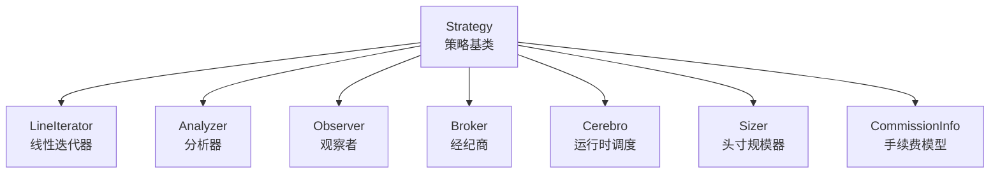
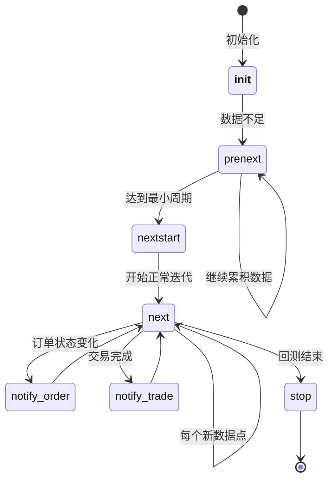
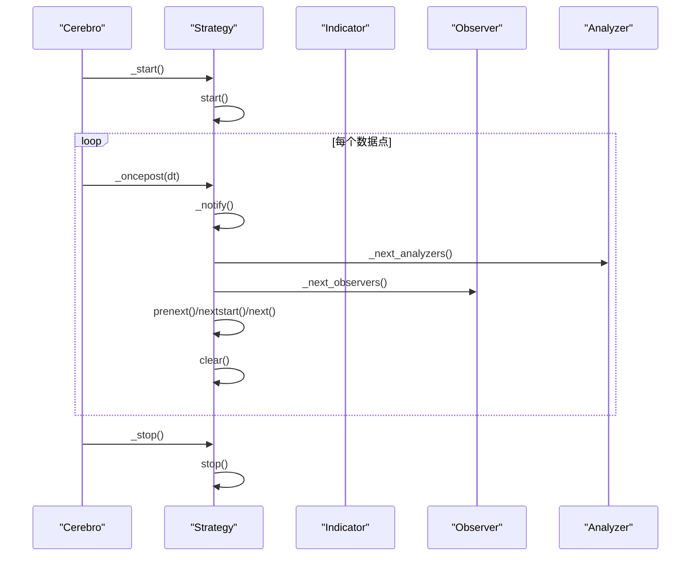
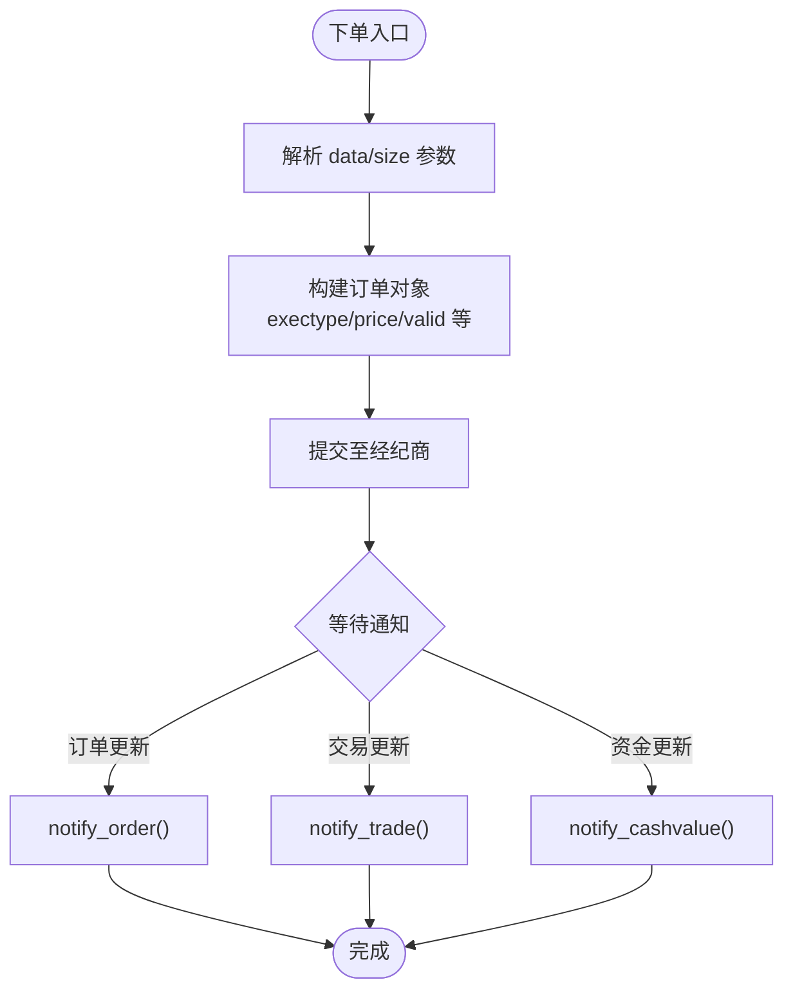
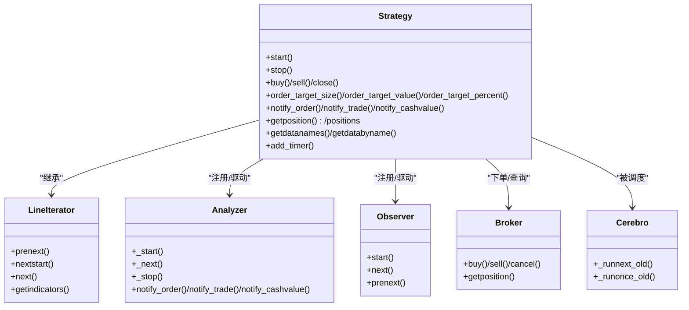

# 策略API

<cite>
**本文引用的文件**
- [backtrader/strategy.py](file://backtrader/strategy.py)
- [backtrader/lineiterator.py](file://backtrader/lineiterator.py)
- [backtrader/analyzer.py](file://backtrader/analyzer.py)
- [backtrader/observer.py](file://backtrader/observer.py)
- [backtrader/broker.py](file://backtrader/broker.py)
- [backtrader/cerebro.py](file://backtrader/cerebro.py)
- [backtrader/comminfo.py](file://backtrader/comminfo.py)
- [backtrader/sizer.py](file://backtrader/sizer.py)
- [backtrader/strategies/sma_crossover.py](file://backtrader/strategies/sma_crossover.py)
- [samples/sigsmacross/sigsmacross.py](file://samples/sigsmacross/sigsmacross.py)
- [samples/slippage/slippage.py](file://samples/slippage/slippage.py)
- [backtrader/brokers/bbroker.py](file://backtrader/brokers/bbroker.py)
- [backtrader/brokers/oandabroker.py](file://backtrader/brokers/oandabroker.py)
- [backtrader/brokers/vcbroker.py](file://backtrader/brokers/vcbroker.py)
- [backtrader/metabase.py](file://backtrader/metabase.py)
</cite>

## 目录
1. [简介](#简介)
2. [项目结构](#项目结构)
3. [核心组件](#核心组件)
4. [架构总览](#架构总览)
5. [详细组件分析](#详细组件分析)
6. [依赖关系分析](#依赖关系分析)
7. [性能考量](#性能考量)
8. [故障排查指南](#故障排查指南)
9. [结论](#结论)
10. [附录](#附录)

## 简介
本文件为 Strategy 基类的完整 API 参考文档，覆盖策略生命周期、下单与信号、参数与观察者、通知机制、指标访问以及错误处理与验证要点，并提供可直接对照的源码路径以便进一步查阅。

## 项目结构
Strategy 位于 backtrader 核心模块中，与线性迭代器（LineIterator）、分析器（Analyzer）、观察者（Observer）、经纪商（Broker）等协同工作；策略通过 cerebro 进行生命周期调度与运行。

图表来源
- [backtrader/strategy.py](file://backtrader/strategy.py#L107-L120)
- [backtrader/lineiterator.py](file://backtrader/lineiterator.py#L148-L168)
- [backtrader/analyzer.py](file://backtrader/analyzer.py#L190-L212)
- [backtrader/observer.py](file://backtrader/observer.py#L46-L68)
- [backtrader/broker.py](file://backtrader/broker.py)
- [backtrader/cerebro.py](file://backtrader/cerebro.py#L1375-L1473)
- [backtrader/sizer.py](file://backtrader/sizer.py)
- [backtrader/comminfo.py](file://backtrader/comminfo.py)

章节来源
- [backtrader/strategy.py](file://backtrader/strategy.py#L107-L120)
- [backtrader/lineiterator.py](file://backtrader/lineiterator.py#L148-L168)

## 核心组件
- 策略生命周期方法：__init__、start()、stop()、prenext()、next()、nextstart()、_oncepost()、_next() 等
- 下单与信号：buy()、sell()、close()、buy_bracket()、sell_bracket()、order_target_* 系列
- 参数与配置：setparameters()、getparameters()、setperiod()、setcommission()、set_slippage() 等
- 观察者管理：subscribe()、unsubscribe()（在策略侧通过内部集合管理）
- 通知机制：notify_order()、notify_trade()、notify_cashvalue()、notify_fund()、notify_timer()
- 指标与数据：getindicators()、getobservers()、getdatabaselines()（间接通过内部集合）
- 其他：add_timer()、set_tradehistory()、clear()

章节来源
- [backtrader/strategy.py](file://backtrader/strategy.py#L415-L493)
- [backtrader/strategy.py](file://backtrader/strategy.py#L774-L999)
- [backtrader/strategy.py](file://backtrader/strategy.py#L1247-L1376)
- [backtrader/strategy.py](file://backtrader/strategy.py#L1612-L1634)

## 架构总览
策略生命周期由 cerebro 驱动，按最小周期（min_period）逐步推进，先 prenext，再 nextstart，后进入常规 next 循环；期间穿插分析器与观察者的生命周期调用。

图表来源
- [backtrader/lineiterator.py](file://backtrader/lineiterator.py#L323-L347)
- [backtrader/strategy.py](file://backtrader/strategy.py#L393-L417)
- [backtrader/strategy.py](file://backtrader/strategy.py#L482-L493)

## 详细组件分析

### 生命周期与控制流
- __init__/__new__：由元类 MetaStrategy 完成实例化、绑定 cerebro、分配策略 ID、初始化 broker/sizer/orders 等
- start()：回测开始前调用，用于一次性初始化
- stop()：回测结束后调用，用于资源清理
- prenext()/nextstart()/next()：按最小周期推进，先 prenext 积累，再 nextstart 启动，随后每个周期调用 next
- _oncepost()/_next()：每轮数据到达后的统一推进与通知
- clear()：清空待处理订单与交易，准备下一周期

图表来源
- [backtrader/strategy.py](file://backtrader/strategy.py#L393-L417)
- [backtrader/strategy.py](file://backtrader/strategy.py#L482-L493)
- [backtrader/strategy.py](file://backtrader/strategy.py#L292-L318)
- [backtrader/strategy.py](file://backtrader/strategy.py#L355-L389)
- [backtrader/strategy.py](file://backtrader/strategy.py#L381-L389)
- [backtrader/cerebro.py](file://backtrader/cerebro.py#L1375-L1473)

章节来源
- [backtrader/strategy.py](file://backtrader/strategy.py#L393-L417)
- [backtrader/strategy.py](file://backtrader/strategy.py#L482-L493)
- [backtrader/strategy.py](file://backtrader/strategy.py#L292-L318)
- [backtrader/strategy.py](file://backtrader/strategy.py#L355-L389)
- [backtrader/strategy.py](file://backtrader/strategy.py#L381-L389)
- [backtrader/lineiterator.py](file://backtrader/lineiterator.py#L323-L347)

### 下单与信号API
- buy()/sell()/close()：向经纪商提交多/空/平仓订单，支持 size、price、exectype、valid、parent、transmit 等参数
- buy_bracket()/sell_bracket()：组合 bracket 订单（主单+止损+止盈），支持抑制低/高边
- order_target_size()/order_target_value()/order_target_percent()：目标再平衡下单
- cancel()：取消订单
- notify_order()/notify_trade()/notify_cashvalue()/notify_fund()：接收订单/交易/资金变动通知
- add_timer()：注册定时器回调
- getposition()/position 属性：查询当前持仓
- getpositionbyname()/positionbyname
- getpositions()/positions
- getpositionsbyname()/positionsbyname

图表来源
- [backtrader/strategy.py](file://backtrader/strategy.py#L774-L941)
- [backtrader/strategy.py](file://backtrader/strategy.py#L943-L999)
- [backtrader/strategy.py](file://backtrader/strategy.py#L1001-L1173)
- [backtrader/strategy.py](file://backtrader/strategy.py#L1247-L1376)
- [backtrader/strategy.py](file://backtrader/strategy.py#L770-L772)
- [backtrader/strategy.py](file://backtrader/strategy.py#L738-L756)
- [backtrader/strategy.py](file://backtrader/strategy.py#L615-L724)

章节来源
- [backtrader/strategy.py](file://backtrader/strategy.py#L774-L941)
- [backtrader/strategy.py](file://backtrader/strategy.py#L943-L999)
- [backtrader/strategy.py](file://backtrader/strategy.py#L1001-L1173)
- [backtrader/strategy.py](file://backtrader/strategy.py#L1247-L1376)
- [backtrader/strategy.py](file://backtrader/strategy.py#L770-L772)
- [backtrader/strategy.py](file://backtrader/strategy.py#L738-L756)
- [backtrader/strategy.py](file://backtrader/strategy.py#L615-L724)

### 参数与配置API
- setparameters()/getparameters()：策略参数的设置与获取（通过参数容器）
- setperiod()：设置周期（影响指标最小周期计算）
- setcommission()/getcommissioninfo()：设置/获取手续费模型
- set_slippage_*()：设置滑点（百分比/固定点）
- setsizer()/getsizer()/sizer 属性：设置/获取头寸规模器
- getdatanames()/getdatabyname()：按名称获取数据引用

章节来源
- [backtrader/strategy.py](file://backtrader/strategy.py#L1444-L1469)
- [backtrader/strategy.py](file://backtrader/strategy.py#L1378-L1436)
- [backtrader/strategy.py](file://backtrader/strategy.py#L758-L768)
- [backtrader/comminfo.py](file://backtrader/comminfo.py)
- [backtrader/brokers/bbroker.py](file://backtrader/brokers/bbroker.py#L326-L346)

### 观察者与分析器管理
- _addobserver()/_addanalyzer()/_addanalyzer_slave()：添加观察者/分析器
- _next_observers()/_next_analyzers()：在每个周期推进观察者/分析器
- getobservers()：获取已注册观察者列表
- getwriters()：写入器相关（CSV输出）

章节来源
- [backtrader/strategy.py](file://backtrader/strategy.py#L250-L248)
- [backtrader/strategy.py](file://backtrader/strategy.py#L355-L389)
- [backtrader/observer.py](file://backtrader/observer.py#L46-L68)
- [backtrader/analyzer.py](file://backtrader/analyzer.py#L190-L212)

### 通知机制API
- notify_order()/notify_trade()/notify_cashvalue()/notify_fund()：接收订单/交易/资金通知
- _notify()：批量派发订单与交易通知，并触发分析器通知
- notify_store()/notify_data()：来自存储/数据的通知

章节来源
- [backtrader/strategy.py](file://backtrader/strategy.py#L577-L614)
- [backtrader/strategy.py](file://backtrader/strategy.py#L738-L756)
- [backtrader/analyzer.py](file://backtrader/analyzer.py#L158-L212)

### 指标访问API
- getindicators()：返回策略内所有指标实例
- getobservers()：返回策略内所有观察者实例
- getdatabaselines()：通过数据对象访问其基础线（如开盘/收盘等）

章节来源
- [backtrader/lineiterator.py](file://backtrader/lineiterator.py#L198-L200)
- [backtrader/strategy.py](file://backtrader/strategy.py#L419-L450)

### 实际策略开发示例
- SMA 跨越策略（MA_CrossOver）：基于移动平均交叉进行买卖
- 信号策略（sigsmacross）：使用信号系统自动下单

章节来源
- [backtrader/strategies/sma_crossover.py](file://backtrader/strategies/sma_crossover.py#L29-L75)
- [samples/sigsmacross/sigsmacross.py](file://samples/sigsmacross/sigsmacross.py#L42-L83)

## 依赖关系分析

图表来源
- [backtrader/strategy.py](file://backtrader/strategy.py#L107-L120)
- [backtrader/lineiterator.py](file://backtrader/lineiterator.py#L148-L168)
- [backtrader/analyzer.py](file://backtrader/analyzer.py#L190-L212)
- [backtrader/observer.py](file://backtrader/observer.py#L46-L68)
- [backtrader/broker.py](file://backtrader/broker.py)
- [backtrader/cerebro.py](file://backtrader/cerebro.py#L1375-L1473)

章节来源
- [backtrader/strategy.py](file://backtrader/strategy.py#L107-L120)
- [backtrader/lineiterator.py](file://backtrader/lineiterator.py#L148-L168)
- [backtrader/analyzer.py](file://backtrader/analyzer.py#L190-L212)
- [backtrader/observer.py](file://backtrader/observer.py#L46-L68)
- [backtrader/broker.py](file://backtrader/broker.py)
- [backtrader/cerebro.py](file://backtrader/cerebro.py#L1375-L1473)

## 性能考量
- 内存节省：qbuffer() 可按需启用内存压缩（保存指标/观察者/数据）
- 最小周期：_periodset() 自动推导策略所需最小周期，避免过早计算
- 批量通知：_notify() 合并订单/交易通知，减少重复处理
- 分析器/观察者推进：按 min_period 状态分别调用 _next/_nextstart/_prenext，避免无意义计算

章节来源
- [backtrader/strategy.py](file://backtrader/strategy.py#L120-L154)
- [backtrader/strategy.py](file://backtrader/strategy.py#L155-L216)
- [backtrader/strategy.py](file://backtrader/strategy.py#L577-L614)
- [backtrader/strategy.py](file://backtrader/strategy.py#L381-L389)

## 故障排查指南
- 订单未成交或延迟：检查 valid/exectype/price 设置，确认经纪商实现（如 IB/OANDA/VCT）
- 滑点与手续费：通过 set_slippage_*()/setcommission() 配置，核对实际执行价格
- 参数校验：使用 AutoInfoClass 的 _getkwargsdefault() 等辅助方法进行默认值与键值检查
- 通知缺失：确认 quicknotify 配置与 _notify() 调用链是否正确

章节来源
- [backtrader/brokers/bbroker.py](file://backtrader/brokers/bbroker.py#L326-L346)
- [backtrader/brokers/oandabroker.py](file://backtrader/brokers/oandabroker.py#L313-L357)
- [backtrader/brokers/vcbroker.py](file://backtrader/brokers/vcbroker.py#L231-L303)
- [backtrader/metabase.py](file://backtrader/metabase.py#L164-L187)
- [backtrader/strategy.py](file://backtrader/strategy.py#L577-L614)

## 结论
Strategy 基类提供了完整的生命周期、下单与信号、参数与配置、通知与观察者管理、指标访问等能力。通过 cerebro 的统一调度与 Broker/Analyzer/Observer 的协作，策略可在回测/实盘环境中稳定运行。建议在实际开发中：
- 明确最小周期与指标依赖，避免过早计算
- 合理配置滑点与手续费，贴近真实市场
- 使用信号/bracket等高级下单方式提升策略鲁棒性
- 通过通知机制与分析器完善风控与绩效评估

## 附录

### 策略生命周期方法一览
- __init__/__new__：实例化与绑定环境
- start()：启动前初始化
- prenext()/nextstart()/next()：按最小周期推进
- _oncepost()/_next()：每轮推进与通知
- stop()：停止后清理
- clear()：清空待处理订单/交易

章节来源
- [backtrader/strategy.py](file://backtrader/strategy.py#L393-L417)
- [backtrader/strategy.py](file://backtrader/strategy.py#L482-L493)
- [backtrader/strategy.py](file://backtrader/strategy.py#L292-L318)
- [backtrader/strategy.py](file://backtrader/strategy.py#L355-L389)
- [backtrader/lineiterator.py](file://backtrader/lineiterator.py#L323-L347)

### 下单方法参数要点
- data：目标数据，默认 self.datas[0]
- size：下单数量，None 时由 sizer 计算
- price/plimit：触发价/限价，依执行类型而定
- exectype：市价/限价/止损/停价/收盘价/追踪止损等
- valid：有效期（None/日期/当日/数值）
- parent/transmit：组单/子单传输控制
- trailamount/trailpercent：追踪止损距离

章节来源
- [backtrader/strategy.py](file://backtrader/strategy.py#L774-L941)
- [backtrader/strategy.py](file://backtrader/strategy.py#L943-L999)
- [backtrader/strategy.py](file://backtrader/strategy.py#L1001-L1173)
- [backtrader/strategy.py](file://backtrader/strategy.py#L1247-L1376)

### 通知回调一览
- notify_order(order)：订单状态变更
- notify_trade(trade)：交易完成
- notify_cashvalue(cash, value)：资金/净值
- notify_fund(cash, value, fundvalue, shares)：基金份额
- notify_timer(timer, when, ...)：定时器触发
- notify_store(msg, ...)：存储层消息
- notify_data(data, status, ...)：数据状态

章节来源
- [backtrader/strategy.py](file://backtrader/strategy.py#L738-L756)
- [backtrader/strategy.py](file://backtrader/strategy.py#L615-L724)
- [backtrader/analyzer.py](file://backtrader/analyzer.py#L158-L212)

### 示例策略
- MA_CrossOver：基于简单移动平均交叉的长/多策略
- sigsmacross：使用信号系统自动下单的示例

章节来源
- [backtrader/strategies/sma_crossover.py](file://backtrader/strategies/sma_crossover.py#L29-L75)
- [samples/sigsmacross/sigsmacross.py](file://samples/sigsmacross/sigsmacross.py#L42-L83)