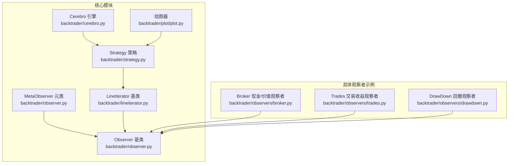
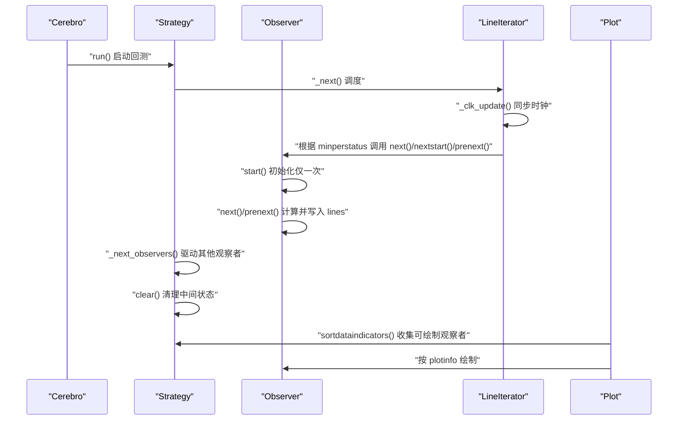
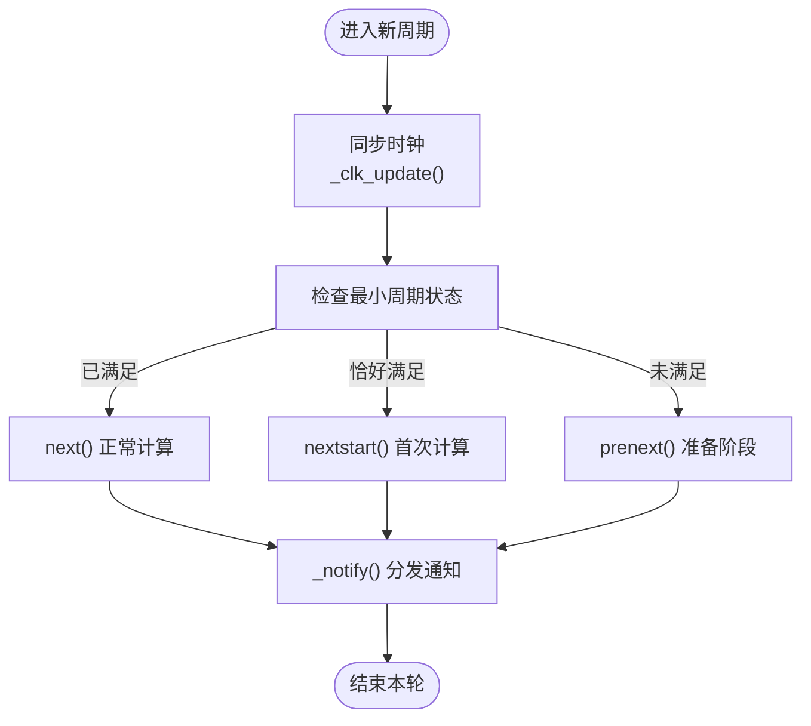
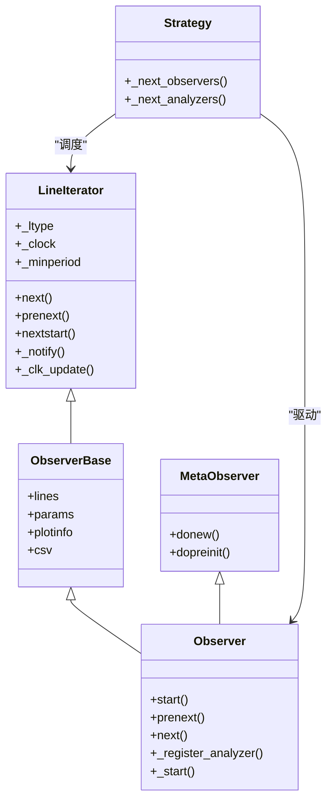
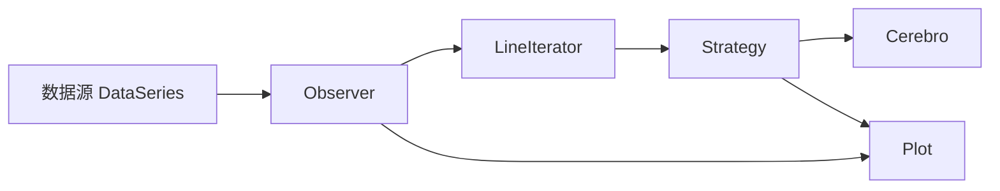

# 观察者API

<cite>
**本文引用的文件**
- [backtrader/observer.py](file://backtrader/observer.py)
- [backtrader/lineiterator.py](file://backtrader/lineiterator.py)
- [backtrader/strategy.py](file://backtrader/strategy.py)
- [backtrader/cerebro.py](file://backtrader/cerebro.py)
- [backtrader/plot/plot.py](file://backtrader/plot/plot.py)
- [backtrader/observers/broker.py](file://backtrader/observers/broker.py)
- [backtrader/observers/trades.py](file://backtrader/observers/trades.py)
- [backtrader/observers/drawdown.py](file://backtrader/observers/drawdown.py)
- [samples/observers/observers-default.py](file://samples/observers/observers-default.py)
</cite>

## 目录
1. [简介](#简介)
2. [项目结构](#项目结构)
3. [核心组件](#核心组件)
4. [架构总览](#架构总览)
5. [详细组件分析](#详细组件分析)
6. [依赖关系分析](#依赖关系分析)
7. [性能考量](#性能考量)
8. [故障排查指南](#故障排查指南)
9. [结论](#结论)
10. [附录：使用与示例](#附录使用与示例)

## 简介
本文件为 Backtrader 观察者（Observer）基类的完整 API 参考文档，覆盖观察者生命周期方法、配置与数据访问、通知机制、组合与状态管理、可视化接口，以及验证与异常处理要点。文档同时给出关键流程的时序图与类图，帮助开发者快速理解并正确扩展自定义观察者。

## 项目结构
Backtrader 的观察者体系由“元类驱动的基类”和“策略/回测引擎”的协作构成：
- 观察者基类与元类位于 backtrader/observer.py
- 观察者的生命周期调度由 backtrader/lineiterator.py 提供
- 回测引擎在 backtrader/cerebro.py 中注册与实例化观察者
- 策略在 backtrader/strategy.py 中驱动观察者执行
- 可视化在 backtrader/plot/plot.py 中对观察者进行排序与绘制
- 具体观察者示例位于 backtrader/observers/*.py

**图表来源**
- [backtrader/observer.py](file://backtrader/observer.py#L29-L68)
- [backtrader/lineiterator.py](file://backtrader/lineiterator.py#L148-L399)
- [backtrader/strategy.py](file://backtrader/strategy.py#L255-L388)
- [backtrader/cerebro.py](file://backtrader/cerebro.py#L650-L688)
- [backtrader/plot/plot.py](file://backtrader/plot/plot.py#L828-L887)
- [backtrader/observers/broker.py](file://backtrader/observers/broker.py#L27-L145)
- [backtrader/observers/trades.py](file://backtrader/observers/trades.py#L32-L163)
- [backtrader/observers/drawdown.py](file://backtrader/observers/drawdown.py#L28-L120)

**章节来源**
- [backtrader/observer.py](file://backtrader/observer.py#L29-L68)
- [backtrader/lineiterator.py](file://backtrader/lineiterator.py#L148-L399)
- [backtrader/strategy.py](file://backtrader/strategy.py#L255-L388)
- [backtrader/cerebro.py](file://backtrader/cerebro.py#L650-L688)
- [backtrader/plot/plot.py](file://backtrader/plot/plot.py#L828-L887)

## 核心组件
- 观察者基类与元类
  - MetaObserver：负责实例化后初始化、策略级时钟切换等
  - Observer：提供默认生命周期钩子（start、prenext、next）、分析器注册入口
- 生命周期基类
  - LineIterator：统一的“可迭代对象”基类，提供 next/prenext/nextstart 等调度逻辑
- 策略与引擎
  - Strategy：在每个周期中驱动观察者与分析器的执行序列
  - Cerebro：注册观察者类，运行时实例化并启动
- 可视化
  - Plot：根据观察者的 plotinfo 对其进行分组与绘制

**章节来源**
- [backtrader/observer.py](file://backtrader/observer.py#L29-L68)
- [backtrader/lineiterator.py](file://backtrader/lineiterator.py#L148-L399)
- [backtrader/strategy.py](file://backtrader/strategy.py#L255-L388)
- [backtrader/cerebro.py](file://backtrader/cerebro.py#L650-L688)
- [backtrader/plot/plot.py](file://backtrader/plot/plot.py#L828-L887)

## 架构总览
下图展示从引擎到策略、再到观察者的典型调用链，以及观察者内部的生命周期调度。

**图表来源**
- [backtrader/cerebro.py](file://backtrader/cerebro.py#L650-L688)
- [backtrader/strategy.py](file://backtrader/strategy.py#L255-L388)
- [backtrader/lineiterator.py](file://backtrader/lineiterator.py#L259-L306)
- [backtrader/plot/plot.py](file://backtrader/plot/plot.py#L828-L887)

## 详细组件分析

### 观察者生命周期方法
- __init__（构造）
  - 由元类与基类共同完成：参数解析、数据源绑定、最小周期计算、注册到所有者
  - 观察者通常无需重载此方法；如需自定义，应确保先调用父类构造
- start()
  - 在首次进入稳定期前调用，用于初始化外部资源或派生分析器
  - 默认空实现；可在子类中重载以执行一次性初始化
- prenext()
  - 最小周期未满足时调用；默认行为是直接转发到 next()
  - 子类可重载以在“准备阶段”做些准备工作
- next()
  - 最小周期满足后，每个周期调用一次
  - 子类必须实现此方法以更新自身 lines
- nextstart()
  - 恰好在最小周期满足的那一刻调用一次
  - 默认行为是调用 next()；可重载以执行首笔计算
- stop()
  - 回测结束时调用；用于释放资源
  - 基类默认空实现；可在子类中重载

调用时机与条件
- 调度由 LineIterator 根据“时钟长度”与“最小周期”决定
- 若观察者声明使用策略级时钟（_stclock=True），则其时钟来自策略而非某单一数据

**章节来源**
- [backtrader/observer.py](file://backtrader/observer.py#L46-L68)
- [backtrader/lineiterator.py](file://backtrader/lineiterator.py#L332-L354)
- [backtrader/lineiterator.py](file://backtrader/lineiterator.py#L339-L348)
- [backtrader/lineiterator.py](file://backtrader/lineiterator.py#L259-L285)

### 观察者配置API
- setenvironment()、setposition() 等环境与位置设置方法
  - 观察者本身不直接提供这些方法；若需要“环境/位置”语义，可通过参数 params 与 lines 进行表达
  - 建议通过 params 定义行为开关，通过 lines 定义输出维度
- plotinfo
  - 控制是否绘制、子图模式、叠加层、线型样式等
  - 示例：plot=True、subplot=True、plotname、plotlinelabels、plotlinevalues、plotvaluetags、plotymargin、plotyhlines、plothlines、plotforce、plotmaster 等
- csv
  - 是否导出 CSV 行为（默认开启）

**章节来源**
- [backtrader/observer.py](file://backtrader/observer.py#L52-L54)
- [backtrader/lineiterator.py](file://backtrader/lineiterator.py#L154-L167)

### 观察者数据访问API
- getstate()、getowner() 等数据获取方法
  - 观察者通过 _owner 访问策略上下文
  - 通过 _owner.broker、_owner.datas、_owner.lines 等访问外部状态
  - 通过 self.lines 访问自身输出线
- 数据绑定
  - 使用 bindlines()/bind2lines() 将自身 lines 与所有者或其他对象的 lines 绑定，实现联动更新

**章节来源**
- [backtrader/lineiterator.py](file://backtrader/lineiterator.py#L223-L257)
- [backtrader/observers/broker.py](file://backtrader/observers/broker.py#L38-L39)
- [backtrader/observers/broker.py](file://backtrader/observers/broker.py#L74-L78)

### 观察者通知API
- notify()、notify_owner()
  - 观察者可通过 _owner._addnotification() 注册通知；内部通过 _notify() 分发
  - 策略侧会统一收集并分发通知给观察者与分析器
- 与分析器的通知链路
  - 分析器支持 notify_* 系列回调；观察者可注册子分析器并在 nextstart/next/prenext 中驱动其计算

**章节来源**
- [backtrader/lineiterator.py](file://backtrader/lineiterator.py#L359-L360)
- [backtrader/strategy.py](file://backtrader/strategy.py#L355-L380)
- [backtrader/analyzer.py](file://backtrader/analyzer.py#L158-L212)

### 观察者组合API
- add_observer()、remove_observer()
  - Backtrader 提供 addobserver()/addobservermulti() 用于注册观察者类
  - 实际实例化发生在 run() 时；运行中动态增删需自行维护集合
- 内部组合
  - 观察者可注册子分析器（_register_analyzer），在 nextstart/next/prenext 中驱动其生命周期

**章节来源**
- [backtrader/cerebro.py](file://backtrader/cerebro.py#L650-L667)
- [backtrader/observer.py](file://backtrader/observer.py#L61-L62)

### 观察者状态管理API
- reset()、clear()
  - reset()：重置内部状态（如计数器、历史值）
  - clear()：清理中间计算结果，避免重复统计
  - 策略在每轮结束后调用 clear()，确保干净状态进入下一周期
- 缓冲区与内存
  - qbuffer(savemem)：按需压缩缓冲区，降低内存占用

**章节来源**
- [backtrader/lineseries.py](file://backtrader/lineseries.py#L595-L625)
- [backtrader/lineiterator.py](file://backtrader/lineiterator.py#L365-L377)
- [backtrader/strategy.py](file://backtrader/strategy.py#L353-L353)

### 观察者图表显示API
- plot()、plotlines()
  - 通过 plotinfo 控制绘制行为；plotlines 可为不同输出线指定样式
  - 绘图器会根据 subplot/plot/plotmaster 等字段对观察者进行分组与布局
- 绘图排序
  - Plot.sortdataindicators() 会遍历策略的观察者，按 subplot/over-data 等规则分类

**章节来源**
- [backtrader/observers/trades.py](file://backtrader/observers/trades.py#L52-L64)
- [backtrader/observers/broker.py](file://backtrader/observers/broker.py#L36-L36)
- [backtrader/plot/plot.py](file://backtrader/plot/plot.py#L828-L887)

### 生命周期与调度流程图

**图表来源**
- [backtrader/lineiterator.py](file://backtrader/lineiterator.py#L259-L285)
- [backtrader/lineiterator.py](file://backtrader/lineiterator.py#L359-L360)

### 类关系图（Observer 相关）

**图表来源**
- [backtrader/observer.py](file://backtrader/observer.py#L29-L68)
- [backtrader/lineiterator.py](file://backtrader/lineiterator.py#L148-L399)
- [backtrader/strategy.py](file://backtrader/strategy.py#L255-L388)

## 依赖关系分析
- 观察者与策略
  - 观察者通过 _owner 访问策略；策略在每个周期中统一调度观察者与分析器
- 观察者与数据源
  - 观察者自动绑定到一个或多个数据源；若未显式传入，使用所有者（策略）的数据
- 观察者与绘图
  - 绘图器根据观察者的 plotinfo 进行分组与布局；subplot=true 时独立子图，否则叠加到主图

**图表来源**
- [backtrader/lineiterator.py](file://backtrader/lineiterator.py#L106-L128)
- [backtrader/plot/plot.py](file://backtrader/plot/plot.py#L828-L887)

**章节来源**
- [backtrader/lineiterator.py](file://backtrader/lineiterator.py#L106-L128)
- [backtrader/plot/plot.py](file://backtrader/plot/plot.py#L828-L887)

## 性能考量
- 缓冲区优化
  - 使用 qbuffer(savemem=1) 压缩内存占用；在长回测中建议启用
- 绘图开销
  - 大量观察者叠加绘制会增加渲染时间；合理设置 subplot/plot/plotforce
- 周期调度
  - 避免在 next() 中进行昂贵的 I/O 或复杂计算；必要时拆分为分析器或延迟处理

[本节为通用指导，无需特定文件来源]

## 故障排查指南
- 观察者未被绘制
  - 检查 plotinfo.plot 是否为 True；subplot 与 plotmaster 设置是否正确
- 观察者未更新
  - 确认最小周期是否满足；检查 _stclock 与 _clock 是否指向正确对象
- 数据不一致
  - 确保使用 self.lines 写入输出；避免跨周期共享可变状态而不 reset()

**章节来源**
- [backtrader/plot/plot.py](file://backtrader/plot/plot.py#L828-L887)
- [backtrader/lineiterator.py](file://backtrader/lineiterator.py#L286-L291)

## 结论
Backtrader 的观察者体系以 LineIterator 为核心，通过 MetaObserver 与 Observer 基类提供清晰的生命周期与调度模型。开发者只需专注于 next() 的实现与数据绑定，即可高效构建可视化与报告型观察者。配合 cerebro 的注册机制与策略的统一调度，观察者可以无缝融入整个回测流水线。

[本节为总结性内容，无需特定文件来源]

## 附录：使用与示例
- 注册与运行观察者
  - 使用 cerebro.addobserver()/addobservermulti() 注册观察者类；运行时自动实例化
- 示例脚本
  - 示例展示了如何添加策略、数据并运行回测与绘图

**章节来源**
- [backtrader/cerebro.py](file://backtrader/cerebro.py#L650-L667)
- [samples/observers/observers-default.py](file://samples/observers/observers-default.py#L27-L36)