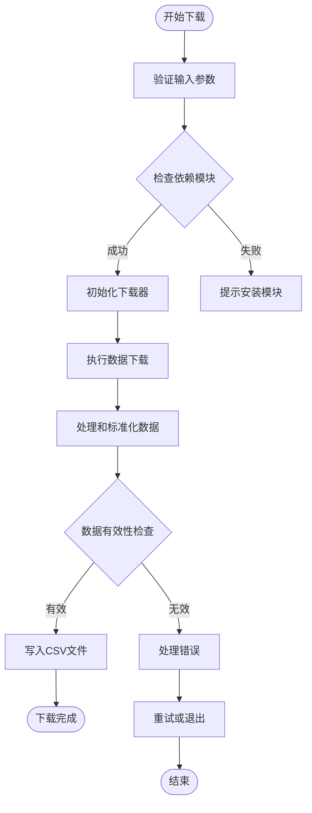

# 下载工具

<cite>
**本文档引用的文件**
- [data_downloader/__init__.py](file://data_downloader/__init__.py)
- [data_downloader/core/downloader.py](file://data_downloader/core/downloader.py)
- [data_downloader/providers/akshare.py](file://data_downloader/providers/akshare.py)
- [data_downloader/providers/ccxt.py](file://data_downloader/providers/ccxt.py)
- [data_downloader/providers/yahoo.py](file://data_downloader/providers/yahoo.py)
- [data_downloader/cli/main.py](file://data_downloader/cli/main.py)
- [data_downloader/utils/helpers.py](file://data_downloader/utils/helpers.py)
- [scripts/download-tool](file://scripts/download-tool)
- [backtrader/feeds/yahoo.py](file://backtrader/feeds/yahoo.py)
- [datas/2006-day-001.txt](file://datas/2006-day-001.txt)
- [datas/nvda-1999-2014.txt](file://datas/nvda-1999-2014.txt)
</cite>

## 更新摘要
**变更内容**
- 更新架构说明以反映从旧的tools/download_tool目录到data_downloader模块的完整迁移
- 新增data_downloader模块的详细架构分析和组件说明
- 更新使用指南以反映新的模块化结构和命令行接口
- 移除过时的tools目录引用，更新所有相关文档和示例

## 目录
1. [简介](#简介)
2. [项目结构](#项目结构)
3. [核心组件](#核心组件)
4. [架构概览](#架构概览)
5. [详细组件分析](#详细组件分析)
6. [依赖关系分析](#依赖关系分析)
7. [性能考虑](#性能考虑)
8. [故障排除指南](#故障排除指南)
9. [结论](#结论)

## 简介

Backtrader下载工具现已完全迁移到独立的 `data_downloader` 模块，这是一个专门用于从各种金融数据源获取历史数据的现代化实用程序集合。该模块采用全新的架构设计，包含四个主要子模块：核心下载器、数据提供商、命令行接口和工具函数。

这些下载工具的主要特点：
- **模块化设计**：采用清晰的模块分离架构，便于维护和扩展
- **多数据源支持**：支持Yahoo Finance、AkShare、CCXT等不同数据源
- **多种市场覆盖**：涵盖全球股票、指数、期货、外汇和加密货币市场
- **标准化输出**：所有输出格式严格遵循Backtrader要求的CSV标准
- **错误处理**：内置完善的错误处理和重试机制
- **代理支持**：支持通过代理服务器进行数据下载

## 项目结构

下载工具现已完全迁移到独立模块 `data_downloader/`，采用清晰的模块化架构：


**图表来源**
- [data_downloader/__init__.py](file://data_downloader/__init__.py#L1-L43)
- [data_downloader/core/downloader.py](file://data_downloader/core/downloader.py#L1-L124)
- [data_downloader/providers/akshare.py](file://data_downloader/providers/akshare.py#L1-L222)
- [data_downloader/providers/ccxt.py](file://data_downloader/providers/ccxt.py#L1-L251)
- [data_downloader/providers/yahoo.py](file://data_downloader/providers/yahoo.py#L1-L233)

**章节来源**
- [data_downloader/__init__.py](file://data_downloader/__init__.py#L1-L43)

## 核心组件

### BaseDownloader基类

BaseDownloader是所有下载器的抽象基类，提供了统一的接口和通用功能：

- **统一接口**：定义了download方法的标准接口
- **日期验证**：提供日期格式验证和解析功能
- **输出处理**：支持文件路径和文件对象两种输出方式
- **错误处理**：统一的错误状态管理和错误信息记录
- **数据获取**：提供获取下载数据字符串的方法

### AkShare下载器 (AkShareDownloader)

AkShare下载器专门用于从AkShare库获取中国市场的金融数据，支持多种市场类型：

- **支持的市场类型**：
  - 股票 (stock)：A股上市公司数据
  - 指数 (index)：沪深指数数据
  - 基金 (fund)：开放式基金数据
  - 国内期货 (futures)：国内商品期货数据
  - 国际期货 (foreign_futures)：COMEX等国际期货数据

- **关键特性**：
  - 支持前复权 (qfq)、后复权 (hfq) 和不复权数据
  - 多种数据频率：日线、周线、月线
  - 自动列名标准化，确保与Backtrader兼容

### CCXT下载器 (CCXTDownloader)

CCXT下载器专注于加密货币市场数据获取，支持200多个加密货币交易所：

- **支持的交易所**：Binance、OKX、Huobi、Coinbase、Kraken等主流交易所
- **支持的交易对**：BTC/USDT、ETH/USDT、BTC/USD等主流交易对
- **时间框架**：1分钟到1个月的多种时间粒度
- **代理支持**：可配置HTTP/HTTPS代理进行数据下载

### Yahoo Finance下载器 (YahooDownloader)

Yahoo Finance下载器提供最全面的全球金融市场数据获取能力：

- **支持的资产类别**：股票、指数、期货、外汇、ETF等
- **时间范围**：支持多年历史数据下载
- **复权处理**：自动处理除权除息数据
- **重试机制**：内置3次重试逻辑应对API限制

**章节来源**
- [data_downloader/core/downloader.py](file://data_downloader/core/downloader.py#L15-L124)
- [data_downloader/providers/akshare.py](file://data_downloader/providers/akshare.py#L15-L222)
- [data_downloader/providers/ccxt.py](file://data_downloader/providers/ccxt.py#L17-L251)
- [data_downloader/providers/yahoo.py](file://data_downloader/providers/yahoo.py#L18-L233)

## 架构概览

下载工具采用统一的模块化架构设计，所有下载器都继承自BaseDownloader基类：


**图表来源**
- [data_downloader/core/downloader.py](file://data_downloader/core/downloader.py#L15-L124)
- [data_downloader/providers/akshare.py](file://data_downloader/providers/akshare.py#L15-L222)
- [data_downloader/providers/ccxt.py](file://data_downloader/providers/ccxt.py#L17-L251)
- [data_downloader/providers/yahoo.py](file://data_downloader/providers/yahoo.py#L18-L233)
- [data_downloader/cli/main.py](file://data_downloader/cli/main.py#L34-L202)

### 数据流处理流程



**图表来源**
- [data_downloader/providers/akshare.py](file://data_downloader/providers/akshare.py#L89-L186)
- [data_downloader/providers/ccxt.py](file://data_downloader/providers/ccxt.py#L106-L215)
- [data_downloader/providers/yahoo.py](file://data_downloader/providers/yahoo.py#L111-L183)

## 详细组件分析

### BaseDownloader基类详细分析

BaseDownloader基类提供了所有下载器共享的核心功能：

#### 核心功能特性

| 功能 | 描述 | 实现方式 |
|------|------|----------|
| 日期验证 | 验证YYYY-MM-DD格式的日期字符串 | `_validate_dates()`方法 |
| 输出处理 | 支持文件路径和文件对象输出 | `_write_output()`方法 |
| 数据获取 | 提供CSV格式数据字符串获取 | `get_data_as_string()`方法 |
| 错误管理 | 统一的错误状态和错误信息 | `error`属性和`get_error()`方法 |
| 成功判断 | 检查下载是否成功 | `is_successful()`方法 |

#### 关键实现细节

- **抽象接口**：download方法必须在子类中实现
- **内存管理**：使用StringIO在内存中处理CSV数据
- **类型安全**：严格的类型注解和参数验证
- **错误传播**：详细的错误信息记录和传播

**章节来源**
- [data_downloader/core/downloader.py](file://data_downloader/core/downloader.py#L15-L124)

### AkShare下载器详细分析

AkShare下载器是专门为中国市场设计的下载工具，具有以下特点：

#### 支持的市场类型

| 市场类型 | 功能描述 | 示例代码 |
|---------|---------|---------|
| stock | A股股票数据 | `--symbol 000001 --market stock` |
| index | 指数数据 | `--symbol sh000001 --market index` |
| fund | 基金数据 | `--symbol 161017 --market fund` |
| futures | 国内期货 | `--symbol au --market futures` |
| foreign_futures | 国际期货 | `--symbol GC --market foreign_futures` |

#### 数据标准化过程


**图表来源**
- [data_downloader/providers/akshare.py](file://data_downloader/providers/akshare.py#L141-L178)

#### 关键实现细节

- **列名映射**：支持中英文列名转换，确保与Backtrader兼容
- **日期处理**：自动处理不同数据源的日期格式差异
- **复权支持**：提供前复权、后复权和不复权三种选项
- **错误处理**：完善的异常捕获和错误信息记录

**章节来源**
- [data_downloader/providers/akshare.py](file://data_downloader/providers/akshare.py#L15-L222)

### CCXT下载器详细分析

CCXT下载器专注于加密货币市场，具有以下特点：

#### 支持的时间框架

| 时间框架 | 对应值 | 说明 |
|---------|--------|------|
| 分钟级 | 1m, 5m, 15m, 30m, 1h, 2h, 4h, 6h, 12h | 高频数据 |
| 日线级 | 1d | 常规日线数据 |
| 周线级 | 1w | 周度数据 |
| 月线级 | 1M | 月度数据 |

#### 批量数据获取策略


**图表来源**
- [data_downloader/providers/ccxt.py](file://data_downloader/providers/ccxt.py#L118-L142)

#### 关键实现细节

- **分块下载**：大多数交易所限制单次请求的最大数据量
- **速率限制**：自动处理交易所的API速率限制
- **代理支持**：可配置HTTP/HTTPS代理进行数据访问
- **数据去重**：自动去除重复的时间戳数据

**章节来源**
- [data_downloader/providers/ccxt.py](file://data_downloader/providers/ccxt.py#L17-L251)

### Yahoo Finance下载器详细分析

Yahoo Finance下载器提供最全面的全球金融市场数据获取能力：

#### 重试机制设计


**图表来源**
- [data_downloader/providers/yahoo.py](file://data_downloader/providers/yahoo.py#L114-L154)

#### 关键实现细节

- **代理环境变量**：通过环境变量配置代理设置
- **时间间隔映射**：将用户指定的时间间隔映射到Yahoo API格式
- **数据反转处理**：可选的数据时间顺序反转功能
- **异常恢复**：自动恢复原始代理设置

**章节来源**
- [data_downloader/providers/yahoo.py](file://data_downloader/providers/yahoo.py#L18-L233)

## 依赖关系分析

下载工具模块之间的依赖关系和外部依赖：


**图表来源**
- [data_downloader/providers/akshare.py](file://data_downloader/providers/akshare.py#L44-L50)
- [data_downloader/providers/ccxt.py](file://data_downloader/providers/ccxt.py#L47-L52)
- [data_downloader/providers/yahoo.py](file://data_downloader/providers/yahoo.py#L48-L53)
- [data_downloader/cli/main.py](file://data_downloader/cli/main.py#L21-L23)

### 外部依赖管理

| 依赖库 | 版本要求 | 用途 | 安装命令 |
|-------|---------|------|---------|
| akshare | 最新版本 | AkShare数据源 | `pip install akshare` |
| ccxt | 最新版本 | 加密货币交易所 | `pip install ccxt` |
| yfinance | 最新版本 | Yahoo Finance | `pip install yfinance` |
| pandas | 最新版本 | 数据处理 | `pip install pandas` |

**章节来源**
- [data_downloader/providers/akshare.py](file://data_downloader/providers/akshare.py#L44-L50)
- [data_downloader/providers/ccxt.py](file://data_downloader/providers/ccxt.py#L47-L52)
- [data_downloader/providers/yahoo.py](file://data_downloader/providers/yahoo.py#L48-L53)

## 性能考虑

### 内存优化策略

所有下载工具都采用了内存友好的设计原则：

1. **流式处理**：使用StringIO在内存中处理数据，避免中间文件存储
2. **增量写入**：逐行写入文件，减少内存占用
3. **数据压缩**：通过标准化列名减少数据冗余

### 网络优化策略

1. **批量请求**：CCXT下载器支持批量数据获取，减少API调用次数
2. **速率限制**：自动处理各交易所的API限制
3. **代理缓存**：支持代理服务器进行网络优化

### 错误处理优化

1. **重试机制**：Yahoo下载器内置3次重试逻辑
2. **超时处理**：设置合理的超时时间避免长时间阻塞
3. **资源清理**：确保异常情况下正确释放资源

## 故障排除指南

### 常见问题及解决方案

#### 1. 依赖模块缺失

**问题症状**：
```
Exception: The AkShare data feed requires the akshare module. Please install it using: pip install akshare
```

**解决方案**：
```bash
# 安装所需的依赖模块
pip install akshare
pip install ccxt
pip install yfinance
pip install pandas
```

#### 2. 网络连接问题

**问题症状**：
- 下载超时
- API限制错误
- 连接被拒绝

**解决方案**：
```bash
# 使用代理服务器
python scripts/download-tool yahoo --ticker AAPL --proxy http://127.0.0.1:7890

# 检查网络连接
ping finance.yahoo.com
```

#### 3. 数据格式问题

**问题症状**：
- CSV文件格式不正确
- 列名不匹配
- 缺少必要列

**解决方案**：
```bash
# 验证输出文件格式
head -5 gold.txt
cat gold.txt | wc -l

# 检查数据完整性
python -c "
import pandas as pd
df = pd.read_csv('gold.txt')
print(df.columns.tolist())
print(len(df))
"
```

#### 4. 日期格式问题

**问题症状**：
- 日期解析错误
- 数据范围不正确

**解决方案**：
```bash
# 确保正确的日期格式
python scripts/download-tool yahoo --ticker GC=F --fromdate 2015-01-01 --todate 2026-01-01

# 检查日期范围
date_range=$(python -c "
import datetime
start = datetime.datetime.strptime('2015-01-01', '%Y-%m-%d')
end = datetime.datetime.strptime('2026-01-01', '%Y-%m-%d')
print(f'天数: {(end-start).days}')
")
echo $date_range
```

**章节来源**
- [data_downloader/providers/akshare.py](file://data_downloader/providers/akshare.py#L46-L50)
- [data_downloader/providers/ccxt.py](file://data_downloader/providers/ccxt.py#L49-L52)
- [data_downloader/providers/yahoo.py](file://data_downloader/providers/yahoo.py#L49-L53)

## 结论

Backtrader下载工具提供了一个强大而灵活的数据获取解决方案，经过完全重构后具有以下优势：

### 技术优势

1. **模块化设计**：清晰的模块分离架构，便于维护和扩展
2. **多数据源支持**：覆盖全球主要金融数据源
3. **标准化输出**：确保与Backtrader平台完全兼容
4. **错误处理完善**：内置重试机制和异常处理
5. **性能优化**：内存友好的设计和网络优化

### 使用建议

1. **选择合适的数据源**：
   - 国内A股数据优先使用AkShare
   - 加密货币数据使用CCXT
   - 全球市场数据使用Yahoo Finance

2. **合理配置参数**：
   - 根据需求选择合适的时间框架
   - 设置适当的代理配置
   - 合理安排下载时间避免API限制

3. **数据质量保证**：
   - 下载完成后验证数据完整性
   - 检查数据格式是否符合Backtrader要求
   - 处理缺失数据和异常值

这些下载工具为Backtrader用户提供了一个可靠的金融数据获取解决方案，大大简化了历史数据准备和回测分析的工作流程。新的data_downloader模块架构为未来的功能扩展和维护奠定了坚实的基础。