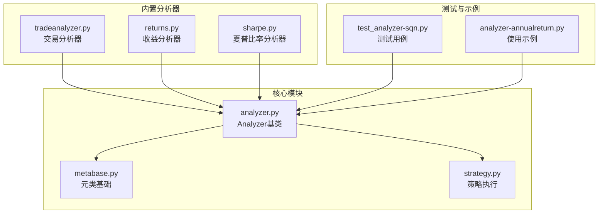
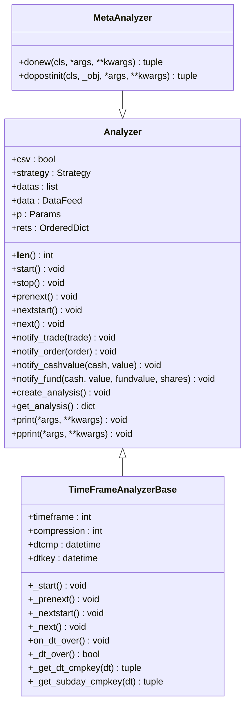
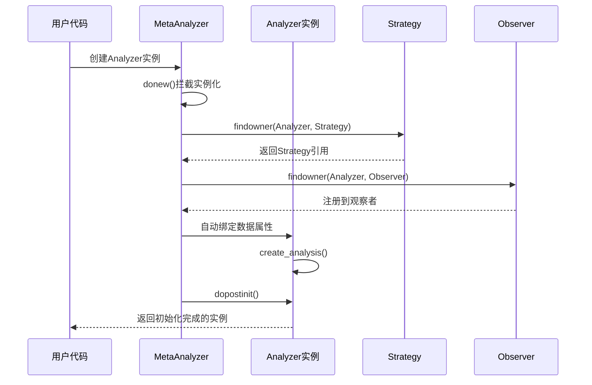
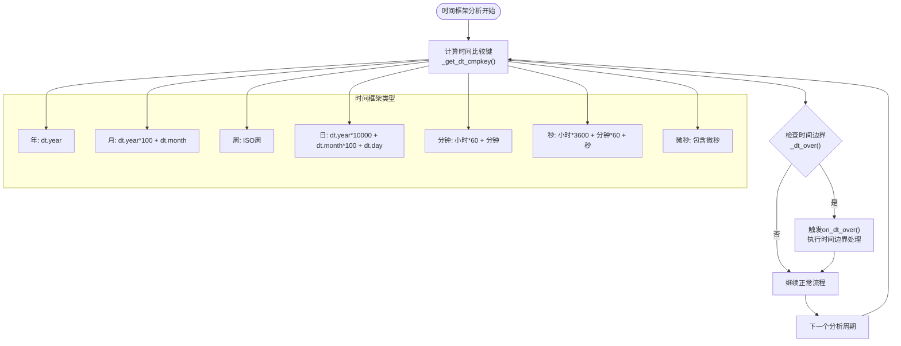
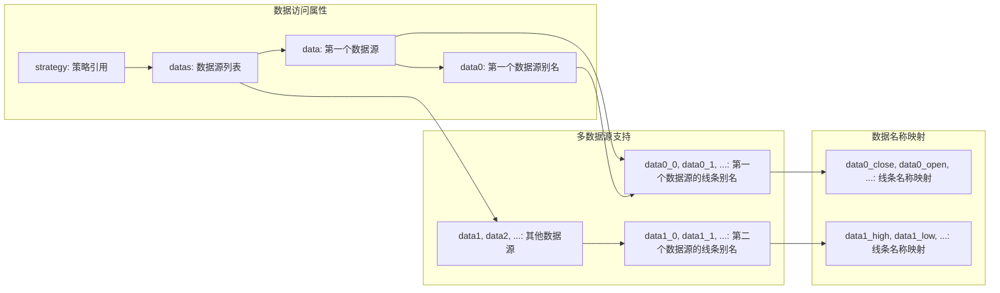
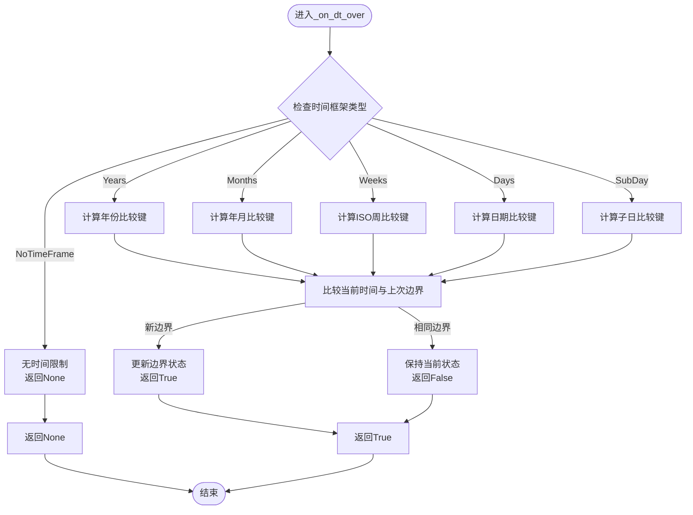
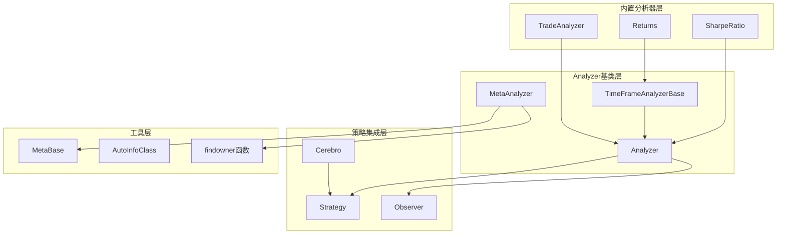

# Analyzer基类详解

<cite>
**本文档引用的文件**
- [analyzer.py](file://backtrader/analyzer.py)
- [metabase.py](file://backtrader/metabase.py)
- [strategy.py](file://backtrader/strategy.py)
- [tradeanalyzer.py](file://backtrader/analyzers/tradeanalyzer.py)
- [returns.py](file://backtrader/analyzers/returns.py)
- [sharpe.py](file://backtrader/analyzers/sharpe.py)
- [test_analyzer-sqn.py](file://tests/test_analyzer-sqn.py)
- [analyzer-annualreturn.py](file://samples/analyzer-annualreturn/analyzer-annualreturn.py)
</cite>

## 目录
1. [简介](#简介)
2. [项目结构](#项目结构)
3. [核心组件](#核心组件)
4. [架构概览](#架构概览)
5. [详细组件分析](#详细组件分析)
6. [依赖关系分析](#依赖关系分析)
7. [性能考虑](#性能考虑)
8. [故障排除指南](#故障排除指南)
9. [结论](#结论)
10. [附录](#附录)

## 简介

Analyzer基类是Backtrader回测框架中的核心组件之一，为所有分析器提供了统一的接口和生命周期管理。本文档深入解析Analyzer基类的设计架构，包括元类MetaAnalyzer的工作原理、类实例化过程、属性自动绑定机制等，并详细介绍分析器的生命周期方法、通知机制、结果存储和获取机制，以及TimeFrameAnalyzerBase的时间框架分析能力。

## 项目结构

Backtrader项目中Analyzer相关的核心文件组织如下：



**图表来源**
- [analyzer.py](file://backtrader/analyzer.py#L1-L447)
- [metabase.py](file://backtrader/metabase.py#L1-L332)

**章节来源**
- [analyzer.py](file://backtrader/analyzer.py#L1-L447)
- [metabase.py](file://backtrader/metabase.py#L1-L332)

## 核心组件

### Analyzer基类设计

Analyzer基类是所有分析器的抽象基类，提供了完整的生命周期管理和通知机制：



**图表来源**
- [analyzer.py](file://backtrader/analyzer.py#L89-L447)

### 元类MetaAnalyzer工作原理

MetaAnalyzer作为Analyzer的元类，负责分析器实例化的特殊处理：



**图表来源**
- [analyzer.py](file://backtrader/analyzer.py#L34-L86)
- [metabase.py](file://backtrader/metabase.py#L42-L63)

**章节来源**
- [analyzer.py](file://backtrader/analyzer.py#L34-L86)
- [metabase.py](file://backtrader/metabase.py#L42-L63)

## 架构概览

### 分析器生命周期管理

Analyzer基类提供了完整的生命周期管理机制，确保分析器能够在策略的不同阶段正确执行：

```mermaid
flowchart TD
Start([实例化Analyzer]) --> BindData["绑定数据属性<br/>自动创建data/dataX/dataX_Y等"]
BindData --> CreateAnalysis["创建分析结构<br/>默认创建OrderedDict"]
CreateAnalysis --> WaitStart["等待start()调用"]
WaitStart --> PreNext["prenext()<br/>最小周期前调用"]
WaitStart --> NextStart["nextstart()<br/>最小周期后首次调用"]
WaitStart --> Next["next()<br/>每次周期调用"]
PreNext --> NotifyTrade["notify_trade()<br/>交易通知"]
NextStart --> NotifyOrder["notify_order()<br/>订单通知"]
Next --> NotifyCash["notify_cashvalue()<br/>现金价值通知"]
NotifyTrade --> Next
NotifyOrder --> Next
NotifyCash --> Next
Next --> Stop([stop()结束])
Stop --> GetAnalysis["get_analysis()<br/>获取分析结果"]
```

**图表来源**
- [analyzer.py](file://backtrader/analyzer.py#L118-L268)

### 时间框架分析机制

TimeFrameAnalyzerBase扩展了Analyzer基类，增加了时间框架分析能力：



**图表来源**
- [analyzer.py](file://backtrader/analyzer.py#L299-L447)

**章节来源**
- [analyzer.py](file://backtrader/analyzer.py#L118-L268)
- [analyzer.py](file://backtrader/analyzer.py#L299-L447)

## 详细组件分析

### 生命周期方法详解

#### start()和stop()方法

start()和stop()方法分别在分析器开始和结束时调用：

- **start()**: 初始化分析器状态，设置必要的变量和数据结构
- **stop()**: 清理资源，生成最终的分析结果

#### prenext()、nextstart()和next()方法族

这组方法遵循策略的生命周期调用模式：

- **prenext()**: 在达到最小周期之前，对每个数据点调用
- **nextstart()**: 达到最小周期后的第一次调用
- **next()**: 每个数据点的标准调用

#### 通知机制

Analyzer基类提供了四种通知方法，用于接收策略事件：

- **notify_trade(trade)**: 交易状态变化通知
- **notify_order(order)**: 订单状态变化通知  
- **notify_cashvalue(cash, value)**: 现金和价值变化通知
- **notify_fund(cash, value, fundvalue, shares)**: 基金相关通知

**章节来源**
- [analyzer.py](file://backtrader/analyzer.py#L118-L268)

### 属性自动绑定机制

MetaAnalyzer在实例化过程中自动为分析器绑定以下属性：



**图表来源**
- [analyzer.py](file://backtrader/analyzer.py#L54-L71)

**章节来源**
- [analyzer.py](file://backtrader/analyzer.py#L54-L71)

### 结果存储和获取机制

#### create_analysis()方法

默认实现创建一个OrderedDict作为分析结果容器：

```python
def create_analysis(self):
    '''默认行为：创建名为rets的OrderedDict'''
    self.rets = OrderedDict()
```

#### get_analysis()方法

返回分析结果的默认实现：

```python
def get_analysis(self):
    '''返回默认的OrderedDict结果'''
    return self.rets
```

**章节来源**
- [analyzer.py](file://backtrader/analyzer.py#L247-L268)

### TimeFrameAnalyzerBase深度解析

TimeFrameAnalyzerBase扩展了Analyzer基类，提供了时间框架分析能力：

#### 参数配置

- **timeframe**: 分析的时间框架（年、月、周、日等）
- **compression**: 时间压缩因子（用于子日时间框架）
- **_doprenext**: 是否在时间边界时执行prenext()

#### 时间边界检测算法



**图表来源**
- [analyzer.py](file://backtrader/analyzer.py#L346-L387)

**章节来源**
- [analyzer.py](file://backtrader/analyzer.py#L299-L447)

## 依赖关系分析

### 组件耦合度分析



**图表来源**
- [analyzer.py](file://backtrader/analyzer.py#L89-L447)
- [metabase.py](file://backtrader/metabase.py#L66-L332)

### 关键依赖关系

1. **MetaAnalyzer依赖MetaBase**: 提供参数化类的元类功能
2. **Analyzer依赖Strategy**: 通过findowner函数获取策略引用
3. **TimeFrameAnalyzerBase依赖TimeFrame枚举**: 处理不同时间框架
4. **内置分析器依赖Analyzer基类**: 扩展特定分析功能

**章节来源**
- [analyzer.py](file://backtrader/analyzer.py#L89-L447)
- [metabase.py](file://backtrader/metabase.py#L66-L332)

## 性能考虑

### 实例化优化

- **延迟初始化**: 分析器在实际需要时才创建分析结构
- **属性缓存**: 自动绑定的数据属性在实例化时一次性设置
- **内存管理**: 使用OrderedDict减少内存开销

### 执行效率

- **批量通知**: 通过内部方法批量分发通知给子分析器
- **条件检查**: 时间框架分析只在必要时进行边界检查
- **资源共享**: 多个分析器共享策略和数据源引用

## 故障排除指南

### 常见问题及解决方案

#### 分析器未接收到通知

**问题**: 分析器的notify_*方法没有被调用

**原因分析**:
1. 分析器未正确注册到策略
2. 策略的通知机制未正确触发
3. 分析器的父类调用链中断

**解决方案**:
- 确保使用正确的实例化方式
- 检查是否正确调用了父类的方法
- 验证策略的生命周期调用顺序

#### 时间框架分析不准确

**问题**: TimeFrameAnalyzerBase的时间边界检测异常

**原因分析**:
1. 时间框架参数配置错误
2. 数据源时间戳格式不正确
3. 压缩因子设置不当

**解决方案**:
- 验证TimeFrame枚举值的正确性
- 检查数据源的时间戳精度
- 调整compression参数以匹配数据频率

**章节来源**
- [analyzer.py](file://backtrader/analyzer.py#L148-L200)
- [analyzer.py](file://backtrader/analyzer.py#L346-L387)

## 结论

Analyzer基类为Backtrader提供了强大而灵活的分析框架。其设计特点包括：

1. **统一接口**: 所有分析器共享相同的生命周期和通知机制
2. **自动绑定**: 智能的数据属性绑定减少了样板代码
3. **扩展性**: TimeFrameAnalyzerBase提供了强大的时间框架分析能力
4. **灵活性**: 开放的模式允许分析器在任何阶段生成结果

通过深入理解Analyzer基类的设计原理和实现细节，开发者可以：
- 正确继承和扩展分析器功能
- 有效利用生命周期方法进行状态管理
- 利用通知机制响应策略事件
- 实现复杂的时间框架分析需求

## 附录

### 自定义分析器开发指南

#### 基本继承关系

```python
class CustomAnalyzer(Analyzer):
    def __init__(self, param1=value1, param2=value2):
        super(CustomAnalyzer, self).__init__()
        # 自定义初始化代码
        self.custom_param = param1
        self.other_param = param2
    
    def create_analysis(self):
        # 创建自定义分析结构
        self.rets = AutoOrderedDict()
        self.rets.metrics = AutoOrderedDict()
    
    def start(self):
        # 初始化分析状态
        self.trade_count = 0
        self.total_pnl = 0.0
    
    def next(self):
        # 每个周期的分析逻辑
        self.trade_count += 1
        # 计算各种指标...
    
    def stop(self):
        # 生成最终分析结果
        self.rets.metrics.final_value = self.total_pnl
        self.rets.metrics.average = self.total_pnl / self.trade_count
    
    def get_analysis(self):
        return self.rets
```

#### 必需方法实现

1. **create_analysis()**: 创建分析结果容器
2. **start()**: 初始化分析状态
3. **next()**: 每个周期的分析逻辑
4. **stop()**: 生成最终结果（可选）
5. **get_analysis()**: 返回分析结果（可选，默认返回rets）

#### 参数配置最佳实践

- 使用params元组定义分析器参数
- 提供合理的默认值
- 在__init__中验证参数的有效性
- 考虑向后兼容性

#### 使用示例

参考内置分析器的实现模式，如TradeAnalyzer、Returns和SharpeRatio的实现方式。

**章节来源**
- [tradeanalyzer.py](file://backtrader/analyzers/tradeanalyzer.py#L68-L209)
- [returns.py](file://backtrader/analyzers/returns.py#L104-L155)
- [sharpe.py](file://backtrader/analyzers/sharpe.py#L134-L206)