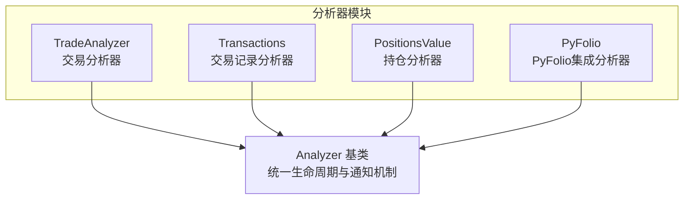
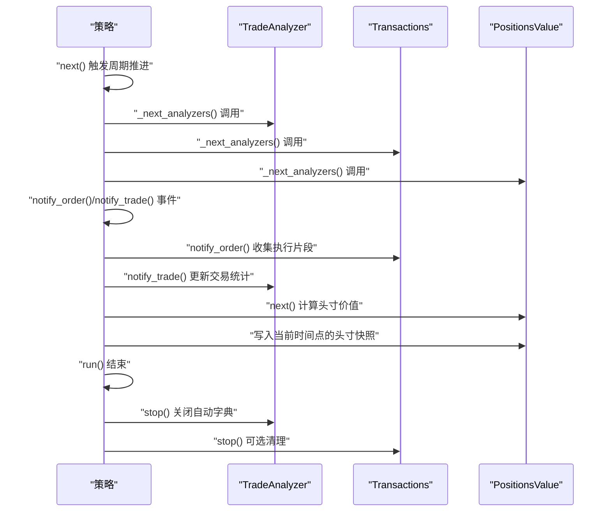
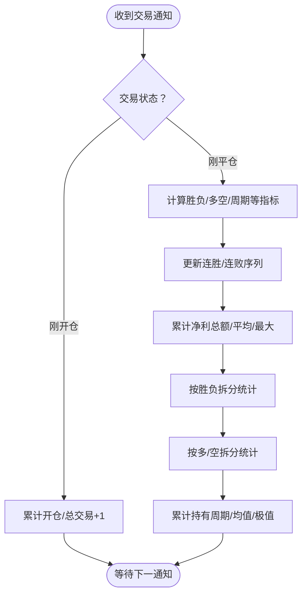
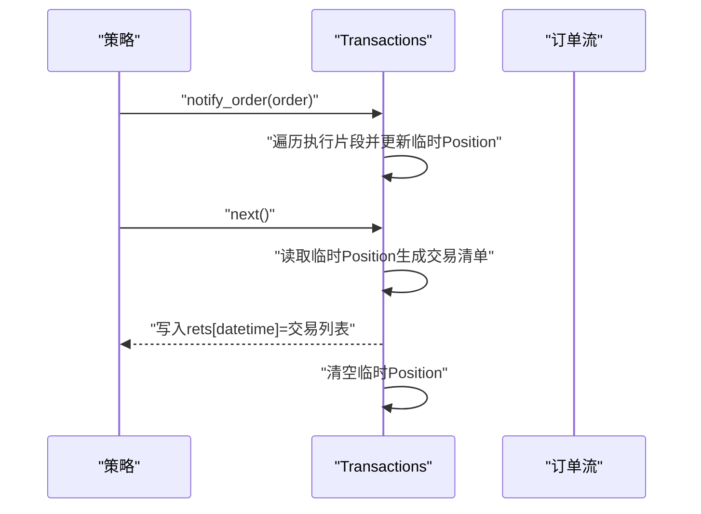
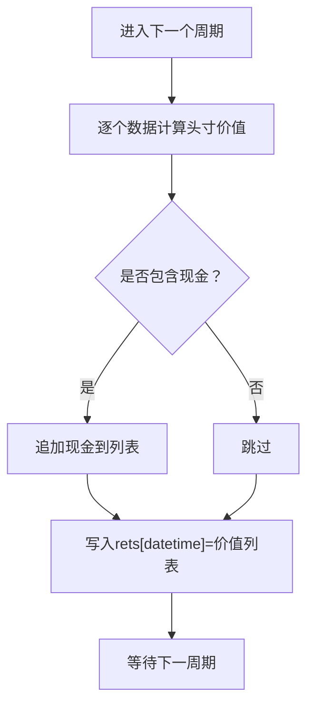
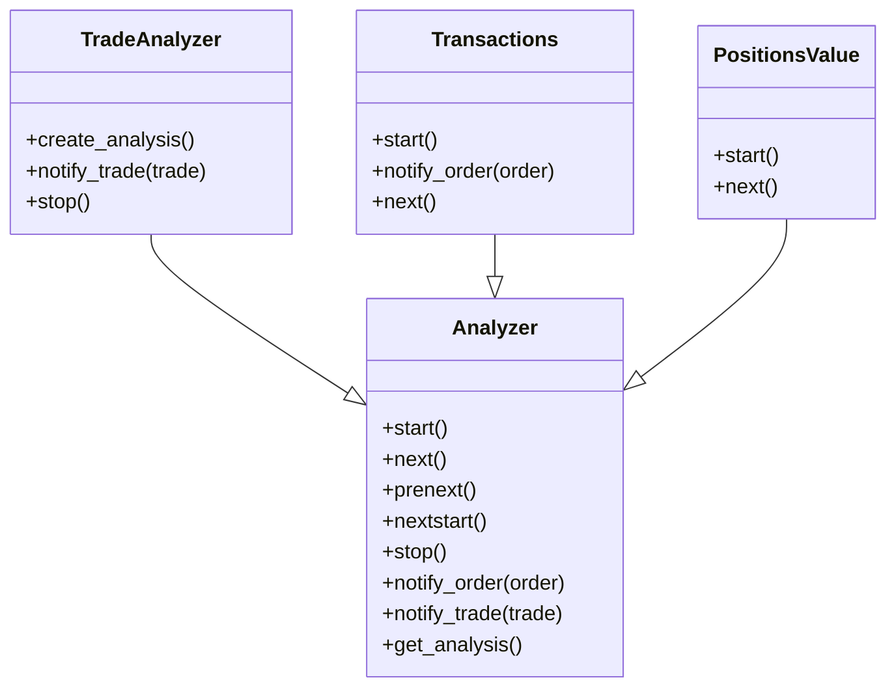

# 交易分析器

<cite>
**本文引用的文件**
- [backtrader/analyzers/tradeanalyzer.py](file://backtrader/analyzers/tradeanalyzer.py)
- [backtrader/analyzers/transactions.py](file://backtrader/analyzers/transactions.py)
- [backtrader/analyzers/positions.py](file://backtrader/analyzers/positions.py)
- [backtrader/analyzer.py](file://backtrader/analyzer.py)
- [backtrader/analyzers/__init__.py](file://backtrader/analyzers/__init__.py)
- [backtrader/analyzers/pyfolio.py](file://backtrader/analyzers/pyfolio.py)
- [backtrader/strategy.py](file://backtrader/strategy.py)
- [samples/analyzer-annualreturn/analyzer-annualreturn.py](file://samples/analyzer-annualreturn/analyzer-annualreturn.py)
</cite>

## 目录
1. [简介](#简介)
2. [项目结构](#项目结构)
3. [核心组件](#核心组件)
4. [架构总览](#架构总览)
5. [详细组件分析](#详细组件分析)
6. [依赖关系分析](#依赖关系分析)
7. [性能考量](#性能考量)
8. [故障排查指南](#故障排查指南)
9. [结论](#结论)
10. [附录：使用示例与最佳实践](#附录使用示例与最佳实践)

## 简介
本文件系统性梳理并解释 Backtrader 中三大交易分析器：交易分析器（TradeAnalyzer）、交易记录分析器（Transactions）与持仓分析器（PositionsValue）。内容涵盖：
- 各分析器的功能定位与统计口径
- 配置参数与数据采集范围
- 统计方法与结果解读
- 在策略开发中的使用方式与优化建议
- 结合示例展示如何获取并利用分析结果指导策略迭代

## 项目结构
Backtrader 的分析器体系基于统一的 Analyzer 基类，通过通知机制（如 notify_trade、notify_order、next 等）在策略生命周期内收集数据并生成分析结果。交易分析器位于 analyzers 子模块，交易记录与持仓分析器亦在此目录下；另有 PyFolio 分析器可整合返回、头寸与交易信息以适配外部分析生态。

图表来源
- [backtrader/analyzers/tradeanalyzer.py](file://backtrader/analyzers/tradeanalyzer.py#L31-L209)
- [backtrader/analyzers/transactions.py](file://backtrader/analyzers/transactions.py#L31-L104)
- [backtrader/analyzers/positions.py](file://backtrader/analyzers/positions.py#L28-L86)
- [backtrader/analyzer.py](file://backtrader/analyzer.py#L89-L286)
- [backtrader/analyzers/pyfolio.py](file://backtrader/analyzers/pyfolio.py#L33-L164)

章节来源
- [backtrader/analyzers/__init__.py](file://backtrader/analyzers/__init__.py#L27-L36)
- [backtrader/strategy.py](file://backtrader/strategy.py#L349-L388)

## 核心组件
- 交易分析器（TradeAnalyzer）
  - 统计已平仓交易的总次数、胜率、盈亏比、净利平均值、最大单笔收益/亏损等；同时追踪多空方向与持有时间分布。
- 交易记录分析器（Transactions）
  - 记录每次订单执行产生的交易明细（数量、价格、符号、价值等），便于后续回测报告与外部工具（如 PyFolio）对接。
- 持仓分析器（PositionsValue）
  - 每周期输出各数据头寸的价值汇总，并可选择包含现金头寸，形成投资组合层面的资产分布快照。

章节来源
- [backtrader/analyzers/tradeanalyzer.py](file://backtrader/analyzers/tradeanalyzer.py#L31-L209)
- [backtrader/analyzers/transactions.py](file://backtrader/analyzers/transactions.py#L31-L104)
- [backtrader/analyzers/positions.py](file://backtrader/analyzers/positions.py#L28-L86)

## 架构总览
分析器通过策略的生命周期回调参与计算：策略在 next 钩子中驱动分析器的 prenext/next/nextstart/start/stop 等阶段；同时，分析器订阅策略发出的通知（如订单成交、交易状态变化），在合适时机更新内部统计。

图表来源
- [backtrader/strategy.py](file://backtrader/strategy.py#L349-L388)
- [backtrader/analyzer.py](file://backtrader/analyzer.py#L148-L201)
- [backtrader/analyzers/tradeanalyzer.py](file://backtrader/analyzers/tradeanalyzer.py#L76-L209)
- [backtrader/analyzers/transactions.py](file://backtrader/analyzers/transactions.py#L73-L104)
- [backtrader/analyzers/positions.py](file://backtrader/analyzers/positions.py#L77-L86)

## 详细组件分析

### 交易分析器（TradeAnalyzer）
- 功能要点
  - 统计总开仓/平仓次数、当前与最长连胜/连败序列
  - 净利总额、平均值、最大值；按胜负分组统计
  - 多/空方向的次数、净利统计与胜负拆分
  - 持有周期（以K线数计）的总量、均值、最大/最小值，按胜负与多空细分
- 数据来源与触发
  - 订阅策略的 notify_trade 通知，在交易刚开仓或刚平仓时更新内部 AutoOrderedDict
- 输出结构
  - 使用 AutoOrderedDict 自动构建嵌套字段，避免无交易时产生空统计
  - 若无交易，返回的字典仅包含 total.total=0 的占位字段
- 典型统计口径
  - 胜负判断：以交易净收益（扣除手续费）是否非负为准
  - 持有周期：从开仓到平仓所跨越的K线根数
  - 盈亏比：平均盈利/平均亏损的绝对值（可在上层策略中自行计算）

图表来源
- [backtrader/analyzers/tradeanalyzer.py](file://backtrader/analyzers/tradeanalyzer.py#L76-L209)

章节来源
- [backtrader/analyzers/tradeanalyzer.py](file://backtrader/analyzers/tradeanalyzer.py#L31-L209)

### 交易记录分析器（Transactions）
- 功能要点
  - 汇总每个周期内的订单执行片段，生成“交易清单”（每条记录含数量、价格、符号、价值等）
  - 可选添加表头键，便于与 PyFolio 等工具对接
- 数据来源与触发
  - 订阅策略的 notify_order 通知；在每个周期末的 next 中输出该周期的交易快照
  - 使用临时 Position 对象聚合当期执行片段，确保一次周期内多次部分成交被正确累加
- 输出结构
  - 返回字典：键为时间戳，值为该时间点的交易列表（每条记录对应一个数据头寸）

图表来源
- [backtrader/analyzers/transactions.py](file://backtrader/analyzers/transactions.py#L73-L104)

章节来源
- [backtrader/analyzers/transactions.py](file://backtrader/analyzers/transactions.py#L31-L104)

### 持仓分析器（PositionsValue）
- 功能要点
  - 每周期输出各数据头寸的价值汇总；可选包含现金头寸
  - 可根据时间粒度（日/分钟等）决定索引键是日期还是具体时刻
- 数据来源与触发
  - 在每个周期的 next 中调用 broker 接口获取各数据头寸价值与现金余额
- 输出结构
  - 返回字典：键为日期或时刻，值为对应头寸价值列表（可附加现金）

图表来源
- [backtrader/analyzers/positions.py](file://backtrader/analyzers/positions.py#L77-L86)

章节来源
- [backtrader/analyzers/positions.py](file://backtrader/analyzers/positions.py#L28-L86)

### 与 PyFolio 集成（可选）
- 用途
  - 将 TimeReturn、PositionsValue、Transactions、GrossLeverage 四类分析器的结果转换为 PyFolio 可接受的 pandas DataFrame，用于生成完整分析报表
- 关键流程
  - 在 stop 阶段收集四个子分析器的结果
  - 提供 get_pf_items 方法，将内部结构映射为 returns、positions、transactions、gross_lev

章节来源
- [backtrader/analyzers/pyfolio.py](file://backtrader/analyzers/pyfolio.py#L33-L164)

## 依赖关系分析
- 继承与生命周期
  - 三个分析器均继承自 Analyzer 基类，遵循统一的 start/next/prenext/nextstart/stop 生命周期
  - 策略在运行时通过 _next_analyzers 驱动分析器的生命周期钩子
- 通知机制
  - TradeAnalyzer 依赖 notify_trade 获取交易状态变化
  - Transactions 依赖 notify_order 收集订单执行片段
- 内部数据结构
  - TradeAnalyzer 使用 AutoOrderedDict/AutoDict 实现动态嵌套统计
  - Transactions 使用临时 Position 聚合当期执行片段
  - PositionsValue 直接读取 broker 的头寸与现金信息

图表来源
- [backtrader/analyzer.py](file://backtrader/analyzer.py#L89-L286)
- [backtrader/analyzers/tradeanalyzer.py](file://backtrader/analyzers/tradeanalyzer.py#L68-L75)
- [backtrader/analyzers/transactions.py](file://backtrader/analyzers/transactions.py#L65-L72)
- [backtrader/analyzers/positions.py](file://backtrader/analyzers/positions.py#L68-L76)

章节来源
- [backtrader/analyzer.py](file://backtrader/analyzer.py#L89-L286)
- [backtrader/strategy.py](file://backtrader/strategy.py#L349-L388)

## 性能考量
- 数据结构选择
  - TradeAnalyzer 使用 AutoOrderedDict/AutoDict，避免无交易时的空统计开销
  - Transactions 使用 defaultdict + Position 聚合，减少重复初始化成本
- 计算复杂度
  - 三类分析器均为 O(1) 状态更新（在单次交易/周期内），整体复杂度与交易/周期数线性相关
- I/O 与内存
  - Transactions/PositionsValue 在每个周期写入结果字典，建议在长回测中关注输出规模
  - 如需导出至外部工具，PyFolio 的 get_pf_items 会进行额外的数据框转换，注意 pandas 依赖与内存占用

## 故障排查指南
- 无交易导致统计为空
  - 现象：TradeAnalyzer 返回的字典仅包含 total.total=0
  - 处理：确认策略确有下单与成交；检查佣金设置与滑点是否导致频繁拒单
- 交易记录缺失
  - 现象：Transactions 输出为空
  - 处理：确认策略确实提交了订单且处于 Partial/Completed 状态；检查 notify_order 是否被覆盖未调用父类逻辑
- 持仓价值异常
  - 现象：PositionsValue 数值与预期不符
  - 处理：核对数据时间框架与压缩参数；确认 broker 的 get_value/get_cash 调用是否正确

章节来源
- [backtrader/analyzers/tradeanalyzer.py](file://backtrader/analyzers/tradeanalyzer.py#L57-L67)
- [backtrader/analyzers/transactions.py](file://backtrader/analyzers/transactions.py#L73-L82)
- [backtrader/analyzers/positions.py](file://backtrader/analyzers/positions.py#L77-L86)

## 结论
- TradeAnalyzer 提供全面的交易层面统计，适合评估策略的胜率、盈亏比与周期效率
- Transactions 提供细粒度的交易流水，便于审计与外部工具集成
- PositionsValue 提供组合层面的头寸快照，有助于监控风险敞口与集中度
- 建议在策略开发中同时启用三类分析器，并结合 PyFolio 进行可视化与深度分析，以数据驱动策略优化

## 附录：使用示例与最佳实践
- 在策略中添加 TradeAnalyzer 并读取结果
  - 示例路径：[添加 TradeAnalyzer 并打印结果](file://samples/analyzer-annualreturn/analyzer-annualreturn.py#L169-L174)
  - 读取方式参考：[获取分析器并打印结果](file://samples/analyzer-annualreturn/analyzer-annualreturn.py#L169-L174)
- 使用 Transactions 生成交易流水
  - 示例路径：[Transactions 参数与输出结构说明](file://backtrader/analyzers/transactions.py#L40-L63)
  - 访问方式：通过策略实例的 analyzers 列表获取并调用 get_analysis
- 使用 PositionsValue 监控头寸
  - 示例路径：[PositionsValue 参数与输出结构说明](file://backtrader/analyzers/positions.py#L32-L62)
  - 访问方式：同上，调用 get_analysis 获取时间序列头寸价值
- 与 PyFolio 集成
  - 示例路径：[PyFolio 子分析器组合与 get_pf_items](file://backtrader/analyzers/pyfolio.py#L33-L101)
  - 导出方式：调用 get_pf_items 获取 pandas DataFrame，传入外部分析工具

章节来源
- [samples/analyzer-annualreturn/analyzer-annualreturn.py](file://samples/analyzer-annualreturn/analyzer-annualreturn.py#L160-L174)
- [backtrader/analyzers/transactions.py](file://backtrader/analyzers/transactions.py#L40-L63)
- [backtrader/analyzers/positions.py](file://backtrader/analyzers/positions.py#L32-L62)
- [backtrader/analyzers/pyfolio.py](file://backtrader/analyzers/pyfolio.py#L102-L163)