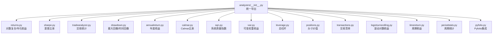
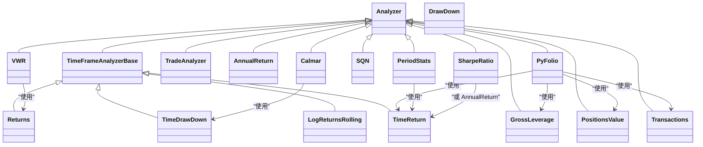
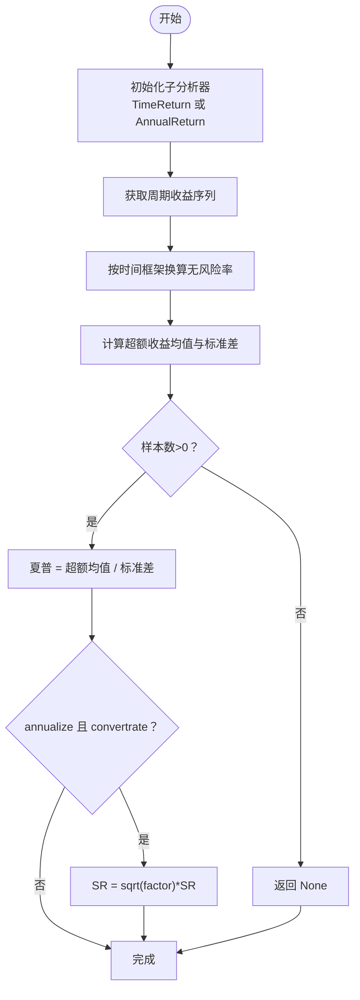
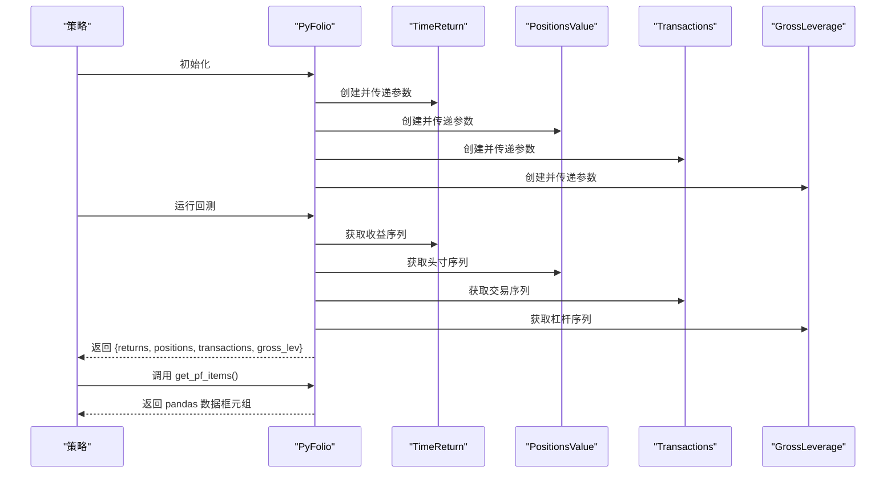
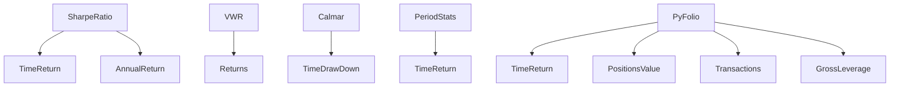

# 内置分析器

<cite>
**本文引用的文件**
- [backtrader/analyzers/__init__.py](file://backtrader/analyzers/__init__.py)
- [backtrader/analyzers/returns.py](file://backtrader/analyzers/returns.py)
- [backtrader/analyzers/sharpe.py](file://backtrader/analyzers/sharpe.py)
- [backtrader/analyzers/tradeanalyzer.py](file://backtrader/analyzers/tradeanalyzer.py)
- [backtrader/analyzers/drawdown.py](file://backtrader/analyzers/drawdown.py)
- [backtrader/analyzers/annualreturn.py](file://backtrader/analyzers/annualreturn.py)
- [backtrader/analyzers/calmar.py](file://backtrader/analyzers/calmar.py)
- [backtrader/analyzers/sqn.py](file://backtrader/analyzers/sqn.py)
- [backtrader/analyzers/vwr.py](file://backtrader/analyzers/vwr.py)
- [backtrader/analyzers/leverage.py](file://backtrader/analyzers/leverage.py)
- [backtrader/analyzers/positions.py](file://backtrader/analyzers/positions.py)
- [backtrader/analyzers/transactions.py](file://backtrader/analyzers/transactions.py)
- [backtrader/analyzers/logreturnsrolling.py](file://backtrader/analyzers/logreturnsrolling.py)
- [backtrader/analyzers/timereturn.py](file://backtrader/analyzers/timereturn.py)
- [backtrader/analyzers/periodstats.py](file://backtrader/analyzers/periodstats.py)
- [backtrader/analyzers/pyfolio.py](file://backtrader/analyzers/pyfolio.py)
</cite>

## 目录
1. [简介](#简介)
2. [项目结构](#项目结构)
3. [核心组件](#核心组件)
4. [架构总览](#架构总览)
5. [详细组件分析](#详细组件分析)
6. [依赖关系分析](#依赖关系分析)
7. [性能考量](#性能考量)
8. [故障排查指南](#故障排查指南)
9. [结论](#结论)
10. [附录：使用与结果解读](#附录使用与结果解读)

## 简介
本文件系统性梳理 Backtrader 的内置分析器，覆盖收益类、风险类、交易行为类、波动与质量类、杠杆与头寸类、时间序列与滚动类、周期统计类以及与 Pyfolio 集成的分析器。针对每个分析器，给出用途、参数、返回结构、典型用法与结果解读，帮助用户在策略开发与回测评估中高效选择与组合分析器。

## 项目结构
Backtrader 将分析器按功能模块组织于 analyzers 包内，并通过统一入口导出。分析器分为两类：
- 基于时间框架的分析器（TimeFrameAnalyzerBase）：按时间边界触发计算，适合周期性指标。
- 普通 Analyzer：基于事件回调或 next 循环进行累计与统计。

图表来源
- [backtrader/analyzers/__init__.py](file://backtrader/analyzers/__init__.py#L27-L44)

章节来源
- [backtrader/analyzers/__init__.py](file://backtrader/analyzers/__init__.py#L27-L44)

## 核心组件
- 收益分析器 Returns：对数复合/平均/年化/百分比化收益，支持资金模式与时间框架。
- 夏普比率分析器 SharpeRatio：支持风险无资产折算、样本修正、时间框架换算与年化输出。
- 交易分析器 TradeAnalyzer：统计已平仓/未平仓交易、胜率/连败、盈亏、多空分布、持有周期等。
- 最大回撤分析器 DrawDown/TimeDrawDown：美元/百分比回撤、最长回撤长度；支持资金模式。
- 年化收益率分析器 AnnualReturn：按自然年计算年化收益序列。
- Calmar比率分析器 Calmar：滚动期对数收益除以滚动期内最大回撤。
- 系统质量指数分析器 SQN：基于交易数量、平均收益与收益标准差的质量指标。
- 收益波动率分析器 VWR：以对数收益与波动加权的改进型收益度量。
- 杠杆率分析器 GrossLeverage：总杠杆（净资产变动/净值）。
- 持仓分析器 PositionsValue：各数据头寸价值与现金（可选）。
- 交易记录分析器 Transactions：按周期汇总交易明细（数量、价格、符号等）。
- 滚动对数收益分析器 LogReturnsRolling：按时间框架滚动对数收益，可跟踪指定数据。
- 时间序列收益分析器 TimeReturn：周期起点/终点价值计算周期回报。
- 周期统计分析器 PeriodStats：周期回报均值、标准差、正负周期与最佳/最差。
- Pyfolio集成分析器 PyFolio：整合收益、头寸、交易、总杠杆，输出可直接用于 Pyfolio 的数据集。

章节来源
- [backtrader/analyzers/returns.py](file://backtrader/analyzers/returns.py#L30-L156)
- [backtrader/analyzers/sharpe.py](file://backtrader/analyzers/sharpe.py#L33-L222)
- [backtrader/analyzers/tradeanalyzer.py](file://backtrader/analyzers/tradeanalyzer.py#L31-L209)
- [backtrader/analyzers/drawdown.py](file://backtrader/analyzers/drawdown.py#L31-L198)
- [backtrader/analyzers/annualreturn.py](file://backtrader/analyzers/annualreturn.py#L30-L90)
- [backtrader/analyzers/calmar.py](file://backtrader/analyzers/calmar.py#L31-L114)
- [backtrader/analyzers/sqn.py](file://backtrader/analyzers/sqn.py#L31-L86)
- [backtrader/analyzers/vwr.py](file://backtrader/analyzers/vwr.py#L32-L174)
- [backtrader/analyzers/leverage.py](file://backtrader/analyzers/leverage.py#L27-L72)
- [backtrader/analyzers/positions.py](file://backtrader/analyzers/positions.py#L28-L86)
- [backtrader/analyzers/transactions.py](file://backtrader/analyzers/transactions.py#L31-L104)
- [backtrader/analyzers/logreturnsrolling.py](file://backtrader/analyzers/logreturnsrolling.py#L33-L141)
- [backtrader/analyzers/timereturn.py](file://backtrader/analyzers/timereturn.py#L27-L143)
- [backtrader/analyzers/periodstats.py](file://backtrader/analyzers/periodstats.py#L34-L113)
- [backtrader/analyzers/pyfolio.py](file://backtrader/analyzers/pyfolio.py#L33-L164)

## 架构总览
分析器体系以 Analyzer 与 TimeFrameAnalyzerBase 为基础，部分分析器通过子分析器复用能力，形成“组合式分析器”（如 PyFolio 组合多个子分析器），实现端到端的策略评估数据链路。

图表来源
- [backtrader/analyzers/returns.py](file://backtrader/analyzers/returns.py#L30-L156)
- [backtrader/analyzers/sharpe.py](file://backtrader/analyzers/sharpe.py#L33-L222)
- [backtrader/analyzers/tradeanalyzer.py](file://backtrader/analyzers/tradeanalyzer.py#L31-L209)
- [backtrader/analyzers/drawdown.py](file://backtrader/analyzers/drawdown.py#L31-L198)
- [backtrader/analyzers/annualreturn.py](file://backtrader/analyzers/annualreturn.py#L30-L90)
- [backtrader/analyzers/calmar.py](file://backtrader/analyzers/calmar.py#L31-L114)
- [backtrader/analyzers/sqn.py](file://backtrader/analyzers/sqn.py#L31-L86)
- [backtrader/analyzers/vwr.py](file://backtrader/analyzers/vwr.py#L32-L174)
- [backtrader/analyzers/leverage.py](file://backtrader/analyzers/leverage.py#L27-L72)
- [backtrader/analyzers/positions.py](file://backtrader/analyzers/positions.py#L28-L86)
- [backtrader/analyzers/transactions.py](file://backtrader/analyzers/transactions.py#L31-L104)
- [backtrader/analyzers/logreturnsrolling.py](file://backtrader/analyzers/logreturnsrolling.py#L33-L141)
- [backtrader/analyzers/timereturn.py](file://backtrader/analyzers/timereturn.py#L27-L143)
- [backtrader/analyzers/periodstats.py](file://backtrader/analyzers/periodstats.py#L34-L113)
- [backtrader/analyzers/pyfolio.py](file://backtrader/analyzers/pyfolio.py#L33-L164)

## 详细组件分析

### 收益分析器 Returns
- 用途：计算对数复合总收益、平均收益、年化/标准化收益，并以百分比形式输出。
- 关键参数：
  - timeframe/compression：时间框架与压缩。
  - tann：年化周期因子（日252、周52、月12、年1）。
  - fund：资金模式（净值/基金值）。
- 返回结构（get_analysis）：包含 rtot（复合对数收益）、ravg（平均对数收益）、rnorm（年化/标准化收益）、rnorm100（百分比化年化收益）。
- 典型场景：衡量策略长期收益水平与稳定性，配合年化指标进行比较。

章节来源
- [backtrader/analyzers/returns.py](file://backtrader/analyzers/returns.py#L30-L156)

### 夏普比率分析器 SharpeRatio 与 SharpeRatio_A
- 用途：基于无风险利率的收益风险比，支持多种时间框架与换算方式。
- 关键参数：
  - timeframe/compression：目标时间框架与压缩。
  - riskfreerate：年化无风险利率，默认1%。
  - convertrate：是否将无风险率按时间框架换算。
  - factor/daysfactor：换算因子或旧命名兼容。
  - annualize：是否输出年化夏普。
  - stddev_sample：样本标准差修正。
  - legacyannual：使用 AnnualReturn（仅年）。
  - fund：资金模式。
- 返回结构（get_analysis）：包含 sharperatio。
- 典型场景：跨策略/跨时间框架比较风险调整后收益。

图表来源
- [backtrader/analyzers/sharpe.py](file://backtrader/analyzers/sharpe.py#L134-L206)

章节来源
- [backtrader/analyzers/sharpe.py](file://backtrader/analyzers/sharpe.py#L33-L222)

### 交易分析器 TradeAnalyzer
- 用途：统计已平仓/未平仓交易、胜率/连败、总/平均/最大盈亏、多空分布、持有周期（总/均/最大/最小）。
- 关键机制：通过 notify_trade 回调累积统计；stop 时关闭 AutoOrderedDict。
- 返回结构（get_analysis）：嵌套字典，包含 total/open/closed、streak、pnl（gross/net）、won/lost、long/short 及 len（bar长度）等。
- 典型场景：评估交易系统稳定性、胜率、盈亏比与持有周期偏好。

章节来源
- [backtrader/analyzers/tradeanalyzer.py](file://backtrader/analyzers/tradeanalyzer.py#L31-L209)

### 最大回撤分析器 DrawDown 与 TimeDrawDown
- 用途：计算当前与历史最大回撤（金额与百分比）、回撤持续期与最长回撤期。
- 关键参数：
  - fund：资金模式。
- 返回结构（get_analysis）：
  - DrawDown：drawdown、moneydown、len、max.*。
  - TimeDrawDown：maxdrawdown、maxdrawdownperiod（运行时属性 dd/maxdd/maxddlen）。
- 典型场景：风险控制与资金曲线评估。

章节来源
- [backtrader/analyzers/drawdown.py](file://backtrader/analyzers/drawdown.py#L31-L198)

### 年化收益率分析器 AnnualReturn
- 用途：按自然年边界计算年化回报序列与字典。
- 返回结构（get_analysis）：年份->年化回报的有序字典。
- 典型场景：年度收益可视化与趋势分析。

章节来源
- [backtrader/analyzers/annualreturn.py](file://backtrader/analyzers/annualreturn.py#L30-L90)

### Calmar比率分析器 Calmar
- 用途：滚动期对数年化收益除以滚动期内最大回撤（默认按月框架与36期滚动）。
- 关键参数：
  - timeframe/compression：时间框架与压缩。
  - period：滚动期。
  - fund：资金模式。
- 返回结构（get_analysis）：按时间键返回对应周期的 Calmar 比率。
- 典型场景：滚动期风险调整收益评估。

章节来源
- [backtrader/analyzers/calmar.py](file://backtrader/analyzers/calmar.py#L31-L114)

### 系统质量指数分析器 SQN
- 用途：系统质量指数，公式为 sqrt(N)*平均收益/收益标准差。
- 返回结构（get_analysis）：sqn、trades（交易数）。
- 典型场景：评估系统稳定性与可靠性（建议交易数≥30）。

章节来源
- [backtrader/analyzers/sqn.py](file://backtrader/analyzers/sqn.py#L31-L86)

### 收益波动率分析器 VWR
- 用途：基于对数收益与收益波动加权的改进型收益度量。
- 关键参数：
  - timeframe/compression/tann：时间框架与年化。
  - tau/sdev_max：权重参数与最大波动阈值。
  - fund：资金模式。
- 返回结构（get_analysis）：vwr（可变权重收益）。
- 典型场景：更稳健的风险调整收益度量。

章节来源
- [backtrader/analyzers/vwr.py](file://backtrader/analyzers/vwr.py#L32-L174)

### 杠杆率分析器 GrossLeverage
- 用途：总杠杆 = （净值-现金）/净值，反映投资程度与潜在放大效应。
- 关键参数：fund。
- 返回结构（get_analysis）：按时间键返回杠杆值。
- 典型场景：监控风险敞口与杠杆使用情况。

章节来源
- [backtrader/analyzers/leverage.py](file://backtrader/analyzers/leverage.py#L27-L72)

### 持仓分析器 PositionsValue
- 用途：按时间输出各数据的头寸价值，可选包含现金。
- 关键参数：
  - timeframe/compression：时间框架与压缩。
  - headers：是否输出列名（数据名+cash）。
  - cash：是否包含现金。
- 返回结构（get_analysis）：按时间键返回头寸价值列表。
- 典型场景：资金分配与头寸监控。

章节来源
- [backtrader/analyzers/positions.py](file://backtrader/analyzers/positions.py#L28-L86)

### 交易记录分析器 Transactions
- 用途：按周期汇总交易明细（size/price/sid/symbol/value），便于外部分析工具对接。
- 关键参数：
  - headers：是否输出列名（date, amount, price, sid, symbol, value）。
- 返回结构（get_analysis）：按时间键返回交易条目列表。
- 典型场景：与 Pyfolio 等工具的数据对接。

章节来源
- [backtrader/analyzers/transactions.py](file://backtrader/analyzers/transactions.py#L31-L104)

### 滚动对数收益分析器 LogReturnsRolling
- 用途：按时间框架滚动计算对数收益，可跟踪组合或指定数据。
- 关键参数：
  - timeframe/compression/data/firstopen/fund：时间框架、压缩、参考数据、首期开盘价处理、资金模式。
- 返回结构（get_analysis）：按时间键返回滚动对数收益。
- 典型场景：滚动收益可视化与多时间框架对比。

章节来源
- [backtrader/analyzers/logreturnsrolling.py](file://backtrader/analyzers/logreturnsrolling.py#L33-L141)

### 时间序列收益分析器 TimeReturn
- 用途：周期起点/终点价值计算周期回报，支持跟踪指定数据。
- 关键参数：data/firstopen/fund。
- 返回结构（get_analysis）：按时间键返回周期回报。
- 典型场景：周期收益序列生成与统计分析。

章节来源
- [backtrader/analyzers/timereturn.py](file://backtrader/analyzers/timereturn.py#L27-L143)

### 周期统计分析器 PeriodStats
- 用途：基于周期收益序列计算均值、标准差、正/负/不变周期数、最佳/最差周期。
- 关键参数：timeframe/compression/fund/zeroispos。
- 返回结构（get_analysis）：average/stddev/positive/negative/nochange/best/worst。
- 典型场景：周期收益分布与稳定性评估。

章节来源
- [backtrader/analyzers/periodstats.py](file://backtrader/analyzers/periodstats.py#L34-L113)

### Pyfolio集成分析器 PyFolio
- 用途：整合收益、头寸、交易、总杠杆，输出可直接用于 Pyfolio 的数据集；并提供 get_pf_items 将内部结构转换为 pandas 数据框。
- 子分析器：
  - TimeReturn：全局组合收益。
  - PositionsValue（headers=True, cash=True）：各数据头寸与现金。
  - Transactions（headers=True）：交易明细。
  - GrossLeverage：总杠杆。
- 返回结构（get_analysis）：returns/positions/transactions/gross_lev。
- 典型场景：与 Pyfolio 生态无缝对接，生成完整绩效报告。

图表来源
- [backtrader/analyzers/pyfolio.py](file://backtrader/analyzers/pyfolio.py#L86-L164)

章节来源
- [backtrader/analyzers/pyfolio.py](file://backtrader/analyzers/pyfolio.py#L33-L164)

## 依赖关系分析
- 组合式分析器依赖关系：
  - SharpeRatio 依赖 TimeReturn 或 AnnualReturn。
  - VWR 依赖 Returns。
  - Calmar 依赖 TimeDrawDown。
  - PeriodStats 依赖 TimeReturn。
  - PyFolio 依赖 TimeReturn、PositionsValue、Transactions、GrossLeverage。
- 时间框架驱动：
  - Returns、TimeDrawDown、LogReturnsRolling、TimeReturn 使用 TimeFrameAnalyzerBase，按时间边界触发计算。
- 事件驱动：
  - TradeAnalyzer、Transactions、GrossLeverage 基于事件回调（notify_trade/notify_order/notify_fund）更新状态。

图表来源
- [backtrader/analyzers/sharpe.py](file://backtrader/analyzers/sharpe.py#L134-L141)
- [backtrader/analyzers/vwr.py](file://backtrader/analyzers/vwr.py#L114-L118)
- [backtrader/analyzers/calmar.py](file://backtrader/analyzers/calmar.py#L84-L85)
- [backtrader/analyzers/periodstats.py](file://backtrader/analyzers/periodstats.py#L86-L87)
- [backtrader/analyzers/pyfolio.py](file://backtrader/analyzers/pyfolio.py#L90-L93)

章节来源
- [backtrader/analyzers/sharpe.py](file://backtrader/analyzers/sharpe.py#L134-L141)
- [backtrader/analyzers/vwr.py](file://backtrader/analyzers/vwr.py#L114-L118)
- [backtrader/analyzers/calmar.py](file://backtrader/analyzers/calmar.py#L84-L85)
- [backtrader/analyzers/periodstats.py](file://backtrader/analyzers/periodstats.py#L86-L87)
- [backtrader/analyzers/pyfolio.py](file://backtrader/analyzers/pyfolio.py#L90-L93)

## 性能考量
- 计算复杂度：
  - Returns/TimeReturn/LogReturnsRolling：O(T) 周期遍历，常数级每步操作。
  - SharpeRatio：O(T) 收益序列 + 平均与标准差计算，整体 O(T)。
  - TradeAnalyzer/Transactions：按交易/周期事件更新，摊销 O(1)。
  - VWR：依赖 Returns 的收益序列与额外波动计算，整体 O(T)。
  - Calmar：维护滚动窗口与最大回撤，窗口大小为周期长度，整体 O(T)。
  - PeriodStats：对周期收益序列做一次统计，O(T)。
- 内存占用：
  - 滚动分析器（Calmar/VWR/LogReturnsRolling）使用双端队列或滑动窗口，内存与周期长度线性相关。
  - PyFolio 合并四个子分析器的结果，内存随回测周期线性增长。
- 建议：
  - 对长回测周期，优先使用 TimeFrameAnalyzerBase 分析器以减少每步计算开销。
  - 在需要高分辨率观察时，谨慎使用高频数据与小压缩，避免窗口过大导致内存压力。

## 故障排查指南
- 夏普比率返回 None：
  - 可能原因：样本数不足或标准差为零；检查样本修正与时间框架换算设置。
  - 参考路径：[backtrader/analyzers/sharpe.py](file://backtrader/analyzers/sharpe.py#L182-L202)
- 回撤为负或异常：
  - 可能原因：资金模式不一致或净值为负；确认 fund 参数与 broker 设置。
  - 参考路径：[backtrader/analyzers/drawdown.py](file://backtrader/analyzers/drawdown.py#L91-L110)
- 交易统计为空：
  - 可能原因：未发生任何交易；AutoOrderedDict 在无交易时不生成字段。
  - 参考路径：[backtrader/analyzers/tradeanalyzer.py](file://backtrader/analyzers/tradeanalyzer.py#L57-L67)
- VWR 返回 None：
  - 可能原因：收益序列为空或标准差计算异常；检查时间框架与压缩设置。
  - 参考路径：[backtrader/analyzers/vwr.py](file://backtrader/analyzers/vwr.py#L157-L160)
- Pyfolio 导入 pandas 报错：
  - 可能原因：未安装 pandas；get_pf_items 需要 pandas。
  - 参考路径：[backtrader/analyzers/pyfolio.py](file://backtrader/analyzers/pyfolio.py#L115-L116)

章节来源
- [backtrader/analyzers/sharpe.py](file://backtrader/analyzers/sharpe.py#L182-L202)
- [backtrader/analyzers/drawdown.py](file://backtrader/analyzers/drawdown.py#L91-L110)
- [backtrader/analyzers/tradeanalyzer.py](file://backtrader/analyzers/tradeanalyzer.py#L57-L67)
- [backtrader/analyzers/vwr.py](file://backtrader/analyzers/vwr.py#L157-L160)
- [backtrader/analyzers/pyfolio.py](file://backtrader/analyzers/pyfolio.py#L115-L116)

## 结论
Backtrader 的内置分析器覆盖了收益、风险、交易行为、波动与质量、杠杆与头寸、时间序列与滚动、周期统计及外部生态集成等关键维度。通过合理选择与组合分析器，可在不引入额外依赖的前提下完成全面的策略评估与报告生成。

## 附录：使用与结果解读
- 使用步骤建议：
  - 在策略中注册所需分析器（例如 cerebro.addanalyzer）。
  - 在策略结束时调用 cerebro.run() 并从分析器实例获取结果（get_analysis）。
  - 对于 PyFolio 集成，可直接使用 get_pf_items 输出 pandas 数据框。
- 结果解读要点：
  - 收益类：关注复合/年化收益与波动（Returns/VWR/SQN）。
  - 风险类：关注最大回撤与回撤持续期（DrawDown/TimeDrawDown/Calmar）。
  - 交易类：关注胜率、盈亏比与持有周期（TradeAnalyzer/PeriodStats）。
  - 波动与质量：结合 SQN 与 VWR 判断系统稳定性与风险调整收益。
  - 杠杆与头寸：监控 GrossLeverage 与 PositionsValue，确保风险可控。
  - 外部集成：使用 PyFolio 分析器快速对接 Pyfolio 生态。