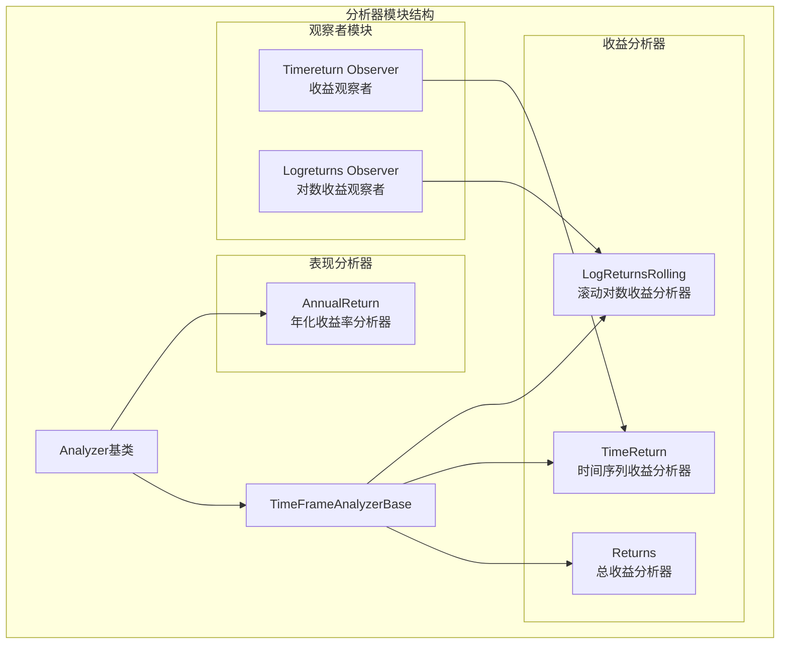
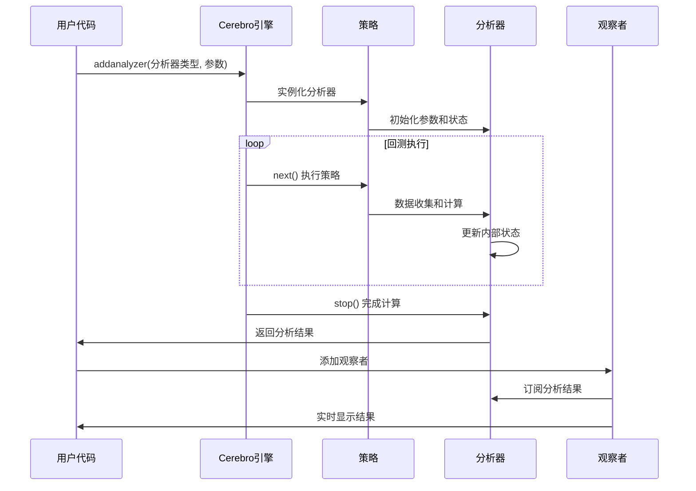
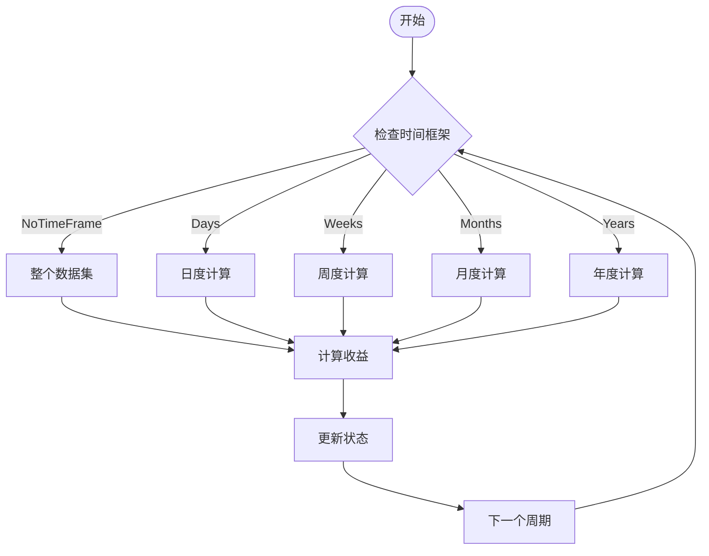
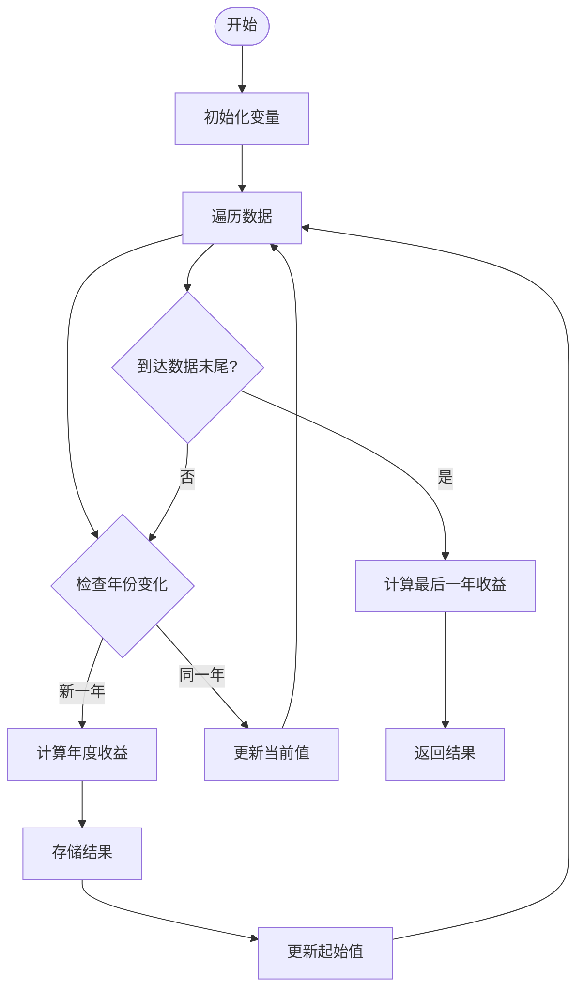
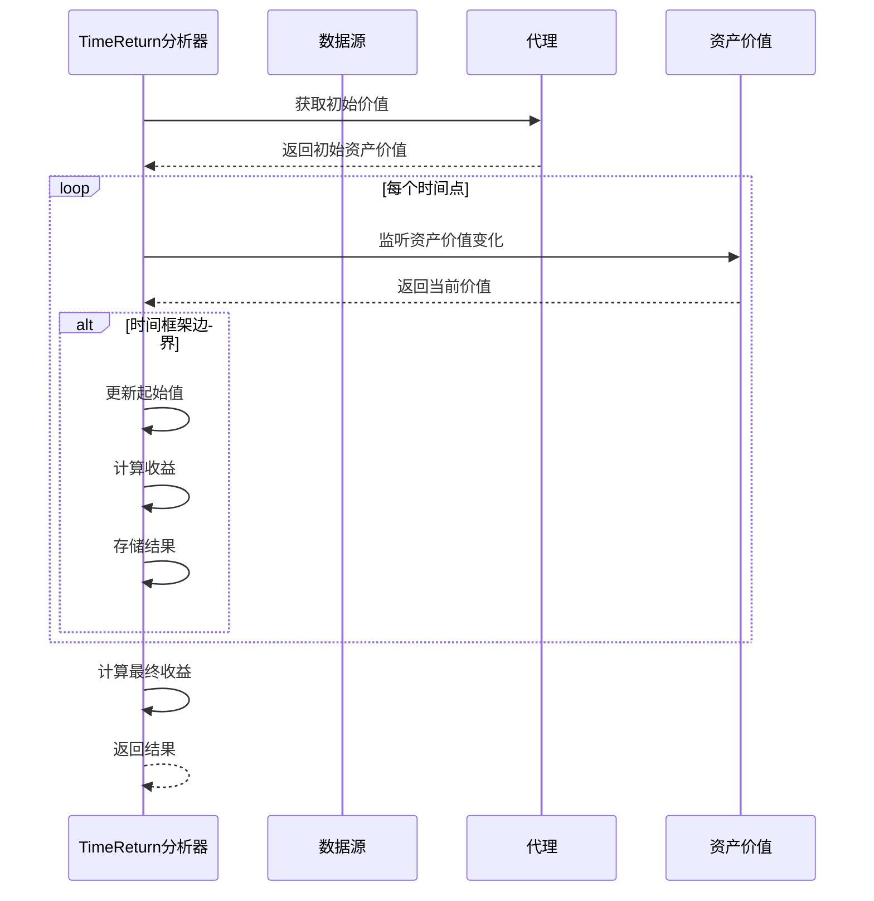
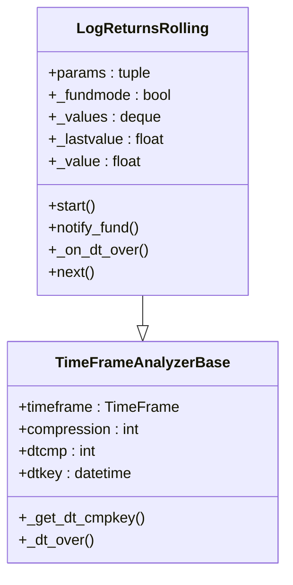
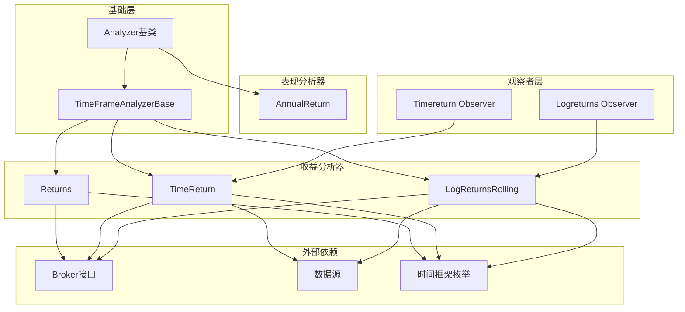
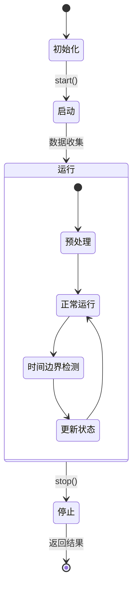

# 收益与表现分析器

<cite>
**本文档引用的文件**
- [returns.py](file://backtrader/analyzers/returns.py)
- [annualreturn.py](file://backtrader/analyzers/annualreturn.py)
- [timereturn.py](file://backtrader/analyzers/timereturn.py)
- [logreturnsrolling.py](file://backtrader/analyzers/logreturnsrolling.py)
- [analyzer.py](file://backtrader/analyzer.py)
- [timereturn_observer.py](file://backtrader/observers/timereturn.py)
- [logreturns_observer.py](file://backtrader/observers/logreturns.py)
- [analyzer_annualreturn_sample.py](file://samples/analyzer-annualreturn/analyzer-annualreturn.py)
- [test_analyzer_timereturn.py](file://tests/test_analyzer-timereturn.py)
- [examples.md](file://.claude/examples.md)
</cite>

## 目录
1. [简介](#简介)
2. [项目结构](#项目结构)
3. [核心组件](#核心组件)
4. [架构概览](#架构概览)
5. [详细组件分析](#详细组件分析)
6. [依赖关系分析](#依赖关系分析)
7. [性能考虑](#性能考虑)
8. [故障排除指南](#故障排除指南)
9. [结论](#结论)
10. [附录](#附录)

## 简介

本文档详细介绍Backtrader框架中的收益与表现分析器，包括四个核心分析器：收益分析器（Returns）、年化收益率分析器（AnnualReturn）、时间序列收益分析器（TimeReturn）和滚动对数收益分析器（LogReturnsRolling）。这些分析器为量化交易策略提供了全面的收益分析能力，支持从整体投资组合表现到具体时间段收益的多层次分析。

Backtrader的分析器系统基于统一的Analyzer基类构建，通过时间框架感知机制实现灵活的时间序列分析。每个分析器都遵循相同的生命周期模式：初始化、启动、运行期间的数据收集、停止时的最终计算和结果输出。

## 项目结构

收益与表现分析器位于Backtrader的核心分析器模块中，采用清晰的文件组织结构：



**图表来源**
- [analyzer.py](file://backtrader/analyzer.py#L89-L447)
- [returns.py](file://backtrader/analyzers/returns.py#L30-L156)
- [timereturn.py](file://backtrader/analyzers/timereturn.py#L27-L143)
- [logreturnsrolling.py](file://backtrader/analyzers/logreturnsrolling.py#L33-L141)

**章节来源**
- [analyzer.py](file://backtrader/analyzer.py#L89-L447)
- [returns.py](file://backtrader/analyzers/returns.py#L30-L156)
- [annualreturn.py](file://backtrader/analyzers/annualreturn.py#L30-L90)

## 核心组件

Backtrader的分析器系统建立在三个关键层次之上：

### 基础分析器层次
- **Analyzer基类**：提供所有分析器的基础功能，包括生命周期管理、数据访问和结果输出
- **TimeFrameAnalyzerBase**：扩展Analyzer，增加时间框架感知能力
- **MetaAnalyzer元类**：处理分析器实例化和策略绑定

### 收益分析器层次
- **Returns**：计算投资组合的总复合收益、平均收益和年化收益
- **TimeReturn**：按时间框架计算收益变化
- **LogReturnsRolling**：提供移动窗口的对数收益率计算

### 表现分析器层次
- **AnnualReturn**：专门计算年度化收益率

**章节来源**
- [analyzer.py](file://backtrader/analyzer.py#L89-L447)
- [returns.py](file://backtrader/analyzers/returns.py#L30-L156)
- [annualreturn.py](file://backtrader/analyzers/annualreturn.py#L30-L90)

## 架构概览

Backtrader分析器系统采用分层架构设计，确保了高度的模块化和可扩展性：



**图表来源**
- [analyzer.py](file://backtrader/analyzer.py#L190-L287)
- [analyzer_annualreturn_sample.py](file://samples/analyzer-annualreturn/analyzer-annualreturn.py#L160-L174)

### 时间框架处理机制

分析器通过统一的时间框架处理机制实现灵活的时间序列分析：



**图表来源**
- [analyzer.py](file://backtrader/analyzer.py#L361-L446)

**章节来源**
- [analyzer.py](file://backtrader/analyzer.py#L299-L447)

## 详细组件分析

### 收益分析器（Returns）

Returns分析器是投资组合收益分析的核心组件，提供全面的收益指标计算：

#### 主要功能特性
- **总复合收益**：计算整个回测期间的投资组合复合收益
- **平均收益**：计算每个时间周期的平均收益
- **年化收益**：根据时间框架自动计算年化收益率
- **对数收益**：使用对数方法提高数值稳定性

#### 关键参数配置

| 参数名称 | 类型 | 默认值 | 描述 |
|---------|------|--------|------|
| timeframe | TimeFrame | None | 时间框架（年、月、日等） |
| compression | int | None | 时间压缩因子 |
| tann | float | None | 年化转换系数 |
| fund | bool | None | 基金模式开关 |

#### 返回值格式

Returns分析器返回字典格式的结果：

```python
{
    'rtot': 0.1542,      # 总复合收益 (15.42%)
    'ravg': 0.0012,      # 平均日收益 (0.12%)
    'rnorm': 0.2875,     # 年化收益 (28.75%)
    'rnorm100': 28.75    # 年化收益百分比 (28.75%)
}
```

#### 使用场景
- 整体投资组合表现评估
- 风险调整后收益分析
- 策略对比和选择

**章节来源**
- [returns.py](file://backtrader/analyzers/returns.py#L30-L156)

### 年化收益率分析器（AnnualReturn）

AnnualReturn分析器专门用于计算年度化收益率，提供跨年度的收益比较能力：

#### 核心算法
分析器通过跟踪每年初末的资产价值来计算年度收益率：



**图表来源**
- [annualreturn.py](file://backtrader/analyzers/annualreturn.py#L50-L87)

#### 输出格式
返回有序字典，键为年份，值为对应的年度收益率：

```python
OrderedDict([
    (2005, 0.1234),  # 2005年收益率12.34%
    (2006, -0.0567), # 2006年收益率-5.67%
    (2007, 0.0891)   # 2007年收益率8.91%
])
```

#### 应用场景
- 年度业绩回顾
- 跨年度策略表现比较
- 市场周期分析

**章节来源**
- [annualreturn.py](file://backtrader/analyzers/annualreturn.py#L30-L90)

### 时间序列收益分析器（TimeReturn）

TimeReturn分析器按指定时间框架计算收益变化，支持灵活的时间粒度控制：

#### 时间框架支持

| 时间框架 | 压缩因子 | 日期键生成 |
|---------|---------|-----------|
| Years | 1 | 年末日期 (YYYY-12-31) |
| Months | 1 | 月末日期 (YYYY-MM-last_day) |
| Weeks | 1 | 周末日期 (ISO周日) |
| Days | 1 | 当日日期 (YYYY-MM-DD) |
| Minutes | n | 分钟边界 (每n分钟) |
| Seconds | n | 秒边界 (每n秒) |
| MicroSeconds | n | 微秒边界 (每n微秒) |

#### 关键参数

| 参数名称 | 类型 | 默认值 | 描述 |
|---------|------|--------|------|
| data | DataFeed | None | 跟踪的参考资产数据 |
| firstopen | bool | True | 首个周期使用开盘价 |
| fund | bool | None | 基金模式开关 |

#### 内部工作流程



**图表来源**
- [timereturn.py](file://backtrader/analyzers/timereturn.py#L125-L142)

#### 实际应用示例

在策略中集成TimeReturn分析器的标准流程：

**章节来源**
- [timereturn.py](file://backtrader/analyzers/timereturn.py#L27-L143)

### 滚动对数收益分析器（LogReturnsRolling）

LogReturnsRolling分析器提供移动窗口的对数收益率计算，支持实时收益监控：

#### 核心特性
- **滚动窗口**：使用固定长度的队列存储历史数据
- **对数收益**：使用自然对数提高数值稳定性
- **实时计算**：每个时间点都产生新的收益值

#### 数据结构设计



**图表来源**
- [logreturnsrolling.py](file://backtrader/analyzers/logreturnsrolling.py#L33-L141)

#### 窗口大小配置

滚动窗口的大小由compression参数决定，影响收益计算的平滑程度：

- **小窗口**：对数收益更敏感，波动性更大
- **大窗口**：收益计算更平滑，但响应速度较慢

#### 输出格式
返回字典，键为时间键，值为对应的对数收益率：

```python
{
    datetime.date(2005, 1, 31): 0.0123,
    datetime.date(2005, 2, 28): -0.0045,
    datetime.date(2005, 3, 31): 0.0089
}
```

**章节来源**
- [logreturnsrolling.py](file://backtrader/analyzers/logreturnsrolling.py#L33-L141)

## 依赖关系分析

收益与表现分析器之间存在复杂的依赖关系，形成了完整的分析生态系统：



**图表来源**
- [analyzer.py](file://backtrader/analyzer.py#L89-L447)
- [timereturn_observer.py](file://backtrader/observers/timereturn.py#L33-L90)
- [logreturns_observer.py](file://backtrader/observers/logreturns.py#L31-L99)

### 生命周期管理

所有分析器都遵循统一的生命周期模式：



**图表来源**
- [analyzer.py](file://backtrader/analyzer.py#L190-L287)

**章节来源**
- [analyzer.py](file://backtrader/analyzer.py#L89-L447)

## 性能考虑

### 计算复杂度分析

| 分析器 | 时间复杂度 | 空间复杂度 | 主要优化点 |
|-------|-----------|-----------|-----------|
| Returns | O(n) | O(1) | 对数运算优化 |
| AnnualReturn | O(n) | O(y) | 年度分组优化 |
| TimeReturn | O(n) | O(1) | 时间边界检测 |
| LogReturnsRolling | O(n) | O(w) | 窗口队列管理 |

### 内存使用优化

1. **滚动窗口优化**：LogReturnsRolling使用collections.deque实现O(1)插入删除
2. **增量计算**：Returns和TimeReturn避免重复计算，只维护必要的状态变量
3. **内存池**：TimeFrameAnalyzerBase复用时间框架比较键

### 数值稳定性

- **对数收益**：使用math.log避免大数运算溢出
- **零值处理**：Returns分析器正确处理除零错误
- **负值检测**：防止对负数取对数导致的数学错误

## 故障排除指南

### 常见问题及解决方案

#### 1. 分析器未返回预期结果

**症状**：分析器返回空字典或None值

**可能原因**：
- 数据源为空或无效
- 时间框架设置不正确
- 资金模式配置错误

**解决步骤**：
1. 验证数据源完整性
2. 检查时间框架兼容性
3. 确认资金模式设置

#### 2. 收益率计算异常

**症状**：出现无穷大、NaN或异常高的收益率

**可能原因**：
- 初始资金为零
- 数据中有缺失值
- 时间边界检测错误

**调试方法**：
1. 检查broker.getcash()和broker.getvalue()的非零性
2. 验证数据序列的连续性
3. 使用简单数据集进行单元测试

#### 3. 内存使用过高

**症状**：长时间运行后内存持续增长

**解决方法**：
1. 使用适当的compression参数
2. 及时清理不需要的历史数据
3. 考虑使用更高效的数据结构

**章节来源**
- [returns.py](file://backtrader/analyzers/returns.py#L127-L135)
- [timereturn.py](file://backtrader/analyzers/timereturn.py#L125-L142)

## 结论

Backtrader的收益与表现分析器系统提供了全面而灵活的量化交易分析能力。通过四个核心分析器的协同工作，用户可以：

1. **全面评估投资组合表现**：Returns分析器提供整体收益指标
2. **进行时间维度分析**：TimeReturn支持多时间框架收益计算
3. **监控年度表现**：AnnualReturn专门处理年度收益分析
4. **实时收益监控**：LogReturnsRolling提供滚动对数收益

这些分析器的设计充分考虑了性能、准确性和易用性，在保持高精度的同时提供了优秀的运行效率。通过合理的参数配置和使用场景选择，用户可以构建出强大的交易策略分析和监控系统。

## 附录

### 实际使用示例

以下是一个完整的策略集成示例，展示了如何在策略中使用各种收益分析器：

```python
import backtrader as bt
from datetime import datetime

class MyStrategy(bt.Strategy):
    def __init__(self):
        # 创建移动平均线指标
        self.sma = bt.indicators.SMA(period=20)
        
    def next(self):
        # 简单的均线交叉策略
        if not self.position:
            if self.data.close > self.sma:
                self.buy()
        else:
            if self.data.close < self.sma:
                self.sell()

def run_backtest():
    # 创建Cerebro引擎
    cerebro = bt.Cerebro()
    
    # 添加策略
    cerebro.addstrategy(MyStrategy)
    
    # 添加分析器
    cerebro.addanalyzer(bt.analyzers.Returns, _name='returns')
    cerebro.addanalyzer(bt.analyzers.AnnualReturn, _name='annual')
    cerebro.addanalyzer(bt.analyzers.TimeReturn, 
                      timeframe=bt.TimeFrame.Years, 
                      _name='yearly_returns')
    cerebro.addanalyzer(bt.analyzers.LogReturnsRolling, 
                      compression=20,  # 20日滚动窗口
                      _name='log_returns')
    
    # 运行回测
    results = cerebro.run()
    strat = results[0]
    
    # 获取分析结果
    returns = strat.analyzers.returns.get_analysis()
    annual = strat.analyzers.annual.get_analysis()
    yearly = strat.analyzers.yearly_returns.get_analysis()
    log_ret = strat.analyzers.log_returns.get_analysis()
    
    print("总收益:", returns['rtot'])
    print("年化收益:", returns['rnorm'])
    print("年度收益:", annual)
    print("年收益序列:", yearly)
    print("滚动对数收益:", log_ret)

if __name__ == '__main__':
    run_backtest()
```

### 高级配置技巧

#### 自定义时间框架
```python
# 创建自定义时间框架分析器
cerebro.addanalyzer(bt.analyzers.TimeReturn, 
                  timeframe=bt.TimeFrame.Months,
                  compression=3,  # 季度分析
                  _name='quarterly')
```

#### 多资产跟踪
```python
# 跟踪特定资产而非投资组合
cerebro.addanalyzer(bt.analyzers.TimeReturn, 
                  data=my_asset_data,
                  firstopen=False,
                  _name='asset_return')
```

#### 实时监控设置
```python
# 使用观察者实时显示收益
cerebro.addobserver(bt.observers.TimeReturn)
cerebro.addobserver(bt.observers.LogReturns)
```

**章节来源**
- [examples.md](file://.claude/examples.md#L882-L1013)
- [analyzer_annualreturn_sample.py](file://samples/analyzer-annualreturn/analyzer-annualreturn.py#L160-L174)