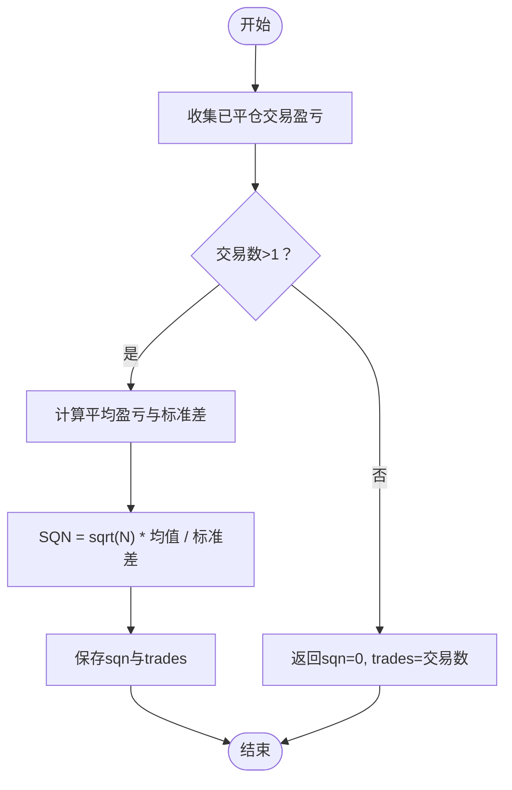

# 绩效指标分析器

<cite>
**本文引用的文件**
- [backtrader/analyzers/sharpe.py](file://backtrader/analyzers/sharpe.py)
- [backtrader/analyzers/sqn.py](file://backtrader/analyzers/sqn.py)
- [backtrader/analyzers/timereturn.py](file://backtrader/analyzers/timereturn.py)
- [backtrader/analyzers/annualreturn.py](file://backtrader/analyzers/annualreturn.py)
- [backtrader/analyzer.py](file://backtrader/analyzer.py)
- [backtrader/mathsupport.py](file://backtrader/mathsupport.py)
- [samples/sharpe-timereturn/sharpe-timereturn.py](file://samples/sharpe-timereturn/sharpe-timereturn.py)
- [tests/test_analyzer-sqn.py](file://tests/test_analyzer-sqn.py)
</cite>

## 目录
1. [简介](#简介)
2. [项目结构](#项目结构)
3. [核心组件](#核心组件)
4. [架构总览](#架构总览)
5. [详细组件分析](#详细组件分析)
6. [依赖关系分析](#依赖关系分析)
7. [性能考量](#性能考量)
8. [故障排查指南](#故障排查指南)
9. [结论](#结论)
10. [附录：使用示例与策略优化实践](#附录使用示例与策略优化实践)

## 简介
本文件面向Backtrader框架中的两个关键绩效指标分析器：夏普比率分析器（SharpeRatio）与系统质量指数分析器（SQN）。我们将从实现原理、参数配置、基准选择、结果解释到实战应用进行全面解析，并给出策略优化与投资决策建议。

## 项目结构
与本主题直接相关的模块位于backtrader/analyzers目录下，核心类继承自Analyzer基类，通过子分析器（如TimeReturn、AnnualReturn）或内部统计工具（平均值、标准差）完成指标计算。

图表来源
- [backtrader/analyzer.py](file://backtrader/analyzer.py#L89-L286)
- [backtrader/analyzers/timereturn.py](file://backtrader/analyzers/timereturn.py#L27-L143)
- [backtrader/analyzers/annualreturn.py](file://backtrader/analyzers/annualreturn.py#L30-L90)
- [backtrader/analyzers/sharpe.py](file://backtrader/analyzers/sharpe.py#L33-L221)
- [backtrader/analyzers/sqn.py](file://backtrader/analyzers/sqn.py#L31-L85)
- [backtrader/mathsupport.py](file://backtrader/mathsupport.py#L27-L65)

章节来源
- [backtrader/analyzers/__init__.py](file://backtrader/analyzers/__init__.py#L24-L44)

## 核心组件
- 夏普比率分析器（SharpeRatio）
  - 功能：衡量单位总风险所获得的超额回报，常用于风险调整后收益评估。
  - 关键输入：时间窗回报序列、无风险利率及其换算因子、是否按年化输出。
  - 输出：单个数值“sharperatio”。
- 系统质量指数分析器（SQN）
  - 功能：衡量交易系统的稳定性与盈利能力，考虑交易次数、平均每笔交易盈亏与盈亏波动性。
  - 关键输入：每笔已平仓交易的盈亏（含手续费）。
  - 输出：“sqn”与“trades”。

章节来源
- [backtrader/analyzers/sharpe.py](file://backtrader/analyzers/sharpe.py#L33-L221)
- [backtrader/analyzers/sqn.py](file://backtrader/analyzers/sqn.py#L31-L85)

## 架构总览
夏普比率分析器可选择两种路径：
- 新式路径：依赖TimeReturn按指定时间窗聚合回报，再进行均值与标准差计算。
- 旧式路径：依赖AnnualReturn仅按年计算回报（兼容历史用法）。

SQN分析器直接订阅策略的交易通知，收集每笔已平仓交易的盈亏，最终计算系统质量指数。

图表来源
- [backtrader/analyzers/sharpe.py](file://backtrader/analyzers/sharpe.py#L134-L206)
- [backtrader/analyzers/timereturn.py](file://backtrader/analyzers/timereturn.py#L125-L142)
- [backtrader/analyzers/annualreturn.py](file://backtrader/analyzers/annualreturn.py#L50-L89)
- [backtrader/mathsupport.py](file://backtrader/mathsupport.py#L27-L65)

## 详细组件分析

### 夏普比率分析器（SharpeRatio）
- 计算公式与流程
  - 超额回报 = 投资回报 − 无风险利率
  - 夏普比率 = 超额回报均值 / 超额回报标准差
  - 年化处理：当annualize启用且convertrate为真时，对比率乘以sqrt(换算因子)
- 参数说明
  - timeframe/compression：决定回报聚合的时间粒度与压缩倍数
  - riskfreerate：无风险利率（默认年化）
  - convertrate：是否将无风险利率按时间窗向下折算；否则将回报向上折算至年化
  - factor/daysfactor：换算因子（默认按日=252、周=52、月=12、年=1）
  - annualize：是否输出年化夏普比率
  - stddev_sample：是否使用样本标准差（Bessel校正）
  - legacyannual：是否使用AnnualReturn（仅限年）
  - fund：资金模式（组合净值/基金价值），自动检测或显式指定
- 结果解释
  - 数值越高代表单位风险带来的超额收益越高
  - 需结合样本量与波动性综合判断
- 错误与边界
  - 当回报数量不足或标准差为零时返回空值
  - 支持Bessel校正以避免小样本偏差

图表来源
- [backtrader/analyzers/sharpe.py](file://backtrader/analyzers/sharpe.py#L143-L206)
- [backtrader/mathsupport.py](file://backtrader/mathsupport.py#L27-L65)

章节来源
- [backtrader/analyzers/sharpe.py](file://backtrader/analyzers/sharpe.py#L33-L221)
- [backtrader/analyzers/timereturn.py](file://backtrader/analyzers/timereturn.py#L27-L143)
- [backtrader/analyzers/annualreturn.py](file://backtrader/analyzers/annualreturn.py#L30-L90)
- [backtrader/mathsupport.py](file://backtrader/mathsupport.py#L27-L65)

### 系统质量指数分析器（SQN）
- 计算公式与流程
  - SQN = sqrt(N) × 平均每笔交易盈亏 / 每笔交易盈亏的标准差
  - N为已平仓交易数
- 参数说明
  - 无外部参数，自动收集策略交易通知中的已平仓交易盈亏
- 结果解释
  - 参考等级：1.6–1.9（较差）、2.0–2.4（一般）、2.5–2.9（良好）、3.0–5.0（优秀）、5.1–6.9（卓越）、7.0+（神话）
  - 该指标在交易次数≥30时更可靠
- 边界与错误
  - 当交易数≤1时返回0，避免除零与不稳健估计

图表来源
- [backtrader/analyzers/sqn.py](file://backtrader/analyzers/sqn.py#L63-L85)
- [backtrader/mathsupport.py](file://backtrader/mathsupport.py#L27-L65)

章节来源
- [backtrader/analyzers/sqn.py](file://backtrader/analyzers/sqn.py#L31-L85)
- [tests/test_analyzer-sqn.py](file://tests/test_analyzer-sqn.py#L154-L182)

## 依赖关系分析
- SharpeRatio依赖
  - Analyzer基类：生命周期与通知机制
  - TimeReturn/AnnualReturn：回报序列生成
  - mathsupport.average/standarddev：统计计算
- SQN依赖
  - Analyzer基类：生命周期与通知机制
  - mathsupport.average/standarddev：统计计算
  - AutoOrderedDict：分析结果容器

图表来源
- [backtrader/analyzer.py](file://backtrader/analyzer.py#L89-L286)
- [backtrader/analyzers/timereturn.py](file://backtrader/analyzers/timereturn.py#L27-L143)
- [backtrader/analyzers/annualreturn.py](file://backtrader/analyzers/annualreturn.py#L30-L90)
- [backtrader/analyzers/sharpe.py](file://backtrader/analyzers/sharpe.py#L33-L221)
- [backtrader/analyzers/sqn.py](file://backtrader/analyzers/sqn.py#L31-L85)

## 性能考量
- 时间窗与压缩
  - 合理设置timeframe与compression可减少数据点数量，提高计算效率
- 样本校正
  - 在交易或回报较少时启用stddev_sample（Bessel校正）可降低偏差，但会减少自由度
- 年化与换算
  - convertrate=true时，无风险利率向下折算；false时回报向上折算。注意二者等价但侧重点不同
- 数据访问
  - TimeReturn/AnnualReturn在start阶段缓存初始值，后续仅做增量更新，避免重复扫描

## 故障排查指南
- 夏普比率为空
  - 检查是否有足够回报数据（至少1条，且stddev_sample不使分母为0）
  - 确认无风险利率与换算因子设置合理
  - 若使用legacyannual，确认AnnualReturn返回了非空序列
- SQN为0或不稳定
  - 交易数≤1时返回0属预期行为
  - 当交易数较低（<30）时，SQN不可靠，应结合其他指标
- 结果异常或NaN
  - 检查是否存在标准差为0的情况（回报完全一致）
  - 确保交易通知正确触发（策略需实现notify_trade）

章节来源
- [backtrader/analyzers/sharpe.py](file://backtrader/analyzers/sharpe.py#L182-L202)
- [backtrader/analyzers/sqn.py](file://backtrader/analyzers/sqn.py#L77-L82)

## 结论
- 夏普比率适合评估风险调整后收益，需谨慎设定无风险利率与时间窗，并根据样本规模与波动性解读
- SQN适合评估交易系统稳定性与质量，尤其关注交易次数与盈亏分布
- 在策略优化中，建议同时跟踪多个指标并结合回测周期、市场环境与交易成本进行综合判断

## 附录：使用示例与策略优化实践
- 夏普比率示例（命令行参数驱动）
  - 示例脚本展示了如何添加TimeReturn与SharpeRatio分析器，并通过命令行参数控制时间窗、是否年化、无风险利率、换算因子与样本校正
  - 参考路径：samples/sharpe-timereturn/sharpe-timereturn.py
- SQN测试验证
  - 测试用例验证了在不同最大交易数场景下的sqn与trades输出，可用于回归对比
  - 参考路径：tests/test_analyzer-sqn.py
- 实战建议
  - 策略优化
    - 将SharpeRatio与SQN同时加入分析器集合，观察两者一致性
    - 对不同参数组合运行多组回测，筛选高夏普且稳定SQN的策略
  - 基准选择
    - 无风险利率应与分析时间尺度匹配（如年化10年期国债收益率对应年化夏普）
  - 结果解释
    - 夏普比率上升但SQN下降可能意味着极端收益拉高比率但稳定性变差，需进一步拆解交易分布
  - 策略改进建议
    - 提升胜率与盈亏比（改善平均交易盈亏与标准差）
    - 控制交易频率与波动（增加N，提升SQN可靠性）
    - 降低择时误差与滑点（减少超额回报波动）

章节来源
- [samples/sharpe-timereturn/sharpe-timereturn.py](file://samples/sharpe-timereturn/sharpe-timereturn.py#L30-L97)
- [tests/test_analyzer-sqn.py](file://tests/test_analyzer-sqn.py#L154-L182)