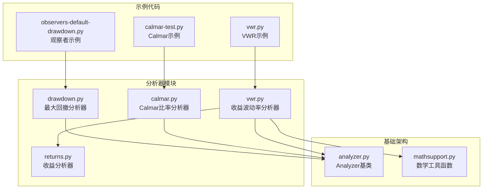
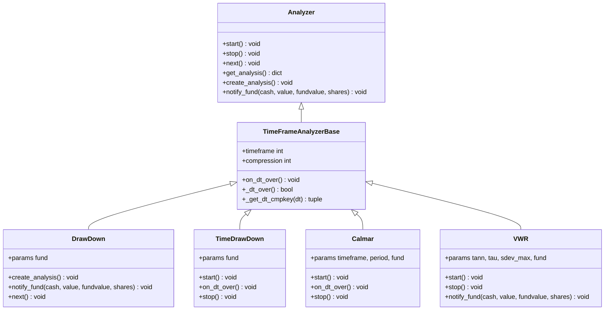
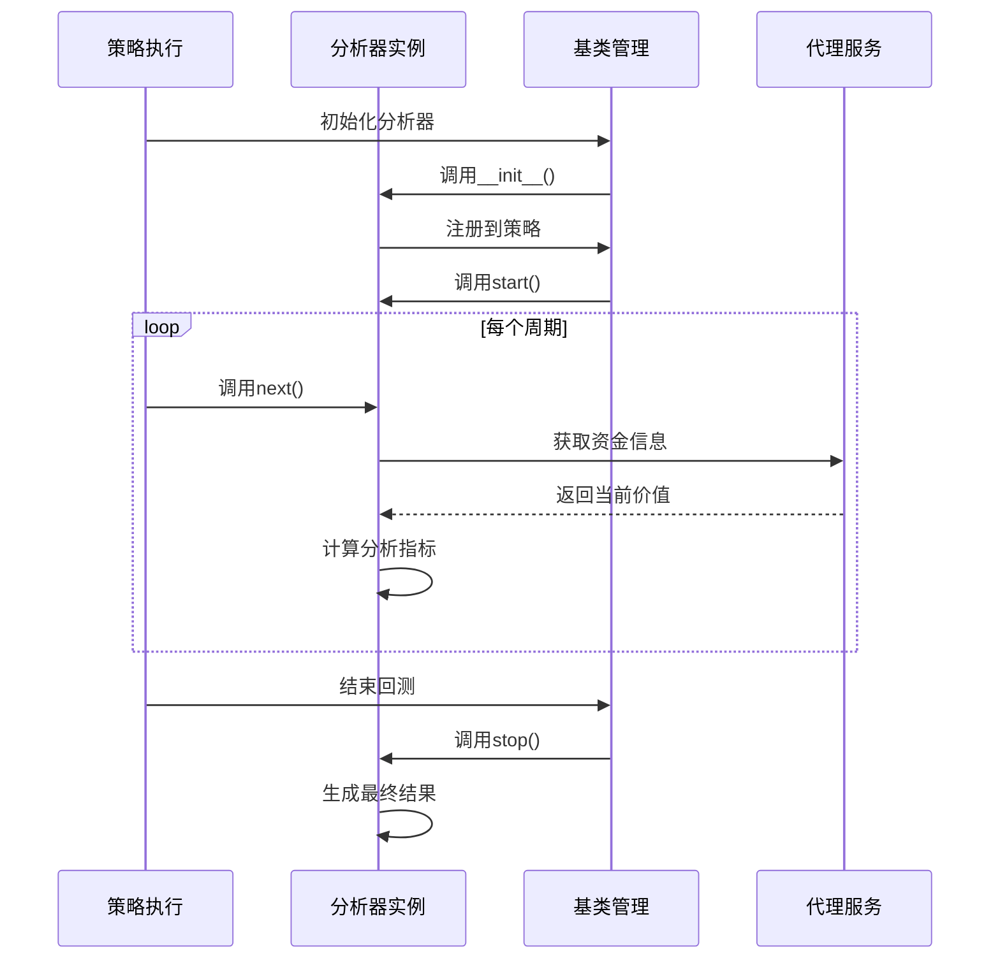
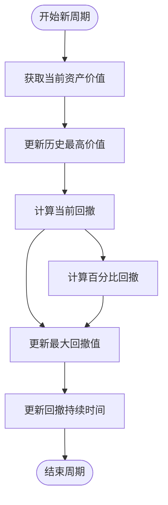
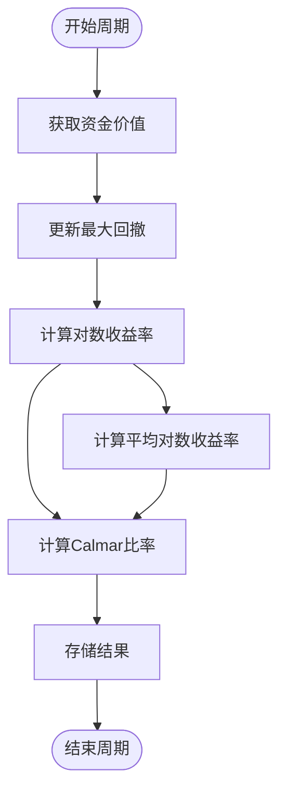
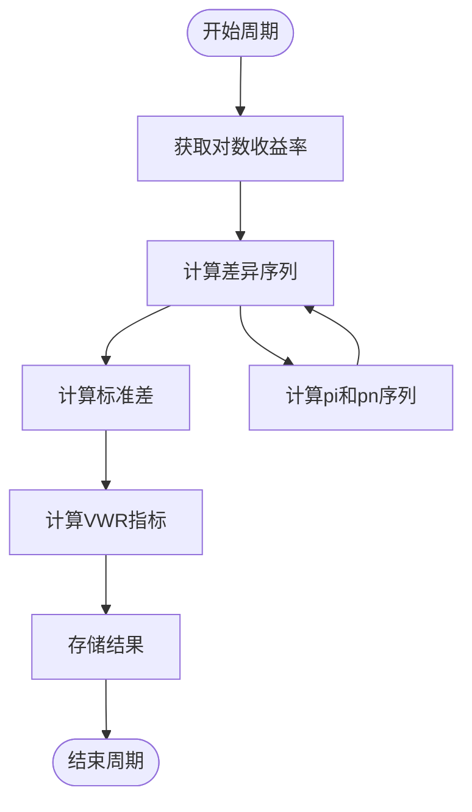
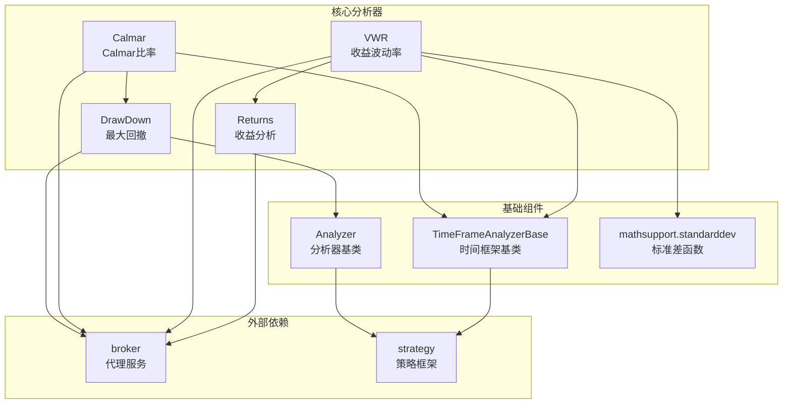

# 风险分析器

<cite>
**本文档引用的文件**
- [backtrader/analyzers/drawdown.py](file://backtrader/analyzers/drawdown.py)
- [backtrader/analyzers/calmar.py](file://backtrader/analyzers/calmar.py)
- [backtrader/analyzers/vwr.py](file://backtrader/analyzers/vwr.py)
- [backtrader/analyzers/returns.py](file://backtrader/analyzers/returns.py)
- [backtrader/analyzer.py](file://backtrader/analyzer.py)
- [backtrader/mathsupport.py](file://backtrader/mathsupport.py)
- [samples/calmar/calmar-test.py](file://samples/calmar/calmar-test.py)
- [samples/vwr/vwr.py](file://samples/vwr/vwr.py)
- [samples/observers/observers-default-drawdown.py](file://samples/observers/observers-default-drawdown.py)
</cite>

## 目录
1. [简介](#简介)
2. [项目结构](#项目结构)
3. [核心组件](#核心组件)
4. [架构概览](#架构概览)
5. [详细组件分析](#详细组件分析)
6. [依赖关系分析](#依赖关系分析)
7. [性能考虑](#性能考虑)
8. [故障排除指南](#故障排除指南)
9. [结论](#结论)

## 简介

本文件详细介绍backtrader框架中的三个关键风险分析器：最大回撤分析器（DrawDown）、Calmar比率分析器（Calmar）和收益波动率分析器（VWR）。这些分析器为投资组合风险管理提供了重要的量化指标，帮助投资者评估潜在风险和调整投资策略。

backtrader是一个功能强大的Python量化交易框架，提供了丰富的分析器组件来支持复杂的投资策略开发和回测。本文档将深入分析这些风险分析器的实现原理、计算方法和实际应用。

## 项目结构

backtrader的风险分析器位于`backtrader/analyzers/`目录下，采用模块化设计，每个分析器都是独立的Python模块，遵循统一的Analyzer基类接口。



**图表来源**
- [backtrader/analyzers/drawdown.py](file://backtrader/analyzers/drawdown.py#L1-L198)
- [backtrader/analyzers/calmar.py](file://backtrader/analyzers/calmar.py#L1-L114)
- [backtrader/analyzers/vwr.py](file://backtrader/analyzers/vwr.py#L1-L174)
- [backtrader/analyzer.py](file://backtrader/analyzer.py#L89-L447)

**章节来源**
- [backtrader/analyzers/drawdown.py](file://backtrader/analyzers/drawdown.py#L1-L198)
- [backtrader/analyzers/calmar.py](file://backtrader/analyzers/calmar.py#L1-L114)
- [backtrader/analyzers/vwr.py](file://backtrader/analyzers/vwr.py#L1-L174)

## 核心组件

backtrader的风险分析器系统基于统一的Analyzer基类架构，提供了灵活的时间框架分析能力。所有分析器都继承自`Analyzer`或`TimeFrameAnalyzerBase`基类，实现了标准化的生命周期管理和数据处理接口。

### 分析器基类架构



**图表来源**
- [backtrader/analyzer.py](file://backtrader/analyzer.py#L89-L447)
- [backtrader/analyzers/drawdown.py](file://backtrader/analyzers/drawdown.py#L31-L198)
- [backtrader/analyzers/calmar.py](file://backtrader/analyzers/calmar.py#L31-L114)
- [backtrader/analyzers/vwr.py](file://backtrader/analyzers/vwr.py#L32-L174)

### 时间框架处理机制

backtrader通过`TimeFrameAnalyzerBase`类实现了灵活的时间框架分析功能，支持日线、周线、月线、年线等不同时间粒度的数据处理。

**章节来源**
- [backtrader/analyzer.py](file://backtrader/analyzer.py#L289-L447)

## 架构概览

backtrader的风险分析器架构采用了分层设计模式，从基础的Analyzer基类到具体的功能分析器，形成了完整的分析体系。



**图表来源**
- [backtrader/analyzer.py](file://backtrader/analyzer.py#L137-L287)

## 详细组件分析

### 最大回撤分析器（DrawDown）

最大回撤是衡量投资组合从最高点到随后最低点下跌幅度的重要风险指标，反映了投资者可能面临的最大损失。

#### 核心计算逻辑



**图表来源**
- [backtrader/analyzers/drawdown.py](file://backtrader/analyzers/drawdown.py#L98-L111)

#### 参数配置

| 参数名 | 类型 | 默认值 | 描述 |
|--------|------|--------|------|
| fund | bool/None | None | 资金模式开关，None表示自动检测 |

#### 计算公式

最大回撤计算采用以下公式：
- 回撤金额 = 当前价值 - 历史最高价值
- 回撤百分比 = (回撤金额 / 历史最高价值) × 100%

#### 实际应用示例

```python
# 添加最大回撤分析器到策略
cerebro.addanalyzer(bt.analyzers.DrawDown, _name='drawdown')

# 获取分析结果
results = strat.analyzers.drawdown.get_analysis()
current_dd = results.drawdown  # 当前回撤百分比
max_dd = results.max.drawdown  # 最大回撤百分比
```

**章节来源**
- [backtrader/analyzers/drawdown.py](file://backtrader/analyzers/drawdown.py#L31-L111)

### Calmar比率分析器

Calmar比率是衡量投资组合收益风险比的重要指标，通过将年化收益率除以最大回撤来评估风险调整后的表现。

#### 核心算法实现



**图表来源**
- [backtrader/analyzers/calmar.py](file://backtrader/analyzers/calmar.py#L101-L111)

#### 参数配置

| 参数名 | 类型 | 默认值 | 描述 |
|--------|------|--------|------|
| timeframe | TimeFrame | Months | 时间框架，默认月度 |
| period | int | 36 | 计算期数，默认36个月 |
| fund | bool/None | None | 资金模式开关 |

#### 计算公式

Calmar比率计算采用以下步骤：
1. 计算对数收益率序列：r_i = ln(P_i/P_{i-1})
2. 计算平均对数收益率：r_avg = (1/n) × Σr_i
3. Calmar比率 = r_avg / max_drawdown

其中max_drawdown来自TimeDrawDown子分析器。

#### 实际应用示例

```python
# 添加Calmar分析器
cerebro.addanalyzer(bt.analyzers.Calmar, _name='calmar')

# 获取结果
results = strat.analyzers.calmar.get_analysis()
for period, calmar_value in results.items():
    print(f"{period}: Calmar比率 = {calmar_value}")
```

**章节来源**
- [backtrader/analyzers/calmar.py](file://backtrader/analyzers/calmar.py#L31-L114)

### 收益波动率分析器（VWR）

Variability-Weighted Return（VWR）是改进的夏普比率，通过考虑收益波动性来提供更准确的风险调整收益评估。

#### 核心算法实现



**图表来源**
- [backtrader/analyzers/vwr.py](file://backtrader/analyzers/vwr.py#L150-L160)

#### 参数配置

| 参数名 | 类型 | 默认值 | 描述 |
|--------|------|--------|------|
| tann | float/None | None | 年化因子 |
| tau | float | 2.0 | 波动性权重因子 |
| sdev_max | float | 2.0 | 最大标准差阈值 |
| fund | bool/None | None | 资金模式开关 |

#### 计算公式

VWR指标计算采用以下公式：
1. 计算差异序列：d_t = P_t/(P_0 × e^{r_avg × t}) - 1
2. 计算标准差：σ_p = std(d_t)
3. VWR = r_norm100 × (1 - (σ_p/σ_max)^τ)

其中：
- r_norm100为年化收益率百分比
- σ_p为差异序列的标准差
- σ_max为最大标准差阈值
- τ为波动性权重因子

#### 实际应用示例

```python
# 添加VWR分析器
vwr_kwargs = {
    'timeframe': bt.TimeFrame.Months,
    'tann': 12,
    'sigma_max': 0.20,
    'tau': 2.0
}
cerebro.addanalyzer(bt.analyzers.VWR, _name='vwr', **vwr_kwargs)

# 获取结果
results = strat.analyzers.vwr.get_analysis()
vwr_score = results.vwr
```

**章节来源**
- [backtrader/analyzers/vwr.py](file://backtrader/analyzers/vwr.py#L32-L174)

## 依赖关系分析

backtrader的风险分析器之间存在清晰的依赖关系，形成了完整的分析生态系统。



**图表来源**
- [backtrader/analyzers/drawdown.py](file://backtrader/analyzers/drawdown.py#L24-L25)
- [backtrader/analyzers/calmar.py](file://backtrader/analyzers/calmar.py#L24-L25)
- [backtrader/analyzers/vwr.py](file://backtrader/analyzers/vwr.py#L24-L29)
- [backtrader/analyzer.py](file://backtrader/analyzer.py#L29-L31)

### 关键依赖关系

1. **DrawDown依赖关系**：直接依赖broker服务获取资金信息
2. **Calmar依赖关系**：依赖TimeDrawDown子分析器和broker服务
3. **VWR依赖关系**：依赖Returns分析器、标准差函数和broker服务

**章节来源**
- [backtrader/analyzers/drawdown.py](file://backtrader/analyzers/drawdown.py#L24-L25)
- [backtrader/analyzers/calmar.py](file://backtrader/analyzers/calmar.py#L24-L25)
- [backtrader/analyzers/vwr.py](file://backtrader/analyzers/vwr.py#L24-L29)

## 性能考虑

backtrader的风险分析器在设计时充分考虑了性能优化，采用了多种技术来提高计算效率。

### 内存管理优化

1. **动态数组管理**：使用collections.deque实现高效的队列操作
2. **惰性计算**：只在需要时才计算复杂的统计指标
3. **内存池模式**：复用对象避免频繁的内存分配

### 计算复杂度分析

| 分析器 | 时间复杂度 | 空间复杂度 | 优化特性 |
|--------|------------|------------|----------|
| DrawDown | O(n) | O(1) | 常数空间，线性时间 |
| Calmar | O(n) | O(p) | p为周期长度，通常较小 |
| VWR | O(n) | O(n) | 需要存储完整序列 |

### 性能调优建议

1. **合理设置时间框架**：选择合适的时间粒度平衡精度和性能
2. **控制分析器数量**：避免同时运行过多分析器造成性能瓶颈
3. **使用缓存机制**：对于重复计算的结果进行缓存

## 故障排除指南

### 常见问题及解决方案

#### 1. 分析器结果异常

**问题描述**：分析器返回NaN或异常值
**解决方案**：
- 检查资金模式设置是否正确
- 确认数据源的有效性
- 验证时间框架配置

#### 2. 性能问题

**问题描述**：分析器运行缓慢
**解决方案**：
- 减少分析器数量
- 优化时间框架设置
- 使用更高效的数据格式

#### 3. 内存泄漏

**问题描述**：长时间运行后内存占用增加
**解决方案**：
- 确保正确调用stop()方法
- 及时清理不需要的数据结构
- 监控内存使用情况

**章节来源**
- [backtrader/analyzer.py](file://backtrader/analyzer.py#L242-L245)

## 结论

backtrader的风险分析器系统提供了全面而灵活的投资组合风险管理工具集。通过DrawDown、Calmar和VWR三个核心分析器，用户可以获得：

1. **全面的风险评估**：从最大回撤到波动率的多维度风险指标
2. **灵活的配置选项**：支持不同的时间框架和参数设置
3. **高效的性能表现**：优化的算法设计确保实时计算能力
4. **易于使用的接口**：简洁的API设计降低使用门槛

这些分析器不仅适用于学术研究，更可以直接应用于实际的投资决策过程，为量化交易策略提供科学的风险管理依据。通过合理配置和使用这些工具，投资者可以更好地理解和控制投资组合的风险暴露，制定更加稳健的投资策略。