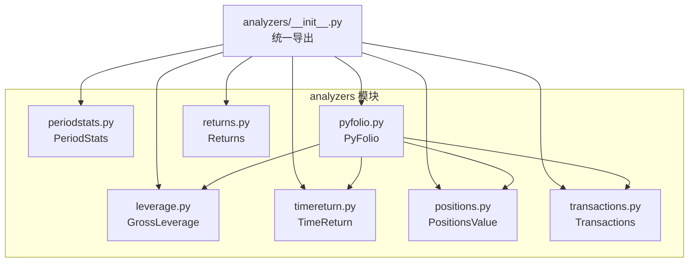
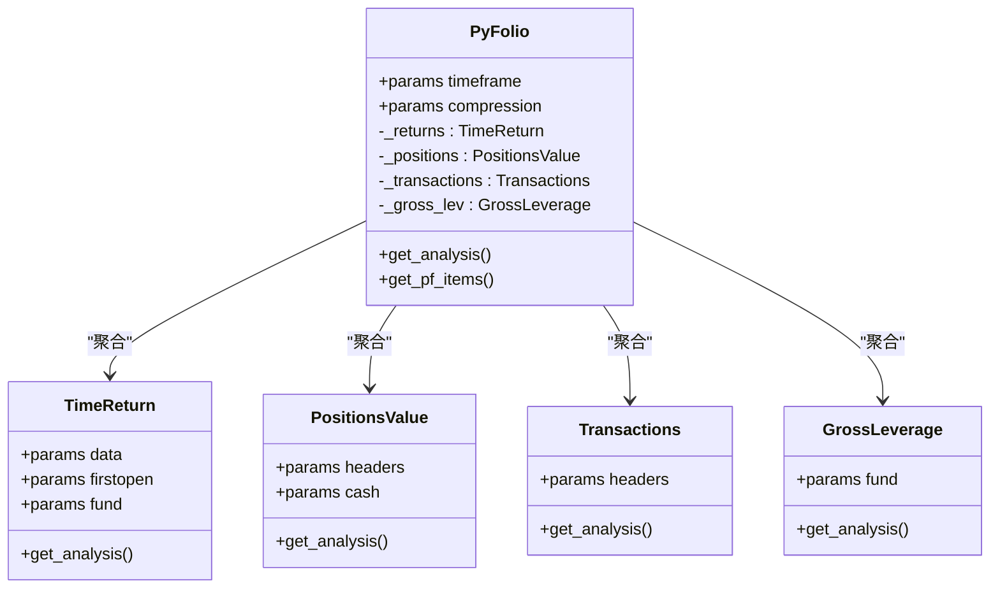
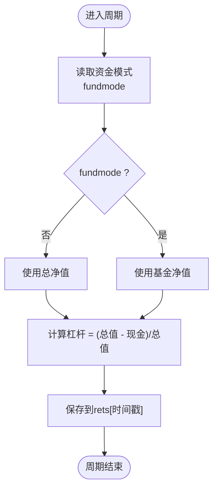
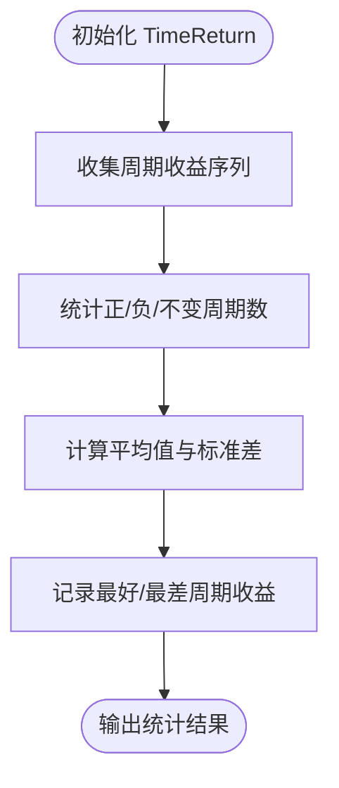
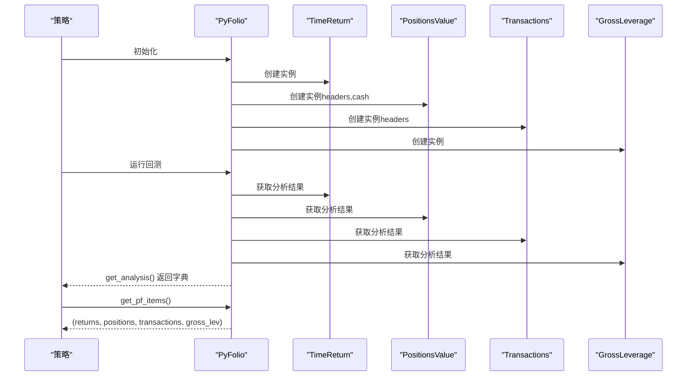
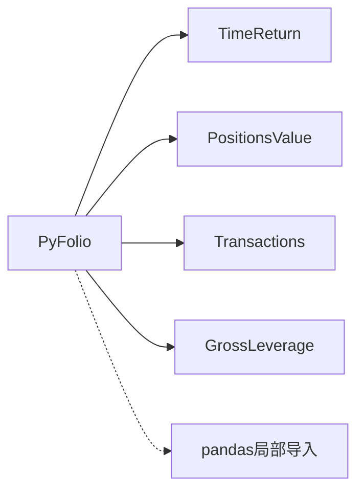

# 高级分析器

<cite>
**本文引用的文件**
- [leverage.py](file://backtrader/analyzers/leverage.py)
- [periodstats.py](file://backtrader/analyzers/periodstats.py)
- [pyfolio.py](file://backtrader/analyzers/pyfolio.py)
- [__init__.py](file://backtrader/analyzers/__init__.py)
- [positions.py](file://backtrader/analyzers/positions.py)
- [transactions.py](file://backtrader/analyzers/transactions.py)
- [timereturn.py](file://backtrader/analyzers/timereturn.py)
- [returns.py](file://backtrader/analyzers/returns.py)
- [pyfoliotest.py](file://samples/pyfoliotest/pyfoliotest.py)
- [pyfoliotest.py](file://samples/pyfolio2/pyfoliotest.py)
</cite>

## 目录
1. [引言](#引言)
2. [项目结构](#项目结构)
3. [核心组件](#核心组件)
4. [架构总览](#架构总览)
5. [详细组件分析](#详细组件分析)
6. [依赖关系分析](#依赖关系分析)
7. [性能考量](#性能考量)
8. [故障排查指南](#故障排查指南)
9. [结论](#结论)
10. [附录：集成示例与最佳实践](#附录集成示例与最佳实践)

## 引言
本文件系统性梳理 backtrader 中三类高级分析器：杠杆率分析器（GrossLeverage）、周期统计分析器（PeriodStats）与 pyfolio 集成分析器（PyFolio）。它们分别面向“投资组合杠杆水平与风险暴露监控”、“按时间周期的统计分析”和“与 pyfolio 的无缝对接与高级分析”。文档将从架构、数据流、处理逻辑、配置方法、输出格式到专业应用场景进行深入说明，并提供可直接落地的集成示例与协同策略。

## 项目结构
高级分析器位于 backtrader/analyzers 目录下，通过 analyzers/__init__.py 统一导出，供 cerebro 在回测运行时按名称调用。PyFolio 分析器内部聚合多个子分析器（TimeReturn、PositionsValue、Transactions、GrossLeverage），形成与 pyfolio 兼容的数据集。

图表来源
- [__init__.py](file://backtrader/analyzers/__init__.py#L27-L43)
- [pyfolio.py](file://backtrader/analyzers/pyfolio.py#L86-L94)

章节来源
- [__init__.py](file://backtrader/analyzers/__init__.py#L27-L43)

## 核心组件
- 杠杆率分析器（GrossLeverage）
  - 作用：按时间步长计算投资组合总杠杆（总市值与现金差值占总市值的比例），反映策略的加杠杆程度与潜在风险暴露。
  - 关键参数：fund（资金模式自动检测或显式指定）。
  - 输出：以时间戳为键、杠杆值为值的字典。
- 周期统计分析器（PeriodStats）
  - 作用：基于给定时间框架（年/日等）计算周期收益的均值、标准差、正周期数、负周期数、无变化周期数、最大收益与最小损失。
  - 关键参数：timeframe、compression、zeroispos（将零变化计为正）、fund。
  - 输出：包含 average、stddev、positive、negative、nochange、best、worst 的字典。
- pyfolio 集成分析器（PyFolio）
  - 作用：聚合四个子分析器，生成与 pyfolio 兼容的 returns、positions、transactions、gross_lev 四元组，并可转换为 pandas DataFrame 供 pyfolio 使用。
  - 关键参数：timeframe（默认日频）、compression。
  - 输出：get_analysis 返回字典；get_pf_items 返回四元组（pandas Series/DataFrame）。

章节来源
- [leverage.py](file://backtrader/analyzers/leverage.py#L27-L72)
- [periodstats.py](file://backtrader/analyzers/periodstats.py#L34-L113)
- [pyfolio.py](file://backtrader/analyzers/pyfolio.py#L33-L164)

## 架构总览
PyFolio 作为复合分析器，内部持有四个子分析器实例，分别负责：
- 时间序列收益（TimeReturn）
- 各数据头寸价值（PositionsValue）
- 交易记录（Transactions）
- 总杠杆（GrossLeverage）

stop 阶段汇总各子分析器结果，get_pf_items 将内部结构转换为 pyfolio 所需的 pandas 对象。

图表来源
- [pyfolio.py](file://backtrader/analyzers/pyfolio.py#L86-L101)
- [timereturn.py](file://backtrader/analyzers/timereturn.py#L27-L94)
- [positions.py](file://backtrader/analyzers/positions.py#L28-L66)
- [transactions.py](file://backtrader/analyzers/transactions.py#L31-L63)
- [leverage.py](file://backtrader/analyzers/leverage.py#L27-L52)

## 详细组件分析

### 杠杆率分析器（GrossLeverage）
- 设计要点
  - 自动识别资金模式（broker.fundmode），决定使用总净值还是基金净值作为基准。
  - 在每次周期结束时计算杠杆：lev = (总值 - 现金) / 总值。
- 数据结构与复杂度
  - 存储：字典映射（时间戳 -> 杠杆值），空间 O(N)。
  - 复杂度：每次周期 O(1) 计算，整体 O(N)。
- 错误处理
  - 当总值为 0 时，返回 0（避免除零）。
- 适用场景
  - 监控策略是否过度加杠杆；
  - 与风控阈值联动，触发减仓或平仓；
  - 评估不同市场环境下的风险暴露变化。

图表来源
- [leverage.py](file://backtrader/analyzers/leverage.py#L54-L72)

章节来源
- [leverage.py](file://backtrader/analyzers/leverage.py#L27-L72)

### 周期统计分析器（PeriodStats）
- 设计要点
  - 基于 TimeReturn 在指定时间框架内聚合周期收益，随后统计平均值、标准差、正/负/不变周期数、最好/最差周期收益。
  - 支持 zeroispos 参数将“无变化”周期计入正收益。
- 数据结构与复杂度
  - 收益序列列表化后遍历一次，O(N)。
  - 平均与标准差计算 O(N)。
- 错误处理
  - 标准差计算依赖平均值，确保输入非空。
- 适用场景
  - 评估策略在不同时间尺度（年/日）上的稳定性与波动性；
  - 与夏普比率、Calmar 等指标配合进行多维度风险收益评估。

图表来源
- [periodstats.py](file://backtrader/analyzers/periodstats.py#L85-L113)
- [timereturn.py](file://backtrader/analyzers/timereturn.py#L27-L94)

章节来源
- [periodstats.py](file://backtrader/analyzers/periodstats.py#L34-L113)

### pyfolio 集成分析器（PyFolio）
- 设计要点
  - 聚合四个子分析器：TimeReturn、PositionsValue、Transactions、GrossLeverage。
  - stop 阶段统一写入 rets 字典；get_pf_items 将内部结构转换为 pandas DataFrame/Series，满足 pyfolio 输入约定。
- 数据流与输出格式
  - returns：Series（索引为 UTC 时间，值为日度回报）。
  - positions：DataFrame（列含各数据头寸与现金，行索引为 UTC 时间）。
  - transactions：DataFrame（列含 date、amount、price、sid、symbol、value，行索引为 UTC 时间）。
  - gross_lev：Series（索引为 UTC 时间，值为日度总杠杆）。
- 适用场景
  - 生成完整盈利分析报告（全量仪表板）；
  - 与外部研究平台（如 Jupyter Notebook）结合，进行深度可视化与归因分析。

图表来源
- [pyfolio.py](file://backtrader/analyzers/pyfolio.py#L86-L101)
- [pyfolio.py](file://backtrader/analyzers/pyfolio.py#L102-L164)

章节来源
- [pyfolio.py](file://backtrader/analyzers/pyfolio.py#L33-L164)

## 依赖关系分析
- PyFolio 依赖关系
  - 内部依赖：TimeReturn、PositionsValue、Transactions、GrossLeverage。
  - 外部依赖：pandas（在 get_pf_items 中局部导入，用于 DataFrame 转换）。
- 子分析器职责
  - TimeReturn：按时间框架计算回报序列。
  - PositionsValue：按时间点记录各数据头寸价值与现金。
  - Transactions：按时间点记录订单执行明细。
  - GrossLeverage：按时间点记录总杠杆。

图表来源
- [pyfolio.py](file://backtrader/analyzers/pyfolio.py#L30-L31)
- [pyfolio.py](file://backtrader/analyzers/pyfolio.py#L115-L117)

章节来源
- [pyfolio.py](file://backtrader/analyzers/pyfolio.py#L30-L31)

## 性能考量
- 时间框架选择
  - 日频（默认）适合与 pyfolio 协同，便于年度等宏观指标推导；更细粒度会增加数据量与转换开销。
- 数据量与内存
  - PyFolio 会累积每日 returns/positions/transactions/gross_lev，建议在长跨度回测中关注内存占用。
- 计算复杂度
  - PeriodStats 对收益序列做单次遍历统计，成本可控；GrossLeverage 每周期常数开销。
- I/O 与 pandas 导入
  - pandas 局部导入避免未安装环境下的阻塞；仅在需要输出 DataFrame 时触发。

## 故障排查指南
- 缺少 pandas
  - 症状：调用 get_pf_items 报错。
  - 处理：安装 pandas 或在不依赖 pandas 的场景下仅使用 get_analysis。
- 资金模式不一致
  - 症状：杠杆或收益计算与预期不符。
  - 处理：显式设置 fund 参数，或检查 broker.fundmode 设置。
- 交易记录为空
  - 症状：transactions 输出为空。
  - 处理：确认 Transactions 的 headers 参数与策略交易行为；确保有实际订单成交。
- 时间索引与时区
  - 症状：pyfolio 可视化时间轴异常。
  - 处理：get_pf_items 已将索引本地化为 UTC，确保上游时间源正确。

章节来源
- [pyfolio.py](file://backtrader/analyzers/pyfolio.py#L115-L117)
- [transactions.py](file://backtrader/analyzers/transactions.py#L60-L63)
- [leverage.py](file://backtrader/analyzers/leverage.py#L54-L58)

## 结论
- GrossLeverage 提供直观的杠杆监控能力，适合风控与动态再平衡；
- PeriodStats 提供稳健的时间周期统计，便于策略稳定性评估；
- PyFolio 将上述能力整合为 pyfolio 友好的数据结构，打通从回测到专业分析的闭环。
三者协同可在复杂量化环境中实现从“风险监控—周期统计—深度分析”的全链路覆盖。

## 附录：集成示例与最佳实践
- 基本用法（添加分析器）
  - 在 cerebro 上添加 PyFolio 分析器，并在运行结束后通过 get_pf_items 获取四元组，传入 pyfolio.create_full_tear_sheet。
- 与其它分析器协同
  - 可同时启用 TimeReturn、Returns、SharpeRatio、DrawDown 等分析器，形成多维度报告。
- 配置建议
  - timeframe 默认日频即可满足大多数场景；若需更高分辨率，注意内存与性能影响。
  - 若仅需内部字典结果，可不调用 get_pf_items，减少 pandas 依赖。

章节来源
- [pyfoliotest.py](file://samples/pyfoliotest/pyfoliotest.py#L110-L136)
- [pyfoliotest.py](file://samples/pyfolio2/pyfoliotest.py#L154-L176)