# 分析工具

<cite>
**本文引用的文件**
- [analyzer.py](file://backtrader/analyzer.py)
- [analyzers/__init__.py](file://backtrader/analyzers/__init__.py)
- [returns.py](file://backtrader/analyzers/returns.py)
- [tradeanalyzer.py](file://backtrader/analyzers/tradeanalyzer.py)
- [sharpe.py](file://backtrader/analyzers/sharpe.py)
- [drawdown.py](file://backtrader/analyzers/drawdown.py)
- [calmar.py](file://backtrader/analyzers/calmar.py)
- [sqn.py](file://backtrader/analyzers/sqn.py)
- [vwr.py](file://backtrader/analyzers/vwr.py)
- [pyfolio.py](file://backtrader/analyzers/pyfolio.py)
- [positions.py](file://backtrader/analyzers/positions.py)
- [transactions.py](file://backtrader/analyzers/transactions.py)
- [leverage.py](file://backtrader/analyzers/leverage.py)
- [analyzer-annualreturn.py](file://samples/analyzer-annualreturn/analyzer-annualreturn.py)
- [calmar-test.py](file://samples/calmar/calmar-test.py)
</cite>

## 目录
1. [引言](#引言)
2. [项目结构](#项目结构)
3. [核心组件](#核心组件)
4. [架构总览](#架构总览)
5. [详细组件分析](#详细组件分析)
6. [依赖关系分析](#依赖关系分析)
7. [性能考虑](#性能考虑)
8. [故障排查指南](#故障排查指南)
9. [结论](#结论)
10. [附录](#附录)

## 引言
本文件系统性梳理 Backtrader 的分析工具体系，围绕 Analyzer 基类与内置分析器展开，覆盖数据采集、统计计算、结果输出、时间框架对齐、子分析器组合、与外部工具（pyfolio）集成等主题。读者可据此理解各分析器的工作原理、使用方法与最佳实践，并据此进行自定义扩展。

## 项目结构
Backtrader 将分析器集中于 backtrader/analyzers 目录，通过统一入口导出；核心基类位于 backtrader/analyzer.py。示例脚本位于 samples 目录，展示典型用法。

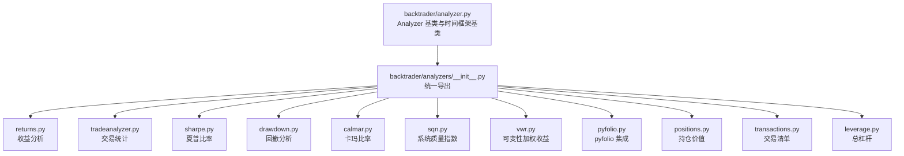

图表来源
- [analyzer.py](file://backtrader/analyzer.py#L89-L447)
- [analyzers/__init__.py](file://backtrader/analyzers/__init__.py#L27-L44)

章节来源
- [analyzer.py](file://backtrader/analyzer.py#L1-L447)
- [analyzers/__init__.py](file://backtrader/analyzers/__init__.py#L1-L44)

## 核心组件
- Analyzer 基类：定义分析器生命周期（start/next/prenext/nextstart/stop）、通知回调（notify_*）、结果容器（create_analysis/get_analysis）、打印输出（print/pprint），并支持父子分析器树形委托。
- TimeFrameAnalyzerBase：在 Analyzer 基础上按时间框架边界触发 on_dt_over，便于周期性统计。
- 内置分析器：覆盖收益、风险、交易统计、夏普比率、卡玛比率、系统质量指数、可变性加权收益、pyfolio 集成、持仓价值、交易清单、总杠杆等。

章节来源
- [analyzer.py](file://backtrader/analyzer.py#L89-L287)
- [analyzer.py](file://backtrader/analyzer.py#L299-L447)

## 架构总览
分析器通过 cerebro 注册后，在策略运行期间接收通知并累积统计数据。时间框架分析器在每个周期边界触发 on_dt_over 进行分段统计；复合分析器（如 PyFolio）组合多个子分析器以产出 pyfolio 兼容的数据集。

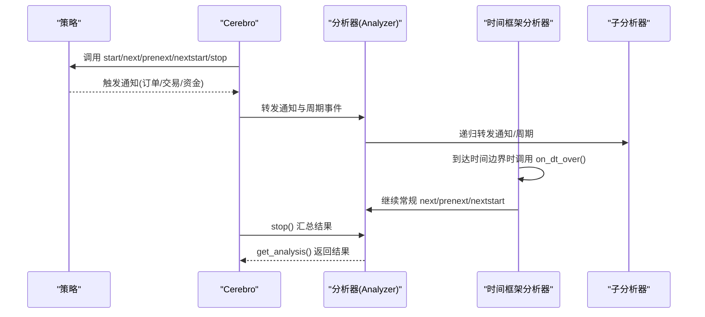

图表来源
- [analyzer.py](file://backtrader/analyzer.py#L148-L201)
- [analyzer.py](file://backtrader/analyzer.py#L315-L344)

## 详细组件分析

### Analyzer 基类与生命周期
- 生命周期方法：start/next/prenext/nextstart/stop，以及通知回调 notify_order/notify_trade/notify_cashvalue/notify_fund。
- 结果容器：默认使用有序字典，可通过 create_analysis 自定义容器类型。
- 打印输出：print 使用 WriterFile 输出到标准输出或文件；pprint 使用 pprint 美化打印。
- 子分析器树：父分析器会将通知与周期事件递归转发给子分析器，便于构建复合分析器。

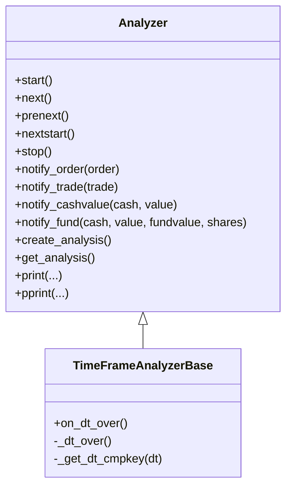

图表来源
- [analyzer.py](file://backtrader/analyzer.py#L89-L287)
- [analyzer.py](file://backtrader/analyzer.py#L299-L447)

章节来源
- [analyzer.py](file://backtrader/analyzer.py#L89-L287)
- [analyzer.py](file://backtrader/analyzer.py#L299-L447)

### 收益分析（Returns）
- 功能：基于对数收益率计算总复合收益、平均收益、年化/标准化收益。
- 参数：timeframe/compression（用于时间框架对齐）、tann（年度化系数自动映射）、fund（资金模式）。
- 计算：在 start 记录初始净值，在 stop 计算对数复合收益与平均收益，并按时间框架映射得到年化收益。

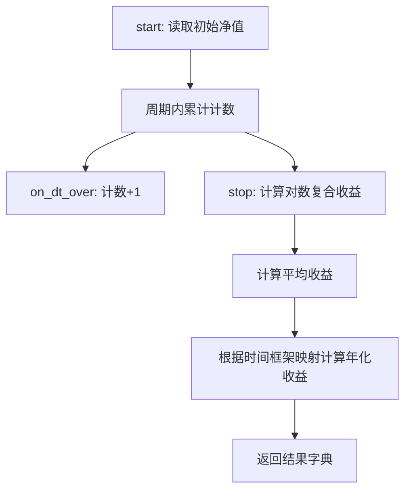

图表来源
- [returns.py](file://backtrader/analyzers/returns.py#L104-L156)

章节来源
- [returns.py](file://backtrader/analyzers/returns.py#L30-L156)

### 夏普比率（SharpeRatio 与 SharpeRatio_A）
- 功能：基于子分析器（TimeReturn 或 AnnualReturn）提供的回报序列，计算超额收益均值与标准差，得到夏普比率。
- 参数：timeframe/compression、riskfreerate、convertrate、factor、annualize、stddev_sample、legacyannual、fund。
- 计算：支持按时间框架换算无风险利率，支持样本标准差修正；可直接返回年化夏普比率。

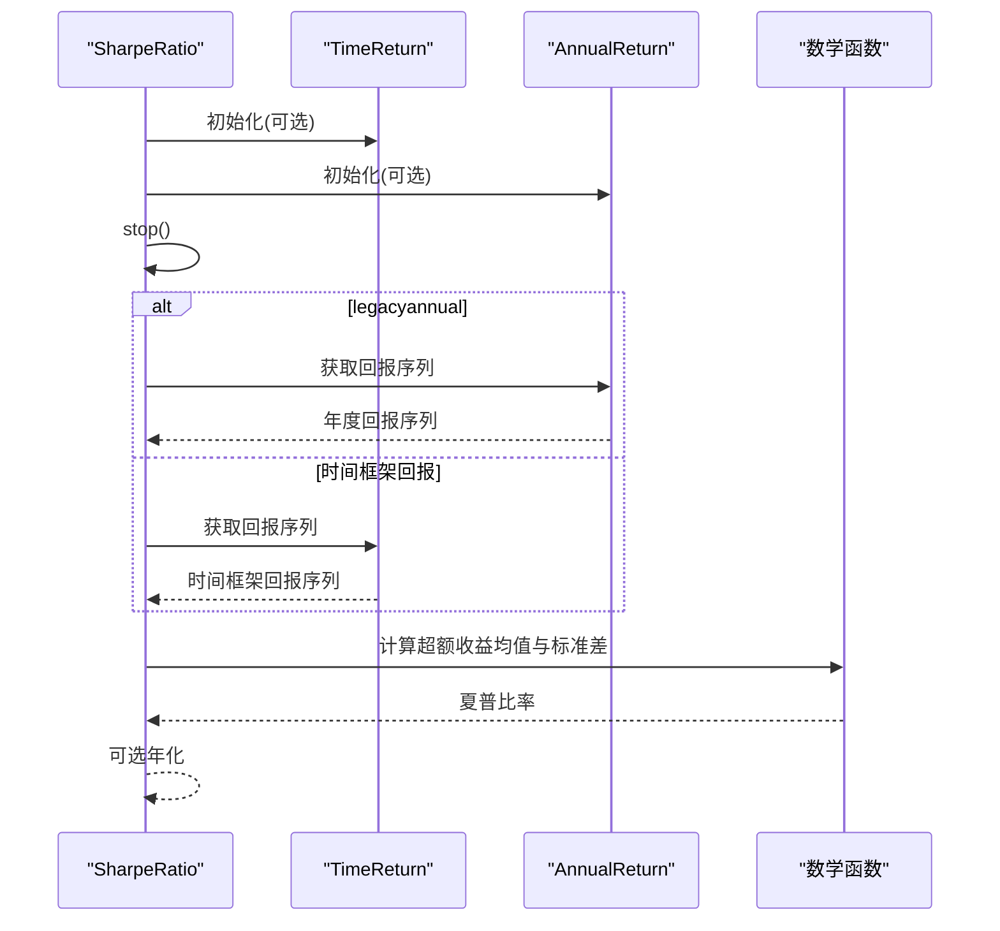

图表来源
- [sharpe.py](file://backtrader/analyzers/sharpe.py#L134-L207)

章节来源
- [sharpe.py](file://backtrader/analyzers/sharpe.py#L33-L222)

### 回撤分析（DrawDown 与 TimeDrawDown）
- 功能：计算当前与历史最大资金回撤（金额与百分比）、回撤长度及最长回撤长度。
- 参数：fund（资金模式）。
- DrawDown：基于每次资金通知更新峰值与回撤。
- TimeDrawDown：按时间框架边界触发，记录周期内的最大回撤与最长回撤期。

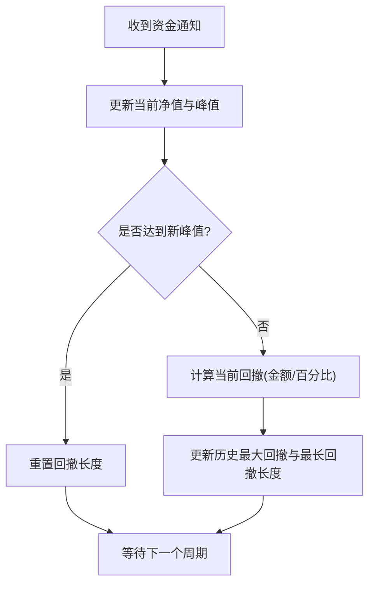

图表来源
- [drawdown.py](file://backtrader/analyzers/drawdown.py#L90-L111)

章节来源
- [drawdown.py](file://backtrader/analyzers/drawdown.py#L31-L198)

### 卡玛比率（Calmar）
- 功能：基于滚动期内对数值的对数平均回报与最大回撤计算卡玛比率。
- 参数：timeframe/compression、period（滚动期）、fund。
- 实现：内部复用 TimeDrawDown 获取最大回撤，结合对数平均回报与最大回撤计算比率。

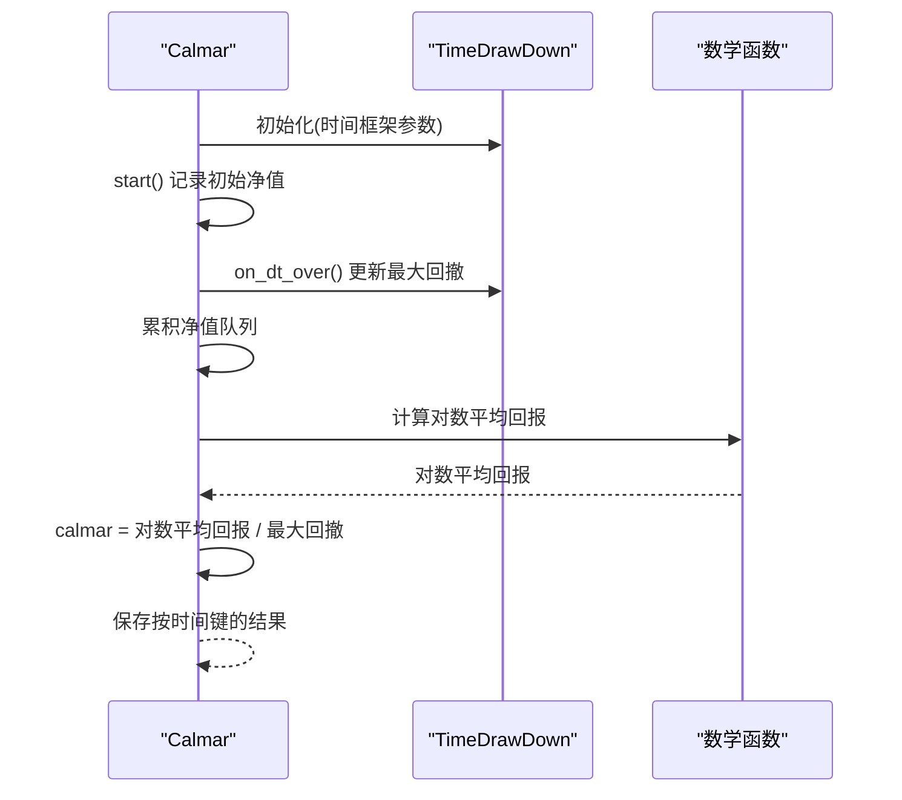

图表来源
- [calmar.py](file://backtrader/analyzers/calmar.py#L83-L114)

章节来源
- [calmar.py](file://backtrader/analyzers/calmar.py#L31-L114)

### 系统质量指数（SQN）
- 功能：基于交易净利润序列计算 SQN，衡量系统质量等级。
- 参数：无特殊参数，依赖交易通知。
- 计算：统计交易净利润的均值与标准差，按公式计算 SQN。

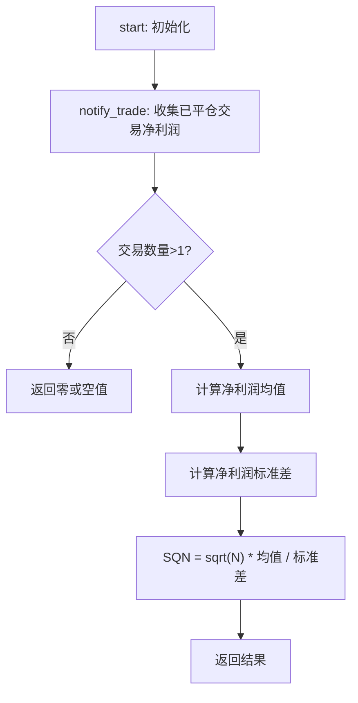

图表来源
- [sqn.py](file://backtrader/analyzers/sqn.py#L63-L86)

章节来源
- [sqn.py](file://backtrader/analyzers/sqn.py#L31-L86)

### 可变性加权收益（VWR）
- 功能：在对数收益基础上引入波动性惩罚项，得到更稳健的收益指标。
- 参数：timeframe/compression、tann、tau、sdev_max、fund。
- 实现：复用 Returns 子分析器获取平均收益与年化收益，结合周期内偏差序列的标准差计算 VWR。

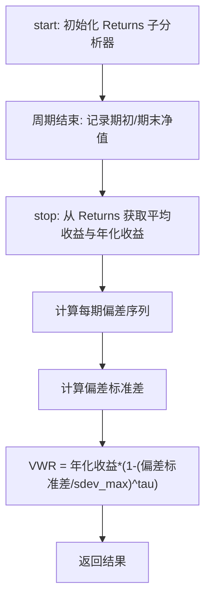

图表来源
- [vwr.py](file://backtrader/analyzers/vwr.py#L114-L171)

章节来源
- [vwr.py](file://backtrader/analyzers/vwr.py#L32-L174)

### 交易统计（TradeAnalyzer）
- 功能：统计总开仓/平仓次数、胜率/连败、总/平均/最大盈亏、多空分布、持有周期等。
- 数据结构：AutoOrderedDict，避免空统计字段。
- 实现：在 notify_trade 中按交易状态更新各类统计。

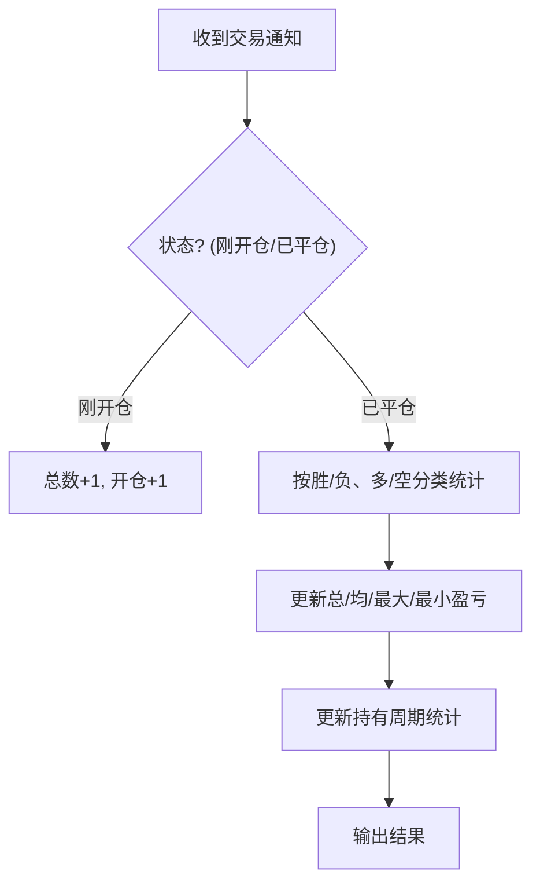

图表来源
- [tradeanalyzer.py](file://backtrader/analyzers/tradeanalyzer.py#L76-L209)

章节来源
- [tradeanalyzer.py](file://backtrader/analyzers/tradeanalyzer.py#L31-L209)

### pyfolio 集成（PyFolio）
- 功能：组合四个子分析器（TimeReturn、PositionsValue、Transactions、GrossLeverage），生成 pyfolio 兼容的 returns/positions/transactions/gross_lev 数据集。
- 方法：stop() 汇总子分析器结果；get_pf_items() 将内部结构转换为 pandas DataFrame，便于直接传入 pyfolio。

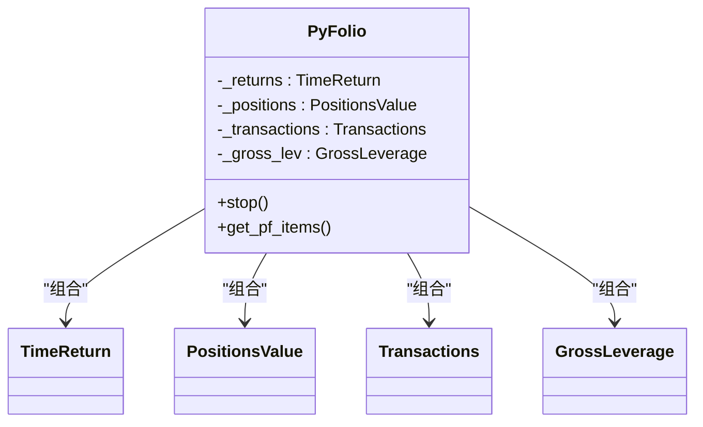

图表来源
- [pyfolio.py](file://backtrader/analyzers/pyfolio.py#L86-L101)

章节来源
- [pyfolio.py](file://backtrader/analyzers/pyfolio.py#L33-L164)

### 持仓价值（PositionsValue）
- 功能：按时间点记录各数据源的持仓价值，可选包含现金。
- 参数：headers（输出表头）、cash（包含现金）。
- 实现：next() 中收集各数据的价值与（可选）现金，按日期/时间写入结果。

章节来源
- [positions.py](file://backtrader/analyzers/positions.py#L28-L86)

### 交易清单（Transactions）
- 功能：记录每个周期发生的交易（size/price/sid/symbol/value）。
- 参数：headers（输出表头）、_pfheaders（pyfolio兼容字段名）。
- 实现：notify_order() 累积执行细节，next() 汇总并清空临时位置对象。

章节来源
- [transactions.py](file://backtrader/analyzers/transactions.py#L31-L104)

### 总杠杆（GrossLeverage）
- 功能：计算总杠杆（(总值-现金)/总值）。
- 参数：fund（资金模式）。
- 实现：notify_fund() 记录资金变化，next() 按周期计算并写入结果。

章节来源
- [leverage.py](file://backtrader/analyzers/leverage.py#L27-L72)

## 依赖关系分析
- Analyzer 与 TimeFrameAnalyzerBase：前者定义通用生命周期与通知机制，后者扩展时间框架边界触发能力。
- 复合分析器：PyFolio 组合多个子分析器；VWR 组合 Returns；Calmar 组合 TimeDrawDown。
- 示例脚本：samples/analyzer-annualreturn/analyzer-annualreturn.py 展示如何注册多个分析器并输出结果；samples/calmar/calmar-test.py 展示如何读取分析器结果。

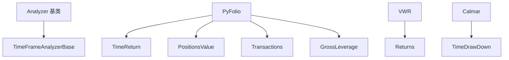

图表来源
- [analyzer.py](file://backtrader/analyzer.py#L89-L447)
- [pyfolio.py](file://backtrader/analyzers/pyfolio.py#L86-L101)
- [vwr.py](file://backtrader/analyzers/vwr.py#L114-L118)
- [calmar.py](file://backtrader/analyzers/calmar.py#L84-L85)

章节来源
- [analyzer.py](file://backtrader/analyzer.py#L89-L447)
- [pyfolio.py](file://backtrader/analyzers/pyfolio.py#L33-L164)
- [vwr.py](file://backtrader/analyzers/vwr.py#L32-L174)
- [calmar.py](file://backtrader/analyzers/calmar.py#L31-L114)

## 性能考虑
- 时间框架边界：TimeFrameAnalyzerBase 在周期边界触发 on_dt_over，避免在每个周期都做昂贵计算，适合滚动指标与分段统计。
- 子分析器组合：通过组合多个轻量子分析器减少重复遍历，提升整体效率。
- 数据结构：AutoOrderedDict/OrderedDict 降低空统计字段开销；必要时可自定义容器优化内存占用。
- 数学运算：尽量使用向量化/批量计算（如 average/standarddev），减少循环内重复计算。

## 故障排查指南
- 结果为空或为零
  - 检查 fund 模式参数是否与 broker 设置一致。
  - 确认策略未在 start/stop 前后立即退出导致统计不完整。
- 夏普比率异常
  - 检查 riskfreerate 与 convertrate/factor 是否匹配目标时间框架。
  - 确认 std::dev 样本数足够（至少2），避免除零错误。
- 回撤统计异常
  - 确认 notify_fund 是否被正确调用；检查 fund 模式与 broker 值类型。
- pyfolio 集成失败
  - 确保 pandas 已安装；检查 get_pf_items() 的索引与时区处理。
- SQN 值为零
  - 交易数量过少（<2）会导致无法计算；确保策略有足够交易。

章节来源
- [sharpe.py](file://backtrader/analyzers/sharpe.py#L182-L203)
- [drawdown.py](file://backtrader/analyzers/drawdown.py#L90-L111)
- [pyfolio.py](file://backtrader/analyzers/pyfolio.py#L115-L164)
- [sqn.py](file://backtrader/analyzers/sqn.py#L74-L86)

## 结论
Backtrader 的分析工具以 Analyzer 为核心，通过统一的生命周期与通知机制，实现了灵活的时间框架统计与复合分析。内置分析器覆盖收益、风险、交易统计、夏普比率、卡玛比率、系统质量指数、可变性加权收益、pyfolio 集成、持仓价值、交易清单与总杠杆等关键维度。通过合理配置参数与选择合适的时间框架，用户可在保证性能的前提下获得高质量的回测分析结果。

## 附录

### 使用示例与最佳实践
- 注册多个分析器：参考 samples/analyzer-annualreturn/analyzer-annualreturn.py，展示如何在 cerebro 中添加 SQN、TimeReturn、SharpeRatio、TradeAnalyzer，并输出到 WriterFile。
- 读取分析器结果：参考 samples/calmar/calmar-test.py，展示如何在策略结束后遍历分析器结果并打印。

章节来源
- [analyzer-annualreturn.py](file://samples/analyzer-annualreturn/analyzer-annualreturn.py#L160-L174)
- [analyzer-annualreturn.py](file://samples/analyzer-annualreturn/analyzer-annualreturn.py#L171-L174)
- [calmar-test.py](file://samples/calmar/calmar-test.py#L73-L78)