# 分析结果处理与可视化

<cite>
**本文引用的文件**
- [analyzer.py](file://backtrader/analyzer.py)
- [writer.py](file://backtrader/writer.py)
- [__init__.py（分析器包）](file://backtrader/analyzers/__init__.py)
- [returns.py](file://backtrader/analyzers/returns.py)
- [tradeanalyzer.py](file://backtrader/analyzers/tradeanalyzer.py)
- [pyfolio.py](file://backtrader/analyzers/pyfolio.py)
- [drawdown.py](file://backtrader/analyzers/drawdown.py)
- [sharpe.py](file://backtrader/analyzers/sharpe.py)
- [autodict.py](file://backtrader/utils/autodict.py)
- [cerebro.py](file://backtrader/cerebro.py)
- [analyzer-annualreturn.py](file://samples/analyzer-annualreturn/analyzer-annualreturn.py)
- [writer-test.py](file://samples/writer-test/writer-test.py)
</cite>

## 目录
1. [简介](#简介)
2. [项目结构](#项目结构)
3. [核心组件](#核心组件)
4. [架构总览](#架构总览)
5. [详细组件分析](#详细组件分析)
6. [依赖关系分析](#依赖关系分析)
7. [性能考量](#性能考量)
8. [故障排查指南](#故障排查指南)
9. [结论](#结论)
10. [附录](#附录)

## 简介
本文件系统性阐述 Backtrader 中“分析结果处理与可视化”的完整流程，覆盖以下主题：
- 分析器结果的获取与格式化：get_analysis() 的使用、结果数据结构、序列化与持久化思路
- 结果输出功能：print()/pprint() 的调用方式、WriterFile 的配置与定制、CSV 导出
- 与其他工具集成：pandas 数据处理、matplotlib 图表绘制、Excel 文件生成
- 可视化方法与技巧：性能曲线、风险指标、收益分布等
- 比较与报告最佳实践：多策略对比、时间段对比、统计摘要

## 项目结构
围绕分析结果处理与可视化的关键目录与文件：
- backtrader/analyzer.py：分析器基类与时间框架分析器基类，定义 get_analysis()、print()/pprint() 等通用能力
- backtrader/writer.py：统一的 WriterFile/WriterStringIO 输出设施，支持文本与 CSV 输出
- backtrader/analyzers/*：内置分析器集合，如 Returns、TradeAnalyzer、SharpeRatio、DrawDown、PyFolio 等
- backtrader/utils/autodict.py：AutoOrderedDict/AutoDict 支持动态嵌套字典与点式访问
- samples/*：示例脚本展示分析器与 WriterFile 的组合使用

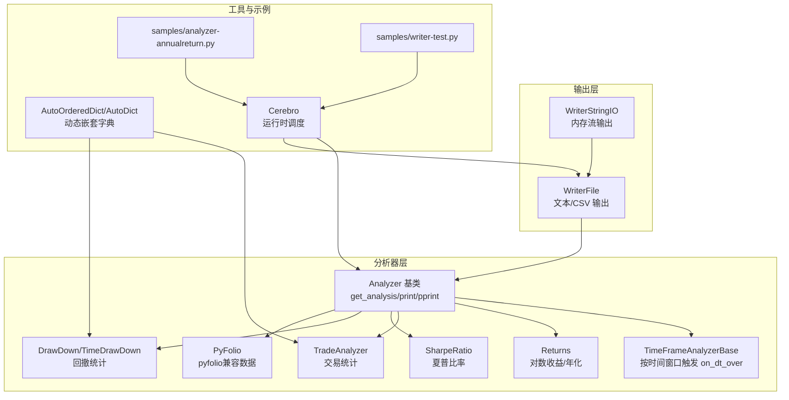

**图表来源**
- [analyzer.py](file://backtrader/analyzer.py#L89-L287)
- [writer.py](file://backtrader/writer.py#L43-L235)
- [returns.py](file://backtrader/analyzers/returns.py#L30-L156)
- [tradeanalyzer.py](file://backtrader/analyzers/tradeanalyzer.py#L31-L209)
- [sharpe.py](file://backtrader/analyzers/sharpe.py#L33-L222)
- [drawdown.py](file://backtrader/analyzers/drawdown.py#L31-L198)
- [pyfolio.py](file://backtrader/analyzers/pyfolio.py#L33-L164)
- [autodict.py](file://backtrader/utils/autodict.py#L47-L146)
- [cerebro.py](file://backtrader/cerebro.py#L60-L200)
- [analyzer-annualreturn.py](file://samples/analyzer-annualreturn/analyzer-annualreturn.py#L120-L174)
- [writer-test.py](file://samples/writer-test/writer-test.py#L119-L158)

**章节来源**
- [analyzer.py](file://backtrader/analyzer.py#L89-L287)
- [writer.py](file://backtrader/writer.py#L43-L235)
- [__init__.py（分析器包）](file://backtrader/analyzers/__init__.py#L24-L44)

## 核心组件
- Analyzer 基类
  - 提供 get_analysis() 返回分析结果（默认返回内部有序字典）
  - 提供 print()/pprint() 将结果写入标准输出或文件
  - 生命周期钩子：start/stop、prenext/next/nextstart、notify_* 等
- TimeFrameAnalyzerBase
  - 基于时间框架的分析器基类，通过 on_dt_over() 在时间边界触发计算
- WriterFile/WriterStringIO
  - 统一的文本与 CSV 输出设施，支持分隔符、缩进、舍入、计数器等参数
- AutoOrderedDict/AutoDict
  - 动态嵌套字典，支持点式访问与自动键创建，stop() 后可关闭以防止新增键

**章节来源**
- [analyzer.py](file://backtrader/analyzer.py#L89-L287)
- [writer.py](file://backtrader/writer.py#L43-L235)
- [autodict.py](file://backtrader/utils/autodict.py#L47-L146)

## 架构总览
Backtrader 的分析结果处理与可视化遵循“分析器产生结果 → Writer 输出 → 外部工具消费”的分层架构。

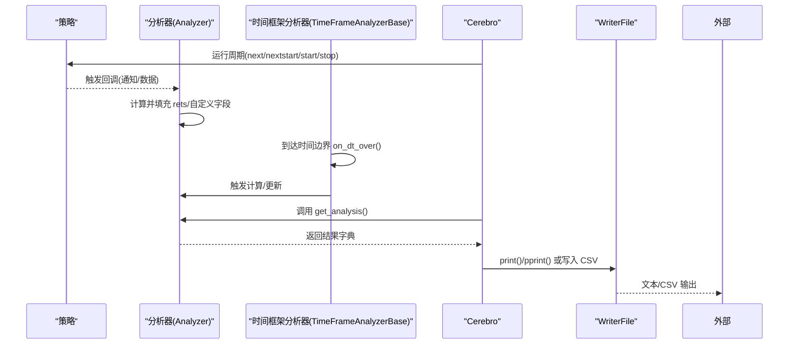

**图表来源**
- [analyzer.py](file://backtrader/analyzer.py#L148-L287)
- [writer.py](file://backtrader/writer.py#L108-L235)
- [cerebro.py](file://backtrader/cerebro.py#L60-L200)

## 详细组件分析

### 分析器基类与结果数据结构
- get_analysis() 默认返回内部有序字典 rets；子类可重写以返回任意 dict-like 对象
- create_analysis() 创建 rets，默认为 OrderedDict；部分分析器使用 AutoOrderedDict/AutoDict 实现更丰富的嵌套结构
- print()/pprint() 使用 WriterFile 写出结果；pprint() 使用 Python 标准库进行美化打印

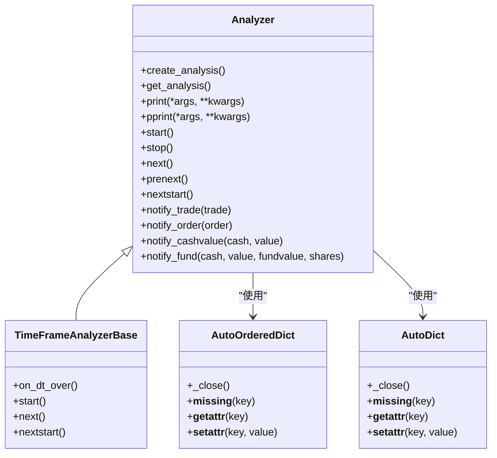

**图表来源**
- [analyzer.py](file://backtrader/analyzer.py#L89-L287)
- [autodict.py](file://backtrader/utils/autodict.py#L47-L146)

**章节来源**
- [analyzer.py](file://backtrader/analyzer.py#L247-L287)
- [autodict.py](file://backtrader/utils/autodict.py#L47-L146)

### Returns：对数收益与年化
- 计算复合回报、平均回报、年化回报，并支持资金模式（总净值 vs 基金值）
- 时间框架参数用于确定年化因子与时间边界
- stop() 阶段汇总统计并写入 rets

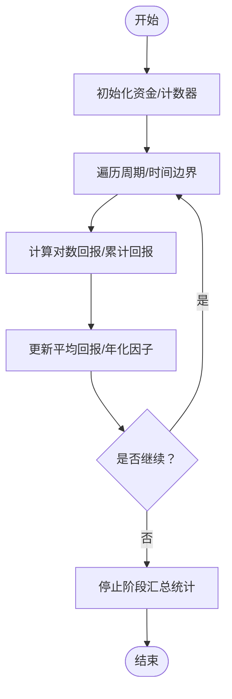

**图表来源**
- [returns.py](file://backtrader/analyzers/returns.py#L104-L156)

**章节来源**
- [returns.py](file://backtrader/analyzers/returns.py#L30-L156)

### TradeAnalyzer：交易统计
- 统计开平仓次数、胜率/连败、净利/毛利、长短仓分布、持有周期等
- 使用 AutoOrderedDict 自动构建嵌套结构，stop() 关闭后不再新增键

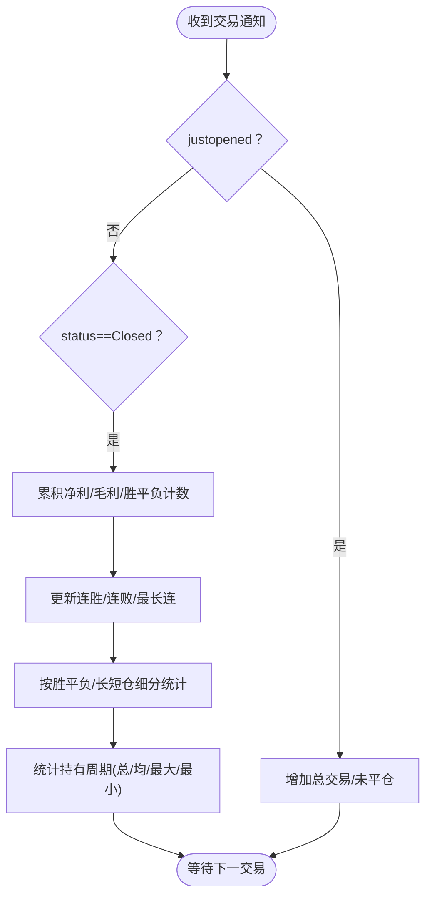

**图表来源**
- [tradeanalyzer.py](file://backtrader/analyzers/tradeanalyzer.py#L76-L209)

**章节来源**
- [tradeanalyzer.py](file://backtrader/analyzers/tradeanalyzer.py#L31-L209)

### SharpeRatio：夏普比率
- 支持传统 AnnualReturn 或基于 TimeReturn 的多时间框架计算
- 可配置无风险利率、转换因子、样本标准差修正、是否年化等

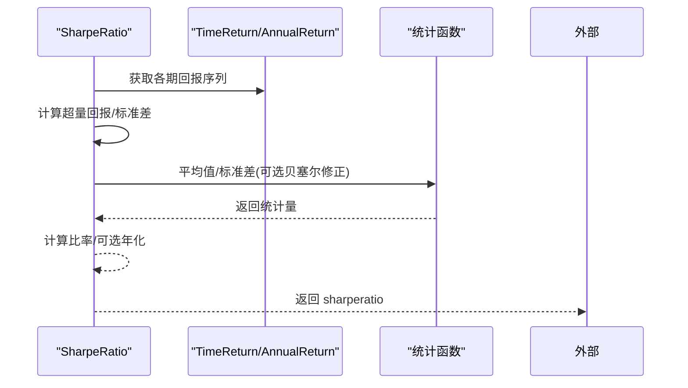

**图表来源**
- [sharpe.py](file://backtrader/analyzers/sharpe.py#L134-L207)

**章节来源**
- [sharpe.py](file://backtrader/analyzers/sharpe.py#L33-L222)

### DrawDown/TimeDrawDown：回撤统计
- 支持按资金模式（总净值/基金值）计算回撤百分比、金额、持续长度
- TimeDrawDown 在时间边界触发，记录最大回撤与最大回撤期

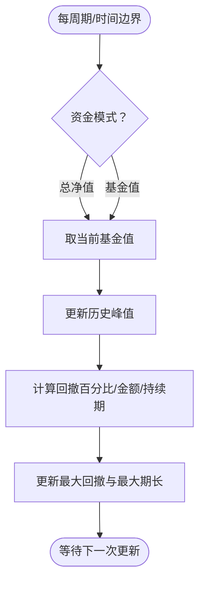

**图表来源**
- [drawdown.py](file://backtrader/analyzers/drawdown.py#L90-L198)

**章节来源**
- [drawdown.py](file://backtrader/analyzers/drawdown.py#L31-L198)

### PyFolio：与 PyFolio 兼容的数据
- 聚合四个子分析器：TimeReturn、PositionsValue、Transactions、GrossLeverage
- 提供 get_pf_items() 将内部结构转换为 pandas DataFrame，便于 pyfolio 分析

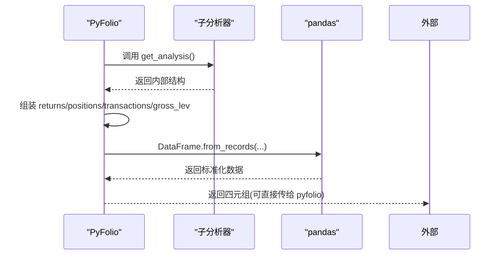

**图表来源**
- [pyfolio.py](file://backtrader/analyzers/pyfolio.py#L95-L164)

**章节来源**
- [pyfolio.py](file://backtrader/analyzers/pyfolio.py#L33-L164)

### WriterFile：结果输出与 CSV 导出
- WriterFile 支持输出到文件/流、CSV 表头与值、NaN 过滤、计数器、缩进与分隔符、数值舍入
- print()/pprint() 通过 WriterFile 将分析器结果以结构化文本或美化形式输出

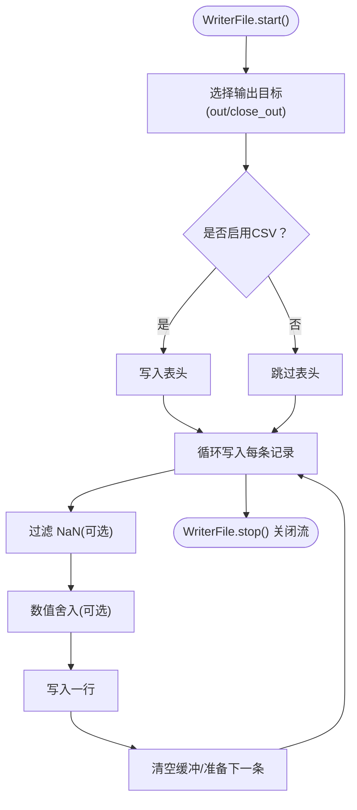

**图表来源**
- [writer.py](file://backtrader/writer.py#L108-L164)

**章节来源**
- [writer.py](file://backtrader/writer.py#L43-L235)

### 示例：分析器与 WriterFile 的组合使用
- analyzer-annualreturn.py 展示了添加多个分析器（SQN、TimeReturn、SharpeRatio、TradeAnalyzer）与 WriterFile 的用法
- writer-test.py 展示了 WriterFile 的 CSV 输出配置

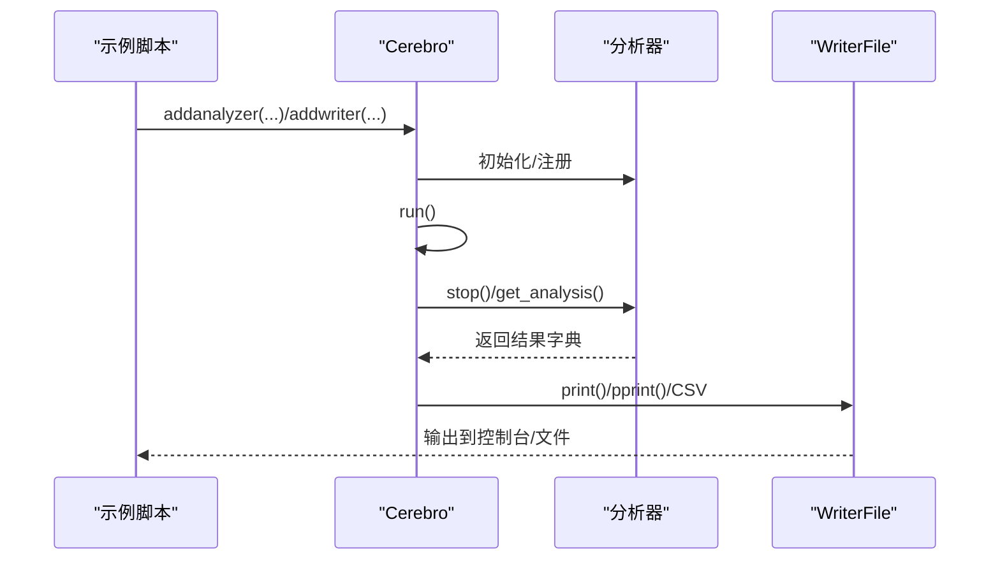

**图表来源**
- [analyzer-annualreturn.py](file://samples/analyzer-annualreturn/analyzer-annualreturn.py#L160-L174)
- [writer-test.py](file://samples/writer-test/writer-test.py#L153-L156)

**章节来源**
- [analyzer-annualreturn.py](file://samples/analyzer-annualreturn/analyzer-annualreturn.py#L120-L174)
- [writer-test.py](file://samples/writer-test/writer-test.py#L119-L158)

## 依赖关系分析
- 分析器与工具
  - Analyzer 依赖 AutoOrderedDict/AutoDict 构建嵌套结构
  - TimeFrameAnalyzerBase 依赖策略时间轴，通过 on_dt_over() 触发
  - SharpeRatio 依赖 TimeReturn 或 AnnualReturn 子分析器
  - PyFolio 聚合多个子分析器并转换为 pandas DataFrame
- 输出与运行时
  - Cerebro 负责运行与调度分析器生命周期
  - WriterFile/WriterStringIO 作为统一输出设施

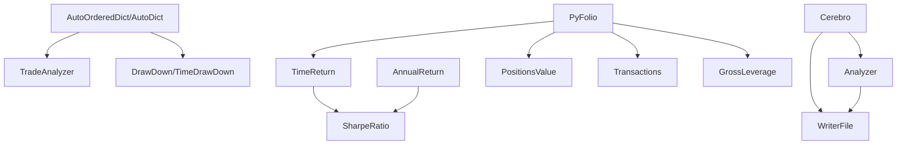

**图表来源**
- [autodict.py](file://backtrader/utils/autodict.py#L47-L146)
- [tradeanalyzer.py](file://backtrader/analyzers/tradeanalyzer.py#L68-L75)
- [drawdown.py](file://backtrader/analyzers/drawdown.py#L74-L89)
- [sharpe.py](file://backtrader/analyzers/sharpe.py#L134-L142)
- [pyfolio.py](file://backtrader/analyzers/pyfolio.py#L86-L94)
- [cerebro.py](file://backtrader/cerebro.py#L60-L200)
- [writer.py](file://backtrader/writer.py#L43-L106)

**章节来源**
- [sharpe.py](file://backtrader/analyzers/sharpe.py#L134-L142)
- [pyfolio.py](file://backtrader/analyzers/pyfolio.py#L86-L101)
- [cerebro.py](file://backtrader/cerebro.py#L60-L200)

## 性能考量
- 计算复杂度
  - Returns/SharpeRatio：线性遍历周期，时间复杂度 O(N)，空间复杂度 O(1) 或 O(N)（取决于时间框架粒度）
  - TradeAnalyzer：事件驱动，按交易数量累积统计，时间复杂度 O(T)
  - DrawDown：单次扫描，时间复杂度 O(N)
- 内存占用
  - AutoOrderedDict/AutoDict 在 stop() 后关闭可避免动态增长
  - TimeFrameAnalyzerBase 在时间边界触发，减少不必要的中间状态保存
- I/O 优化
  - WriterFile 支持批量写入与 CSV 计数器，降低频繁 I/O 开销
  - WriterStringIO 可在内存中收集后再一次性写出，适合批量导出

[本节为通用指导，不直接分析具体文件]

## 故障排查指南
- get_analysis() 返回为空
  - 检查分析器是否正确在 stop() 阶段写入 rets
  - 确认分析器是否被正确添加到 Cerebro
- 输出异常或乱码
  - 检查 WriterFile 的 out/close_out 参数，确保输出流正确打开/关闭
  - 设置 csv_filternan 与 rounding 参数以适配下游工具
- pandas/pyfolio 集成失败
  - 确保已安装 pandas；PyFolio 的 get_pf_items() 会本地导入 pandas
  - 检查索引类型与时区设置，确保与 pyfolio 输入格式一致

**章节来源**
- [writer.py](file://backtrader/writer.py#L108-L164)
- [pyfolio.py](file://backtrader/analyzers/pyfolio.py#L102-L164)

## 结论
Backtrader 的分析结果处理与可视化体系以 Analyzer 为核心，结合时间框架触发机制与统一的 Writer 输出设施，形成从“计算—格式化—导出”的完整链路。通过 AutoOrderedDict/AutoDict 的嵌套结构与 PyFolio 的 pandas 兼容接口，用户可以轻松对接多种下游工具，完成性能曲线、风险指标与收益分布等可视化任务，并支持多策略、多时间段的对比与报告生成。

[本节为总结，不直接分析具体文件]

## 附录

### 分析结果数据结构与序列化要点
- 数据结构
  - 默认：OrderedDict；部分分析器使用 AutoOrderedDict/AutoDict 支持自动嵌套与点式访问
  - 嵌套结构在 stop() 后可通过 _close() 锁定，防止后续写入
- 序列化与持久化
  - 使用 get_analysis() 获取字典对象，可进一步序列化为 JSON/CSV
  - WriterFile 支持 CSV 输出，便于 Excel/数据库导入
  - WriterStringIO 可在内存中收集输出，便于二次处理

**章节来源**
- [analyzer.py](file://backtrader/analyzer.py#L247-L268)
- [autodict.py](file://backtrader/utils/autodict.py#L80-L146)
- [writer.py](file://backtrader/writer.py#L108-L164)

### 结果输出与 WriterFile 定制
- 常用参数
  - out/close_out：输出目标与关闭策略
  - csv/csvsep/csv_filternan/csv_counter：CSV 控制
  - indent/separators/seplen：文本分隔与排版
  - rounding：数值舍入
- 使用建议
  - 批量导出时优先使用 WriterStringIO 收集，再一次性写出
  - 导出到文件时设置 close_out=True，确保资源释放

**章节来源**
- [writer.py](file://backtrader/writer.py#L93-L106)
- [writer.py](file://backtrader/writer.py#L108-L164)

### 与 pandas/matplotlib/Excel 的集成
- pandas
  - 使用 PyFolio 的 get_pf_items() 将内部结构转换为 pandas DataFrame
  - 注意索引的日期格式与时区（UTC），便于后续分析
- matplotlib
  - 将 returns/positions 等转换为 Series/DataFrame 后绘图
  - 可叠加回测观察者（如 DrawDown）进行可视化对比
- Excel
  - WriterFile 直接输出 CSV，再由 Excel 导入
  - 或使用 pandas ExcelWriter 导出多工作表报告

**章节来源**
- [pyfolio.py](file://backtrader/analyzers/pyfolio.py#L102-L164)

### 可视化方法与技巧
- 性能曲线
  - 使用 Returns/TimeReturn 的日度回报序列绘制净值曲线
- 风险指标
  - DrawDown/TimeDrawDown 的最大回撤与持续期用于风险评估
- 收益分布
  - TradeAnalyzer 的净利分布直方图/箱线图
- 多策略对比
  - 通过 Cerebro 的多实例或多进程运行，分别输出 CSV，再合并对比
- 报告生成
  - 使用 WriterFile 输出摘要，结合 pandas 统计描述生成报告模板

**章节来源**
- [returns.py](file://backtrader/analyzers/returns.py#L154-L156)
- [drawdown.py](file://backtrader/analyzers/drawdown.py#L195-L198)
- [tradeanalyzer.py](file://backtrader/analyzers/tradeanalyzer.py#L209-L209)