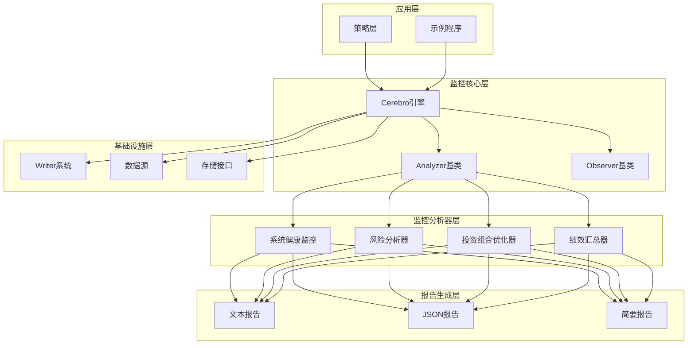
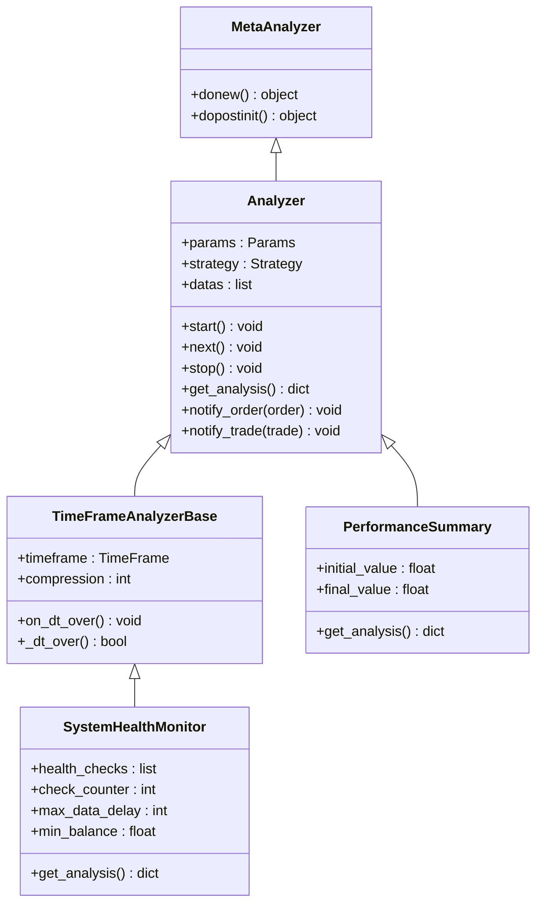
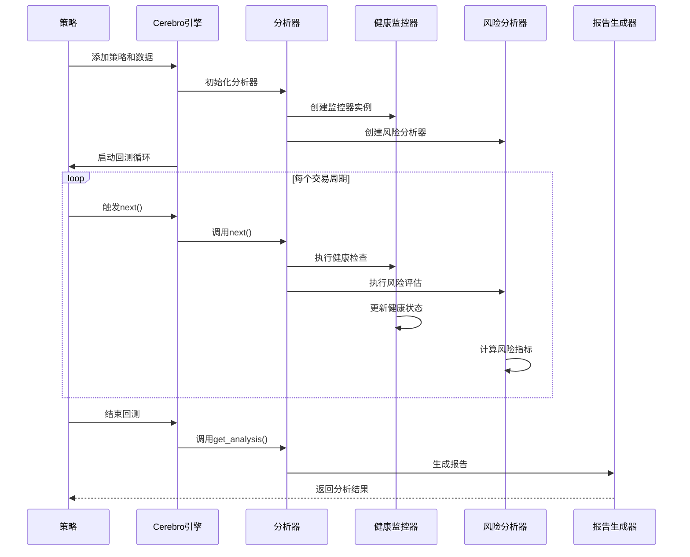
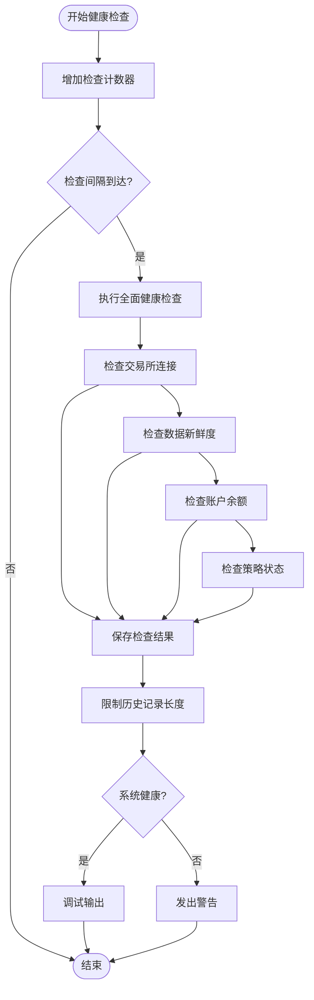
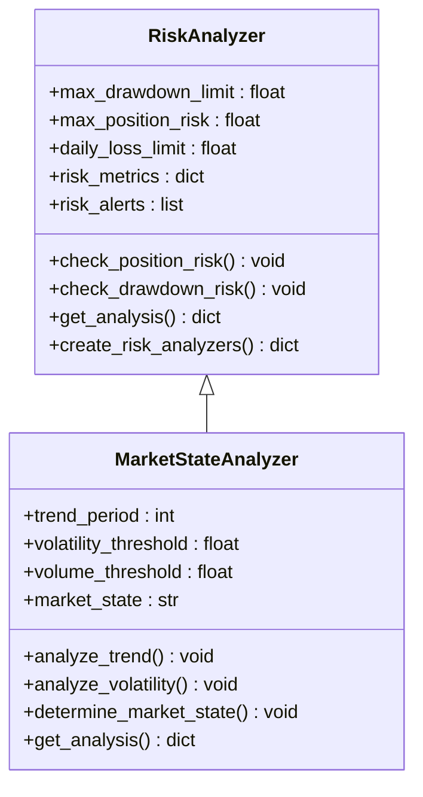
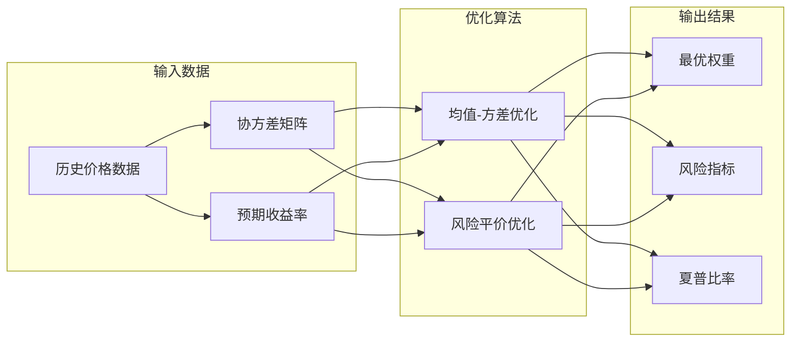
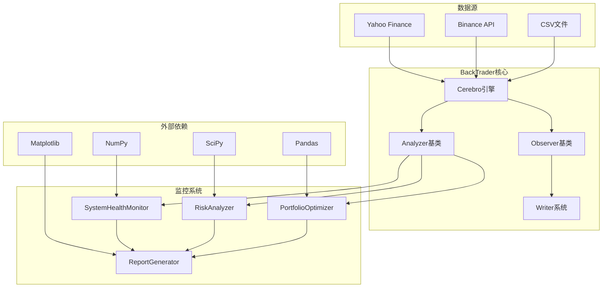

# 监控系统

<cite>
**本文档引用的文件**
- [backtrader/__init__.py](file://backtrader/__init__.py)
- [backtrader/cerebro.py](file://backtrader/cerebro.py)
- [backtrader/analyzer.py](file://backtrader/analyzer.py)
- [backtrader/observer.py](file://backtrader/observer.py)
- [backtrader/writer.py](file://backtrader/writer.py)
- [backtrader/analyzers/monitoring.py](file://backtrader/analyzers/monitoring.py)
- [backtrader/analyzers/__init__.py](file://backtrader/analyzers/__init__.py)
- [backtrader/observers/__init__.py](file://backtrader/observers/__init__.py)
- [backtrader/observers/broker.py](file://backtrader/observers/broker.py)
- [backtrader/observers/trades.py](file://backtrader/observers/trades.py)
- [backtrader/observers/buysell.py](file://backtrader/observers/buysell.py)
- [backtrader/analyzers/risk_analyzer.py](file://backtrader/analyzers/risk_analyzer.py)
- [backtrader/analyzers/portfolio_optimizer.py](file://backtrader/analyzers/portfolio_optimizer.py)
- [samples/monitoring-demo/monitoring_demo.py](file://samples/monitoring-demo/monitoring_demo.py)
- [examples/binance_example.py](file://examples/binance_example.py)
</cite>

## 目录
1. [简介](#简介)
2. [项目结构](#项目结构)
3. [核心组件](#核心组件)
4. [架构概览](#架构概览)
5. [详细组件分析](#详细组件分析)
6. [依赖关系分析](#依赖关系分析)
7. [性能考虑](#性能考虑)
8. [故障排除指南](#故障排除指南)
9. [结论](#结论)

## 简介

BackTrader监控系统是一个基于现有backtrader框架构建的完整监控解决方案。该系统通过Analyzer机制无缝集成，提供实时系统健康监控、风险分析、投资组合优化和多格式报告生成功能。

系统的核心特点包括：
- **非侵入式设计**：完全基于Analyzer机制，无需修改框架核心代码
- **模块化架构**：支持独立的功能模块和组合使用
- **实时监控**：提供周期性的系统状态检查和风险评估
- **多维度分析**：涵盖财务、技术、风险等多个层面的监控指标
- **灵活扩展**：支持自定义监控指标和分析器

## 项目结构

BackTrader监控系统采用分层架构设计，主要包含以下层次：

**图表来源**
- [backtrader/cerebro.py](file://backtrader/cerebro.py#L60-L800)
- [backtrader/analyzer.py](file://backtrader/analyzer.py#L89-L287)
- [backtrader/observer.py](file://backtrader/observer.py#L46-L69)

**章节来源**
- [backtrader/__init__.py](file://backtrader/__init__.py#L24-L91)
- [backtrader/cerebro.py](file://backtrader/cerebro.py#L296-L320)

## 核心组件

### Analyzer基础架构

Analyzer是整个监控系统的核心抽象基类，提供了统一的生命周期管理和事件通知机制：

**图表来源**
- [backtrader/analyzer.py](file://backtrader/analyzer.py#L89-L287)
- [backtrader/analyzers/monitoring.py](file://backtrader/analyzers/monitoring.py#L18-L245)

### 监控分析器体系

系统包含三个主要的监控分析器：

1. **SystemHealthMonitor**：系统健康状态监控
2. **PerformanceSummary**：绩效指标汇总
3. **RiskAnalyzer**：风险控制和管理

**章节来源**
- [backtrader/analyzers/monitoring.py](file://backtrader/analyzers/monitoring.py#L18-L423)
- [backtrader/analyzers/risk_analyzer.py](file://backtrader/analyzers/risk_analyzer.py#L13-L280)

## 架构概览

监控系统的整体架构遵循backtrader的设计原则，通过Analyzer机制实现松耦合的监控功能集成：

**图表来源**
- [backtrader/cerebro.py](file://backtrader/cerebro.py#L120-L200)
- [backtrader/analyzer.py](file://backtrader/analyzer.py#L184-L201)
- [backtrader/analyzers/monitoring.py](file://backtrader/analyzers/monitoring.py#L44-L95)

## 详细组件分析

### 系统健康监控器

SystemHealthMonitor是监控系统的核心组件，负责实时检查系统的各个方面：

**图表来源**
- [backtrader/analyzers/monitoring.py](file://backtrader/analyzers/monitoring.py#L44-L95)
- [backtrader/analyzers/monitoring.py](file://backtrader/analyzers/monitoring.py#L210-L244)

#### 健康检查维度

系统健康监控器提供四个主要的检查维度：

1. **连接状态检查**：验证与交易所的数据连接
2. **数据新鲜度检查**：确保数据流的实时性
3. **财务状况检查**：监控账户余额和资金安全
4. **策略状态检查**：跟踪未完成订单和持仓情况

**章节来源**
- [backtrader/analyzers/monitoring.py](file://backtrader/analyzers/monitoring.py#L52-L208)

### 风险分析器

RiskAnalyzer实现了全面的风险管理系统，集成了多种风险控制机制：

**图表来源**
- [backtrader/analyzers/risk_analyzer.py](file://backtrader/analyzers/risk_analyzer.py#L13-L280)
- [backtrader/analyzers/risk_analyzer.py](file://backtrader/analyzers/risk_analyzer.py#L282-L412)

#### 风险控制机制

系统实现了多层次的风险控制：

1. **持仓风险控制**：监控总持仓占总资产的比例
2. **回撤风险控制**：跟踪最大回撤和当前回撤
3. **市场状态分析**：识别市场趋势和异常条件
4. **自动风险警报**：通过标准通知机制发出风险警告

**章节来源**
- [backtrader/analyzers/risk_analyzer.py](file://backtrader/analyzers/risk_analyzer.py#L69-L175)
- [backtrader/analyzers/risk_analyzer.py](file://backtrader/analyzers/risk_analyzer.py#L282-L386)

### 投资组合优化器

PortfolioOptimizer提供了先进的投资组合管理功能：

**图表来源**
- [backtrader/analyzers/portfolio_optimizer.py](file://backtrader/analyzers/portfolio_optimizer.py#L30-L242)
- [backtrader/analyzers/portfolio_optimizer.py](file://backtrader/analyzers/portfolio_optimizer.py#L275-L491)

#### 优化策略

系统支持两种主要的投资组合优化策略：

1. **均值-方差优化**：基于Markowitz现代投资组合理论
2. **风险平价优化**：使每个资产对组合风险的贡献相等

**章节来源**
- [backtrader/analyzers/portfolio_optimizer.py](file://backtrader/analyzers/portfolio_optimizer.py#L138-L242)
- [backtrader/analyzers/portfolio_optimizer.py](file://backtrader/analyzers/portfolio_optimizer.py#L309-L491)

### 报告生成系统

ReportGenerator提供了多种格式的报告生成功能：

| 报告类型 | 输出格式 | 主要用途 |
|---------|---------|----------|
| 文本报告 | 纯文本 | 详细分析结果展示 |
| JSON报告 | 结构化数据 | 系统集成和API调用 |
| 简要报告 | 精简信息 | 快速概览和监控 |

**章节来源**
- [backtrader/analyzers/monitoring.py](file://backtrader/analyzers/monitoring.py#L279-L374)

## 依赖关系分析

监控系统的依赖关系体现了清晰的分层架构：

**图表来源**
- [backtrader/analyzers/portfolio_optimizer.py](file://backtrader/analyzers/portfolio_optimizer.py#L14-L17)
- [backtrader/analyzers/monitoring.py](file://backtrader/analyzers/monitoring.py#L15-L16)

**章节来源**
- [backtrader/analyzers/__init__.py](file://backtrader/analyzers/__init__.py#L44-L47)
- [backtrader/observers/__init__.py](file://backtrader/observers/__init__.py#L27-L35)

## 性能考虑

监控系统的性能优化主要体现在以下几个方面：

### 内存管理
- **历史数据限制**：系统健康监控器限制历史检查记录为100条
- **分析结果缓存**：投资组合优化器缓存历史权重数据
- **对象复用**：Analyzer机制减少对象创建开销

### 计算效率
- **周期性检查**：通过check_interval参数控制检查频率
- **增量计算**：只在必要时重新计算风险指标
- **向量化操作**：使用NumPy进行高效的数值计算

### 内存优化策略
- **精确栏位**：使用exactbars参数优化内存使用
- **数据预加载**：通过preload参数提高数据访问速度
- **对象缓存**：启用objcache减少重复对象创建

**章节来源**
- [backtrader/cerebro.py](file://backtrader/cerebro.py#L121-L177)
- [backtrader/analyzers/monitoring.py](file://backtrader/analyzers/monitoring.py#L88-L91)

## 故障排除指南

### 常见问题及解决方案

#### 1. 监控器初始化失败
**症状**：SystemHealthMonitor无法正常启动
**原因**：参数配置错误或依赖服务不可用
**解决方案**：
- 检查max_data_delay和min_balance参数设置
- 验证数据源连接状态
- 确认_debug参数设置

#### 2. 风险分析器报警频繁
**症状**：RiskAnalyzer频繁发出风险警告
**原因**：风险阈值设置过于严格
**解决方案**：
- 调整max_drawdown_limit参数
- 适当提高max_position_risk阈值
- 检查市场波动性变化

#### 3. 报告生成异常
**症状**：ReportGenerator抛出异常
**原因**：分析器结果格式不正确
**解决方案**：
- 检查各分析器的get_analysis()实现
- 验证数据完整性
- 确认JSON序列化支持

#### 4. 性能问题
**症状**：监控系统影响回测性能
**原因**：检查频率过高或数据量过大
**解决方案**：
- 增加check_interval参数值
- 启用exactbars优化
- 减少同时运行的分析器数量

**章节来源**
- [backtrader/analyzers/monitoring.py](file://backtrader/analyzers/monitoring.py#L215-L222)
- [backtrader/analyzers/risk_analyzer.py](file://backtrader/analyzers/risk_analyzer.py#L117-L118)

## 结论

BackTrader监控系统通过其精心设计的架构和丰富的功能特性，为量化交易提供了全面的监控解决方案。系统的主要优势包括：

### 技术优势
- **模块化设计**：基于Analyzer机制，易于扩展和维护
- **实时监控**：提供周期性的系统状态检查和风险评估
- **多维度分析**：涵盖财务、技术、风险等多个层面
- **灵活配置**：支持参数化配置和动态调整

### 应用价值
- **风险管理**：通过风险分析器提供主动的风险控制
- **性能监控**：实时跟踪系统健康状态和性能指标
- **决策支持**：提供多格式的分析报告辅助决策
- **成本效益**：非侵入式设计，无需修改核心框架

### 发展前景
随着量化交易复杂性的增加，监控系统将继续演进，可能的发展方向包括：
- 更智能的风险预测模型
- 实时预警和自动化响应机制
- 更丰富的可视化和报告功能
- 与其他交易系统的深度集成

该监控系统为BackTrader用户提供了强大的工具，帮助他们在复杂的金融市场环境中做出更好的投资决策。