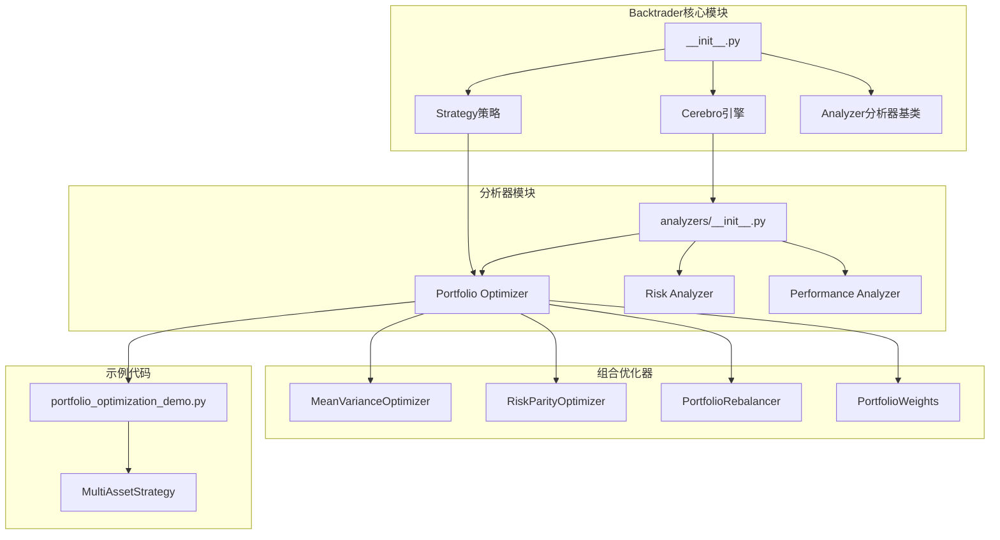
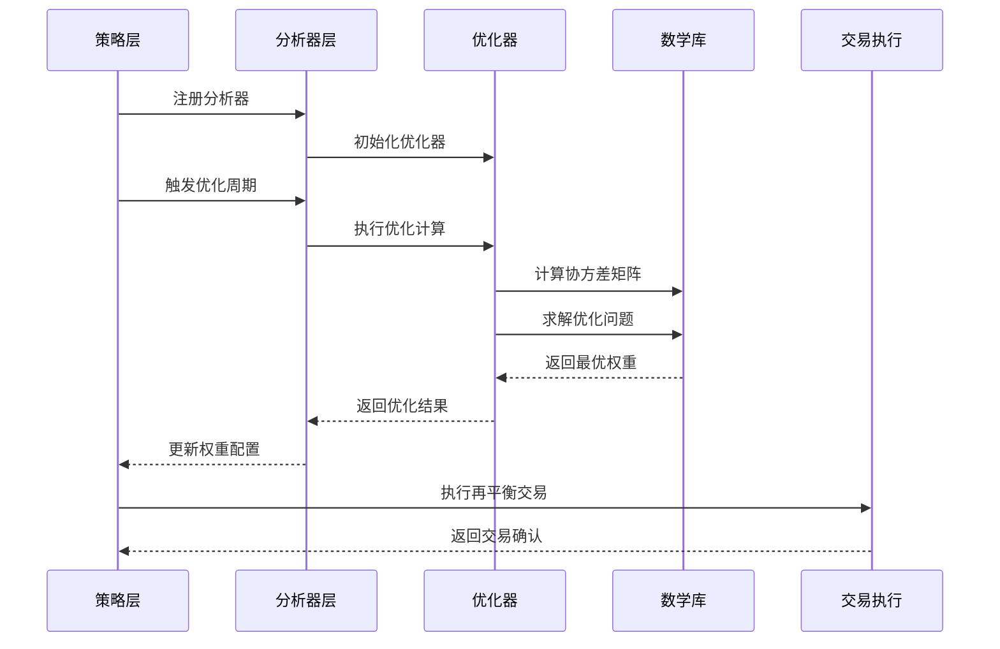
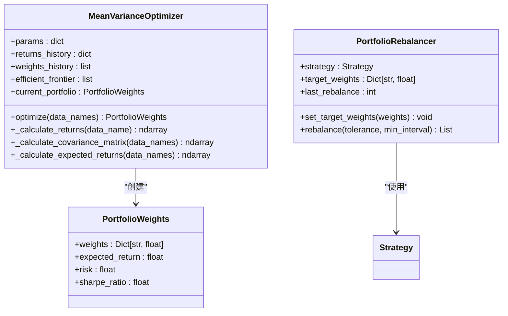
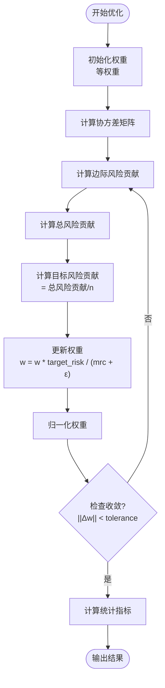
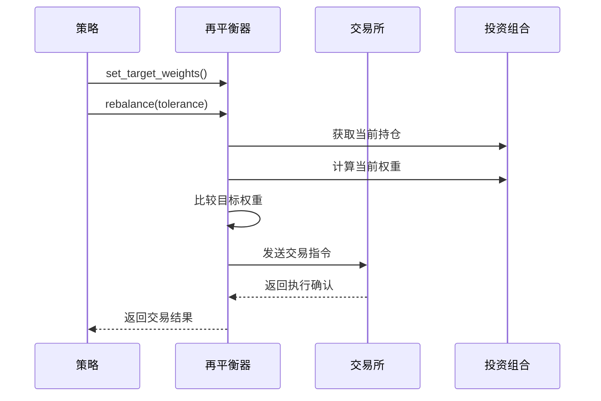
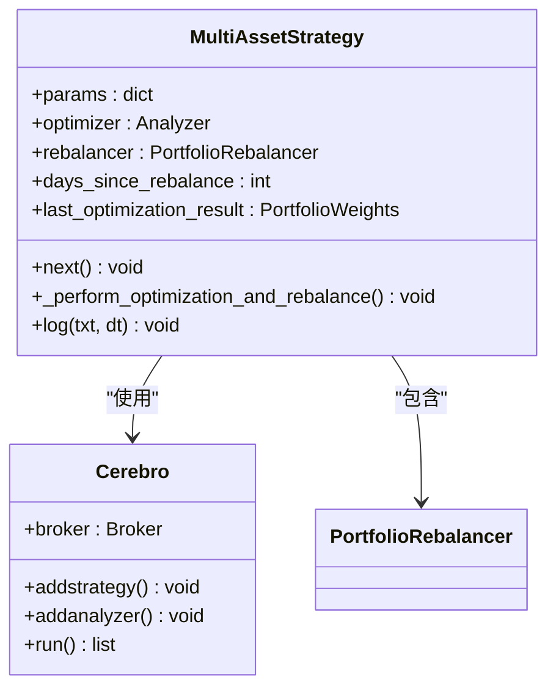
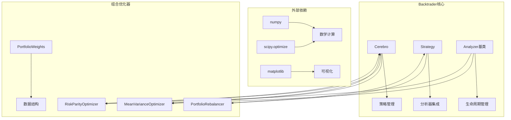

# 组合优化器

<cite>
**本文档引用的文件**
- [backtrader/__init__.py](file://backtrader/__init__.py)
- [backtrader/cerebro.py](file://backtrader/cerebro.py)
- [backtrader/strategy.py](file://backtrader/strategy.py)
- [backtrader/analyzer.py](file://backtrader/analyzer.py)
- [backtrader/analyzers/portfolio_optimizer.py](file://backtrader/analyzers/portfolio_optimizer.py)
- [backtrader/analyzers/__init__.py](file://backtrader/analyzers/__init__.py)
- [samples/portfolio-optimization/portfolio_optimization_demo.py](file://samples/portfolio-optimization/portfolio_optimization_demo.py)
</cite>

## 目录
1. [简介](#简介)
2. [项目结构](#项目结构)
3. [核心组件](#核心组件)
4. [架构概览](#架构概览)
5. [详细组件分析](#详细组件分析)
6. [依赖关系分析](#依赖关系分析)
7. [性能考虑](#性能考虑)
8. [故障排除指南](#故障排除指南)
9. [结论](#结论)

## 简介

组合优化器是Backtrader框架中的一个高级功能模块，专门用于实现现代投资组合理论的投资组合优化算法。该模块集成了均值-方差优化和风险平价两种主流投资组合优化方法，为多资产投资策略提供了自动化的权重分配和再平衡机制。

Backtrader是一个强大的Python量化金融回测框架，组合优化器作为其核心分析器之一，能够帮助用户构建更加智能和自动化的投资策略。通过集成先进的数学优化算法，该模块实现了从历史数据分析到最优投资组合权重计算的完整流程。

## 项目结构

Backtrader项目采用模块化设计，组合优化器位于专门的分析器模块中：

**图表来源**
- [backtrader/__init__.py](file://backtrader/__init__.py#L1-L91)
- [backtrader/analyzers/__init__.py](file://backtrader/analyzers/__init__.py#L1-L47)

**章节来源**
- [backtrader/__init__.py](file://backtrader/__init__.py#L1-L91)
- [backtrader/analyzers/__init__.py](file://backtrader/analyzers/__init__.py#L1-L47)

## 核心组件

组合优化器系统由以下核心组件构成：

### 1. 均值-方差优化器 (MeanVarianceOptimizer)
基于Markowitz现代投资组合理论，实现最小方差投资组合的计算。该优化器使用历史收益率数据计算协方差矩阵，并通过二次规划求解最优权重分配。

### 2. 风险平价优化器 (RiskParityOptimizer)  
实现风险平价投资组合，确保每个资产对组合总风险的贡献相等。采用迭代算法逐步调整权重，直到达到风险贡献均衡状态。

### 3. 投资组合再平衡器 (PortfolioRebalancer)
负责根据优化结果执行实际的买卖交易指令，实现投资组合的动态再平衡。

### 4. 权重数据类 (PortfolioWeights)
封装优化结果的数据结构，包含权重分配、预期收益、风险度量和夏普比率等关键指标。

**章节来源**
- [backtrader/analyzers/portfolio_optimizer.py](file://backtrader/analyzers/portfolio_optimizer.py#L20-L579)

## 架构概览

组合优化器采用分层架构设计，与Backtrader框架深度集成：

**图表来源**
- [backtrader/analyzers/portfolio_optimizer.py](file://backtrader/analyzers/portfolio_optimizer.py#L138-L242)
- [backtrader/strategy.py](file://backtrader/strategy.py#L770-L800)

## 详细组件分析

### 均值-方差优化器

均值-方差优化器实现了经典的Markowitz投资组合优化理论：

**图表来源**
- [backtrader/analyzers/portfolio_optimizer.py](file://backtrader/analyzers/portfolio_optimizer.py#L30-L273)

#### 关键算法流程

均值-方差优化的核心算法包括以下步骤：

1. **数据预处理**: 收集各资产的历史价格数据，计算对数收益率序列
2. **协方差矩阵计算**: 基于收益率序列计算资产间的协方差矩阵
3. **约束定义**: 设置权重和约束条件（卖空限制、目标收益率等）
4. **优化求解**: 使用SLSQP算法求解二次规划问题
5. **结果评估**: 计算预期收益、风险和夏普比率

**章节来源**
- [backtrader/analyzers/portfolio_optimizer.py](file://backtrader/analyzers/portfolio_optimizer.py#L58-L242)

### 风险平价优化器

风险平价优化器采用迭代算法实现风险贡献均衡：

**图表来源**
- [backtrader/analyzers/portfolio_optimizer.py](file://backtrader/analyzers/portfolio_optimizer.py#L308-L381)

#### 算法特点

- **迭代收敛**: 通过固定点迭代实现风险贡献均衡
- **鲁棒性**: 使用正则化技术避免协方差矩阵病态
- **灵活性**: 支持不同的收敛准则和迭代限制

**章节来源**
- [backtrader/analyzers/portfolio_optimizer.py](file://backtrader/analyzers/portfolio_optimizer.py#L275-L491)

### 投资组合再平衡器

再平衡器负责将优化结果转化为实际的交易指令：

**图表来源**
- [backtrader/analyzers/portfolio_optimizer.py](file://backtrader/analyzers/portfolio_optimizer.py#L509-L560)

#### 再平衡策略

再平衡器支持多种再平衡策略：
- **权重偏离阈值**: 当当前权重与目标权重偏离超过阈值时触发交易
- **时间间隔控制**: 防止过于频繁的交易活动
- **批量执行**: 将多个资产的调整合并执行

**章节来源**
- [backtrader/analyzers/portfolio_optimizer.py](file://backtrader/analyzers/portfolio_optimizer.py#L494-L561)

### 示例策略实现

示例策略展示了如何在实际策略中集成组合优化器：

**图表来源**
- [samples/portfolio-optimization/portfolio_optimization_demo.py](file://samples/portfolio-optimization/portfolio_optimization_demo.py#L16-L116)

**章节来源**
- [samples/portfolio-optimization/portfolio_optimization_demo.py](file://samples/portfolio-optimization/portfolio_optimization_demo.py#L1-L261)

## 依赖关系分析

组合优化器与Backtrader框架的依赖关系如下：

**图表来源**
- [backtrader/analyzers/portfolio_optimizer.py](file://backtrader/analyzers/portfolio_optimizer.py#L14-L17)
- [backtrader/cerebro.py](file://backtrader/cerebro.py#L60-L65)

### 主要依赖特性

1. **数学计算库**: 使用NumPy进行高效的数值计算
2. **优化算法**: 基于SciPy的优化工具包
3. **框架集成**: 深度集成Backtrader的分析器生命周期
4. **实时数据**: 支持实时和历史数据的统一处理

**章节来源**
- [backtrader/analyzers/portfolio_optimizer.py](file://backtrader/analyzers/portfolio_optimizer.py#L1-L50)

## 性能考虑

组合优化器在设计时充分考虑了性能优化：

### 1. 计算效率优化
- **缓存机制**: 缓存历史收益率数据，避免重复计算
- **向量化操作**: 使用NumPy进行批量矩阵运算
- **增量更新**: 只在需要时重新计算协方差矩阵

### 2. 内存管理
- **历史数据限制**: 限制权重历史记录的数量（默认50条）
- **对象复用**: 复用中间计算结果，减少内存分配
- **垃圾回收**: 及时清理不再使用的临时对象

### 3. 并行处理
- **多进程支持**: 在Cerebro引擎中支持多进程优化
- **数据预加载**: 优化数据预加载机制，提高I/O效率

## 故障排除指南

### 常见问题及解决方案

#### 1. 优化失败
**症状**: 优化算法返回失败状态
**原因**: 协方差矩阵奇异或约束条件不可满足
**解决方案**: 
- 检查数据质量，确保有足够的历史数据
- 调整正则化参数
- 简化约束条件

#### 2. 收益率计算异常
**症状**: 收益率序列为空或包含NaN值
**原因**: 数据缺失或时间序列不匹配
**解决方案**:
- 检查数据源的完整性
- 确保所有资产的时间轴对齐
- 设置适当的回看期参数

#### 3. 再平衡交易执行问题
**症状**: 交易指令无法执行或执行不完整
**原因**: 资金不足或市场流动性问题
**解决方案**:
- 检查账户资金和持仓状况
- 调整交易规模和频率
- 实施更严格的风控措施

**章节来源**
- [backtrader/analyzers/portfolio_optimizer.py](file://backtrader/analyzers/portfolio_optimizer.py#L236-L241)
- [backtrader/analyzers/portfolio_optimizer.py](file://backtrader/analyzers/portfolio_optimizer.py#L478-L560)

## 结论

组合优化器作为Backtrader框架的重要组成部分，成功地将现代投资组合理论与实际的量化交易策略相结合。通过提供均值-方差和风险平价两种优化方法，该模块为用户构建智能化的投资策略提供了强大工具。

### 主要优势

1. **理论基础扎实**: 基于成熟的现代投资组合理论
2. **实现完整**: 从数据处理到交易执行的全流程覆盖
3. **易于集成**: 与Backtrader框架无缝集成
4. **性能优秀**: 采用多种优化技术确保高效运行

### 应用前景

组合优化器不仅适用于学术研究，更可以直接应用于实际的投资决策支持系统。随着机器学习和人工智能技术的发展，该模块还有很大的扩展空间，可以集成更多先进的优化算法和风险管理技术。

通过持续的改进和完善，组合优化器将继续为量化金融领域提供强有力的技术支撑，帮助投资者做出更加科学和理性的投资决策。