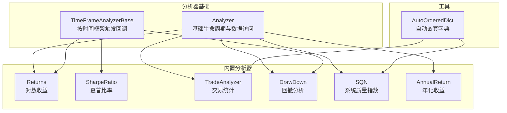
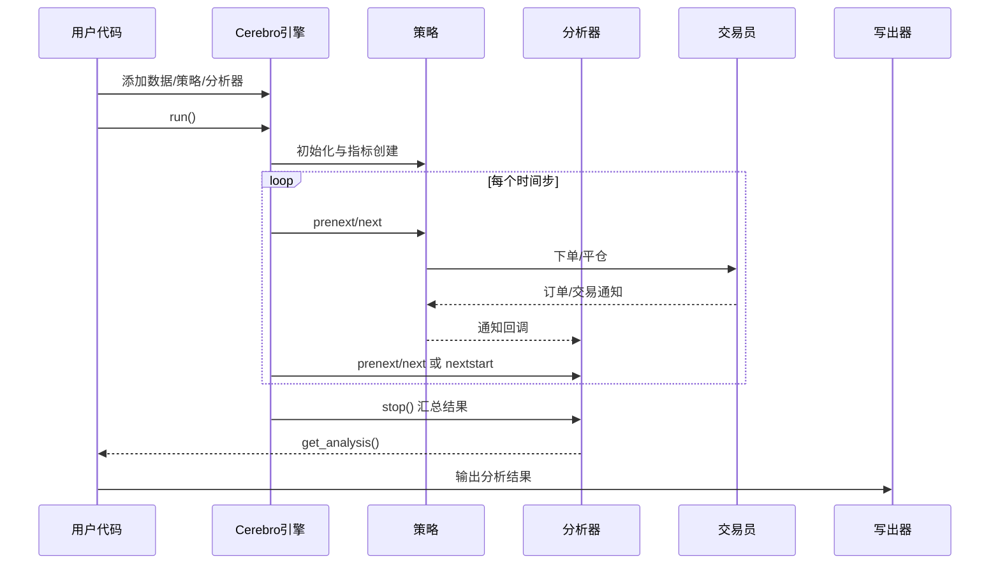
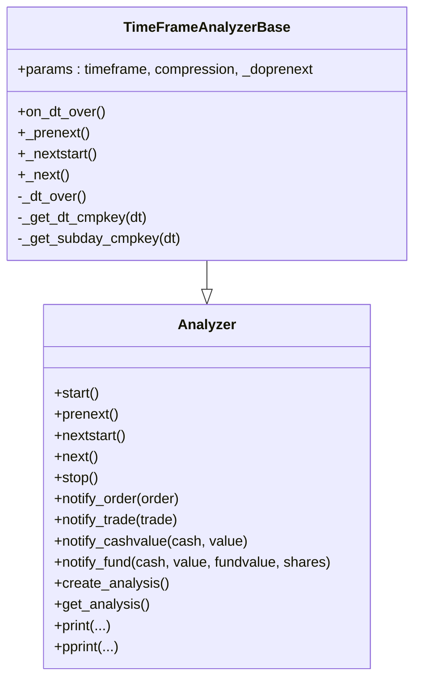
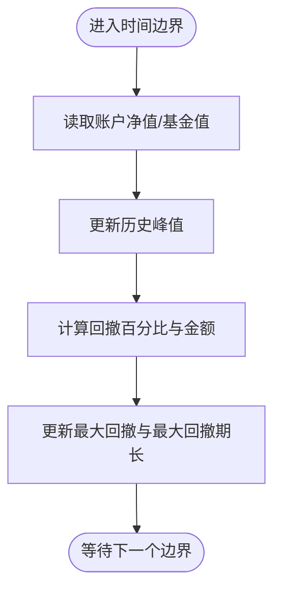
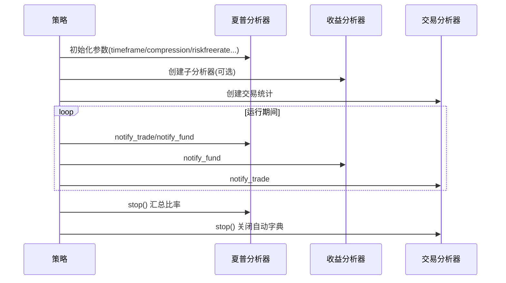
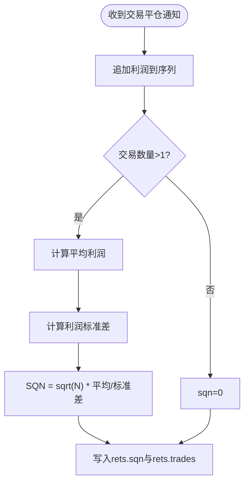
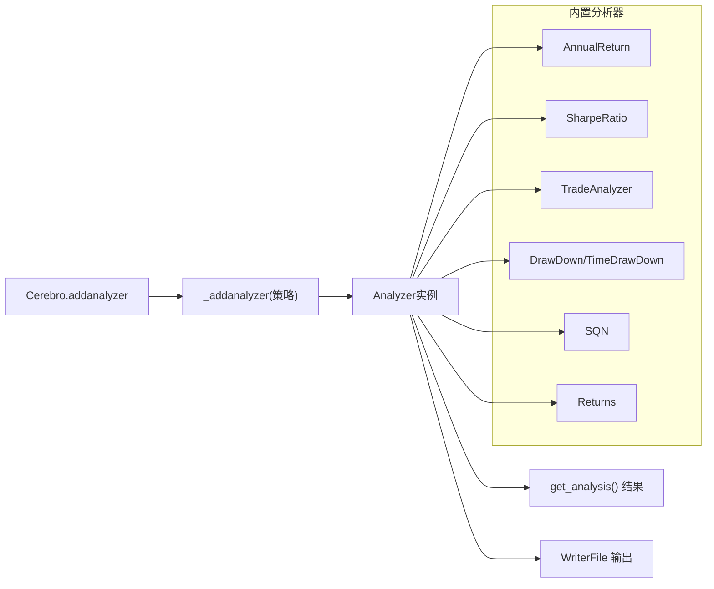

# 自定义分析器开发

<cite>
**本文档引用的文件**
- [backtrader/analyzer.py](file://backtrader/analyzer.py)
- [backtrader/analyzers/__init__.py](file://backtrader/analyzers/__init__.py)
- [backtrader/analyzers/annualreturn.py](file://backtrader/analyzers/annualreturn.py)
- [backtrader/analyzers/sharpe.py](file://backtrader/analyzers/sharpe.py)
- [backtrader/analyzers/tradeanalyzer.py](file://backtrader/analyzers/tradeanalyzer.py)
- [backtrader/analyzers/drawdown.py](file://backtrader/analyzers/drawdown.py)
- [backtrader/analyzers/returns.py](file://backtrader/analyzers/returns.py)
- [backtrader/analyzers/sqn.py](file://backtrader/analyzers/sqn.py)
- [backtrader/utils/autodict.py](file://backtrader/utils/autodict.py)
- [samples/analyzer-annualreturn/analyzer-annualreturn.py](file://samples/analyzer-annualreturn/analyzer-annualreturn.py)
- [tests/test_analyzer-sqn.py](file://tests/test_analyzer-sqn.py)
- [backtrader/cerebro.py](file://backtrader/cerebro.py)
- [backtrader/strategy.py](file://backtrader/strategy.py)
</cite>

## 目录
1. [简介](#简介)
2. [项目结构](#项目结构)
3. [核心组件](#核心组件)
4. [架构总览](#架构总览)
5. [详细组件分析](#详细组件分析)
6. [依赖关系分析](#依赖关系分析)
7. [性能考虑](#性能考虑)
8. [故障排除指南](#故障排除指南)
9. [结论](#结论)
10. [附录](#附录)

## 简介
本指南面向希望在Backtrader框架中开发自定义分析器（Analyzer）的开发者，系统讲解如何继承基础分析器类、配置参数、实现生命周期方法、处理数据与结果输出，并通过多个示例展示从简单统计到复杂技术指标与多数据源分析的开发思路。同时涵盖分析器的注册与使用、与其他分析器的组合、调试与测试技巧以及性能优化建议。

## 项目结构
Backtrader的分析器体系由基础类、内置分析器模块与工具类组成：
- 基础类：Analyzer与TimeFrameAnalyzerBase，定义统一的生命周期与数据访问接口
- 内置分析器：位于analyzers包，覆盖收益、风险、交易统计等多个维度
- 工具类：AutoOrderedDict等自动字典结构，便于动态构建分析结果
- 示例与测试：samples与tests目录提供实际用法与验证

**图表来源**
- [backtrader/analyzer.py](file://backtrader/analyzer.py#L89-L446)
- [backtrader/analyzers/returns.py](file://backtrader/analyzers/returns.py#L30-L155)
- [backtrader/analyzers/sharpe.py](file://backtrader/analyzers/sharpe.py#L33-L221)
- [backtrader/analyzers/tradeanalyzer.py](file://backtrader/analyzers/tradeanalyzer.py#L31-L209)
- [backtrader/analyzers/drawdown.py](file://backtrader/analyzers/drawdown.py#L31-L197)
- [backtrader/analyzers/sqn.py](file://backtrader/analyzers/sqn.py#L31-L86)
- [backtrader/analyzers/annualreturn.py](file://backtrader/analyzers/annualreturn.py#L30-L89)
- [backtrader/utils/autodict.py](file://backtrader/utils/autodict.py#L80-L146)

**章节来源**
- [backtrader/analyzer.py](file://backtrader/analyzer.py#L89-L446)
- [backtrader/analyzers/__init__.py](file://backtrader/analyzers/__init__.py#L24-L44)

## 核心组件
- Analyzer基础类
  - 定义生命周期：start/next/nextstart/prenext/stop
  - 提供通知回调：notify_order/notify_trade/notify_cashvalue/notify_fund
  - 结果容器：create_analysis默认创建有序字典rets；get_analysis返回分析结果
  - 输出工具：print/pprint用于标准输出或美化打印
- TimeFrameAnalyzerBase扩展
  - 支持按年/月/周/日及子日内的周期边界触发on_dt_over回调
  - 自动计算比较键与压缩后的边界点，便于按时间框架聚合统计

关键能力映射：
- 数据访问：self.strategy/self.datas/self.data/dataX/dataX_Y等别名属性
- 生命周期：与策略同步调用，支持“预运行”阶段（prenext）与“开始”阶段（nextstart）
- 结果存储：默认使用OrderedDict，可替换为AutoOrderedDict以支持动态嵌套

**章节来源**
- [backtrader/analyzer.py](file://backtrader/analyzer.py#L89-L286)
- [backtrader/analyzer.py](file://backtrader/analyzer.py#L289-L446)

## 架构总览
Backtrader执行时序中，分析器与策略、指标、观察者协同工作，在每个时间点根据最小周期状态调用相应的生命周期方法，并在结束时汇总结果。

**图表来源**
- [.claude/architecture.md](file://.claude/architecture.md#L389-L446)
- [backtrader/strategy.py](file://backtrader/strategy.py#L349-L388)
- [backtrader/cerebro.py](file://backtrader/cerebro.py#L643-L648)

## 详细组件分析

### Analyzer类与TimeFrameAnalyzerBase类
- Analyzer
  - 生命周期：start → prenext/next/nextstart → stop
  - 通知：notify_order/notify_trade/notify_cashvalue/notify_fund
  - 结果：create_analysis创建容器，get_analysis返回结果
- TimeFrameAnalyzerBase
  - 在prenext/next/nextstart中检测是否到达时间边界，触发on_dt_over
  - 支持年/月/周/日与子日（分/秒/微秒）边界计算与压缩

**图表来源**
- [backtrader/analyzer.py](file://backtrader/analyzer.py#L89-L286)
- [backtrader/analyzer.py](file://backtrader/analyzer.py#L289-L446)

**章节来源**
- [backtrader/analyzer.py](file://backtrader/analyzer.py#L89-L446)

### 时间框架分析器：Returns与TimeDrawDown
- Returns（继承TimeFrameAnalyzerBase）
  - 聚合对数复合收益、平均收益与年化/标准化收益
  - 使用broker/fundvalue作为资产价值来源，支持按时间框架计数
- TimeDrawDown（继承TimeFrameAnalyzerBase）
  - 在时间边界上计算当前净值与历史峰值，更新最大回撤与最大回撤期长

**图表来源**
- [backtrader/analyzers/drawdown.py](file://backtrader/analyzers/drawdown.py#L176-L193)

**章节来源**
- [backtrader/analyzers/returns.py](file://backtrader/analyzers/returns.py#L30-L155)
- [backtrader/analyzers/drawdown.py](file://backtrader/analyzers/drawdown.py#L113-L197)

### 组合型分析器：SharpeRatio与TradeAnalyzer
- SharpeRatio
  - 可选择Legacy模式（AnnualReturn）或基于TimeReturn的分层计算
  - 支持风险无率转换因子与样本标准差修正
- TradeAnalyzer
  - 基于AutoOrderedDict动态统计交易总数、净利/平均/最大、胜率、多空分布、持有长度等

**图表来源**
- [backtrader/analyzers/sharpe.py](file://backtrader/analyzers/sharpe.py#L134-L206)
- [backtrader/analyzers/tradeanalyzer.py](file://backtrader/analyzers/tradeanalyzer.py#L72-L209)

**章节来源**
- [backtrader/analyzers/sharpe.py](file://backtrader/analyzers/sharpe.py#L33-L221)
- [backtrader/analyzers/tradeanalyzer.py](file://backtrader/analyzers/tradeanalyzer.py#L31-L209)

### 简单统计分析器：SQN
- SQN通过记录每笔已平仓利润，计算系统质量指数
- 使用AutoOrderedDict存储结果，包含sqn与trades计数

**图表来源**
- [backtrader/analyzers/sqn.py](file://backtrader/analyzers/sqn.py#L68-L85)

**章节来源**
- [backtrader/analyzers/sqn.py](file://backtrader/analyzers/sqn.py#L31-L86)

### 复杂技术指标分析器：AnnualReturn
- AnnualReturn在stop阶段遍历数据，按自然年计算年化收益率序列与字典
- 展示了直接使用策略broker/stats.broker.value进行收益计算的方式

**章节来源**
- [backtrader/analyzers/annualreturn.py](file://backtrader/analyzers/annualreturn.py#L30-L89)

### 多数据源分析器思路
- 利用Analyzer的self.datas与self.dataX别名访问多数据源
- 在生命周期方法中遍历self.datas，按需合并或对比不同数据源的指标
- 若需要按时间框架聚合，可继承TimeFrameAnalyzerBase并在on_dt_over中处理

[本节为概念性说明，不直接分析具体文件]

## 依赖关系分析
- 分析器注册与实例化
  - Cerebro.addanalyzer接收类与参数，运行时实例化并注入策略
  - 策略侧通过_addanalyzer管理分析器命名与实例列表
- 内置分析器导出
  - analyzers/__init__.py集中导入各分析器，便于统一引用
- 结果容器
  - AutoOrderedDict/AutoDict提供动态嵌套字典能力，避免硬编码字段

**图表来源**
- [backtrader/cerebro.py](file://backtrader/cerebro.py#L643-L648)
- [backtrader/strategy.py](file://backtrader/strategy.py#L243-L248)
- [backtrader/analyzers/__init__.py](file://backtrader/analyzers/__init__.py#L24-L44)

**章节来源**
- [backtrader/cerebro.py](file://backtrader/cerebro.py#L617-L648)
- [backtrader/strategy.py](file://backtrader/strategy.py#L228-L248)
- [backtrader/analyzers/__init__.py](file://backtrader/analyzers/__init__.py#L24-L44)

## 性能考虑
- 合理使用时间框架边界
  - TimeFrameAnalyzerBase在边界触发on_dt_over，减少不必要的频繁计算
- 避免在next中做重计算
  - 将可缓存的中间变量保存在start中初始化，stop中一次性汇总
- 使用AutoOrderedDict/AutoDict
  - 动态字段创建与关闭有助于控制内存占用，避免冗余键
- 控制数据访问粒度
  - 仅在必要时访问self.strategy/self.datas，避免重复索引

[本节提供通用指导，不直接分析具体文件]

## 故障排除指南
- 分析器未输出结果
  - 确认已调用get_analysis()并正确传递给Writer或print/pprint
  - 检查是否在stop阶段才写入rets，确保stop被调用
- 结果为空或为零
  - 检查参数如timeframe/compression是否与数据匹配
  - 对于SQN/Sharpe等依赖交易的分析器，确认有足够交易次数
- 性能问题
  - 减少在next中的IO与字符串操作
  - 使用子分析器（如TimeReturn）复用已有计算结果

**章节来源**
- [backtrader/analyzer.py](file://backtrader/analyzer.py#L255-L286)
- [tests/test_analyzer-sqn.py](file://tests/test_analyzer-sqn.py#L167-L182)

## 结论
通过继承Analyzer或TimeFrameAnalyzerBase，结合AutoOrderedDict等工具，开发者可以快速构建从简单统计到复杂技术指标的分析器。合理利用生命周期方法、时间框架边界与子分析器组合，既能保证功能完整性，也能兼顾性能与可维护性。

## 附录

### 开发步骤清单
- 类定义
  - 继承Analyzer或TimeFrameAnalyzerBase
  - 定义params元组与默认值
- 参数配置
  - 使用self.p访问参数；必要时在__init__中创建子分析器
- 生命周期实现
  - 在start中初始化容器与中间变量
  - 在prenext/next/nextstart中按需更新
  - 在stop中汇总并写入rets
- 数据与通知
  - 使用self.strategy/self.datas访问数据
  - 实现notify_*方法响应订单/交易/资金变化
- 结果输出
  - 默认返回self.rets；可通过print/pprint输出
  - 使用WriterFile将结果写入文件或标准输出

### 注册与使用
- 通过Cerebro.addanalyzer(ancls, ...)添加分析器
- 在策略中可通过self.analyzers访问实例
- 可组合多个分析器，如SharpeRatio+TradeAnalyzer+Returns

**章节来源**
- [backtrader/cerebro.py](file://backtrader/cerebro.py#L643-L648)
- [samples/analyzer-annualreturn/analyzer-annualreturn.py](file://samples/analyzer-annualreturn/analyzer-annualreturn.py#L160-L171)

### 单元测试与调试
- 使用测试样例验证分析器行为
  - 参考test_analyzer-sqn.py中对sqn与trades断言的用法
- 调试技巧
  - 在关键生命周期方法中打印中间变量
  - 使用pprint美化输出，便于检查嵌套结构

**章节来源**
- [tests/test_analyzer-sqn.py](file://tests/test_analyzer-sqn.py#L154-L182)