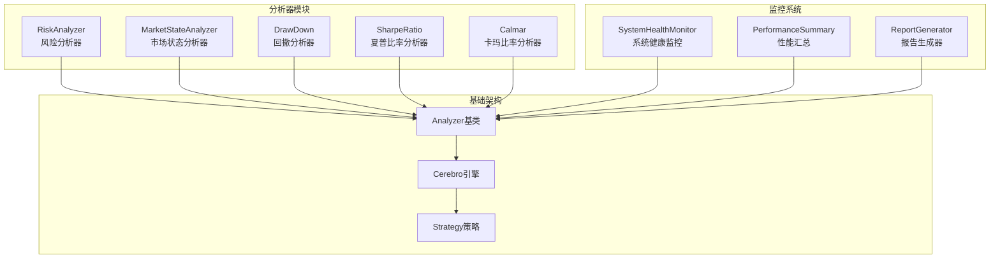
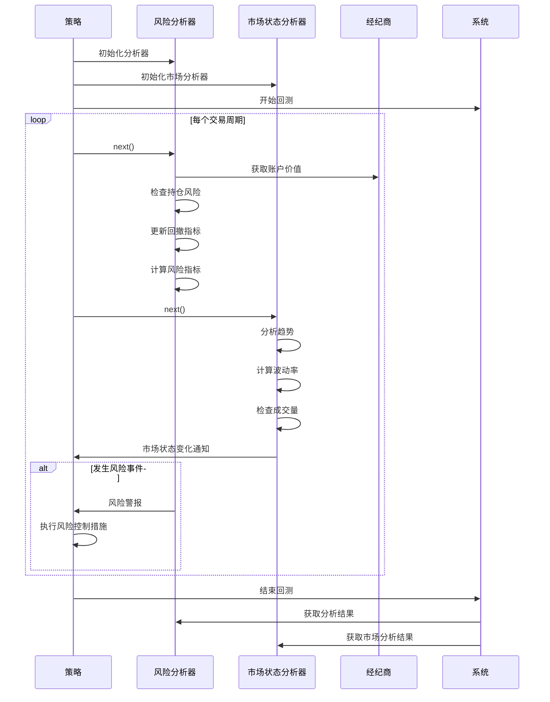
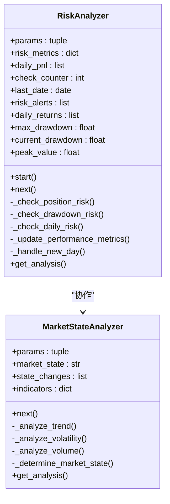
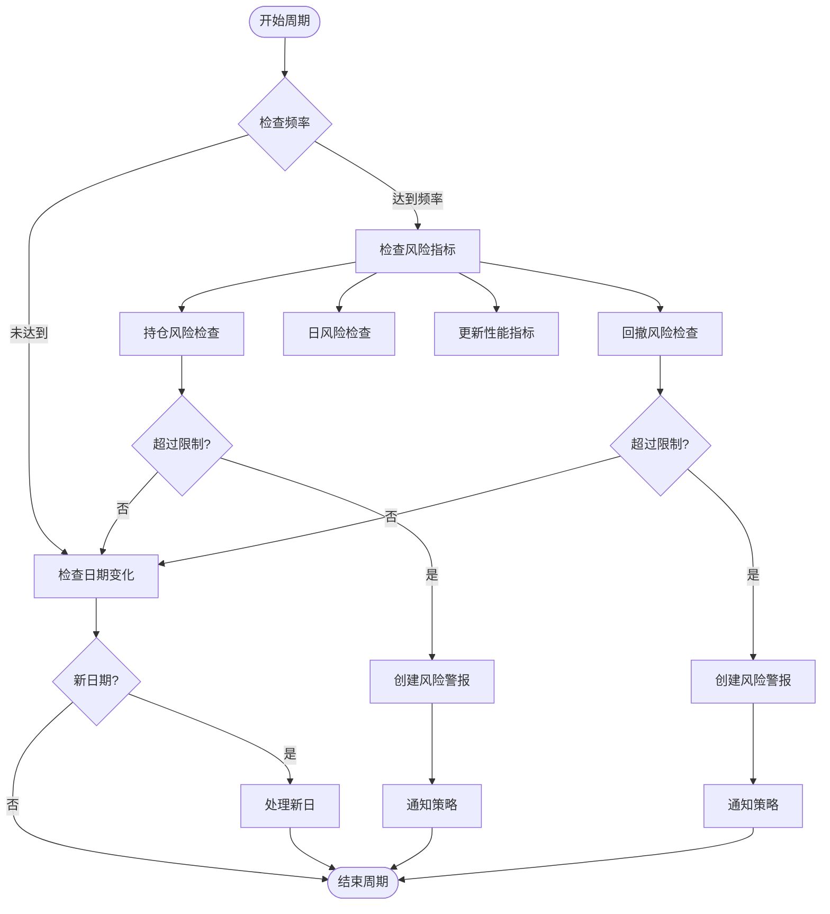
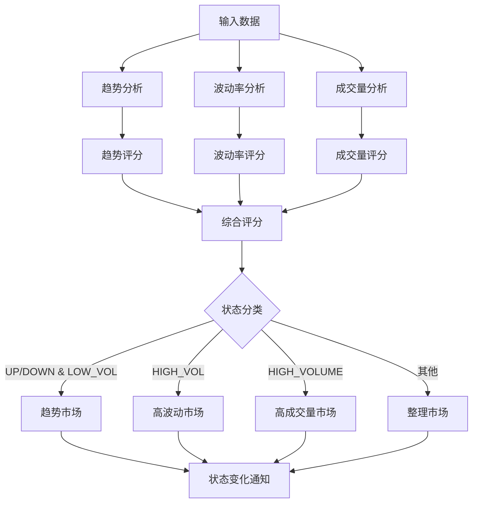
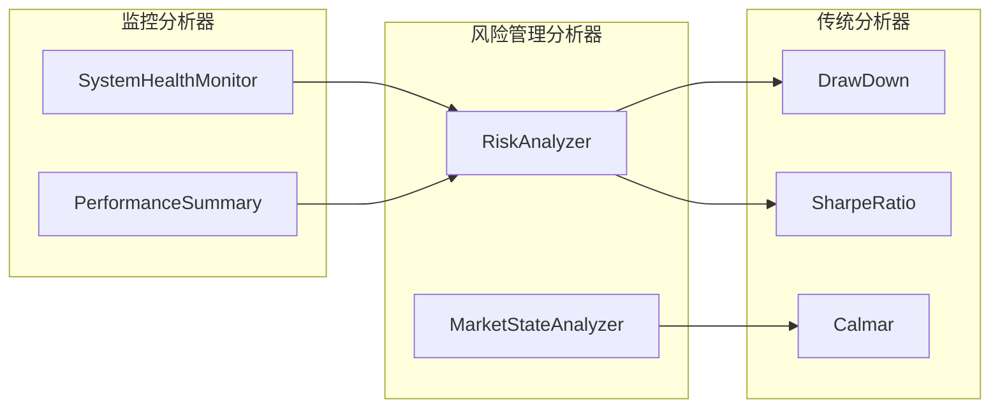
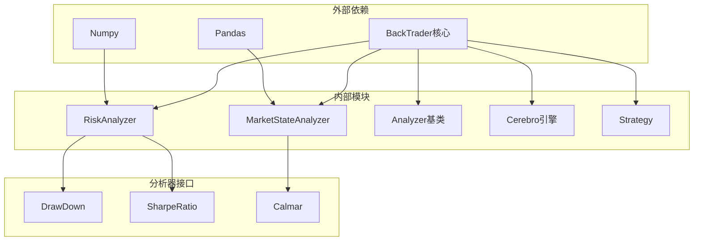

# 风险分析器

<cite>
**本文档引用的文件**
- [risk_analyzer.py](file://backtrader/analyzers/risk_analyzer.py)
- [analyzer.py](file://backtrader/analyzer.py)
- [__init__.py](file://backtrader/analyzers/__init__.py)
- [drawdown.py](file://backtrader/analyzers/drawdown.py)
- [sharpe.py](file://backtrader/analyzers/sharpe.py)
- [calmar.py](file://backtrader/analyzers/calmar.py)
- [monitoring.py](file://backtrader/analyzers/monitoring.py)
- [cerebro.py](file://backtrader/cerebro.py)
- [strategy.py](file://backtrader/strategy.py)
- [binance_example.py](file://examples/binance_example.py)
</cite>

## 目录
1. [简介](#简介)
2. [项目结构](#项目结构)
3. [核心组件](#核心组件)
4. [架构概览](#架构概览)
5. [详细组件分析](#详细组件分析)
6. [依赖关系分析](#依赖关系分析)
7. [性能考虑](#性能考虑)
8. [故障排除指南](#故障排除指南)
9. [结论](#结论)

## 简介

风险分析器是BackTrader量化交易框架中的重要组成部分，专门用于实时监控和评估交易策略的风险状况。该分析器集成了多种风险管理功能，包括最大回撤监控、持仓风险控制、市场状态分析等，为交易决策提供全面的风险评估支持。

BackTrader是一个开源的Python量化交易框架，提供了完整的算法交易解决方案，包括数据获取、策略开发、回测、实盘交易等功能。风险分析器作为其核心组件之一，为用户提供了专业级的风险管理工具。

## 项目结构

BackTrader项目采用模块化设计，风险分析器位于`backtrader/analyzers/`目录下，与其它分析器共同构成完整的分析体系。

**图表来源**
- [risk_analyzer.py](file://backtrader/analyzers/risk_analyzer.py#L13-L412)
- [analyzer.py](file://backtrader/analyzer.py#L89-L447)
- [monitoring.py](file://backtrader/analyzers/monitoring.py#L1-L422)

**章节来源**
- [__init__.py](file://backtrader/analyzers/__init__.py#L24-L47)
- [risk_analyzer.py](file://backtrader/analyzers/risk_analyzer.py#L1-L412)

## 核心组件

风险分析器系统包含两个主要组件：风险分析器和市场状态分析器，它们协同工作提供全面的风险监控功能。

### 风险分析器 (RiskAnalyzer)

风险分析器是核心的风险监控组件，负责实时跟踪和评估投资组合的风险状况。

**主要功能特性：**
- 最大回撤监控和限制检查
- 持仓风险评估和预警
- 日度收益计算和波动率分析
- 夏普比率计算
- 风险警报系统集成

### 市场状态分析器 (MarketStateAnalyzer)

市场状态分析器专注于识别和分析市场环境的变化，帮助策略适应不同的市场条件。

**核心分析能力：**
- 趋势识别和方向判断
- 波动率分析
- 成交量异常检测
- 市场状态分类（趋势、震荡、高波动、整理）

**章节来源**
- [risk_analyzer.py](file://backtrader/analyzers/risk_analyzer.py#L13-L412)

## 架构概览

风险分析器系统基于BackTrader的Analyzer基类构建，采用事件驱动的设计模式，与策略执行紧密集成。

**图表来源**
- [risk_analyzer.py](file://backtrader/analyzers/risk_analyzer.py#L52-L67)
- [strategy.py](file://backtrader/strategy.py#L107-L200)
- [cerebro.py](file://backtrader/cerebro.py#L60-L200)

## 详细组件分析

### 风险分析器深度解析

#### 数据结构设计

风险分析器采用了多层次的数据存储结构来管理不同类型的风险指标：

**图表来源**
- [risk_analyzer.py](file://backtrader/analyzers/risk_analyzer.py#L13-L412)

#### 风险监控流程

风险分析器的核心逻辑通过以下流程实现：

**图表来源**
- [risk_analyzer.py](file://backtrader/analyzers/risk_analyzer.py#L52-L67)
- [risk_analyzer.py](file://backtrader/analyzers/risk_analyzer.py#L69-L123)

#### 关键算法实现

##### 持仓风险计算算法

持仓风险计算是风险分析器的核心功能之一，通过以下步骤实现：

1. **总价值计算**：获取经纪商的总资产价值
2. **持仓价值汇总**：遍历所有数据源，计算未平仓头寸的总价值
3. **风险比例计算**：持仓价值与总资产的比值
4. **风险评估**：与预设阈值比较，触发相应的风险控制措施

##### 回撤监控算法

回撤监控算法采用动态峰值跟踪机制：

1. **峰值更新**：每次检查时更新历史最高价值
2. **当前回撤计算**：基于当前净值与峰值的差异
3. **最大回撤维护**：跟踪历史最大回撤值
4. **风险触发**：当回撤超过阈值时发出警报

**章节来源**
- [risk_analyzer.py](file://backtrader/analyzers/risk_analyzer.py#L69-L175)

### 市场状态分析器详解

#### 市场状态识别机制

市场状态分析器通过多维度指标综合判断市场环境：

**图表来源**
- [risk_analyzer.py](file://backtrader/analyzers/risk_analyzer.py#L282-L386)

#### 技术指标计算

市场状态分析器使用以下技术指标：

**趋势分析指标：**
- 移动平均线斜率计算
- 趋势强度评估
- 趋势方向判断

**波动率指标：**
- 近期价格波动率计算
- 波动率标准化处理
- 异常波动检测

**成交量指标：**
- 成交量均值计算
- 成交量比率分析
- 成交量异常识别

**章节来源**
- [risk_analyzer.py](file://backtrader/analyzers/risk_analyzer.py#L308-L361)

### 分析器集成与扩展

#### 与其他分析器的关系

风险分析器与BackTrader生态系统中的其他分析器形成互补关系：

**图表来源**
- [drawdown.py](file://backtrader/analyzers/drawdown.py#L31-L198)
- [sharpe.py](file://backtrader/analyzers/sharpe.py#L33-L222)
- [calmar.py](file://backtrader/analyzers/calmar.py#L31-L114)

#### 性能监控集成

系统健康监控分析器提供额外的风险管理视角：

- **系统稳定性监控**：检查数据延迟、内存使用等系统指标
- **策略执行监控**：跟踪订单执行质量、交易频率等
- **风险指标聚合**：整合多个风险指标形成综合风险评估

**章节来源**
- [monitoring.py](file://backtrader/analyzers/monitoring.py#L1-L422)

## 依赖关系分析

风险分析器系统具有清晰的层次结构和明确的依赖关系：

**图表来源**
- [risk_analyzer.py](file://backtrader/analyzers/risk_analyzer.py#L10-L11)
- [analyzer.py](file://backtrader/analyzer.py#L29-L31)

### 关键依赖关系

1. **BackTrader核心依赖**：所有分析器都继承自Analyzer基类
2. **策略集成**：分析器通过策略对象访问数据和执行上下文
3. **Cerebro引擎**：提供分析器生命周期管理和事件分发
4. **数学库依赖**：使用NumPy进行高效的数值计算

**章节来源**
- [analyzer.py](file://backtrader/analyzer.py#L34-L87)
- [cerebro.py](file://backtrader/cerebro.py#L40-L49)

## 性能考虑

### 内存管理

风险分析器在设计时充分考虑了内存效率：

- **数据缓冲管理**：限制日收益数据存储数量（默认30天）
- **增量计算**：只在检查频率到达时才执行计算
- **对象复用**：重用计算结果避免重复计算

### 计算复杂度

- **时间复杂度**：主要为O(n)，其中n为数据源数量
- **空间复杂度**：与历史数据长度成正比
- **优化策略**：使用向量化操作和缓存机制

### 并行处理

BackTrader支持多进程优化，风险分析器可以受益于：

- **数据预加载**：减少I/O等待时间
- **向量化计算**：利用NumPy进行批量计算
- **内存共享**：在多进程环境中共享只读数据

## 故障排除指南

### 常见问题及解决方案

#### 风险警报误触发

**问题描述**：风险分析器频繁发出警报但实际风险较低

**可能原因**：
- 风险阈值设置过于严格
- 市场波动性增加导致正常波动被误判
- 数据质量问题影响计算准确性

**解决建议**：
- 调整风险阈值参数
- 增加检查频率的间隔
- 实施风险平滑机制

#### 性能指标计算异常

**问题描述**：夏普比率或波动率计算结果异常

**可能原因**：
- 缺少足够的历史数据
- 数据包含异常值
- 计算精度问题

**解决建议**：
- 确保有足够的历史数据样本
- 实施数据清洗和异常值检测
- 使用更稳定的统计计算方法

#### 内存使用过高

**问题描述**：长时间运行后内存占用持续增长

**可能原因**：
- 历史数据积累过多
- 对象引用未正确释放
- 缓存机制失效

**解决建议**：
- 实施数据清理策略
- 定期清理过期的历史数据
- 优化对象生命周期管理

**章节来源**
- [risk_analyzer.py](file://backtrader/analyzers/risk_analyzer.py#L186-L229)

## 结论

风险分析器系统为BackTrader提供了专业级的风险管理能力，通过实时监控和智能分析帮助用户更好地控制交易风险。该系统的主要优势包括：

1. **全面的风险覆盖**：从市场环境到具体头寸的多层次风险监控
2. **灵活的配置选项**：可调整的阈值和参数适应不同市场条件
3. **高效的性能表现**：优化的算法和内存管理确保稳定运行
4. **良好的扩展性**：基于Analyzer基类的设计便于功能扩展

未来的发展方向包括：
- 增强机器学习算法的应用
- 扩展更多技术指标和分析方法
- 提供更丰富的可视化和报告功能
- 加强实时风险监控能力

通过合理配置和使用，风险分析器能够显著提升交易策略的稳健性和盈利能力，是量化交易中不可或缺的重要工具。