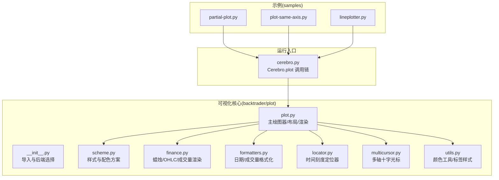
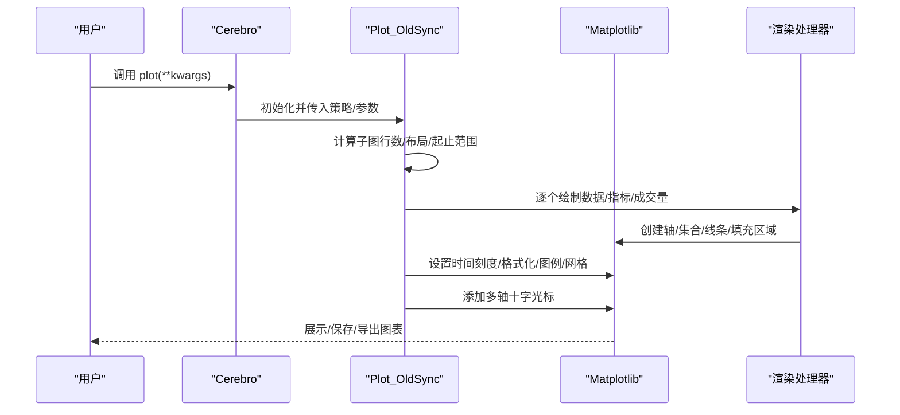
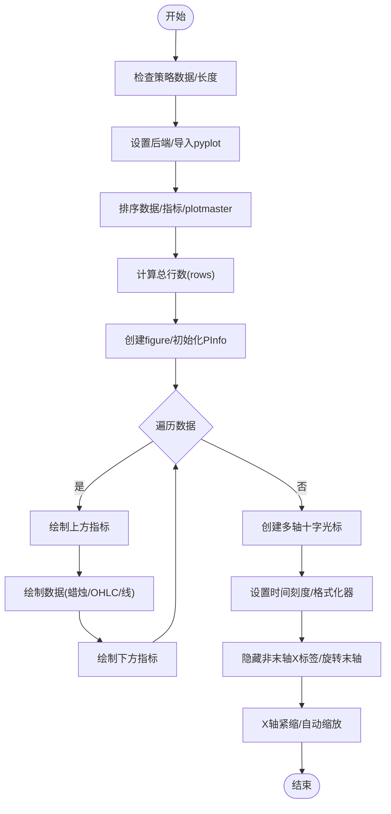
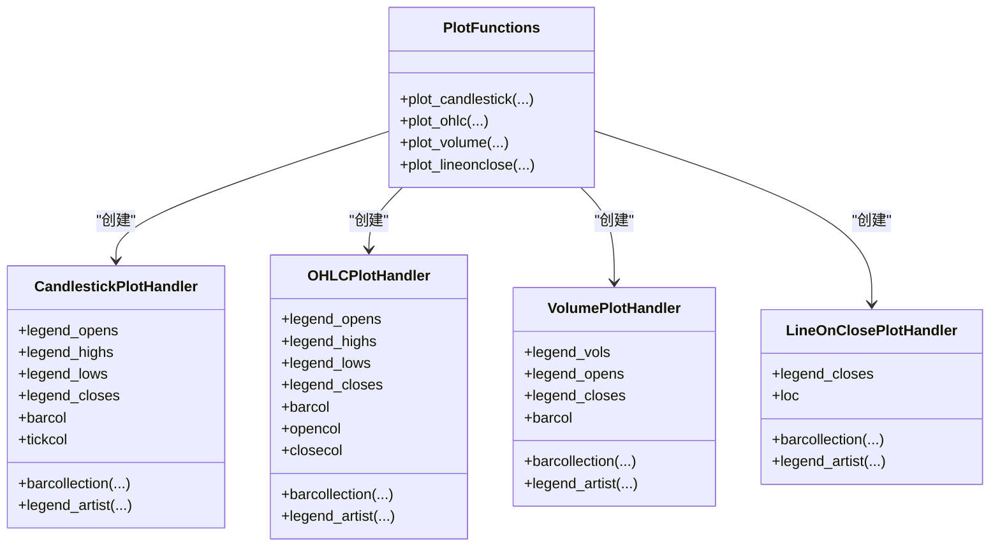
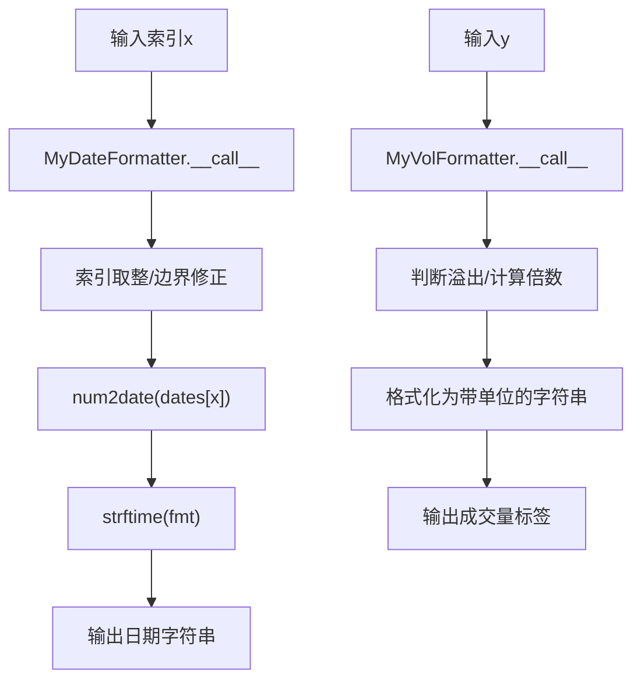
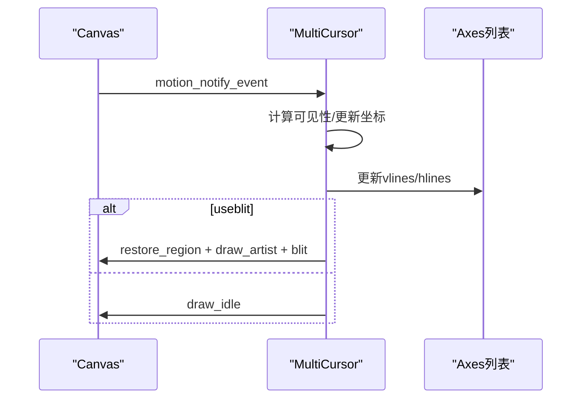
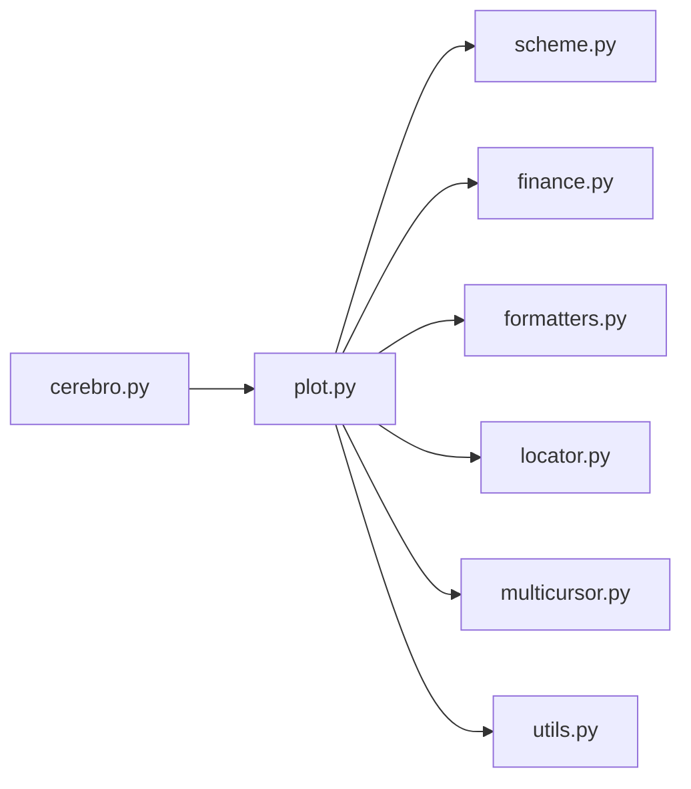

# 可视化系统

<cite>
**本文引用的文件**
- [backtrader/plot/__init__.py](file://backtrader/plot/__init__.py)
- [backtrader/plot/plot.py](file://backtrader/plot/plot.py)
- [backtrader/plot/scheme.py](file://backtrader/plot/scheme.py)
- [backtrader/plot/finance.py](file://backtrader/plot/finance.py)
- [backtrader/plot/formatters.py](file://backtrader/plot/formatters.py)
- [backtrader/plot/locator.py](file://backtrader/plot/locator.py)
- [backtrader/plot/multicursor.py](file://backtrader/plot/multicursor.py)
- [backtrader/plot/utils.py](file://backtrader/plot/utils.py)
- [backtrader/cerebro.py](file://backtrader/cerebro.py)
- [samples/partial-plot/partial-plot.py](file://samples/partial-plot/partial-plot.py)
- [samples/plot-same-axis/plot-same-axis.py](file://samples/plot-same-axis/plot-same-axis.py)
- [samples/lineplotter/lineplotter.py](file://samples/lineplotter/lineplotter.py)
</cite>

## 目录
1. [简介](#简介)
2. [项目结构](#项目结构)
3. [核心组件](#核心组件)
4. [架构总览](#架构总览)
5. [详细组件分析](#详细组件分析)
6. [依赖关系分析](#依赖关系分析)
7. [性能考量](#性能考量)
8. [故障排查指南](#故障排查指南)
9. [结论](#结论)
10. [附录](#附录)

## 简介
本文件系统性梳理 Backtrader 的可视化系统，围绕 Matplotlib 集成、图表渲染与交互机制展开，覆盖价格图表、技术指标叠加、交易信号标注、多子图布局、样式与主题定制、实时更新与动画、导出与分享、性能优化与兼容性处理，并给出自定义图表开发指南与与其他可视化库（如 plotly）的集成思路。

## 项目结构
Backtrader 的可视化能力主要集中在 backtrader/plot 包中，配合 cerebro 的 plot 入口对外暴露统一的绘图接口；示例位于 samples 目录，便于快速上手。

**图表来源**
- [backtrader/plot/__init__.py](file://backtrader/plot/__init__.py#L27-L44)
- [backtrader/plot/plot.py](file://backtrader/plot/plot.py#L1-L120)
- [backtrader/plot/scheme.py](file://backtrader/plot/scheme.py#L76-L188)
- [backtrader/plot/finance.py](file://backtrader/plot/finance.py#L1-L120)
- [backtrader/plot/formatters.py](file://backtrader/plot/formatters.py#L1-L125)
- [backtrader/plot/locator.py](file://backtrader/plot/locator.py#L1-L120)
- [backtrader/plot/multicursor.py](file://backtrader/plot/multicursor.py#L95-L180)
- [backtrader/plot/utils.py](file://backtrader/plot/utils.py#L1-L94)
- [backtrader/cerebro.py](file://backtrader/cerebro.py#L940-L1002)
- [samples/partial-plot/partial-plot.py](file://samples/partial-plot/partial-plot.py#L49-L84)
- [samples/plot-same-axis/plot-same-axis.py](file://samples/plot-same-axis/plot-same-axis.py#L66-L99)
- [samples/lineplotter/lineplotter.py](file://samples/lineplotter/lineplotter.py#L45-L73)

**章节来源**
- [backtrader/plot/__init__.py](file://backtrader/plot/__init__.py#L27-L44)
- [backtrader/plot/plot.py](file://backtrader/plot/plot.py#L118-L274)
- [backtrader/cerebro.py](file://backtrader/cerebro.py#L940-L1002)

## 核心组件
- 绘图入口与后端选择：在模块初始化时检测并设置 Matplotlib 后端，确保在不同平台（尤其是 Jupyter Notebook）下可用。
- 主绘图器 Plot_OldSync：负责策略数据与指标的布局、渲染、图层顺序、标签与填充区域、图例、多轴共享与联动等。
- 渲染器集合：针对 OHLC、蜡烛图、成交量等提供专用渲染函数，支持颜色、透明度、填充等参数。
- 样式与主题：通过 PlotScheme 提供统一的颜色、间距、网格、字体、图例位置等配置。
- 时间轴与格式化：AutoDateLocator/AutoDateFormatter 适配索引型 X 轴与日期刻度显示。
- 交互控件：MultiCursor 实现跨轴十字光标，提升多子图对比体验。
- 工具函数：颜色调整、标签框路径生成等辅助能力。

**章节来源**
- [backtrader/plot/__init__.py](file://backtrader/plot/__init__.py#L27-L44)
- [backtrader/plot/plot.py](file://backtrader/plot/plot.py#L96-L274)
- [backtrader/plot/scheme.py](file://backtrader/plot/scheme.py#L76-L188)
- [backtrader/plot/finance.py](file://backtrader/plot/finance.py#L211-L240)
- [backtrader/plot/formatters.py](file://backtrader/plot/formatters.py#L53-L125)
- [backtrader/plot/locator.py](file://backtrader/plot/locator.py#L95-L260)
- [backtrader/plot/multicursor.py](file://backtrader/plot/multicursor.py#L95-L240)
- [backtrader/plot/utils.py](file://backtrader/plot/utils.py#L30-L94)

## 架构总览
Backtrader 可视化采用“策略驱动 + Matplotlib 驱动”的双层架构：
- 策略层：策略对象包含数据与指标，通过 plotinfo 控制是否绘制、叠加到哪根轴、图例位置等。
- 渲染层：Plot_OldSync 将策略数据映射到 Matplotlib 子图，按行列比例分配空间，处理时间轴、刻度、图例、填充区域、标签等。

**图表来源**
- [backtrader/cerebro.py](file://backtrader/cerebro.py#L940-L1002)
- [backtrader/plot/plot.py](file://backtrader/plot/plot.py#L118-L274)
- [backtrader/plot/finance.py](file://backtrader/plot/finance.py#L211-L240)
- [backtrader/plot/formatters.py](file://backtrader/plot/formatters.py#L53-L125)
- [backtrader/plot/locator.py](file://backtrader/plot/locator.py#L95-L260)
- [backtrader/plot/multicursor.py](file://backtrader/plot/multicursor.py#L95-L240)

## 详细组件分析

### Matplotlib 集成与后端选择
- 自动选择后端：优先尝试非 macOS 平台的 TKAgg，macOS 使用 MacOSX；若在 Jupyter 中则切换到 nbagg 以支持交互。
- 导入时机：必须在设置后端之后再导入 pyplot，避免默认后端覆盖。

**章节来源**
- [backtrader/plot/__init__.py](file://backtrader/plot/__init__.py#L27-L44)

### 主绘图器 Plot_OldSync
职责与流程：
- 参数与样式注入：将外部 kwargs 注入 PlotScheme，提供全局样式控制。
- 数据与指标排序：根据 plotmaster 关系决定叠加到哪根轴，支持同轴或双轴。
- 布局计算：依据 rowsmajor/rowsminor 比例计算总行数，决定每个子图占位。
- 子图创建：使用 subplot2grid 构建网格，共享 X 轴，启用网格。
- 渲染管线：
  - 指标渲染：遍历指标线，按 plotlines 定义选择绘制方法（plot/线段/集合），支持跳过 NaN、填充区域、标签、图例。
  - 数据渲染：根据 style 决定 line-on-close、candle 或 bar；可叠加成交量或独立子图。
  - 体积渲染：支持覆盖/叠加模式，自动缩放与推高。
- 交互与格式化：设置时间刻度定位器与格式化器，隐藏非末轴 X 标签，自动缩放，添加多轴十字光标。

**图表来源**
- [backtrader/plot/plot.py](file://backtrader/plot/plot.py#L118-L274)
- [backtrader/plot/plot.py](file://backtrader/plot/plot.py#L317-L380)
- [backtrader/plot/plot.py](file://backtrader/plot/plot.py#L381-L576)
- [backtrader/plot/plot.py](file://backtrader/plot/plot.py#L641-L800)

**章节来源**
- [backtrader/plot/plot.py](file://backtrader/plot/plot.py#L96-L274)
- [backtrader/plot/plot.py](file://backtrader/plot/plot.py#L317-L576)
- [backtrader/plot/plot.py](file://backtrader/plot/plot.py#L641-L800)

### 图表渲染处理器（OHLC/蜡烛/成交量/收盘线）
- CandlestickPlotHandler/OHLCPlotHandler/VolumePlotHandler/LineOnClosePlotHandler：封装了 Matplotlib 集合与线条的创建、坐标打包、边框/填充、图例处理器注册等。
- plot_* 函数：对外暴露统一的绘制接口，返回集合/线条句柄，便于后续图例与缩放。

**图表来源**
- [backtrader/plot/finance.py](file://backtrader/plot/finance.py#L33-L207)
- [backtrader/plot/finance.py](file://backtrader/plot/finance.py#L241-L339)
- [backtrader/plot/finance.py](file://backtrader/plot/finance.py#L361-L491)
- [backtrader/plot/finance.py](file://backtrader/plot/finance.py#L512-L577)
- [backtrader/plot/finance.py](file://backtrader/plot/finance.py#L211-L240)
- [backtrader/plot/finance.py](file://backtrader/plot/finance.py#L495-L511)
- [backtrader/plot/finance.py](file://backtrader/plot/finance.py#L343-L360)
- [backtrader/plot/finance.py](file://backtrader/plot/finance.py#L581-L595)

**章节来源**
- [backtrader/plot/finance.py](file://backtrader/plot/finance.py#L33-L207)
- [backtrader/plot/finance.py](file://backtrader/plot/finance.py#L241-L339)
- [backtrader/plot/finance.py](file://backtrader/plot/finance.py#L361-L491)
- [backtrader/plot/finance.py](file://backtrader/plot/finance.py#L512-L577)

### 时间轴与格式化
- AutoDateLocator/RRuleLocator：将数值索引映射到日期，适配不同时间粒度（年/月/周/日/分/秒/微秒/分钟）。
- AutoDateFormatter/MyDateFormatter/MyVolFormatter：将索引转换为日期字符串，以及成交量数值的单位化显示。
- getlocator：组合日期刻度工厂与自定义补丁，确保视图区间与数据区间正确映射。

**图表来源**
- [backtrader/plot/formatters.py](file://backtrader/plot/formatters.py#L53-L125)
- [backtrader/plot/locator.py](file://backtrader/plot/locator.py#L95-L260)

**章节来源**
- [backtrader/plot/formatters.py](file://backtrader/plot/formatters.py#L30-L125)
- [backtrader/plot/locator.py](file://backtrader/plot/locator.py#L46-L260)

### 多轴交互与十字光标
- MultiCursor：在多个轴之间共享垂直/水平线，支持按需可见、动画刷新、背景缓存以减少重绘开销。
- 改进点：按事件所在轴更新可见性，避免不同轴 Y 范围差异导致的畸变。

**图表来源**
- [backtrader/plot/multicursor.py](file://backtrader/plot/multicursor.py#L173-L240)

**章节来源**
- [backtrader/plot/multicursor.py](file://backtrader/plot/multicursor.py#L95-L240)

### 样式与主题定制
- PlotScheme：集中管理网格、行列比例、时间轴标签旋转、体积显示与叠加、透明度、颜色方案、图例位置、水平线样式等。
- 颜色方案：内置 Tableau 配色索引，支持按索引取色与着色工具 shade_color。

**章节来源**
- [backtrader/plot/scheme.py](file://backtrader/plot/scheme.py#L76-L188)
- [backtrader/plot/utils.py](file://backtrader/plot/utils.py#L66-L94)

### 内置图表功能详解
- 价格图表：支持 line-on-close、candle、bar 三种风格；可显示最后值标签与数值标签。
- 技术指标叠加：通过 plotmaster 指定叠加轴，支持同轴或双轴；可设置水平线/刻度/填充区域。
- 交易信号标注：通过观察者与信号策略自动标注买卖点（由策略层实现，绘图层接收并渲染）。
- 多子图布局：基于 rowsmajor/rowsminor 的比例分配，支持共享 X 轴、网格、间距与自动缩放。

**章节来源**
- [backtrader/plot/plot.py](file://backtrader/plot/plot.py#L317-L380)
- [backtrader/plot/plot.py](file://backtrader/plot/plot.py#L641-L800)

### 自定义图表开发指南
- 继承 Plotter 类：可参考 Plot_OldSync 的结构，扩展布局/渲染/交互逻辑。
- 实现自定义渲染逻辑：在 Plot_OldSync.plotind/plotdata 中插入自定义绘制步骤，或新增渲染处理器。
- 处理复杂图表需求：利用 plotmaster/sameaxis 控制叠加关系；通过 fill_between/_fill_gt/_fill_lt 实现条件填充；通过 zorder 控制图层顺序。
- 与策略/指标协作：通过 plotinfo 控制是否绘制、图例位置、水平线/刻度等。

**章节来源**
- [backtrader/plot/plot.py](file://backtrader/plot/plot.py#L381-L576)
- [backtrader/plot/plot.py](file://backtrader/plot/plot.py#L641-L800)

### 实时图表更新与动画
- 后端选择：Jupyter 环境自动切换 nbagg，支持交互式更新。
- 动画与刷新：MultiCursor 使用 blit 与 draw_artist 降低重绘成本；可结合策略运行循环增量更新。
- 注意事项：在非 Jupyter 环境下，建议使用 blit 以提升性能。

**章节来源**
- [backtrader/plot/__init__.py](file://backtrader/plot/__init__.py#L27-L44)
- [backtrader/plot/multicursor.py](file://backtrader/plot/multicursor.py#L173-L240)

### 图表导出与分享
- 导出：可通过 Matplotlib 的保存接口将图表保存为常见图片格式（PNG/JPG/SVG/PDF）。
- 分享：在 Jupyter 中可直接展示；也可将图像嵌入报告或网页。

**章节来源**
- [backtrader/plot/plot.py](file://backtrader/plot/plot.py#L118-L134)

### 示例用法
- 部分时间段绘制：通过 cerebro.plot(start/end) 指定时间范围。
- 同轴/双轴：通过 plotmaster/sameaxis 控制叠加轴。
- 自定义样式：通过 style、颜色、透明度等参数控制外观。

**章节来源**
- [samples/partial-plot/partial-plot.py](file://samples/partial-plot/partial-plot.py#L49-L84)
- [samples/plot-same-axis/plot-same-axis.py](file://samples/plot-same-axis/plot-same-axis.py#L66-L99)
- [samples/lineplotter/lineplotter.py](file://samples/lineplotter/lineplotter.py#L45-L73)

## 依赖关系分析

**图表来源**
- [backtrader/cerebro.py](file://backtrader/cerebro.py#L940-L1002)
- [backtrader/plot/plot.py](file://backtrader/plot/plot.py#L1-L800)
- [backtrader/plot/scheme.py](file://backtrader/plot/scheme.py#L76-L188)
- [backtrader/plot/finance.py](file://backtrader/plot/finance.py#L1-L595)
- [backtrader/plot/formatters.py](file://backtrader/plot/formatters.py#L1-L125)
- [backtrader/plot/locator.py](file://backtrader/plot/locator.py#L1-L260)
- [backtrader/plot/multicursor.py](file://backtrader/plot/multicursor.py#L1-L355)
- [backtrader/plot/utils.py](file://backtrader/plot/utils.py#L1-L94)

**章节来源**
- [backtrader/plot/plot.py](file://backtrader/plot/plot.py#L1-L800)

## 性能考量
- 后端与刷新：在 Jupyter 使用 nbagg；启用 blit 与 draw_artist，减少全量重绘。
- 数据范围裁剪：按 start/end 裁剪绘制范围，避免大样本全量渲染。
- 行列比例：合理设置 rowsmajor/rowsminor，避免过多子图导致渲染压力。
- 填充与标签：谨慎使用 fill_between 与大量文本标签，必要时关闭 valuetags/linevalues。
- 颜色与透明度：批量颜色计算与透明度混合会增加开销，尽量复用已计算结果。

[本节为通用指导，无需特定文件引用]

## 故障排查指南
- 缺少 Matplotlib：导入时抛出异常提示需要安装 Matplotlib。
- 后端冲突：若已有后端加载，捕获异常并跳过；可在启动前显式设置。
- 日期标签错位：确保末轴可见且旋转设置生效；非末轴隐藏 X 标签。
- 刻度不匹配：确认 AutoDateLocator/AutoDateFormatter 与索引映射一致。
- 十字光标卡顿：开启 useblit，减少 draw_idle 调用频率。

**章节来源**
- [backtrader/plot/__init__.py](file://backtrader/plot/__init__.py#L27-L44)
- [backtrader/plot/plot.py](file://backtrader/plot/plot.py#L257-L274)
- [backtrader/plot/locator.py](file://backtrader/plot/locator.py#L95-L260)
- [backtrader/plot/multicursor.py](file://backtrader/plot/multicursor.py#L173-L240)

## 结论
Backtrader 的可视化系统以 Plot_OldSync 为核心，结合 Matplotlib 的丰富渲染能力与交互特性，提供了从基础价格图表到复杂技术指标叠加的完整解决方案。通过 PlotScheme 统一样式、AutoDateLocator/AutoDateFormatter 精准处理时间轴、MultiCursor 提升对比体验，以及可扩展的渲染处理器，开发者可以灵活定制满足业务需求的可视化方案。同时，通过合理的性能优化与兼容性处理，可在不同环境下稳定运行。

[本节为总结性内容，无需特定文件引用]

## 附录
- 与其他可视化库的集成思路：
  - plotly：可将 Backtrader 的数据序列转换为 plotly 的 traces，保留交互与样式；适合 Web 场景与动态仪表盘。
  - Bokeh：适合大规模数据与实时流式更新场景，可与 Backtrader 的数据管线对接。
  - Altair/Vega：声明式语法，适合快速原型与报表场景。
  - 注意：以上为概念性建议，具体实现需自行完成数据转换与样式映射。

[本节为概念性内容，无需特定文件引用]