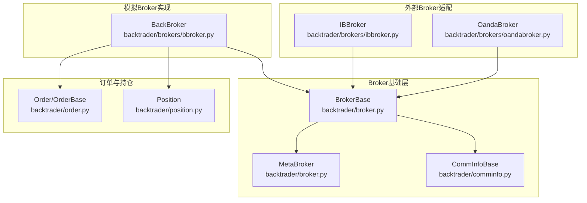
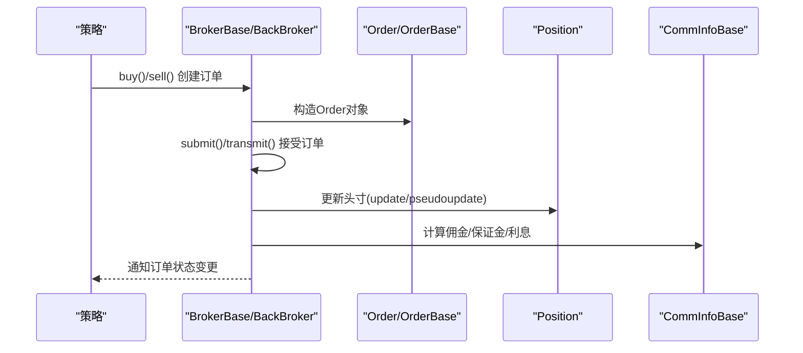
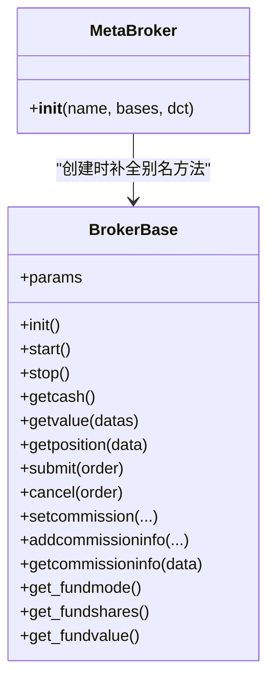
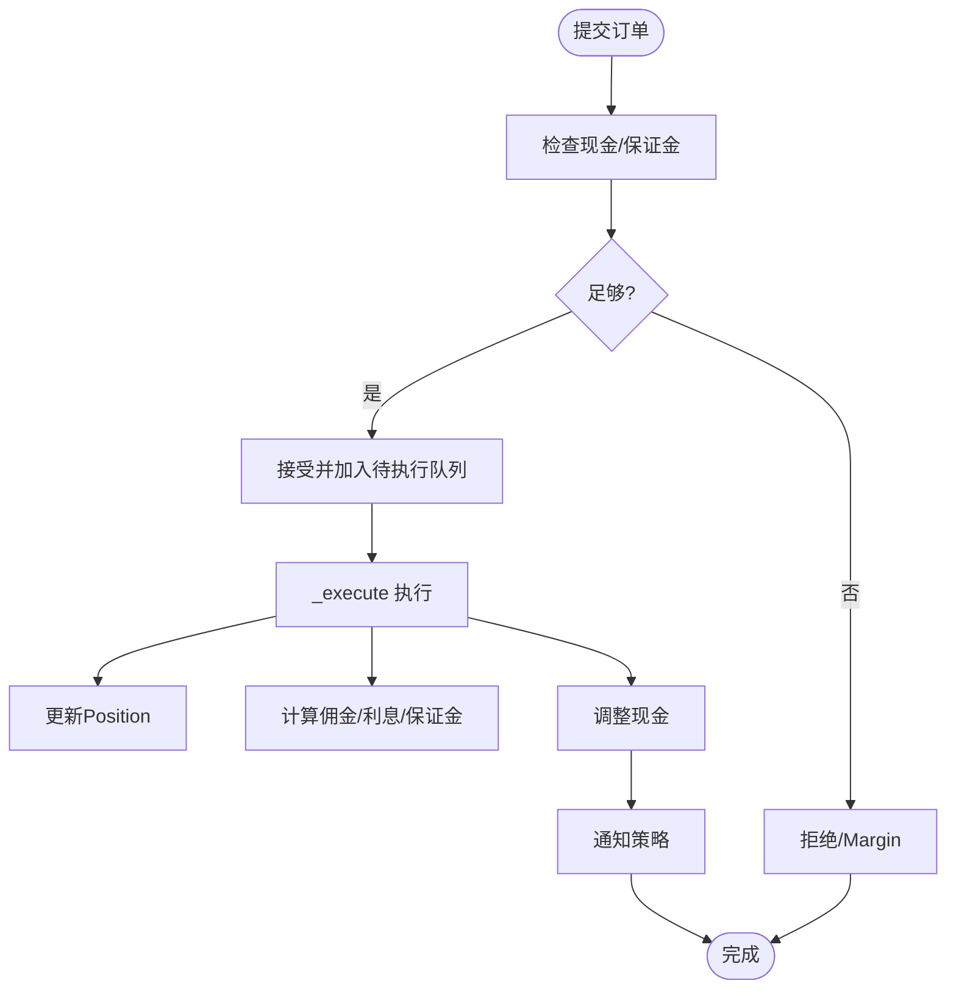
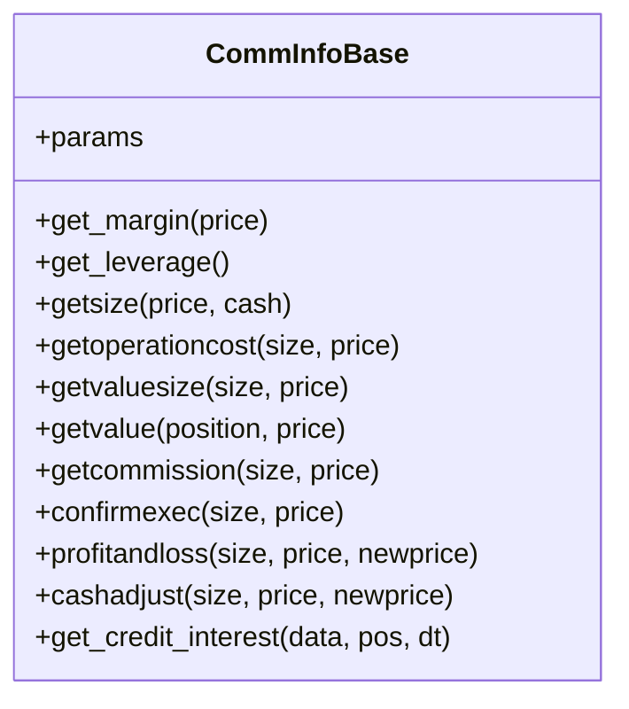
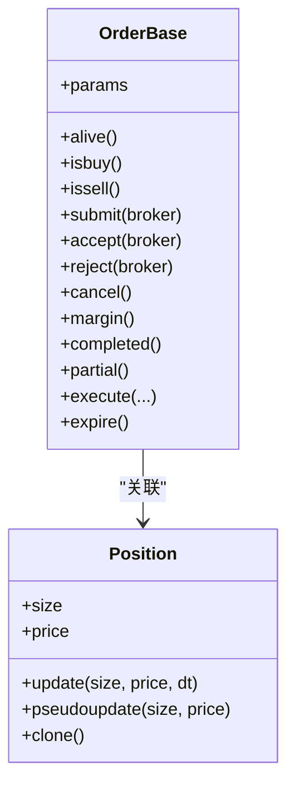
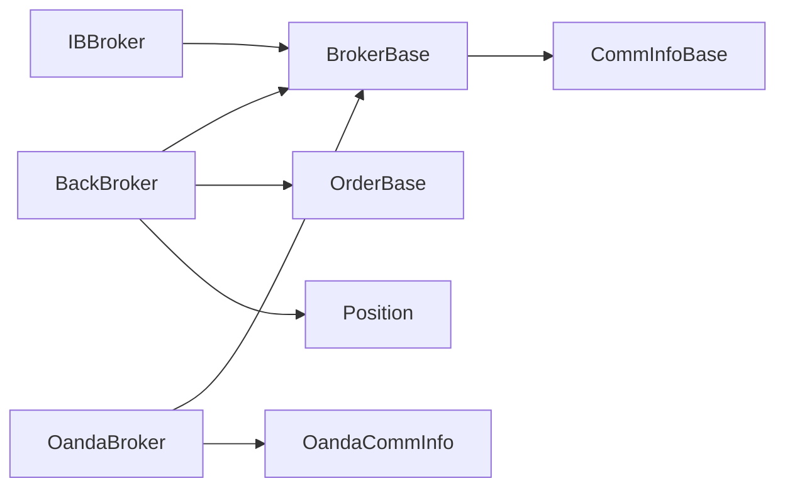

# Broker接口设计

<cite>
**本文档引用的文件**
- [backtrader/broker.py](file://backtrader/broker.py)
- [backtrader/brokers/bbroker.py](file://backtrader/brokers/bbroker.py)
- [backtrader/comminfo.py](file://backtrader/comminfo.py)
- [backtrader/order.py](file://backtrader/order.py)
- [backtrader/position.py](file://backtrader/position.py)
- [backtrader/brokers/__init__.py](file://backtrader/brokers/__init__.py)
- [backtrader/brokers/ibbroker.py](file://backtrader/brokers/ibbroker.py)
- [backtrader/brokers/oandabroker.py](file://backtrader/brokers/oandabroker.py)
- [samples/order-execution/order-execution.py](file://samples/order-execution/order-execution.py)
</cite>

## 目录
1. [简介](#简介)
2. [项目结构](#项目结构)
3. [核心组件](#核心组件)
4. [架构总览](#架构总览)
5. [详细组件分析](#详细组件分析)
6. [依赖关系分析](#依赖关系分析)
7. [性能考虑](#性能考虑)
8. [故障排除指南](#故障排除指南)
9. [结论](#结论)
10. [附录](#附录)

## 简介
本文件系统性阐述Backtrader Broker接口设计，重点覆盖：
- BrokerBase基类的架构设计与元类MetaBroker的工作机制
- 参数管理系统与佣金信息管理
- Broker接口核心方法（getcash、getvalue、getposition、submit、cancel等）的设计意图与实现要求
- 佣金信息系统CommissInfoBase的架构与功能（佣金类型、保证金管理、杠杆控制）
- 自定义Broker扩展指南
- Broker接口在策略执行中的作用及与其它组件的交互关系

## 项目结构
Backtrader的Broker相关代码主要分布在以下模块：
- 基础接口与元类：backtrader/broker.py
- 模拟Broker实现：backtrader/brokers/bbroker.py
- 佣金信息模型：backtrader/comminfo.py
- 订单模型：backtrader/order.py
- 持仓模型：backtrader/position.py
- 外部Broker适配器：backtrader/brokers/ibbroker.py、backtrader/brokers/oandabroker.py
- Broker导出入口：backtrader/brokers/__init__.py
- 使用示例：samples/order-execution/order-execution.py

图表来源
- [backtrader/broker.py](file://backtrader/broker.py#L32-L47)
- [backtrader/brokers/bbroker.py](file://backtrader/brokers/bbroker.py#L36-L242)
- [backtrader/comminfo.py](file://backtrader/comminfo.py#L30-L131)
- [backtrader/order.py](file://backtrader/order.py#L222-L320)
- [backtrader/position.py](file://backtrader/position.py#L28-L67)

章节来源
- [backtrader/broker.py](file://backtrader/broker.py#L1-L169)
- [backtrader/brokers/bbroker.py](file://backtrader/brokers/bbroker.py#L1-L242)
- [backtrader/comminfo.py](file://backtrader/comminfo.py#L1-L329)

## 核心组件
- BrokerBase：抽象Broker接口，定义所有Broker必须实现的方法与属性，提供参数系统、佣金信息管理、资金与价值计算的基础能力。
- MetaBroker：元类，负责在类创建时自动补全别名方法（如get_cash映射到getcash），确保用户习惯的命名风格。
- BackBroker：内置的Broker模拟器，支持多种订单类型、滑点、填充器、资金模式等高级特性。
- CommInfoBase：佣金信息基类，统一处理佣金类型（百分比/固定）、保证金、杠杆、利息等。
- Order/OrderBase：订单模型，定义订单状态、执行数据、生命周期管理。
- Position：持仓模型，维护单个资产的头寸规模与均价。

章节来源
- [backtrader/broker.py](file://backtrader/broker.py#L49-L169)
- [backtrader/brokers/bbroker.py](file://backtrader/brokers/bbroker.py#L36-L242)
- [backtrader/comminfo.py](file://backtrader/comminfo.py#L30-L131)
- [backtrader/order.py](file://backtrader/order.py#L222-L320)
- [backtrader/position.py](file://backtrader/position.py#L28-L67)

## 架构总览
Broker接口在Backtrader中扮演“策略与市场之间的桥梁”，负责：
- 资金管理：查询可用现金、计算总资产与净值
- 持仓管理：查询当前头寸
- 订单执行：提交、取消、跟踪订单状态
- 佣金与成本：根据资产类型与参数计算佣金、保证金、利息与盈亏
- 与策略交互：通过通知机制向策略报告订单状态变化

图表来源
- [backtrader/brokers/bbroker.py](file://backtrader/brokers/bbroker.py#L647-L685)
- [backtrader/order.py](file://backtrader/order.py#L302-L383)
- [backtrader/position.py](file://backtrader/position.py#L124-L206)
- [backtrader/comminfo.py](file://backtrader/comminfo.py#L192-L246)

## 详细组件分析

### BrokerBase与MetaBroker
- 设计要点
  - 抽象方法：getcash、getvalue、getposition、submit、cancel等均未实现，强制子类覆盖
  - 参数系统：通过MetaParams提供参数化能力，默认包含commission（默认使用CommInfoBase）
  - 元类行为：MetaBroker在类创建时自动将get_cash映射到getcash，保持API一致性
  - 佣金管理：提供setcommission、addcommissioninfo、getcommissioninfo等方法，支持按数据名称或默认方案管理佣金
  - 基金模式：支持fundmode/fundshares/fundvalue等属性，便于以基金方式评估收益

图表来源
- [backtrader/broker.py](file://backtrader/broker.py#L32-L47)
- [backtrader/broker.py](file://backtrader/broker.py#L49-L169)

章节来源
- [backtrader/broker.py](file://backtrader/broker.py#L32-L169)

### BackBroker实现详解
- 资金与价值
  - 现金管理：cash、startingcash；支持add_cash追加/提取现金
  - 价值计算：get_value支持按数据集、市价/市值、是否含杠杆返回
  - 基金模式：set_fundmode/get_fundmode，set_fundstartval，fundshares/fundvalue
- 订单生命周期
  - submit/transmit：接受订单并加入待执行队列
  - check_submitted：检查可执行性（保证金/现金约束）
  - cancel：取消订单并触发联动（OCO/Bracket）
- 执行引擎
  - _execute：核心执行逻辑，处理开仓/平仓、佣金、保证金、利息、现金调整
  - 支持填充器filler、滑点配置（百分比/固定/开盘价/匹配/限价/越界）
- 持仓管理
  - positions：按数据索引的Position集合
  - getposition：返回指定数据的Position实例
- 通知与历史
  - notifs：订单通知队列
  - add_order_history/set_fund_history：历史数据接入

图表来源
- [backtrader/brokers/bbroker.py](file://backtrader/brokers/bbroker.py#L532-L591)
- [backtrader/brokers/bbroker.py](file://backtrader/brokers/bbroker.py#L687-L806)

章节来源
- [backtrader/brokers/bbroker.py](file://backtrader/brokers/bbroker.py#L244-L806)

### 佣金信息系统CommInfoBase
- 佣金类型
  - COMM_PERC：按比例收取（支持percabs控制输入单位）
  - COMM_FIXED：按固定金额收取
- 保证金与杠杆
  - get_margin：支持固定保证金、自动保证金（基于价格或倍数）
  - get_leverage：返回杠杆倍数
- 成本与价值
  - getoperationcost：开仓所需资金
  - getvaluesize：按数量计算价值（期货按保证金）
  - getvalue：按持仓计算价值（股票短仓特殊处理）
- 盈亏与现金调整
  - profitandloss：按数量与价格差计算盈亏
  - cashadjust：期货按价格差进行现金调整
- 利息
  - get_credit_interest/_get_credit_interest：按日计收短期利息（可配置长多方向）

图表来源
- [backtrader/comminfo.py](file://backtrader/comminfo.py#L120-L306)

章节来源
- [backtrader/comminfo.py](file://backtrader/comminfo.py#L30-L329)

### 订单与持仓模型
- Order/OrderBase
  - 订单状态：Created、Submitted、Accepted、Partial、Completed、Canceled、Expired、Margin、Rejected
  - 执行数据：OrderData封装创建与执行细节，支持历史回放
  - 生命周期：submit/accept/reject/cancel/margin/completed/partial/expire
- Position
  - 维护size与price，支持update/pseudoupdate
  - 记录开仓/平仓量（upopened/upclosed），便于成本与盈亏统计

图表来源
- [backtrader/order.py](file://backtrader/order.py#L222-L320)
- [backtrader/position.py](file://backtrader/position.py#L28-L67)

章节来源
- [backtrader/order.py](file://backtrader/order.py#L222-L642)
- [backtrader/position.py](file://backtrader/position.py#L28-L207)

### 外部Broker适配器
- IBBroker（Interactive Brokers）
  - 将Backtrader订单映射到IB订单类型
  - 支持时间有效、止盈止损、追踪止损等高级特性
- OandaBroker
  - 从Oanda获取现金与价值
  - 同步现有头寸，支持Bracket订单
  - 提供Oanda专用佣金信息（OandaCommInfo）

章节来源
- [backtrader/brokers/ibbroker.py](file://backtrader/brokers/ibbroker.py#L68-L200)
- [backtrader/brokers/oandabroker.py](file://backtrader/brokers/oandabroker.py#L41-L144)

## 依赖关系分析
- BrokerBase依赖CommInfoBase进行佣金与成本计算
- BackBroker依赖Order/Position模型进行订单执行与头寸管理
- 外部Broker适配器依赖对应Store模块与Backtrader内部模型
- MetaBroker通过元类机制增强BrokerBase的可用性

图表来源
- [backtrader/broker.py](file://backtrader/broker.py#L24-L26)
- [backtrader/brokers/bbroker.py](file://backtrader/brokers/bbroker.py#L28-L31)
- [backtrader/brokers/oandabroker.py](file://backtrader/brokers/oandabroker.py#L41-L77)

章节来源
- [backtrader/broker.py](file://backtrader/broker.py#L24-L26)
- [backtrader/brokers/bbroker.py](file://backtrader/brokers/bbroker.py#L28-L31)
- [backtrader/brokers/oandabroker.py](file://backtrader/brokers/oandabroker.py#L41-L77)

## 性能考虑
- 订单批处理：BackBroker通过队列批量检查可执行订单，减少重复计算
- 价值计算缓存：get_value内部缓存中间值，避免重复计算
- 滑点与填充器：合理配置filler与滑点参数，平衡真实度与性能
- 基金模式：启用fundmode时需同步历史数据，注意内存占用

## 故障排除指南
- 订单被拒绝（Margin）：检查cash与保证金计算是否正确，确认setcommission配置
- 订单未成交：核对filler与滑点设置，确认数据流与时间窗口
- 头寸异常：检查Position.update逻辑与佣金/利息影响
- 外部Broker连接问题：确认Store配置与网络状态

章节来源
- [backtrader/brokers/bbroker.py](file://backtrader/brokers/bbroker.py#L558-L591)
- [backtrader/comminfo.py](file://backtrader/comminfo.py#L169-L186)

## 结论
Backtrader的Broker接口通过清晰的抽象与强大的扩展能力，为策略执行提供了稳定可靠的基础设施。BrokerBase定义了统一契约，MetaBroker增强了易用性，CommInfoBase提供了灵活的成本与风险模型，BackBroker展示了完整的实现范式，而外部Broker适配器则拓展了生态兼容性。遵循本文档的扩展指南与最佳实践，可高效构建符合业务需求的自定义Broker。

## 附录

### Broker接口核心方法设计意图与实现要求
- getcash：返回当前可用现金，BackBroker直接返回cash
- getvalue：返回总资产或指定数据集的价值，支持市价/市值与杠杆选项
- getposition：返回指定数据的Position实例
- submit：接受订单并进入待执行队列，BackBroker实现transmit与check_submitted
- cancel：取消订单并触发联动（OCO/Bracket），BackBroker实现取消逻辑
- buy/sell：构造订单并提交，BackBroker提供完整参数支持

章节来源
- [backtrader/broker.py](file://backtrader/broker.py#L112-L163)
- [backtrader/brokers/bbroker.py](file://backtrader/brokers/bbroker.py#L647-L685)

### 佣金信息管理最佳实践
- 选择合适的佣金类型：股票使用百分比佣金，期货使用固定保证金
- 正确设置margin与leverage：确保保证金计算与实际交易规则一致
- 配置interest与interest_long：模拟隔夜成本对策略的影响
- 使用addcommissioninfo按数据维度精细化管理

章节来源
- [backtrader/comminfo.py](file://backtrader/comminfo.py#L120-L131)
- [backtrader/broker.py](file://backtrader/broker.py#L77-L110)

### 自定义Broker扩展指南
- 继承BrokerBase并实现抽象方法
- 在__init__中初始化内部状态（如cash、positions、orders等）
- 实现getcash/getvalue/getposition/submit/cancel等方法
- 可选：重写MetaBroker以定制别名方法或行为
- 可选：提供自定义CommInfoBase子类以适配特定交易成本结构

章节来源
- [backtrader/broker.py](file://backtrader/broker.py#L49-L169)
- [backtrader/comminfo.py](file://backtrader/comminfo.py#L30-L131)

### 使用示例参考
- 订单执行示例：展示不同执行类型的下单流程与通知处理

章节来源
- [samples/order-execution/order-execution.py](file://samples/order-execution/order-execution.py#L52-L78)