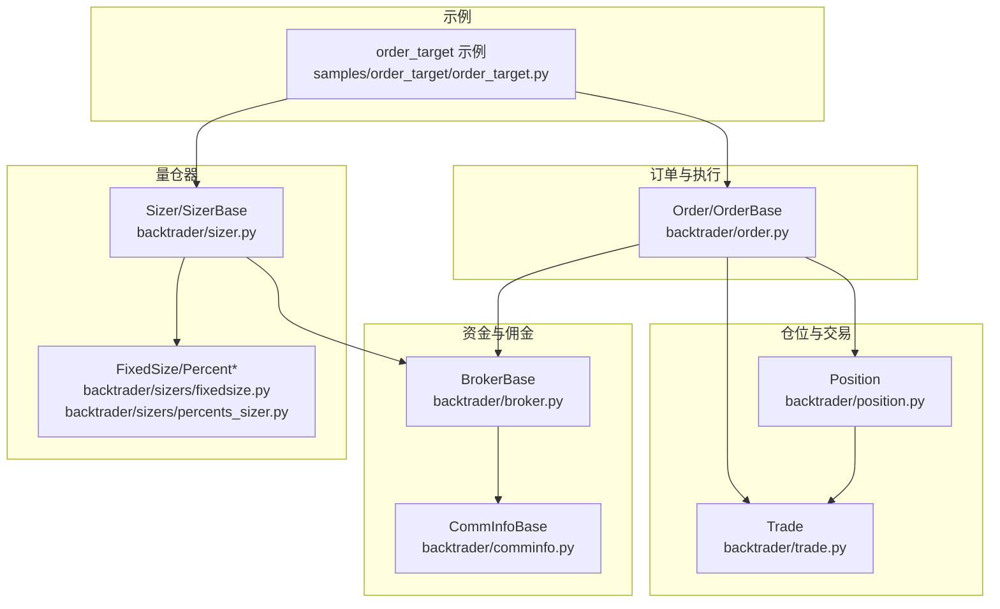
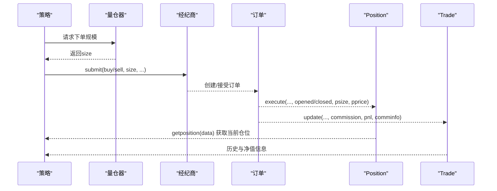
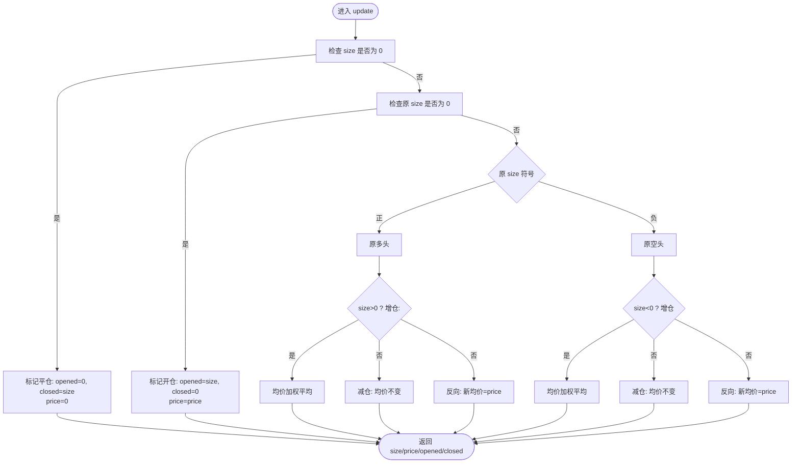
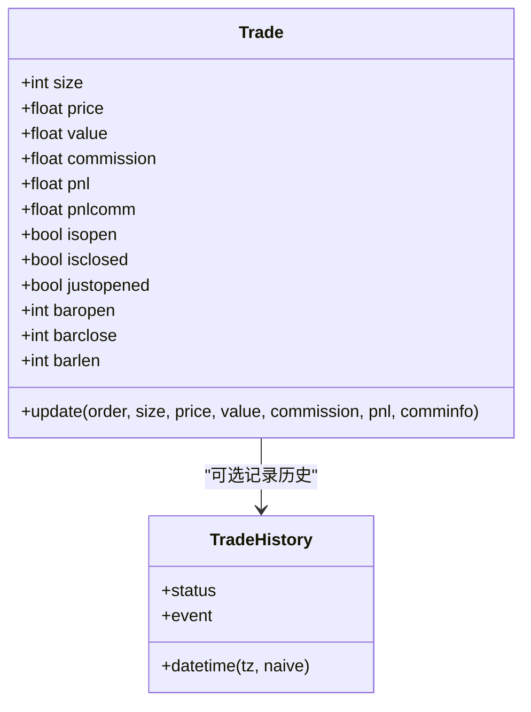
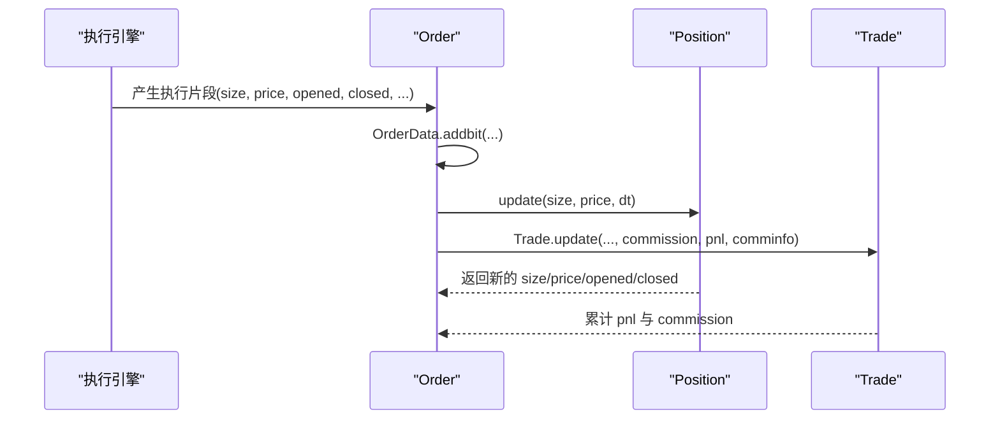
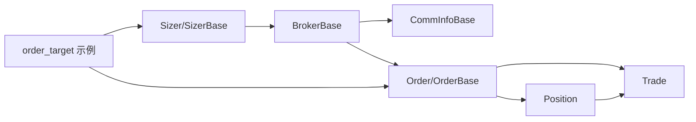

# 仓位管理

<cite>
**本文引用的文件**
- [backtrader/position.py](file://backtrader/position.py)
- [backtrader/trade.py](file://backtrader/trade.py)
- [backtrader/order.py](file://backtrader/order.py)
- [backtrader/broker.py](file://backtrader/broker.py)
- [backtrader/comminfo.py](file://backtrader/comminfo.py)
- [backtrader/sizer.py](file://backtrader/sizer.py)
- [backtrader/sizers/fixedsize.py](file://backtrader/sizers/fixedsize.py)
- [backtrader/sizers/percents_sizer.py](file://backtrader/sizers/percents_sizer.py)
- [samples/order_target/order_target.py](file://samples/order_target/order_target.py)
</cite>

## 目录
1. [引言](#引言)
2. [项目结构](#项目结构)
3. [核心组件](#核心组件)
4. [架构总览](#架构总览)
5. [详细组件分析](#详细组件分析)
6. [依赖关系分析](#依赖关系分析)
7. [性能考量](#性能考量)
8. [故障排查指南](#故障排查指南)
9. [结论](#结论)
10. [附录：配置与参数指南](#附录配置与参数指南)

## 引言
本文件系统性梳理 Backtrader 的仓位管理体系，围绕 Position 类的设计与实现，解释多头/空头统一管理、仓位计算（均价、浮动盈亏、保证金占用）、仓位变更（开仓、加仓、减仓、平仓）的触发与处理逻辑，以及与订单执行、佣金与杠杆、资金量仓器（Sizers）之间的协作关系。同时给出风险控制（最大仓位、止损止盈）与参数配置建议，并通过实际示例展示目标仓位下单的应用场景。

## 项目结构
围绕仓位管理的关键模块与文件如下：
- 仓位与交易实体：position.py、trade.py
- 订单与执行：order.py
- 经纪商与资金接口：broker.py
- 佣金与保证金模型：comminfo.py
- 资金量仓器：sizer.py、sizers/fixedsize.py、sizers/percents_sizer.py
- 示例：samples/order_target/order_target.py

图表来源
- [backtrader/position.py](file://backtrader/position.py#L28-L207)
- [backtrader/trade.py](file://backtrader/trade.py#L94-L312)
- [backtrader/order.py](file://backtrader/order.py#L222-L642)
- [backtrader/broker.py](file://backtrader/broker.py#L49-L169)
- [backtrader/comminfo.py](file://backtrader/comminfo.py#L30-L329)
- [backtrader/sizer.py](file://backtrader/sizer.py#L29-L85)
- [backtrader/sizers/fixedsize.py](file://backtrader/sizers/fixedsize.py#L27-L109)
- [backtrader/sizers/percents_sizer.py](file://backtrader/sizers/percents_sizer.py#L29-L91)
- [samples/order_target/order_target.py](file://samples/order_target/order_target.py#L30-L114)

章节来源
- [backtrader/position.py](file://backtrader/position.py#L28-L207)
- [backtrader/trade.py](file://backtrader/trade.py#L94-L312)
- [backtrader/order.py](file://backtrader/order.py#L222-L642)
- [backtrader/broker.py](file://backtrader/broker.py#L49-L169)
- [backtrader/comminfo.py](file://backtrader/comminfo.py#L30-L329)
- [backtrader/sizer.py](file://backtrader/sizer.py#L29-L85)
- [backtrader/sizers/fixedsize.py](file://backtrader/sizers/fixedsize.py#L27-L109)
- [backtrader/sizers/percents_sizer.py](file://backtrader/sizers/percents_sizer.py#L29-L91)
- [samples/order_target/order_target.py](file://samples/order_target/order_target.py#L30-L114)

## 核心组件
- Position：统一记录单个标的的“数量/均价”，支持多头与空头的统一管理；提供更新、克隆、伪更新等能力。
- Trade：跟踪一次交易从开仓到平仓的生命周期，维护累计佣金、毛利/净利润、历史快照等。
- Order/OrderBase：封装订单状态、执行片段、限价/止损/追踪止损等执行类型，负责向 Position/Trade 推送执行结果。
- BrokerBase：抽象经纪商接口，提供资金、价值、佣金方案查询、下单等能力。
- CommInfoBase：抽象佣金与保证金模型，支持按比例/固定、保证金自动计算、杠杆、隔夜利息等。
- Sizer/SizerBase 及其子类：根据策略上下文（现金、数据价格、佣金方案）决定下单手数或目标规模。

章节来源
- [backtrader/position.py](file://backtrader/position.py#L28-L207)
- [backtrader/trade.py](file://backtrader/trade.py#L94-L312)
- [backtrader/order.py](file://backtrader/order.py#L222-L642)
- [backtrader/broker.py](file://backtrader/broker.py#L49-L169)
- [backtrader/comminfo.py](file://backtrader/comminfo.py#L30-L329)
- [backtrader/sizer.py](file://backtrader/sizer.py#L29-L85)

## 架构总览
Backtrader 的仓位管理以“订单驱动”为核心：策略通过 Sizer 决定下单规模，经由 Broker 提交到交易所/市场，订单在成交后通过 OrderData/OrderExecutionBit 将“开仓/平仓/减仓”的片段回传给 Position 与 Trade，从而统一更新持仓均价、未结盈亏与历史。

图表来源
- [backtrader/sizer.py](file://backtrader/sizer.py#L50-L77)
- [backtrader/broker.py](file://backtrader/broker.py#L142-L163)
- [backtrader/order.py](file://backtrader/order.py#L502-L581)
- [backtrader/position.py](file://backtrader/position.py#L124-L206)
- [backtrader/trade.py](file://backtrader/trade.py#L220-L312)

## 详细组件分析

### Position 类设计与统一管理
- 设计要点
  - 统一记录 size（可正可负）与 price（均价），无资产绑定，仅保存数量与价格。
  - 支持 set/update 两种更新路径：set 用于直接设定目标状态；update 用于增量式推进。
  - 提供 upopened/upclosed 字段，标识本次更新中“开仓/平仓”的数量份额，便于统计与风控。
  - 提供 fix/set/clone/pseudoupdate 等辅助方法，满足不同场景下的状态修正与模拟更新。
- 多头/空头统一管理
  - size 正值表示多头，负值表示空头；通过符号一致/相反判断同边/反向，从而正确计算均价与开平仓份额。
- 关键算法
  - 增仓：均价按加权平均更新。
  - 减仓：均价不变。
  - 反向：均价更新为新价格，且 upopened 与 upclosed 分别记录“新开/平旧”的份额。
- 性能与复杂度
  - update/set 均为 O(1)，适合高频回测与实盘。

图表来源
- [backtrader/position.py](file://backtrader/position.py#L124-L206)

章节来源
- [backtrader/position.py](file://backtrader/position.py#L28-L207)

### Trade 生命周期与净值计算
- 生命周期
  - Created → Open → Closed；记录开仓/平仓时间、持有周期 barlen、justopened/isopen/isclosed 标志位。
- 净值与盈亏
  - 增仓：均价加权更新。
  - 减仓：按 comminfo.profitandloss 计算已平部分的利润/亏损并累加。
  - 持仓价值 value 由 comminfo.getvaluesize 计算（期货按保证金价值，股票按市价）。
- 历史记录
  - 可开启 historyon，每次更新生成 TradeHistory 快照，包含状态、价格、数量、pnl、pnlcomm 等。

图表来源
- [backtrader/trade.py](file://backtrader/trade.py#L94-L312)

章节来源
- [backtrader/trade.py](file://backtrader/trade.py#L94-L312)

### 订单执行与 Position/Trade 更新
- 执行片段
  - OrderData/OrderExecutionBit 记录每笔成交的 size/price 与“开仓/平仓”拆分，支持累积 remsize、价值、佣金、pnl。
- 回推到 Position/Trade
  - Order.execute 将执行片段写入 OrderData；随后由上层逻辑调用 Position.update 与 Trade.update 完成状态推进。
- 执行类型
  - 支持 Market/Limit/Stop/StopLimit/StopTrail/StopTrailLimit/Historical 等；其中 Trail/TrailLimit 会动态调整触发价。

图表来源
- [backtrader/order.py](file://backtrader/order.py#L502-L581)
- [backtrader/position.py](file://backtrader/position.py#L124-L206)
- [backtrader/trade.py](file://backtrader/trade.py#L220-L312)

章节来源
- [backtrader/order.py](file://backtrader/order.py#L35-L221)
- [backtrader/order.py](file://backtrader/order.py#L502-L642)
- [backtrader/position.py](file://backtrader/position.py#L124-L206)
- [backtrader/trade.py](file://backtrader/trade.py#L220-L312)

### 佣金与保证金模型（CommInfo）
- 关键能力
  - getoperationcost：单次操作所需资金（期货按保证金，股票按价格）。
  - getvaluesize/value：按市价/保证金计算头寸价值。
  - profitandloss：按合约乘数计算利润/亏损。
  - get_margin/get_leverage：保证金与杠杆策略。
  - interest/credit interest：隔夜利息与信用成本。
- 与 Position/Trade 协作
  - Trade.update 使用 comminfo.profitandloss 计算已平仓部分的收益。
  - Position.update 不直接使用佣金，但后续 Trade/Broker 层面会综合考虑。

章节来源
- [backtrader/comminfo.py](file://backtrader/comminfo.py#L169-L273)

### 资金量仓器（Sizers）
- SizerBase
  - getsizing：统一入口，调用 _getsizing 并注入 comminfo、cash、data、isbuy。
- 固定手数
  - FixedSize：固定 stake，支持 tranches 切分。
  - FixedReverser：开仓返回 stake，反仓返回 2*stake。
  - FixedSizeTarget：目标规模量仓，支持 tranches 与上限约束。
- 百分比量仓
  - PercentSizer：按可用资金百分比下单；AllInSizer/Int 版本分别取整或全仓。
  - 与 Position 协作：可通过 broker.getposition(data) 获取当前头寸，避免重复下单。

章节来源
- [backtrader/sizer.py](file://backtrader/sizer.py#L50-L77)
- [backtrader/sizers/fixedsize.py](file://backtrader/sizers/fixedsize.py#L27-L109)
- [backtrader/sizers/percents_sizer.py](file://backtrader/sizers/percents_sizer.py#L29-L91)

### 实际应用场景：目标仓位下单
- 场景说明
  - 策略根据日期规则或信号计算目标仓位规模/价值/比例，通过 order_target_* 下单，使实际仓位收敛至目标。
- 示例要点
  - 使用 cerebro.broker.setcash 设置初始资金。
  - 在 next 中读取 broker.get_value 与 broker.getposition，结合 Sizer 或直接计算目标差额下单。
  - 示例展示了 order_target_size/value/percent 三种方式的切换演示。

章节来源
- [samples/order_target/order_target.py](file://samples/order_target/order_target.py#L66-L114)

## 依赖关系分析
- Position 与 Trade：Position 负责“数量/均价”，Trade 负责“交易生命周期与净值”。二者通过订单执行片段协同更新。
- Order 与 Position/Trade：Order.execute 将执行片段写入 OrderData，再由上层推进 Position.update 与 Trade.update。
- Broker 与 Sizer：Sizer 依赖 broker.getcash、getposition、getcommissioninfo 获取上下文，决定下单规模。
- Broker 与 CommInfo：Broker.setcommission/addcommissioninfo 注入佣金方案，供 CommInfoBase 计算费用与价值。
- 示例与框架：samples/order_target/order_target.py 展示了策略如何结合 Sizer 与目标下单实现仓位管理。

图表来源
- [backtrader/sizer.py](file://backtrader/sizer.py#L50-L77)
- [backtrader/broker.py](file://backtrader/broker.py#L77-L111)
- [backtrader/comminfo.py](file://backtrader/comminfo.py#L192-L228)
- [backtrader/order.py](file://backtrader/order.py#L502-L581)
- [backtrader/position.py](file://backtrader/position.py#L124-L206)
- [backtrader/trade.py](file://backtrader/trade.py#L220-L312)
- [samples/order_target/order_target.py](file://samples/order_target/order_target.py#L66-L114)

章节来源
- [backtrader/sizer.py](file://backtrader/sizer.py#L50-L77)
- [backtrader/broker.py](file://backtrader/broker.py#L77-L111)
- [backtrader/comminfo.py](file://backtrader/comminfo.py#L192-L228)
- [backtrader/order.py](file://backtrader/order.py#L502-L581)
- [backtrader/position.py](file://backtrader/position.py#L124-L206)
- [backtrader/trade.py](file://backtrader/trade.py#L220-L312)
- [samples/order_target/order_target.py](file://samples/order_target/order_target.py#L66-L114)

## 性能考量
- Position.update/set 为纯数学运算，O(1) 时间复杂度，适合高频回测。
- OrderData 累积执行片段时采用 deque 存储，remsize 与均价滚动更新，整体高效。
- CommInfoBase 的 getoperationcost/getvaluesize/profitandloss 为常数级计算，开销极低。
- 建议
  - 避免在回测主循环中频繁调用 broker.get_value 等昂贵操作（可在策略层缓存）。
  - 对于高并发实盘，确保 OrderData 的线程安全与批量推送策略。

## 故障排查指南
- 仓位方向异常
  - 检查下单 size 符号是否与期望一致（buy 为正，sell 为负）。
  - 确认 Position.update 的 size 参数是否为“净变化量”而非目标量。
- 均价不更新或异常
  - 确保增仓场景下传入的新 price 有效；反向时均价应更新为新 price。
- 盈亏与净值不符
  - 检查 CommInfoBase 的 stocklike/mult/commtype 设置是否与产品匹配。
  - 确认 Trade.update 中 commission 与 pnl 的累加逻辑未被跳过。
- 订单未成交或过期
  - 检查 Order.expire 与 valid/dteos 的边界条件。
  - 对 Stop/StopLimit/Trail 类型，确认触发价与限价设置是否合理。

章节来源
- [backtrader/position.py](file://backtrader/position.py#L124-L206)
- [backtrader/trade.py](file://backtrader/trade.py#L220-L312)
- [backtrader/order.py](file://backtrader/order.py#L584-L618)
- [backtrader/comminfo.py](file://backtrader/comminfo.py#L192-L249)

## 结论
Backtrader 的仓位管理以 Position 为核心，配合 Trade、Order、Broker、CommInfo 与 Sizer 形成闭环：策略通过 Sizer 决策规模，Broker 提交订单，订单执行片段推动 Position 与 Trade 更新，最终形成统一的多头/空头管理、均价与浮动盈亏计算、历史与净值追踪。该体系具备清晰的职责分离、良好的扩展性与高效的性能特征，适用于多种市场与产品形态。

## 附录：配置与参数指南
- 佣金与保证金（Broker.setcommission/addcommissioninfo）
  - commission：手续费（比例或固定）。
  - margin：保证金；automargin 控制是否自动按 price/mult 计算。
  - mult：合约乘数；stocklike 控制按市价或保证金计算价值。
  - commtype：COMM_PERC/COMM_FIXED；percabs 控制百分比输入单位。
  - interest/interest_long：隔夜利息与是否对多空均收费。
  - leverage：杠杆倍数。
- 量仓器（Sizer）
  - FixedSize：stake、tranches。
  - FixedReverser：stake。
  - FixedSizeTarget：stake、tranches；内部限制不超过目标规模。
  - PercentSizer/AllIn：percents、retint（是否取整）。
- 示例参考
  - samples/order_target/order_target.py 展示了目标规模/价值/比例的下单流程与日志输出。

章节来源
- [backtrader/broker.py](file://backtrader/broker.py#L85-L111)
- [backtrader/comminfo.py](file://backtrader/comminfo.py#L120-L131)
- [backtrader/comminfo.py](file://backtrader/comminfo.py#L192-L249)
- [backtrader/sizers/fixedsize.py](file://backtrader/sizers/fixedsize.py#L40-L109)
- [backtrader/sizers/percents_sizer.py](file://backtrader/sizers/percents_sizer.py#L36-L91)
- [samples/order_target/order_target.py](file://samples/order_target/order_target.py#L66-L114)