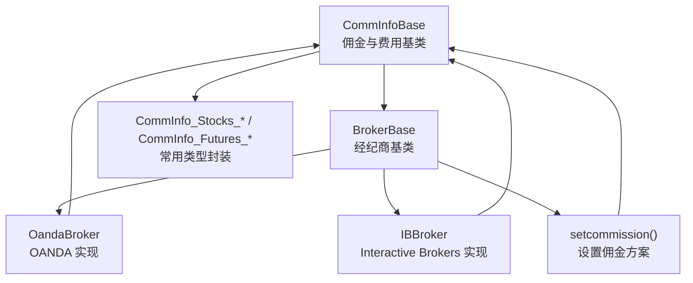
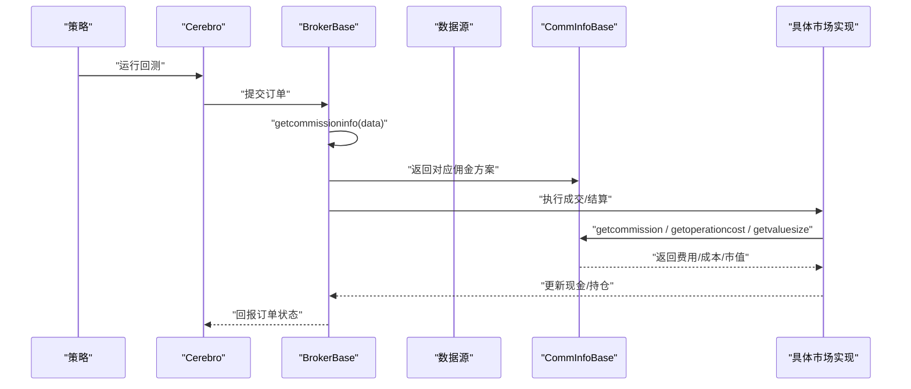
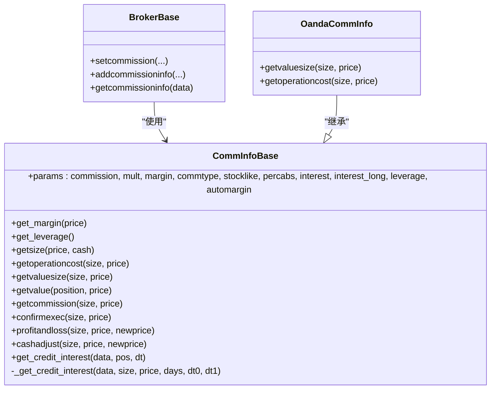
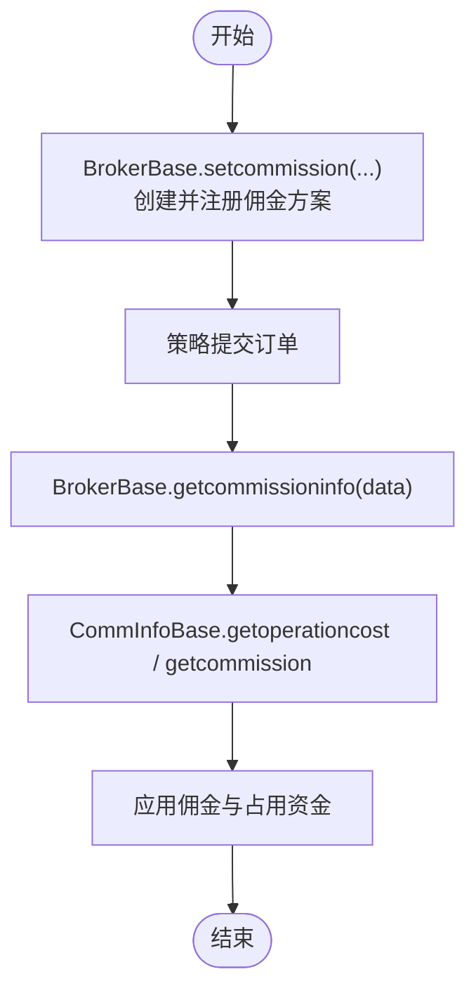
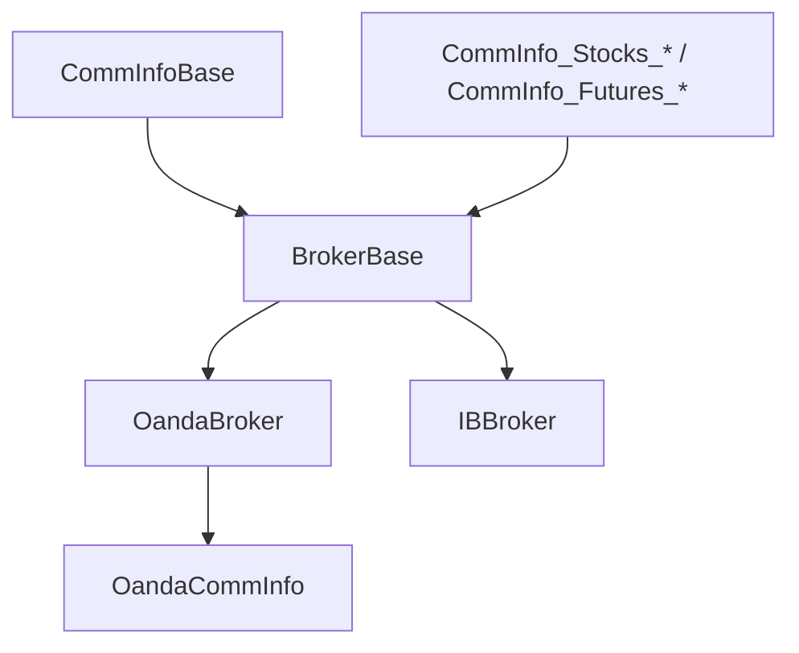

# 佣金与费用系统

<cite>
**本文引用的文件**
- [backtrader/comminfo.py](file://backtrader/comminfo.py)
- [backtrader/broker.py](file://backtrader/broker.py)
- [backtrader/brokers/oandabroker.py](file://backtrader/brokers/oandabroker.py)
- [backtrader/brokers/ibbroker.py](file://backtrader/brokers/ibbroker.py)
- [backtrader/commissions/__init__.py](file://backtrader/commissions/__init__.py)
- [samples/commission-schemes/commission-schemes.py](file://samples/commission-schemes/commission-schemes.py)
- [tests/test_comminfo.py](file://tests/test_comminfo.py)
</cite>

## 目录
1. [引言](#引言)
2. [项目结构](#项目结构)
3. [核心组件](#核心组件)
4. [架构总览](#架构总览)
5. [详细组件分析](#详细组件分析)
6. [依赖关系分析](#依赖关系分析)
7. [性能考量](#性能考量)
8. [故障排查指南](#故障排查指南)
9. [结论](#结论)
10. [附录](#附录)

## 引言
本技术文档围绕 Backtrader 的佣金与费用系统展开，重点解析 CommInfoBase 类的架构设计与实现细节，涵盖佣金计算模型、保证金管理、杠杆控制、信用利息、以及在股票、期货、外汇等市场中的差异化处理。文档同时提供配置最佳实践、性能影响与优化策略，并给出可操作的调试方法与示例路径。

## 项目结构
与佣金与费用系统直接相关的核心模块与文件如下：
- 佣金与费用基类：backtrader/comminfo.py
- 经纪商接口与默认佣金注入：backtrader/broker.py
- 具体市场佣金实现（以 OANDA 为例）：backtrader/brokers/oandabroker.py
- 与 IB 相关的订单与佣金交互（概念性说明）：backtrader/brokers/ibbroker.py
- 常用佣金类型封装：backtrader/commissions/__init__.py
- 示例与命令行参数演示：samples/commission-schemes/commission-schemes.py
- 单元测试与行为验证：tests/test_comminfo.py

图表来源
- [backtrader/comminfo.py](file://backtrader/comminfo.py#L30-L329)
- [backtrader/broker.py](file://backtrader/broker.py#L49-L169)
- [backtrader/brokers/oandabroker.py](file://backtrader/brokers/oandabroker.py#L41-L77)
- [backtrader/commissions/__init__.py](file://backtrader/commissions/__init__.py#L27-L64)

章节来源
- [backtrader/comminfo.py](file://backtrader/comminfo.py#L30-L329)
- [backtrader/broker.py](file://backtrader/broker.py#L49-L169)
- [backtrader/brokers/oandabroker.py](file://backtrader/brokers/oandabroker.py#L41-L77)
- [backtrader/commissions/__init__.py](file://backtrader/commissions/__init__.py#L27-L64)

## 核心组件
- CommInfoBase：定义佣金类型、保证金、杠杆、信用利息、多头/空头价值评估、佣金计算、利润与损失、现金调整等核心逻辑。
- BrokerBase：提供 setcommission/addcommissioninfo/getcommissioninfo 等接口，负责将数据与佣金方案绑定。
- 具体市场实现：如 OANDA 的 OandaCommInfo 对某些市场特性（如按市价计值）进行覆盖。
- 常用封装：CommInfo_Stocks_* / CommInfo_Futures_* 提供面向股票与期货的便捷类型。

章节来源
- [backtrader/comminfo.py](file://backtrader/comminfo.py#L30-L329)
- [backtrader/broker.py](file://backtrader/broker.py#L77-L111)
- [backtrader/brokers/oandabroker.py](file://backtrader/brokers/oandabroker.py#L41-L49)
- [backtrader/commissions/__init__.py](file://backtrader/commissions/__init__.py#L27-L64)

## 架构总览
下图展示从策略到经纪商再到佣金方案的整体调用链路，以及佣金方案在不同市场中的差异化实现。

图表来源
- [backtrader/broker.py](file://backtrader/broker.py#L77-L111)
- [backtrader/comminfo.py](file://backtrader/comminfo.py#L192-L249)
- [backtrader/brokers/oandabroker.py](file://backtrader/brokers/oandabroker.py#L41-L49)

## 详细组件分析

### CommInfoBase 类详解
- 参数与属性
  - commission：基础佣金值（百分比或固定金额）
  - mult：乘数，用于价值/收益计算
  - margin：保证金金额；若为 None 则按自动保证金策略计算
  - automargin：自动保证金开关，支持三种策略（固定保证金、按价格×倍数、按价格×系数）
  - commtype：佣金类型（COMM_PERC 或 COMM_FIXED），None 时兼容旧版逻辑
  - stocklike：是否按股票模式处理（百分比佣金、按价格计值）
  - percabs：百分比表达方式（绝对 0.x 或相对 xx%）
  - interest / interest_long：按年计的信用利息与是否对多空双向收费
  - leverage：杠杆倍数
- 关键方法
  - get_margin(price)：根据 automargin 策略返回单单位保证金
  - get_leverage()：返回杠杆倍数
  - getsize(price, cash)：基于资金与保证金/价格计算可用规模
  - getoperationcost(size, price)：一次交易所需占用资金（保证金或成交金额）
  - getvaluesize(size, price)：按市价计算的头寸价值（期货按保证金计值）
  - getvalue(position, price)：头寸当前价值（股票空头按价格差调整）
  - getcommission(size, price) / confirmexec(size, price)：佣金计算（预执行/已执行）
  - profitandloss(size, price, newprice)：利润与损失
  - cashadjust(size, price, newprice)：因价格变动产生的现金调整（期货）
  - get_credit_interest(data, pos, dt) / _get_credit_interest(...)：信用利息计算
- 初始化兼容逻辑
  - 当 commtype 为 None 时，依据 margin 是否存在决定 stocklike 与 commtype 的最终取值，以兼容旧版 CommissionInfo 行为

图表来源
- [backtrader/comminfo.py](file://backtrader/comminfo.py#L30-L329)
- [backtrader/broker.py](file://backtrader/broker.py#L77-L111)
- [backtrader/brokers/oandabroker.py](file://backtrader/brokers/oandabroker.py#L41-L49)

章节来源
- [backtrader/comminfo.py](file://backtrader/comminfo.py#L30-L329)

### 佣金类型与计算模型
- 比例佣金（COMM_PERC）
  - 计算公式：abs(size) × commission × price
  - 适用于股票与期货的“按成交额”收费场景
- 固定佣金（COMM_FIXED）
  - 计算公式：abs(size) × commission（每手/每份额固定费用）
  - 适用于期货“单边/双边手续费”或场外市场
- 自动保证金（automargin）
  - 三种策略：固定保证金、按 price×mult、按 price×automargin
  - 用于动态保证金估算，提升回测与实盘一致性

章节来源
- [backtrader/comminfo.py](file://backtrader/comminfo.py#L169-L186)
- [backtrader/comminfo.py](file://backtrader/comminfo.py#L229-L245)

### 保证金管理与杠杆控制
- 保证金（margin）
  - 若未设置且非股票模式，默认 margin=1.0，避免 None/0 导致除零或逻辑异常
- 自动保证金（automargin）
  - 支持 price×mult 或 price×automargin 两种动态策略，便于模拟真实保证金曲线
- 杠杆（leverage）
  - 通过 getsize 与 getoperationcost 融合杠杆，决定可用规模与占用资金
- 现金调整（cashadjust）
  - 仅期货模式生效，用于反映未平仓合约的浮动盈亏对可用现金的影响

章节来源
- [backtrader/comminfo.py](file://backtrader/comminfo.py#L153-L154)
- [backtrader/comminfo.py](file://backtrader/comminfo.py#L187-L197)
- [backtrader/comminfo.py](file://backtrader/comminfo.py#L251-L256)

### 不同市场的费用结构差异
- 股票市场
  - stocklike=True，按价格计值，佣金通常为比例佣金
  - 空头价值随价格下降而上升，体现做空收益
- 期货市场
  - stocklike=False，按保证金计值，佣金常为固定费用
  - 现金调整与保证金联动，反映浮动盈亏
- 外汇市场（以 OANDA 为例）
  - OandaCommInfo 将 getvaluesize 与 getoperationcost 设计为按市价计值，贴近真实外汇保证金占用
  - 适合以点值/点差为主的交易成本建模

章节来源
- [backtrader/commissions/__init__.py](file://backtrader/commissions/__init__.py#L27-L64)
- [backtrader/brokers/oandabroker.py](file://backtrader/brokers/oandabroker.py#L41-L49)

### 信用利息（Short Interest）机制
- 年化利率 interest 以绝对值输入（例如 0.05 表示 5%）
- 默认按天计息：days × price × abs(size) × (interest / 365)
- 可通过重写 _get_credit_interest 实现更复杂的计息规则（如按持仓时间分段）

章节来源
- [backtrader/comminfo.py](file://backtrader/comminfo.py#L87-L103)
- [backtrader/comminfo.py](file://backtrader/comminfo.py#L258-L305)

### 与经纪商的集成流程
- BrokerBase.setcommission
  - 创建 CommInfoBase 实例并注册到内部映射表
- BrokerBase.getcommissioninfo
  - 根据数据名称选择对应佣金方案（默认 None）
- 订单执行阶段
  - 使用 CommInfoBase 计算佣金、占用资金、现金调整等

图表来源
- [backtrader/broker.py](file://backtrader/broker.py#L85-L111)
- [backtrader/comminfo.py](file://backtrader/comminfo.py#L199-L245)

章节来源
- [backtrader/broker.py](file://backtrader/broker.py#L77-L111)
- [backtrader/comminfo.py](file://backtrader/comminfo.py#L199-L245)

### 示例与调试方法
- 示例脚本
  - samples/commission-schemes/commission-schemes.py 展示如何通过命令行参数设置 commission、mult、margin、commtype、stocklike、percabs 等，并运行策略观察佣金对交易的影响
- 单元测试
  - tests/test_comminfo.py 验证股票与期货场景下的 getoperationcost、getvalue、getcommission、profitandloss、cashadjust 等关键函数的行为
- 调试建议
  - 在策略中打印 order.executed.comm 与 order.executed.value，核对佣金与成交额
  - 使用不同的 commtype 与 stocklike 组合对比策略收益曲线
  - 对于外汇/期货，关注 cashadjust 与 getvaluesize 的差异

章节来源
- [samples/commission-schemes/commission-schemes.py](file://samples/commission-schemes/commission-schemes.py#L105-L126)
- [tests/test_comminfo.py](file://tests/test_comminfo.py#L30-L86)

## 依赖关系分析
- CommInfoBase 是所有佣金方案的统一抽象，被 BrokerBase 与各市场实现所依赖
- 常用封装 CommInfo_Stocks_* / CommInfo_Futures_* 通过参数组合快速切换佣金类型与市场模式
- OANDA 实现通过 OandaCommInfo 覆盖 getvaluesize 与 getoperationcost，适配外汇按市价计值的特性

图表来源
- [backtrader/comminfo.py](file://backtrader/comminfo.py#L30-L329)
- [backtrader/broker.py](file://backtrader/broker.py#L49-L169)
- [backtrader/brokers/oandabroker.py](file://backtrader/brokers/oandabroker.py#L41-L77)
- [backtrader/commissions/__init__.py](file://backtrader/commissions/__init__.py#L27-L64)

章节来源
- [backtrader/comminfo.py](file://backtrader/comminfo.py#L30-L329)
- [backtrader/broker.py](file://backtrader/broker.py#L49-L169)
- [backtrader/brokers/oandabroker.py](file://backtrader/brokers/oandabroker.py#L41-L77)
- [backtrader/commissions/__init__.py](file://backtrader/commissions/__init__.py#L27-L64)

## 性能考量
- 佣金计算复杂度
  - 多数方法为 O(1)，计算开销极低，对整体性能影响可忽略
- 自动保证金与杠杆
  - automargin 与 leverage 的组合会改变 getsize 的计算结果，间接影响下单规模与回撤表现
- 信用利息
  - get_credit_interest 仅在持仓期间按日计算，通常不影响高频回测性能
- 建议
  - 在高频策略中优先使用固定佣金与简单保证金模型，减少分支判断
  - 对外汇/期货策略，确保 getvaluesize 与 getoperationcost 的一致性，避免重复计算

## 故障排查指南
- 常见问题
  - commission 设置为百分比但表达方式错误：检查 percabs 与 commtype 的组合
  - 期货策略回测与实盘差异较大：确认 margin 与 automargin 的取值是否合理
  - 外汇策略头寸价值异常：检查 OandaCommInfo 的 getvaluesize 是否按市价计值
- 排查步骤
  - 打印 order.executed.comm 与 order.executed.value，核对佣金与成交额
  - 对比 stocklike=True/False 下的 getoperationcost 与 getvaluesize 差异
  - 使用 tests/test_comminfo.py 的用例作为基准，逐步替换参数定位问题

章节来源
- [tests/test_comminfo.py](file://tests/test_comminfo.py#L30-L86)
- [backtrader/brokers/oandabroker.py](file://backtrader/brokers/oandabroker.py#L41-L49)

## 结论
Backtrader 的佣金与费用系统以 CommInfoBase 为核心，提供了灵活的佣金类型、保证金与杠杆控制、信用利息与市场差异化适配能力。通过 BrokerBase 的统一接入与常用封装，用户可在股票、期货、外汇等多市场场景下快速配置合理的费用模型，并结合示例与测试进行验证与优化。

## 附录
- 配置最佳实践
  - 股票：commtype=COMM_PERC，stocklike=True，percabs=True（0.x 百分比）
  - 期货：commtype=COMM_FIXED 或 COMM_PERC，stocklike=False，设置 margin 或启用 automargin
  - 外汇：stocklike=False，使用 OandaCommInfo 的按市价计值逻辑
- 优化建议
  - 明确 percabs 与 commtype 的语义，避免混淆
  - 合理设置 leverage 与 margin，避免过度杠杆导致频繁爆仓
  - 对高频策略采用固定佣金与静态保证金，降低计算分支
- 实际示例与调试
  - 使用 samples/commission-schemes/commission-schemes.py 运行不同佣金方案
  - 参考 tests/test_comminfo.py 的断言用例，验证关键函数行为