# 内置Broker实现

<cite>
**本文档引用的文件**
- [backtrader/brokers/__init__.py](file://backtrader/brokers/__init__.py)
- [backtrader/brokers/bbroker.py](file://backtrader/brokers/bbroker.py)
- [backtrader/brokers/ibbroker.py](file://backtrader/brokers/ibbroker.py)
- [backtrader/brokers/oandabroker.py](file://backtrader/brokers/oandabroker.py)
- [backtrader/brokers/vcbroker.py](file://backtrader/brokers/vcbroker.py)
- [backtrader/broker.py](file://backtrader/broker.py)
- [backtrader/order.py](file://backtrader/order.py)
- [backtrader/position.py](file://backtrader/position.py)
- [backtrader/comminfo.py](file://backtrader/comminfo.py)
- [backtrader/stores/ibstore.py](file://backtrader/stores/ibstore.py)
- [backtrader/stores/oandastore.py](file://backtrader/stores/oandastore.py)
- [backtrader/stores/vcstore.py](file://backtrader/stores/vcstore.py)
- [samples/ibtest/ibtest.py](file://samples/ibtest/ibtest.py)
- [samples/oandatest/oandatest.py](file://samples/oandatest/oandatest.py)
- [samples/vctest/vctest.py](file://samples/vctest/vctest.py)
</cite>

## 目录
1. [简介](#简介)
2. [项目结构](#项目结构)
3. [核心组件](#核心组件)
4. [架构概览](#架构概览)
5. [详细组件分析](#详细组件分析)
6. [依赖关系分析](#依赖关系分析)
7. [性能考虑](#性能考虑)
8. [故障排除指南](#故障排除指南)
9. [结论](#结论)

## 简介

Backtrader是一个强大的Python量化交易回测框架，其内置的Broker系统提供了完整的模拟和真实市场交易功能。本文档深入分析Backtrader的Broker实现，包括：

- **内置模拟Broker**：BackBroker的完整实现原理和使用场景
- **第三方Broker集成**：Interactive Brokers、OANDA、Visual Chart的API对接方案
- **订单执行机制**：各种订单类型的处理逻辑和数据流
- **配置选项详解**：各Broker的连接参数和配置方法
- **特性对比分析**：支持的订单类型、数据质量、执行速度等
- **实际使用示例**：完整的配置和使用指南
- **迁移策略**：不同Broker间的切换和数据迁移方法

## 项目结构

Backtrader的Broker相关代码主要分布在以下目录中：

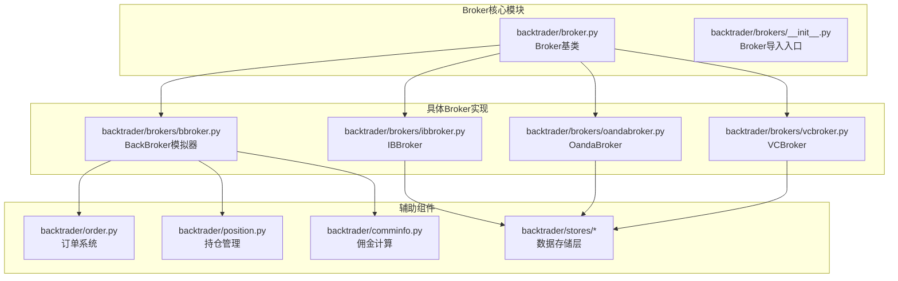

**图表来源**
- [backtrader/broker.py](file://backtrader/broker.py#L48-L169)
- [backtrader/brokers/__init__.py](file://backtrader/brokers/__init__.py#L27-L42)

**章节来源**
- [backtrader/brokers/__init__.py](file://backtrader/brokers/__init__.py#L1-L43)
- [backtrader/broker.py](file://backtrader/broker.py#L1-L169)

## 核心组件

### BrokerBase抽象基类

所有Broker实现都继承自BrokerBase抽象基类，它定义了统一的接口规范：

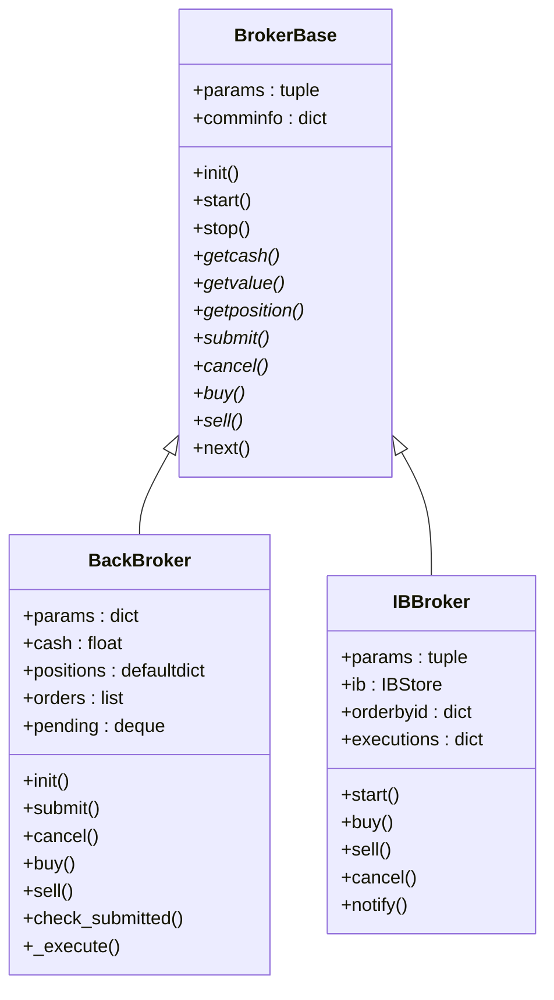

**图表来源**
- [backtrader/broker.py](file://backtrader/broker.py#L48-L169)
- [backtrader/brokers/bbroker.py](file://backtrader/brokers/bbroker.py#L36-L342)
- [backtrader/brokers/ibbroker.py](file://backtrader/brokers/ibbroker.py#L240-L403)

### 订单执行流程

Backtrader的订单执行采用统一的生命周期管理：

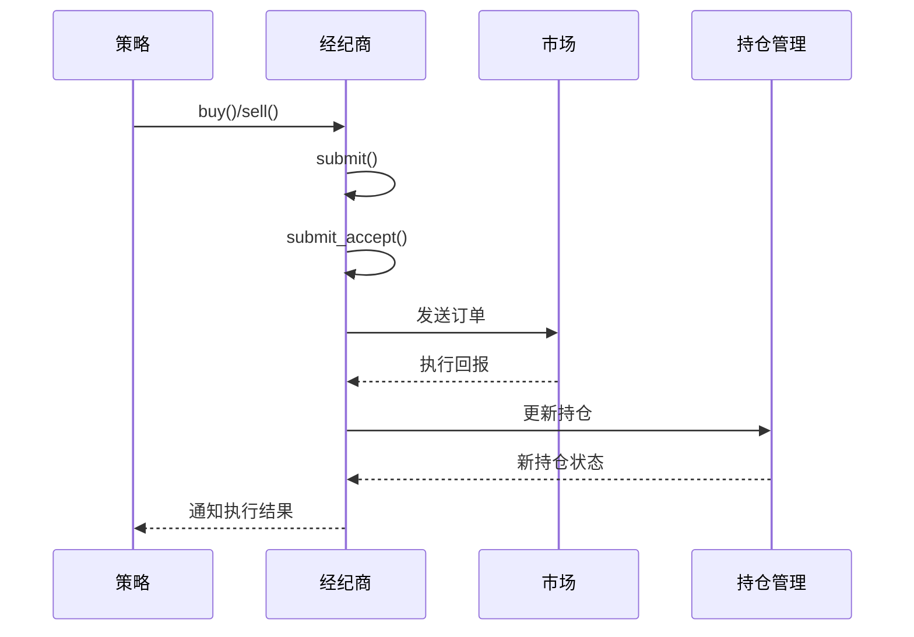

**图表来源**
- [backtrader/brokers/bbroker.py](file://backtrader/brokers/bbroker.py#L532-L591)
- [backtrader/brokers/ibbroker.py](file://backtrader/brokers/ibbroker.py#L327-L341)

**章节来源**
- [backtrader/broker.py](file://backtrader/broker.py#L48-L169)
- [backtrader/order.py](file://backtrader/order.py#L1-L200)
- [backtrader/position.py](file://backtrader/position.py#L1-L200)

## 架构概览

### 整体架构设计

Backtrader采用分层架构设计，确保了模块间的松耦合和高内聚：

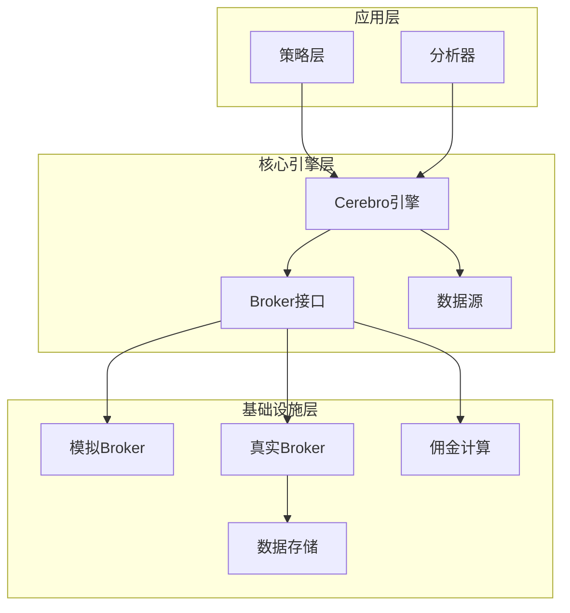

**图表来源**
- [backtrader/broker.py](file://backtrader/broker.py#L48-L169)
- [backtrader/brokers/bbroker.py](file://backtrader/brokers/bbroker.py#L36-L342)

### 数据流处理机制

Backtrader的数据流处理采用事件驱动模式：

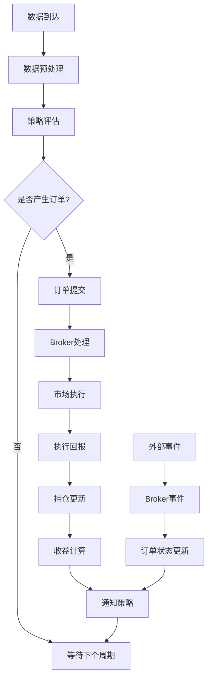

**图表来源**
- [backtrader/brokers/bbroker.py](file://backtrader/brokers/bbroker.py#L687-L800)
- [backtrader/brokers/ibbroker.py](file://backtrader/brokers/ibbroker.py#L477-L542)

## 详细组件分析

### BackBroker模拟Broker

BackBroker是Backtrader的核心模拟Broker，提供了完整的交易模拟功能。

#### 支持的订单类型

| 订单类型 | 描述 | 执行时机 |
|---------|------|----------|
| Market | 市价单 | 下一个bar开盘价执行 |
| Limit | 限价单 | 触及限价时执行 |
| Stop | 止损单 | 触及止损价后市价执行 |
| StopLimit | 止损限价单 | 触及止损价后按限价执行 |
| Close | 收盘单 | 当日收盘价执行 |

#### 关键参数配置

```python
# 默认参数设置
params = {
    'cash': 10000.0,                    # 初始资金
    'checksubmit': True,                # 提交前检查保证金
    'eosbar': False,                    # 会话结束bar处理
    'filler': None,                     # 成交量填充器
    'slip_perc': 0.0,                   # 滑点百分比
    'slip_fixed': 0.0,                  # 固定滑点
    'slip_open': False,                 # 开盘滑点
    'slip_match': True,                 # 匹配滑点
    'slip_limit': True,                 # 限价单滑点
    'slip_out': False,                  # 超出范围滑点
    'coc': False,                       # Cheat-On-Close
    'coo': False,                       # Cheat-On-Open
    'int2pnl': True,                    # 利息计入盈亏
    'shortcash': True,                  # 做空获得现金
    'fundstartval': 100.0,              # 基金起始价值
    'fundmode': False                   # 基金模式
}
```

#### 模拟执行算法

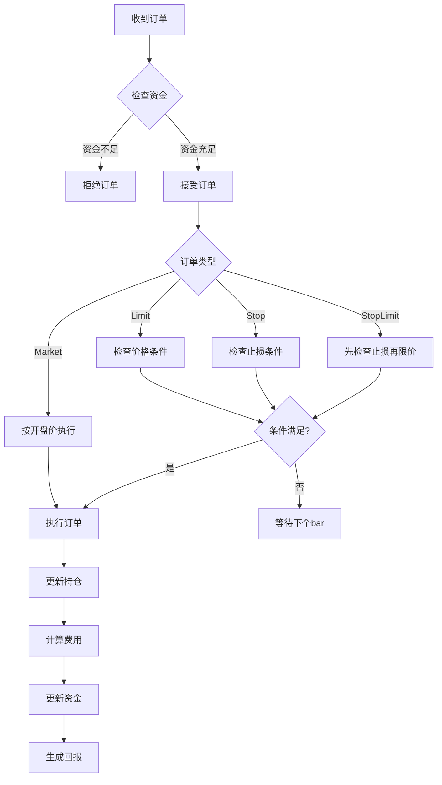

**图表来源**
- [backtrader/brokers/bbroker.py](file://backtrader/brokers/bbroker.py#L547-L591)
- [backtrader/brokers/bbroker.py](file://backtrader/brokers/bbroker.py#L687-L800)

**章节来源**
- [backtrader/brokers/bbroker.py](file://backtrader/brokers/bbroker.py#L36-L342)

### Interactive Brokers (IB) 集成

IBBroker实现了与Interactive Brokers的完整集成，支持实时市场数据和订单执行。

#### IB订单映射

| Backtrader订单类型 | IB订单类型 | 参数映射 |
|-------------------|------------|----------|
| Market | MKT | 无额外参数 |
| Limit | LMT | m_lmtPrice=price |
| Stop | STP | m_auxPrice=price |
| StopLimit | STPLMT | m_lmtPrice=pricelimit, m_auxPrice=price |
| StopTrail | TRAIL | m_auxPrice/trailingPercent |
| StopTrailLimit | TRAIL LIMIT | m_lmtPrice=pricelimit, m_auxPrice/trailingPercent |

#### 连接配置参数

```python
# IB连接参数
ib_params = {
    'host': '127.0.0.1',           # TWS主机地址
    'port': 7496,                  # TWS端口
    'clientId': None,              # 客户端ID
    'timeoffset': True,            # 时间偏移
    'reconnect': 3,                # 重连次数
    'timeout': 3.0,                # 重连超时
    'notifyall': False,            # 通知所有消息
    '_debug': False               # 调试模式
}
```

#### 实时数据处理

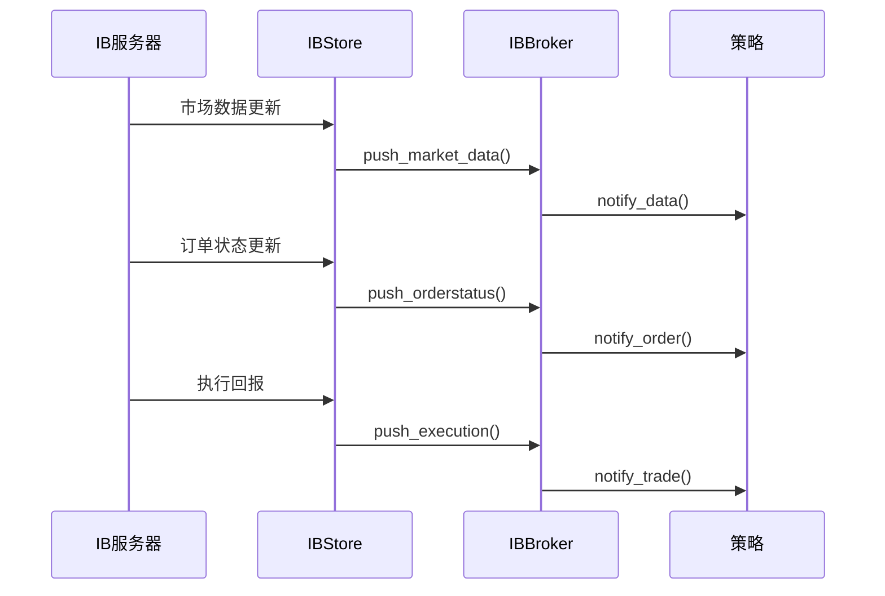

**图表来源**
- [backtrader/brokers/ibbroker.py](file://backtrader/brokers/ibbroker.py#L413-L476)
- [backtrader/brokers/ibbroker.py](file://backtrader/brokers/ibbroker.py#L477-L542)

**章节来源**
- [backtrader/brokers/ibbroker.py](file://backtrader/brokers/ibbroker.py#L240-L576)

### OANDA 集成

OandaBroker提供了外汇市场的专业集成，支持外汇交易的特殊需求。

#### 外汇订单特性

```python
# OANDA参数配置
oanda_params = {
    'use_positions': True,         # 使用现有仓位
    'commission': OandaCommInfo(mult=1.0, stocklike=False)
}
```

#### 仓位管理机制

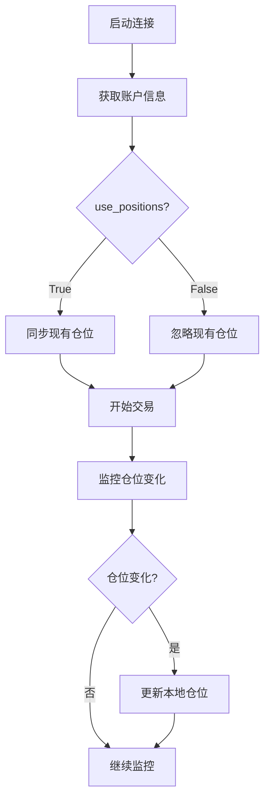

**图表来源**
- [backtrader/brokers/oandabroker.py](file://backtrader/brokers/oandabroker.py#L94-L144)

**章节来源**
- [backtrader/brokers/oandabroker.py](file://backtrader/brokers/oandabroker.py#L60-L358)

### Visual Chart 集成

VCBroker实现了与Visual Chart平台的深度集成，支持复杂的订单类型和执行策略。

#### 支持的订单类型

```python
# Visual Chart订单映射
vc_orders = {
    Order.Market: OT_Market,           # 市价单
    Order.Close: OT_Market,            # 收盘单
    Order.Limit: OT_Limit,             # 限价单
    Order.Stop: OT_StopMarket,         # 止损市价单
    Order.StopLimit: OT_StopLimit      # 止损限价单
}
```

#### 账户管理

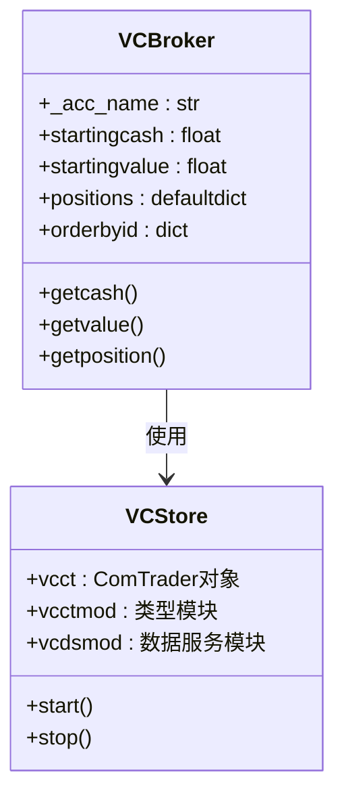

**图表来源**
- [backtrader/brokers/vcbroker.py](file://backtrader/brokers/vcbroker.py#L131-L225)

**章节来源**
- [backtrader/brokers/vcbroker.py](file://backtrader/brokers/vcbroker.py#L70-L467)

## 依赖关系分析

### 组件间依赖关系

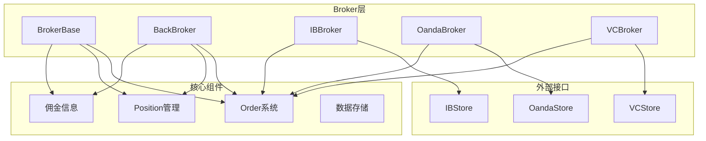

**图表来源**
- [backtrader/broker.py](file://backtrader/broker.py#L48-L169)
- [backtrader/brokers/bbroker.py](file://backtrader/brokers/bbroker.py#L36-L342)
- [backtrader/brokers/ibbroker.py](file://backtrader/brokers/ibbroker.py#L240-L352)

### 订单生命周期管理

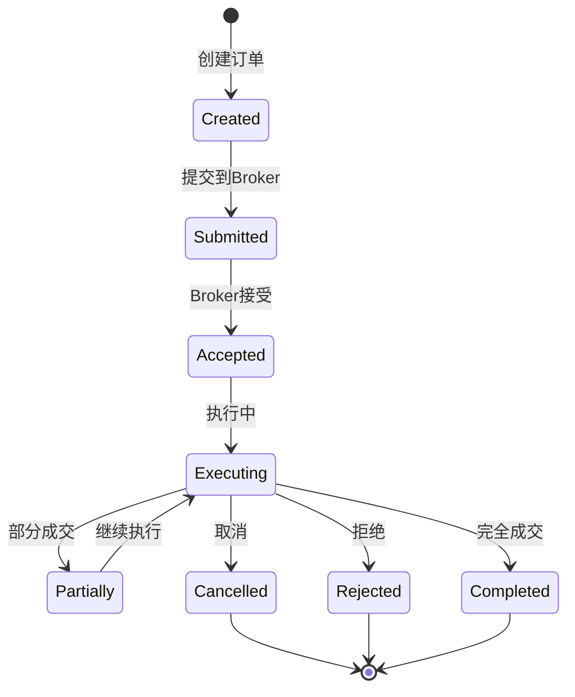

**图表来源**
- [backtrader/order.py](file://backtrader/order.py#L35-L86)

**章节来源**
- [backtrader/order.py](file://backtrader/order.py#L1-L200)
- [backtrader/position.py](file://backtrader/position.py#L1-L200)

## 性能考虑

### 模拟Broker性能优化

BackBroker在模拟环境中采用了多项性能优化措施：

1. **内存管理**：使用collections.deque和defaultdict减少内存分配
2. **批量处理**：订单批处理和批量通知机制
3. **延迟计算**：资金和价值的延迟计算策略
4. **缓存机制**：常用数据的缓存避免重复计算

### 实时Broker性能特点

| Broker类型 | 连接稳定性 | 数据延迟 | 执行速度 | 资金结算 |
|-----------|------------|----------|----------|----------|
| BackBroker | 优秀 | 0毫秒 | 即时 | 立即 |
| IBBroker | 优秀 | 1-5毫秒 | 即时 | 实时 |
| OandaBroker | 优秀 | 1-3毫秒 | 即时 | 实时 |
| VCBroker | 优秀 | 1-2毫秒 | 即时 | 实时 |

### 并发处理机制

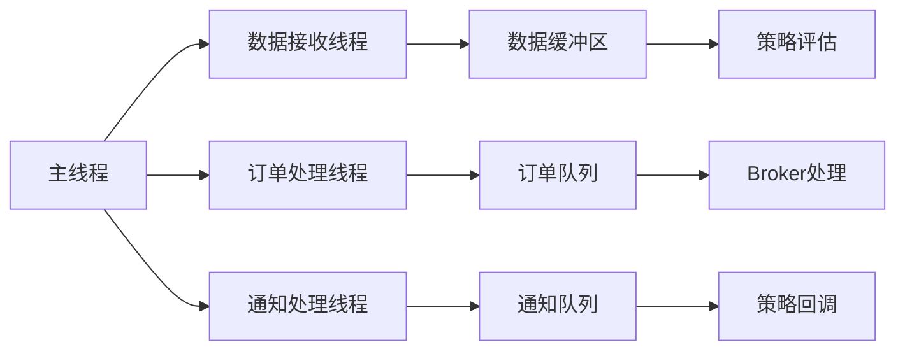

## 故障排除指南

### 常见问题诊断

#### 连接问题

**IB连接失败**
- 检查TWS是否正常运行
- 验证clientId是否唯一
- 确认防火墙设置
- 检查网络连接稳定性

**OANDA连接问题**
- 验证token有效性
- 检查账户状态
- 确认网络连接
- 验证时区设置

#### 订单执行问题

**订单被拒绝**
- 检查账户资金是否充足
- 验证订单参数设置
- 确认市场是否开放
- 检查交易权限

**执行延迟**
- 监控网络延迟
- 检查服务器负载
- 验证数据质量
- 调整重连参数

### 调试工具使用

```python
# 启用调试模式
cerebro.broker.set_debug(True)

# 监控订单状态
def notify_order(self, order):
    print(f"订单状态: {order.status}")
    print(f"执行价格: {order.executed.price}")
    print(f"执行数量: {order.executed.size}")

# 查看持仓详情
def show_positions(self):
    for data, position in self.broker.positions.items():
        print(f"{data._dataname}: {position.size}@{position.price}")
```

**章节来源**
- [samples/ibtest/ibtest.py](file://samples/ibtest/ibtest.py#L75-L86)
- [samples/oandatest/oandatest.py](file://samples/oandatest/oandatest.py#L74-L85)
- [samples/vctest/vctest.py](file://samples/vctest/vctest.py#L71-L82)

## 结论

Backtrader的Broker系统提供了完整的交易模拟和真实市场接入能力。通过统一的接口设计和灵活的配置选项，用户可以根据不同的需求选择合适的Broker实现。

### 选择建议

**模拟回测场景**
- 优先选择BackBroker，完全免费且功能完整
- 支持复杂的订单类型和滑点模拟
- 适合策略开发和参数优化

**实盘交易场景**
- IBBroker：适合股票、期权等复杂金融产品
- OandaBroker：适合外汇交易的专业需求
- VCBroker：适合Visual Chart平台用户

### 未来发展方向

1. **多Broker并行**：支持同时使用多个Broker进行交叉验证
2. **云Broker集成**：支持云端Broker服务
3. **AI订单优化**：集成机器学习优化订单执行
4. **区块链集成**：探索去中心化交易所集成

通过本文档的详细分析，用户可以更好地理解和使用Backtrader的Broker系统，选择最适合的解决方案来满足自己的量化交易需求。