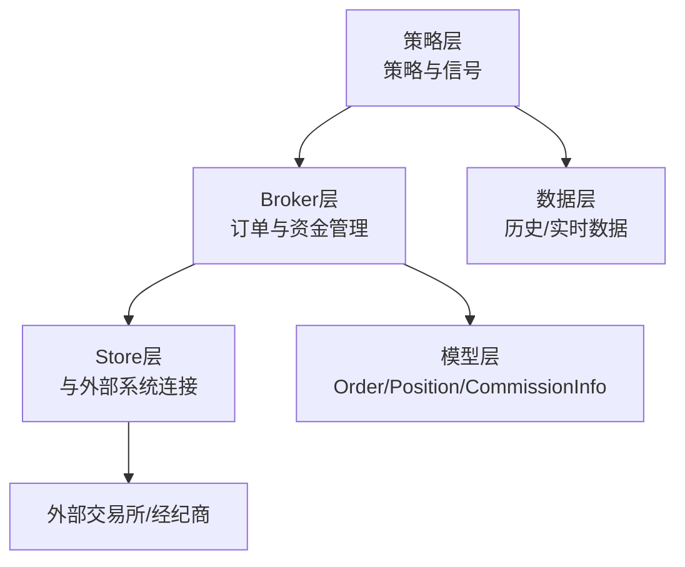
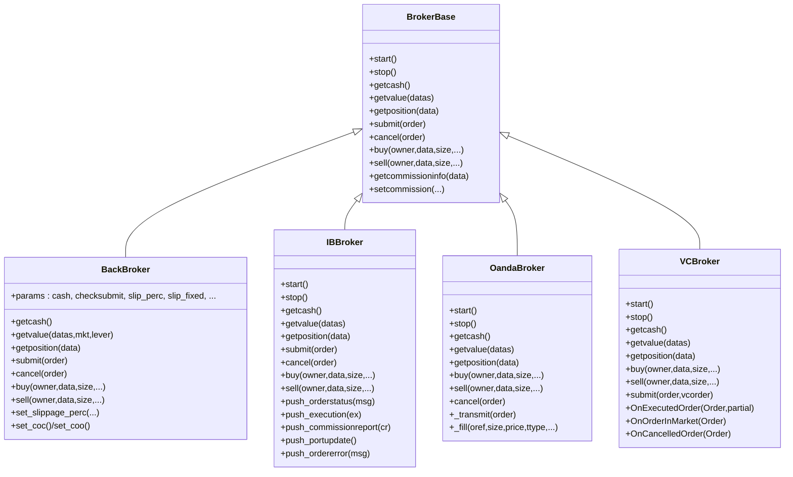
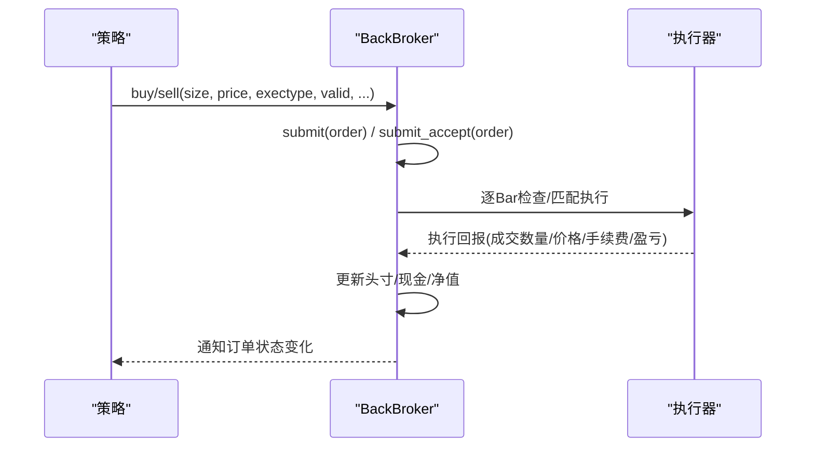
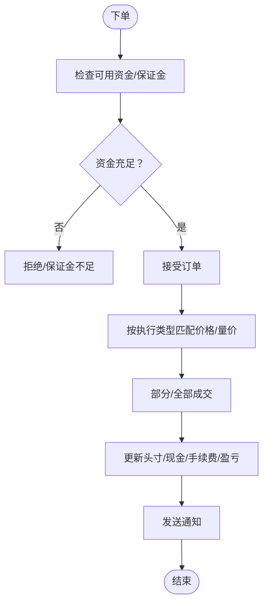
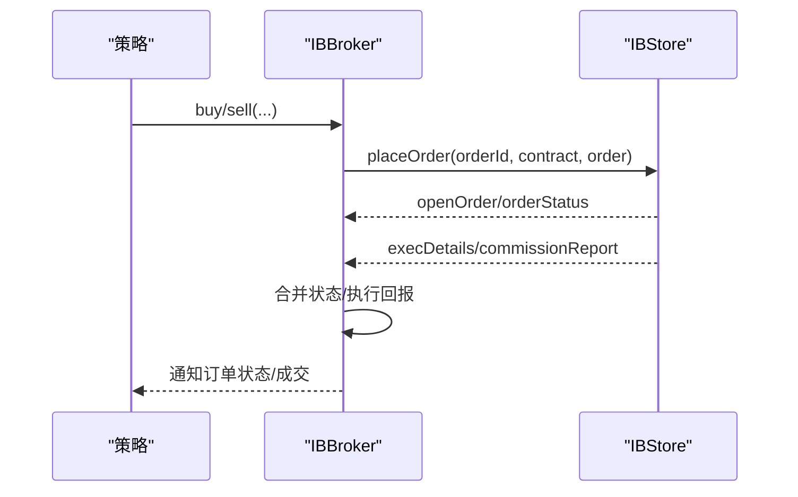
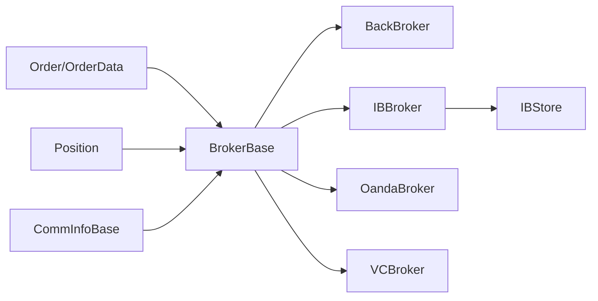

# 实时交易系统

<cite>
**本文引用的文件**
- [backtrader/broker.py](file://backtrader/broker.py)
- [backtrader/brokers/bbroker.py](file://backtrader/brokers/bbroker.py)
- [backtrader/order.py](file://backtrader/order.py)
- [backtrader/position.py](file://backtrader/position.py)
- [backtrader/commissions/__init__.py](file://backtrader/commissions/__init__.py)
- [backtrader/comminfo.py](file://backtrader/comminfo.py)
- [backtrader/brokers/ibbroker.py](file://backtrader/brokers/ibbroker.py)
- [backtrader/brokers/oandabroker.py](file://backtrader/brokers/oandabroker.py)
- [backtrader/brokers/vcbroker.py](file://backtrader/brokers/vcbroker.py)
- [backtrader/stores/ibstore.py](file://backtrader/stores/ibstore.py)
- [backtrader/stores/binance.py](file://backtrader/stores/binance.py)
- [samples/oco/oco.py](file://samples/oco/oco.py)
- [samples/bracket/bracket.py](file://samples/bracket/bracket.py)
- [samples/binance-test/binance_test.py](file://samples/binance-test/binance_test.py)
</cite>

## 目录
1. [简介](#简介)
2. [项目结构](#项目结构)
3. [核心组件](#核心组件)
4. [架构总览](#架构总览)
5. [详细组件分析](#详细组件分析)
6. [依赖关系分析](#依赖关系分析)
7. [性能考虑](#性能考虑)
8. [故障排查指南](#故障排查指南)
9. [结论](#结论)
10. [附录](#附录)

## 简介
本技术文档面向Backtrader实时交易系统的Broker接口设计与订单执行机制，系统性阐述Broker基类架构、订单生命周期、资金与佣金管理、内置Broker实现（模拟、Interactive Brokers、OANDA、Visual Chart）以及实时数据订阅与推送机制。同时提供实盘交易配置与部署指南、常见问题排查与与交易所/经纪商对接方案。

## 项目结构
Backtrader将交易系统按层次组织：策略层、Broker层、Store层、数据层与工具层。Broker层负责订单提交、执行、资金与头寸管理；Store层负责与外部交易所/经纪商的连接与消息推送；数据层负责历史与实时数据接入；工具层提供CommissionInfo、Position等基础模型。

[本图为概念性结构示意，不直接映射到具体源码文件，故不提供图表来源]

## 核心组件
- Broker基类与模拟Broker：定义Broker接口、资金查询、订单提交/取消、头寸查询、佣金方案注册等。
- 订单模型：统一的Order/OrderData/OrderExecutionBit结构，支持多种执行类型与状态流转。
- 佣金模型：CommInfoBase提供佣金、保证金、杠杆、利息等参数化方案。
- 头寸模型：Position记录头寸规模与均价，支持开仓、平仓、反向操作的数学运算。
- 第三方Broker：IBBroker、OandaBroker、VCBroker分别对接Interactive Brokers、OANDA、Visual Chart。
- Store：IBStore等负责连接建立、消息路由、错误处理与通知队列。

章节来源
- file://backtrader/broker.py#L49-L169
- file://backtrader/brokers/bbroker.py#L36-L800
- file://backtrader/order.py#L222-L642
- file://backtrader/position.py#L28-L207
- file://backtrader/comminfo.py#L30-L329

## 架构总览
下图展示Broker基类与内置Broker、Store之间的关系及交互路径：

图表来源
- [backtrader/broker.py](file://backtrader/broker.py#L49-L169)
- [backtrader/brokers/bbroker.py](file://backtrader/brokers/bbroker.py#L36-L800)
- [backtrader/brokers/ibbroker.py](file://backtrader/brokers/ibbroker.py#L240-L576)
- [backtrader/brokers/oandabroker.py](file://backtrader/brokers/oandabroker.py#L60-L358)
- [backtrader/brokers/vcbroker.py](file://backtrader/brokers/vcbroker.py#L70-L467)

## 详细组件分析

### Broker基类与模拟Broker（BackBroker）
- 接口职责：启动/停止、资金查询、净值计算、头寸查询、订单提交/接受/取消、通知队列。
- 资金与净值：支持短期现金模式与基金模式（fundmode），支持加减现金、历史净值回放。
- 订单执行：支持市价、限价、止损、停损限价、止盈止损联动（Bracket）、OCO等；支持滑点、价格偏移、Cheat-On-Close/On-Open等仿真增强。
- 佣金与保证金：通过CommInfoBase注册不同资产的佣金方案，支持百分比/固定费用、自动保证金、杠杆、利息等。
- 并发与通知：内部使用队列与锁保护订单状态变更与通知边界。

图表来源
- [backtrader/brokers/bbroker.py](file://backtrader/brokers/bbroker.py#L532-L591)
- [backtrader/brokers/bbroker.py](file://backtrader/brokers/bbroker.py#L687-L800)

章节来源
- file://backtrader/broker.py#L49-L169
- file://backtrader/brokers/bbroker.py#L224-L488

### 订单模型与执行策略
- 订单类型：市价、收盘市价、限价、止损、停损限价、移动止损、移动止损限价、历史执行等。
- 订单状态：Created/Submitted/Accepted/Partial/Completed/Canceled/Expired/Margin/Rejected。
- 执行细节：OrderData记录每次执行的成交明细（成交价、成交量、手续费、盈亏、剩余未成交等），支持历史回测与通知边界标记。
- 触发与有效期：支持按日期/天/收盘拍卖等时间限制，支持Trail调整（移动止损/止盈）。

图表来源
- [backtrader/order.py](file://backtrader/order.py#L222-L642)
- [backtrader/brokers/bbroker.py](file://backtrader/brokers/bbroker.py#L687-L800)

章节来源
- file://backtrader/order.py#L222-L642

### 佣金与保证金模型（CommInfoBase）
- 支持两种佣金类型：百分比（COMM_PERC）与固定金额（COMM_FIXED），可配置是否按绝对值理解百分比。
- 保证金策略：支持显式保证金、自动保证金（基于乘数或固定比例）、杠杆倍数。
- 利息：对空头持仓按日计收信用利息，可配置是否对多头也计息。
- 价值与成本：提供getoperationcost/getvaluesize/getvalue等方法，用于头寸估值与交易成本计算。

章节来源
- file://backtrader/comminfo.py#L30-L329
- file://backtrader/commissions/__init__.py#L27-L65

### 头寸模型（Position）
- 记录当前头寸规模与均价，支持开仓、平仓、反向等操作的数学更新。
- 提供pseudoupdate/update两种更新方式，前者用于“伪执行”预估，后者用于实际执行。

章节来源
- file://backtrader/position.py#L28-L207

### Interactive Brokers（IBBroker + IBStore）
- 订单映射：将Backtrader订单类型映射到IB订单类型，支持GTC/DAY/GTD等时效。
- 状态与回报：通过回调接收订单状态、执行、佣金与账户更新，合并后推送给策略。
- 错误处理：针对不同errorCode进行分类处理（如200/203/320等），必要时触发取消或拒绝。
- 资金与净值：从IB账户更新中获取实时资金与净值。

图表来源
- [backtrader/brokers/ibbroker.py](file://backtrader/brokers/ibbroker.py#L327-L403)
- [backtrader/brokers/ibbroker.py](file://backtrader/brokers/ibbroker.py#L477-L542)
- [backtrader/stores/ibstore.py](file://backtrader/stores/ibstore.py#L337-L576)

章节来源
- file://backtrader/brokers/ibbroker.py#L240-L576
- file://backtrader/stores/ibstore.py#L105-L800

### OANDA（OandaBroker）
- 位置管理：支持使用现有头寸启动，或在启动时进行“模拟完成”以同步策略状态。
- 订单传输：支持Bracket三单联动（主单+止损+止盈），自动取消非存活分支。
- 回报处理：根据回报类型（止损/止盈）定位对应子订单，更新头寸并通知策略。

章节来源
- file://backtrader/brokers/oandabroker.py#L60-L358

### Visual Chart（VCBroker）
- 订单映射：将Backtrader订单类型映射到Visual Chart订单类型，支持时间限制与有效期。
- 回调驱动：通过COM事件接收执行、取消、在途等状态，实时更新头寸并通知策略。
- 佣金：由于Visual Chart不提供佣金回报，采用CommInfo估算。

章节来源
- file://backtrader/brokers/vcbroker.py#L70-L467

### 实盘交易模块（real_trade）
- 架构复用：通过通用基类（BaseStore/BaseBroker/BaseData）实现90%+代码复用，快速扩展新交易所。
- 统一API：Bybit/Binance等模块提供一致的便捷创建函数与配置方式，默认启用模拟交易。
- 安全特性：测试网优先、模拟交易模式、参数校验与明确确认。

章节来源
- file://real_trade/README.md#L1-L266
- file://real_trade/ARCHITECTURE.md#L1-L295

## 依赖关系分析
- BrokerBase是所有Broker实现的共同基类，定义统一接口与参数体系。
- BackBroker作为内置模拟Broker，实现完整的资金、头寸、订单与佣金逻辑。
- IBBroker/OandaBroker/VCBroker分别依赖各自Store（IBStore等）进行连接与消息处理。
- 订单与头寸模型被所有Broker共享，确保状态一致性与可移植性。
- CommInfoBase提供跨Broker的佣金与保证金策略，便于统一配置与扩展。

图表来源
- [backtrader/broker.py](file://backtrader/broker.py#L49-L169)
- [backtrader/brokers/bbroker.py](file://backtrader/brokers/bbroker.py#L36-L800)
- [backtrader/brokers/ibbroker.py](file://backtrader/brokers/ibbroker.py#L240-L576)
- [backtrader/brokers/oandabroker.py](file://backtrader/brokers/oandabroker.py#L60-L358)
- [backtrader/brokers/vcbroker.py](file://backtrader/brokers/vcbroker.py#L70-L467)
- [backtrader/order.py](file://backtrader/order.py#L222-L642)
- [backtrader/position.py](file://backtrader/position.py#L28-L207)
- [backtrader/comminfo.py](file://backtrader/comminfo.py#L30-L329)

章节来源
- file://backtrader/broker.py#L49-L169
- file://backtrader/brokers/bbroker.py#L36-L800
- file://backtrader/brokers/ibbroker.py#L240-L576
- file://backtrader/brokers/oandabroker.py#L60-L358
- file://backtrader/brokers/vcbroker.py#L70-L467
- file://backtrader/order.py#L222-L642
- file://backtrader/position.py#L28-L207
- file://backtrader/comminfo.py#L30-L329

## 性能考虑
- 滑点与填充：BackBroker支持滑点参数与体积填充器（filler），可在仿真中平衡执行精度与性能。
- 状态合并：IBBroker将订单状态、执行与佣金回报合并后再通知，减少策略侧频繁处理。
- 单例Store：IBStore等采用单例模式，避免重复连接与上下文切换。
- 通知边界：各Broker在next中插入None标记通知边界，便于批量处理与降低线程竞争。

[本节为通用指导，不直接分析具体文件，故不提供章节来源]

## 故障排查指南
- 网络连接
  - IB：关注错误码（如354/420/10225/1100/1101/1102/502/504/1300），必要时重建连接与队列。
  - OANDA/VC：检查账户权限、合约有效性与回调事件是否正常触发。
- 数据延迟
  - 确认Store时间偏移与刷新策略（IBStore的timeoffset/timerefresh）。
  - 检查队列有效性与订阅重连逻辑。
- 订单执行
  - BackBroker：确认checksubmit、滑点参数与Cheat-On-Close/On-Open设置。
  - IBBroker：核对TIF、OCO组与订单状态机，留意PendingCancel/Cancelled导致的过期判定。
  - OANDA/VC：检查Bracket联动与回报类型映射。

章节来源
- file://backtrader/stores/ibstore.py#L440-L576
- file://backtrader/brokers/ibbroker.py#L413-L576
- file://backtrader/brokers/oandabroker.py#L209-L358
- file://backtrader/brokers/vcbroker.py#L372-L467

## 结论
Backtrader通过Broker基类与统一的订单/头寸/佣金模型，为实时交易提供了清晰、可扩展的接口。内置模拟Broker满足回测与验证需求，第三方Broker对接主流交易所/经纪商，配合Store层的消息路由与错误处理，形成完整的实时交易闭环。Binance集成模块通过标准backtrader架构，实现了与主流加密货币交易所的无缝对接，适合快速迭代与规模化部署。

## 附录

### 订单类型与执行策略速览
- 市价单（Market）：按下一Bar开盘价或指定价格立即执行。
- 限价单（Limit）：达到指定价格触发执行。
- 止损单（Stop）：价格跌破触发价后转市价执行。
- 停损限价（StopLimit）：跌破触发价后按限价执行。
- 止盈止损联动（Bracket）：主单+止损+止盈三单联动，一单成交即取消其他。
- OCO（互斥订单）：一组订单中任一成交即取消其余。
- 移动止损/止盈（StopTrail/StopTrailLimit）：随价格变动调整触发价。

章节来源
- file://backtrader/order.py#L242-L246
- file://samples/bracket/bracket.py#L84-L120
- file://samples/oco/oco.py#L92-L115

### 资金管理与风险控制要点
- 保证金与杠杆：通过CommInfoBase配置margin/automargin/leverage，控制最大可持头寸。
- 佣金与成本：选择COMM_PERC或COMM_FIXED，结合percabs与stocklike参数，准确反映交易成本。
- 利息与资金占用：对空头持仓按日计收信用利息，避免长期挂单导致资金占用过高。
- 滑点与填充：BackBroker提供滑点参数与体积填充器，平衡执行精度与回撤。

章节来源
- file://backtrader/comminfo.py#L169-L306
- file://backtrader/brokers/bbroker.py#L224-L488

### 实盘部署与配置建议
- 默认模拟交易：real_trade模块默认启用paper_trading/testnet，降低实盘风险。
- 统一配置：通过便捷函数创建引擎，保持策略与数据层不变。
- 连接与重连：Store层提供reconnect/timeout策略，确保网络波动下的稳定性。
- 回调与通知：合理利用通知边界与批量处理，避免策略侧过度轮询。

章节来源
- file://real_trade/README.md#L50-L266
- file://real_trade/ARCHITECTURE.md#L128-L295
- file://backtrader/stores/ibstore.py#L349-L398