# 实时数据集成

<cite>
**本文档引用的文件**
- [feed.py](file://backtrader/feed.py)
- [dataseries.py](file://backtrader/dataseries.py)
- [cerebro.py](file://backtrader/cerebro.py)
- [timer.py](file://backtrader/timer.py)
- [ibdata.py](file://backtrader/feeds/ibdata.py)
- [ibstore.py](file://backtrader/stores/ibstore.py)
- [oanda.py](file://backtrader/feeds/oanda.py)
- [oandastore.py](file://backtrader/stores/oandastore.py)
- [base_data.py](file://real_trade/common/base_data.py)
- [binance/datafeed.py](file://real_trade/binance/datafeed.py)
- [binance/store.py](file://real_trade/binance/store.py)
- [bybit-live-trading.py](file://samples/ccxt-bybit/bybit-live-trading.py)
</cite>

## 目录
1. [引言](#引言)
2. [项目结构](#项目结构)
3. [核心组件](#核心组件)
4. [架构概览](#架构概览)
5. [详细组件分析](#详细组件分析)
6. [依赖关系分析](#依赖关系分析)
7. [性能考虑](#性能考虑)
8. [故障排除指南](#故障排除指南)
9. [结论](#结论)

## 引言

Backtrader 实时数据集成是一个复杂的系统，它需要处理来自多个数据源的实时数据流，包括传统金融数据提供商（如 Interactive Brokers 和 OANDA）以及现代加密货币交易所（如 Binance 和 Bybit）。该系统采用事件驱动架构，通过队列机制实现数据的异步处理，确保实时数据能够高效地传递给策略引擎。

实时数据集成的核心挑战在于如何处理不同数据源的差异性、保证数据的完整性和准确性、以及在高并发环境下维持系统的稳定性。Backtrader 通过其灵活的插件架构和强大的过滤器系统，为实时数据处理提供了坚实的基础。

## 项目结构

Backtrader 实时数据集成项目采用模块化设计，主要分为以下几个层次：

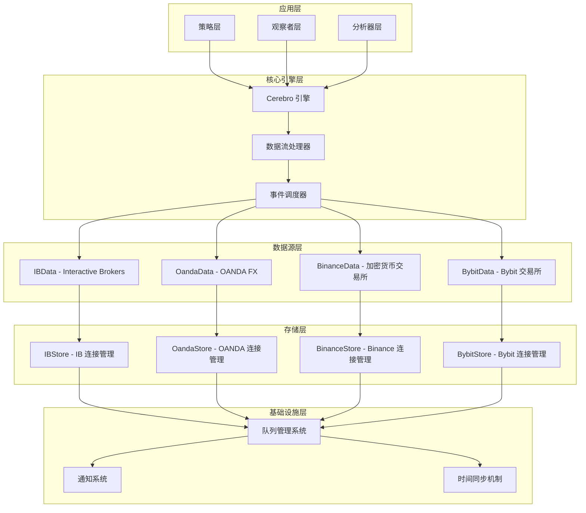

**图表来源**
- [feed.py](file://backtrader/feed.py#L1-L814)
- [cerebro.py](file://backtrader/cerebro.py#L60-L800)

**章节来源**
- [feed.py](file://backtrader/feed.py#L1-L814)
- [cerebro.py](file://backtrader/cerebro.py#L60-L800)

## 核心组件

### 数据源抽象层

Backtrader 的实时数据集成基于一个强大的抽象层，该层定义了所有数据源的共同接口和行为模式。

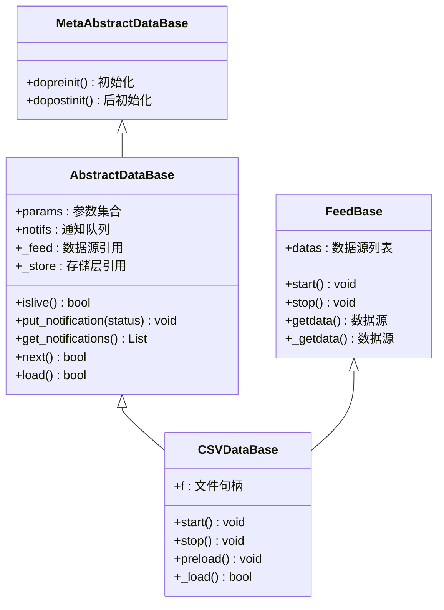

**图表来源**
- [feed.py](file://backtrader/feed.py#L122-L598)

### 数据系列和时间框架

数据系列是 Backtrader 中表示时间序列数据的核心组件，它定义了 OHLCV 数据的标准格式和操作方法。

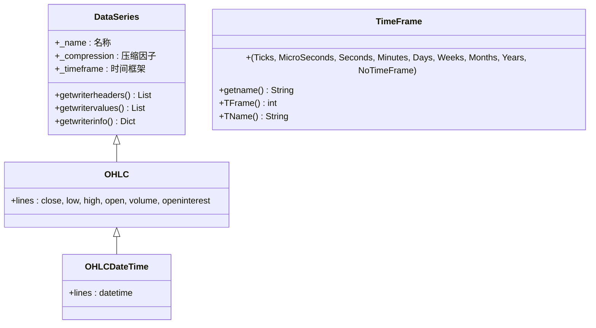

**图表来源**
- [dataseries.py](file://backtrader/dataseries.py#L60-L212)

**章节来源**
- [feed.py](file://backtrader/feed.py#L122-L598)
- [dataseries.py](file://backtrader/dataseries.py#L60-L212)

## 架构概览

Backtrader 的实时数据集成采用分层架构，每层都有明确的职责和边界。

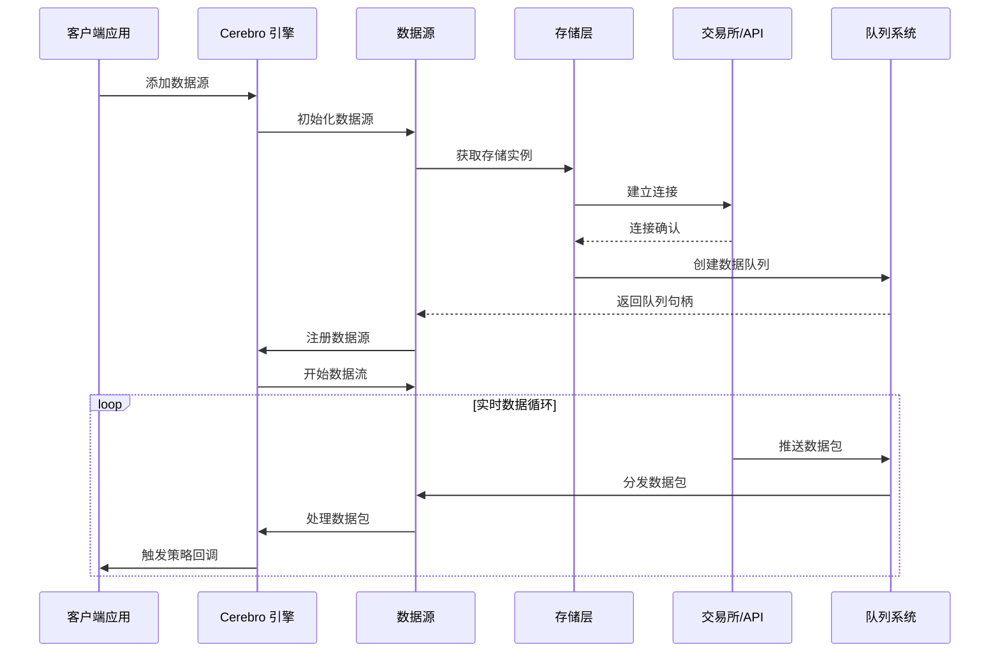

**图表来源**
- [cerebro.py](file://backtrader/cerebro.py#L752-L774)
- [ibstore.py](file://backtrader/stores/ibstore.py#L300-L315)

## 详细组件分析

### Interactive Brokers 实时数据集成

Interactive Brokers (IB) 是 Backtrader 支持的主要金融数据提供商之一，其实时数据集成具有以下特点：

#### 数据源状态机

IBData 实现了一个复杂的状态机来管理实时数据的不同阶段：

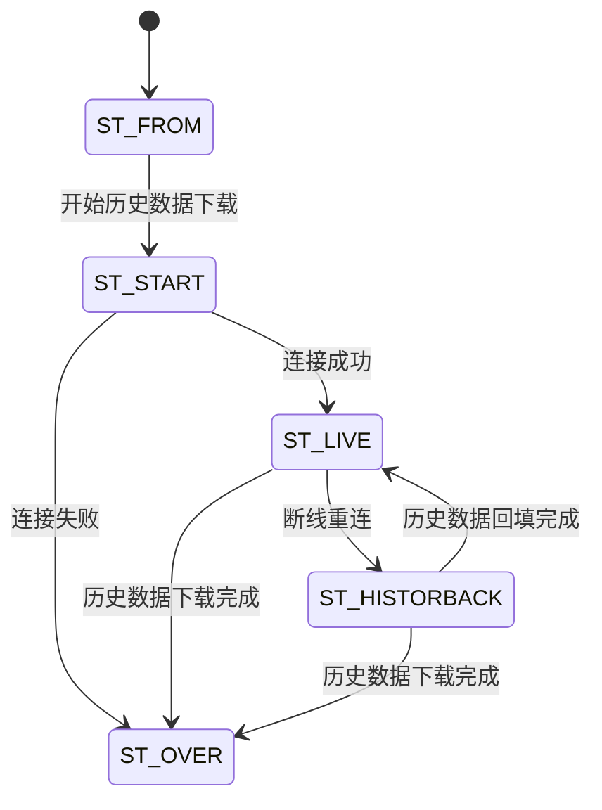

**图表来源**
- [ibdata.py](file://backtrader/feeds/ibdata.py#L195-L218)

#### 连接管理机制

IBStore 提供了完整的连接管理功能，包括自动重连、错误处理和状态通知：

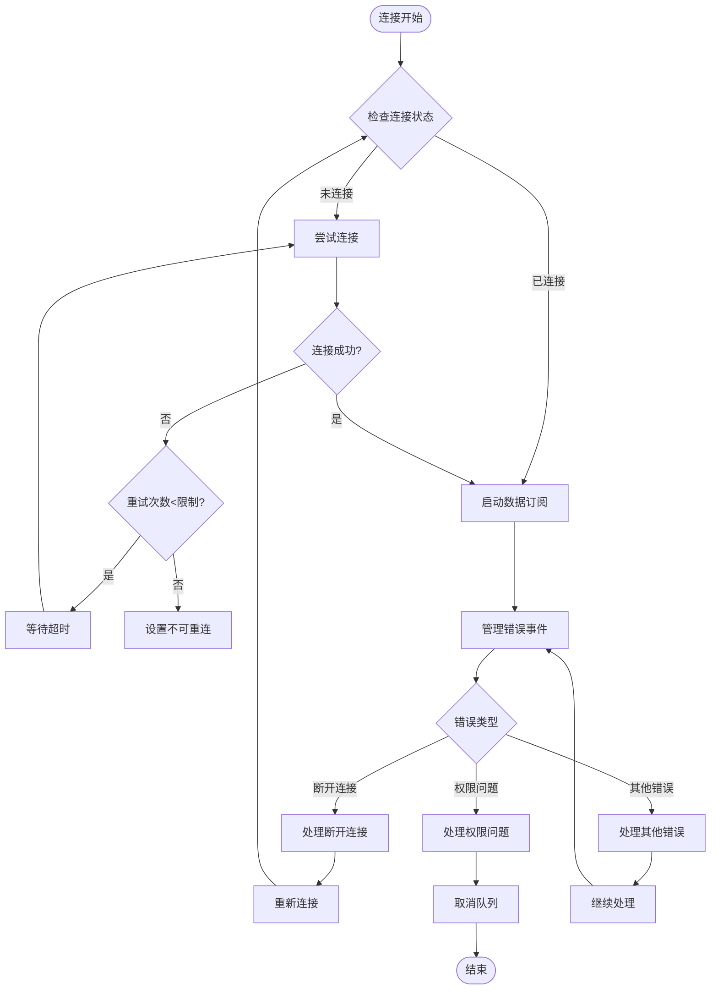

**图表来源**
- [ibstore.py](file://backtrader/stores/ibstore.py#L440-L546)

**章节来源**
- [ibdata.py](file://backtrader/feeds/ibdata.py#L195-L705)
- [ibstore.py](file://backtrader/stores/ibstore.py#L105-L800)

### OANDA 实时数据集成

OANDA 作为外汇市场的主要数据提供商，其实时数据集成具有独特的特点：

#### 时间框架映射

OANDA 支持特定的时间框架组合，这些映射确保了与 OANDA API 的兼容性：

| Backtrader 时间框架 | OANDA 粒度 | 描述 |
|-------------------|------------|------|
| Seconds, 5 | S5 | 5 秒蜡烛图 |
| Seconds, 10 | S10 | 10 秒蜡烛图 |
| Seconds, 15 | S15 | 15 秒蜡烛图 |
| Seconds, 30 | S30 | 30 秒蜡烛图 |
| Minutes, 1 | M1 | 1 分钟蜡烛图 |
| Minutes, 2 | M3 | 2 分钟蜡烛图 |
| Minutes, 3 | M3 | 3 分钟蜡烛图 |
| Minutes, 4 | M4 | 4 分钟蜡烛图 |
| Minutes, 5 | M5 | 5 分钟蜡烛图 |
| Minutes, 10 | M10 | 10 分钟蜡烛图 |
| Minutes, 15 | M15 | 15 分钟蜡烛图 |
| Minutes, 30 | M30 | 30 分钟蜡烛图 |
| Minutes, 60 | H1 | 1 小时蜡烛图 |
| Minutes, 120 | H2 | 2 小时蜡烛图 |
| Minutes, 180 | H3 | 3 小时蜡烛图 |
| Minutes, 240 | H4 | 4 小时蜡烛图 |
| Minutes, 360 | H6 | 6 小时蜡烛图 |
| Minutes, 480 | H8 | 8 小时蜡烛图 |
| Days, 1 | D | 日线蜡烛图 |
| Weeks, 1 | W | 周线蜡烛图 |
| Months, 1 | M | 月线蜡烛图 |

**章节来源**
- [oanda.py](file://backtrader/feeds/oanda.py#L112-L152)
- [oandastore.py](file://backtrader/stores/oandastore.py#L272-L295)

### 加密货币交易所实时数据集成

Backtrader 支持多种加密货币交易所，包括 Binance 和 Bybit，这些集成具有以下特点：

#### 通用数据源架构

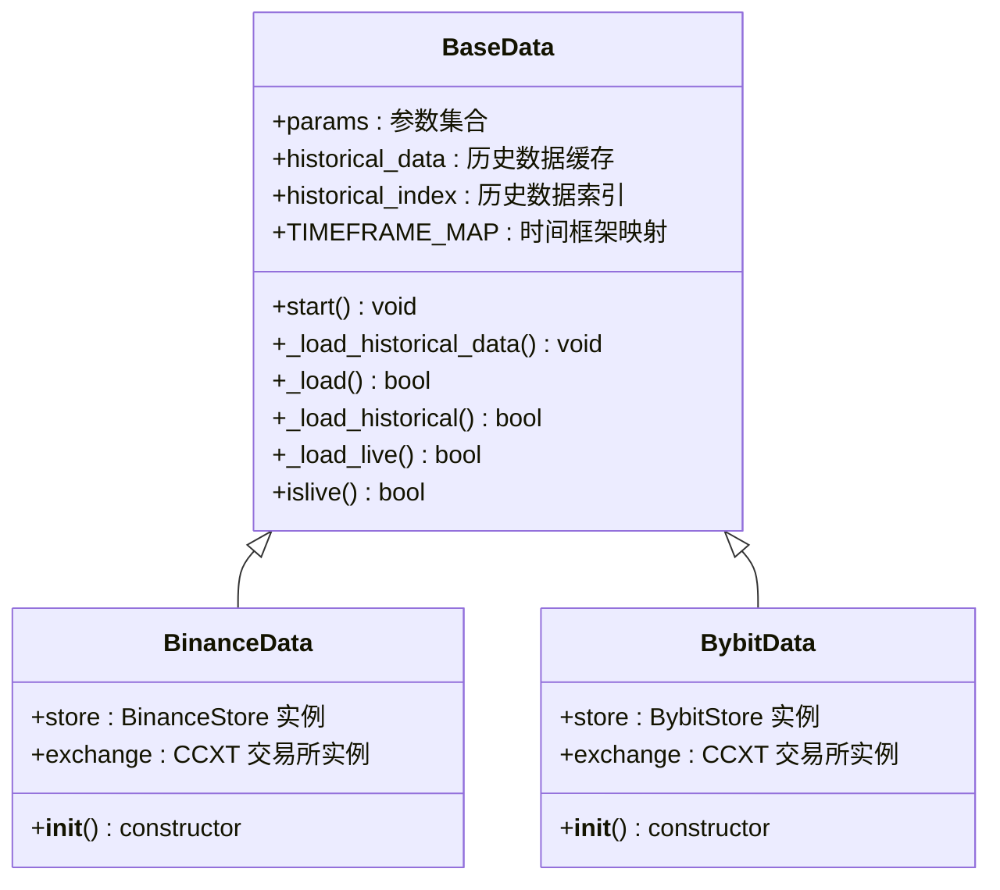

**图表来源**
- [base_data.py](file://real_trade/common/base_data.py#L16-L210)
- [binance/datafeed.py](file://real_trade/binance/datafeed.py#L18-L38)

**章节来源**
- [base_data.py](file://real_trade/common/base_data.py#L16-L210)
- [binance/datafeed.py](file://real_trade/binance/datafeed.py#L18-L38)

### 实时数据质量控制和去噪

Backtrader 实时数据集成包含了多层次的质量控制和去噪机制：

#### 数据完整性检查

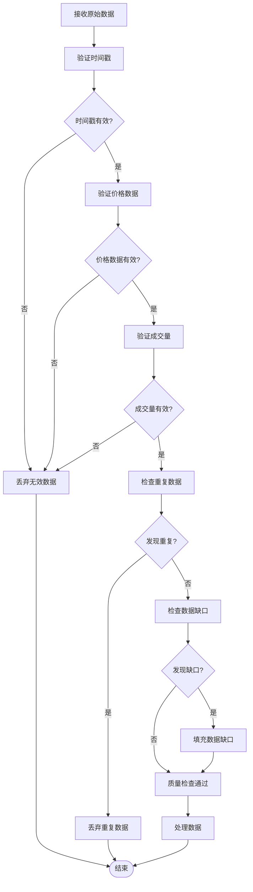

#### 实时数据更新频率控制

Backtrader 通过以下机制控制实时数据的更新频率：

1. **队列检查间隔 (qcheck)**：控制数据源轮询的频率
2. **时间偏移同步**：确保不同数据源之间的时间一致性
3. **会话过滤**：排除非交易时间的数据
4. **批处理机制**：合并多个小数据包以减少处理开销

**章节来源**
- [feed.py](file://backtrader/feed.py#L261-L293)
- [timer.py](file://backtrader/timer.py#L150-L225)

## 依赖关系分析

Backtrader 实时数据集成的依赖关系呈现明显的分层结构：

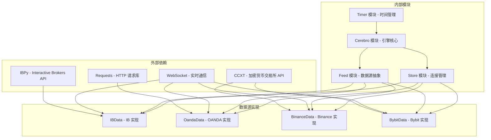

**图表来源**
- [ibdata.py](file://backtrader/feeds/ibdata.py#L26-L32)
- [oanda.py](file://backtrader/feeds/oanda.py#L26-L31)
- [base_data.py](file://real_trade/common/base_data.py#L12-L13)

**章节来源**
- [ibdata.py](file://backtrader/feeds/ibdata.py#L26-L32)
- [oanda.py](file://backtrader/feeds/oanda.py#L26-L31)
- [base_data.py](file://real_trade/common/base_data.py#L12-L13)

## 性能考虑

### 内存管理优化

Backtrader 实时数据集成采用了多种内存管理策略来优化性能：

1. **按需缓冲**：根据数据源的实时需求动态调整缓冲区大小
2. **垃圾回收优化**：定期清理不再使用的数据对象
3. **内存池管理**：复用常用的数据结构以减少内存分配开销

### 并发处理优化

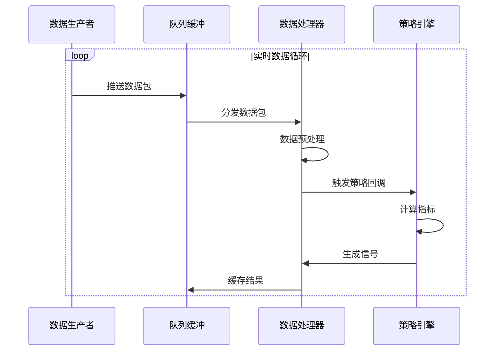

### 网络延迟优化

Backtrader 通过以下机制优化网络延迟：

1. **连接池管理**：复用现有的网络连接
2. **批量请求**：合并多个小请求以减少网络往返
3. **智能重连**：指数退避算法避免网络拥塞

## 故障排除指南

### 常见连接问题

#### Interactive Brokers 连接问题

| 问题代码 | 错误描述 | 解决方案 |
|----------|----------|----------|
| 100-199 | 订单/数据相关错误 | 检查账户权限和合约有效性 |
| 200 | 安全信息未找到 | 验证合约标识符 |
| 354 | 无订阅权限 | 检查数据订阅状态 |
| 502 | 无法连接 TWS | 检查防火墙设置和端口配置 |
| 1100-1102 | 连接丢失/恢复 | 实现自动重连逻辑 |

#### OANDA 连接问题

| 错误代码 | 描述 | 解决方案 |
|----------|------|----------|
| 599 | 请求错误 | 检查 API 密钥和配额限制 |
| 598 | 流式传输失败 | 检查网络连接和代理设置 |
| 597 | 不支持的时间框架 | 使用受支持的时间框架映射 |

### 实时数据质量监控

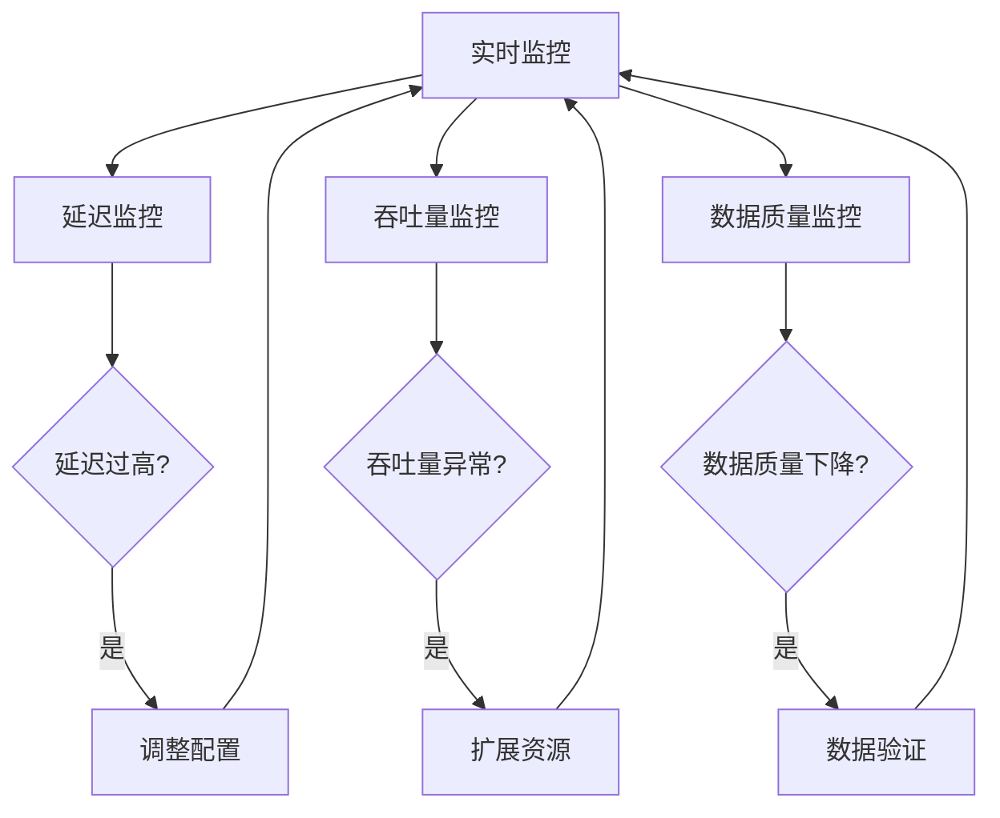

### 性能调优建议

1. **队列大小调优**：根据数据源的更新频率调整队列大小
2. **批处理优化**：合理设置批处理大小以平衡延迟和吞吐量
3. **内存使用监控**：定期检查内存使用情况并进行优化
4. **网络配置优化**：使用专用网络连接和优化的 DNS 设置

**章节来源**
- [ibstore.py](file://backtrader/stores/ibstore.py#L440-L546)
- [oandastore.py](file://backtrader/stores/oandastore.py#L41-L63)

## 结论

Backtrader 的实时数据集成为量化交易提供了强大而灵活的基础设施。通过其模块化的架构设计、完善的错误处理机制和高效的性能优化策略，Backtrader 能够可靠地处理来自多个数据源的实时数据流。

关键优势包括：

1. **多数据源支持**：统一的接口支持传统金融数据和现代加密货币交易所
2. **事件驱动架构**：基于队列的异步处理确保系统的响应性
3. **强大的过滤器系统**：提供数据质量控制和去噪能力
4. **灵活的配置选项**：支持各种实时数据处理场景的需求
5. **完善的监控机制**：提供全面的性能监控和故障诊断能力

未来的发展方向可能包括进一步优化大规模数据流的处理能力、增强机器学习集成支持，以及提供更多的可视化工具来帮助用户理解和调试实时数据流。

通过深入理解 Backtrader 实时数据集成的设计原理和实现细节，开发者可以更好地利用这一强大的平台构建高性能的量化交易系统。