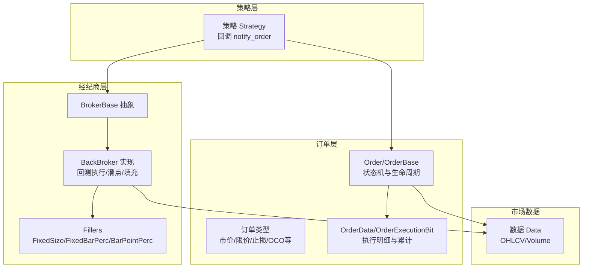
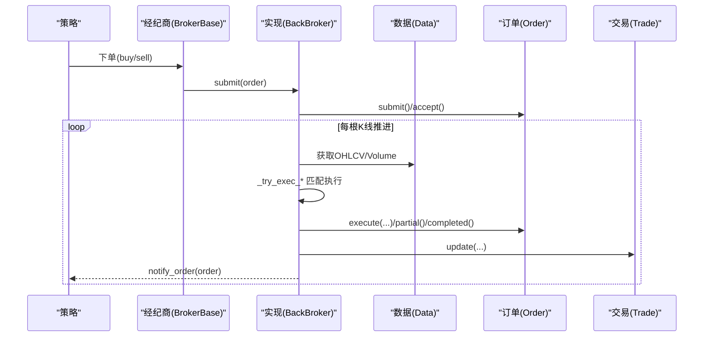
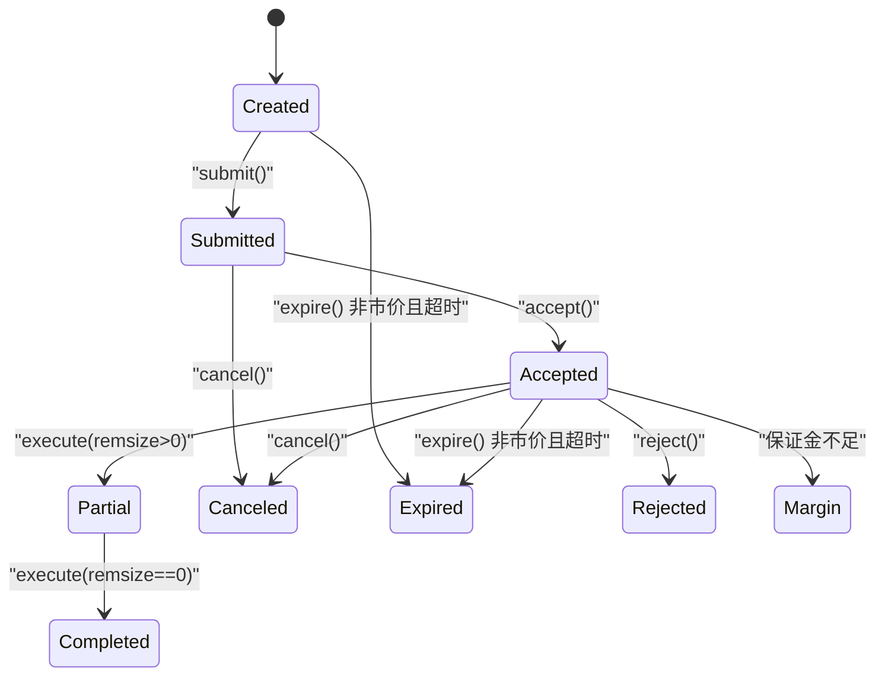
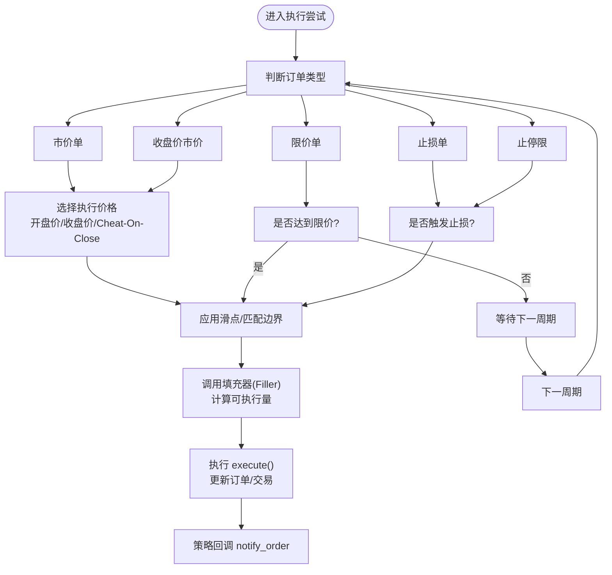
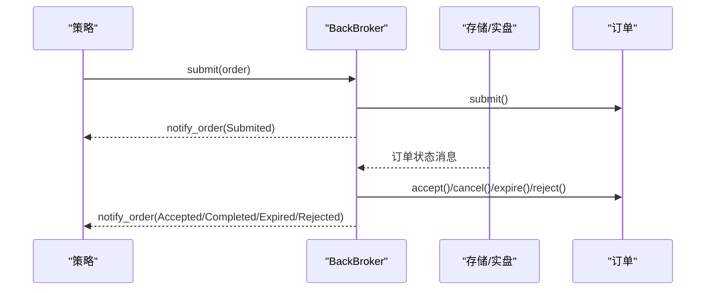
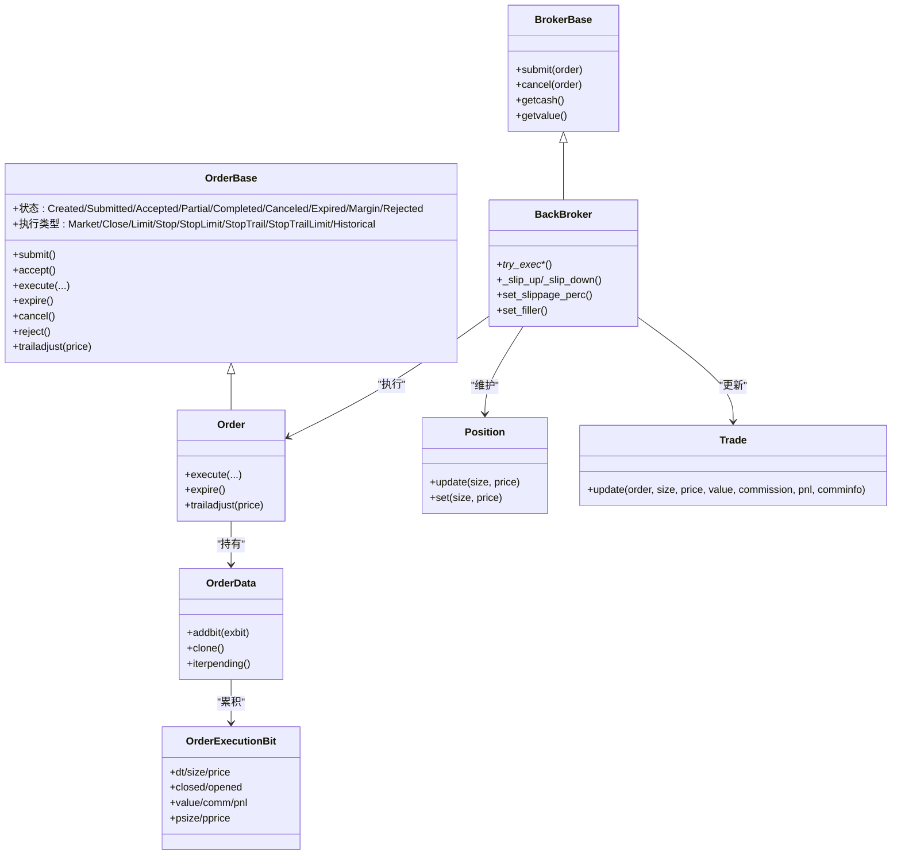

# 订单执行机制

<cite>
**本文引用的文件**
- [order.py](file://backtrader/order.py)
- [broker.py](file://backtrader/broker.py)
- [bbroker.py](file://backtrader/brokers/bbroker.py)
- [fillers.py](file://backtrader/fillers.py)
- [position.py](file://backtrader/position.py)
- [trade.py](file://backtrader/trade.py)
- [strategy.py](file://backtrader/strategy.py)
- [order-execution.py](file://samples/order-execution/order-execution.py)
- [oco.py](file://samples/oco/oco.py)
- [ibbroker.py](file://backtrader/brokers/ibbroker.py)
- [oandastore.py](file://backtrader/stores/oandastore.py)
- [btrun.py](file://backtrader/btrun/btrun.py)
</cite>

## 目录
1. [引言](#引言)
2. [项目结构](#项目结构)
3. [核心组件](#核心组件)
4. [架构总览](#架构总览)
5. [详细组件分析](#详细组件分析)
6. [依赖关系分析](#依赖关系分析)
7. [性能考量](#性能考量)
8. [故障排查指南](#故障排查指南)
9. [结论](#结论)
10. [附录](#附录)

## 引言
本文件系统化梳理 Backtrader 的订单执行机制，覆盖 Order 类的完整生命周期（创建、提交、接受、部分成交、完全成交、过期、取消、拒绝、追加保证金等），详解各类订单类型（市价、收盘价市价、限价、止损、止停限、追踪止损、追踪止停限）与 OCO/OCOOCO 等组合订单，阐述价格优先与时间优先等执行规则，解释状态管理与事件通知，剖析填充算法与滑点处理，并给出配置选项与参数调优建议、异常处理与错误恢复机制，以及实际代码示例与调试技巧。

## 项目结构
围绕订单执行的关键模块与文件如下：
- 订单模型与状态：backtrader/order.py
- 经纪商抽象与下单接口：backtrader/broker.py
- 回测仿真经记商实现与执行逻辑：backtrader/brokers/bbroker.py
- 填充器（按成交量/分段分配）：backtrader/fillers.py
- 持仓更新：backtrader/position.py
- 交易聚合与历史记录：backtrader/trade.py
- 策略侧事件回调：backtrader/strategy.py
- 示例：samples/order-execution/order-execution.py、samples/oco/oco.py
- 实盘经记商与外部通道（IB/OANDA）：backtrader/brokers/ibbroker.py、backtrader/stores/oandastore.py
- 运行时参数（滑点等）：backtrader/btrun/btrun.py

图表来源
- [order.py](file://backtrader/order.py#L222-L642)
- [broker.py](file://backtrader/broker.py#L49-L168)
- [bbroker.py](file://backtrader/brokers/bbroker.py#L36-L200)
- [fillers.py](file://backtrader/fillers.py#L30-L112)

章节来源
- [order.py](file://backtrader/order.py#L222-L642)
- [broker.py](file://backtrader/broker.py#L49-L168)
- [bbroker.py](file://backtrader/brokers/bbroker.py#L36-L200)
- [fillers.py](file://backtrader/fillers.py#L30-L112)

## 核心组件
- 订单模型与状态机
  - Order/OrderBase：定义订单状态（Created/Submitted/Accepted/Partial/Completed/Canceled/Expired/Margin/Rejected）、执行入口、到期判断、追踪止损调整等。
  - OrderData/OrderExecutionBit：记录每次执行的片段（时间、数量、价格、已平仓/新开仓量、价值、手续费、盈亏、当前持仓等），并维护累计均价与剩余未成交数量。
- 经纪商抽象与实现
  - BrokerBase：抽象下单/撤单/查询余额/持仓等接口。
  - BackBroker：回测执行核心，负责检查保证金/现金、匹配订单、应用滑点、调用填充器、推进状态、发出通知。
- 填充算法
  - FixedSize：固定数量或按百分比使用当日成交量。
  - FixedBarPerc：按当日成交量的百分比执行。
  - BarPointPerc：在高低价区间按最小价格跳动分段，按比例分配可执行量。
- 持仓与交易
  - Position：单一标的的头寸更新（平均价、开平仓量、剩余量）。
  - Trade：跨多笔订单聚合为一次交易，记录开仓/平仓、PNL、Commission、历史快照。

章节来源
- [order.py](file://backtrader/order.py#L35-L221)
- [broker.py](file://backtrader/broker.py#L49-L168)
- [bbroker.py](file://backtrader/brokers/bbroker.py#L244-L400)
- [fillers.py](file://backtrader/fillers.py#L30-L112)
- [position.py](file://backtrader/position.py#L28-L207)
- [trade.py](file://backtrader/trade.py#L94-L312)

## 架构总览
Backtrader 的订单执行链路自上而下为：策略生成订单 -> 经纪商接收并提交 -> 回测引擎按K线推进 -> 匹配执行（含滑点与填充）-> 更新订单与交易 -> 通过策略回调通知。

图表来源
- [strategy.py](file://backtrader/strategy.py#L43-L105)
- [broker.py](file://backtrader/broker.py#L145-L163)
- [bbroker.py](file://backtrader/brokers/bbroker.py#L850-L877)
- [order.py](file://backtrader/order.py#L502-L581)
- [trade.py](file://backtrader/trade.py#L220-L312)

## 详细组件分析

### 订单生命周期与状态机
- 生命周期阶段
  - 创建：设置 owner/data/size/price/pricelimit/exectype/valid/oco/trail 等；根据模拟标志决定创建时间；初始化 OrderData/Executed。
  - 提交/接受：submit()/accept()；记录 broker 引用；策略收到 Submitted/Accepted 通知。
  - 执行：execute(...) 累计执行片段；remsize>0 则 Partial，否则 Completed。
  - 到期：非市价订单在 valid 截止后 Expired。
  - 其他：Cancel/Reject/Margin。
- 关键方法与属性
  - 状态枚举与名称映射：Status/ExecTypes/OrdTypes。
  - 订单类型常量：Market/Close/Limit/Stop/StopLimit/StopTrail/StopTrailLimit/Historical。
  - 跟踪止损：trailadjust() 动态调整触发价。
  - 历史通知：histnotify 支持历史订单评估。

图表来源
- [order.py](file://backtrader/order.py#L250-L526)

章节来源
- [order.py](file://backtrader/order.py#L222-L642)

### 订单类型与适用场景
- 市价单（Market）
  - 在下一Bar开盘价（或 Cheat-On-Close）执行，适合快速入场/出场，但不保证价格。
- 收盘价市价（Close）
  - 在当日收盘价执行，适合日内策略避免跳空风险。
- 限价单（Limit）
  - 在触及指定价格时成交，适合精确价格控制。
- 止损单（Stop）
  - 触发后转为市价单执行，适合止损保护。
- 止停限（StopLimit）
  - 触发后挂限价单，兼顾止损与价格控制。
- 追踪止损（StopTrail/StopTrailLimit）
  - 随价格朝有利方向移动动态调整触发价，适合趋势跟踪。

章节来源
- [order.py](file://backtrader/order.py#L242-L246)
- [bbroker.py](file://backtrader/brokers/bbroker.py#L36-L200)

### 执行策略与规则
- 价格优先与时间优先
  - 限价单优先满足价格条件；止损单在突破区间内触发；市价单在开盘价或收盘价执行。
  - 时间优先体现在订单创建时间与有效期限（valid）控制。
- 滑点与匹配边界
  - 滑点支持百分比与固定点两种方式，可选择是否对开盘价滑点、是否限制在当日最高/最低范围内、是否允许越界匹配。
  - 对于限价单，若启用 slip_limit，则可在越界情况下仍按限价上限/下限进行匹配。
- 填充算法
  - 固定数量/百分比：按成交量或百分比限制每笔执行量。
  - 分段分配：在当日价格区间按最小跳动分段，按比例分配可执行量，提升公平性。

图表来源
- [bbroker.py](file://backtrader/brokers/bbroker.py#L850-L877)
- [fillers.py](file://backtrader/fillers.py#L30-L112)
- [order.py](file://backtrader/order.py#L502-L581)

章节来源
- [bbroker.py](file://backtrader/brokers/bbroker.py#L850-L877)
- [fillers.py](file://backtrader/fillers.py#L30-L112)

### 状态管理与事件通知
- 策略回调
  - 策略基类重命名 notify 为 notify_order，接收订单状态变化通知，便于记录日志与风控。
- 经纪商通知
  - BackBroker 使用内部队列保存通知，在 next() 边界推送，确保批处理一致性。
- 实盘对接
  - IB/OANDA 存储/经记商通过消息推送订单状态（提交/已成交/已取消/已过期/已拒绝），并转换为策略可感知的状态。

图表来源
- [strategy.py](file://backtrader/strategy.py#L43-L105)
- [bbroker.py](file://backtrader/brokers/bbroker.py#L283-L289)
- [ibbroker.py](file://backtrader/brokers/ibbroker.py#L393-L439)
- [oandastore.py](file://backtrader/stores/oandastore.py#L494-L570)

章节来源
- [strategy.py](file://backtrader/strategy.py#L43-L105)
- [bbroker.py](file://backtrader/brokers/bbroker.py#L283-L289)
- [ibbroker.py](file://backtrader/brokers/ibbroker.py#L393-L439)
- [oandastore.py](file://backtrader/stores/oandastore.py#L494-L570)

### 订单填充算法与滑点处理
- 填充器
  - FixedSize：按固定数量或当日成交量限制。
  - FixedBarPerc：按当日成交量百分比限制。
  - BarPointPerc：在价格区间按最小跳动分段，按比例分配。
- 滑点函数
  - _slip_up/_slip_down：根据百分比或固定点计算滑点后的执行价，支持越界匹配与限制。
  - 参数：slip_perc、slip_fixed、slip_open、slip_match、slip_limit、slip_out。

章节来源
- [fillers.py](file://backtrader/fillers.py#L30-L112)
- [bbroker.py](file://backtrader/brokers/bbroker.py#L994-L1038)

### 订单执行配置与参数调优
- 回测参数（BackBroker）
  - cash、checksubmit、eosbar、filler、slip_perc/slip_fixed、slip_open、slip_match、slip_limit、slip_out、coc、coo、int2pnl、shortcash、fundstartval、fundmode。
- 运行时命令行参数（btrun）
  - --slip_perc/--slip_fixed/--slip_open/--no-slip_match/--slip_out 等。
- 建议
  - 滑点：先以较小百分比/固定点测试，逐步放大验证策略鲁棒性。
  - 填充器：在流动性差的品种上使用 BarPointPerc，提高公平性。
  - 有效期限：限价/止损订单设置合理 valid，避免无效挂单占用资金。

章节来源
- [bbroker.py](file://backtrader/brokers/bbroker.py#L81-L242)
- [btrun.py](file://backtrader/btrun/btrun.py#L704-L718)

### 异常处理与错误恢复
- 订单层面
  - Expired：非市价订单超时自动过期。
  - Rejected/Cancelled/Margin：由经纪商或资金不足触发。
- 实盘对接
  - IB/OANDA 接口在创建/取消失败时发出通知并拒绝订单，策略侧应做好幂等与重试策略。
- 建议
  - 在 notify_order 中区分不同状态，对 Rejected/Expired 做补偿逻辑（如改用市价或限价重下）。
  - 对 Margin 场景提前做保证金估算与头寸控制。

章节来源
- [order.py](file://backtrader/order.py#L519-L522)
- [ibbroker.py](file://backtrader/brokers/ibbroker.py#L413-L463)
- [oandastore.py](file://backtrader/stores/oandastore.py#L502-L548)

### 实际代码示例与调试技巧
- 示例一：订单类型展示与日志
  - 展示 Market/Close/Limit/Stop/StopLimit 的创建与执行日志，便于理解不同执行类型的行为差异。
- 示例二：OCO/OCOOCO 组合
  - 通过 oco 参数建立互斥订单组，任一成交则其他订单自动取消，适合止盈止损联动。
- 调试技巧
  - 在策略中打印 order.status、order.executed.price/value/comm、order.created.dt 等关键信息。
  - 使用 histnotify 评估历史订单，核对执行细节。
  - 对于实盘，结合存储/经记商的日志与回调，定位“已提交但未成交”的原因。

章节来源
- [order-execution.py](file://samples/order-execution/order-execution.py#L52-L78)
- [oco.py](file://samples/oco/oco.py#L46-L57)

## 依赖关系分析

图表来源
- [order.py](file://backtrader/order.py#L222-L642)
- [broker.py](file://backtrader/broker.py#L49-L168)
- [bbroker.py](file://backtrader/brokers/bbroker.py#L36-L200)
- [position.py](file://backtrader/position.py#L28-L207)
- [trade.py](file://backtrader/trade.py#L94-L312)

章节来源
- [order.py](file://backtrader/order.py#L222-L642)
- [broker.py](file://backtrader/broker.py#L49-L168)
- [bbroker.py](file://backtrader/brokers/bbroker.py#L36-L200)
- [position.py](file://backtrader/position.py#L28-L207)
- [trade.py](file://backtrader/trade.py#L94-L312)

## 性能考量
- 执行路径优化
  - 尽量减少每根K线上的订单数量，合并相似订单，降低遍历成本。
  - 合理设置 filler，避免过度碎片化导致多次执行与额外手续费。
- 滑点与匹配
  - 滑点参数过大将显著影响收益与胜率，建议在样本外验证。
  - slip_match/slip_limit 的开启会增加匹配机会，但也可能引入更多噪声。
- 内存与历史
  - 关闭不必要的历史记录（如关闭 Trade/Order 的历史），降低内存占用。

## 故障排查指南
- 订单长时间处于 Submitted/Accepted
  - 检查 valid 是否过短或价格条件无法满足；确认数据流正常。
- 订单被 Rejected
  - 核对保证金/可用资金；检查委托参数（价格、有效期、触发价）。
- 订单过期（Expired）
  - 检查 valid 设置；对于限价/止损订单，确认价格区间是否足够宽。
- 滑点导致收益异常
  - 调整 slip_perc/slip_fixed 与 slip_match；必要时使用 BarPointPerc 填充器。
- 实盘订单未成交
  - 查看存储/经记商回调日志，确认创建/取消流程与消息推送是否成功。

章节来源
- [order.py](file://backtrader/order.py#L519-L522)
- [bbroker.py](file://backtrader/brokers/bbroker.py#L994-L1038)
- [ibbroker.py](file://backtrader/brokers/ibbroker.py#L413-L463)
- [oandastore.py](file://backtrader/stores/oandastore.py#L502-L548)

## 结论
Backtrader 的订单执行机制以清晰的状态机与可插拔的执行/填充/滑点策略为核心，既满足回测精度，又可扩展至实盘对接。通过合理配置执行参数与填充算法，结合策略侧的通知回调，可以构建稳健、可控、可观测的自动化交易系统。

## 附录
- 订单类型速查
  - Market/Close/Limit/Stop/StopLimit/StopTrail/StopTrailLimit/Historical
- 关键参数建议
  - 滑点：先小后大；匹配边界：默认开启；填充器：流动性差时优先 BarPointPerc
- 示例参考
  - 订单类型演示：samples/order-execution/order-execution.py
  - OCO/OCOOCO：samples/oco/oco.py