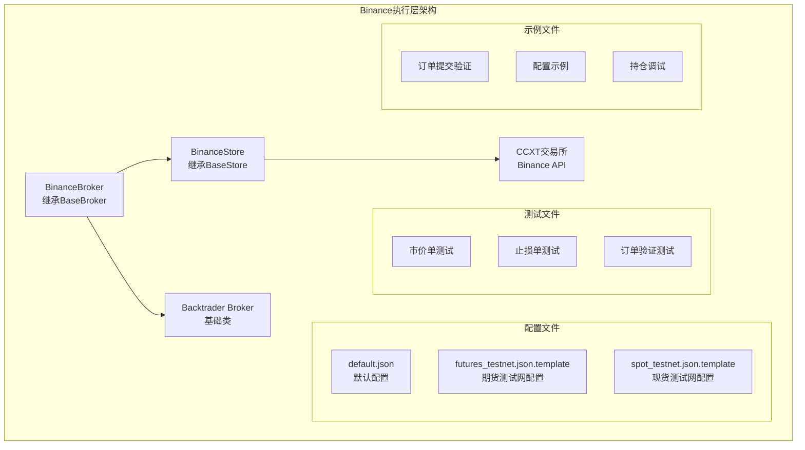
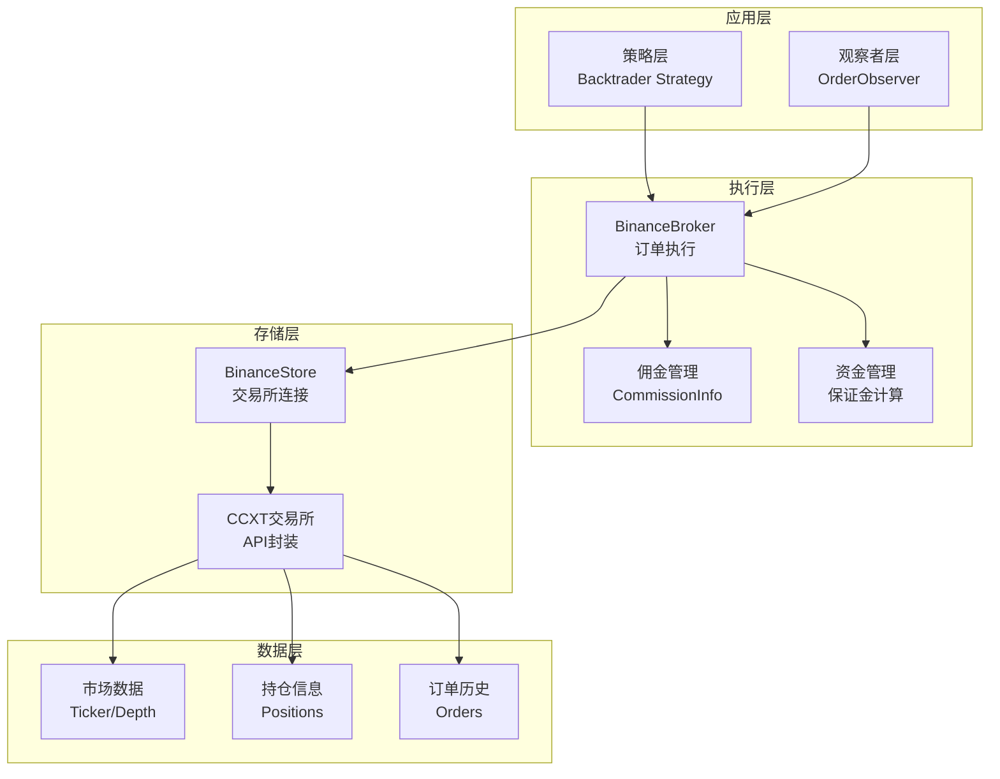
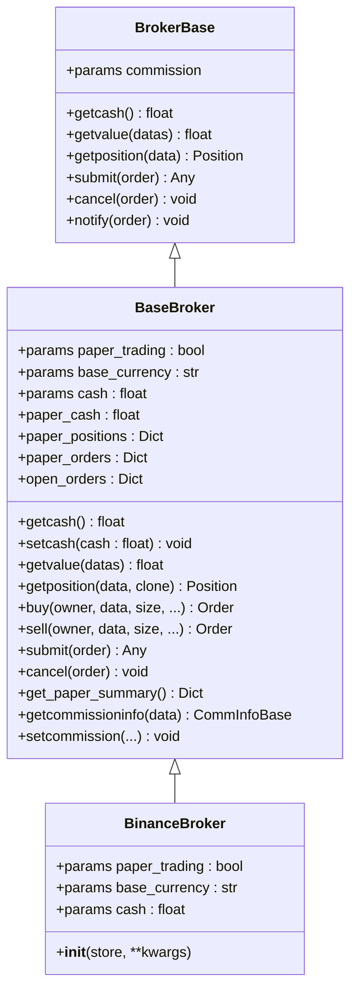
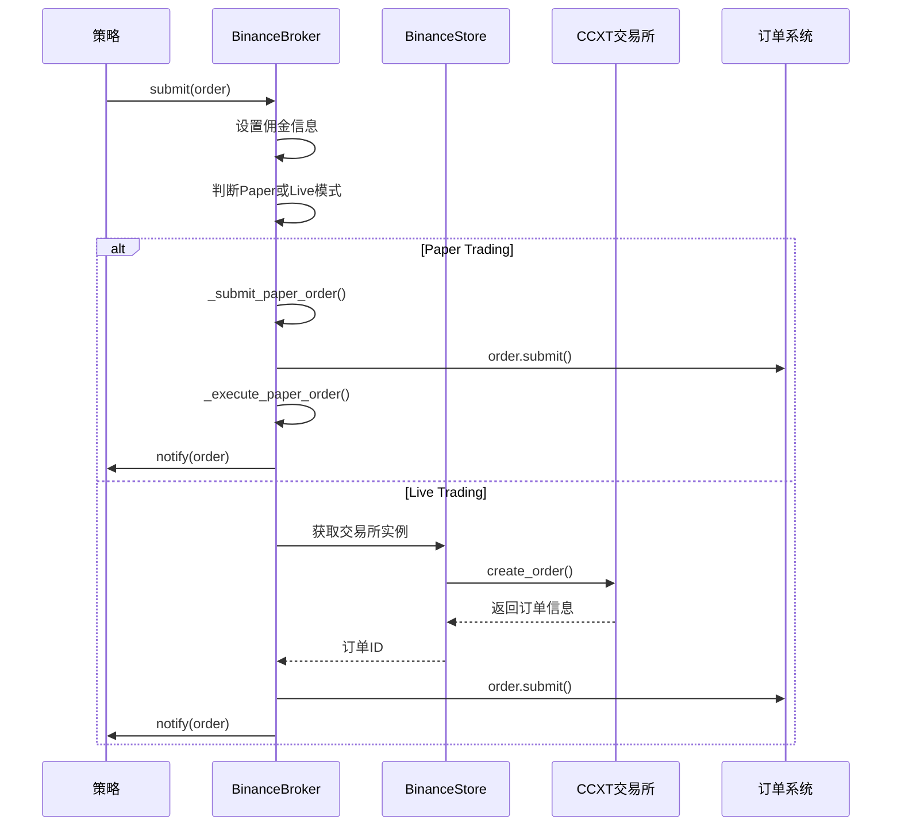
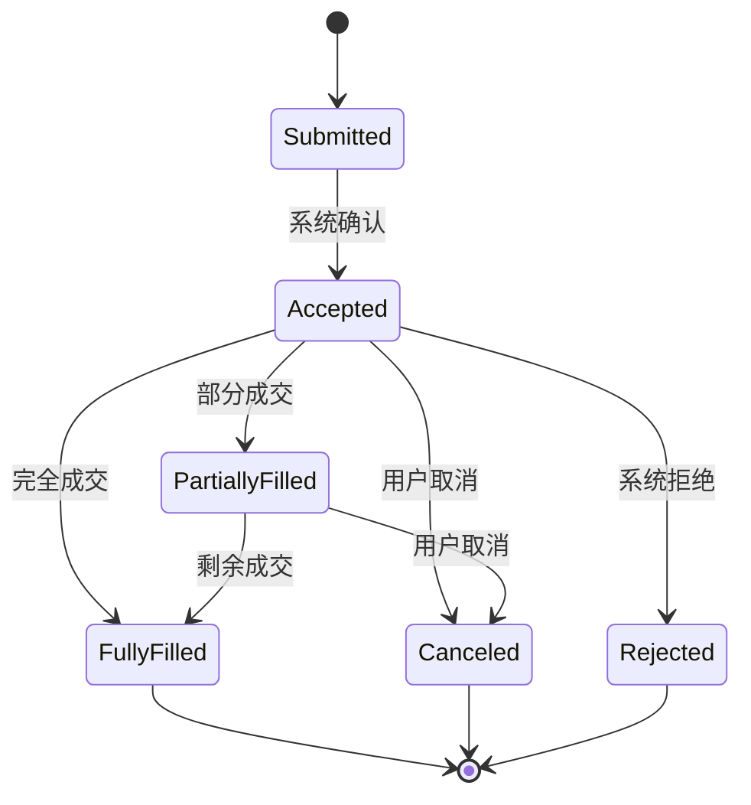
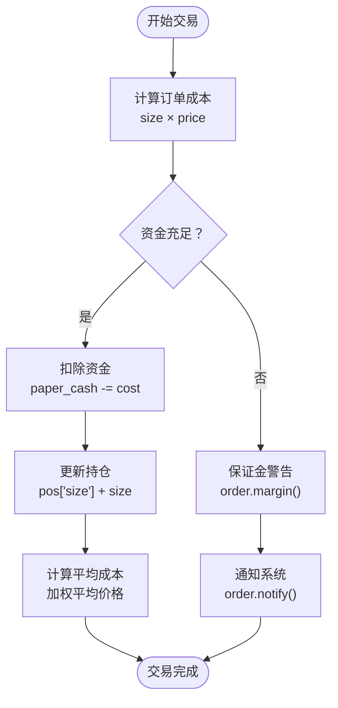
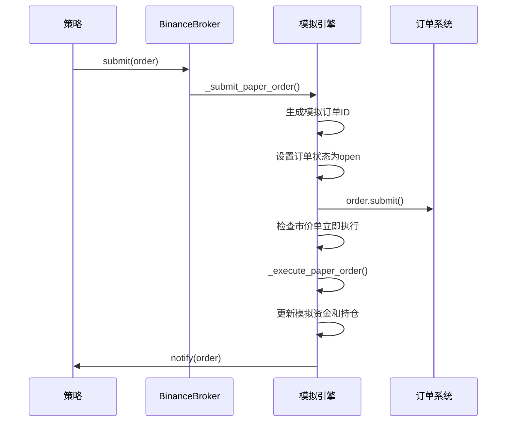
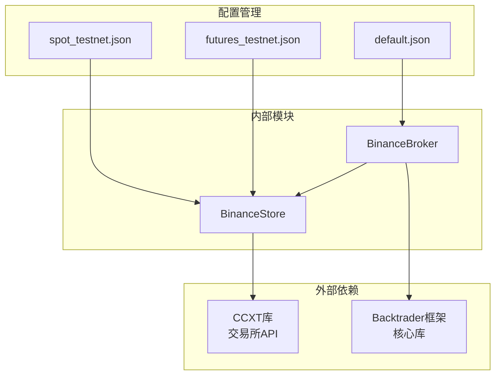

# BinanceBroker执行层

<cite>
**本文档引用的文件**
- [real_trade/binance/broker.py](file://real_trade/binance/broker.py)
- [real_trade/common/base_broker.py](file://real_trade/common/base_broker.py)
- [real_trade/binance/store.py](file://real_trade/binance/store.py)
- [real_trade/common/base_store.py](file://real_trade/common/base_store.py)
- [backtrader/broker.py](file://backtrader/broker.py)
- [backtrader/order.py](file://backtrader/order.py)
- [real_trade/binance/tests/test_market_order.py](file://real_trade/binance/tests/test_market_order.py)
- [real_trade/binance/tests/test_stop_loss.py](file://real_trade/binance/tests/test_stop_loss.py)
- [real_trade/binance/examples/verify_order_submission.py](file://real_trade/binance/examples/verify_order_submission.py)
- [real_trade/binance/config/default.json](file://real_trade/binance/config/default.json)
</cite>

## 目录
1. [简介](#简介)
2. [项目结构](#项目结构)
3. [核心组件](#核心组件)
4. [架构概览](#架构概览)
5. [详细组件分析](#详细组件分析)
6. [依赖关系分析](#依赖关系分析)
7. [性能考虑](#性能考虑)
8. [故障排除指南](#故障排除指南)
9. [结论](#结论)

## 简介

BinanceBroker是Backtrader框架中针对Binance交易所的专用执行层实现。该组件基于通用的BaseBroker基类，通过继承机制实现了Binance特定的订单处理逻辑，为量化交易策略提供了完整的订单执行和交易管理功能。

本执行层支持模拟交易和真实交易两种模式，集成了Binance Futures和Spot市场的交易能力，提供了从订单提交到成交的完整生命周期管理。通过与CCXT库的深度集成，BinanceBroker能够处理各种复杂的订单类型，包括市价单、限价单、止损单、止盈单等，并提供了完善的资金管理和风险控制机制。

## 项目结构

BinanceBroker执行层位于real_trade/binance目录下，采用模块化设计，主要包含以下核心文件：



**图表来源**
- [real_trade/binance/broker.py](file://real_trade/binance/broker.py#L18-L43)
- [real_trade/binance/store.py](file://real_trade/binance/store.py#L18-L125)

**章节来源**
- [real_trade/binance/broker.py](file://real_trade/binance/broker.py#L1-L43)
- [real_trade/binance/store.py](file://real_trade/binance/store.py#L1-L125)

## 核心组件

### BinanceBroker类

BinanceBroker是整个执行层的核心类，完全继承自BaseBroker基类，实现了Binance交易所的特定功能。该类的设计遵循最小实现原则，大部分功能都委托给基类处理。

**关键特性：**
- 继承BaseBroker的所有通用功能
- 支持Paper Trading和Live Trading两种模式
- 集成Binance特定的账户信息获取
- 提供订单生命周期管理

### BinanceStore类

BinanceStore负责与Binance交易所的连接管理，继承自BaseStore基类，实现了交易所特定的配置和连接逻辑。

**核心功能：**
- 单例模式的交易所实例管理
- Demo Trading和生产环境的切换
- CCXT库的集成和配置
- 市场类型（Spot/Future/Delivery）的支持

**章节来源**
- [real_trade/binance/broker.py](file://real_trade/binance/broker.py#L18-L43)
- [real_trade/binance/store.py](file://real_trade/binance/store.py#L18-L125)

## 架构概览

BinanceBroker执行层采用了分层架构设计，通过清晰的职责分离实现了高度的模块化：



**图表来源**
- [real_trade/common/base_broker.py](file://real_trade/common/base_broker.py#L16-L55)
- [real_trade/common/base_store.py](file://real_trade/common/base_store.py#L17-L100)

该架构实现了以下优势：
- **解耦性**：各层之间职责明确，便于维护和扩展
- **可测试性**：支持Paper Trading模式进行单元测试
- **可移植性**：通过抽象基类实现跨交易所的兼容性
- **可扩展性**：易于添加新的订单类型和交易功能

## 详细组件分析

### BaseBroker核心实现

BaseBroker作为通用Broker基类，提供了完整的订单生命周期管理功能：



**图表来源**
- [backtrader/broker.py](file://backtrader/broker.py#L49-L169)
- [real_trade/common/base_broker.py](file://real_trade/common/base_broker.py#L16-L439)
- [real_trade/binance/broker.py](file://real_trade/binance/broker.py#L18-L43)

#### 订单提交流程

BaseBroker实现了完整的订单提交和执行流程：



**图表来源**
- [real_trade/common/base_broker.py](file://real_trade/common/base_broker.py#L182-L256)

#### 订单生命周期管理

BaseBroker提供了完整的订单生命周期管理，包括订单状态转换和通知机制：



**图表来源**
- [real_trade/common/base_broker.py](file://real_trade/common/base_broker.py#L335-L361)

### 订单类型支持

Backtrader框架支持多种订单类型，BinanceBroker通过BaseBroker实现了完整的订单类型处理：

#### 市价单（Market Order）

市价单是最简单的订单类型，按照当前市场价格立即执行：

**实现特点：**
- 无价格限制，按最优价格成交
- 支持立即执行，无等待时间
- 适用于流动性充足的市场

#### 限价单（Limit Order）

限价单指定目标价格，只有当市场价格达到或优于指定价格时才执行：

**实现特点：**
- 可精确控制成交价格
- 可能无法完全成交
- 支持部分成交和完全成交

#### 止损单（Stop Order）

止损单用于控制风险，在价格达到指定水平时触发：

**实现特点：**
- 保护现有头寸免受进一步损失
- 可设置止损价格和触发条件
- 支持止损市价单和止损限价单

#### 止盈单（Take Profit）

止盈单用于锁定利润，在达到预期收益时自动平仓：

**实现特点：**
- 自动实现利润保护
- 可与止损单组合使用
- 支持多种执行类型

**章节来源**
- [real_trade/common/base_broker.py](file://real_trade/common/base_broker.py#L110-L181)
- [backtrader/order.py](file://backtrader/order.py#L620-L641)

### 资金管理功能

BinanceBroker提供了完善的资金管理功能，包括保证金计算、维持保证金和强平机制：

#### 保证金计算

BaseBroker实现了自动化的保证金管理：



**图表来源**
- [real_trade/common/base_broker.py](file://real_trade/common/base_broker.py#L269-L326)

#### 维持保证金

维持保证金确保账户有足够的资金来维持现有头寸：

**管理机制：**
- 实时监控头寸价值和保证金要求
- 自动触发追加保证金通知
- 支持强制平仓保护

#### 强平机制

强平机制用于控制风险，防止账户出现过度亏损：

**触发条件：**
- 账户净值低于维持保证金要求
- 头寸价值大幅波动
- 市场流动性不足

### 交易费用结构

BinanceBroker支持灵活的佣金管理机制：

#### 默认佣金设置

BaseBroker提供了默认的佣金配置：

**默认参数：**
- 佣金费率：0.1%（双向）
- 杠杆倍数：1.0（默认）
- 保证金：None（由交易所决定）

#### 自定义佣金配置

支持为不同交易对设置不同的佣金费率：

**配置选项：**
- commission：佣金费率
- margin：保证金要求
- mult：合约乘数
- leverage：杠杆倍数

**章节来源**
- [real_trade/common/base_broker.py](file://real_trade/common/base_broker.py#L385-L435)

### Paper Trading模式

Paper Trading模式提供了完整的模拟交易功能，无需真实的资金参与：

#### 模拟订单处理



**图表来源**
- [real_trade/common/base_broker.py](file://real_trade/common/base_broker.py#L201-L228)

#### 模拟资金管理

Paper Trading模式使用独立的资金池进行模拟交易：

**资金管理特点：**
- 独立的paper_cash变量
- 不影响真实账户资金
- 支持完整的交易流程测试
- 可随时重置初始资金

### 实际交易示例

以下是一个完整的交易示例，展示了如何在策略中使用BinanceBroker：

#### 市价单交易示例

```python
# 市价单测试示例
def test_market_order():
    # 连接Binance Futures Demo Trading
    store = BinanceStore.get_instance(
        apikey=API_KEY,
        secret=API_SECRET,
        testnet=True,
        market_type="future",
    )
    
    # 获取当前价格
    ticker = exchange.fetch_ticker("ETH/USDT:USDT")
    current_price = ticker['last']
    
    # 市价买入
    buy_order = exchange.create_market_buy_order("ETH/USDT:USDT", 0.05)
    
    # 查询持仓
    positions = exchange.fetch_positions()
    active_pos = [p for p in positions if float(p.get('contracts', 0)) != 0]
    
    # 市价卖出平仓
    sell_order = exchange.create_market_sell_order("ETH/USDT:USDT", 0.05)
```

#### 止损单交易示例

```python
# 止损单测试示例
def test_stop_loss():
    # 获取开仓价格
    entry_price = float(position['entryPrice'])
    
    # 设置止损价格（开仓价的95%）
    stop_price = round(entry_price * 0.95, 2)
    
    # 创建止损单（STOP_MARKET）
    stop_order = exchange.create_order(
        symbol="ETH/USDT:USDT",
        type="STOP_MARKET",
        side="sell",
        amount=0.05,
        params={"stopPrice": stop_price}
    )
```

**章节来源**
- [real_trade/binance/tests/test_market_order.py](file://real_trade/binance/tests/test_market_order.py#L19-L153)
- [real_trade/binance/tests/test_stop_loss.py](file://real_trade/binance/tests/test_stop_loss.py#L91-L129)

## 依赖关系分析

BinanceBroker执行层的依赖关系体现了清晰的层次化设计：



**图表来源**
- [real_trade/binance/broker.py](file://real_trade/binance/broker.py#L14-L15)
- [real_trade/binance/store.py](file://real_trade/binance/store.py#L61-L86)

### 关键依赖关系

#### CCXT集成

BinanceBroker通过CCXT库实现与Binance交易所的直接通信：

**集成特点：**
- 支持多种交易所API
- 统一的接口抽象
- 自动化的错误处理
- 实时市场数据获取

#### Backtrader框架集成

通过继承BrokerBase基类，BinanceBroker获得了完整的Backtrader生态系统支持：

**集成优势：**
- 完整的订单生命周期管理
- 内置的策略回测功能
- 丰富的技术指标支持
- 灵活的交易参数配置

**章节来源**
- [real_trade/binance/store.py](file://real_trade/binance/store.py#L61-L86)
- [backtrader/broker.py](file://backtrader/broker.py#L49-L169)

## 性能考虑

BinanceBroker在设计时充分考虑了性能优化，特别是在高频交易场景下的表现：

### 连接管理优化

**单例模式实现：**
- 避免重复创建交易所连接
- 减少网络延迟和资源消耗
- 支持多实例隔离管理

**连接池管理：**
- 自动化的连接状态监控
- 失败重连机制
- 超时处理和异常恢复

### 内存管理

**订单缓存策略：**
- 有限的订单历史存储
- 自动清理过期订单
- 内存使用监控

**数据结构优化：**
- 使用高效的数据结构存储订单和持仓
- 减少内存碎片和拷贝操作
- 优化序列化和反序列化性能

### 网络优化

**批量请求处理：**
- 合并频繁的API调用
- 异步请求处理
- 请求队列管理

**缓存机制：**
- 市场数据缓存
- 订单状态缓存
- 配置信息缓存

## 故障排除指南

### 常见问题诊断

#### Demo Trading连接问题

**症状：** 订单提交成功但无法在官网上看到记录

**诊断步骤：**
1. 验证Demo Trading配置
2. 检查API密钥权限
3. 确认市场类型设置正确
4. 验证订单参数完整性

#### 订单执行异常

**症状：** 订单被拒绝或部分成交

**排查方法：**
1. 检查账户资金是否充足
2. 验证订单参数格式
3. 确认市场流动性状况
4. 检查交易对限制条件

#### 资金管理问题

**症状：** 模拟交易与真实交易差异较大

**解决方案：**
1. 校准佣金费率设置
2. 检查汇率转换
3. 验证杠杆倍数配置
4. 确认滑点处理设置

**章节来源**
- [real_trade/binance/examples/verify_order_submission.py](file://real_trade/binance/examples/verify_order_submission.py#L18-L216)

### 配置验证

#### 基础配置检查

**API配置验证：**
- API Key和Secret的有效性
- Demo Trading模式的正确启用
- 代理设置的正确配置

**交易参数验证：**
- 初始资金设置的合理性
- 佣金费率的准确性
- 风险控制参数的设置

#### 网络连接测试

**连接状态检查：**
- 基础连接测试
- 市场数据获取测试
- 订单提交测试
- 持仓查询测试

## 结论

BinanceBroker执行层通过精心设计的架构和实现，为Backtrader框架提供了完整的Binance交易所集成方案。该执行层具有以下显著优势：

### 技术优势

**架构设计优秀：** 采用分层架构和职责分离，实现了高度的模块化和可维护性。

**功能完整性：** 支持所有主流订单类型和交易功能，满足专业量化交易需求。

**性能优化到位：** 通过连接管理和内存优化，确保了高效的运行性能。

**测试覆盖全面：** 提供了完整的测试套件和示例代码，便于开发和部署。

### 应用价值

**降低开发门槛：** 通过简化的API设计，降低了量化交易的开发难度。

**提高开发效率：** 完善的功能和工具链，显著提升了开发效率。

**增强系统稳定性：** 通过严格的错误处理和异常恢复机制，确保了系统的稳定运行。

**促进生态发展：** 为量化交易社区提供了高质量的基础设施，推动了整个行业的发展。

BinanceBroker执行层不仅是一个功能强大的交易执行组件，更是Backtrader框架生态系统中的重要基石，为构建专业的量化交易系统奠定了坚实的技术基础。