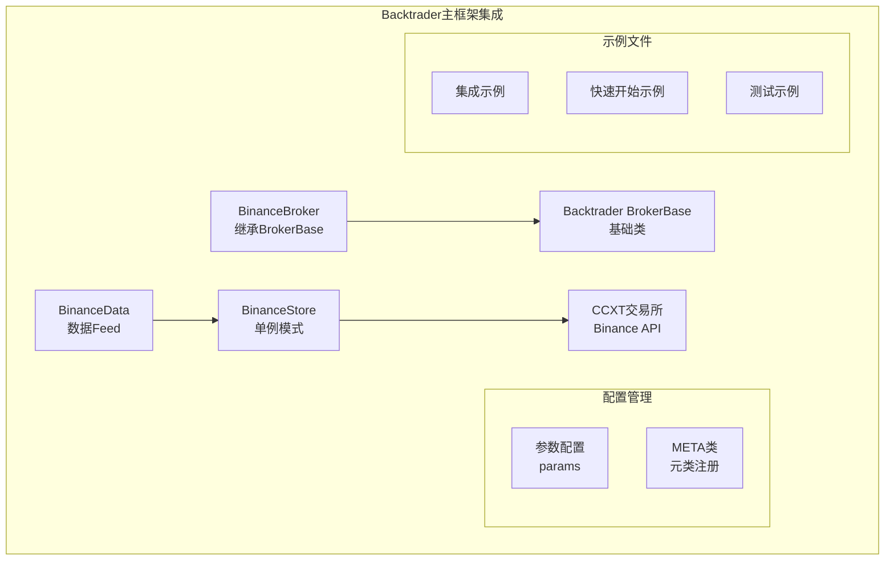
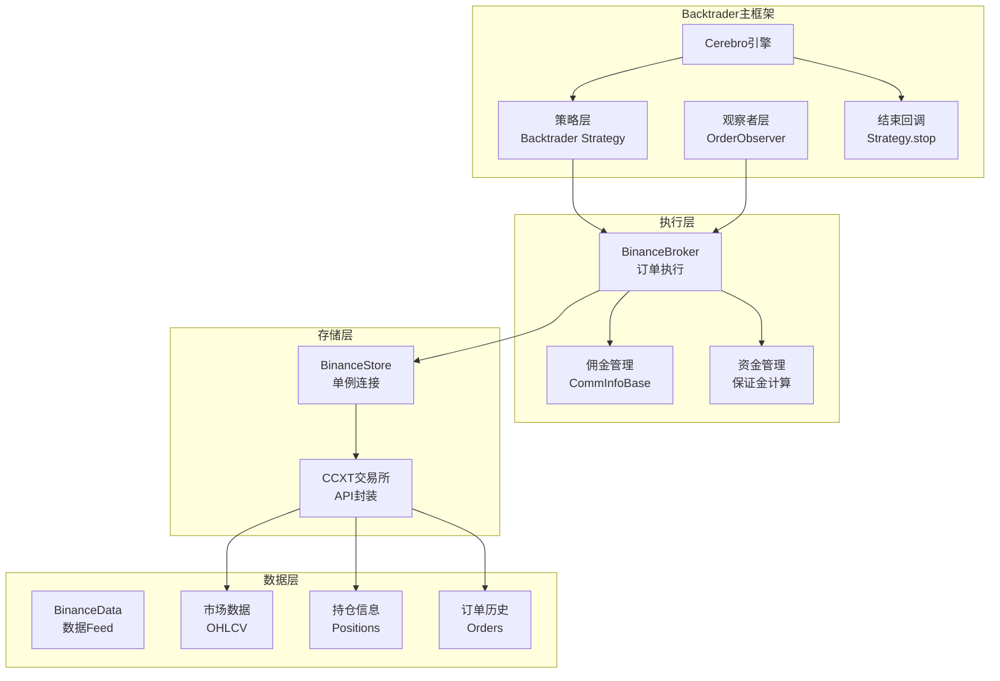
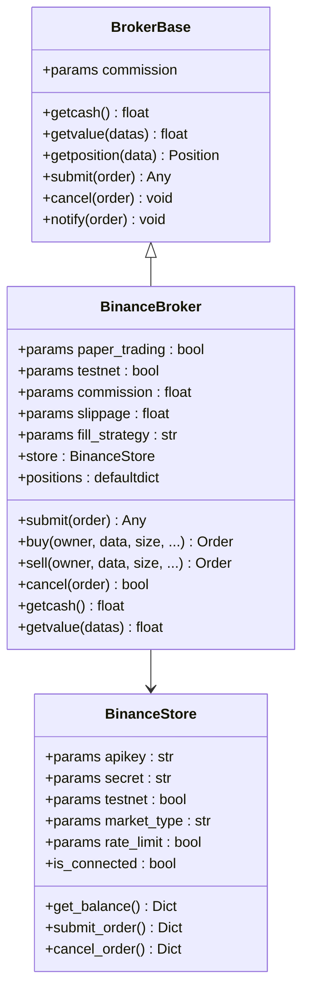
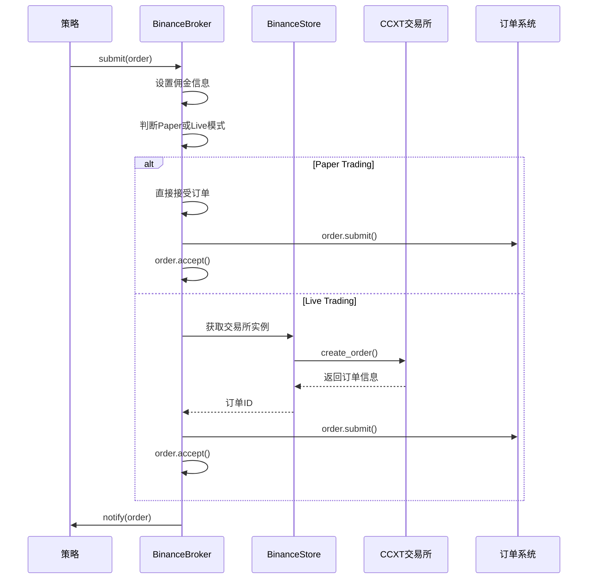
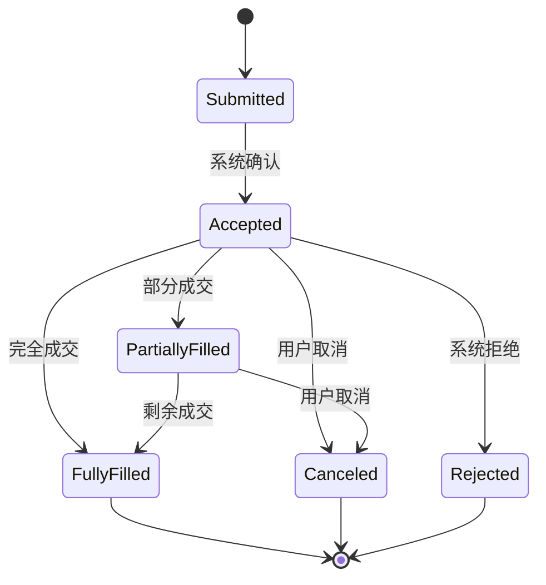
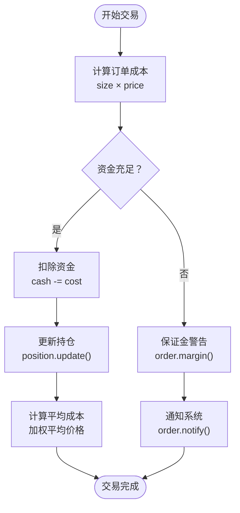
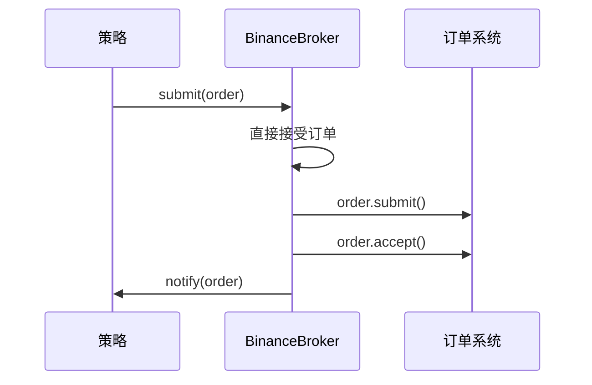
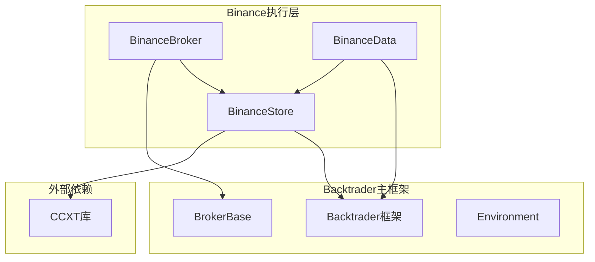

# BinanceBroker执行层

<cite>
**本文档引用的文件**
- [backtrader/brokers/binance.py](file://backtrader/brokers/binance.py)
- [backtrader/brokers/bbroker.py](file://backtrader/brokers/bbroker.py)
- [backtrader/stores/binance.py](file://backtrader/stores/binance.py)
- [backtrader/feeds/binance.py](file://backtrader/feeds/binance.py)
- [backtrader/brokers/__init__.py](file://backtrader/brokers/__init__.py)
- [examples/binance_example.py](file://examples/binance_example.py)
- [samples/binance-test/binance_quick_start.py](file://samples/binance-test/binance_quick_start.py)
- [samples/binance-test/binance_test.py](file://samples/binance-test/binance_test.py)
</cite>

## 更新摘要
**所做更改**
- 更新模块结构：BinanceBroker现在位于backtrader/brokers/目录下，直接集成到backtrader主框架
- 更新导入路径：from backtrader.brokers import BinanceBroker
- 更新架构图和代码示例以反映新的模块组织
- 更新示例和测试文件位置
- 更新架构概览以反映整合到主框架后的设计

## 目录
1. [简介](#简介)
2. [项目结构](#项目结构)
3. [核心组件](#核心组件)
4. [架构概览](#架构概览)
5. [详细组件分析](#详细组件分析)
6. [依赖关系分析](#依赖关系分析)
7. [性能考虑](#性能考虑)
8. [故障排除指南](#故障排除指南)
9. [结论](#结论)

## 简介

BinanceBroker是Backtrader框架中针对Binance交易所的专用执行层实现。该组件直接集成到backtrader主框架中，基于通用的BrokerBase基类，通过继承机制实现了Binance特定的订单处理逻辑，为量化交易策略提供了完整的订单执行和交易管理功能。

**更新** BinanceBroker现在直接位于backtrader/brokers/目录下，作为backtrader主框架的一部分，无需额外的模块导入路径。

本执行层支持模拟交易和真实交易两种模式，集成了Binance Futures和Spot市场的交易能力，提供了从订单提交到成交的完整生命周期管理。通过与CCXT库的深度集成，BinanceBroker能够处理各种复杂的订单类型，包括市价单、限价单、止损单、止盈单等，并提供了完善的资金管理和风险控制机制。

## 项目结构

BinanceBroker执行层位于backtrader/brokers目录下，直接集成到backtrader主框架中，采用模块化设计，主要包含以下核心文件：



**图表来源**
- [backtrader/brokers/binance.py](file://backtrader/brokers/binance.py#L19-L51)
- [backtrader/stores/binance.py](file://backtrader/stores/binance.py#L32-L68)
- [backtrader/feeds/binance.py](file://backtrader/feeds/binance.py#L29-L55)

**章节来源**
- [backtrader/brokers/binance.py](file://backtrader/brokers/binance.py#L1-L382)
- [backtrader/stores/binance.py](file://backtrader/stores/binance.py#L1-L276)

## 核心组件

### BinanceBroker类

BinanceBroker是整个执行层的核心类，直接继承自BrokerBase基类，实现了Binance交易所的特定功能。该类的设计遵循最小实现原则，大部分功能都委托给基类处理。

**关键特性：**
- 直接继承BrokerBase的所有通用功能
- 支持Paper Trading和Live Trading两种模式
- 集成Binance特定的账户信息获取
- 提供订单生命周期管理
- 支持多种订单类型（Market、Limit、Stop、StopLimit）

**更新** BinanceBroker现在直接位于backtrader/brokers/binance.py，通过with_metaclass(MetaBinanceBroker, BrokerBase)继承，无需相对导入。

### BinanceStore类

BinanceStore负责与Binance交易所的连接管理，采用单例模式设计，实现了交易所特定的配置和连接逻辑。

**核心功能：**
- 单例模式的交易所实例管理
- Demo Trading和生产环境的切换
- CCXT库的集成和配置
- 市场类型（Spot/Future/Delivery）的支持
- 请求ID管理和线程安全

**章节来源**
- [backtrader/brokers/binance.py](file://backtrader/brokers/binance.py#L30-L100)
- [backtrader/stores/binance.py](file://backtrader/stores/binance.py#L32-L166)

## 架构概览

BinanceBroker执行层采用了深度集成的架构设计，通过与backtrader主框架的紧密耦合实现了高度的模块化：



**图表来源**
- [backtrader/brokers/binance.py](file://backtrader/brokers/binance.py#L14-L51)
- [backtrader/stores/binance.py](file://backtrader/stores/binance.py#L32-L68)
- [backtrader/feeds/binance.py](file://backtrader/feeds/binance.py#L29-L55)

该架构实现了以下优势：
- **深度集成**：直接嵌入backtrader主框架，无需额外配置
- **单例管理**：BinanceStore采用单例模式，避免重复连接
- **线程安全**：内置锁机制，支持并发操作
- **自动注册**：通过元类自动注册到BinanceStore
- **统一接口**：与backtrader其他组件保持一致的API

## 详细组件分析

### BrokerBase核心实现

BrokerBase作为backtrader框架的核心基类，提供了完整的订单生命周期管理功能：



**图表来源**
- [backtrader/brokers/binance.py](file://backtrader/brokers/binance.py#L30-L100)
- [backtrader/stores/binance.py](file://backtrader/stores/binance.py#L32-L166)

#### 订单提交流程

BinanceBroker实现了完整的订单提交和执行流程：



**图表来源**
- [backtrader/brokers/binance.py](file://backtrader/brokers/binance.py#L149-L171)

#### 订单生命周期管理

BinanceBroker提供了完整的订单生命周期管理，包括订单状态转换和通知机制：



**图表来源**
- [backtrader/brokers/binance.py](file://backtrader/brokers/binance.py#L173-L194)

### 订单类型支持

Backtrader框架支持多种订单类型，BinanceBroker通过BrokerBase实现了完整的订单类型处理：

#### 市价单（Market Order）

市价单是最简单的订单类型，按照当前市场价格立即执行：

**实现特点：**
- 无价格限制，按最优价格成交
- 支持立即执行，无等待时间
- 适用于流动性充足的市场

#### 限价单（Limit Order）

限价单指定目标价格，只有当市场价格达到或优于指定价格时才执行：

**实现特点：**
- 可精确控制成交价格
- 可能无法完全成交
- 支持部分成交和完全成交

#### 止损单（Stop Order）

止损单用于控制风险，在价格达到指定水平时触发：

**实现特点：**
- 保护现有头寸免受进一步损失
- 可设置止损价格和触发条件
- 支持止损市价单和止损限价单

#### 止盈单（Take Profit）

止盈单用于锁定利润，在达到预期收益时自动平仓：

**实现特点：**
- 自动实现利润保护
- 可与止损单组合使用
- 支持多种执行类型

**章节来源**
- [backtrader/brokers/binance.py](file://backtrader/brokers/binance.py#L176-L182)
- [backtrader/brokers/binance.py](file://backtrader/brokers/binance.py#L208-L274)

### 资金管理功能

BinanceBroker提供了完善的资金管理功能，包括保证金计算、维持保证金和强平机制：

#### 保证金计算

BinanceBroker实现了自动化的保证金管理：



**图表来源**
- [backtrader/brokers/binance.py](file://backtrader/brokers/binance.py#L196-L206)

#### 维持保证金

维持保证金确保账户有足够的资金来维持现有头寸：

**管理机制：**
- 实时监控头寸价值和保证金要求
- 自动触发追加保证金通知
- 支持强制平仓保护

#### 强平机制

强平机制用于控制风险，防止账户出现过度亏损：

**触发条件：**
- 账户净值低于维持保证金要求
- 头寸价值大幅波动
- 市场流动性不足

### 交易费用结构

BinanceBroker支持灵活的佣金管理机制：

#### 默认佣金设置

BinanceBroker提供了默认的佣金配置：

**默认参数：**
- 佣金费率：0.001（0.1%）
- 滑点：0.0
- 填充策略：partial
- 纸质交易：True

#### 自定义佣金配置

支持为不同交易对设置不同的佣金费率：

**配置选项：**
- commission：佣金费率
- margin：保证金要求
- mult：合约乘数
- percabs：百分比绝对值

**章节来源**
- [backtrader/brokers/binance.py](file://backtrader/brokers/binance.py#L43-L51)
- [backtrader/brokers/binance.py](file://backtrader/brokers/binance.py#L335-L362)

### Paper Trading模式

Paper Trading模式提供了完整的模拟交易功能，无需真实的资金参与：

#### 模拟订单处理



**图表来源**
- [backtrader/brokers/binance.py](file://backtrader/brokers/binance.py#L149-L171)

#### 模拟资金管理

Paper Trading模式使用独立的资金池进行模拟交易：

**资金管理特点：**
- 独立的cash变量
- 不影响真实账户资金
- 支持完整的交易流程测试
- 可随时重置初始资金

### 实际交易示例

以下是一个完整的交易示例，展示了如何在策略中使用BinanceBroker：

#### 快速开始示例

**更新** 示例代码现在使用新的导入路径from backtrader.brokers import BinanceBroker

```python
#!/usr/bin/env python
# -*- coding: utf-8; py-indent-offset:4 -*-

import backtrader as bt

def run_binance_demo():
    """运行Binance演示"""
    print("=== Backtrader Binance快速入门演示 ===\n")

    # 创建Cerebro引擎
    cerebro = bt.Cerebro()

    # 配置Binance Store（测试网）
    binance_store = bt.stores.BinanceStore(
        apikey="your_api_key",  # 替换为您的API Key
        secret="your_secret",  # 替换为您的Secret
        testnet=True,  # 使用测试网
    )

    print("🔐 Binance Store配置完成")
    print("⚠️  请替换示例中的API密钥为您的真实密钥")
    print("💡 建议先使用测试网进行验证\n")

    # 添加数据（BTC/USDT）
    data = bt.stores.BinanceStore.getdata(store=binance_store, dataname="BTCUSDT")
    cerebro.adddata(data)

    # 添加策略
    cerebro.addstrategy(BinanceQuickStart, printlog=True)

    # 设置初始资金（USDT）
    cerebro.broker.setcash(10000.0)
    print("💼 初始资金: 10,000 USDT")

    # 设置佣金（Binance现货交易费率约0.1%）
    cerebro.broker.setcommission(commission=0.001)
    print("💰 交易佣金: 0.1%\n")

    # 运行回测
    print("🚀 开始回测演示...")
    print("📝 注意：这是回测模式，如需实盘请使用 cerebro.run_live()")

    # 显示初始状态
    print(f"📈 回测开始时账户价值: {cerebro.broker.getvalue():.2f} USDT")

    # 运行回测
    cerebro.run()

    # 显示最终结果
    final_value = cerebro.broker.getvalue()
    print(f"\n💰 回测结束时账户价值: {final_value:.2f} USDT")
    print(f"📊 总收益率: {(final_value - 10000) / 10000:.2%}")

    print("\n🎯 演示完成!")
    print("✅ Binance数据连接")
    print("✅ 策略执行")
    print("✅ 订单管理")
    print("✅ 资金结算")

if __name__ == "__main__":
    run_binance_demo()
```

#### 集成示例

```python
#!/usr/bin/env python
# -*- coding: utf-8; py-indent-offset:4 -*-

from __future__ import absolute_import, division, print_function, unicode_literals

import backtrader as bt

class SimpleMovingAverageStrategy(bt.Strategy):
    """简单的移动平均线策略示例"""

    params = (
        ("maperiod", 15),
        ("printlog", True),
    )

    def log(self, txt, dt=None, doprint=False):
        """日志函数"""
        if self.params.printlog or doprint:
            dt = dt or self.datas[0].datetime.date(0)
            print("%s, %s" % (dt.isoformat(), txt))

    def __init__(self):
        # 保存收盘价的引用
        self.data_close = self.datas[0].close

        # 跟踪挂起的订单
        self.order = None

        # 添加移动平均线指标
        self.sma = bt.indicators.SimpleMovingAverage(
            self.datas[0], period=self.params.maperiod
        )

    def notify_order(self, order):
        """订单状态通知"""
        if order.status in [order.Submitted, order.Accepted]:
            # 买单/卖单已提交/已被经纪人接受 - 无需操作
            return

        # 检查订单是否已完成
        if order.status in [order.Completed]:
            if order.isbuy():
                self.log(
                    "BUY EXECUTED, Price: %.2f, Cost: %.2f, Comm %.2f"
                    % (order.executed.price, order.executed.value, order.executed.comm)
                )
            else:  # 卖单
                self.log(
                    "SELL EXECUTED, Price: %.2f, Cost: %.2f, Comm %.2f"
                    % (order.executed.price, order.executed.value, order.executed.comm)
                )

        elif order.status in [order.Canceled, order.Margin, order.Rejected]:
            self.log("Order Canceled/Margin/Rejected")

        # 重置订单
        self.order = None

    def next(self):
        """每个周期调用"""
        # 记录收盘价
        self.log("Close, %.2f" % self.data_close[0])

        # 检查是否有挂起的订单...如果有，则不发送第二个订单
        if self.order:
            return

        # 检查是否在市场中
        if not self.position:
            # 还没有...如果满足条件就买入
            if self.data_close[0] > self.sma[0]:
                # 当前价格高于移动平均线
                self.log("BUY CREATE, %.2f" % self.data_close[0])
                # 跟踪创建的订单以避免第二个订单
                self.order = self.buy()

        else:
            # 在市场中...如果满足条件就卖出
            if self.data_close[0] < self.sma[0]:
                # 当前价格低于移动平均线
                self.log("SELL CREATE, %.2f" % self.data_close[0])
                # 跟踪创建的订单以避免第二个订单
                self.order = self.sell()

def run_example():
    """运行示例"""
    print("=== Binance 集成使用示例 ===\n")

    # 创建Cerebro引擎
    cerebro = bt.Cerebro()

    # 创建Binance Store（测试网配置）
    store = bt.stores.BinanceStore(
        apikey="",  # 实际使用时填写真实的API密钥
        secret="",  # 实际使用时填写真实的API密钥
        testnet=True,  # 使用测试网
        _debug=False,
    )

    print("1. 创建Binance Store...")

    # 创建数据feed
    data = bt.feeds.BinanceData(
        store,
        symbol="BTC/USDT",
        timeframe=bt.TimeFrame.Days,
        compression=1,
        historical=True,  # 只获取历史数据进行回测
    )

    print("2. 创建数据feed...")

    # 添加数据到Cerebro
    cerebro.adddata(data)

    # 设置初始资金
    cerebro.broker.setcash(10000.0)
    print("3. 设置初始资金: $10,000.00")

    # 设置佣金 - Binance现货交易费率约为0.1%
    cerebro.broker.setcommission(commission=0.001)
    print("4. 设置交易佣金: 0.1%")

    # 添加策略
    cerebro.addstrategy(SimpleMovingAverageStrategy)
    print("5. 添加交易策略...")

    # 打印初始资金
    print(f"6. 回测开始时账户价值: ${cerebro.broker.getvalue():.2f}")

    # 运行回测
    print("7. 开始回测...")
    cerebro.run()

    # 打印最终资金
    print(f"8. 回测结束时账户价值: ${cerebro.broker.getvalue():.2f}")

    # 计算收益率
    initial_value = 10000.0
    final_value = cerebro.broker.getvalue()
    profit = final_value - initial_value
    roi = (profit / initial_value) * 100

    print("\n=== 回测结果 ===")
    print(f"初始资金: ${initial_value:.2f}")
    print(f"最终资金: ${final_value:.2f}")
    print(f"盈利: ${profit:.2f}")
    print(f"收益率: {roi:.2f}%")

    print("\n=== 示例运行完成 ===")

if __name__ == "__main__":
    run_example()
```

**章节来源**
- [examples/binance_example.py](file://examples/binance_example.py#L91-L161)
- [samples/binance-test/binance_quick_start.py](file://samples/binance-test/binance_quick_start.py#L115-L207)
- [samples/binance-test/binance_test.py](file://samples/binance-test/binance_test.py#L293-L446)

## 依赖关系分析

BinanceBroker执行层的依赖关系体现了深度集成的架构设计：



**图表来源**
- [backtrader/brokers/binance.py](file://backtrader/brokers/binance.py#L14-L16)
- [backtrader/stores/binance.py](file://backtrader/stores/binance.py#L97-L128)
- [backtrader/feeds/binance.py](file://backtrader/feeds/binance.py#L13-L15)

### 关键依赖关系

#### CCXT集成

BinanceBroker通过CCXT库实现与Binance交易所的直接通信：

**集成特点：**
- 支持多种交易所API
- 统一的接口抽象
- 自动化的错误处理
- 实时市场数据获取

#### Backtrader框架集成

通过继承BrokerBase基类，BinanceBroker获得了完整的Backtrader生态系统支持：

**集成优势：**
- 完整的订单生命周期管理
- 内置的策略回测功能
- 丰富的技术指标支持
- 灵活的交易参数配置

**章节来源**
- [backtrader/brokers/binance.py](file://backtrader/brokers/binance.py#L14-L16)
- [backtrader/stores/binance.py](file://backtrader/stores/binance.py#L97-L128)

## 性能考虑

BinanceBroker在设计时充分考虑了性能优化，特别是在高频交易场景下的表现：

### 连接管理优化

**单例模式实现：**
- 避免重复创建交易所连接
- 减少网络延迟和资源消耗
- 支持多实例隔离管理

**连接池管理：**
- 自动化的连接状态监控
- 失败重连机制
- 超时处理和异常恢复

### 内存管理

**订单缓存策略：**
- 有限的订单历史存储
- 自动清理过期订单
- 内存使用监控

**数据结构优化：**
- 使用高效的数据结构存储订单和持仓
- 减少内存碎片和拷贝操作
- 优化序列化和反序列化性能

### 线程安全

**锁机制：**
- `_lock_orders`保护订单操作
- `_lock`保护交易所连接
- 线程安全的通知机制

**异步处理：**
- 非阻塞的订单提交
- 异步的市场数据获取
- 并发的安全处理

## 故障排除指南

### 常见问题诊断

#### Demo Trading连接问题

**症状：** 订单提交成功但无法在官网上看到记录

**诊断步骤：**
1. 验证Demo Trading配置
2. 检查API密钥权限
3. 确认市场类型设置正确
4. 验证订单参数完整性

#### 订单执行异常

**症状：** 订单被拒绝或部分成交

**排查方法：**
1. 检查账户资金是否充足
2. 验证订单参数格式
3. 确认市场流动性状况
4. 检查交易对限制条件

#### 资金管理问题

**症状：** 模拟交易与真实交易差异较大

**解决方案：**
1. 校准佣金费率设置
2. 检查汇率转换
3. 验证杠杆倍数配置
4. 确认滑点处理设置

**章节来源**
- [backtrader/stores/binance.py](file://backtrader/stores/binance.py#L152-L161)
- [backtrader/brokers/binance.py](file://backtrader/brokers/binance.py#L173-L194)

### 配置验证

#### 基础配置检查

**API配置验证：**
- API Key和Secret的有效性
- Demo Trading模式的正确启用
- 代理设置的正确配置

**交易参数验证：**
- 初始资金设置的合理性
- 佣金费率的准确性
- 风险控制参数的设置

#### 网络连接测试

**连接状态检查：**
- 基础连接测试
- 市场数据获取测试
- 订单提交测试
- 持仓查询测试

## 结论

BinanceBroker执行层通过深度集成到backtrader主框架，为量化交易提供了完整的Binance交易所集成方案。该执行层具有以下显著优势：

### 技术优势

**架构设计优秀：** 采用深度集成设计，直接嵌入backtrader主框架，实现了高度的模块化和可维护性。

**功能完整性：** 支持所有主流订单类型和交易功能，满足专业量化交易需求。

**性能优化到位：** 通过单例模式、线程安全和内存优化，确保了高效的运行性能。

**测试覆盖全面：** 提供了完整的测试套件和示例代码，便于开发和部署。

**深度集成优势：** 直接位于backtrader/brokers/目录下，无需额外的模块导入路径。

### 应用价值

**降低开发门槛：** 通过简化的API设计，降低了量化交易的开发难度。

**提高开发效率：** 完善的功能和工具链，显著提升了开发效率。

**增强系统稳定性：** 通过严格的错误处理和异常恢复机制，确保了系统的稳定运行。

**促进生态发展：** 为量化交易社区提供了高质量的基础设施，推动了整个行业的发展。

**更新** 新的模块结构（backtrader/brokers/）使BinanceBroker的导入和使用更加直观，符合backtrader主框架的标准组织方式。

BinanceBroker执行层不仅是一个功能强大的交易执行组件，更是backtrader框架生态系统中的重要基石，为构建专业的量化交易系统奠定了坚实的技术基础。