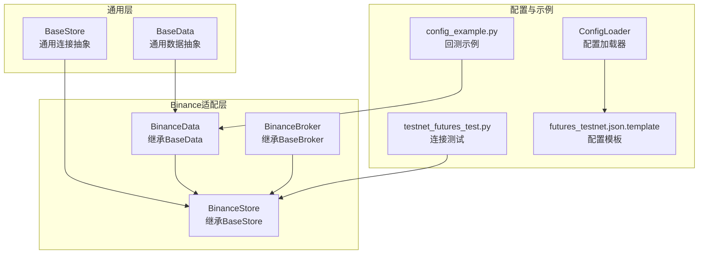
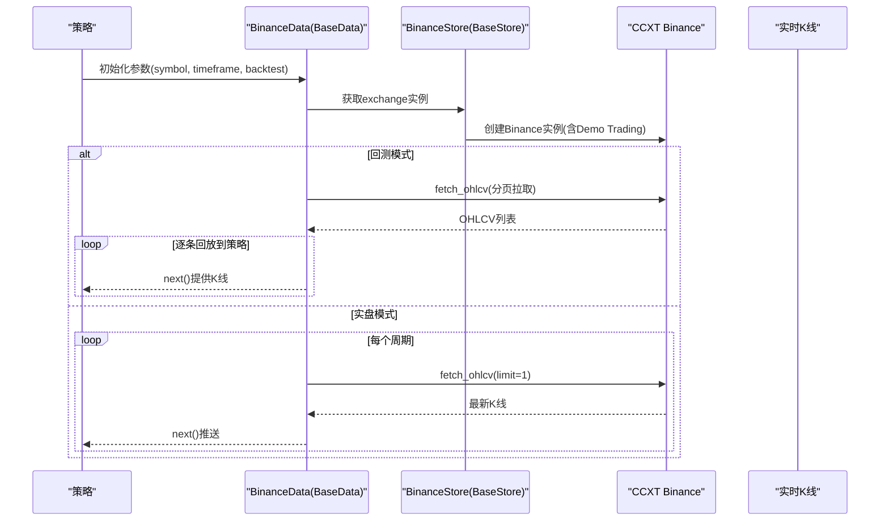
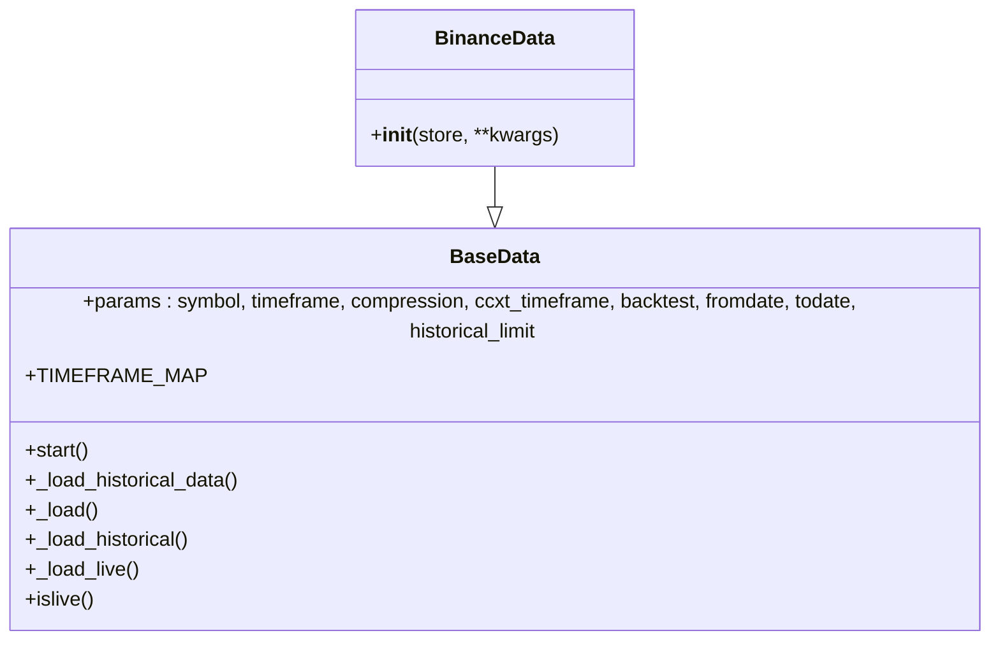
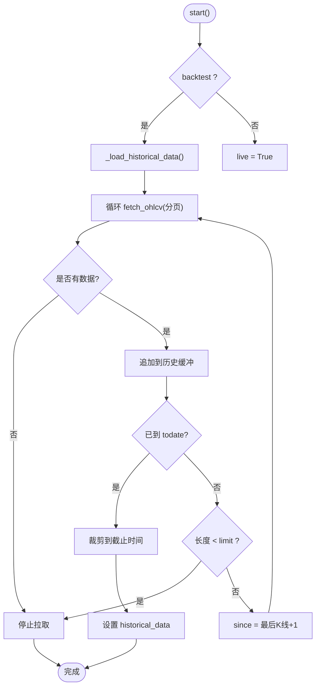
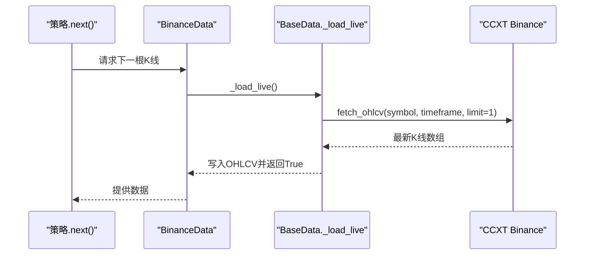
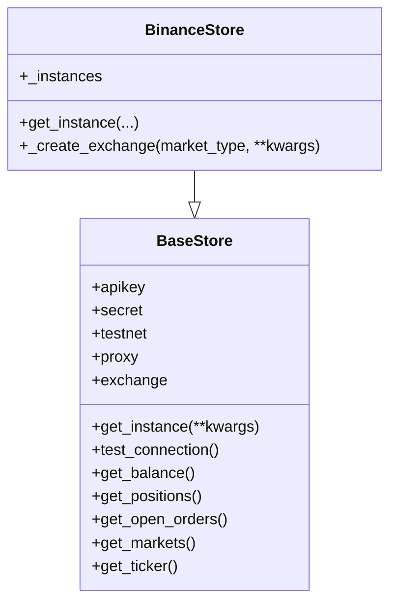
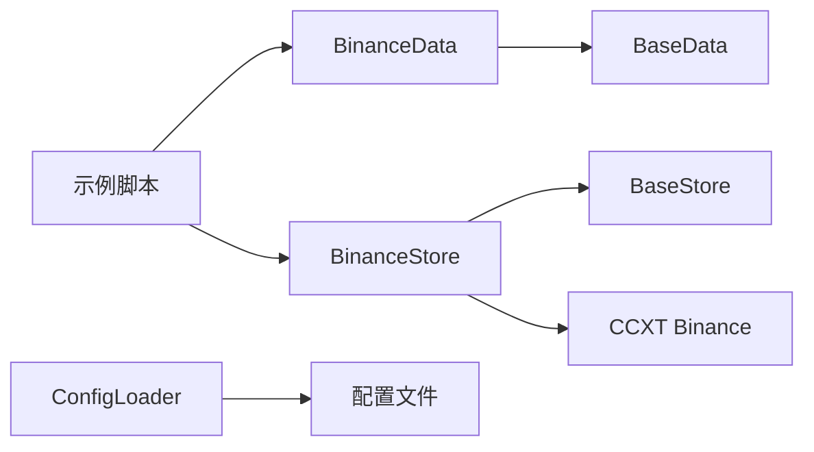

# BinanceDataFeed数据层

<cite>
**本文引用的文件**
- [real_trade/binance/datafeed.py](file://real_trade/binance/datafeed.py)
- [real_trade/binance/store.py](file://real_trade/binance/store.py)
- [real_trade/binance/broker.py](file://real_trade/binance/broker.py)
- [real_trade/common/base_data.py](file://real_trade/common/base_data.py)
- [real_trade/common/base_store.py](file://real_trade/common/base_store.py)
- [real_trade/binance/README.md](file://real_trade/binance/README.md)
- [real_trade/binance/examples/testnet_futures_test.py](file://real_trade/binance/examples/testnet_futures_test.py)
- [real_trade/binance/examples/config_example.py](file://real_trade/binance/examples/config_example.py)
- [real_trade/binance/config_loader.py](file://real_trade/binance/config_loader.py)
- [real_trade/binance/config/futures_testnet.json.template](file://real_trade/binance/config/futures_testnet.json.template)
</cite>

## 目录
1. [简介](#简介)
2. [项目结构](#项目结构)
3. [核心组件](#核心组件)
4. [架构总览](#架构总览)
5. [详细组件分析](#详细组件分析)
6. [依赖关系分析](#依赖关系分析)
7. [性能考虑](#性能考虑)
8. [故障排查指南](#故障排查指南)
9. [结论](#结论)
10. [附录](#附录)

## 简介
本文件面向Backtrader生态中的BinanceDataFeed数据层，系统性阐述实时数据获取与历史数据回测的实现机制。重点说明BinanceData类如何继承BaseData基类并复用通用数据加载逻辑，支持OHLCV（K线）数据的获取与处理，并给出时间框架配置、数据频率控制、内存管理、数据质量保障、回测优化等关键参数与最佳实践。同时提供端到端的使用示例与排障建议。

## 项目结构
BinanceDataFeed位于real_trade/binance目录，采用“通用基类 + 交易所适配”的分层设计：
- 通用层：real_trade/common 下的BaseData与BaseStore，提供统一的数据与连接抽象。
- 交易所适配层：real_trade/binance 下的BinanceData、BinanceStore、BinanceBroker，负责Binance特有配置与行为。
- 配置与示例：config_loader.py、config/*.json模板、examples/*示例脚本。

图表来源
- [real_trade/binance/datafeed.py](file://real_trade/binance/datafeed.py#L18-L38)
- [real_trade/binance/store.py](file://real_trade/binance/store.py#L18-L125)
- [real_trade/binance/broker.py](file://real_trade/binance/broker.py#L18-L43)
- [real_trade/common/base_data.py](file://real_trade/common/base_data.py#L16-L210)
- [real_trade/common/base_store.py](file://real_trade/common/base_store.py#L17-L194)
- [real_trade/binance/config_loader.py](file://real_trade/binance/config_loader.py#L14-L221)
- [real_trade/binance/examples/testnet_futures_test.py](file://real_trade/binance/examples/testnet_futures_test.py#L25-L156)
- [real_trade/binance/examples/config_example.py](file://real_trade/binance/examples/config_example.py#L239-L363)
- [real_trade/binance/config/futures_testnet.json.template](file://real_trade/binance/config/futures_testnet.json.template#L1-L34)

章节来源
- [real_trade/binance/README.md](file://real_trade/binance/README.md#L1-L259)

## 核心组件
- BaseData：提供统一的时间框架映射、历史数据批量拉取、回放与实时数据加载、以及Backtest/Live模式切换。
- BinanceData：继承BaseData，复用其OHLCV加载与回放逻辑，无需重复实现。
- BaseStore：提供单例连接管理、代理检测、连接测试、账户/市场/订单查询等通用能力。
- BinanceStore：继承BaseStore，封装CCXT Binance实例创建、Demo Trading开关、市场类型配置等Binance特有逻辑。
- BinanceBroker：继承BaseBroker，复用通用订单逻辑，适配Binance场景。
- ConfigLoader：提供配置文件加载、合并、保存与路径读取工具，支撑回测/实盘/演示模式切换。

章节来源
- [real_trade/common/base_data.py](file://real_trade/common/base_data.py#L16-L210)
- [real_trade/binance/datafeed.py](file://real_trade/binance/datafeed.py#L18-L38)
- [real_trade/common/base_store.py](file://real_trade/common/base_store.py#L17-L194)
- [real_trade/binance/store.py](file://real_trade/binance/store.py#L18-L125)
- [real_trade/binance/broker.py](file://real_trade/binance/broker.py#L18-L43)
- [real_trade/binance/config_loader.py](file://real_trade/binance/config_loader.py#L14-L221)

## 架构总览
BinanceDataFeed遵循“数据层（Data）—存储层（Store）—Broker—Cerebro”的标准Backtrader流水线。BinanceData通过BaseData统一加载OHLCV，支持回测（历史数据）与实盘（实时K线）两种模式；BinanceStore负责与CCXT Binance建立连接并启用Demo Trading；BinanceBroker提供订单执行与账户管理。

图表来源
- [real_trade/common/base_data.py](file://real_trade/common/base_data.py#L88-L202)
- [real_trade/binance/store.py](file://real_trade/binance/store.py#L52-L102)

## 详细组件分析

### BinanceData类与BaseData继承关系
- BinanceData完全继承BaseData，无需额外实现，即可获得：
  - 时间框架映射与压缩参数解析
  - 历史数据分页拉取与截断
  - 回测模式下的顺序回放
  - 实盘模式下的增量推送
- BaseData内部维护historical_data与historical_index，确保回测时的稳定迭代。

图表来源
- [real_trade/common/base_data.py](file://real_trade/common/base_data.py#L16-L210)
- [real_trade/binance/datafeed.py](file://real_trade/binance/datafeed.py#L18-L38)

章节来源
- [real_trade/binance/datafeed.py](file://real_trade/binance/datafeed.py#L18-L38)
- [real_trade/common/base_data.py](file://real_trade/common/base_data.py#L51-L210)

### 历史数据回测流程（BaseData）
- start阶段根据backtest参数决定加载策略：
  - 回测：预加载历史数据至内存，按索引顺序回放
  - 实盘：标记live模式，进入实时推送
- 分页拉取策略：
  - 以historical_limit为批次大小，循环fetch_ohlcv
  - 若未达到limit或到达todate边界，则停止
  - 将时间戳转换为UTC并写入lines.datetime/open/high/low/close/volume

图表来源
- [real_trade/common/base_data.py](file://real_trade/common/base_data.py#L88-L144)

章节来源
- [real_trade/common/base_data.py](file://real_trade/common/base_data.py#L88-L144)

### 实时数据推送流程（BaseData）
- 实盘模式下，每次next()调用触发_fetch_live()：
  - 调用exchange.fetch_ohlcv(limit=1)获取最新K线
  - 解析时间戳与OHLCV字段，写入lines
  - 返回True表示有新数据，否则None/False

图表来源
- [real_trade/common/base_data.py](file://real_trade/common/base_data.py#L172-L198)

章节来源
- [real_trade/common/base_data.py](file://real_trade/common/base_data.py#L172-L198)

### BinanceStore连接与Demo Trading
- 单例管理：按apikey+testnet组合缓存实例，避免重复创建
- CCXT创建：设置apiKey/secret/enableRateLimit/defaultType等
- Demo Trading：通过exchange.enable_demo_trading(true)启用（CCXT v4.5.6+），否则抛错提示升级
- 代理支持：可自动检测系统代理或显式传入

图表来源
- [real_trade/common/base_store.py](file://real_trade/common/base_store.py#L17-L194)
- [real_trade/binance/store.py](file://real_trade/binance/store.py#L18-L125)

章节来源
- [real_trade/binance/store.py](file://real_trade/binance/store.py#L25-L102)
- [real_trade/common/base_store.py](file://real_trade/common/base_store.py#L63-L132)

### 时间框架与数据频率控制
- BaseData提供通用时间框架映射，将ccxt_timeframe字符串映射为Backtrader的TimeFrame与compression
- 支持分钟级（1m~12h）、日/周/月等周期
- BinanceData无需重写，直接沿用映射表

章节来源
- [real_trade/common/base_data.py](file://real_trade/common/base_data.py#L34-L49)
- [real_trade/common/base_data.py](file://real_trade/common/base_data.py#L70-L87)

### 数据类型与获取方式
- 支持OHLCV（K线）数据：通过exchange.fetch_ohlcv统一获取
- 交易与深度数据：可在BinanceData/Broker中扩展（当前datafeed.py注释中预留位置）
- 行情快照：通过store.get_ticker()获取

章节来源
- [real_trade/common/base_data.py](file://real_trade/common/base_data.py#L110-L116)
- [real_trade/binance/datafeed.py](file://real_trade/binance/datafeed.py#L36-L38)
- [real_trade/common/base_store.py](file://real_trade/common/base_store.py#L175-L181)

### 数据质量保障与异常处理
- 历史数据拉取：捕获异常并清空历史缓冲，避免脏数据
- 实时数据：捕获异常返回None，保持策略主循环稳定
- 连接测试：提供test_connection()与get_ticker()等基础校验
- Demo Trading：严格要求CCXT版本，避免功能缺失

章节来源
- [real_trade/common/base_data.py](file://real_trade/common/base_data.py#L141-L143)
- [real_trade/common/base_data.py](file://real_trade/common/base_data.py#L196-L198)
- [real_trade/common/base_store.py](file://real_trade/common/base_store.py#L116-L131)
- [real_trade/binance/store.py](file://real_trade/binance/store.py#L92-L99)

### 回测模式下的数据处理优化
- 预加载：一次性拉取historical_limit批次，减少网络请求
- 截断：按fromdate/todate精确裁剪，避免越界
- 内存管理：historical_data为列表，historical_index顺序访问，空间换时间
- 频率控制：通过ccxt_timeframe与compression控制K线粒度

章节来源
- [real_trade/common/base_data.py](file://real_trade/common/base_data.py#L98-L144)
- [real_trade/common/base_data.py](file://real_trade/common/base_data.py#L152-L170)

### 配置与使用示例
- 配置文件：futures_testnet.json.template提供API、交易、数据、策略、代理等默认项
- 配置加载：ConfigLoader支持默认值合并、路径读取、保存
- 示例脚本：
  - testnet_futures_test.py：连接测试，验证余额、Ticker、持仓、历史K线
  - config_example.py：从配置创建引擎，运行策略并输出统计

章节来源
- [real_trade/binance/config/futures_testnet.json.template](file://real_trade/binance/config/futures_testnet.json.template#L1-L34)
- [real_trade/binance/config_loader.py](file://real_trade/binance/config_loader.py#L14-L221)
- [real_trade/binance/examples/testnet_futures_test.py](file://real_trade/binance/examples/testnet_futures_test.py#L25-L156)
- [real_trade/binance/examples/config_example.py](file://real_trade/binance/examples/config_example.py#L239-L363)

## 依赖关系分析
- BinanceData依赖BaseData提供的OHLCV加载与回放逻辑
- BinanceStore依赖BaseStore的连接抽象与通用查询接口
- CCXT作为外部依赖，负责与Binance API通信
- 配置系统通过ConfigLoader与模板文件协同，支撑多模式切换

图表来源
- [real_trade/binance/datafeed.py](file://real_trade/binance/datafeed.py#L14-L38)
- [real_trade/binance/store.py](file://real_trade/binance/store.py#L15-L125)
- [real_trade/common/base_data.py](file://real_trade/common/base_data.py#L16-L210)
- [real_trade/common/base_store.py](file://real_trade/common/base_store.py#L17-L194)
- [real_trade/binance/config_loader.py](file://real_trade/binance/config_loader.py#L14-L221)

章节来源
- [real_trade/binance/datafeed.py](file://real_trade/binance/datafeed.py#L14-L38)
- [real_trade/binance/store.py](file://real_trade/binance/store.py#L15-L125)
- [real_trade/common/base_data.py](file://real_trade/common/base_data.py#L16-L210)
- [real_trade/common/base_store.py](file://real_trade/common/base_store.py#L17-L194)
- [real_trade/binance/config_loader.py](file://real_trade/binance/config_loader.py#L14-L221)

## 性能考虑
- 网络请求批量化：historical_limit控制单次拉取量，平衡延迟与吞吐
- 回测内存占用：历史数据全部驻留内存，建议合理设置historical_limit与时间范围
- 实时推送频率：由timeframe/ccxt_timeframe决定，避免过于频繁导致策略过载
- 代理与网络：自动代理检测可降低外网访问不稳定带来的抖动

## 故障排查指南
- CCXT版本问题：Demo Trading需要CCXT v4.5.6+，否则会报错提示升级
- 连接失败：使用test_connection()验证API密钥与网络
- 无数据返回：确认symbol格式、timeframe映射、fromdate/todate边界
- 代理问题：若需使用代理，显式传入proxy或关闭自动检测

章节来源
- [real_trade/binance/store.py](file://real_trade/binance/store.py#L92-L99)
- [real_trade/common/base_store.py](file://real_trade/common/base_store.py#L116-L131)
- [real_trade/common/base_data.py](file://real_trade/common/base_data.py#L110-L116)

## 结论
BinanceDataFeed通过BaseData与BaseStore的抽象，实现了统一的历史回测与实时推送能力。BinanceData仅需继承即可获得OHLCV的完整生命周期管理；BinanceStore负责连接与Demo Trading配置；配合ConfigLoader与示例脚本，用户可快速搭建回测/实盘/演示三种模式的交易系统。建议在生产环境中结合配置文件与连接测试，确保数据链路稳定与合规。

## 附录
- 快速开始参考
  - 使用配置文件创建引擎：参见示例脚本与README中的示例
  - 连接测试：运行testnet_futures_test.py验证API连通性
- 关键参数清单
  - symbol/timeframe/ccxt_timeframe/compression/backtest/fromdate/todate/historical_limit
  - market_type/testnet/paper_trading/proxy/auto_detect

章节来源
- [real_trade/binance/README.md](file://real_trade/binance/README.md#L9-L43)
- [real_trade/binance/examples/config_example.py](file://real_trade/binance/examples/config_example.py#L239-L363)
- [real_trade/binance/examples/testnet_futures_test.py](file://real_trade/binance/examples/testnet_futures_test.py#L25-L156)
- [real_trade/binance/config_loader.py](file://real_trade/binance/config_loader.py#L14-L221)