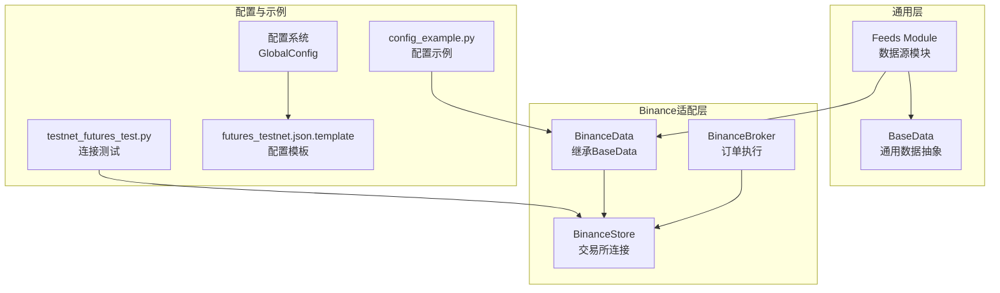
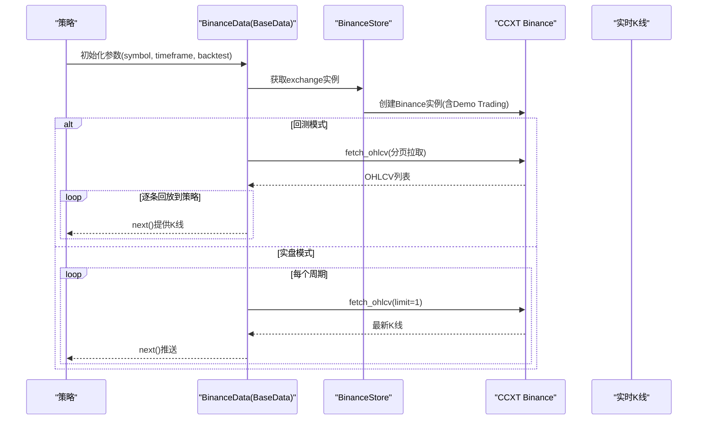
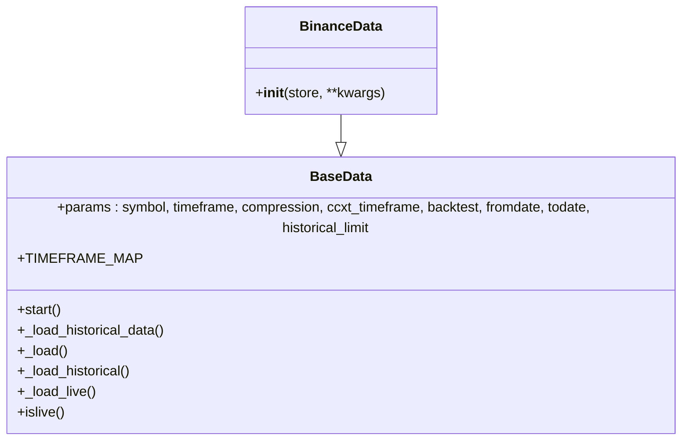
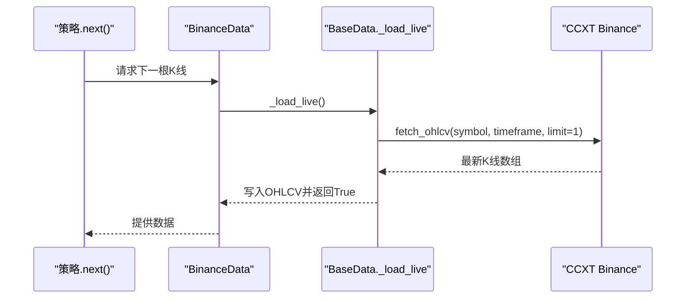
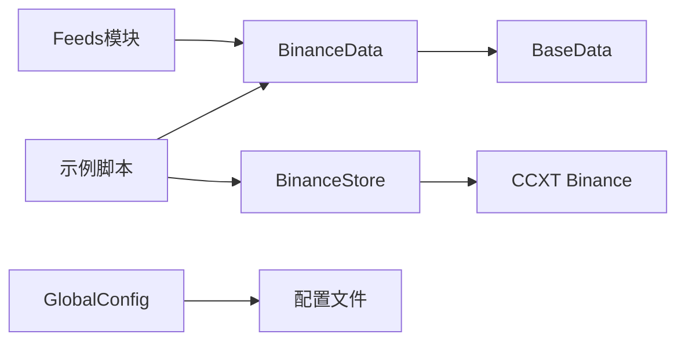

# BinanceDataFeed数据层

<cite>
**本文档引用的文件**
- [real_trade/feeds/binancedata.py](file://real_trade/feeds/binancedata.py)
- [real_trade/feeds/basedata.py](file://real_trade/feeds/basedata.py)
- [real_trade/feeds/__init__.py](file://real_trade/feeds/__init__.py)
- [real_trade/stores/binancestore.py](file://real_trade/stores/binancestore.py)
- [real_trade/stores/__init__.py](file://real_trade/stores/__init__.py)
- [real_trade/brokers/binancebroker.py](file://real_trade/brokers/binancebroker.py)
- [real_trade/utils/config.py](file://real_trade/utils/config.py)
- [real_trade/examples/config_example.py](file://real_trade/examples/config_example.py)
- [real_trade/examples/testnet_futures_test.py](file://real_trade/examples/testnet_futures_test.py)
- [real_trade/config/binance/futures_testnet.json.template](file://real_trade/config/binance/futures_testnet.json.template)
</cite>

## 更新摘要
**所做更改**
- 更新了BinanceData的模块路径：从`real_trade/binance/datafeed.py`迁移到`real_trade/feeds/binancedata.py`
- 更新了导入路径：从`from real_trade.binancedata import BinanceData`更新为`from real_trade.feeds import BinanceData`
- 更新了项目结构图和依赖关系分析，反映新的模块组织方式
- 更新了示例代码中的导入语句和配置文件位置
- 完善了feeds模块的初始化文件和导出结构

## 目录
1. [简介](#简介)
2. [项目结构](#项目结构)
3. [核心组件](#核心组件)
4. [架构总览](#架构总览)
5. [详细组件分析](#详细组件分析)
6. [依赖关系分析](#依赖关系分析)
7. [性能考虑](#性能考虑)
8. [故障排查指南](#故障排查指南)
9. [结论](#结论)
10. [附录](#附录)

## 简介
本文件面向Backtrader生态中的BinanceDataFeed数据层，系统性阐述实时数据获取与历史数据回测的实现机制。重点说明BinanceData类如何继承BaseData基类并复用通用数据加载逻辑，支持OHLCV（K线）数据的获取与处理，并给出时间框架配置、数据频率控制、内存管理、数据质量保障、回测优化等关键参数与最佳实践。同时提供端到端的使用示例与排障建议。

**更新** 本版本反映了模块结构的重大调整：BinanceData现已位于`real_trade/feeds/`目录下，导入路径更新为`from real_trade.feeds import BinanceData`。

## 项目结构
BinanceDataFeed位于`real_trade/feeds/`目录，采用"通用基类 + 交易所适配"的分层设计：
- 通用层：`real_trade/feeds/`下的BaseData，提供统一的数据抽象。
- 交易所适配层：`real_trade/feeds/binancedata.py`中的BinanceData，继承BaseData。
- 存储层：`real_trade/stores/binancestore.py`中的BinanceStore，负责与交易所连接。
- 经纪商层：`real_trade/brokers/binancebroker.py`中的BinanceBroker，处理订单执行。
- 配置与示例：`real_trade/utils/config.py`、配置模板文件、示例脚本。

**图表来源**
- [real_trade/feeds/binancedata.py](file://real_trade/feeds/binancedata.py#L14-L17)
- [real_trade/feeds/basedata.py](file://real_trade/feeds/basedata.py#L17-L211)
- [real_trade/feeds/__init__.py](file://real_trade/feeds/__init__.py#L9-L17)
- [real_trade/stores/binancestore.py](file://real_trade/stores/binancestore.py)
- [real_trade/brokers/binancebroker.py](file://real_trade/brokers/binancebroker.py)
- [real_trade/utils/config.py](file://real_trade/utils/config.py)
- [real_trade/examples/config_example.py](file://real_trade/examples/config_example.py#L33-L36)
- [real_trade/examples/testnet_futures_test.py](file://real_trade/examples/testnet_futures_test.py#L22)

**章节来源**
- [real_trade/feeds/binancedata.py](file://real_trade/feeds/binancedata.py#L1-L18)
- [real_trade/feeds/basedata.py](file://real_trade/feeds/basedata.py#L1-L211)
- [real_trade/feeds/__init__.py](file://real_trade/feeds/__init__.py#L1-L18)

## 核心组件
- **BaseData**：提供统一的时间框架映射、历史数据批量拉取、回放与实时数据加载、以及Backtest/Live模式切换。
- **BinanceData**：继承BaseData，复用其OHLCV加载与回放逻辑，无需重复实现。
- **BinanceStore**：继承BaseStore，封装CCXT Binance实例创建、Demo Trading开关、市场类型配置等Binance特有逻辑。
- **BinanceBroker**：继承BaseBroker，复用通用订单逻辑，适配Binance场景。
- **Feeds模块**：提供统一的数据源导入接口，支持BinanceData的便捷使用。

**更新** BinanceData现在位于`real_trade/feeds/binancedata.py`，通过`real_trade/feeds/__init__.py`进行导出。

**章节来源**
- [real_trade/feeds/basedata.py](file://real_trade/feeds/basedata.py#L17-L211)
- [real_trade/feeds/binancedata.py](file://real_trade/feeds/binancedata.py#L14-L17)
- [real_trade/feeds/__init__.py](file://real_trade/feeds/__init__.py#L9-L17)

## 架构总览
BinanceDataFeed遵循"数据层（Data）—存储层（Store）—Broker—Cerebro"的标准Backtrader流水线。BinanceData通过BaseData统一加载OHLCV，支持回测（历史数据）与实盘（实时K线）两种模式；BinanceStore负责与CCXT Binance建立连接并启用Demo Trading；BinanceBroker提供订单执行与账户管理。

**图表来源**
- [real_trade/feeds/basedata.py](file://real_trade/feeds/basedata.py#L89-L203)
- [real_trade/stores/binancestore.py](file://real_trade/stores/binancestore.py)

## 详细组件分析

### BinanceData类与BaseData继承关系
- BinanceData完全继承BaseData，无需额外实现，即可获得：
  - 时间框架映射与压缩参数解析
  - 历史数据分页拉取与截断
  - 回测模式下的顺序回放
  - 实盘模式下的增量推送
- BaseData内部维护historical_data与historical_index，确保回测时的稳定迭代。

**图表来源**
- [real_trade/feeds/basedata.py](file://real_trade/feeds/basedata.py#L17-L211)
- [real_trade/feeds/binancedata.py](file://real_trade/feeds/binancedata.py#L14-L17)

**章节来源**
- [real_trade/feeds/binancedata.py](file://real_trade/feeds/binancedata.py#L14-L17)
- [real_trade/feeds/basedata.py](file://real_trade/feeds/basedata.py#L52-L211)

### 历史数据回测流程（BaseData）
- start阶段根据backtest参数决定加载策略：
  - 回测：预加载历史数据至内存，按索引顺序回放
  - 实盘：标记live模式，进入实时推送
- 分页拉取策略：
  - 以historical_limit为批次大小，循环fetch_ohlcv
  - 若未达到limit或到达todate边界，则停止
  - 将时间戳转换为UTC并写入lines.datetime/open/high/low/close/volume

**图表来源**
- [real_trade/feeds/basedata.py](file://real_trade/feeds/basedata.py#L99-L145)

**章节来源**
- [real_trade/feeds/basedata.py](file://real_trade/feeds/basedata.py#L99-L145)

### 实时数据推送流程（BaseData）
- 实盘模式下，每次next()调用触发_fetch_live()：
  - 调用exchange.fetch_ohlcv(limit=1)获取最新K线
  - 解析时间戳与OHLCV字段，写入lines
  - 返回True表示有新数据，否则None/False

**图表来源**
- [real_trade/feeds/basedata.py](file://real_trade/feeds/basedata.py#L173-L199)

**章节来源**
- [real_trade/feeds/basedata.py](file://real_trade/feeds/basedata.py#L173-L199)

### Feeds模块与导入路径
- **更新** 新的模块结构提供了统一的数据源导入接口
- feeds模块通过`__init__.py`导出BaseData、BaseWebSocket和BinanceData
- 支持从`real_trade.feeds`包直接导入BinanceData
- 提供了向后兼容的导入方式

**章节来源**
- [real_trade/feeds/__init__.py](file://real_trade/feeds/__init__.py#L9-L17)

### 配置系统与示例集成
- **更新** 示例代码现在使用新的导入路径
- `config_example.py`展示了如何从`real_trade.feeds`导入BinanceData
- 配置文件位置保持不变，仍位于`real_trade/config/binance/`
- GlobalConfig系统继续提供统一的配置管理

**章节来源**
- [real_trade/examples/config_example.py](file://real_trade/examples/config_example.py#L33-L36)
- [real_trade/config/binance/futures_testnet.json.template](file://real_trade/config/binance/futures_testnet.json.template#L1-L15)

## 依赖关系分析
- BinanceData依赖BaseData提供的OHLCV加载与回放逻辑
- BinanceStore负责与CCXT Binance建立连接并管理连接状态
- 配置系统通过GlobalConfig与模板文件协同，支撑多模式切换
- feeds模块提供统一的导入接口，简化了用户的使用体验

**图表来源**
- [real_trade/feeds/binancedata.py](file://real_trade/feeds/binancedata.py#L11)
- [real_trade/feeds/basedata.py](file://real_trade/feeds/basedata.py#L52-L56)
- [real_trade/stores/binancestore.py](file://real_trade/stores/binancestore.py)
- [real_trade/utils/config.py](file://real_trade/utils/config.py)
- [real_trade/examples/config_example.py](file://real_trade/examples/config_example.py#L33-L36)
- [real_trade/feeds/__init__.py](file://real_trade/feeds/__init__.py#L9-L17)

**章节来源**
- [real_trade/feeds/binancedata.py](file://real_trade/feeds/binancedata.py#L11)
- [real_trade/feeds/basedata.py](file://real_trade/feeds/basedata.py#L52-L56)
- [real_trade/stores/binancestore.py](file://real_trade/stores/binancestore.py)
- [real_trade/utils/config.py](file://real_trade/utils/config.py)
- [real_trade/examples/config_example.py](file://real_trade/examples/config_example.py#L33-L36)
- [real_trade/feeds/__init__.py](file://real_trade/feeds/__init__.py#L9-L17)

## 性能考虑
- 网络请求批量化：historical_limit控制单次拉取量，平衡延迟与吞吐
- 回测内存占用：历史数据全部驻留内存，建议合理设置historical_limit与时间范围
- 实时推送频率：由timeframe/ccxt_timeframe决定，避免过于频繁导致策略过载
- 模块化设计：新的feeds模块结构提高了代码的可维护性和可扩展性

## 故障排查指南
- **导入错误**：确保使用正确的导入路径`from real_trade.feeds import BinanceData`
- 连接失败：使用testnet_futures_test.py验证API连通性
- 配置问题：检查配置文件位置和格式，确保JSON模板正确
- 版本兼容性：确认CCXT版本满足Demo Trading功能要求

**章节来源**
- [real_trade/examples/testnet_futures_test.py](file://real_trade/examples/testnet_futures_test.py#L25-L158)

## 结论
BinanceDataFeed通过BaseData与新的feeds模块结构，实现了统一的历史回测与实时推送能力。BinanceData仅需继承即可获得OHLCV的完整生命周期管理；BinanceStore负责连接与Demo Trading配置；配合GlobalConfig系统和示例脚本，用户可快速搭建回测/实盘/演示三种模式的交易系统。新的模块结构提高了代码的组织性和可维护性，建议在生产环境中结合配置文件与连接测试，确保数据链路稳定与合规。

## 附录
- **快速开始参考**
  - 使用配置文件创建引擎：参见`config_example.py`中的示例
  - 连接测试：运行`testnet_futures_test.py`验证API连通性
  - 新导入路径：`from real_trade.feeds import BinanceData`
- **关键参数清单**
  - symbol/timeframe/ccxt_timeframe/compression/backtest/fromdate/todate/historical_limit
  - market_type/testnet/paper_trading/proxy/auto_detect

**章节来源**
- [real_trade/examples/config_example.py](file://real_trade/examples/config_example.py#L182-L259)
- [real_trade/examples/testnet_futures_test.py](file://real_trade/examples/testnet_futures_test.py#L25-L158)
- [real_trade/config/binance/futures_testnet.json.template](file://real_trade/config/binance/futures_testnet.json.template#L1-L15)