# BinanceStore存储层

<cite>
**本文引用的文件**
- [store.py](file://real_trade/binance/store.py)
- [base_store.py](file://real_trade/common/base_store.py)
- [base_broker.py](file://real_trade/common/base_broker.py)
- [base_data.py](file://real_trade/common/base_data.py)
- [broker.py](file://real_trade/binance/broker.py)
- [datafeed.py](file://real_trade/binance/datafeed.py)
- [testnet_futures_test.py](file://real_trade/binance/examples/testnet_futures_test.py)
- [check_available_symbols.py](file://real_trade/binance/examples/check_available_symbols.py)
- [verify_order_submission.py](file://real_trade/binance/examples/verify_order_submission.py)
- [default.json](file://real_trade/binance/config/default.json)
- [config_loader.py](file://real_trade/binance/config_loader.py)
- [README.md](file://real_trade/binance/README.md)
- [README.md](file://real_trade/README.md)
</cite>

## 目录
1. [简介](#简介)
2. [项目结构](#项目结构)
3. [核心组件](#核心组件)
4. [架构概览](#架构概览)
5. [详细组件分析](#详细组件分析)
6. [依赖分析](#依赖分析)
7. [性能考虑](#性能考虑)
8. [故障排除指南](#故障排除指南)
9. [结论](#结论)
10. [附录](#附录)

## 简介
本文件详细阐述基于 CCXT 库的 BinanceStore 存储层实现，重点解释其与 BaseStore 基类的关系、继承体系以及在实盘交易中的应用。BinanceStore 通过继承 BaseStore，仅需少量特有配置即可完成 Binance 交易所的连接管理，包括 API 密钥认证、Demo Trading 环境切换、代理配置、单例实例管理等。同时，结合 Broker 与 Data Feed 的基类实现，形成统一的交易引擎构建方式。

## 项目结构
Binance 模块采用模块化设计，遵循统一的三层架构：Store（连接管理）、Broker（订单与资金）、Data（数据源）。BinanceStore 位于 real_trade/binance/store.py，继承自 real_trade/common/base_store.py，其余组件分别对应 Broker 与 Data 的基类实现。

**图表来源**
- [store.py](file://real_trade/binance/store.py#L18-L125)
- [base_store.py](file://real_trade/common/base_store.py#L17-L194)
- [broker.py](file://real_trade/binance/broker.py#L18-L43)
- [datafeed.py](file://real_trade/binance/datafeed.py#L18-L38)
- [base_broker.py](file://real_trade/common/base_broker.py#L16-L439)
- [base_data.py](file://real_trade/common/base_data.py#L16-L210)

**章节来源**
- [README.md](file://real_trade/README.md#L1-L266)
- [README.md](file://real_trade/binance/README.md#L1-L259)

## 核心组件
- BinanceStore：继承 BaseStore，负责 Binance 交易所连接、单例管理、Demo Trading 切换、代理配置、CCXT 交易所实例创建。
- BaseStore：抽象出通用连接管理接口，包含单例锁、系统代理检测、连接测试、账户余额/总价值查询、持仓/未成交订单获取、市场信息加载、行情快照获取等。
- BinanceBroker/BinanceData：分别继承 BaseBroker/BaseData，提供与 Binance 交易所兼容的订单执行与数据加载能力。

**章节来源**
- [store.py](file://real_trade/binance/store.py#L18-L125)
- [base_store.py](file://real_trade/common/base_store.py#L17-L194)
- [broker.py](file://real_trade/binance/broker.py#L18-L43)
- [datafeed.py](file://real_trade/binance/datafeed.py#L18-L38)

## 架构概览
BinanceStore 的核心职责是基于 CCXT 创建 Binance 交易所实例，并根据 testnet 参数启用 Demo Trading 环境。其构造过程如下：

**图表来源**
- [store.py](file://real_trade/binance/store.py#L27-L125)
- [base_store.py](file://real_trade/common/base_store.py#L63-L101)

**章节来源**
- [store.py](file://real_trade/binance/store.py#L27-L125)
- [base_store.py](file://real_trade/common/base_store.py#L63-L101)

## 详细组件分析

### BinanceStore 类分析
- 单例管理：通过类变量 _instances 与线程锁 _lock 实现线程安全的单例创建，键由 apikey 与 testnet 组合决定。
- CCXT 交易所创建：在 _create_exchange 中构建 exchange_config，设置 apiKey、secret、enableRateLimit、defaultType（market_type），并按需注入 proxies。
- Demo Trading 切换：当 testnet 为 True 时，调用 enable_demo_trading(true)，若 CCXT 版本过低则抛出异常提示升级。
- 初始化链路：__init__ 调用父类 BaseStore 的初始化，随后调用 _create_exchange 完成交易所实例化。

**图表来源**
- [base_store.py](file://real_trade/common/base_store.py#L17-L194)
- [store.py](file://real_trade/binance/store.py#L18-L125)

**章节来源**
- [store.py](file://real_trade/binance/store.py#L25-L125)
- [base_store.py](file://real_trade/common/base_store.py#L24-L101)

### BaseStore 基类分析
- 单例与代理：提供 get_instance 抽象方法，__init__ 中支持自动检测系统代理（macOS scutil），便于在受限网络环境下使用。
- 连接测试：test_connection 通过 fetch_balance 判断连接状态。
- 账户与持仓：get_balance、get_total_value、get_positions、get_open_orders 提供常用查询接口。
- 市场与行情：get_markets、get_ticker 封装 CCXT 的 load_markets 与 fetch_ticker。
- 属性访问：exchange 属性暴露底层 CCXT 实例，is_connected 属性反映连接状态。

```mermaid
flowchart TD
Start(["连接测试入口"]) --> FetchBalance["调用 exchange.fetch_balance()"]
FetchBalance --> Success{"是否成功？"}
Success --> |是| SetConnected["设置 _connected = True"]
Success --> |否| SetDisconnected["设置 _connected = False"]
SetConnected --> PrintSuccess["打印连接成功日志"]
SetDisconnected --> PrintFail["打印连接失败日志"]
PrintSuccess --> End(["结束"])
PrintFail --> End
```

**图表来源**
- [base_store.py](file://real_trade/common/base_store.py#L116-L132)

**章节来源**
- [base_store.py](file://real_trade/common/base_store.py#L63-L194)

### BinanceBroker 与 BinanceData 分析
- BinanceBroker：继承 BaseBroker，复用模拟与实盘交易逻辑，通过 store.exchange 直接调用 CCXT 的 create_order/cancel_order 等方法。
- BinanceData：继承 BaseData，复用历史与实时数据加载逻辑，通过 exchange.fetch_ohlcv 获取 OHLCV 数据。

**图表来源**
- [base_broker.py](file://real_trade/common/base_broker.py#L16-L439)
- [base_data.py](file://real_trade/common/base_data.py#L16-L210)
- [broker.py](file://real_trade/binance/broker.py#L18-L43)
- [datafeed.py](file://real_trade/binance/datafeed.py#L18-L38)

**章节来源**
- [broker.py](file://real_trade/binance/broker.py#L18-L43)
- [datafeed.py](file://real_trade/binance/datafeed.py#L18-L38)
- [base_broker.py](file://real_trade/common/base_broker.py#L16-L439)
- [base_data.py](file://real_trade/common/base_data.py#L16-L210)

### API 调用示例与实践
以下示例展示了如何使用 BinanceStore 进行常见操作，具体实现参考示例脚本与基类方法：

- 账户信息查询
  - 余额查询：通过 store.get_balance(currency) 或 store.exchange.fetch_balance() 获取指定币种可用余额。
  - 总价值查询：通过 store.get_total_value(currency) 获取折合总价值。
  - 连接测试：通过 store.test_connection() 验证 API 权限与网络连通性。

- 市场数据获取
  - 行情快照：通过 store.get_ticker(symbol) 或 store.exchange.fetch_ticker(symbol) 获取最新价格、买卖盘与成交量。
  - 历史 K 线：通过 store.exchange.fetch_ohlcv(symbol, timeframe, limit) 获取 OHLCV 数据。

- 交易对列表与可用性检查
  - 市场加载：通过 store.exchange.load_markets() 获取所有交易对信息，结合最小下单金额等限制判断可用性。
  - 符号格式：合约交易对通常采用 "BASE/QUOTE:SETTLE" 格式（如 "BTC/USDT:USDT"）。

- 订单与持仓
  - 未成交订单：通过 store.get_open_orders(symbol) 或 store.exchange.fetch_open_orders(symbol) 获取当前挂单。
  - 持仓信息：通过 store.get_positions(symbols) 或 store.exchange.fetch_positions(symbols) 获取当前持仓。

- Demo Trading 与实盘验证
  - Demo Trading：通过 testnet=True 启用 Demo Trading 环境，确保订单与数据均来自测试网。
  - 订单验证：使用 verify_order_submission.py 脚本验证订单是否真正提交至交易所，避免仅本地返回的情况。

**章节来源**
- [testnet_futures_test.py](file://real_trade/binance/examples/testnet_futures_test.py#L59-L135)
- [check_available_symbols.py](file://real_trade/binance/examples/check_available_symbols.py#L45-L151)
- [verify_order_submission.py](file://real_trade/binance/examples/verify_order_submission.py#L61-L185)
- [base_store.py](file://real_trade/common/base_store.py#L133-L181)

### Binance 特有功能支持
- Demo Trading：通过 CCXT 的 enable_demo_trading(true) 启用统一的 Demo Trading 环境，替代旧版 sandbox 模式。
- 市场类型：通过 exchange_config.options.defaultType 支持 spot（现货）与 future（合约）两种市场类型。
- 代理支持：在 proxy 非空时，通过 proxies 字段注入 HTTP/HTTPS 代理，便于跨境网络访问。

**章节来源**
- [store.py](file://real_trade/binance/store.py#L66-L101)

### 连接配置参数与关键选项
- API 认证
  - apikey：交易所 API Key
  - secret：交易所 API Secret
- 环境与市场
  - testnet：是否启用 Demo Trading（True 为测试网，False 为生产环境）
  - market_type：defaultType，支持 "spot" 或 "future"
- 代理
  - proxy：HTTP/HTTPS 代理地址，若为 None 则尝试自动检测系统代理
- 其他
  - enableRateLimit：开启 CCXT 速率限制，避免触发交易所限流
  - kwargs：透传给 CCXT 构造函数的其他参数

**章节来源**
- [store.py](file://real_trade/binance/store.py#L66-L86)
- [base_store.py](file://real_trade/common/base_store.py#L28-L61)

## 依赖分析
BinanceStore 的依赖关系清晰，主要依赖于 CCXT 库与 Backtrader 基类框架。下图展示了模块间的依赖关系：

**图表来源**
- [store.py](file://real_trade/binance/store.py#L15-L125)
- [base_store.py](file://real_trade/common/base_store.py#L17-L194)
- [broker.py](file://real_trade/binance/broker.py#L14-L43)
- [datafeed.py](file://real_trade/binance/datafeed.py#L14-L38)
- [base_broker.py](file://real_trade/common/base_broker.py#L16-L439)
- [base_data.py](file://real_trade/common/base_data.py#L16-L210)

**章节来源**
- [store.py](file://real_trade/binance/store.py#L15-L125)
- [base_store.py](file://real_trade/common/base_store.py#L17-L194)

## 性能考虑
- 速率限制：启用 enableRateLimit 可有效避免频繁请求导致的限流，建议在高频数据拉取场景中保持开启。
- 代理优化：在跨境网络环境下，合理配置代理可减少延迟与失败率。
- 历史数据分页：在加载历史 K 线时，应控制 limit 并按时间戳增量拉取，避免一次性请求过多数据。
- 单例复用：通过单例模式避免重复创建 CCXT 实例，降低内存与连接开销。

## 故障排除指南
- API 密钥认证失败
  - 确认 apikey 与 secret 正确，且已授予相应权限（如 Demo Trading 权限）。
  - 检查 testnet 参数是否与密钥来源匹配（Futures Demo Trading vs Spot Demo Trading）。
- Demo Trading 无法连接
  - 确认 CCXT 版本支持 enable_demo_trading，否则升级至 v4.5.6+。
  - 若 CCXT 版本过低，将收到明确的异常提示，需升级 CCXT。
- 网络与代理问题
  - 若 proxy 为 None，系统会尝试自动检测 macOS 代理，必要时手动设置 proxy。
  - 在受限网络环境下，建议显式配置代理以提升连接成功率。
- 订单未真正提交
  - 使用 verify_order_submission.py 脚本验证：通过订单 ID 查询 fetch_order、检查订单历史数量、查看持仓是否存在。
  - 若订单仅本地返回而无法查询到详情，可能是订单未真正发送至交易所，需检查 API 配置与环境。
- 交易对不可用
  - 使用 check_available_symbols.py 检查 load_markets 输出，确认交易对 active 状态与最小下单金额限制。
  - 合约交易对通常采用 "BASE/QUOTE:SETTLE" 格式，需与策略中符号保持一致。

**章节来源**
- [store.py](file://real_trade/binance/store.py#L88-L101)
- [verify_order_submission.py](file://real_trade/binance/examples/verify_order_submission.py#L188-L206)
- [check_available_symbols.py](file://real_trade/binance/examples/check_available_symbols.py#L138-L152)

## 结论
BinanceStore 通过继承 BaseStore，将 Binance 交易所的连接管理抽象为极简实现，配合统一的 Broker 与 Data 基类，形成高度可复用的交易引擎架构。其关键优势在于：
- 极简实现：仅 60 行代码即可完成 Binance 集成，90%+ 代码复用。
- 安全优先：默认 Demo Trading 与模拟交易模式，降低实盘风险。
- 易于扩展：统一的 API 设计与模块化结构，便于快速接入新交易所。

## 附录

### 配置文件与加载器
- 配置文件位置：real_trade/binance/config/default.json
- 配置项示例：api（apikey、secret、testnet、market_type）、trading（paper_trading、initial_cash、commission）、data（symbol、timeframe、backtest、historical_limit）
- 配置加载器：ConfigLoader 支持默认配置、用户配置合并、配置保存与路径读取。

**章节来源**
- [default.json](file://real_trade/binance/config/default.json#L1-L33)
- [config_loader.py](file://real_trade/binance/config_loader.py#L14-L221)

### 常用 API 一览
- 连接管理
  - BinanceStore.get_instance(...)：获取单例实例
  - store.test_connection()：测试连接
- 账户与持仓
  - store.get_balance(currency) / store.get_total_value(currency)
  - store.get_positions(symbols) / store.get_open_orders(symbol)
- 市场与行情
  - store.get_markets() / store.get_ticker(symbol)
  - exchange.fetch_ohlcv(symbol, timeframe, limit)
- 订单与数据
  - exchange.create_order / exchange.cancel_order
  - exchange.fetch_orders / exchange.fetch_order

**章节来源**
- [base_store.py](file://real_trade/common/base_store.py#L116-L181)
- [testnet_futures_test.py](file://real_trade/binance/examples/testnet_futures_test.py#L62-L131)