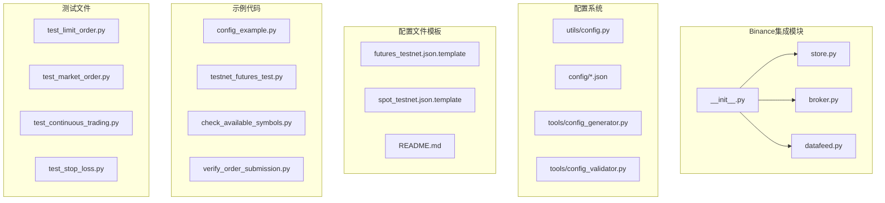
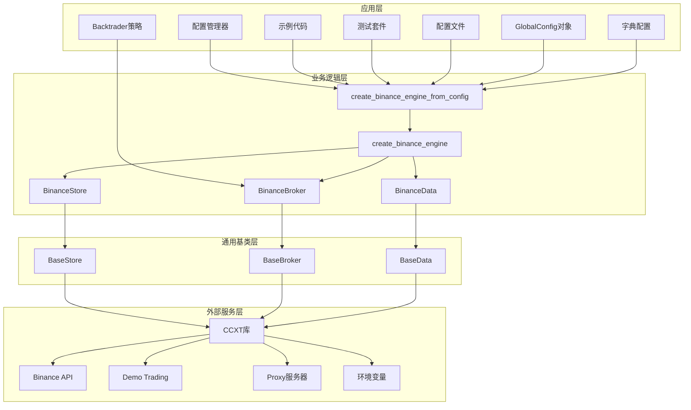
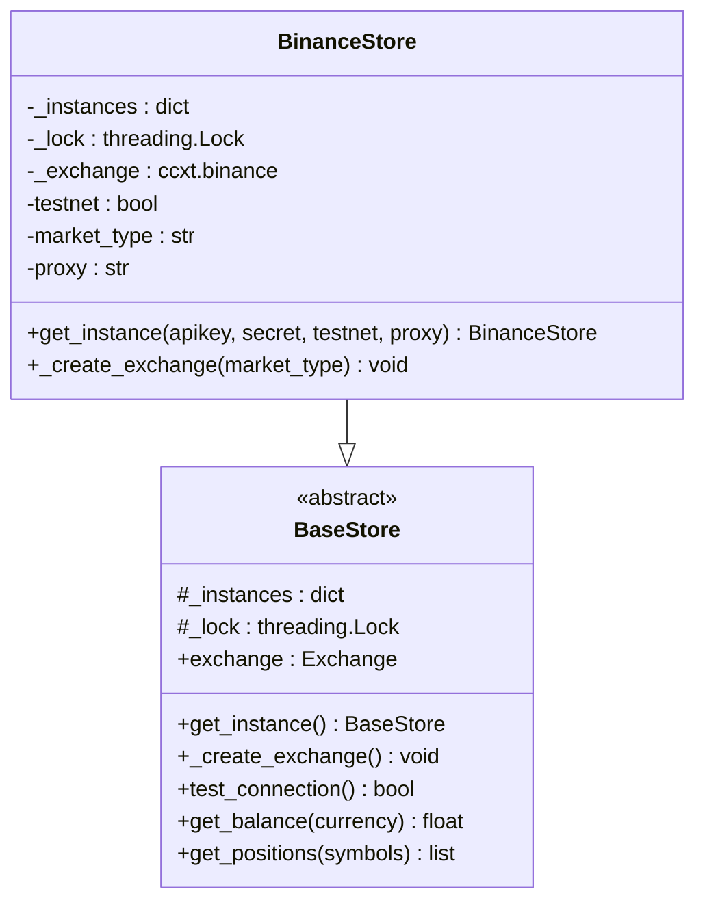
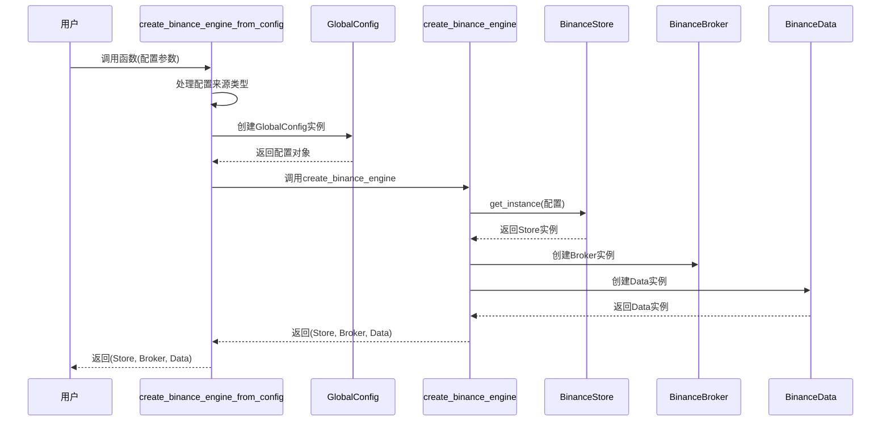
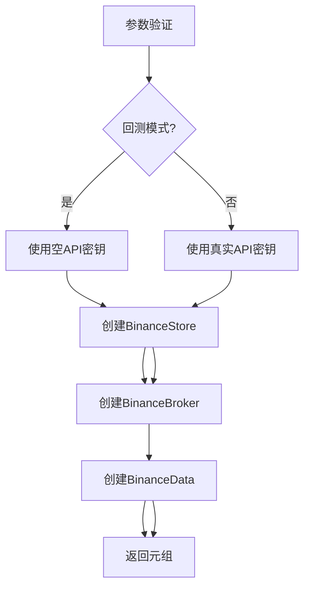
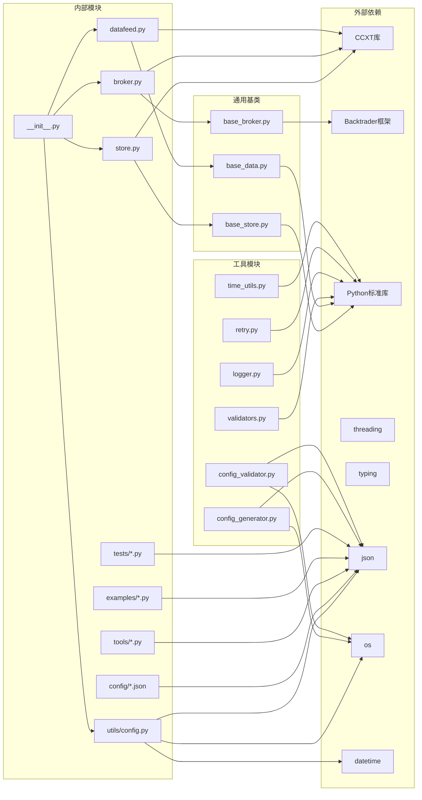

# Binance交易所集成

<cite>
**本文档引用的文件**
- [real_trade/binance/__init__.py](file://real_trade/binance/__init__.py)
- [real_trade/utils/config.py](file://real_trade/utils/config.py)
- [real_trade/binance/store.py](file://real_trade/binance/store.py)
- [real_trade/binance/broker.py](file://real_trade/binance/broker.py)
- [real_trade/binance/datafeed.py](file://real_trade/binance/datafeed.py)
- [real_trade/binance/config/futures_testnet.json.template](file://real_trade/binance/config/futures_testnet.json.template)
- [real_trade/binance/config/spot_testnet.json.template](file://real_trade/binance/config/spot_testnet.json.template)
- [real_trade/binance/config/README.md](file://real_trade/binance/config/README.md)
- [real_trade/binance/tools/config_generator.py](file://real_trade/binance/tools/config_generator.py)
- [real_trade/binance/tools/config_validator.py](file://real_trade/binance/tools/config_validator.py)
- [real_trade/binance/examples/config_example.py](file://real_trade/binance/examples/config_example.py)
- [real_trade/binance/examples/testnet_futures_test.py](file://real_trade/binance/examples/testnet_futures_test.py)
- [real_trade/binance/tests/test_limit_order.py](file://real_trade/binance/tests/test_limit_order.py)
- [real_trade/binance/tests/test_market_order.py](file://real_trade/binance/tests/test_market_order.py)
</cite>

## 更新摘要
**所做更改**
- 新增create_binance_engine_from_config()统一入口点的详细说明
- 更新配置系统架构，强调GlobalConfig的统一配置管理
- 补充配置生成器和验证器工具的使用指南
- 更新示例代码，展示新的配置系统使用方法
- 强调配置文件的多种格式支持（扁平/嵌套结构）

## 目录
1. [简介](#简介)
2. [项目结构](#项目结构)
3. [核心组件](#核心组件)
4. [架构概览](#架构概览)
5. [详细组件分析](#详细组件分析)
6. [配置管理系统](#配置管理系统)
7. [统一入口点](#统一入口点)
8. [示例代码详解](#示例代码详解)
9. [测试套件分析](#测试套件分析)
10. [依赖关系分析](#依赖关系分析)
11. [性能考虑](#性能考虑)
12. [故障排除指南](#故障排除指南)
13. [最佳实践指南](#最佳实践指南)
14. [结论](#结论)
15. [附录](#附录)

## 简介

Binance交易所集成为基于CCXT库的专业算法交易系统，提供了完整的Binance API集成解决方案。该集成实现了三个核心组件：BinanceStore（交易所连接管理）、BinanceBroker（交易经纪商）和BinanceData（数据源），为算法交易提供了标准化的接口。

**更新** 新增了create_binance_engine_from_config()统一入口点，简化了配置管理和使用流程，支持多种配置来源（JSON文件、GlobalConfig对象、字典）。

本系统支持多种交易模式，包括现货交易、杠杆交易、Demo Trading测试网和实盘交易。通过统一的配置系统，用户可以轻松配置API密钥、交易对选择、时间框架、资金管理和风险控制等关键参数。

## 项目结构

Binance集成采用模块化设计，主要包含以下核心目录和文件：



**图表来源**
- [real_trade/binance/__init__.py](file://real_trade/binance/__init__.py#L1-L223)
- [real_trade/utils/config.py](file://real_trade/utils/config.py#L1-L169)

**章节来源**
- [real_trade/binance/__init__.py](file://real_trade/binance/__init__.py#L1-L223)
- [real_trade/utils/config.py](file://real_trade/utils/config.py#L1-L169)

## 核心组件

### BinanceStore - 交易所连接管理

BinanceStore是整个系统的核心连接管理器，负责与Binance交易所建立和维护连接。它继承自BaseStore基类，实现了交易所特定的配置和连接逻辑。

**主要功能特性：**
- 单例模式管理多个交易所实例
- 支持Demo Trading测试网和生产环境
- CCXT库集成，支持多种订单类型
- 代理配置和自动检测
- 市场类型配置（现货、期货、交割）

**更新** 新增对Binance Futures Demo Trading的完整支持，包括错误处理和版本兼容性检查。

### BinanceBroker - 交易经纪商

BinanceBroker实现了完整的交易逻辑，支持模拟交易和实盘交易两种模式。它继承自BaseBroker基类，提供了标准的订单提交、执行和管理功能。

**核心能力：**
- 支持限价单、市价单、止损单等多种订单类型
- 模拟交易和实盘交易无缝切换
- 佣金计算和资金管理
- 订单状态跟踪和通知

**更新** 直接复用BaseBroker的所有功能，无需额外实现。

### BinanceData - 数据源

BinanceData提供OHLCV数据流，完全兼容CCXT标准的数据格式。它继承自BaseData基类，为Backtrader策略提供实时和历史数据支持。

**数据特性：**
- 支持多时间框架（1分钟到1周）
- 实时数据流和历史数据回测
- 交易对过滤和验证
- 数据同步和完整性检查

**更新** 直接复用BaseData的所有功能，专注于数据获取和格式化。

**章节来源**
- [real_trade/binance/store.py](file://real_trade/binance/store.py#L1-L96)
- [real_trade/binance/broker.py](file://real_trade/binance/broker.py#L1-L18)
- [real_trade/binance/datafeed.py](file://real_trade/binance/datafeed.py#L1-L18)

## 架构概览

系统采用分层架构设计，通过统一的接口抽象实现了与Binance交易所的深度集成：



**图表来源**
- [real_trade/binance/__init__.py](file://real_trade/binance/__init__.py#L137-L223)
- [real_trade/utils/config.py](file://real_trade/utils/config.py#L69-L169)

## 详细组件分析

### BinanceStore组件详解

BinanceStore实现了完整的交易所连接管理功能，具有以下关键特性：

#### 单例模式实现


**图表来源**
- [real_trade/binance/store.py](file://real_trade/binance/store.py#L25-L48)
- [real_trade/common/base_store.py](file://real_trade/common/base_store.py#L17-L194)

#### Demo Trading集成
系统支持Binance的Demo Trading功能，这是Binance弃用传统测试网后的新方案：

**配置流程：**
1. 检测CCXT版本兼容性
2. 启用Demo Trading模式
3. 设置市场类型参数
4. 配置代理选项

**更新** 新增详细的错误处理和版本兼容性检查，确保系统稳定性。

**章节来源**
- [real_trade/binance/store.py](file://real_trade/binance/store.py#L65-L96)

## 统一入口点

**更新** 新增create_binance_engine_from_config()作为统一入口点，提供了一键创建完整交易引擎的能力：

### create_binance_engine_from_config函数



**图表来源**
- [real_trade/binance/__init__.py](file://real_trade/binance/__init__.py#L137-L223)

### 支持的配置来源

**1. JSON文件配置**
```python
from real_trade.binance import create_binance_engine_from_config

# 从JSON文件创建
store, broker, data = create_binance_engine_from_config("my_config.json")
```

**2. GlobalConfig对象**
```python
from real_trade.utils import GlobalConfig
from real_trade.binance import create_binance_engine_from_config

cfg = GlobalConfig(symbol="ETH/USDT", timeframe="15m", backtest=True)
store, broker, data = create_binance_engine_from_config(cfg)
```

**3. 字典配置**
```python
from real_trade.binance import create_binance_engine_from_config

store, broker, data = create_binance_engine_from_config({
    "symbol": "BTC/USDT",
    "timeframe": "15m",
    "backtest": True,
    "paper_trading": True,
    "cash": 10000.0,
    "market_type": "future",
})
```

**核心功能：**
- 自动处理回测模式下的API密钥处理
- 统一的参数传递和配置管理
- 支持扁平和嵌套两种JSON格式
- 灵活的配置来源选择

**章节来源**
- [real_trade/binance/__init__.py](file://real_trade/binance/__init__.py#L137-L223)

### create_binance_engine函数

**更新** 作为内部函数，被create_binance_engine_from_config()调用：



**图表来源**
- [real_trade/binance/__init__.py](file://real_trade/binance/__init__.py#L72-L134)

**章节来源**
- [real_trade/binance/__init__.py](file://real_trade/binance/__init__.py#L72-L134)

## 配置管理系统

**更新** 新增完整的配置管理系统，提供灵活的配置加载、验证和管理功能：

### GlobalConfig统一配置

系统使用GlobalConfig类作为统一配置管理器，支持多种配置来源：

**核心字段：**
- 交易所配置：exchange, apikey, secret, testnet, proxy, market_type
- 交易配置：symbol, timeframe, paper_trading, cash, commission, backtest
- 数据配置：historical_limit, fromdate, todate
- 风控配置：max_position_pct, risk_per_trade, max_drawdown_pct, max_daily_trades
- 日志配置：log_level, log_file
- 通知配置：notify_on_trade, notify_on_error
- 额外配置：extra

**配置加载方式：**
1. **扁平结构**：与GlobalConfig字段完全一致
2. **嵌套结构**：支持api/trading/data/proxy/strategy等分组
3. **环境变量**：支持RT_前缀的环境变量加载

**章节来源**
- [real_trade/utils/config.py](file://real_trade/utils/config.py#L20-L169)

### 配置文件格式

**扁平结构示例：**
```json
{
  "exchange": "binance",
  "apikey": "",
  "secret": "",
  "testnet": true,
  "market_type": "future",
  "symbol": "BTC/USDT",
  "timeframe": "15m",
  "paper_trading": true,
  "cash": 10000.0,
  "commission": 0.001,
  "backtest": true,
  "historical_limit": 500
}
```

**嵌套结构示例：**
```json
{
  "api": {"apikey": "", "secret": "", "testnet": true, "market_type": "future"},
  "trading": {"paper_trading": true, "initial_cash": 10000.0, "commission": 0.001},
  "data": {"symbol": "BTC/USDT", "timeframe": "15m", "backtest": true, "historical_limit": 500},
  "proxy": {"proxy_url": ""}
}
```

**章节来源**
- [real_trade/binance/config/README.md](file://real_trade/binance/config/README.md#L37-L132)
- [real_trade/binance/config/futures_testnet.json.template](file://real_trade/binance/config/futures_testnet.json.template#L1-L15)
- [real_trade/binance/config/spot_testnet.json.template](file://real_trade/binance/config/spot_testnet.json.template#L1-L15)

## 统一入口点

**更新** create_binance_engine_from_config()作为新的统一入口点，提供了更简洁的使用方式：

### 配置生成器

**config_generator.py** 提供交互式配置文件生成：

**功能特性：**
- 支持Futures和Spot两种市场类型
- 交互式输入API密钥、交易参数、数据参数
- 支持代理配置和自定义文件名
- 自动生成标准格式的JSON配置文件

**使用流程：**
1. 运行python tools/config_generator.py
2. 选择市场类型（Futures/Spot）
3. 输入API密钥（可选，回测模式可跳过）
4. 配置交易参数（模拟交易、初始资金、手续费）
5. 设置数据参数（交易对、时间框架、回测模式）
6. 配置代理（可选）
7. 保存配置文件

**章节来源**
- [real_trade/binance/tools/config_generator.py](file://real_trade/binance/tools/config_generator.py#L1-L105)

### 配置验证器

**config_validator.py** 提供配置文件验证功能：

**验证内容：**
- JSON格式正确性
- symbol格式验证（BASE/QUOTE格式）
- timeframe有效性检查
- market_type合法性
- cash和commission数值范围
- historical_limit合理性
- API密钥与回测模式匹配性

**使用方法：**
```bash
python tools/config_validator.py my_config.json
```

**章节来源**
- [real_trade/binance/tools/config_validator.py](file://real_trade/binance/tools/config_validator.py#L1-L185)

## 示例代码详解

**更新** 新增多个实用示例，展示新的配置系统使用方法：

### 配置文件示例

**config_example.py** 展示了如何使用JSON配置文件创建Binance交易引擎：

**运行模式：**
1. **回测模式（默认）**：使用futures_backtest.json
   - 历史数据回测
   - 本地模拟订单
   - 不需要API密钥

2. **Demo Trading实盘测试**：使用futures_live_demo.json
   - 连接Demo Trading
   - 真实订单流程
   - 需要Demo Trading API密钥

3. **生产实盘**：创建自定义配置
   - testnet: false
   - paper_trading: false
   - backtest: false

**策略实现：**
- 可配置策略类ConfigurableStrategy
- RSI和均线交叉策略
- 动态资金管理和止损机制
- 详细的交易日志和统计输出

### 连接测试示例

**testnet_futures_test.py** 测试连接到Binance Futures Testnet：

**功能特性：**
- 验证API密钥有效性
- 获取账户余额和市场数据
- 检查持仓信息和历史K线数据
- 完整的错误处理和调试信息

**章节来源**
- [real_trade/binance/examples/config_example.py](file://real_trade/binance/examples/config_example.py#L1-L221)
- [real_trade/binance/examples/testnet_futures_test.py](file://real_trade/binance/examples/testnet_futures_test.py#L1-L156)

## 测试套件分析

**更新** 新增完整的测试套件，确保系统稳定性和功能正确性：

### 限价单测试

**test_limit_order.py** 测试限价买入和限价卖出功能：

**测试流程：**
1. 连接Binance Futures Demo Trading
2. 获取当前市场价格（ETH/USDT:USDT）
3. 限价买入测试：设置略高于卖一价的价格
4. 等待订单成交并验证
5. 检查持仓建立情况
6. 限价卖出测试：设置略低于买一价的价格
7. 等待订单成交并验证
8. 检查持仓平仓情况

**测试要点：**
- 合理设置限价确保订单成交
- 实时监控订单状态变化
- 验证持仓建立和平仓过程
- 错误处理和超时机制

### 市价单测试

**test_market_order.py** 测试市价买入和市价卖出功能：

**测试流程：**
1. 连接Binance Futures Demo Trading
2. 获取当前ETH价格
3. 市价买入测试（0.05 ETH）
4. 等待订单成交
5. 检查持仓建立
6. 市价卖出测试（0.05 ETH）
7. 等待平仓完成
8. 验证余额变化

**测试要点：**
- 小仓位测试（约$130）
- 实时余额监控
- 持仓状态验证
- 手续费估算和验证

### 其他测试

**test_continuous_trading.py** 连续交易测试
**test_stop_loss.py** 止损测试

**章节来源**
- [real_trade/binance/tests/test_limit_order.py](file://real_trade/binance/tests/test_limit_order.py#L1-L201)
- [real_trade/binance/tests/test_market_order.py](file://real_trade/binance/tests/test_market_order.py#L1-L153)

## 依赖关系分析

系统依赖关系清晰，遵循单一职责原则：



**图表来源**
- [real_trade/binance/__init__.py](file://real_trade/binance/__init__.py#L31-L37)
- [real_trade/utils/config.py](file://real_trade/utils/config.py#L14-L17)

**章节来源**
- [real_trade/binance/__init__.py](file://real_trade/binance/__init__.py#L31-L37)
- [real_trade/utils/config.py](file://real_trade/utils/config.py#L14-L17)

## 性能考虑

### 连接优化
- 使用单例模式避免重复连接
- CCXT rate limit启用确保API使用合规
- 代理配置减少网络延迟

### 内存管理
- BaseStore使用弱引用避免循环引用
- 及时清理未使用的交易所实例
- 控制历史数据缓存大小

### 并发处理
- 线程安全的单例实现
- 交易订单的异步处理
- 非阻塞的订单状态查询

**更新** 新增对Demo Trading环境的性能优化建议。

## 故障排除指南

### 常见问题及解决方案

**API连接问题：**
- 检查Demo Trading密钥有效性
- 验证网络连接和代理设置
- 确认CCXT版本兼容性

**订单执行问题：**
- 检查账户余额和保证金
- 验证交易对和最小订单量
- 确认市场类型配置正确

**数据同步问题：**
- 检查时间同步设置
- 验证数据源可用性
- 调整历史数据加载参数

### 调试工具

系统提供了多种调试和测试工具：

**配置验证：**
- 配置文件格式验证
- 参数范围检查
- 依赖库版本确认

**订单测试：**
- 限价单测试：验证限价订单执行
- 市价单测试：验证市价订单执行
- 持仓管理测试：验证开平仓操作

**连接测试：**
- Demo Trading连接测试
- API密钥有效性验证
- 市场数据获取测试

**更新** 新增专门的诊断工具和故障排除流程。

**章节来源**
- [real_trade/binance/tools/config_validator.py](file://real_trade/binance/tools/config_validator.py#L81-L174)
- [real_trade/binance/examples/testnet_futures_test.py](file://real_trade/binance/examples/testnet_futures_test.py#L25-L156)

## 最佳实践指南

### 开发阶段
1. 使用Demo Trading进行功能验证
2. 从小额资金开始实盘测试
3. 建立完整的测试用例
4. 实施风险管理策略

### 生产部署
1. 配置适当的API速率限制
2. 设置监控和告警机制
3. 建立备份和恢复策略
4. 定期审查和优化配置

### 安全考虑
1. 保护API密钥安全存储
2. 使用HTTPS和加密通信
3. 定期轮换API密钥
4. 实施访问控制和审计日志

**更新** 新增针对Binance Futures Demo Trading的特殊注意事项和最佳实践。

## 结论

Binance交易所集成为算法交易提供了完整、可靠的解决方案。通过模块化设计和标准化接口，系统实现了：

1. **完整的功能覆盖**：支持现货、期货、Demo Trading等多种交易模式
2. **统一的配置管理**：通过GlobalConfig实现参数化配置
3. **灵活的入口点**：create_binance_engine_from_config()支持多种配置来源
4. **强大的扩展性**：基于BaseStore和BaseBroker的继承体系
5. **完善的测试支持**：提供全面的测试用例和调试工具
6. **专业的故障排除**：内置诊断工具和问题解决方案

**更新** 新增的统一入口点和配置系统为开发者提供了专业级的Binance API使用体验，既适合初学者快速上手，也满足专业交易者的复杂需求。

## 附录

### 配置文件模板

**Futures测试网模板：**
```json
{
  "exchange": "binance",
  "apikey": "YOUR_FUTURES_DEMO_TRADING_API_KEY",
  "secret": "YOUR_FUTURES_DEMO_TRADING_SECRET",
  "testnet": true,
  "market_type": "future",
  "symbol": "BTC/USDT",
  "timeframe": "15m",
  "paper_trading": true,
  "cash": 10000.0,
  "commission": 0.001,
  "backtest": true,
  "historical_limit": 500
}
```

**Spot测试网模板：**
```json
{
  "exchange": "binance",
  "apikey": "YOUR_SPOT_DEMO_TRADING_API_KEY",
  "secret": "YOUR_SPOT_DEMO_TRADING_SECRET",
  "testnet": true,
  "market_type": "spot",
  "symbol": "BTC/USDT",
  "timeframe": "1h",
  "paper_trading": true,
  "cash": 10000.0,
  "commission": 0.001,
  "backtest": true,
  "historical_limit": 500
}
```

### 快速开始示例

**使用便捷函数：**
```python
from real_trade.binance import create_binance_engine
import backtrader as bt

store, broker, data = create_binance_engine(
    symbol='BTC/USDT', 
    timeframe='1h',
    testnet=True, 
    paper_trading=True, 
    backtest=True,
)

cerebro = bt.Cerebro()
cerebro.setbroker(broker)
cerebro.adddata(data)
cerebro.addstrategy(MyStrategy)
cerebro.run()
```

**使用配置文件：**
```python
from real_trade.binance import create_binance_engine_from_config

store, broker, data = create_binance_engine_from_config("my_config.json")
```

**使用GlobalConfig对象：**
```python
from real_trade.utils import GlobalConfig
from real_trade.binance import create_binance_engine_from_config

cfg = GlobalConfig(symbol="ETH/USDT", timeframe="15m", backtest=True)
store, broker, data = create_binance_engine_from_config(cfg)
```

### 错误处理和重试机制

**更新** 新增详细的错误处理和重试机制建议：

1. **API限制处理**：实现指数退避重试
2. **网络异常处理**：连接超时和重连机制
3. **订单状态监控**：定期查询订单状态
4. **数据同步检查**：验证数据完整性
5. **资源清理**：确保连接和资源正确释放

**章节来源**
- [real_trade/binance/__init__.py](file://real_trade/binance/__init__.py#L137-L223)
- [real_trade/binance/config/futures_testnet.json.template](file://real_trade/binance/config/futures_testnet.json.template#L1-L15)
- [real_trade/binance/config/spot_testnet.json.template](file://real_trade/binance/config/spot_testnet.json.template#L1-L15)