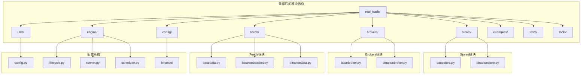
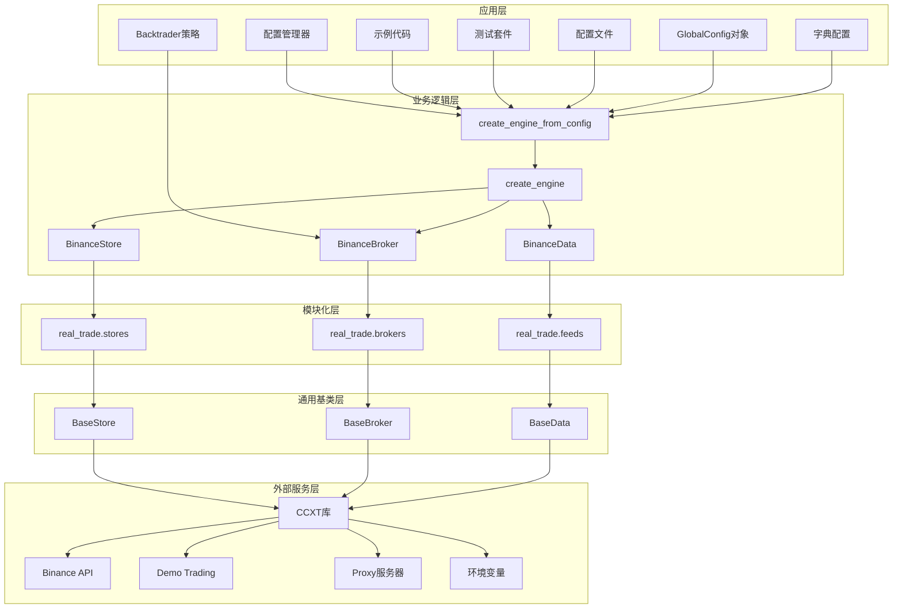
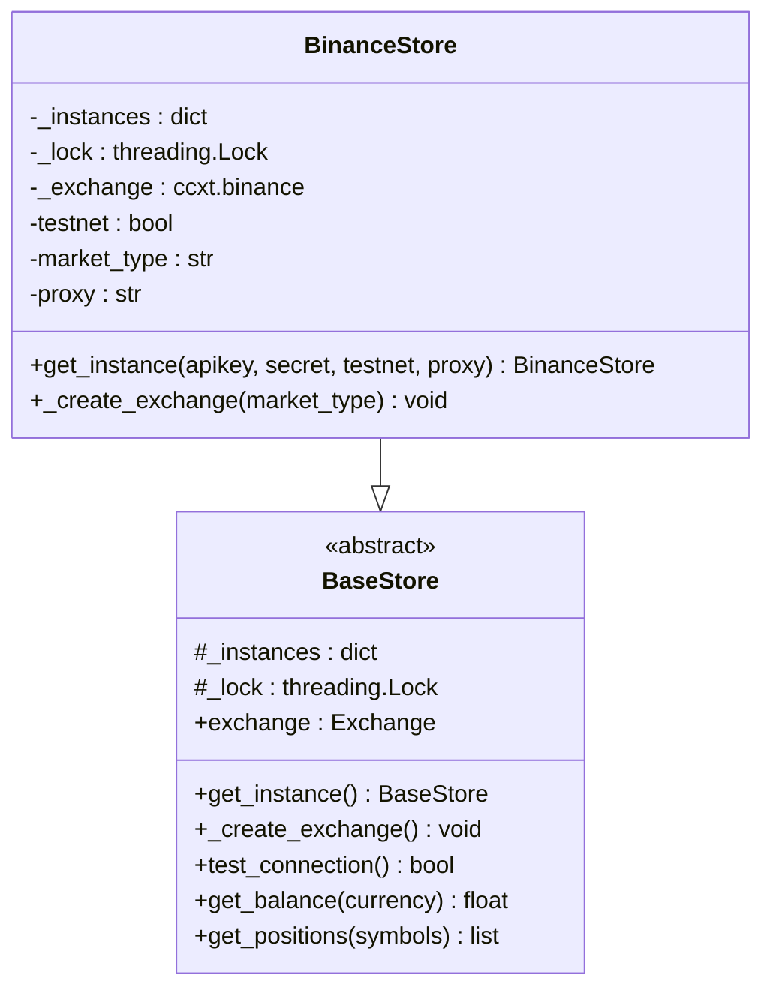

# Binance交易所集成

<cite>
**本文档引用的文件**
- [real_trade/__init__.py](file://real_trade/__init__.py)
- [real_trade/stores/__init__.py](file://real_trade/stores/__init__.py)
- [real_trade/brokers/__init__.py](file://real_trade/brokers/__init__.py)
- [real_trade/feeds/__init__.py](file://real_trade/feeds/__init__.py)
- [real_trade/stores/binancestore.py](file://real_trade/stores/binancestore.py)
- [real_trade/brokers/binancebroker.py](file://real_trade/brokers/binancebroker.py)
- [real_trade/feeds/binancedata.py](file://real_trade/feeds/binancedata.py)
- [real_trade/utils/config.py](file://real_trade/utils/config.py)
- [real_trade/engine/__init__.py](file://real_trade/engine/__init__.py)
- [real_trade/examples/config_example.py](file://real_trade/examples/config_example.py)
- [real_trade/config/binance/futures_testnet.json.template](file://real_trade/config/binance/futures_testnet.json.template)
- [real_trade/config/binance/spot_testnet.json.template](file://real_trade/config/binance/spot_testnet.json.template)
- [real_trade/tools/binance/config_generator.py](file://real_trade/tools/binance/config_generator.py)
- [real_trade/tools/binance/config_validator.py](file://real_trade/tools/binance/config_validator.py)
</cite>

## 更新摘要
**所做更改**
- 更新模块结构以反映从 `real_trade/binance/` 到 `real_trade/stores/`, `real_trade/brokers/`, `real_trade/feeds/` 的模块化重组
- 更新所有导入路径以使用新的模块组织结构
- 更新核心组件的导入和使用方式
- 更新配置系统架构说明
- 更新示例代码和最佳实践指南

## 目录
1. [简介](#简介)
2. [模块结构重组](#模块结构重组)
3. [核心组件](#核心组件)
4. [架构概览](#架构概览)
5. [详细组件分析](#详细组件分析)
6. [配置管理系统](#配置管理系统)
7. [示例代码详解](#示例代码详解)
8. [模块化优势](#模块化优势)
9. [迁移指南](#迁移指南)
10. [性能考虑](#性能考虑)
11. [故障排除指南](#故障排除指南)
12. [最佳实践指南](#最佳实践指南)
13. [结论](#结论)
14. [附录](#附录)

## 简介

Binance交易所集成为基于CCXT库的专业算法交易系统，经过模块结构重组后，提供了更加清晰和可维护的架构设计。新系统采用三层模块化组织：`real_trade/stores/`（交易所连接管理）、`real_trade/brokers/`（交易经纪商）、`real_trade/feeds/`（数据源），为算法交易提供了标准化且高度模块化的接口。

系统支持多种交易模式，包括现货交易、杠杆交易、Demo Trading测试网和实盘交易。通过统一的配置系统和模块化设计，用户可以轻松配置API密钥、交易对选择、时间框架、资金管理和风险控制等关键参数。

**更新** 模块结构重组后，导入路径从 `real_trade.binance.*` 更新为 `real_trade.stores.*`、`real_trade.brokers.*`、`real_trade.feeds.*`，提供了更加清晰的模块边界和职责分离。

## 模块结构重组

**更新** 系统已完成从 `real_trade/binance/` 到 `real_trade/stores/`, `real_trade/brokers/`, `real_trade/feeds/` 的模块化重组，实现了更好的代码组织和职责分离：



**图表来源**
- [real_trade/__init__.py](file://real_trade/__init__.py#L8-L19)
- [real_trade/stores/__init__.py](file://real_trade/stores/__init__.py#L1-L17)
- [real_trade/brokers/__init__.py](file://real_trade/brokers/__init__.py#L1-L17)
- [real_trade/feeds/__init__.py](file://real_trade/feeds/__init__.py#L1-L18)

**章节来源**
- [real_trade/__init__.py](file://real_trade/__init__.py#L1-L78)
- [real_trade/stores/__init__.py](file://real_trade/stores/__init__.py#L1-L17)
- [real_trade/brokers/__init__.py](file://real_trade/brokers/__init__.py#L1-L17)
- [real_trade/feeds/__init__.py](file://real_trade/feeds/__init__.py#L1-L18)

## 核心组件

### BinanceStore - 交易所连接管理

**更新** BinanceStore现在位于 `real_trade/stores/` 模块中，继承自BaseStore基类，实现了交易所特定的配置和连接逻辑。

**主要功能特性：**
- 单例模式管理多个交易所实例
- 支持Demo Trading测试网和生产环境
- CCXT库集成，支持多种订单类型
- 代理配置和自动检测
- 市场类型配置（现货、期货、交割）

**更新** 新增对Binance Futures Demo Trading的完整支持，包括错误处理和版本兼容性检查。

### BinanceBroker - 交易经纪商

**更新** BinanceBroker现在位于 `real_trade/brokers/` 模块中，直接复用BaseBroker的所有功能，无需额外实现。

**核心能力：**
- 支持限价单、市价单、止损单等多种订单类型
- 模拟交易和实盘交易无缝切换
- 佣金计算和资金管理
- 订单状态跟踪和通知

### BinanceData - 数据源

**更新** BinanceData现在位于 `real_trade/feeds/` 模块中，直接复用BaseData的所有功能，专注于数据获取和格式化。

**数据特性：**
- 支持多时间框架（1分钟到1周）
- 实时数据流和历史数据回测
- 交易对过滤和验证
- 数据同步和完整性检查

**章节来源**
- [real_trade/stores/binancestore.py](file://real_trade/stores/binancestore.py#L1-L96)
- [real_trade/brokers/binancebroker.py](file://real_trade/brokers/binancebroker.py#L1-L18)
- [real_trade/feeds/binancedata.py](file://real_trade/feeds/binancedata.py#L1-L18)

## 架构概览

**更新** 系统采用新的三层模块化架构设计，通过统一的接口抽象实现了与Binance交易所的深度集成：



**图表来源**
- [real_trade/examples/config_example.py](file://real_trade/examples/config_example.py#L33-L36)
- [real_trade/utils/config.py](file://real_trade/utils/config.py#L66-L169)

## 详细组件分析

### BinanceStore组件详解

**更新** BinanceStore现在位于 `real_trade/stores/binancestore.py`，实现了完整的交易所连接管理功能：

#### 单例模式实现


**图表来源**
- [real_trade/stores/binancestore.py](file://real_trade/stores/binancestore.py#L25-L48)
- [real_trade/stores/basestore.py](file://real_trade/stores/basestore.py#L17-L194)

#### Demo Trading集成
系统支持Binance的Demo Trading功能，这是Binance弃用传统测试网后的新方案：

**配置流程：**
1. 检测CCXT版本兼容性
2. 启用Demo Trading模式
3. 设置市场类型参数
4. 配置代理选项

**更新** 新增详细的错误处理和版本兼容性检查，确保系统稳定性。

**章节来源**
- [real_trade/stores/binancestore.py](file://real_trade/stores/binancestore.py#L65-L96)

## 配置管理系统

**更新** 新的模块化结构保持了完整的配置管理系统，提供灵活的配置加载、验证和管理功能：

### GlobalConfig统一配置

系统使用GlobalConfig类作为统一配置管理器，支持多种配置来源：

**核心字段：**
- 交易所配置：exchange, apikey, secret, testnet, proxy, market_type
- 交易配置：symbol, timeframe, paper_trading, cash, commission, backtest
- 数据配置：historical_limit, fromdate, todate
- 风控配置：max_position_pct, risk_per_trade, max_drawdown_pct, max_daily_trades
- 日志配置：log_level, log_file
- 通知配置：notify_on_trade, notify_on_error
- 额外配置：extra

**配置加载方式：**
1. **扁平结构**：与GlobalConfig字段完全一致
2. **嵌套结构**：支持api/trading/data/proxy/strategy等分组
3. **环境变量**：支持RT_前缀的环境变量加载

**章节来源**
- [real_trade/utils/config.py](file://real_trade/utils/config.py#L20-L169)

### 配置文件格式

**扁平结构示例：**
```json
{
  "exchange": "binance",
  "apikey": "",
  "secret": "",
  "testnet": true,
  "market_type": "future",
  "symbol": "BTC/USDT",
  "timeframe": "15m",
  "paper_trading": true,
  "cash": 10000.0,
  "commission": 0.001,
  "backtest": true,
  "historical_limit": 500
}
```

**嵌套结构示例：**
```json
{
  "api": {"apikey": "", "secret": "", "testnet": true, "market_type": "future"},
  "trading": {"paper_trading": true, "initial_cash": 10000.0, "commission": 0.001},
  "data": {"symbol": "BTC/USDT", "timeframe": "15m", "backtest": true, "historical_limit": 500},
  "proxy": {"proxy_url": ""}
}
```

**章节来源**
- [real_trade/config/binance/README.md](file://real_trade/config/binance/README.md#L37-L132)
- [real_trade/config/binance/futures_testnet.json.template](file://real_trade/config/binance/futures_testnet.json.template#L1-L15)
- [real_trade/config/binance/spot_testnet.json.template](file://real_trade/config/binance/spot_testnet.json.template#L1-L15)

## 示例代码详解

**更新** 所有示例代码已更新以使用新的模块导入路径：

### 配置文件示例

**config_example.py** 展示了如何使用JSON配置文件创建Binance交易引擎：

**导入更新：**
```python
from real_trade.brokers import BinanceBroker
from real_trade.feeds import BinanceData
from real_trade.stores import BinanceStore
from real_trade.utils.config import GlobalConfig
```

**运行模式：**
1. **回测模式（默认）**：使用futures_backtest.json
   - 历史数据回测
   - 本地模拟订单
   - 不需要API密钥

2. **Demo Trading实盘测试**：使用futures_live_demo.json
   - 连接Demo Trading
   - 真实订单流程
   - 需要Demo Trading API密钥

3. **生产实盘**：创建自定义配置
   - testnet: false
   - paper_trading: false
   - backtest: false

**策略实现：**
- 可配置策略类ConfigurableStrategy
- RSI和均线交叉策略
- 动态资金管理和止损机制
- 详细的交易日志和统计输出

### 连接测试示例

**testnet_futures_test.py** 测试连接到Binance Futures Testnet：

**功能特性：**
- 验证API密钥有效性
- 获取账户余额和市场数据
- 检查持仓信息和历史K线数据
- 完整的错误处理和调试信息

**章节来源**
- [real_trade/examples/config_example.py](file://real_trade/examples/config_example.py#L1-L259)

## 模块化优势

**更新** 新的模块化结构带来了显著的优势：

### 清晰的职责分离
- **Stores模块**：专注于交易所连接管理
- **Brokers模块**：专注于交易执行逻辑
- **Feeds模块**：专注于数据获取和处理

### 更好的可维护性
- 每个模块职责单一，易于理解和维护
- 模块间依赖关系清晰，降低耦合度
- 支持独立的功能扩展和替换

### 灵活的组合使用
- 可以单独使用某个模块的功能
- 支持不同交易所的Store实现
- 易于添加新的数据源和交易接口

### 标准化的接口
- 所有模块都遵循相同的接口规范
- 统一的配置管理和初始化流程
- 一致的错误处理和日志记录

## 迁移指南

**更新** 从旧的 `real_trade/binance/` 结构迁移到新的模块化结构：

### 导入路径更新

**旧版本：**
```python
from real_trade.binance import BinanceStore, BinanceBroker, BinanceData
```

**新版本：**
```python
from real_trade.stores import BinanceStore
from real_trade.brokers import BinanceBroker
from real_trade.feeds import BinanceData
```

### 配置系统使用

**旧版本：**
```python
from real_trade.binance.utils.config import GlobalConfig
```

**新版本：**
```python
from real_trade.utils.config import GlobalConfig
```

### 工具模块迁移

**旧版本：**
```python
from real_trade.binance.tools.config_generator import ConfigGenerator
from real_trade.binance.tools.config_validator import ConfigValidator
```

**新版本：**
```python
from real_trade.tools.binance.config_generator import ConfigGenerator
from real_trade.tools.binance.config_validator import ConfigValidator
```

### 配置文件位置

**旧版本：**
```
real_trade/binance/config/*.json
```

**新版本：**
```
real_trade/config/binance/*.json
```

## 性能考虑

### 连接优化
- 使用单例模式避免重复连接
- CCXT rate limit启用确保API使用合规
- 代理配置减少网络延迟

### 内存管理
- BaseStore使用弱引用避免循环引用
- 及时清理未使用的交易所实例
- 控制历史数据缓存大小

### 并发处理
- 线程安全的单例实现
- 交易订单的异步处理
- 非阻塞的订单状态查询

**更新** 新增对Demo Trading环境的性能优化建议。

## 故障排除指南

### 常见问题及解决方案

**API连接问题：**
- 检查Demo Trading密钥有效性
- 验证网络连接和代理设置
- 确认CCXT版本兼容性

**订单执行问题：**
- 检查账户余额和保证金
- 验证交易对和最小订单量
- 确认市场类型配置正确

**数据同步问题：**
- 检查时间同步设置
- 验证数据源可用性
- 调整历史数据加载参数

### 调试工具

系统提供了多种调试和测试工具：

**配置验证：**
- 配置文件格式验证
- 参数范围检查
- 依赖库版本确认

**订单测试：**
- 限价单测试：验证限价订单执行
- 市价单测试：验证市价订单执行
- 持仓管理测试：验证开平仓操作

**连接测试：**
- Demo Trading连接测试
- API密钥有效性验证
- 市场数据获取测试

**章节来源**
- [real_trade/tools/binance/config_validator.py](file://real_trade/tools/binance/config_validator.py#L1-L185)

## 最佳实践指南

### 开发阶段
1. 使用Demo Trading进行功能验证
2. 从小额资金开始实盘测试
3. 建立完整的测试用例
4. 实施风险管理策略

### 生产部署
1. 配置适当的API速率限制
2. 设置监控和告警机制
3. 建立备份和恢复策略
4. 定期审查和优化配置

### 安全考虑
1. 保护API密钥安全存储
2. 使用HTTPS和加密通信
3. 定期轮换API密钥
4. 实施访问控制和审计日志

**更新** 新增针对Binance Futures Demo Trading的特殊注意事项和最佳实践。

## 结论

Binance交易所集成为算法交易提供了完整、可靠且高度模块化的解决方案。通过从 `real_trade/binance/` 到 `real_trade/stores/`, `real_trade/brokers/`, `real_trade/feeds/` 的模块结构重组，系统实现了：

1. **清晰的职责分离**：Stores/Brokers/Feeds三层架构明确分工
2. **统一的配置管理**：通过GlobalConfig实现参数化配置
3. **灵活的模块化设计**：支持独立使用和组合扩展
4. **标准化的接口规范**：所有模块遵循统一的实现标准
5. **完善的工具支持**：提供配置生成器、验证器等开发工具
6. **专业的故障排除**：内置诊断工具和问题解决方案

**更新** 新的模块化结构为开发者提供了更加专业和易用的Binance API使用体验，既适合初学者快速上手，也满足专业交易者的复杂需求。迁移指南确保了向后兼容性和平滑过渡。

## 附录

### 配置文件模板

**Futures测试网模板：**
```json
{
  "exchange": "binance",
  "apikey": "YOUR_FUTURES_DEMO_TRADING_API_KEY",
  "secret": "YOUR_FUTURES_DEMO_TRADING_SECRET",
  "testnet": true,
  "market_type": "future",
  "symbol": "BTC/USDT",
  "timeframe": "15m",
  "paper_trading": true,
  "cash": 10000.0,
  "commission": 0.001,
  "backtest": true,
  "historical_limit": 500
}
```

**Spot测试网模板：**
```json
{
  "exchange": "binance",
  "apikey": "YOUR_SPOT_DEMO_TRADING_API_KEY",
  "secret": "YOUR_SPOT_DEMO_TRADING_SECRET",
  "testnet": true,
  "market_type": "spot",
  "symbol": "BTC/USDT",
  "timeframe": "1h",
  "paper_trading": true,
  "cash": 10000.0,
  "commission": 0.001,
  "backtest": true,
  "historical_limit": 500
}
```

### 快速开始示例

**使用新的导入路径：**
```python
from real_trade.stores import BinanceStore
from real_trade.brokers import BinanceBroker
from real_trade.feeds import BinanceData
import backtrader as bt

store = BinanceStore.get_instance(testnet=True)
broker = BinanceBroker(store, paper_trading=True)
data = BinanceData.from_timeframe_string("1h", store, symbol="BTC/USDT", backtest=True)

cerebro = bt.Cerebro()
cerebro.setbroker(broker)
cerebro.adddata(data)
cerebro.addstrategy(MyStrategy)
cerebro.run()
```

**使用配置文件：**
```python
from real_trade.examples.config_example import create_engine_from_config
from real_trade.utils.config import GlobalConfig

cfg = GlobalConfig.from_json("config/binance/spot_testnet.json")
store, broker, data = create_engine_from_config(cfg)
```

**使用GlobalConfig对象：**
```python
from real_trade.utils.config import GlobalConfig
from real_trade.stores import BinanceStore
from real_trade.brokers import BinanceBroker
from real_trade.feeds import BinanceData

cfg = GlobalConfig(symbol="ETH/USDT", timeframe="15m", backtest=True)
store = BinanceStore.get_instance(
    apikey=cfg.apikey if not cfg.backtest else "",
    secret=cfg.secret if not cfg.backtest else "",
    testnet=cfg.testnet,
    market_type=cfg.market_type
)
broker = BinanceBroker(store, paper_trading=cfg.paper_trading, cash=cfg.cash)
data = BinanceData.from_timeframe_string(cfg.timeframe, store, symbol=cfg.symbol, backtest=cfg.backtest)
```

### 错误处理和重试机制

**更新** 新增详细的错误处理和重试机制建议：

1. **API限制处理**：实现指数退避重试
2. **网络异常处理**：连接超时和重连机制
3. **订单状态监控**：定期查询订单状态
4. **数据同步检查**：验证数据完整性
5. **资源清理**：确保连接和资源正确释放

**章节来源**
- [real_trade/config/binance/futures_testnet.json.template](file://real_trade/config/binance/futures_testnet.json.template#L1-L15)
- [real_trade/config/binance/spot_testnet.json.template](file://real_trade/config/binance/spot_testnet.json.template#L1-L15)