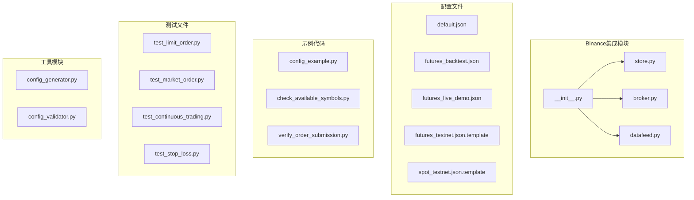
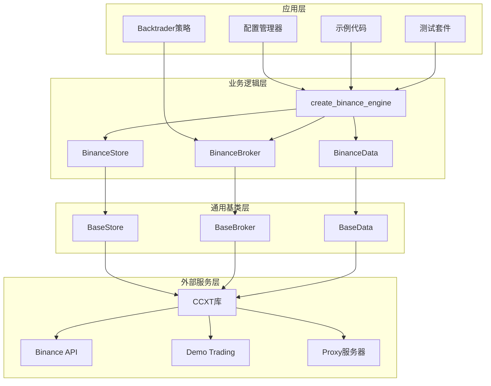
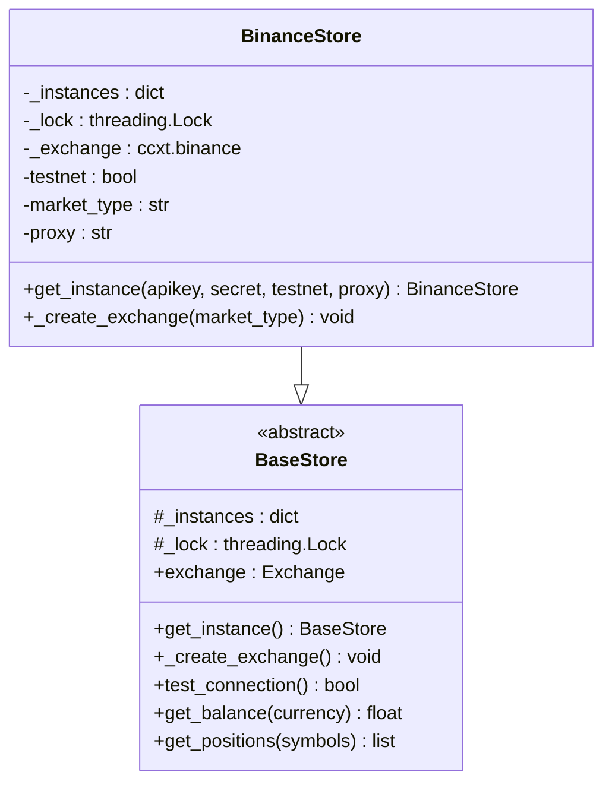
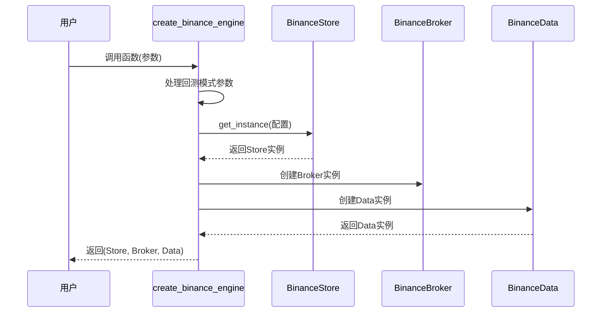
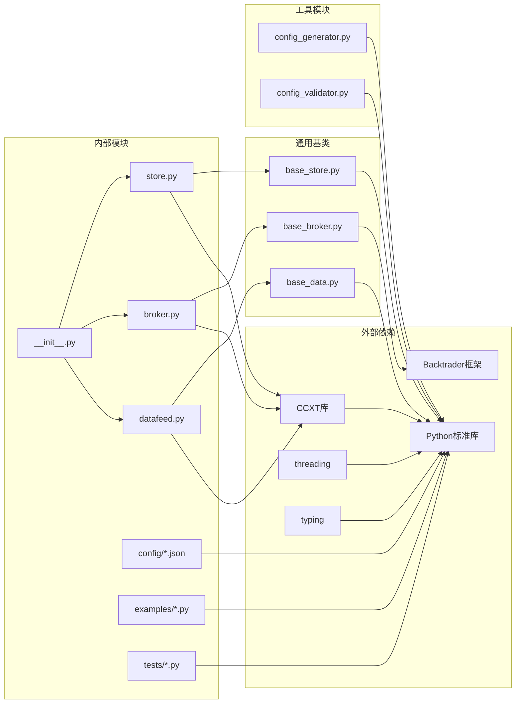

# Binance交易所集成

<cite>
**本文档引用的文件**
- [real_trade/binance/__init__.py](file://real_trade/binance/__init__.py)
- [real_trade/binance/store.py](file://real_trade/binance/store.py)
- [real_trade/binance/broker.py](file://real_trade/binance/broker.py)
- [real_trade/binance/datafeed.py](file://real_trade/binance/datafeed.py)
- [real_trade/binance/config/default.json](file://real_trade/binance/config/default.json)
- [real_trade/binance/config/futures_backtest.json](file://real_trade/binance/config/futures_backtest.json)
- [real_trade/binance/config/futures_live_demo.json](file://real_trade/binance/config/futures_live_demo.json)
- [real_trade/binance/config/futures_testnet.json.template](file://real_trade/binance/config/futures_testnet.json.template)
- [real_trade/binance/config/spot_testnet.json.template](file://real_trade/binance/config/spot_testnet.json.template)
- [real_trade/binance/examples/config_example.py](file://real_trade/binance/examples/config_example.py)
- [real_trade/binance/examples/check_available_symbols.py](file://real_trade/binance/examples/check_available_symbols.py)
- [real_trade/binance/examples/verify_order_submission.py](file://real_trade/binance/examples/verify_order_submission.py)
- [real_trade/binance/tests/test_limit_order.py](file://real_trade/binance/tests/test_limit_order.py)
- [real_trade/binance/tests/test_market_order.py](file://real_trade/binance/tests/test_market_order.py)
</cite>

## 更新摘要
**所做更改**
- 新增完整的Binance交易所集成模块文档
- 添加配置管理系统详细说明
- 补充示例代码和测试套件文档
- 更新架构图和组件关系说明
- 添加故障排除和最佳实践指南

## 目录
1. [简介](#简介)
2. [项目结构](#项目结构)
3. [核心组件](#核心组件)
4. [架构概览](#架构概览)
5. [详细组件分析](#详细组件分析)
6. [配置管理系统](#配置管理系统)
7. [示例代码详解](#示例代码详解)
8. [测试套件分析](#测试套件分析)
9. [依赖关系分析](#依赖关系分析)
10. [性能考虑](#性能考虑)
11. [故障排除指南](#故障排除指南)
12. [最佳实践指南](#最佳实践指南)
13. [结论](#结论)
14. [附录](#附录)

## 简介

Binance交易所集成为基于CCXT库的专业算法交易系统，提供了完整的Binance API集成解决方案。该集成实现了三个核心组件：BinanceStore（交易所连接管理）、BinanceBroker（交易经纪商）和BinanceData（数据源），为算法交易提供了标准化的接口。

**更新** 新增完整的Binance集成模块，包括配置管理系统、示例代码和测试套件，为用户提供从入门到生产的完整解决方案。

本系统支持多种交易模式，包括现货交易、杠杆交易、Demo Trading测试网和实盘交易。通过配置文件驱动的方式，用户可以轻松配置API密钥、交易对选择、时间框架、资金管理和风险控制等关键参数。

## 项目结构

Binance集成采用模块化设计，主要包含以下核心目录和文件：



**图表来源**
- [real_trade/binance/__init__.py](file://real_trade/binance/__init__.py#L1-L97)
- [real_trade/binance/config/default.json](file://real_trade/binance/config/default.json#L1-L33)

**章节来源**
- [real_trade/binance/__init__.py](file://real_trade/binance/__init__.py#L1-L97)
- [real_trade/binance/config/default.json](file://real_trade/binance/config/default.json#L1-L33)

## 核心组件

### BinanceStore - 交易所连接管理

BinanceStore是整个系统的核心连接管理器，负责与Binance交易所建立和维护连接。它继承自BaseStore基类，实现了交易所特定的配置和连接逻辑。

**主要功能特性：**
- 单例模式管理多个交易所实例
- 支持Demo Trading测试网和生产环境
- CCXT库集成，支持多种订单类型
- 代理配置和自动检测
- 市场类型配置（现货、期货、交割）

**更新** 新增对Binance Futures Demo Trading的完整支持，包括错误处理和版本兼容性检查。

### BinanceBroker - 交易经纪商

BinanceBroker实现了完整的交易逻辑，支持模拟交易和实盘交易两种模式。它继承自BaseBroker基类，提供了标准的订单提交、执行和管理功能。

**核心能力：**
- 支持限价单、市价单、止损单等多种订单类型
- 模拟交易和实盘交易无缝切换
- 佣金计算和资金管理
- 订单状态跟踪和通知

**更新** 直接复用BaseBroker的所有功能，无需额外实现。

### BinanceData - 数据源

BinanceData提供OHLCV数据流，完全兼容CCXT标准的数据格式。它继承自BaseData基类，为Backtrader策略提供实时和历史数据支持。

**数据特性：**
- 支持多时间框架（1分钟到1周）
- 实时数据流和历史数据回测
- 交易对过滤和验证
- 数据同步和完整性检查

**更新** 直接复用BaseData的所有功能，专注于数据获取和格式化。

**章节来源**
- [real_trade/binance/store.py](file://real_trade/binance/store.py#L1-L96)
- [real_trade/binance/broker.py](file://real_trade/binance/broker.py#L1-L18)
- [real_trade/binance/datafeed.py](file://real_trade/binance/datafeed.py#L1-L18)

## 架构概览

系统采用分层架构设计，通过统一的接口抽象实现了与Binance交易所的深度集成：



**图表来源**
- [real_trade/binance/__init__.py](file://real_trade/binance/__init__.py#L37-L96)
- [real_trade/binance/store.py](file://real_trade/binance/store.py#L17-L96)

## 详细组件分析

### BinanceStore组件详解

BinanceStore实现了完整的交易所连接管理功能，具有以下关键特性：

#### 单例模式实现


**图表来源**
- [real_trade/binance/store.py](file://real_trade/binance/store.py#L25-L48)
- [real_trade/common/base_store.py](file://real_trade/common/base_store.py#L17-L194)

#### Demo Trading集成
系统支持Binance的Demo Trading功能，这是Binance弃用传统测试网后的新方案：

**配置流程：**
1. 检测CCXT版本兼容性
2. 启用Demo Trading模式
3. 设置市场类型参数
4. 配置代理选项

**更新** 新增详细的错误处理和版本兼容性检查，确保系统稳定性。

**章节来源**
- [real_trade/binance/store.py](file://real_trade/binance/store.py#L65-L96)

### create_binance_engine函数分析

**更新** 新增的便捷函数，提供了一键创建完整交易引擎的能力：



**图表来源**
- [real_trade/binance/__init__.py](file://real_trade/binance/__init__.py#L37-L96)

**核心功能：**
- 自动处理回测模式下的API密钥处理
- 统一的参数传递和配置管理
- 快速构建完整的交易环境

**章节来源**
- [real_trade/binance/__init__.py](file://real_trade/binance/__init__.py#L37-L96)

## 配置管理系统

**更新** 新增完整的配置管理系统，提供灵活的配置加载、验证和管理功能：

### 配置文件结构

系统支持多层配置嵌套，包括：

**API配置：**
- apikey：API密钥
- secret：API密钥
- testnet：是否使用Demo Trading
- market_type：市场类型（spot/future/delivery）

**交易配置：**
- paper_trading：模拟交易模式
- initial_cash：初始资金
- commission：手续费率

**数据配置：**
- symbol：交易对
- timeframe：时间框架
- backtest：回测模式
- historical_limit：历史数据数量

**策略配置：**
- RSI参数：周期、低阈值、高阈值
- 均线参数：快线周期、慢线周期
- 风险控制：交易规模百分比、止损百分比

**代理配置：**
- auto_detect：自动检测代理
- proxy_url：代理URL

### 配置文件示例

**默认配置文件：**
```json
{
  "api": {
    "apikey": "",
    "secret": "",
    "testnet": true,
    "market_type": "future"
  },
  "trading": {
    "paper_trading": false,
    "initial_cash": 10000.0,
    "commission": 0.001
  },
  "data": {
    "symbol": "BTC/USDT",
    "timeframe": "15m",
    "backtest": false,
    "historical_limit": 500
  },
  "strategy": {
    "rsi_period": 7,
    "rsi_low": 40,
    "rsi_high": 60,
    "ma_fast": 3,
    "ma_slow": 10,
    "trade_size_pct": 0.3,
    "stop_loss_pct": 5.0
  },
  "proxy": {
    "auto_detect": true,
    "proxy_url": ""
  }
}
```

**Futures测试网配置：**
```json
{
  "api": {
    "apikey": "YOUR_FUTURES_DEMO_TRADING_API_KEY",
    "secret": "YOUR_FUTURES_DEMO_TRADING_SECRET",
    "testnet": true,
    "market_type": "future"
  },
  "trading": {
    "paper_trading": true,
    "initial_cash": 10000.0,
    "commission": 0.001
  },
  "data": {
    "symbol": "BTC/USDT",
    "timeframe": "15m",
    "backtest": true,
    "historical_limit": 500
  },
  "strategy": {
    "rsi_period": 7,
    "rsi_low": 40,
    "rsi_high": 60,
    "ma_fast": 3,
    "ma_slow": 10,
    "trade_size_pct": 0.3,
    "stop_loss_pct": 5.0,
    "printlog": true
  },
  "proxy": {
    "auto_detect": true,
    "proxy_url": ""
  }
}
```

**章节来源**
- [real_trade/binance/config/default.json](file://real_trade/binance/config/default.json#L1-L33)
- [real_trade/binance/config/futures_backtest.json](file://real_trade/binance/config/futures_backtest.json#L1-L37)
- [real_trade/binance/config/futures_live_demo.json](file://real_trade/binance/config/futures_live_demo.json#L1-L37)
- [real_trade/binance/config/futures_testnet.json.template](file://real_trade/binance/config/futures_testnet.json.template#L1-L34)
- [real_trade/binance/config/spot_testnet.json.template](file://real_trade/binance/config/spot_testnet.json.template#L1-L29)

## 示例代码详解

**更新** 新增多个实用示例，帮助用户快速上手Binance集成：

### 配置文件示例

**config_example.py** 展示了如何使用JSON配置文件创建Binance交易引擎：

**运行模式：**
1. **回测模式（默认）**：使用futures_backtest.json
   - 历史数据回测
   - 本地模拟订单
   - 不需要API密钥

2. **Demo Trading实盘测试**：使用futures_live_demo.json
   - 连接Demo Trading
   - 真实订单流程
   - 需要Demo Trading API密钥

3. **生产实盘**：创建自定义配置
   - testnet: false
   - paper_trading: false
   - backtest: false

**策略实现：**
- 可配置策略类ConfigurableStrategy
- RSI和均线交叉策略
- 动态资金管理和止损机制
- 详细的交易日志和统计输出

### 诊断工具示例

**check_available_symbols.py** 检查Binance Futures Demo Trading可用交易对：

**功能特性：**
- 加载市场信息和交易对列表
- 查找ETH相关永续合约
- 验证常用交易对可用性
- 检查最小订单金额限制
- 测试行情获取功能

**verify_order_submission.py** 验证订单是否真正提交到Demo Trading：

**诊断步骤：**
1. 检查Exchange配置和URLs
2. 获取提交前的订单历史
3. 提交测试订单并验证响应
4. 通过订单ID查询订单详情
5. 获取提交后的订单历史
6. 查看持仓状态
7. 执行平仓测试

**章节来源**
- [real_trade/binance/examples/config_example.py](file://real_trade/binance/examples/config_example.py#L1-L363)
- [real_trade/binance/examples/check_available_symbols.py](file://real_trade/binance/examples/check_available_symbols.py#L1-L162)
- [real_trade/binance/examples/verify_order_submission.py](file://real_trade/binance/examples/verify_order_submission.py#L1-L216)

## 测试套件分析

**更新** 新增完整的测试套件，确保系统稳定性和功能正确性：

### 限价单测试

**test_limit_order.py** 测试限价买入和限价卖出功能：

**测试流程：**
1. 连接Binance Futures Demo Trading
2. 获取当前市场价格（ETH/USDT:USDT）
3. 限价买入测试：设置略高于卖一价的价格
4. 等待订单成交并验证
5. 检查持仓建立情况
6. 限价卖出测试：设置略低于买一价的价格
7. 等待订单成交并验证
8. 检查持仓平仓情况

**测试要点：**
- 合理设置限价确保订单成交
- 实时监控订单状态变化
- 验证持仓建立和平仓过程
- 错误处理和超时机制

### 市价单测试

**test_market_order.py** 测试市价买入和市价卖出功能：

**测试流程：**
1. 连接Binance Futures Demo Trading
2. 获取当前ETH价格
3. 市价买入测试（0.05 ETH）
4. 等待订单成交
5. 检查持仓建立
6. 市价卖出测试（0.05 ETH）
7. 等待平仓完成
8. 验证余额变化

**测试要点：**
- 小仓位测试（约$130）
- 实时余额监控
- 持仓状态验证
- 手续费估算和验证

### 其他测试

**test_continuous_trading.py** 连续交易测试
**test_stop_loss.py** 止损测试

**章节来源**
- [real_trade/binance/tests/test_limit_order.py](file://real_trade/binance/tests/test_limit_order.py#L1-L201)
- [real_trade/binance/tests/test_market_order.py](file://real_trade/binance/tests/test_market_order.py#L1-L153)

## 依赖关系分析

系统依赖关系清晰，遵循单一职责原则：



**图表来源**
- [real_trade/binance/__init__.py](file://real_trade/binance/__init__.py#L25-L34)
- [real_trade/binance/store.py](file://real_trade/binance/store.py#L14-L14)

**章节来源**
- [real_trade/binance/__init__.py](file://real_trade/binance/__init__.py#L25-L34)
- [real_trade/binance/store.py](file://real_trade/binance/store.py#L14-L14)

## 性能考虑

### 连接优化
- 使用单例模式避免重复连接
- CCXT rate limit启用确保API使用合规
- 代理配置减少网络延迟

### 内存管理
- BaseStore使用弱引用避免循环引用
- 及时清理未使用的交易所实例
- 控制历史数据缓存大小

### 并发处理
- 线程安全的单例实现
- 交易订单的异步处理
- 非阻塞的订单状态查询

**更新** 新增对Demo Trading环境的性能优化建议。

## 故障排除指南

### 常见问题及解决方案

**API连接问题：**
- 检查Demo Trading密钥有效性
- 验证网络连接和代理设置
- 确认CCXT版本兼容性

**订单执行问题：**
- 检查账户余额和保证金
- 验证交易对和最小订单量
- 确认市场类型配置正确

**数据同步问题：**
- 检查时间同步设置
- 验证数据源可用性
- 调整历史数据加载参数

### 调试工具

系统提供了多种调试和测试工具：

**订单测试：**
- 限价单测试：验证限价订单执行
- 市价单测试：验证市价订单执行
- 持仓管理测试：验证开平仓操作

**配置验证：**
- 配置文件格式验证
- 参数范围检查
- 依赖库版本确认

**更新** 新增专门的诊断工具和故障排除流程。

**章节来源**
- [real_trade/binance/examples/check_available_symbols.py](file://real_trade/binance/examples/check_available_symbols.py#L1-L162)
- [real_trade/binance/examples/verify_order_submission.py](file://real_trade/binance/examples/verify_order_submission.py#L1-L216)

## 最佳实践指南

### 开发阶段
1. 使用Demo Trading进行功能验证
2. 从小额资金开始实盘测试
3. 建立完整的测试用例
4. 实施风险管理策略

### 生产部署
1. 配置适当的API速率限制
2. 设置监控和告警机制
3. 建立备份和恢复策略
4. 定期审查和优化配置

### 安全考虑
1. 保护API密钥安全存储
2. 使用HTTPS和加密通信
3. 定期轮换API密钥
4. 实施访问控制和审计日志

**更新** 新增针对Binance Futures Demo Trading的特殊注意事项和最佳实践。

## 结论

Binance交易所集成为算法交易提供了完整、可靠的解决方案。通过模块化设计和标准化接口，系统实现了：

1. **完整的功能覆盖**：支持现货、期货、Demo Trading等多种交易模式
2. **灵活的配置管理**：通过JSON配置文件实现参数化配置
3. **强大的扩展性**：基于BaseStore和BaseBroker的继承体系
4. **完善的测试支持**：提供全面的测试用例和调试工具
5. **专业的故障排除**：内置诊断工具和问题解决方案

**更新** 新增的完整模块为开发者提供了专业级的Binance API使用体验，既适合初学者快速上手，也满足专业交易者的复杂需求。

## 附录

### 配置文件模板

**Futures测试网模板：**
```json
{
  "api": {
    "apikey": "YOUR_FUTURES_DEMO_TRADING_API_KEY",
    "secret": "YOUR_FUTURES_DEMO_TRADING_SECRET",
    "testnet": true,
    "market_type": "future"
  },
  "trading": {
    "paper_trading": true,
    "initial_cash": 10000.0,
    "commission": 0.001
  },
  "data": {
    "symbol": "BTC/USDT",
    "timeframe": "15m",
    "backtest": true,
    "historical_limit": 500
  },
  "strategy": {
    "rsi_period": 7,
    "rsi_low": 40,
    "rsi_high": 60,
    "ma_fast": 3,
    "ma_slow": 10,
    "trade_size_pct": 0.3,
    "stop_loss_pct": 5.0,
    "printlog": true
  },
  "proxy": {
    "auto_detect": true,
    "proxy_url": ""
  }
}
```

**Spot测试网模板：**
```json
{
  "api": {
    "apikey": "YOUR_SPOT_DEMO_TRADING_API_KEY",
    "secret": "YOUR_SPOT_DEMO_TRADING_SECRET",
    "testnet": true,
    "market_type": "spot"
  },
  "trading": {
    "paper_trading": true,
    "initial_cash": 10000.0,
    "commission": 0.001
  },
  "data": {
    "symbol": "BTC/USDT",
    "timeframe": "1h",
    "backtest": true,
    "historical_limit": 500
  },
  "strategy": {
    "fast_period": 10,
    "slow_period": 30,
    "printlog": true
  },
  "proxy": {
    "auto_detect": true,
    "proxy_url": ""
  }
}
```

### 快速开始示例

**使用便捷函数：**
```python
from real_trade.binance import create_binance_engine
import backtrader as bt

store, broker, data = create_binance_engine(
    symbol='BTC/USDT', 
    timeframe='1h',
    testnet=True, 
    paper_trading=True, 
    backtest=True,
)

cerebro = bt.Cerebro()
cerebro.setbroker(broker)
cerebro.adddata(data)
cerebro.addstrategy(MyStrategy)
cerebro.run()
```

**使用配置文件：**
```python
from real_trade.binance import create_binance_engine_from_config

store, broker, data, config = create_binance_engine_from_config(
    "futures_live_demo.json"
)
```

### 错误处理和重试机制

**更新** 新增详细的错误处理和重试机制建议：

1. **API限制处理**：实现指数退避重试
2. **网络异常处理**：连接超时和重连机制
3. **订单状态监控**：定期查询订单状态
4. **数据同步检查**：验证数据完整性
5. **资源清理**：确保连接和资源正确释放

**章节来源**
- [real_trade/binance/__init__.py](file://real_trade/binance/__init__.py#L37-L96)
- [real_trade/binance/config/futures_testnet.json.template](file://real_trade/binance/config/futures_testnet.json.template#L1-L34)
- [real_trade/binance/config/spot_testnet.json.template](file://real_trade/binance/config/spot_testnet.json.template#L1-L29)