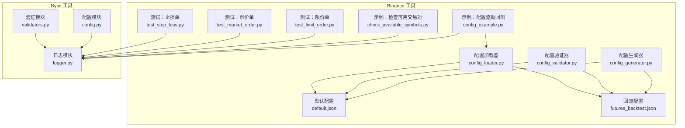
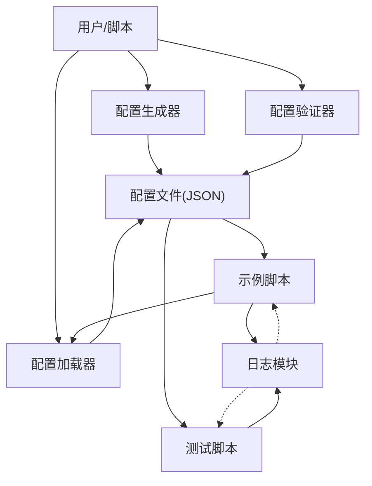
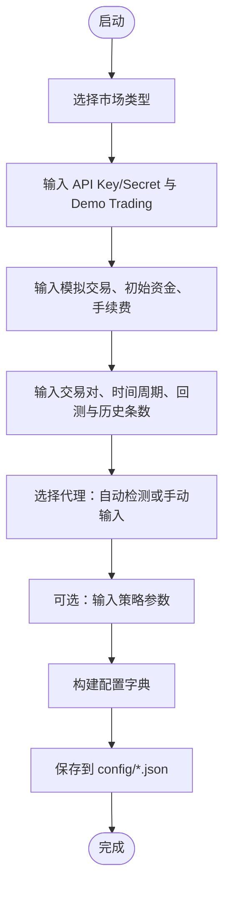
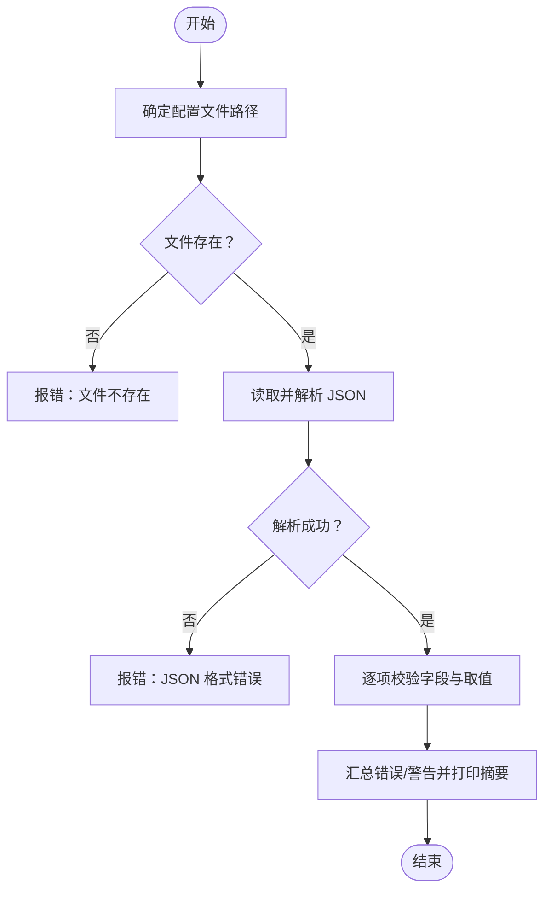
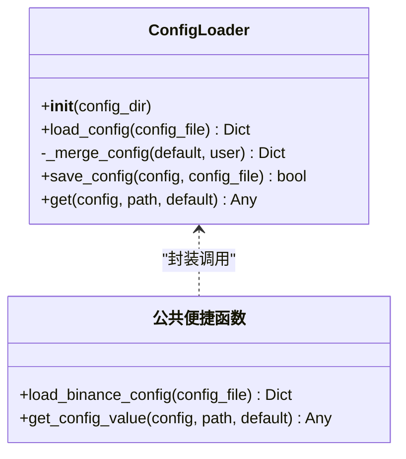
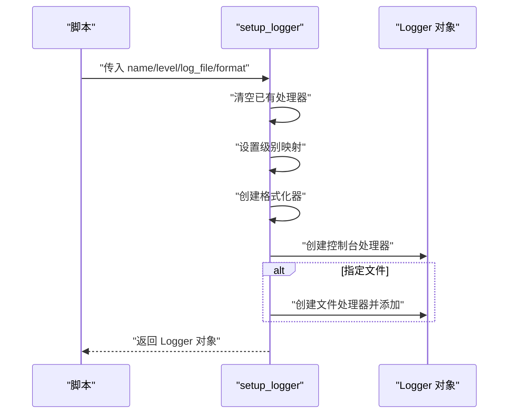
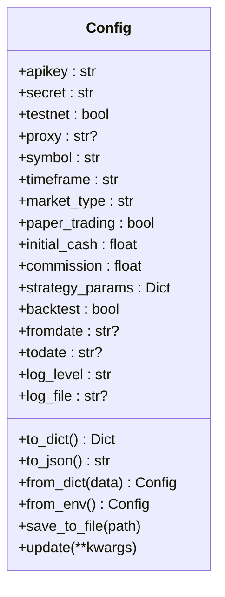
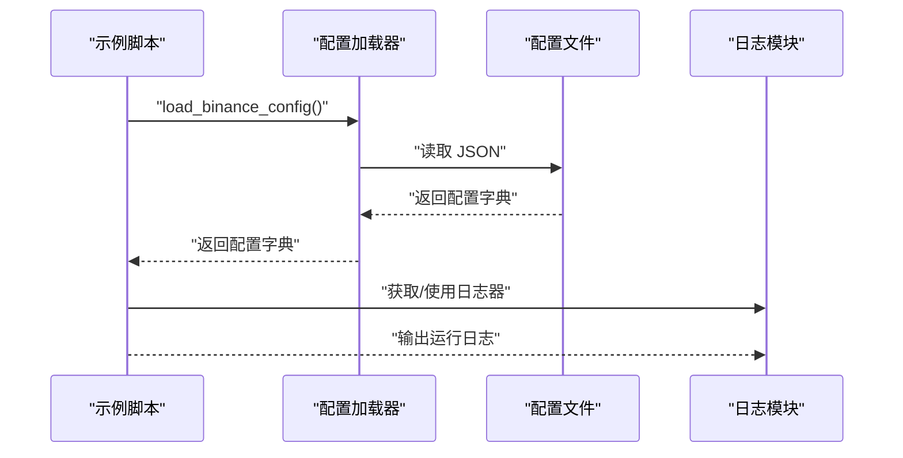
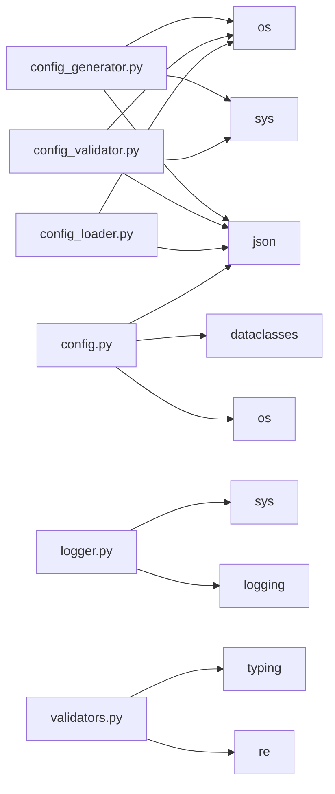

# 工具函数库

<cite>
**本文引用的文件**
- [real_trade/binance/tools/config_generator.py](file://real_trade/binance/tools/config_generator.py)
- [real_trade/binance/tools/config_validator.py](file://real_trade/binance/tools/config_validator.py)
- [real_trade/binance/config_loader.py](file://real_trade/binance/config_loader.py)
- [real_trade/binance/config/default.json](file://real_trade/binance/config/default.json)
- [real_trade/binance/config/futures_backtest.json](file://real_trade/binance/config/futures_backtest.json)
- [real_trade/binance/examples/config_example.py](file://real_trade/binance/examples/config_example.py)
- [real_trade/binance/examples/check_available_symbols.py](file://real_trade/binance/examples/check_available_symbols.py)
- [real_trade/binance/tests/test_limit_order.py](file://real_trade/binance/tests/test_limit_order.py)
- [real_trade/binance/tests/test_market_order.py](file://real_trade/binance/tests/test_market_order.py)
- [real_trade/binance/tests/test_stop_loss.py](file://real_trade/binance/tests/test_stop_loss.py)
- [real_trade/bybit/utils/logger.py](file://real_trade/bybit/utils/logger.py)
- [real_trade/bybit/utils/config.py](file://real_trade/bybit/utils/config.py)
- [real_trade/bybit/utils/validators.py](file://real_trade/bybit/utils/validators.py)
</cite>

## 目录
1. [简介](#简介)
2. [项目结构](#项目结构)
3. [核心组件](#核心组件)
4. [架构总览](#架构总览)
5. [详细组件分析](#详细组件分析)
6. [依赖分析](#依赖分析)
7. [性能考虑](#性能考虑)
8. [故障排查指南](#故障排查指南)
9. [结论](#结论)
10. [附录](#附录)

## 简介
本文件面向 Binance 工具函数库与通用工具模块，系统性梳理并解释以下能力：
- 配置处理：配置加载、合并、保存、便捷访问与校验
- 日志记录：统一日志器创建、级别控制、格式化与文件落盘
- 参数验证：交易对、时间周期、API 密钥、订单/价格/手续费/资金等校验
- 实战示例：通过示例脚本展示如何在真实交易场景中正确使用这些工具
- 设计原则与扩展：如何基于现有工具进行二次开发与集成

## 项目结构
围绕 Binance 工具函数库与 Bybit 工具模块，仓库中相关文件分布如下：
- Binance 工具
  - 配置生成器与验证器：tools/config_generator.py、tools/config_validator.py
  - 配置加载器：config_loader.py
  - 示例与测试：examples/*.py、tests/*.py
  - 配置样例：config/*.json
- Bybit 工具（可复用到 Binance 的设计与实现）
  - 日志模块：bybit/utils/logger.py
  - 配置模块：bybit/utils/config.py
  - 验证模块：bybit/utils/validators.py

图表来源
- [real_trade/binance/tools/config_generator.py](file://real_trade/binance/tools/config_generator.py#L1-L164)
- [real_trade/binance/tools/config_validator.py](file://real_trade/binance/tools/config_validator.py#L1-L190)
- [real_trade/binance/config_loader.py](file://real_trade/binance/config_loader.py#L1-L221)
- [real_trade/binance/config/default.json](file://real_trade/binance/config/default.json#L1-L33)
- [real_trade/binance/config/futures_backtest.json](file://real_trade/binance/config/futures_backtest.json#L1-L37)
- [real_trade/binance/examples/config_example.py](file://real_trade/binance/examples/config_example.py#L1-L363)
- [real_trade/binance/examples/check_available_symbols.py](file://real_trade/binance/examples/check_available_symbols.py#L1-L162)
- [real_trade/binance/tests/test_limit_order.py](file://real_trade/binance/tests/test_limit_order.py#L1-L201)
- [real_trade/binance/tests/test_market_order.py](file://real_trade/binance/tests/test_market_order.py#L1-L153)
- [real_trade/binance/tests/test_stop_loss.py](file://real_trade/binance/tests/test_stop_loss.py#L1-L205)
- [real_trade/bybit/utils/logger.py](file://real_trade/bybit/utils/logger.py#L1-L85)
- [real_trade/bybit/utils/config.py](file://real_trade/bybit/utils/config.py#L1-L145)
- [real_trade/bybit/utils/validators.py](file://real_trade/bybit/utils/validators.py#L1-L183)

章节来源
- [real_trade/binance/tools/config_generator.py](file://real_trade/binance/tools/config_generator.py#L1-L164)
- [real_trade/binance/tools/config_validator.py](file://real_trade/binance/tools/config_validator.py#L1-L190)
- [real_trade/binance/config_loader.py](file://real_trade/binance/config_loader.py#L1-L221)
- [real_trade/bybit/utils/logger.py](file://real_trade/bybit/utils/logger.py#L1-L85)
- [real_trade/bybit/utils/config.py](file://real_trade/bybit/utils/config.py#L1-L145)
- [real_trade/bybit/utils/validators.py](file://real_trade/bybit/utils/validators.py#L1-L183)

## 核心组件
- 配置生成器（config_generator.py）
  - 功能：交互式生成 Binance 配置文件，支持 Futures/Spot、Demo Trading、回测/实盘、代理等选项
  - 输出：生成 JSON 配置文件并提示使用方式
- 配置验证器（config_validator.py）
  - 功能：校验配置文件的结构与关键字段，给出错误/警告清单，并打印配置摘要
- 配置加载器（config_loader.py）
  - 功能：加载 JSON 配置、合并默认值、保存配置、按路径读取嵌套配置项
- 日志模块（bybit/utils/logger.py）
  - 功能：统一创建日志器、设置级别、格式化、控制台与文件输出
- 配置模块（bybit/utils/config.py）
  - 功能：以数据类承载配置，支持从文件/环境变量加载、序列化、保存、更新
- 验证模块（bybit/utils/validators.py）
  - 功能：交易对、时间周期、API 密钥、订单/价格/手续费/资金等参数校验

章节来源
- [real_trade/binance/tools/config_generator.py](file://real_trade/binance/tools/config_generator.py#L14-L164)
- [real_trade/binance/tools/config_validator.py](file://real_trade/binance/tools/config_validator.py#L14-L190)
- [real_trade/binance/config_loader.py](file://real_trade/binance/config_loader.py#L14-L221)
- [real_trade/bybit/utils/logger.py](file://real_trade/bybit/utils/logger.py#L16-L85)
- [real_trade/bybit/utils/config.py](file://real_trade/bybit/utils/config.py#L17-L145)
- [real_trade/bybit/utils/validators.py](file://real_trade/bybit/utils/validators.py#L15-L183)

## 架构总览
下图展示了配置与工具模块之间的协作关系，以及与示例/测试的集成路径。

图表来源
- [real_trade/binance/tools/config_generator.py](file://real_trade/binance/tools/config_generator.py#L14-L164)
- [real_trade/binance/tools/config_validator.py](file://real_trade/binance/tools/config_validator.py#L14-L190)
- [real_trade/binance/config_loader.py](file://real_trade/binance/config_loader.py#L60-L221)
- [real_trade/binance/examples/config_example.py](file://real_trade/binance/examples/config_example.py#L239-L363)
- [real_trade/binance/tests/test_limit_order.py](file://real_trade/binance/tests/test_limit_order.py#L19-L201)
- [real_trade/bybit/utils/logger.py](file://real_trade/bybit/utils/logger.py#L16-L85)

## 详细组件分析

### 配置生成器（config_generator.py）
- 交互式收集市场类型、API、交易、数据、代理、策略等参数
- 生成 JSON 配置并保存至 binance/config 目录
- 输出使用指引，便于在业务代码中通过便捷函数加载

图表来源
- [real_trade/binance/tools/config_generator.py](file://real_trade/binance/tools/config_generator.py#L14-L164)

章节来源
- [real_trade/binance/tools/config_generator.py](file://real_trade/binance/tools/config_generator.py#L14-L164)

### 配置验证器（config_validator.py）
- 校验文件存在性、JSON 格式、关键字段与取值范围
- 对缺失字段给出警告，对异常值给出提示
- 输出配置摘要，便于核对

图表来源
- [real_trade/binance/tools/config_validator.py](file://real_trade/binance/tools/config_validator.py#L14-L190)

章节来源
- [real_trade/binance/tools/config_validator.py](file://real_trade/binance/tools/config_validator.py#L14-L190)

### 配置加载器（config_loader.py）
- 默认配置与用户配置合并（递归合并，用户配置优先）
- 支持绝对/相对路径加载与保存
- 提供便捷函数用于读取嵌套配置项

图表来源
- [real_trade/binance/config_loader.py](file://real_trade/binance/config_loader.py#L14-L221)

章节来源
- [real_trade/binance/config_loader.py](file://real_trade/binance/config_loader.py#L14-L221)

### 日志模块（bybit/utils/logger.py）
- 提供 setup_logger 与 get_logger
- 支持级别映射、格式化、控制台与文件处理器
- 默认日志器便于全局复用

图表来源
- [real_trade/bybit/utils/logger.py](file://real_trade/bybit/utils/logger.py#L16-L85)

章节来源
- [real_trade/bybit/utils/logger.py](file://real_trade/bybit/utils/logger.py#L16-L85)

### 配置模块（bybit/utils/config.py）
- 以数据类承载配置，提供 from_dict/from_env、to_dict/to_json、保存与更新
- 支持从 JSON/Python 文件加载（Python 文件提取大写变量）

图表来源
- [real_trade/bybit/utils/config.py](file://real_trade/bybit/utils/config.py#L17-L145)

章节来源
- [real_trade/bybit/utils/config.py](file://real_trade/bybit/utils/config.py#L17-L145)

### 验证模块（bybit/utils/validators.py）
- 提供交易对、时间周期、API 密钥、订单/价格/手续费/资金等校验
- 返回二元组（是否有效, 错误信息），便于统一处理

图表来源
- [real_trade/bybit/utils/validators.py](file://real_trade/bybit/utils/validators.py#L33-L183)

章节来源
- [real_trade/bybit/utils/validators.py](file://real_trade/bybit/utils/validators.py#L33-L183)

### 示例与测试集成
- 示例脚本通过配置加载器读取策略参数，结合日志模块输出运行过程
- 测试脚本在真实 Demo Trading 环境中验证订单、持仓与市场信息

图表来源
- [real_trade/binance/examples/config_example.py](file://real_trade/binance/examples/config_example.py#L239-L363)
- [real_trade/binance/config_loader.py](file://real_trade/binance/config_loader.py#L60-L221)
- [real_trade/bybit/utils/logger.py](file://real_trade/bybit/utils/logger.py#L70-L85)

章节来源
- [real_trade/binance/examples/config_example.py](file://real_trade/binance/examples/config_example.py#L239-L363)
- [real_trade/binance/tests/test_limit_order.py](file://real_trade/binance/tests/test_limit_order.py#L19-L201)
- [real_trade/binance/tests/test_market_order.py](file://real_trade/binance/tests/test_market_order.py#L19-L153)
- [real_trade/binance/tests/test_stop_loss.py](file://real_trade/binance/tests/test_stop_loss.py#L19-L205)

## 依赖分析
- 配置生成器/验证器依赖标准库（json/os/sys），生成器还依赖交互输入
- 配置加载器依赖 json/os，提供默认配置与递归合并
- 日志模块依赖 logging、sys，支持控制台与文件输出
- 配置模块依赖 os/json、typing、dataclasses，支持环境变量与文件加载
- 验证模块依赖 typing、re，提供正则与数值范围校验

图表来源
- [real_trade/binance/tools/config_generator.py](file://real_trade/binance/tools/config_generator.py#L9-L12)
- [real_trade/binance/tools/config_validator.py](file://real_trade/binance/tools/config_validator.py#L9-L12)
- [real_trade/binance/config_loader.py](file://real_trade/binance/config_loader.py#L9-L12)
- [real_trade/bybit/utils/logger.py](file://real_trade/bybit/utils/logger.py#L11-L13)
- [real_trade/bybit/utils/config.py](file://real_trade/bybit/utils/config.py#L11-L14)
- [real_trade/bybit/utils/validators.py](file://real_trade/bybit/utils/validators.py#L11-L12)

章节来源
- [real_trade/binance/tools/config_generator.py](file://real_trade/binance/tools/config_generator.py#L9-L12)
- [real_trade/binance/tools/config_validator.py](file://real_trade/binance/tools/config_validator.py#L9-L12)
- [real_trade/binance/config_loader.py](file://real_trade/binance/config_loader.py#L9-L12)
- [real_trade/bybit/utils/logger.py](file://real_trade/bybit/utils/logger.py#L11-L13)
- [real_trade/bybit/utils/config.py](file://real_trade/bybit/utils/config.py#L11-L14)
- [real_trade/bybit/utils/validators.py](file://real_trade/bybit/utils/validators.py#L11-L12)

## 性能考虑
- 配置加载器采用递归合并，复杂度与嵌套深度成正比；建议保持配置层级简洁
- 日志模块默认仅添加一个控制台处理器，必要时再添加文件处理器，避免重复写入
- 验证器使用正则与数值比较，开销极低；建议在高频入口处缓存校验结果（视业务而定）

## 故障排查指南
- 配置文件不存在或格式错误
  - 使用配置验证器进行检查，关注错误/警告输出
  - 确认路径是否为绝对路径或相对于 tools/config 的相对路径
- 配置合并不符合预期
  - 检查默认配置与用户配置的键名是否一致
  - 确认嵌套字典的合并逻辑（用户配置优先）
- 日志未落盘或级别不生效
  - 确认日志器级别映射与 format_string 设置
  - 检查是否同时设置了多个处理器导致输出分散
- 参数校验失败
  - 根据返回的错误信息修正交易对、时间周期、API 密钥、订单/价格/手续费/资金等参数

章节来源
- [real_trade/binance/tools/config_validator.py](file://real_trade/binance/tools/config_validator.py#L14-L190)
- [real_trade/binance/config_loader.py](file://real_trade/binance/config_loader.py#L60-L125)
- [real_trade/bybit/utils/logger.py](file://real_trade/bybit/utils/logger.py#L16-L85)
- [real_trade/bybit/utils/validators.py](file://real_trade/bybit/utils/validators.py#L33-L183)

## 结论
本工具函数库提供了从“配置生成—配置校验—配置加载—日志—验证”的完整链路，配合示例与测试脚本，能够帮助开发者在 Binance（及 Bybit）生态中快速搭建可靠的交易系统。Bybit 工具模块的设计与实现可直接迁移到 Binance 工程中，提升一致性与可维护性。

## 附录
- 使用示例与最佳实践
  - 使用配置生成器快速生成模板配置，随后用配置验证器进行校验
  - 在业务脚本中通过配置加载器读取策略参数，并结合日志模块输出运行状态
  - 在订单提交前使用验证模块校验参数，减少无效请求
- 设计原则与扩展
  - 配置层：以数据类/字典承载，支持多种来源（文件/环境变量），提供序列化与保存
  - 工具层：单一职责、返回明确的布尔+错误信息，便于上层统一处理
  - 日志层：统一入口、可落盘、可分级，避免在业务代码中重复配置
- 与其他模块的集成
  - 示例与测试脚本通过配置加载器与日志模块与核心交易流程解耦
  - 验证模块可作为中间件在订单/参数进入核心逻辑前进行前置校验