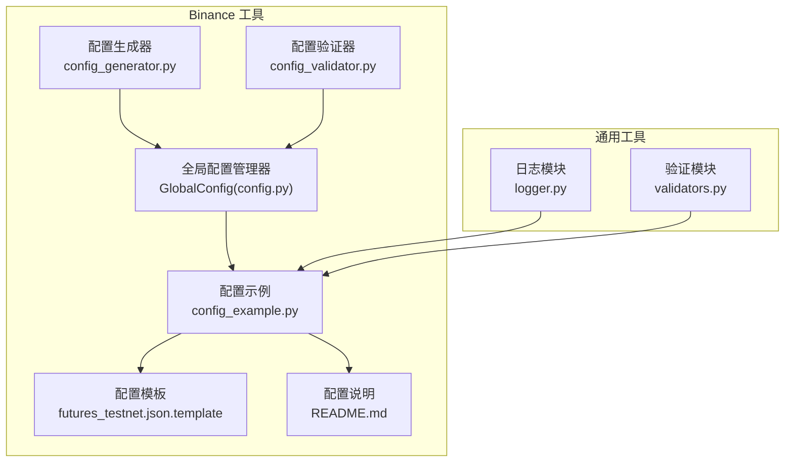
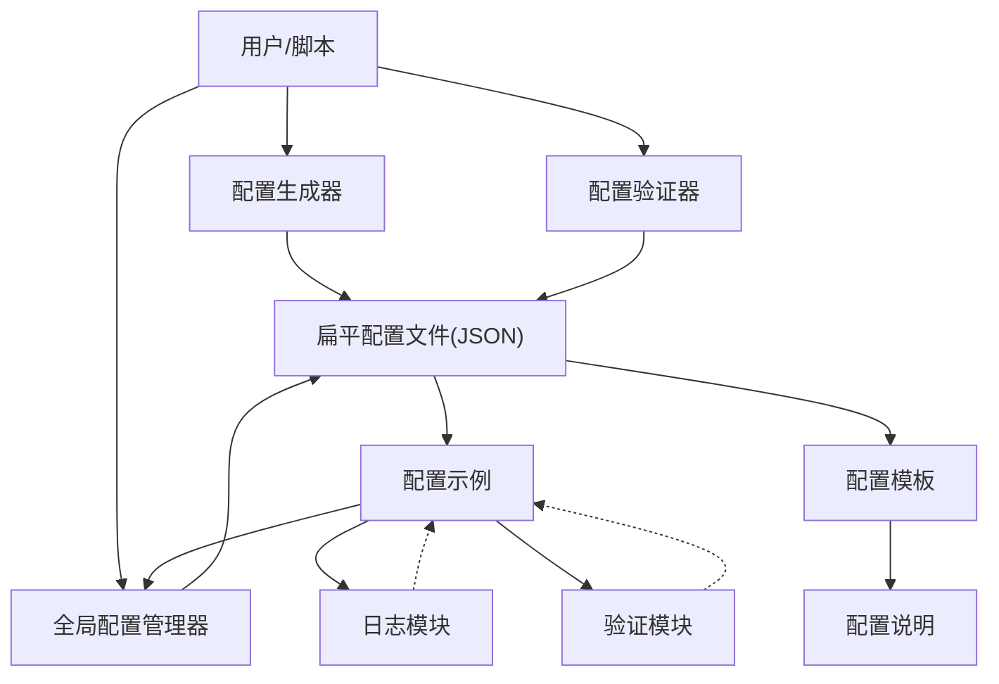
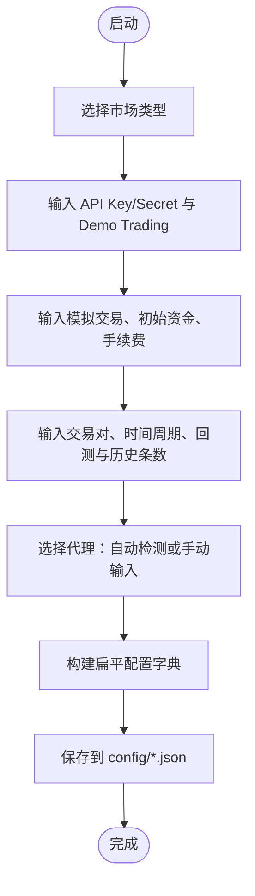
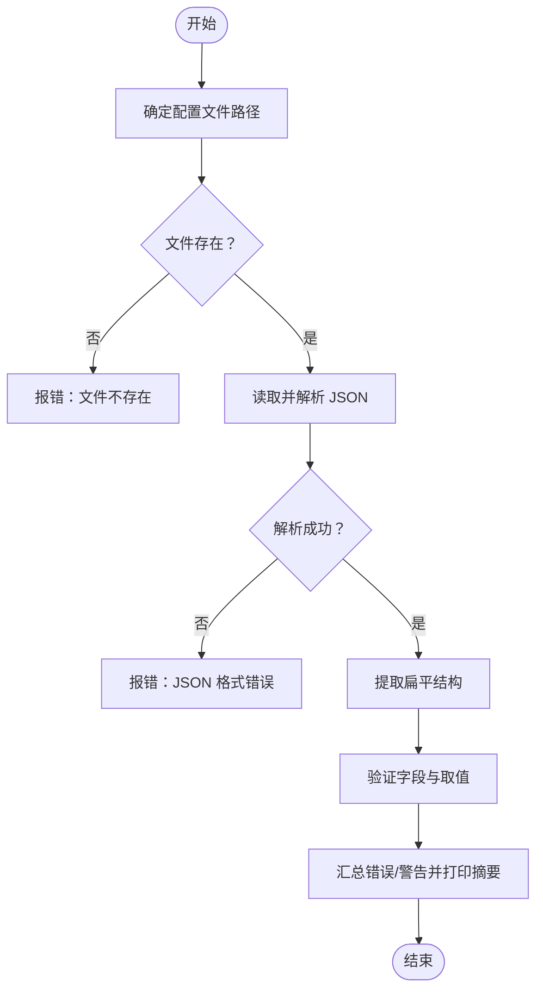
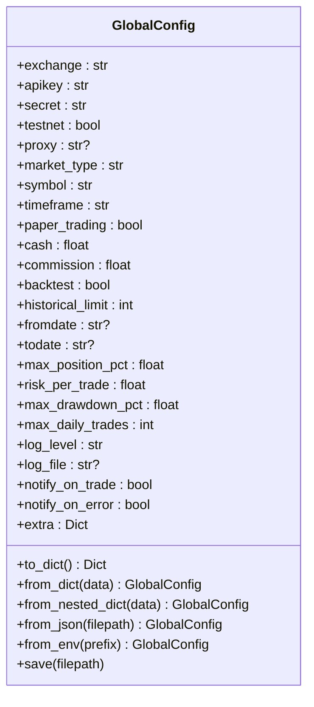
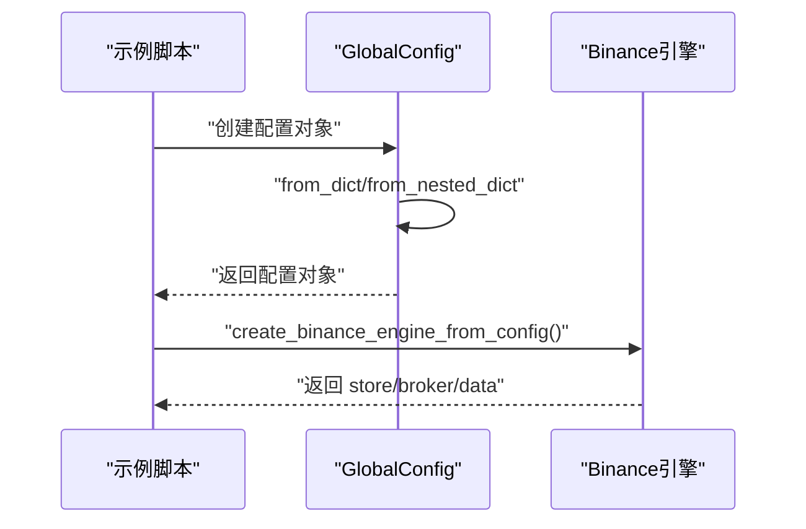
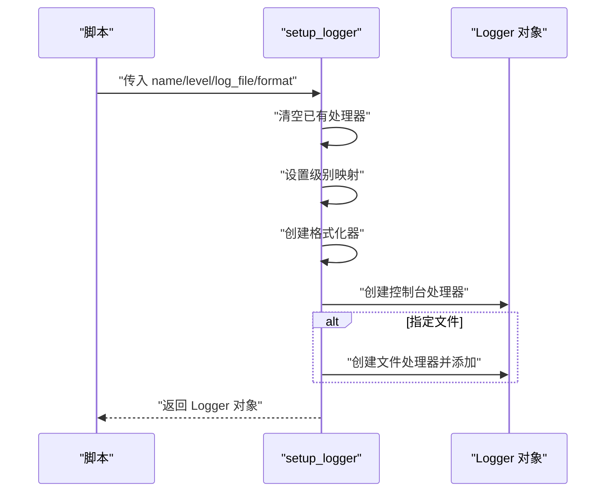
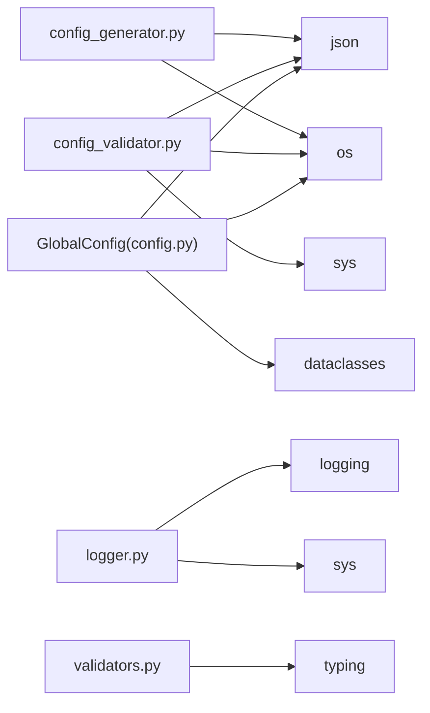

# 工具函数库

<cite>
**本文引用的文件**
- [real_trade/binance/tools/config_generator.py](file://real_trade/binance/tools/config_generator.py)
- [real_trade/binance/tools/config_validator.py](file://real_trade/binance/tools/config_validator.py)
- [real_trade/utils/config.py](file://real_trade/utils/config.py)
- [real_trade/binance/examples/config_example.py](file://real_trade/binance/examples/config_example.py)
- [real_trade/binance/config/README.md](file://real_trade/binance/config/README.md)
- [real_trade/binance/config/futures_testnet.json.template](file://real_trade/binance/config/futures_testnet.json.template)
- [real_trade/binance/config/spot_testnet.json.template](file://real_trade/binance/config/spot_testnet.json.template)
- [real_trade/utils/logger.py](file://real_trade/utils/logger.py)
- [real_trade/utils/validators.py](file://real_trade/utils/validators.py)
</cite>

## 更新摘要
**所做更改**
- 更新了配置生成器和验证器工具的重大改进，支持新的扁平配置结构
- 新增了 GlobalConfig 全局配置管理器的详细说明
- 增强了用户交互体验和错误处理能力的描述
- 更新了配置文件格式和兼容性的说明
- 完善了配置工具链的架构说明

## 目录
1. [简介](#简介)
2. [项目结构](#项目结构)
3. [核心组件](#核心组件)
4. [架构总览](#架构总览)
5. [详细组件分析](#详细组件分析)
6. [依赖分析](#依赖分析)
7. [性能考虑](#性能考虑)
8. [故障排查指南](#故障排查指南)
9. [结论](#结论)
10. [附录](#附录)

## 简介
本文件面向 Binance 工具函数库与通用工具模块，系统性梳理并解释以下能力：
- 配置处理：配置加载、合并、保存、便捷访问与校验
- 日志记录：统一日志器创建、级别控制、格式化与文件落盘
- 参数验证：交易对、时间周期、API 密钥、订单/价格/手续费/资金等校验
- 实战示例：通过示例脚本展示如何在真实交易场景中正确使用这些工具
- 设计原则与扩展：如何基于现有工具进行二次开发与集成

**更新** 本次更新重点介绍了配置工具模块的重大改进，包括支持扁平配置结构、增强用户交互体验和改进错误处理能力。

## 项目结构
围绕 Binance 工具函数库与通用工具模块，仓库中相关文件分布如下：
- Binance 工具
  - 配置生成器与验证器：tools/config_generator.py、tools/config_validator.py
  - 配置管理器：utils/config.py（GlobalConfig）
  - 示例与配置模板：examples/config_example.py、config/*.template
  - 配置说明文档：config/README.md
- 通用工具模块
  - 日志模块：utils/logger.py
  - 验证模块：utils/validators.py

**图表来源**
- [real_trade/binance/tools/config_generator.py](file://real_trade/binance/tools/config_generator.py#L1-L105)
- [real_trade/binance/tools/config_validator.py](file://real_trade/binance/tools/config_validator.py#L1-L185)
- [real_trade/utils/config.py](file://real_trade/utils/config.py#L1-L169)
- [real_trade/binance/examples/config_example.py](file://real_trade/binance/examples/config_example.py#L1-L221)
- [real_trade/binance/config/README.md](file://real_trade/binance/config/README.md#L1-L132)

## 核心组件
- 配置生成器（config_generator.py）
  - 功能：交互式生成 Binance 配置文件，支持 Futures/Spot、Demo Trading、回测/实盘、代理等选项
  - 输出：生成扁平结构的 JSON 配置文件并提示使用方式
- 配置验证器（config_validator.py）
  - 功能：校验配置文件的结构与关键字段，支持扁平和嵌套两种格式，给出错误/警告清单，并打印配置摘要
- 全局配置管理器（utils/config.py）
  - 功能：统一管理配置，支持扁平和嵌套两种 JSON 结构，提供 from_dict、from_nested_dict、from_json、from_env 等多种加载方式
- 配置示例（config_example.py）
  - 功能：演示如何使用不同方式（JSON文件、GlobalConfig对象、字典）创建 Binance 交易引擎
- 日志模块（utils/logger.py）
  - 功能：统一创建日志器、设置级别、格式化、控制台与文件输出
- 验证模块（utils/validators.py）
  - 功能：交易对、时间周期、API 密钥、订单/价格/手续费/资金等参数校验

**章节来源**
- [real_trade/binance/tools/config_generator.py](file://real_trade/binance/tools/config_generator.py#L14-L105)
- [real_trade/binance/tools/config_validator.py](file://real_trade/binance/tools/config_validator.py#L81-L185)
- [real_trade/utils/config.py](file://real_trade/utils/config.py#L20-L169)
- [real_trade/binance/examples/config_example.py](file://real_trade/binance/examples/config_example.py#L144-L221)
- [real_trade/utils/logger.py](file://real_trade/utils/logger.py#L18-L62)
- [real_trade/utils/validators.py](file://real_trade/utils/validators.py#L28-L82)

## 架构总览
下图展示了配置与工具模块之间的协作关系，以及与示例/配置模板的集成路径。

**图表来源**
- [real_trade/binance/tools/config_generator.py](file://real_trade/binance/tools/config_generator.py#L63-L100)
- [real_trade/binance/tools/config_validator.py](file://real_trade/binance/tools/config_validator.py#L81-L175)
- [real_trade/utils/config.py](file://real_trade/utils/config.py#L131-L169)
- [real_trade/binance/examples/config_example.py](file://real_trade/binance/examples/config_example.py#L144-L221)
- [real_trade/binance/config/README.md](file://real_trade/binance/config/README.md#L37-L121)

## 详细组件分析

### 配置生成器（config_generator.py）
- 交互式收集市场类型、API、交易、数据、代理、策略等参数
- 生成扁平结构的 JSON 配置并保存至 binance/config 目录
- 输出使用指引，便于在业务代码中通过便捷函数加载

**更新** 配置生成器现在专门生成扁平结构的配置，与 GlobalConfig 类字段完全对齐，简化了配置文件的结构和使用方式。

**图表来源**
- [real_trade/binance/tools/config_generator.py](file://real_trade/binance/tools/config_generator.py#L14-L100)

**章节来源**
- [real_trade/binance/tools/config_generator.py](file://real_trade/binance/tools/config_generator.py#L14-L105)

### 配置验证器（config_validator.py）
- 校验文件存在性、JSON 格式、关键字段与取值范围
- 支持扁平和嵌套两种 JSON 格式，自动识别并转换为统一的扁平结构
- 对缺失字段给出警告，对异常值给出提示
- 输出配置摘要，便于核对

**更新** 配置验证器现在具备强大的格式兼容性，能够自动识别扁平和嵌套两种配置格式，并统一转换为扁平结构进行验证，大大提升了用户体验。

**图表来源**
- [real_trade/binance/tools/config_validator.py](file://real_trade/binance/tools/config_validator.py#L81-L175)

**章节来源**
- [real_trade/binance/tools/config_validator.py](file://real_trade/binance/tools/config_validator.py#L81-L185)

### 全局配置管理器（utils/config.py）
- 提供 GlobalConfig 数据类，支持从环境变量、JSON文件、字典三种方式加载
- 兼容扁平和嵌套两种 JSON 结构，自动识别并转换
- 提供 to_dict、from_dict、from_nested_dict、from_json、from_env 等多种方法
- 支持保存配置到文件

**更新** GlobalConfig 是本次更新的核心组件，它统一了配置管理，支持扁平和嵌套两种结构，为整个工具链提供了统一的配置接口。

**图表来源**
- [real_trade/utils/config.py](file://real_trade/utils/config.py#L20-L169)

**章节来源**
- [real_trade/utils/config.py](file://real_trade/utils/config.py#L20-L169)

### 配置示例（config_example.py）
- 演示如何使用不同方式创建 Binance 交易引擎
- 支持从 JSON 配置文件、GlobalConfig 对象、字典三种方式
- 展示了完整的回测流程和策略参数配置

**更新** 配置示例现在主要展示如何使用 GlobalConfig 和扁平配置结构，简化了配置方式并提供了更清晰的使用示例。

**图表来源**
- [real_trade/binance/examples/config_example.py](file://real_trade/binance/examples/config_example.py#L144-L166)

**章节来源**
- [real_trade/binance/examples/config_example.py](file://real_trade/binance/examples/config_example.py#L144-L221)

### 日志模块（utils/logger.py）
- 提供 setup_logger 与 get_logger
- 支持级别映射、格式化、控制台与文件处理器
- 默认日志器便于全局复用

**图表来源**
- [real_trade/utils/logger.py](file://real_trade/utils/logger.py#L18-L54)

**章节来源**
- [real_trade/utils/logger.py](file://real_trade/utils/logger.py#L18-L62)

### 验证模块（utils/validators.py）
- 提供交易对、时间周期、API 密钥、订单/价格/手续费/资金等校验
- 返回二元组（是否有效, 错误信息），便于统一处理

**图表来源**
- [real_trade/utils/validators.py](file://real_trade/utils/validators.py#L28-L82)

**章节来源**
- [real_trade/utils/validators.py](file://real_trade/utils/validators.py#L28-L82)

## 依赖分析
- 配置生成器依赖标准库（json/os），生成扁平结构配置
- 配置验证器依赖标准库（json/os/sys），支持扁平和嵌套格式识别
- 全局配置管理器依赖 dataclasses、json、os，支持多种配置来源
- 日志模块依赖 logging、sys，支持控制台与文件输出
- 验证模块依赖 typing，提供参数校验

**更新** 依赖关系得到了优化，新增了 GlobalConfig 作为核心配置管理器，简化了各组件间的依赖关系。

**图表来源**
- [real_trade/binance/tools/config_generator.py](file://real_trade/binance/tools/config_generator.py#L10-L11)
- [real_trade/binance/tools/config_validator.py](file://real_trade/binance/tools/config_validator.py#L9-L11)
- [real_trade/utils/config.py](file://real_trade/utils/config.py#L14-L17)
- [real_trade/utils/logger.py](file://real_trade/utils/logger.py#L11-L13)
- [real_trade/utils/validators.py](file://real_trade/utils/validators.py#L9)

## 性能考虑
- 配置生成器和验证器都采用扁平结构，减少了嵌套遍历的开销
- GlobalConfig 提供了高效的 from_dict 和 from_nested_dict 方法
- 日志模块默认仅添加一个控制台处理器，必要时再添加文件处理器
- 验证模块使用预定义的 VALID_TIMEFRAMES 集合进行快速查找

**更新** 性能优化方面，扁平结构配置减少了数据转换和遍历的复杂度，GlobalConfig 的设计提供了更好的内存使用效率。

## 故障排查指南
- 配置文件不存在或格式错误
  - 使用配置验证器进行检查，关注错误/警告输出
  - 确认路径是否为绝对路径或相对于 tools/config 的相对路径
  - 检查配置文件是否为扁平或嵌套格式之一
- 配置加载失败
  - 检查 GlobalConfig 的字段名称是否与配置文件匹配
  - 确认配置值的数据类型是否正确
  - 验证特殊字符和编码问题
- 日志未落盘或级别不生效
  - 确认日志器级别映射与 format_string 设置
  - 检查是否同时设置了多个处理器导致输出分散
- 参数校验失败
  - 根据返回的错误信息修正交易对、时间周期、API 密钥、订单/价格/手续费/资金等参数

**更新** 故障排查指南增加了对新配置格式的支持，特别是扁平和嵌套格式的识别问题。

**章节来源**
- [real_trade/binance/tools/config_validator.py](file://real_trade/binance/tools/config_validator.py#L81-L185)
- [real_trade/utils/config.py](file://real_trade/utils/config.py#L131-L169)
- [real_trade/utils/logger.py](file://real_trade/utils/logger.py#L18-L62)
- [real_trade/utils/validators.py](file://real_trade/utils/validators.py#L28-L82)

## 结论
本次更新显著改进了配置工具模块，通过引入 GlobalConfig 全局配置管理器和扁平配置结构，提供了更加统一和高效的配置管理方案。配置生成器和验证器都得到了重大改进，支持新的扁平结构，增强了用户交互体验和错误处理能力。这些改进使得开发者能够更轻松地管理和使用配置，提高了整个工具链的可用性和可维护性。

## 附录
- 使用示例与最佳实践
  - 使用配置生成器快速生成扁平结构配置，随后用配置验证器进行校验
  - 在业务脚本中通过 GlobalConfig 统一管理配置，支持多种来源（文件/环境变量/字典）
  - 在订单提交前使用验证模块校验参数，减少无效请求
  - 推荐使用扁平配置结构，与 GlobalConfig 字段完全对齐
- 设计原则与扩展
  - 配置层：以 GlobalConfig 为核心，支持多种配置来源和格式
  - 工具层：单一职责、返回明确的布尔+错误信息，便于上层统一处理
  - 日志层：统一入口、可落盘、可分级，避免在业务代码中重复配置
  - 验证层：预定义有效值集合，提供快速校验
- 与其他模块的集成
  - 配置示例通过 GlobalConfig 与核心交易流程解耦
  - 验证模块可作为中间件在订单/参数进入核心逻辑前进行前置校验
  - 配置模板和说明文档为用户提供完整的配置指导
- 配置格式兼容性
  - 推荐使用扁平结构，与 GlobalConfig 字段完全一致
  - 兼容嵌套结构，自动识别并转换
  - 支持环境变量配置，变量名格式为 RT_字段名