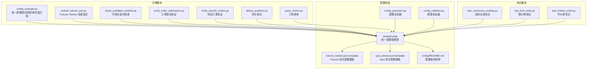
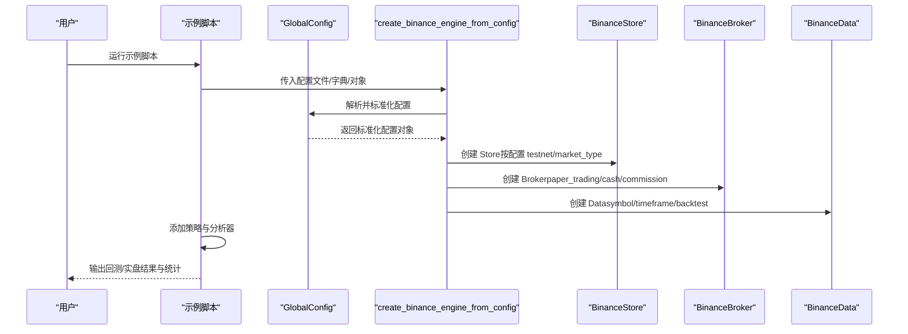
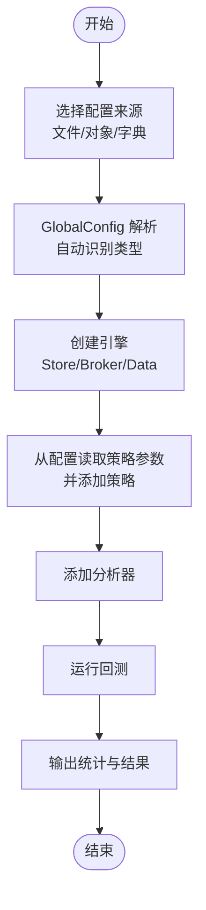
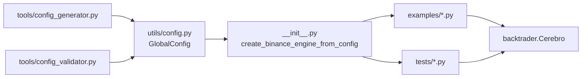

# 示例脚本集

<cite>
**本文引用的文件**
- [real_trade/binance/examples/config_example.py](file://real_trade/binance/examples/config_example.py)
- [real_trade/binance/examples/testnet_futures_test.py](file://real_trade/binance/examples/testnet_futures_test.py)
- [real_trade/binance/examples/check_available_symbols.py](file://real_trade/binance/examples/check_available_symbols.py)
- [real_trade/binance/examples/verify_order_submission.py](file://real_trade/binance/examples/verify_order_submission.py)
- [real_trade/binance/examples/verify_specific_orders.py](file://real_trade/binance/examples/verify_specific_orders.py)
- [real_trade/binance/examples/debug_positions.py](file://real_trade/binance/examples/debug_positions.py)
- [real_trade/binance/examples/query_orders.py](file://real_trade/binance/examples/query_orders.py)
- [real_trade/binance/tests/test_continuous_trading.py](file://real_trade/binance/tests/test_continuous_trading.py)
- [real_trade/binance/tests/test_limit_order.py](file://real_trade/binance/tests/test_limit_order.py)
- [real_trade/binance/tests/test_market_order.py](file://real_trade/binance/tests/test_market_order.py)
- [real_trade/binance/config/futures_testnet.json.template](file://real_trade/binance/config/futures_testnet.json.template)
- [real_trade/binance/config/spot_testnet.json.template](file://real_trade/binance/config/spot_testnet.json.template)
- [real_trade/binance/config/README.md](file://real_trade/binance/config/README.md)
- [real_trade/binance/tools/config_generator.py](file://real_trade/binance/tools/config_generator.py)
- [real_trade/binance/tools/config_validator.py](file://real_trade/binance/tools/config_validator.py)
- [real_trade/utils/config.py](file://real_trade/utils/config.py)
- [real_trade/binance/__init__.py](file://real_trade/binance/__init__.py)
</cite>

## 目录
1. [简介](#简介)
2. [项目结构](#项目结构)
3. [核心组件](#核心组件)
4. [架构总览](#架构总览)
5. [详细组件分析](#详细组件分析)
6. [依赖关系分析](#依赖关系分析)
7. [性能考虑](#性能考虑)
8. [故障排除指南](#故障排除指南)
9. [结论](#结论)
10. [附录](#附录)

## 简介
本文件系统化梳理 Binance 示例脚本集，覆盖配置文件使用、API 连接测试、交易功能测试（市价单、限价单、止损单）、连续交易测试与统计分析，并提供运行方法、参数配置与预期结果说明，以及调试与故障排除技巧。目标读者既包括初学者也包括有一定经验的开发者，力求以循序渐进的方式掌握示例脚本的使用与扩展。

**更新** 本版本重点介绍了新的统一配置方法，通过 GlobalConfig 类和 create_binance_engine_from_config 函数简化了配置加载和策略参数传递过程。

## 项目结构
示例脚本位于 real_trade/binance 目录下，按用途分为 examples（示例脚本）、tests（测试脚本）、config（配置文件）、tools（工具）等模块。examples 与 tests 均围绕 Binance Futures/Spot 的 Demo/Live/Testnet 场景展开，新的统一配置系统通过 GlobalConfig 提供灵活的配置加载能力。

**图表来源**
- [real_trade/binance/examples/config_example.py](file://real_trade/binance/examples/config_example.py#L1-L221)
- [real_trade/binance/examples/testnet_futures_test.py](file://real_trade/binance/examples/testnet_futures_test.py#L1-L156)
- [real_trade/binance/config/futures_testnet.json.template](file://real_trade/binance/config/futures_testnet.json.template#L1-L15)
- [real_trade/binance/config/spot_testnet.json.template](file://real_trade/binance/config/spot_testnet.json.template#L1-L15)
- [real_trade/utils/config.py](file://real_trade/utils/config.py#L1-L169)
- [real_trade/binance/tools/config_generator.py](file://real_trade/binance/tools/config_generator.py#L1-L105)
- [real_trade/binance/tools/config_validator.py](file://real_trade/binance/tools/config_validator.py#L1-L185)

**章节来源**
- [real_trade/binance/examples/config_example.py](file://real_trade/binance/examples/config_example.py#L1-L221)
- [real_trade/utils/config.py](file://real_trade/utils/config.py#L1-L169)
- [real_trade/binance/config/README.md](file://real_trade/binance/config/README.md#L1-L132)

## 核心组件
- **统一配置管理**：GlobalConfig 类提供统一的配置管理，支持扁平和嵌套两种 JSON 结构，兼容环境变量、JSON 文件和字典三种加载方式。
- **配置加载器**：create_binance_engine_from_config 函数支持三种配置输入方式，自动识别配置类型并创建相应的交易引擎。
- **引擎工厂**：根据统一配置创建 Store/Broker/Data 组合，支持回测/实盘/Paper Trading/Testnet 等多种模式。
- **配置工具**：提供配置生成器和验证器，帮助用户快速创建和验证配置文件。

**章节来源**
- [real_trade/utils/config.py](file://real_trade/utils/config.py#L1-L169)
- [real_trade/binance/__init__.py](file://real_trade/binance/__init__.py#L137-L223)
- [real_trade/binance/tools/config_generator.py](file://real_trade/binance/tools/config_generator.py#L1-L105)
- [real_trade/binance/tools/config_validator.py](file://real_trade/binance/tools/config_validator.py#L1-L185)

## 架构总览
新的统一配置系统通过 GlobalConfig 类将用户的各种配置输入标准化，然后通过 create_binance_engine_from_config 函数转换为具体的交易引擎组件。

**图表来源**
- [real_trade/binance/__init__.py](file://real_trade/binance/__init__.py#L137-L223)
- [real_trade/utils/config.py](file://real_trade/utils/config.py#L69-L169)

## 详细组件分析

### 统一配置系统：GlobalConfig（新的核心配置管理）
- **目标**：提供统一的配置管理，支持多种配置来源和格式。
- **关键特性**：
  - 支持扁平结构（与 GlobalConfig 字段完全一致）和嵌套结构（api/trading/data/proxy）。
  - 支持从环境变量、JSON 文件、字典三种方式加载。
  - 自动识别配置类型并进行标准化处理。
- **核心字段**：
  - 交易所配置：exchange、apikey、secret、testnet、proxy、market_type
  - 交易配置：symbol、timeframe、paper_trading、cash、commission、backtest
  - 数据配置：historical_limit、fromdate、todate
  - 风控配置：max_position_pct、risk_per_trade、max_drawdown_pct、max_daily_trades
  - 日志和通知配置：log_level、log_file、notify_on_trade、notify_on_error
- **使用方式**：
  - 从扁平字典：GlobalConfig.from_dict()
  - 从嵌套字典：GlobalConfig.from_nested_dict()
  - 从 JSON 文件：GlobalConfig.from_json()
  - 从环境变量：GlobalConfig.from_env()

**章节来源**
- [real_trade/utils/config.py](file://real_trade/utils/config.py#L20-L169)

### 基础示例：config_example.py（统一配置驱动的回测/实盘）
- **目标**：演示如何通过统一配置系统创建 Binance 交易引擎，支持回测、Demo 实盘与生产实盘三种模式。
- **新的统一配置方法**：
  - 支持三种配置输入：JSON 文件路径、GlobalConfig 对象、配置字典。
  - 自动识别配置类型并进行标准化处理。
  - 简化了策略参数传递过程，通过 GlobalConfig.extra 字段支持策略参数。
- **关键流程**：
  - 选择配置来源（文件/对象/字典）。
  - 通过 create_binance_engine_from_config 自动处理配置。
  - 从配置读取策略参数并添加策略。
  - 添加多个分析器（夏普比率、最大回撤、收益、交易分析）。
  - 运行回测并输出统计结果。
- **参数与配置要点**：
  - data.backtest 控制是否使用历史数据回测。
  - trading.paper_trading 控制是否模拟交易。
  - api.testnet 控制是否使用 Testnet。
  - strategy.* 控制策略参数（通过 extra 字段传递）。
- **运行方法**：
  - 修改主函数中的配置源即可切换模式。
  - 支持直接传入配置字典，无需创建 JSON 文件。
- **预期结果**：
  - 输出初始/最终账户价值、总盈亏、胜率、夏普比率、最大回撤等。

**图表来源**
- [real_trade/binance/examples/config_example.py](file://real_trade/binance/examples/config_example.py#L144-L221)
- [real_trade/binance/__init__.py](file://real_trade/binance/__init__.py#L137-L223)
- [real_trade/utils/config.py](file://real_trade/utils/config.py#L69-L169)

**章节来源**
- [real_trade/binance/examples/config_example.py](file://real_trade/binance/examples/config_example.py#L1-L221)
- [real_trade/binance/config/README.md](file://real_trade/binance/config/README.md#L1-L132)

### API 连接测试：testnet_futures_test.py
- **目标**：验证 Futures Testnet 连接，检查账户余额、市场数据、持仓信息、历史 K 线。
- **测试内容**：
  - 创建 BinanceStore（Futures，Testnet）。
  - 获取 USDT 余额。
  - 获取 BTC/USDT 最新价格（含安全处理缺失字段）。
  - 获取所有持仓并过滤活跃持仓。
  - 获取最近 K 线数据。
- **验证方法**：
  - 成功获取即表示连接正常；失败需检查密钥、网络与 Testnet 服务状态。
- **运行方法**：将示例中的示例密钥替换为自己的 Testnet 密钥后运行。
- **预期结果**：各项测试输出"✓"即为成功。

**章节来源**
- [real_trade/binance/examples/testnet_futures_test.py](file://real_trade/binance/examples/testnet_futures_test.py#L1-L156)

### 可用交易对检查：check_available_symbols.py
- **目标**：诊断"ETH/USDT 订单显示成功但官网看不到记录"的问题。
- **检查内容**：
  - 加载市场信息并筛选 ETH 永续合约。
  - 校验常用 USDT 结算合约可用性与最小订单金额。
  - 测试获取 ETH 行情。
  - 获取最近订单历史。
  - 提供诊断建议（符号格式、最小订单金额、CCXT 缓存问题等）。
- **运行方法**：替换示例密钥后运行，观察输出的建议与提示。

**章节来源**
- [real_trade/binance/examples/check_available_symbols.py](file://real_trade/binance/examples/check_available_symbols.py#L1-L162)

### 订单提交验证：verify_order_submission.py
- **目标**：验证订单是否真正提交到 Demo Trading，而非仅本地缓存。
- **验证步骤**：
  - 连接 Demo Trading。
  - 提交前/提交后分别查询订单历史，对比数量变化。
  - 通过订单 ID 查询订单详情。
  - 获取持仓确认是否建立。
  - 平仓验证闭环。
- **诊断结论**：
  - 若 fetch_order 能返回且订单历史增加，则订单真实提交。
  - 否则可能是 CCXT 本地缓存或 API 配置问题。

**章节来源**
- [real_trade/binance/examples/verify_order_submission.py](file://real_trade/binance/examples/verify_order_submission.py#L1-L216)

### 特定订单验证：verify_specific_orders.py
- **目标**：逐个查询订单 ID，区分"真实存在"与"本地缓存"。
- **验证方法**：
  - 使用 fetch_order 验证单个订单。
  - 使用 fetch_orders 获取列表，比对订单 ID 是否在列表中。
- **诊断建议**：
  - 若 fetch_order 失败而 fetch_orders 包含，则说明订单未真正提交。

**章节来源**
- [real_trade/binance/examples/verify_specific_orders.py](file://real_trade/binance/examples/verify_specific_orders.py#L1-L158)

### 持仓调试：debug_positions.py
- **目标**：诊断"能看到订单历史但看不到持仓"的问题。
- **调试步骤**：
  - 获取账户余额。
  - 获取最近订单历史。
  - 通过 fetch_positions 获取持仓（含活跃过滤）。
  - 通过余额与未成交订单辅助判断。
  - 获取持仓模式（单向/双向）。
- **诊断建议**：
  - 检查订单状态是否已成交；限价单可能未成交；Demo Trading 可能有延迟。

**章节来源**
- [real_trade/binance/examples/debug_positions.py](file://real_trade/binance/examples/debug_positions.py#L1-L190)

### 订单查询：query_orders.py
- **目标**：帮助用户在官网查找特定订单。
- **查询方法**：
  - 获取所有 ETH 订单历史（提高 limit）。
  - 输出最近订单列表及在官网搜索指引。
  - 显示当前活跃持仓。
- **使用建议**：
  - 在 Demo Trading Futures 的 Orders → Order History 页面按交易对、时间范围、状态筛选。

**章节来源**
- [real_trade/binance/examples/query_orders.py](file://real_trade/binance/examples/query_orders.py#L1-L125)

### 交易测试：市价单测试
- **目标**：验证市价单买入/卖出流程与持仓变化。
- **流程**：
  - 获取当前价格与初始余额。
  - 市价买入指定数量 ETH。
  - 查询持仓确认建立。
  - 市价卖出平仓。
  - 查询平仓后持仓应为 0。
  - 对比初始/最终余额，估算手续费。
- **预期结果**：买入/卖出均成功，持仓建立/平仓成功，余额变化符合预期。

**章节来源**
- [real_trade/binance/tests/test_market_order.py](file://real_trade/binance/tests/test_market_order.py#L1-L153)

### 交易测试：限价单测试
- **目标**：验证限价单快速成交能力与订单状态跟踪。
- **流程**：
  - 获取行情（最新价、买一/卖一）。
  - 设置略高于卖一价的限价买入，确保快速成交。
  - 等待订单状态变为已成交，查询持仓。
  - 设置略低于买一价的限价卖出，确保快速成交。
  - 查询平仓后持仓应为 0。
- **预期结果**：限价单能按预期成交，持仓建立/平仓成功。

**章节来源**
- [real_trade/binance/tests/test_limit_order.py](file://real_trade/binance/tests/test_limit_order.py#L1-L201)

### 交易测试：连续交易测试
- **目标**：多轮小仓位买卖，评估系统稳定性与成功率。
- **流程**：
  - 循环 N 轮，每轮买入再卖出固定数量 ETH。
  - 每次交易间隔等待，查询持仓确认平仓。
  - 统计总交易次数、成功/失败次数、成功率。
  - 计算每轮盈亏与总盈亏。
- **统计分析**：
  - 成功率、每轮平均盈亏、总盈亏。
- **预期结果**：系统稳定，成功率较高，总盈亏受滑点与手续费影响。

**章节来源**
- [real_trade/binance/tests/test_continuous_trading.py](file://real_trade/binance/tests/test_continuous_trading.py#L1-L192)

### 配置工具：config_generator.py（新增）
- **目标**：提供交互式配置文件生成器，快速创建 Binance 配置文件。
- **功能特性**：
  - 支持 Futures 和 Spot 两种市场类型。
  - 交互式输入 API 密钥、交易参数、数据参数、代理设置。
  - 自动生成标准格式的 JSON 配置文件。
  - 支持扁平和嵌套两种 JSON 结构。
- **使用方法**：
  - 运行 python tools/config_generator.py
  - 按提示输入各项配置参数
  - 生成的配置文件可直接用于 create_binance_engine_from_config()

**章节来源**
- [real_trade/binance/tools/config_generator.py](file://real_trade/binance/tools/config_generator.py#L1-L105)

### 配置验证：config_validator.py（新增）
- **目标**：验证配置文件的正确性和完整性。
- **功能特性**：
  - 支持扁平和嵌套两种 JSON 格式。
  - 验证必需字段和参数范围。
  - 提供详细的错误和警告信息。
  - 支持自动路径解析。
- **验证内容**：
  - symbol 格式验证（BASE/QUOTE）
  - timeframe 支持性检查
  - market_type 有效性
  - cash 和 commission 范围检查
  - API key 与 backtest 模式的匹配性
  - historical_limit 合理性检查

**章节来源**
- [real_trade/binance/tools/config_validator.py](file://real_trade/binance/tools/config_validator.py#L1-L185)

## 依赖关系分析
- **配置系统依赖**：
  - GlobalConfig 提供统一的配置管理，支持多种加载方式。
  - create_binance_engine_from_config 自动识别配置类型并处理。
  - 配置工具（生成器/验证器）提供完整的配置生命周期管理。
- **示例/测试脚本依赖**：
  - 所有脚本通过 sys.path.insert 引入 real_trade.binance 接口。
  - 新的统一配置方法简化了配置加载过程。
  - 示例脚本侧重业务流程演示，测试脚本侧重功能与边界验证。
- **外部依赖**：
  - Binance API（Futures/Spot）、CCXT、Backtrader。

**图表来源**
- [real_trade/utils/config.py](file://real_trade/utils/config.py#L1-L169)
- [real_trade/binance/__init__.py](file://real_trade/binance/__init__.py#L137-L223)
- [real_trade/binance/tools/config_generator.py](file://real_trade/binance/tools/config_generator.py#L1-L105)
- [real_trade/binance/tools/config_validator.py](file://real_trade/binance/tools/config_validator.py#L1-L185)

**章节来源**
- [real_trade/utils/config.py](file://real_trade/utils/config.py#L1-L169)
- [real_trade/binance/__init__.py](file://real_trade/binance/__init__.py#L1-L223)

## 性能考虑
- **回测模式优先**：在配置中启用 data.backtest 可显著提升速度，避免网络请求。
- **适当的历史数据限制**：合理设置 historical_limit，平衡精度与性能。
- **分析器开销**：添加过多分析器会增加计算负担，建议按需启用。
- **网络与代理**：若访问受限，可在配置中设置 proxy.auto_detect 与 proxy.proxy_url。
- **统一配置优势**：新的 GlobalConfig 系统减少了配置解析的复杂度，提升了整体性能。

## 故障排除指南
- **连接失败**：
  - 检查 API 密钥与权限；确认 testnet 与 market_type 设置正确。
  - 网络问题：部分区域需使用代理或 VPN。
- **订单未生效**：
  - 使用 verify_order_submission.py 与 verify_specific_orders.py 核对 fetch_order 与 fetch_orders 的一致性。
  - 确认交易对格式（Futures 常用 BTC/USDT:USDT）与最小订单金额。
- **持仓缺失**：
  - 使用 debug_positions.py 检查订单状态、未成交订单、余额与持仓模式。
- **配置相关问题**：
  - 使用 config_validator.py 验证配置文件的正确性。
  - 使用 config_generator.py 重新生成配置文件。
- **Demo Trading 延迟**：
  - 等待片刻后重试，或切换至官网页面手动刷新。

**章节来源**
- [real_trade/binance/examples/testnet_futures_test.py](file://real_trade/binance/examples/testnet_futures_test.py#L142-L151)
- [real_trade/binance/examples/verify_order_submission.py](file://real_trade/binance/examples/verify_order_submission.py#L187-L206)
- [real_trade/binance/examples/verify_specific_orders.py](file://real_trade/binance/examples/verify_specific_orders.py#L137-L148)
- [real_trade/binance/examples/debug_positions.py](file://real_trade/binance/examples/debug_positions.py#L174-L180)
- [real_trade/binance/tools/config_validator.py](file://real_trade/binance/tools/config_validator.py#L81-L175)

## 结论
示例脚本集提供了从统一配置管理、连接测试、订单验证到交易测试与统计分析的完整链路。新的 GlobalConfig 统一配置系统大幅简化了配置加载和策略参数传递过程，通过 create_binance_engine_from_config 函数实现了灵活的配置管理。通过回测与 Demo 实盘结合，既能快速验证策略逻辑，又能逐步过渡到真实市场。建议按顺序运行：先用 config_example.py 熟悉新的统一配置方法，再用 testnet_futures_test.py 验证连接，随后用各类订单测试脚本验证交易流程，最后用连续交易测试评估系统稳定性。

## 附录

### 统一配置系统使用指南
- **三种配置输入方式**：
  - JSON 文件：create_binance_engine_from_config("my_config.json")
  - GlobalConfig 对象：create_binance_engine_from_config(GlobalConfig(...))
  - 配置字典：create_binance_engine_from_config({...})
- **配置格式支持**：
  - 扁平结构：与 GlobalConfig 字段完全一致
  - 嵌套结构：包含 api/trading/data/proxy 等段落
- **配置文件模板**：
  - Futures 测试：futures_testnet.json.template
  - Spot 测试：spot_testnet.json.template

**章节来源**
- [real_trade/binance/config/README.md](file://real_trade/binance/config/README.md#L1-L132)
- [real_trade/binance/config/futures_testnet.json.template](file://real_trade/binance/config/futures_testnet.json.template#L1-L15)
- [real_trade/binance/config/spot_testnet.json.template](file://real_trade/binance/config/spot_testnet.json.template#L1-L15)

### 配置工具使用方法
- **配置生成器**：
  - 运行 python tools/config_generator.py
  - 交互式输入各项参数
  - 生成标准格式的 JSON 配置文件
- **配置验证器**：
  - 运行 python tools/config_validator.py my_config.json
  - 获取详细的验证结果和建议
  - 修复配置中的错误和警告

**章节来源**
- [real_trade/binance/tools/config_generator.py](file://real_trade/binance/tools/config_generator.py#L1-L105)
- [real_trade/binance/tools/config_validator.py](file://real_trade/binance/tools/config_validator.py#L1-L185)

### 运行方法与参数建议
- **替换示例脚本中的 API 密钥**：使用有效的 Testnet/Futures Demo Trading 密钥。
- **使用统一配置系统**：在 config_example.py 中传入配置字典或 GlobalConfig 对象。
- **对于订单测试**：建议使用较小交易量（如 0.05 ETH）以降低风险。
- **连续交易测试**：可根据网络状况调整等待时间与交易轮数。
- **配置文件管理**：使用 config_generator.py 生成配置，用 config_validator.py 验证正确性。