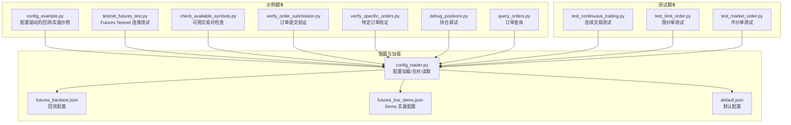
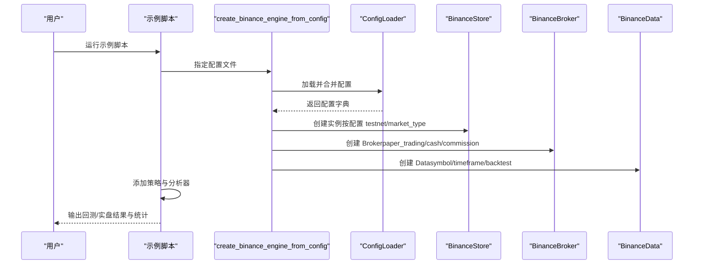
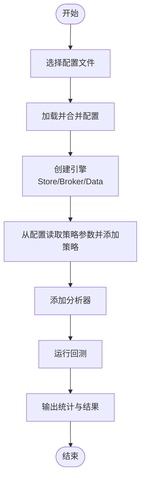
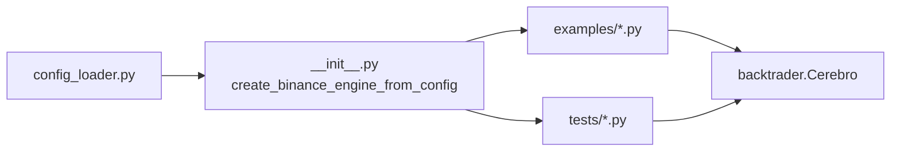

# 示例脚本集

<cite>
**本文引用的文件**
- [real_trade/binance/examples/config_example.py](file://real_trade/binance/examples/config_example.py)
- [real_trade/binance/examples/testnet_futures_test.py](file://real_trade/binance/examples/testnet_futures_test.py)
- [real_trade/binance/examples/check_available_symbols.py](file://real_trade/binance/examples/check_available_symbols.py)
- [real_trade/binance/examples/verify_order_submission.py](file://real_trade/binance/examples/verify_order_submission.py)
- [real_trade/binance/examples/verify_specific_orders.py](file://real_trade/binance/examples/verify_specific_orders.py)
- [real_trade/binance/examples/debug_positions.py](file://real_trade/binance/examples/debug_positions.py)
- [real_trade/binance/examples/query_orders.py](file://real_trade/binance/examples/query_orders.py)
- [real_trade/binance/tests/test_continuous_trading.py](file://real_trade/binance/tests/test_continuous_trading.py)
- [real_trade/binance/tests/test_limit_order.py](file://real_trade/binance/tests/test_limit_order.py)
- [real_trade/binance/tests/test_market_order.py](file://real_trade/binance/tests/test_market_order.py)
- [real_trade/binance/config/futures_backtest.json](file://real_trade/binance/config/futures_backtest.json)
- [real_trade/binance/config/futures_live_demo.json](file://real_trade/binance/config/futures_live_demo.json)
- [real_trade/binance/config/default.json](file://real_trade/binance/config/default.json)
- [real_trade/binance/config_loader.py](file://real_trade/binance/config_loader.py)
- [real_trade/binance/__init__.py](file://real_trade/binance/__init__.py)
</cite>

## 目录
1. [简介](#简介)
2. [项目结构](#项目结构)
3. [核心组件](#核心组件)
4. [架构总览](#架构总览)
5. [详细组件分析](#详细组件分析)
6. [依赖关系分析](#依赖关系分析)
7. [性能考虑](#性能考虑)
8. [故障排除指南](#故障排除指南)
9. [结论](#结论)
10. [附录](#附录)

## 简介
本文件系统化梳理 Binance 示例脚本集，覆盖配置文件使用、API 连接测试、交易功能测试（市价单、限价单、止损单）、连续交易测试与统计分析，并提供运行方法、参数配置与预期结果说明，以及调试与故障排除技巧。目标读者既包括初学者也包括有一定经验的开发者，力求以循序渐进的方式掌握示例脚本的使用与扩展。

## 项目结构
示例脚本位于 real_trade/binance 目录下，按用途分为 examples（示例脚本）、tests（测试脚本）、config（配置文件）、tools/utils/store/broker/datafeed 等模块。examples 与 tests 均围绕 Binance Futures/Spot 的 Demo/Live/Testnet 场景展开，config_loader 提供统一的配置加载与合并能力。

图表来源
- [real_trade/binance/examples/config_example.py](file://real_trade/binance/examples/config_example.py#L1-L363)
- [real_trade/binance/examples/testnet_futures_test.py](file://real_trade/binance/examples/testnet_futures_test.py#L1-L156)
- [real_trade/binance/config_loader.py](file://real_trade/binance/config_loader.py#L1-L221)
- [real_trade/binance/config/futures_backtest.json](file://real_trade/binance/config/futures_backtest.json#L1-L37)
- [real_trade/binance/config/futures_live_demo.json](file://real_trade/binance/config/futures_live_demo.json#L1-L37)
- [real_trade/binance/config/default.json](file://real_trade/binance/config/default.json#L1-L33)

章节来源
- [real_trade/binance/examples/config_example.py](file://real_trade/binance/examples/config_example.py#L1-L363)
- [real_trade/binance/config_loader.py](file://real_trade/binance/config_loader.py#L1-L221)

## 核心组件
- 配置加载器：负责从 JSON 文件加载配置、合并默认值、提供便捷读取接口。
- 引擎工厂：根据配置或直接参数创建 Store/Broker/Data，支持回测/实盘/Paper Trading/Testnet 等多种模式。
- 示例与测试脚本：围绕连接测试、订单验证、交易流程、统计分析等场景组织。

章节来源
- [real_trade/binance/config_loader.py](file://real_trade/binance/config_loader.py#L1-L221)
- [real_trade/binance/__init__.py](file://real_trade/binance/__init__.py#L56-L220)

## 架构总览
示例脚本通过统一的配置加载与引擎工厂，将用户意图（回测/实盘/Paper Trading/Testnet）转换为具体的 Store/Broker/Data 组合，并在 Backtrader Cerebro 中运行策略与分析器。

图表来源
- [real_trade/binance/__init__.py](file://real_trade/binance/__init__.py#L133-L220)
- [real_trade/binance/config_loader.py](file://real_trade/binance/config_loader.py#L60-L99)

## 详细组件分析

### 基础示例：config_example.py（配置驱动的回测/实盘）
- 目标：演示如何通过 JSON 配置文件创建 Binance 交易引擎，支持回测、Demo 实盘与生产实盘三种模式。
- 关键流程：
  - 选择配置文件（回测/实盘/Demo）。
  - 通过工厂函数创建 Store/Broker/Data。
  - 从配置读取策略参数并添加策略。
  - 添加多个分析器（夏普比率、最大回撤、收益、交易分析）。
  - 运行回测并输出统计结果。
- 参数与配置要点：
  - data.backtest 控制是否使用历史数据回测。
  - trading.paper_trading 控制是否模拟交易。
  - api.testnet 控制是否使用 Testnet。
  - strategy.* 控制策略参数。
- 运行方法：
  - 修改主函数中的配置文件名即可切换模式。
  - 在回测模式下无需 API 密钥；实盘/Demo 需要相应密钥。
- 预期结果：
  - 输出初始/最终账户价值、总盈亏、胜率、夏普比率、最大回撤等。

图表来源
- [real_trade/binance/examples/config_example.py](file://real_trade/binance/examples/config_example.py#L239-L363)
- [real_trade/binance/__init__.py](file://real_trade/binance/__init__.py#L133-L220)
- [real_trade/binance/config_loader.py](file://real_trade/binance/config_loader.py#L60-L99)

章节来源
- [real_trade/binance/examples/config_example.py](file://real_trade/binance/examples/config_example.py#L1-L363)
- [real_trade/binance/config/futures_backtest.json](file://real_trade/binance/config/futures_backtest.json#L1-L37)
- [real_trade/binance/config/futures_live_demo.json](file://real_trade/binance/config/futures_live_demo.json#L1-L37)

### API 连接测试：testnet_futures_test.py
- 目标：验证 Futures Testnet 连接，检查账户余额、市场数据、持仓信息、历史 K 线。
- 测试内容：
  - 创建 BinanceStore（Futures，Testnet）。
  - 获取 USDT 余额。
  - 获取 BTC/USDT 最新价格（含安全处理缺失字段）。
  - 获取所有持仓并过滤活跃持仓。
  - 获取最近 K 线数据。
- 验证方法：
  - 成功获取即表示连接正常；失败需检查密钥、网络与 Testnet 服务状态。
- 运行方法：将示例中的示例密钥替换为自己的 Testnet 密钥后运行。
- 预期结果：各项测试输出“✓”即为成功。

章节来源
- [real_trade/binance/examples/testnet_futures_test.py](file://real_trade/binance/examples/testnet_futures_test.py#L1-L156)

### 可用交易对检查：check_available_symbols.py
- 目标：诊断“ETH/USDT 订单显示成功但官网看不到记录”的问题。
- 检查内容：
  - 加载市场信息并筛选 ETH 永续合约。
  - 校验常用 USDT 结算合约可用性与最小订单金额。
  - 测试获取 ETH 行情。
  - 获取最近订单历史。
  - 提供诊断建议（符号格式、最小订单金额、CCXT 缓存问题等）。
- 运行方法：替换示例密钥后运行，观察输出的建议与提示。

章节来源
- [real_trade/binance/examples/check_available_symbols.py](file://real_trade/binance/examples/check_available_symbols.py#L1-L162)

### 订单提交验证：verify_order_submission.py
- 目标：验证订单是否真正提交到 Demo Trading，而非仅本地缓存。
- 验证步骤：
  - 连接 Demo Trading。
  - 提交前/提交后分别查询订单历史，对比数量变化。
  - 通过订单 ID 查询订单详情。
  - 获取持仓确认是否建立。
  - 平仓验证闭环。
- 诊断结论：
  - 若 fetch_order 能返回且订单历史增加，则订单真实提交。
  - 否则可能是 CCXT 本地缓存或 API 配置问题。

章节来源
- [real_trade/binance/examples/verify_order_submission.py](file://real_trade/binance/examples/verify_order_submission.py#L1-L216)

### 特定订单验证：verify_specific_orders.py
- 目标：逐个查询订单 ID，区分“真实存在”与“本地缓存”。
- 验证方法：
  - 使用 fetch_order 验证单个订单。
  - 使用 fetch_orders 获取列表，比对订单 ID 是否在列表中。
- 诊断建议：
  - 若 fetch_order 失败而 fetch_orders 包含，则说明订单未真正提交。

章节来源
- [real_trade/binance/examples/verify_specific_orders.py](file://real_trade/binance/examples/verify_specific_orders.py#L1-L158)

### 持仓调试：debug_positions.py
- 目标：诊断“能看到订单历史但看不到持仓”的问题。
- 调试步骤：
  - 获取账户余额。
  - 获取最近订单历史。
  - 通过 fetch_positions 获取持仓（含活跃过滤）。
  - 通过余额与未成交订单辅助判断。
  - 获取持仓模式（单向/双向）。
- 诊断建议：
  - 检查订单状态是否已成交；限价单可能未成交；Demo Trading 可能有延迟。

章节来源
- [real_trade/binance/examples/debug_positions.py](file://real_trade/binance/examples/debug_positions.py#L1-L190)

### 订单查询：query_orders.py
- 目标：帮助用户在官网查找特定订单。
- 查询方法：
  - 获取所有 ETH 订单历史（提高 limit）。
  - 输出最近订单列表及在官网搜索指引。
  - 显示当前活跃持仓。
- 使用建议：
  - 在 Demo Trading Futures 的 Orders → Order History 页面按交易对、时间范围、状态筛选。

章节来源
- [real_trade/binance/examples/query_orders.py](file://real_trade/binance/examples/query_orders.py#L1-L125)

### 交易测试：市价单测试
- 目标：验证市价单买入/卖出流程与持仓变化。
- 流程：
  - 获取当前价格与初始余额。
  - 市价买入指定数量 ETH。
  - 查询持仓确认建立。
  - 市价卖出平仓。
  - 查询平仓后持仓应为 0。
  - 对比初始/最终余额，估算手续费。
- 预期结果：买入/卖出均成功，持仓建立/平仓成功，余额变化符合预期。

章节来源
- [real_trade/binance/tests/test_market_order.py](file://real_trade/binance/tests/test_market_order.py#L1-L153)

### 交易测试：限价单测试
- 目标：验证限价单快速成交能力与订单状态跟踪。
- 流程：
  - 获取行情（最新价、买一/卖一）。
  - 设置略高于卖一价的限价买入，确保快速成交。
  - 等待订单状态变为已成交，查询持仓。
  - 设置略低于买一价的限价卖出，确保快速成交。
  - 查询平仓后持仓应为 0。
- 预期结果：限价单能按预期成交，持仓建立/平仓成功。

章节来源
- [real_trade/binance/tests/test_limit_order.py](file://real_trade/binance/tests/test_limit_order.py#L1-L201)

### 交易测试：连续交易测试
- 目标：多轮小仓位买卖，评估系统稳定性与成功率。
- 流程：
  - 循环 N 轮，每轮买入再卖出固定数量 ETH。
  - 每次交易间隔等待，查询持仓确认平仓。
  - 统计总交易次数、成功/失败次数、成功率。
  - 计算每轮盈亏与总盈亏。
- 统计分析：
  - 成功率、每轮平均盈亏、总盈亏。
- 预期结果：系统稳定，成功率较高，总盈亏受滑点与手续费影响。

章节来源
- [real_trade/binance/tests/test_continuous_trading.py](file://real_trade/binance/tests/test_continuous_trading.py#L1-L192)

## 依赖关系分析
- 配置加载依赖：
  - ConfigLoader 负责加载 JSON、合并默认值、提供 get(path, default)。
  - create_binance_engine_from_config 读取配置并创建引擎。
- 示例/测试脚本依赖：
  - 所有脚本通过 sys.path.insert 引入 real_trade.binance 接口。
  - 示例脚本侧重业务流程演示，测试脚本侧重功能与边界验证。
- 外部依赖：
  - Binance API（Futures/Spot）、CCXT、Backtrader。

图表来源
- [real_trade/binance/config_loader.py](file://real_trade/binance/config_loader.py#L1-L221)
- [real_trade/binance/__init__.py](file://real_trade/binance/__init__.py#L133-L220)

章节来源
- [real_trade/binance/config_loader.py](file://real_trade/binance/config_loader.py#L1-L221)
- [real_trade/binance/__init__.py](file://real_trade/binance/__init__.py#L1-L247)

## 性能考虑
- 回测模式优先：在配置中启用 data.backtest 可显著提升速度，避免网络请求。
- 适当的历史数据限制：合理设置 historical_limit，平衡精度与性能。
- 分析器开销：添加过多分析器会增加计算负担，建议按需启用。
- 网络与代理：若访问受限，可在配置中设置 proxy.auto_detect 与 proxy.proxy_url。

## 故障排除指南
- 连接失败：
  - 检查 API 密钥与权限；确认 testnet 与 market_type 设置正确。
  - 网络问题：部分区域需使用代理或 VPN。
- 订单未生效：
  - 使用 verify_order_submission.py 与 verify_specific_orders.py 核对 fetch_order 与 fetch_orders 的一致性。
  - 确认交易对格式（Futures 常用 BTC/USDT:USDT）与最小订单金额。
- 持仓缺失：
  - 使用 debug_positions.py 检查订单状态、未成交订单、余额与持仓模式。
- Demo Trading 延迟：
  - 等待片刻后重试，或切换至官网页面手动刷新。

章节来源
- [real_trade/binance/examples/testnet_futures_test.py](file://real_trade/binance/examples/testnet_futures_test.py#L142-L151)
- [real_trade/binance/examples/verify_order_submission.py](file://real_trade/binance/examples/verify_order_submission.py#L187-L206)
- [real_trade/binance/examples/verify_specific_orders.py](file://real_trade/binance/examples/verify_specific_orders.py#L137-L148)
- [real_trade/binance/examples/debug_positions.py](file://real_trade/binance/examples/debug_positions.py#L174-L180)

## 结论
示例脚本集提供了从配置加载、连接测试、订单验证到交易测试与统计分析的完整链路。通过回测与 Demo 实盘结合，既能快速验证策略逻辑，又能逐步过渡到真实市场。建议按顺序运行：先用 config_example.py 熟悉配置与引擎创建，再用 testnet_futures_test.py 验证连接，随后用各类订单测试脚本验证交易流程，最后用连续交易测试评估系统稳定性。

## 附录

### 配置文件说明与切换
- futures_backtest.json：回测模式，不连接交易所，适合快速策略验证。
- futures_live_demo.json：Demo 实盘模式，真实订单流程，适合验证端到端流程。
- default.json：默认配置模板，可据此创建自定义配置。

章节来源
- [real_trade/binance/config/futures_backtest.json](file://real_trade/binance/config/futures_backtest.json#L1-L37)
- [real_trade/binance/config/futures_live_demo.json](file://real_trade/binance/config/futures_live_demo.json#L1-L37)
- [real_trade/binance/config/default.json](file://real_trade/binance/config/default.json#L1-L33)

### 运行方法与参数建议
- 替换示例脚本中的 API 密钥为有效密钥（Testnet/Futures Demo）。
- 在 config_example.py 中修改配置文件名以切换模式。
- 对于订单测试，建议使用较小交易量（如 0.05 ETH）以降低风险。
- 连续交易测试可根据网络状况调整等待时间与交易轮数。