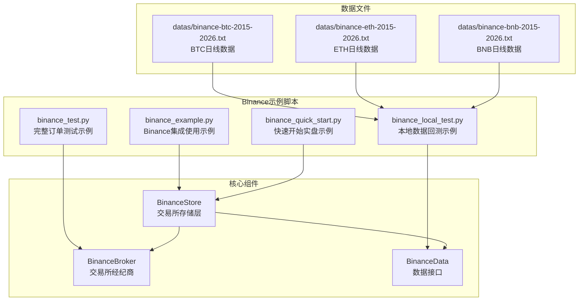
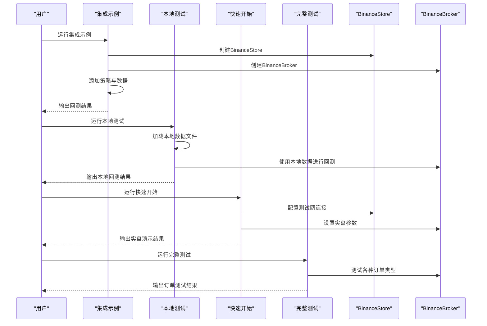
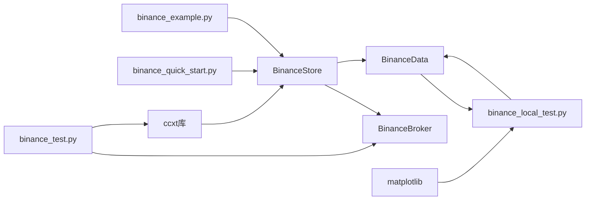

# 示例脚本集

<cite>
**本文引用的文件**
- [examples/binance_example.py](file://examples/binance_example.py)
- [samples/binance-test/binance_local_test.py](file://samples/binance-test/binance_local_test.py)
- [samples/binance-test/binance_quick_start.py](file://samples/binance-test/binance_quick_start.py)
- [samples/binance-test/binance_test.py](file://samples/binance-test/binance_test.py)
- [backtrader/stores/binance.py](file://backtrader/stores/binance.py)
- [backtrader/brokers/binance.py](file://backtrader/brokers/binance.py)
- [backtrader/feeds/binance.py](file://backtrader/feeds/binance.py)
- [datas/binance-btc-2015-2026.txt](file://datas/binance-btc-2015-2026.txt)
</cite>

## 更新摘要
**所做更改**
- 更新示例文件位置：从 `real_trade/examples/` 迁移至 `samples/binance-test/` 目录
- 新增本地测试示例：支持使用本地数据文件进行回测，避免网络连接问题
- 新增快速开始示例：提供最简化的Binance实盘交易示例
- 新增完整测试示例：涵盖所有订单类型的综合测试
- 新增Binance集成示例：展示基本的Binance组件使用方法
- 新增数据文件支持：提供本地BTC数据文件用于离线回测

## 目录
1. [简介](#简介)
2. [项目结构](#项目结构)
3. [核心组件](#核心组件)
4. [架构总览](#架构总览)
5. [详细组件分析](#详细组件分析)
6. [依赖关系分析](#依赖关系分析)
7. [性能考虑](#性能考虑)
8. [故障排除指南](#故障排除指南)
9. [结论](#结论)
10. [附录](#附录)

## 简介
本文件系统化梳理 Backtrader Binance 示例脚本集，覆盖基础集成示例、本地数据回测、快速开始实盘、完整订单测试与最佳实践。文档展示了从简单集成到复杂实盘交易的完整流程，包括配置使用、API连接测试、交易功能测试（市价单、限价单、止损单、止损限价单、止损追踪单等）、连续交易测试与统计分析，并提供运行方法、参数配置与预期结果说明，以及调试与故障排除技巧。

**更新** 本版本重点介绍了新增的本地测试、快速开始和完整测试示例，以及示例文件从 `real_trade/examples/` 到 `samples/binance-test/` 的迁移。新增了本地数据回测功能，支持使用本地BTC数据文件进行离线回测，避免网络连接问题。

## 项目结构
示例脚本位于 `samples/binance-test/` 目录下，按用途分为基础示例、本地测试、快速开始和完整测试模块。每个模块都展示了不同的使用场景和功能特性。

**图表来源**
- [examples/binance_example.py](file://examples/binance_example.py#L1-L161)
- [samples/binance-test/binance_local_test.py](file://samples/binance-test/binance_local_test.py#L1-L224)
- [samples/binance-test/binance_quick_start.py](file://samples/binance-test/binance_quick_start.py#L1-L207)
- [samples/binance-test/binance_test.py](file://samples/binance-test/binance_test.py#L1-L615)
- [backtrader/stores/binance.py](file://backtrader/stores/binance.py#L1-L276)
- [backtrader/brokers/binance.py](file://backtrader/brokers/binance.py#L1-L382)

**章节来源**
- [examples/binance_example.py](file://examples/binance_example.py#L1-L161)
- [samples/binance-test/binance_local_test.py](file://samples/binance-test/binance_local_test.py#L1-L224)
- [samples/binance-test/binance_quick_start.py](file://samples/binance-test/binance_quick_start.py#L1-L207)
- [samples/binance-test/binance_test.py](file://samples/binance-test/binance_test.py#L1-L615)

## 核心组件
- **BinanceStore**：交易所存储层，负责与Binance API的连接管理、账户信息获取、订单提交等核心功能
- **BinanceBroker**：交易所经纪商，负责订单执行、资金管理、持仓管理等交易相关功能
- **BinanceData**：数据接口，负责从Binance获取市场数据，支持实时和历史数据
- **本地数据支持**：支持使用本地CSV数据文件进行离线回测，避免网络连接问题

**章节来源**
- [backtrader/stores/binance.py](file://backtrader/stores/binance.py#L32-L200)
- [backtrader/brokers/binance.py](file://backtrader/brokers/binance.py#L30-L200)
- [backtrader/feeds/binance.py](file://backtrader/feeds/binance.py#L1-L200)

## 架构总览
Binance示例脚本集展示了从基础集成到完整实盘交易的完整架构，包括数据获取、策略执行、订单管理和资金结算等各个环节。

**图表来源**
- [examples/binance_example.py](file://examples/binance_example.py#L91-L161)
- [samples/binance-test/binance_local_test.py](file://samples/binance-test/binance_local_test.py#L117-L224)
- [samples/binance-test/binance_quick_start.py](file://samples/binance-test/binance_quick_start.py#L115-L207)
- [samples/binance-test/binance_test.py](file://samples/binance-test/binance_test.py#L293-L615)

## 详细组件分析

### Binance集成示例：binance_example.py（基础集成演示）
- **目标**：演示如何使用Backtrader的Binance集成组件进行基本的回测和实盘交易
- **核心功能**：
  - 创建BinanceStore实例，配置API密钥和测试网参数
  - 使用BinanceData获取历史数据进行回测
  - 添加SimpleMovingAverageStrategy策略
  - 设置初始资金和交易佣金
  - 运行回测并输出结果
- **关键特性**：
  - 支持测试网配置，便于开发和测试
  - 集成了完整的回测流程
  - 展示了基本的策略参数设置

**章节来源**
- [examples/binance_example.py](file://examples/binance_example.py#L1-L161)

### 本地数据回测：binance_local_test.py（离线回测）
- **目标**：演示如何使用本地数据文件进行Binance数据的回测，避免网络连接问题
- **核心功能**：
  - 自动查找本地BTC数据文件（支持多种时间框架）
  - 使用GenericCSVData加载本地数据
  - 支持SMA交叉策略的回测
  - 提供详细的回测结果和图表生成
- **关键特性**：
  - 支持多种数据文件格式（日线、小时线、4小时线、30分钟线）
  - 自动检测数据文件并加载
  - 包含完整的回测流程和结果分析
  - 支持可选的图表生成

**章节来源**
- [samples/binance-test/binance_local_test.py](file://samples/binance-test/binance_local_test.py#L1-L224)

### 快速开始实盘：binance_quick_start.py（最简实盘示例）
- **目标**：提供最简化的Binance实盘交易示例，展示基本的实盘交易功能
- **核心功能**：
  - 配置BinanceStore（测试网）
  - 添加BTC/USDT数据
  - 设置初始资金和交易佣金
  - 运行回测演示
  - 提供实盘交易使用指南
- **关键特性**：
  - 最简化的实盘配置
  - 包含详细的使用说明和注意事项
  - 支持测试网验证策略
  - 提供实盘交易的最佳实践建议

**章节来源**
- [samples/binance-test/binance_quick_start.py](file://samples/binance-test/binance_quick_start.py#L1-L207)

### 完整订单测试：binance_test.py（综合订单测试）
- **目标**：提供完整的Binance订单类型测试，涵盖所有支持的订单类型
- **核心功能**：
  - 支持多种订单类型：市价单、限价单、止损单、止损限价单、止损追踪单等
  - 提供详细的订单状态通知和交易报告
  - 支持OCO（One-Cancels-Other）和Bracket订单
  - 包含完整的参数配置和命令行选项
- **关键特性**：
  - 全面的订单类型覆盖
  - 详细的日志输出和状态跟踪
  - 支持复杂的订单组合策略
  - 提供丰富的命令行参数配置

**章节来源**
- [samples/binance-test/binance_test.py](file://samples/binance-test/binance_test.py#L1-L615)

### BinanceStore组件详解
- **目标**：Binance交易所存储层的核心实现
- **核心功能**：
  - 单例模式管理，确保全局唯一实例
  - CCXT集成，提供与Binance API的连接
  - 账户余额获取、订单提交、市场数据获取
  - 连接管理和错误处理
- **关键特性**：
  - 支持测试网和正式网切换
  - 线程安全的连接管理
  - 完善的错误处理和重连机制
  - 支持多种市场类型（现货、期货、交割）

**章节来源**
- [backtrader/stores/binance.py](file://backtrader/stores/binance.py#L32-L200)

### BinanceBroker组件详解
- **目标**：Binance交易所经纪商的核心实现
- **核心功能**：
  - 订单提交和执行管理
  - 资金和持仓管理
  - 订单状态跟踪和通知
  - 交易费用计算和滑点处理
- **关键特性**：
  - 支持多种订单类型
  - 模拟交易和实盘交易模式
  - 完善的订单生命周期管理
  - 与Backtrader内部API的无缝集成

**章节来源**
- [backtrader/brokers/binance.py](file://backtrader/brokers/binance.py#L30-L200)

### 本地数据文件支持
- **目标**：提供本地数据文件支持，便于离线回测和开发测试
- **支持的数据文件**：
  - BTC日线数据：datas/binance-btc-2015-2026.txt
  - ETH日线数据：datas/binance-eth-2015-2026.txt
  - BNB日线数据：datas/binance-bnb-2015-2026.txt
- **关键特性**：
  - 多种时间框架支持
  - 自动数据文件检测和加载
  - 完整的历史数据回测
  - 便于开发和测试环境使用

**章节来源**
- [datas/binance-btc-2015-2026.txt](file://datas/binance-btc-2015-2026.txt#L1-L200)

## 依赖关系分析
- **组件依赖**：
  - 所有示例脚本都依赖于Backtrader的核心组件
  - BinanceStore和BinanceBroker提供底层的交易所集成
  - 本地数据回测依赖于本地数据文件
  - 完整测试示例依赖于丰富的命令行参数配置
- **外部依赖**：
  - CCXT库用于与Binance API的通信
  - Matplotlib用于图表生成（可选）
  - Backtrader框架提供核心回测和交易功能

**图表来源**
- [examples/binance_example.py](file://examples/binance_example.py#L10-L161)
- [samples/binance-test/binance_local_test.py](file://samples/binance-test/binance_local_test.py#L13-L224)
- [samples/binance-test/binance_quick_start.py](file://samples/binance-test/binance_quick_start.py#L10-L207)
- [samples/binance-test/binance_test.py](file://samples/binance-test/binance_test.py#L27-L615)

**章节来源**
- [examples/binance_example.py](file://examples/binance_example.py#L1-L161)
- [samples/binance-test/binance_local_test.py](file://samples/binance-test/binance_local_test.py#L1-L224)
- [samples/binance-test/binance_quick_start.py](file://samples/binance-test/binance_quick_start.py#L1-L207)
- [samples/binance-test/binance_test.py](file://samples/binance-test/binance_test.py#L1-L615)

## 性能考虑
- **本地数据回测**：使用本地数据文件进行回测，避免网络延迟和连接问题
- **数据文件优化**：选择合适的时间框架和数据文件大小，平衡精度和性能
- **图表生成**：Matplotlib图表生成可能消耗较多资源，建议在需要时才启用
- **连接管理**：BinanceStore采用单例模式，减少重复连接的开销
- **订单执行**：BinanceBroker支持批量订单处理，提高执行效率

## 故障排除指南
- **连接失败**：
  - 检查API密钥和密钥权限
  - 确认测试网配置正确
  - 验证网络连接和防火墙设置
- **数据加载失败**：
  - 确认本地数据文件存在且格式正确
  - 检查数据文件路径和权限
  - 验证CSV文件格式和数据完整性
- **订单执行问题**：
  - 检查资金余额是否充足
  - 验证订单参数和交易对格式
  - 查看订单状态通知和错误日志
- **图表生成失败**：
  - 安装matplotlib库：pip install matplotlib
  - 检查图形渲染环境配置
  - 尝试禁用图表生成功能

**章节来源**
- [samples/binance-test/binance_local_test.py](file://samples/binance-test/binance_local_test.py#L212-L218)
- [samples/binance-test/binance_quick_start.py](file://samples/binance-test/binance_quick_start.py#L197-L201)

## 结论
Backtrader Binance示例脚本集提供了从基础集成到完整实盘交易的完整解决方案。通过四个不同层次的示例脚本，用户可以从简单的集成演示开始，逐步掌握本地数据回测、快速实盘配置和完整订单测试等高级功能。新增的本地数据支持使得开发和测试更加便捷，而丰富的订单类型测试则为实盘交易提供了全面的验证基础。建议按照示例脚本的顺序逐步学习：先运行binance_example.py了解基本集成，再使用binance_local_test.py进行本地回测验证，然后通过binance_quick_start.py配置实盘环境，最后使用binance_test.py进行全面的订单测试。

## 附录

### 示例脚本运行指南
- **集成示例**：python examples/binance_example.py
- **本地测试**：python samples/binance-test/binance_local_test.py
- **快速开始**：python samples/binance-test/binance_quick_start.py
- **完整测试**：python samples/binance-test/binance_test.py --apikey YOUR_API_KEY --secret YOUR_SECRET

### 本地数据文件使用方法
- 支持的数据文件格式：CSV（日期,开盘,最高,最低,收盘,成交量,持仓量）
- 自动检测的数据文件：binance-btc-2015-2026.txt, binance-eth-2015-2026.txt, binance-bnb-2015-2026.txt
- 数据文件路径：datas/目录下的相应文件

### 订单类型支持
- 市价单（Market）
- 限价单（Limit）
- 止损单（Stop）
- 止损限价单（StopLimit）
- 止损追踪单（StopTrail）
- 止损追踪限价单（StopTrailLimit）
- OCO订单（One-Cancels-Other）
- Bracket订单（三重订单）

### 实盘交易最佳实践
- 建议先在测试网验证策略
- 仔细设置资金和风险控制参数
- 监控订单执行状态和交易费用
- 定期检查账户余额和持仓情况
- 使用图表工具分析策略表现

**章节来源**
- [examples/binance_example.py](file://examples/binance_example.py#L1-L161)
- [samples/binance-test/binance_local_test.py](file://samples/binance-test/binance_local_test.py#L1-L224)
- [samples/binance-test/binance_quick_start.py](file://samples/binance-test/binance_quick_start.py#L1-L207)
- [samples/binance-test/binance_test.py](file://samples/binance-test/binance_test.py#L1-L615)