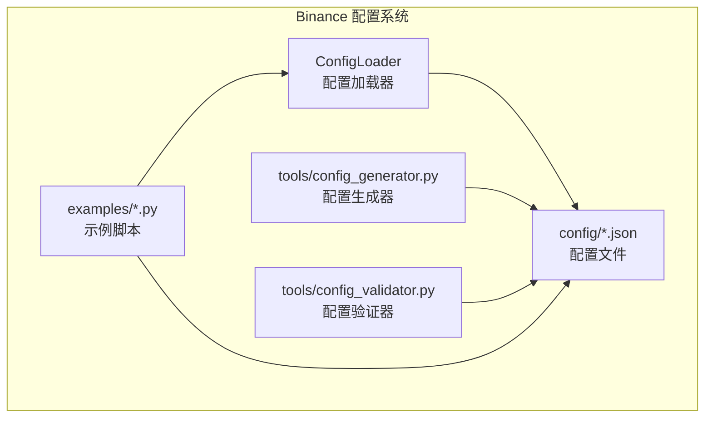
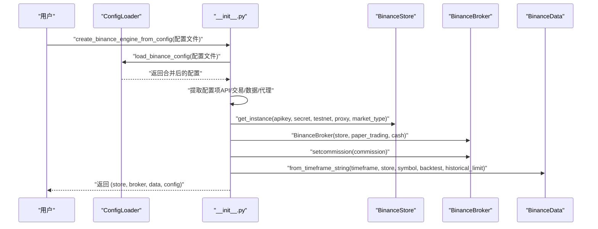
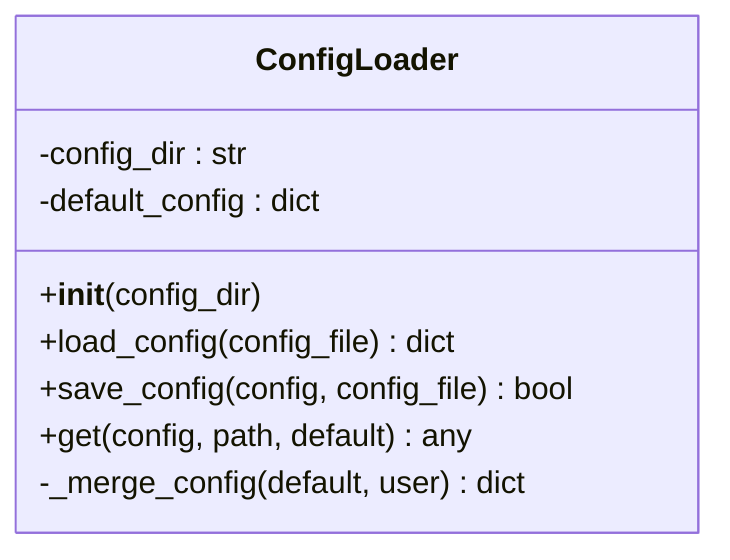
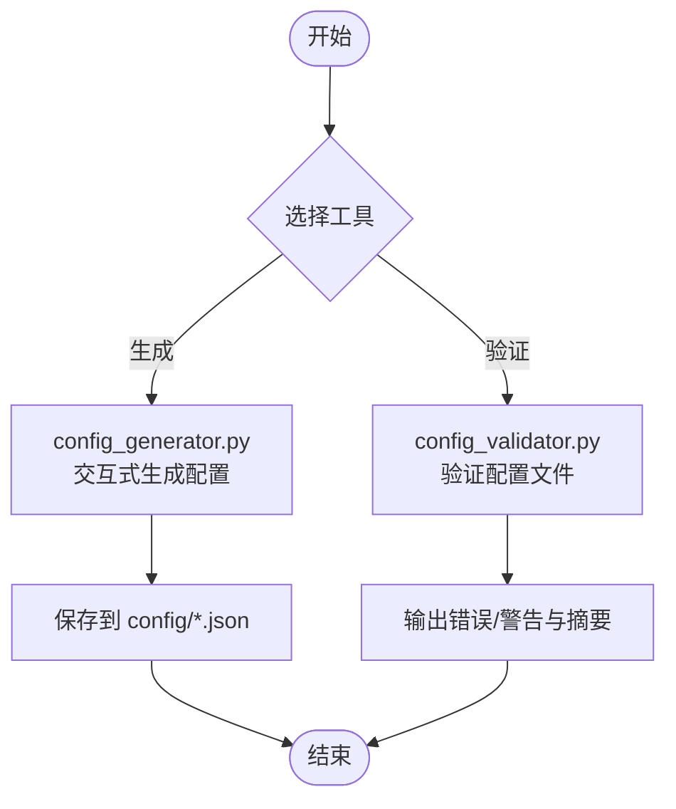
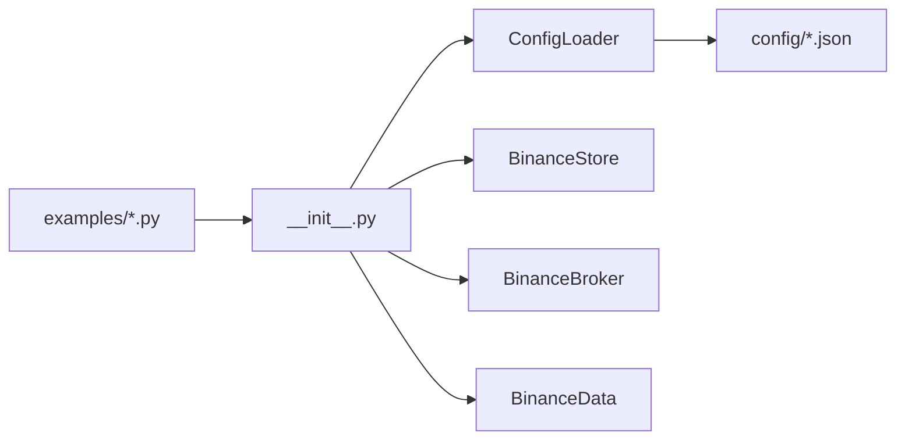

# 配置管理系统

<cite>
**本文引用的文件**
- [real_trade/binance/config_loader.py](file://real_trade/binance/config_loader.py)
- [real_trade/binance/__init__.py](file://real_trade/binance/__init__.py)
- [real_trade/binance/config/default.json](file://real_trade/binance/config/default.json)
- [real_trade/binance/config/futures_backtest.json](file://real_trade/binance/config/futures_backtest.json)
- [real_trade/binance/config/futures_live_demo.json](file://real_trade/binance/config/futures_live_demo.json)
- [real_trade/binance/config/futures_testnet.json.template](file://real_trade/binance/config/futures_testnet.json.template)
- [real_trade/binance/config/spot_testnet.json.template](file://real_trade/binance/config/spot_testnet.json.template)
- [real_trade/binance/config/README.md](file://real_trade/binance/config/README.md)
- [real_trade/binance/README.md](file://real_trade/binance/README.md)
- [real_trade/binance/tools/config_generator.py](file://real_trade/binance/tools/config_generator.py)
- [real_trade/binance/tools/config_validator.py](file://real_trade/binance/tools/config_validator.py)
- [real_trade/binance/examples/config_example.py](file://real_trade/binance/examples/config_example.py)
- [real_trade/binance/examples/testnet_futures_test.py](file://real_trade/binance/examples/testnet_futures_test.py)
- [real_trade/binance/examples/check_available_symbols.py](file://real_trade/binance/examples/check_available_symbols.py)
</cite>

## 目录
1. [简介](#简介)
2. [项目结构](#项目结构)
3. [核心组件](#核心组件)
4. [架构总览](#架构总览)
5. [详细组件分析](#详细组件分析)
6. [依赖关系分析](#依赖关系分析)
7. [性能考虑](#性能考虑)
8. [故障排查指南](#故障排查指南)
9. [结论](#结论)
10. [附录](#附录)

## 简介
本文件面向 Binance 配置管理系统的使用者与维护者，系统化阐述配置文件结构、加载机制与工具链的使用方法。重点解析 ConfigLoader 类的实现原理，包括配置文件解析、参数验证、默认值处理与路径访问等核心能力，并结合多种配置模板（如 futures_backtest.json、futures_live_demo.json 等）说明不同运行场景的差异与适用条件。同时提供配置生成器与验证器工具的使用指南、最佳实践建议以及环境变量覆盖与配置优先级规则的说明。

## 项目结构
Binance 配置管理位于 real_trade/binance 目录，主要由以下子模块组成：
- 配置加载器：负责加载、合并与访问配置
- 配置文件：提供默认与场景模板
- 工具链：配置生成器与验证器
- 示例脚本：展示配置驱动的交易流程与测试

图表来源
- [real_trade/binance/config_loader.py](file://real_trade/binance/config_loader.py#L14-L221)
- [real_trade/binance/tools/config_generator.py](file://real_trade/binance/tools/config_generator.py#L1-L164)
- [real_trade/binance/tools/config_validator.py](file://real_trade/binance/tools/config_validator.py#L1-L190)
- [real_trade/binance/examples/config_example.py](file://real_trade/binance/examples/config_example.py#L1-L363)

章节来源
- [real_trade/binance/README.md](file://real_trade/binance/README.md#L1-L259)
- [real_trade/binance/config/README.md](file://real_trade/binance/config/README.md#L1-L157)

## 核心组件
本节聚焦 ConfigLoader 类及其便捷函数，说明其职责、默认配置、加载与合并策略、路径访问与保存能力。

- 职责
  - 从 JSON 文件加载配置，支持默认值与用户配置的递归合并
  - 提供路径访问能力，按“域.键”形式读取嵌套配置
  - 提供便捷函数以简化常用调用

- 默认配置
  - 包含 api、trading、data、strategy、proxy 等分组，覆盖 API 密钥、测试网、市场类型、模拟交易、初始资金、手续费、交易对、时间周期、回测开关、历史数据条数、日志开关、代理等关键参数

- 加载与合并
  - 若配置文件不存在或 JSON 解析失败，返回默认配置副本
  - 采用递归合并策略：同名字典键进行深度合并，其他键直接覆盖

- 路径访问
  - 支持“a.b.c”形式的路径读取，缺失路径返回默认值

- 保存能力
  - 将配置写回 JSON 文件，确保目标目录存在

章节来源
- [real_trade/binance/config_loader.py](file://real_trade/binance/config_loader.py#L14-L221)

## 架构总览
下图展示了从配置文件到交易引擎的构建流程，以及工具链在配置生命周期中的位置。

图表来源
- [real_trade/binance/__init__.py](file://real_trade/binance/__init__.py#L133-L219)
- [real_trade/binance/config_loader.py](file://real_trade/binance/config_loader.py#L60-L124)

## 详细组件分析

### ConfigLoader 类详解
- 初始化与默认配置
  - 默认配置包含 api、trading、data、strategy、proxy 分组，覆盖常见运行参数
- 加载配置
  - 支持绝对路径与相对路径（相对于配置目录）
  - 文件不存在或 JSON 解析异常时回退默认配置
- 合并策略
  - 递归合并默认配置与用户配置，用户配置优先
- 路径访问
  - “a.b.c”形式路径读取，缺失返回默认值
- 保存配置
  - 自动创建目录并写入 JSON 文件

图表来源
- [real_trade/binance/config_loader.py](file://real_trade/binance/config_loader.py#L14-L221)

章节来源
- [real_trade/binance/config_loader.py](file://real_trade/binance/config_loader.py#L14-L221)

### 配置文件模板与差异
- default.json
  - 默认配置模板，适用于大多数场景
- futures_backtest.json
  - 历史数据回测模板，适合策略开发与快速验证
- futures_live_demo.json
  - Demo Trading 实盘测试模板，适合上线前全流程验证
- futures_testnet.json.template / spot_testnet.json.template
  - 测试网模板，便于复制并填写真实密钥

章节来源
- [real_trade/binance/config/default.json](file://real_trade/binance/config/default.json#L1-L33)
- [real_trade/binance/config/futures_backtest.json](file://real_trade/binance/config/futures_backtest.json#L1-L37)
- [real_trade/binance/config/futures_live_demo.json](file://real_trade/binance/config/futures_live_demo.json#L1-L37)
- [real_trade/binance/config/futures_testnet.json.template](file://real_trade/binance/config/futures_testnet.json.template#L1-L34)
- [real_trade/binance/config/spot_testnet.json.template](file://real_trade/binance/config/spot_testnet.json.template#L1-L29)

### 配置参数说明与作用
- api 分组
  - apikey/secret：API 密钥与密钥，回测模式可留空
  - testnet：true 连接 Demo Trading，false 连接生产环境
  - market_type：spot（现货）、future（合约）
- trading 分组
  - paper_trading：true 本地模拟，false 真实下单
  - initial_cash：初始资金
  - commission：手续费率
- data 分组
  - symbol：交易对，如 BTC/USDT
  - timeframe：K线周期，如 1m/5m/15m/1h/4h/1d 等
  - backtest：true 使用历史数据，false 使用实时数据
  - historical_limit：加载的历史 K 线数量
- strategy 分组
  - 策略相关参数，如 RSI 周期、均线周期、交易规模比例、止损百分比、日志开关等
- proxy 分组
  - auto_detect：自动检测系统代理
  - proxy_url：手动指定代理地址

章节来源
- [real_trade/binance/config/README.md](file://real_trade/binance/config/README.md#L11-L43)
- [real_trade/binance/config/README.md](file://real_trade/binance/config/README.md#L45-L88)

### 配置生成器与验证器工具
- 配置生成器（config_generator.py）
  - 交互式生成配置文件，支持选择市场类型、API 密钥、测试网、模拟交易、初始资金、手续费、交易对、时间周期、回测模式、历史数据条数、代理设置与策略参数
  - 生成文件保存至 config 目录
- 配置验证器（config_validator.py）
  - 校验 JSON 格式、必需字段、数值范围与格式合理性
  - 输出错误与警告清单，并打印配置摘要

图表来源
- [real_trade/binance/tools/config_generator.py](file://real_trade/binance/tools/config_generator.py#L14-L164)
- [real_trade/binance/tools/config_validator.py](file://real_trade/binance/tools/config_validator.py#L14-L190)

章节来源
- [real_trade/binance/tools/config_generator.py](file://real_trade/binance/tools/config_generator.py#L1-L164)
- [real_trade/binance/tools/config_validator.py](file://real_trade/binance/tools/config_validator.py#L1-L190)

### 示例脚本与使用方法
- config_example.py
  - 展示从配置文件创建交易引擎、读取策略参数、添加分析器与运行回测的完整流程
- testnet_futures_test.py
  - 连接 Futures Testnet，验证账户余额、行情、持仓与历史 K 线获取
- check_available_symbols.py
  - 检查可用交易对、最小订单限制与行情获取，辅助定位订单可见性问题

章节来源
- [real_trade/binance/examples/config_example.py](file://real_trade/binance/examples/config_example.py#L1-L363)
- [real_trade/binance/examples/testnet_futures_test.py](file://real_trade/binance/examples/testnet_futures_test.py#L1-L156)
- [real_trade/binance/examples/check_available_symbols.py](file://real_trade/binance/examples/check_available_symbols.py#L1-L162)

## 依赖关系分析
- 模块导出
  - __init__.py 导出 ConfigLoader、load_binance_config、get_config_value 等接口
- 接口依赖
  - create_binance_engine_from_config 依赖 ConfigLoader 的加载与参数提取能力
  - 示例脚本通过便捷函数读取配置并驱动交易引擎

图表来源
- [real_trade/binance/__init__.py](file://real_trade/binance/__init__.py#L38-L53)
- [real_trade/binance/config_loader.py](file://real_trade/binance/config_loader.py#L14-L221)

章节来源
- [real_trade/binance/__init__.py](file://real_trade/binance/__init__.py#L38-L53)

## 性能考虑
- 回测模式优先：在策略开发阶段使用 backtest=true 与 paper_trading=true，避免网络与订单开销
- 合理的历史数据条数：historical_limit 过大会增加内存与 IO 压力，建议根据策略窗口与机器资源设定
- 代理与网络：若需代理，建议启用 auto_detect 并在稳定网络环境下运行，减少重试与超时
- 日志级别：printlog 在高频交易中可能带来 IO 压力，可在性能敏感场景关闭

## 故障排查指南
- 配置文件不存在或格式错误
  - 现象：加载失败，回退默认配置
  - 处理：使用配置验证器检查 JSON 语法与字段完整性
- API 密钥相关
  - 回测模式可留空 apikey/secret；非回测模式需正确填写
  - Demo Trading 与生产环境密钥独立，勿混淆
- 交易对与最小订单
  - 使用 check_available_symbols.py 检查交易对可用性与最小订单限制
- 代理问题
  - 若网络受限，确认代理设置；必要时关闭 auto_detect 并手动指定代理

章节来源
- [real_trade/binance/tools/config_validator.py](file://real_trade/binance/tools/config_validator.py#L14-L190)
- [real_trade/binance/examples/check_available_symbols.py](file://real_trade/binance/examples/check_available_symbols.py#L1-L162)

## 结论
Binance 配置管理系统通过 ConfigLoader 提供统一的配置加载、合并与访问能力，并辅以生成器与验证器工具形成完整的配置生命周期。配合多种场景模板（回测、Demo Trading、测试网），用户可以在不同阶段安全高效地切换运行模式。建议在生产环境谨慎开启真实下单，并结合验证器与示例脚本进行充分测试。

## 附录

### 配置优先级与环境变量覆盖
- 配置优先级
  - 用户配置文件优先于默认配置
  - 加载失败或文件缺失时回退默认配置
- 环境变量覆盖
  - 文档提示支持环境变量覆盖 API 密钥，具体实现需结合项目其他模块（如 store 层）的环境变量读取逻辑

章节来源
- [real_trade/binance/README.md](file://real_trade/binance/README.md#L243-L249)
- [real_trade/binance/config_loader.py](file://real_trade/binance/config_loader.py#L60-L124)

### 完整配置示例与最佳实践
- 完整配置示例
  - 参考各模板文件与 README 中的 JSON 结构
- 最佳实践
  - 策略开发：使用 futures_backtest.json，开启回测与模拟交易
  - 上线前验证：使用 futures_live_demo.json，连接 Demo Trading 完整跑通订单流程
  - 生产实盘：谨慎开启真实下单，充分测试后再切换
  - 安全建议：避免将真实密钥提交到版本库，使用环境变量或外部机密管理

章节来源
- [real_trade/binance/config/README.md](file://real_trade/binance/config/README.md#L117-L157)
- [real_trade/binance/README.md](file://real_trade/binance/README.md#L182-L259)