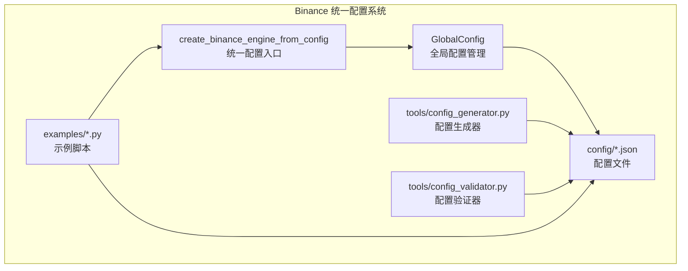
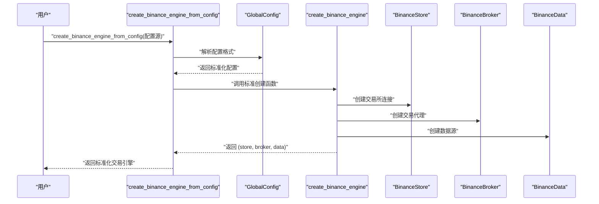
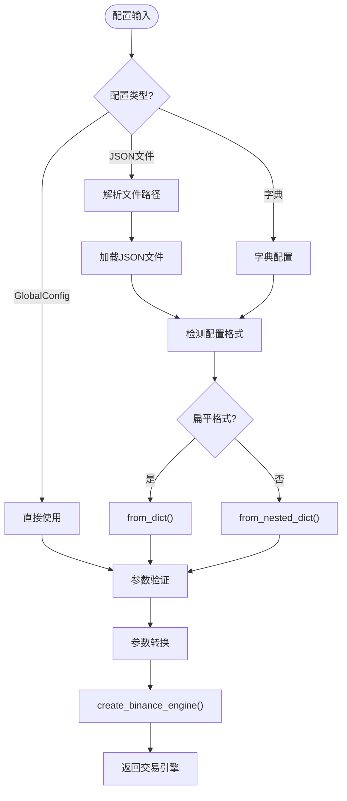
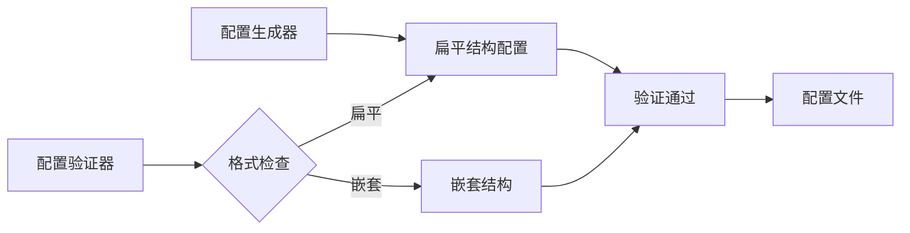
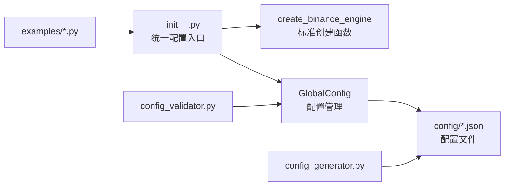

# 配置管理系统

<cite>
**本文引用的文件**
- [real_trade/binance/__init__.py](file://real_trade/binance/__init__.py)
- [real_trade/utils/config.py](file://real_trade/utils/config.py)
- [real_trade/binance/tools/config_generator.py](file://real_trade/binance/tools/config_generator.py)
- [real_trade/binance/tools/config_validator.py](file://real_trade/binance/tools/config_validator.py)
- [real_trade/binance/config/README.md](file://real_trade/binance/config/README.md)
- [real_trade/binance/examples/config_example.py](file://real_trade/binance/examples/config_example.py)
- [real_trade/binance/examples/testnet_futures_test.py](file://real_trade/binance/examples/testnet_futures_test.py)
- [real_trade/binance/examples/check_available_symbols.py](file://real_trade/binance/examples/check_available_symbols.py)
</cite>

## 更新摘要
**所做更改**
- 新增统一配置系统架构说明，重点介绍 create_binance_engine_from_config() 函数
- 更新配置结构说明，从嵌套配置转向扁平配置结构
- 新增 GlobalConfig 类的详细说明和使用方法
- 更新配置验证器工具的功能说明，支持扁平和嵌套两种格式
- 新增配置生成器的扁平结构输出说明
- 更新示例脚本，展示新的配置使用方式

## 目录
1. [简介](#简介)
2. [项目结构](#项目结构)
3. [核心组件](#核心组件)
4. [架构总览](#架构总览)
5. [详细组件分析](#详细组件分析)
6. [依赖关系分析](#依赖关系分析)
7. [性能考虑](#性能考虑)
8. [故障排查指南](#故障排查指南)
9. [结论](#结论)
10. [附录](#附录)

## 简介
本文件面向 Binance 配置管理系统的使用者与维护者，系统化阐述统一配置系统的配置文件结构、加载机制与工具链的使用方法。重点解析 create_binance_engine_from_config() 函数的实现原理，包括配置文件解析、参数验证、默认值处理与路径访问等核心能力，并结合 GlobalConfig 类说明统一配置管理的优势。同时提供配置生成器与验证器工具的使用指南、最佳实践建议以及环境变量覆盖与配置优先级规则的说明。

## 项目结构
Binance 配置管理位于 real_trade/binance 目录，主要由以下子模块组成：
- 统一配置系统：通过 create_binance_engine_from_config() 函数提供统一的配置入口
- GlobalConfig 类：统一管理配置数据结构，支持扁平和嵌套两种格式
- 配置工具链：配置生成器与验证器
- 示例脚本：展示配置驱动的交易流程与测试

**图表来源**
- [real_trade/binance/__init__.py](file://real_trade/binance/__init__.py#L137-L223)
- [real_trade/utils/config.py](file://real_trade/utils/config.py#L20-L169)
- [real_trade/binance/tools/config_generator.py](file://real_trade/binance/tools/config_generator.py#L1-L105)
- [real_trade/binance/tools/config_validator.py](file://real_trade/binance/tools/config_validator.py#L1-L185)
- [real_trade/binance/examples/config_example.py](file://real_trade/binance/examples/config_example.py#L1-L221)

**章节来源**
- [real_trade/binance/config/README.md](file://real_trade/binance/config/README.md#L1-L132)

## 核心组件
本节聚焦统一配置系统的核心组件，包括 create_binance_engine_from_config() 函数和 GlobalConfig 类，说明其职责、配置格式支持与加载策略。

- create_binance_engine_from_config() 函数
  - 支持三种配置来源：JSON 文件路径、GlobalConfig 对象、配置字典
  - 自动识别扁平和嵌套配置格式
  - 统一参数验证和转换
  - 返回标准的 (store, broker, data) 元组

- GlobalConfig 类
  - 统一的数据结构定义，包含交易所、交易、数据、风控、日志等参数
  - 支持从环境变量、JSON 文件、字典三种方式加载
  - 自动处理扁平和嵌套配置格式的转换
  - 提供配置保存和序列化功能

- 配置格式支持
  - 扁平结构：与 GlobalConfig 字段完全一致
  - 嵌套结构：兼容传统的 api/trading/data 分组格式
  - 自动识别和转换机制

**章节来源**
- [real_trade/binance/__init__.py](file://real_trade/binance/__init__.py#L137-L223)
- [real_trade/utils/config.py](file://real_trade/utils/config.py#L20-L169)

## 架构总览
下图展示了统一配置系统从配置源到交易引擎的构建流程，以及工具链在配置生命周期中的位置。

**图表来源**
- [real_trade/binance/__init__.py](file://real_trade/binance/__init__.py#L137-L223)
- [real_trade/utils/config.py](file://real_trade/utils/config.py#L66-L169)

## 详细组件分析

### create_binance_engine_from_config() 函数详解
- 配置源支持
  - JSON 文件路径：自动解析相对路径和绝对路径
  - GlobalConfig 对象：直接使用现有配置实例
  - 配置字典：支持扁平和嵌套两种格式
- 自动格式识别
  - 通过检查顶层键判断配置格式
  - 扁平格式：直接映射到 GlobalConfig 字段
  - 嵌套格式：自动转换为扁平结构
- 参数处理
  - 日期字符串转换为 datetime 对象
  - 历史数据参数的条件传递
  - 回测模式下的 API 密钥处理

**图表来源**
- [real_trade/binance/__init__.py](file://real_trade/binance/__init__.py#L171-L222)
- [real_trade/utils/config.py](file://real_trade/utils/config.py#L132-L169)

**章节来源**
- [real_trade/binance/__init__.py](file://real_trade/binance/__init__.py#L137-L223)

### GlobalConfig 类详解
- 数据结构设计
  - 交易所配置：exchange、apikey、secret、testnet、proxy、market_type
  - 交易配置：symbol、timeframe、paper_trading、cash、commission、backtest
  - 数据配置：historical_limit、fromdate、todate
  - 风控配置：max_position_pct、risk_per_trade、max_drawdown_pct、max_daily_trades
  - 日志配置：log_level、log_file
  - 通知配置：notify_on_trade、notify_on_error
  - 额外配置：extra（用于策略参数等扩展）

- 配置加载方法
  - from_dict()：从扁平字典创建配置
  - from_nested_dict()：从嵌套字典创建配置
  - from_json()：从 JSON 文件创建配置（自动识别格式）
  - from_env()：从环境变量加载配置

- 配置转换机制
  - 嵌套到扁平的自动转换
  - 类型自动转换和验证
  - 缺失字段的默认值处理

**章节来源**
- [real_trade/utils/config.py](file://real_trade/utils/config.py#L20-L169)

### 配置文件格式与差异
- 扁平结构（推荐）
  - 与 GlobalConfig 字段完全一致
  - 更直观，易于理解和维护
  - 支持所有配置参数的一次性定义
- 嵌套结构（兼容）
  - 兼容传统的 api/trading/data 分组格式
  - 适合已有配置文件的迁移
  - 自动转换为扁平结构

**章节来源**
- [real_trade/binance/config/README.md](file://real_trade/binance/config/README.md#L37-L67)

### 配置参数说明与作用
- 交易所配置
  - exchange：交易所名称，默认 "binance"
  - apikey/secret：API 密钥与密钥，回测模式可留空
  - testnet：true 连接 Demo Trading，false 连接生产环境
  - market_type：spot（现货）、future（合约）、delivery（交割）、swap（永续）
  - proxy：代理服务器地址，None 时自动检测系统代理
- 交易配置
  - symbol：交易对，如 BTC/USDT 或 BTC/USDT:USDT
  - timeframe：K线周期，如 1m/5m/15m/1h/4h/1d 等
  - paper_trading：true 本地模拟，false 真实下单
  - cash：初始资金
  - commission：手续费率
  - backtest：true 使用历史数据，false 使用实时数据
- 数据配置
  - historical_limit：加载的历史 K 线数量
  - fromdate/todate：回测时间范围（ISO 格式）
- 风控配置
  - max_position_pct：最大仓位比例
  - risk_per_trade：单笔风险比例
  - max_drawdown_pct：最大回撤比例
  - max_daily_trades：每日最大交易次数
- 日志配置
  - log_level：日志级别
  - log_file：日志文件路径
- 通知配置
  - notify_on_trade：交易通知
  - notify_on_error：错误通知

**章节来源**
- [real_trade/binance/config/README.md](file://real_trade/binance/config/README.md#L69-L87)
- [real_trade/utils/config.py](file://real_trade/utils/config.py#L28-L64)

### 配置生成器与验证器工具
- 配置生成器（config_generator.py）
  - 交互式生成扁平结构配置文件
  - 支持选择市场类型、API 密钥、测试网、模拟交易、初始资金、手续费、交易对、时间周期、回测模式、历史数据条数、代理设置
  - 生成的配置文件可直接传给 create_binance_engine_from_config() 使用
- 配置验证器（config_validator.py）
  - 支持扁平和嵌套两种 JSON 格式的验证
  - 校验 JSON 格式、必需字段、数值范围与格式合理性
  - 自动识别配置格式并进行相应的验证
  - 输出详细的错误与警告清单，并打印配置摘要

**图表来源**
- [real_trade/binance/tools/config_generator.py](file://real_trade/binance/tools/config_generator.py#L63-L94)
- [real_trade/binance/tools/config_validator.py](file://real_trade/binance/tools/config_validator.py#L42-L78)

**章节来源**
- [real_trade/binance/tools/config_generator.py](file://real_trade/binance/tools/config_generator.py#L1-L105)
- [real_trade/binance/tools/config_validator.py](file://real_trade/binance/tools/config_validator.py#L1-L185)

### 示例脚本与使用方法
- config_example.py
  - 展示从配置文件创建交易引擎的完整流程
  - 支持三种配置方式：JSON 文件、GlobalConfig 对象、字典
  - 演示策略参数从配置文件读取的方法
- testnet_futures_test.py
  - 连接 Futures Testnet，验证账户余额、行情、持仓与历史 K 线获取
  - 展示正确的交易对格式（如 BTC/USDT:USDT）
- check_available_symbols.py
  - 检查可用交易对、最小订单限制与行情获取
  - 辅助定位订单可见性问题

**章节来源**
- [real_trade/binance/examples/config_example.py](file://real_trade/binance/examples/config_example.py#L1-L221)
- [real_trade/binance/examples/testnet_futures_test.py](file://real_trade/binance/examples/testnet_futures_test.py#L1-L156)
- [real_trade/binance/examples/check_available_symbols.py](file://real_trade/binance/examples/check_available_symbols.py#L1-L162)

## 依赖关系分析
- 模块导出
  - __init__.py 导出 create_binance_engine_from_config 等统一配置入口函数
- 接口依赖
  - create_binance_engine_from_config 依赖 GlobalConfig 的配置解析能力
  - 配置验证器依赖 GlobalConfig 的格式识别功能
  - 示例脚本通过统一入口函数读取配置并驱动交易引擎

**图表来源**
- [real_trade/binance/__init__.py](file://real_trade/binance/__init__.py#L39-L45)
- [real_trade/utils/config.py](file://real_trade/utils/config.py#L132-L169)

**章节来源**
- [real_trade/binance/__init__.py](file://real_trade/binance/__init__.py#L39-L45)

## 性能考虑
- 回测模式优先：在策略开发阶段使用 backtest=true 与 paper_trading=true，避免网络与订单开销
- 合理的历史数据条数：historical_limit 过大会增加内存与 IO 压力，建议根据策略窗口与机器资源设定
- 配置格式选择：扁平结构比嵌套结构更简洁，减少解析开销
- 代理与网络：若需代理，建议启用 auto_detect 并在稳定网络环境下运行，减少重试与超时
- 日志级别：printlog 在高频交易中可能带来 IO 压力，可在性能敏感场景关闭

## 故障排查指南
- 配置文件不存在或格式错误
  - 现象：加载失败，返回默认配置
  - 处理：使用配置验证器检查 JSON 语法与字段完整性
- 配置格式识别问题
  - 现象：嵌套格式无法正确解析
  - 处理：确认配置文件是否符合嵌套格式规范，或转换为扁平格式
- API 密钥相关
  - 回测模式可留空 apikey/secret；非回测模式需正确填写
  - Demo Trading 与生产环境密钥独立，勿混淆
- 交易对与最小订单
  - 使用 check_available_symbols.py 检查交易对可用性与最小订单限制
  - 注意 Futures 交易对格式（如 BTC/USDT:USDT）
- 代理问题
  - 若网络受限，确认代理设置；必要时关闭 auto_detect 并手动指定代理

**章节来源**
- [real_trade/binance/tools/config_validator.py](file://real_trade/binance/tools/config_validator.py#L81-L174)
- [real_trade/binance/examples/check_available_symbols.py](file://real_trade/binance/examples/check_available_symbols.py#L17-L162)

## 结论
Binance 统一配置管理系统通过 create_binance_engine_from_config() 函数和 GlobalConfig 类提供了更加灵活和强大的配置管理能力。扁平配置结构简化了配置文件的编写和维护，而自动格式识别机制保证了与现有嵌套配置的兼容性。配合配置生成器与验证器工具，用户可以快速创建、验证和管理配置文件。建议在生产环境谨慎开启真实下单，并结合验证器与示例脚本进行充分测试。

## 附录

### 配置优先级与环境变量覆盖
- 配置优先级
  - GlobalConfig.from_env() 从环境变量加载的配置优先级最高
  - JSON 文件配置次之
  - 字典配置最后
- 环境变量覆盖
  - 支持通过环境变量覆盖配置参数，变量名格式为 RT_参数名
  - 适用于生产环境的安全配置管理

**章节来源**
- [real_trade/utils/config.py](file://real_trade/utils/config.py#L148-L164)

### 完整配置示例与最佳实践
- 完整配置示例
  - 扁平结构示例：参考 config/README.md 中的 JSON 结构
  - 嵌套结构示例：兼容传统的 api/trading/data 分组格式
- 最佳实践
  - 策略开发：使用扁平结构配置，开启回测与模拟交易
  - 上线前验证：使用 demo_trading 配置，连接 Demo Trading 完整跑通订单流程
  - 生产实盘：谨慎开启真实下单，充分测试后再切换
  - 安全建议：避免将真实密钥提交到版本库，使用环境变量或外部机密管理
  - 配置迁移：从嵌套格式迁移到扁平格式，利用自动识别功能

**章节来源**
- [real_trade/binance/config/README.md](file://real_trade/binance/config/README.md#L1-L132)
- [real_trade/utils/config.py](file://real_trade/utils/config.py#L132-L169)