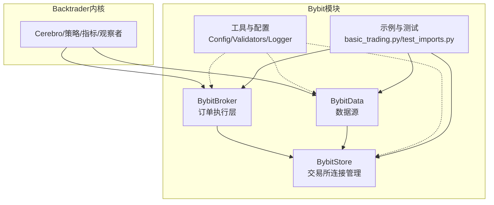
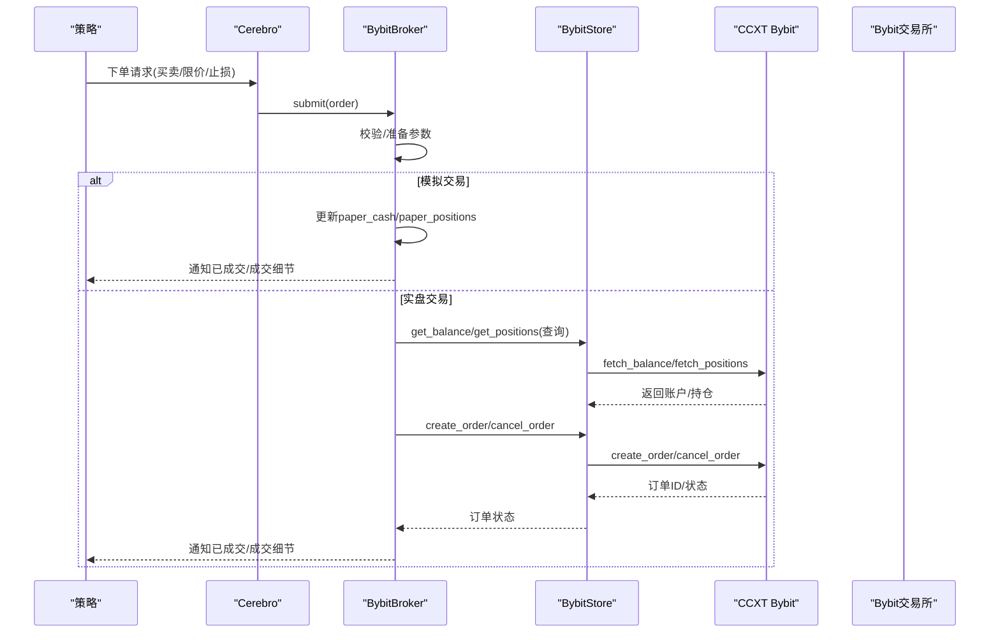
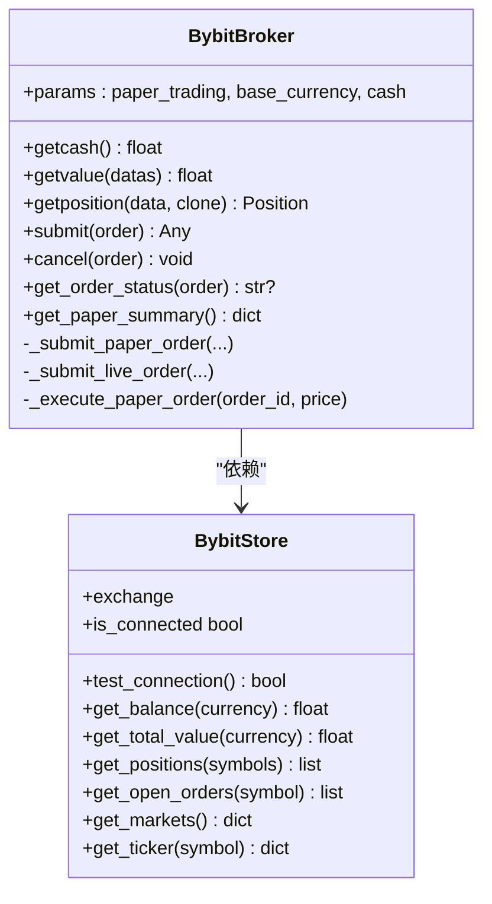
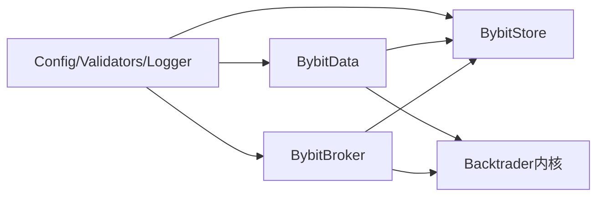

# BybitBroker执行层

<cite>
**本文引用的文件**
- [broker.py](file://real_trade/bybit/broker.py)
- [store.py](file://real_trade/bybit/store.py)
- [datafeed.py](file://real_trade/bybit/datafeed.py)
- [__init__.py](file://real_trade/bybit/__init__.py)
- [basic_trading.py](file://real_trade/bybit/examples/basic_trading.py)
- [config.py](file://real_trade/bybit/utils/config.py)
- [validators.py](file://real_trade/bybit/utils/validators.py)
- [logger.py](file://real_trade/bybit/utils/logger.py)
- [base_broker.py](file://real_trade/common/base_broker.py)
- [test_imports.py](file://real_trade/bybit/tests/test_imports.py)
</cite>

## 目录
1. [简介](#简介)
2. [项目结构](#项目结构)
3. [核心组件](#核心组件)
4. [架构总览](#架构总览)
5. [详细组件分析](#详细组件分析)
6. [依赖关系分析](#依赖关系分析)
7. [性能考量](#性能考量)
8. [故障排查指南](#故障排查指南)
9. [结论](#结论)
10. [附录](#附录)

## 简介
本文件面向Backtrader策略开发者，系统化阐述BybitBroker执行层的设计与实现，覆盖与Backtrader策略系统的集成方式、订单生命周期管理（提交、修改、取消、成交确认）、持仓与资金管理、与Store层的数据交互、Bybit特有订单类型的适配与限制、配置参数说明以及实盘/模拟交易注意事项。文档同时提供流程图与类图帮助读者建立整体认知，并给出常见问题的排查思路与最佳实践建议。

## 项目结构
Bybit模块位于real_trade/bybit目录，核心由三部分组成：
- Broker层：负责订单执行、成交确认、资金与持仓管理
- Store层：封装Bybit CCXT连接，提供余额、持仓、市场等查询能力
- DataFeed层：提供历史与实时K线数据源
- 工具与示例：配置管理、参数校验、日志、示例策略与导入测试

图表来源
- [broker.py](file://real_trade/bybit/broker.py#L18-L59)
- [store.py](file://real_trade/bybit/store.py#L16-L132)
- [datafeed.py](file://real_trade/bybit/datafeed.py#L19-L88)
- [__init__.py](file://real_trade/bybit/__init__.py#L52-L86)

章节来源
- [broker.py](file://real_trade/bybit/broker.py#L1-L60)
- [store.py](file://real_trade/bybit/store.py#L1-L67)
- [datafeed.py](file://real_trade/bybit/datafeed.py#L1-L40)
- [__init__.py](file://real_trade/bybit/__init__.py#L1-L44)

## 核心组件
- BybitStore：单例化的Bybit CCXT连接管理器，支持测试网/主网切换、代理、市场类型（现货/永续/反向）配置；提供余额、总价值、持仓、开放订单、市场信息、行情快照等查询。
- BybitBroker：继承Backtrader BrokerBase，实现模拟交易与实盘交易双模；负责订单提交、取消、状态查询、成交确认、资金与持仓更新；通过Store层与CCXT交互。
- BybitData：基于Backtrader DataBase，支持历史回测与实时订阅；提供时间周期映射、OHLCV数据填充、时间戳转换。
- 工具与配置：Config封装配置项（API、交易、Broker、策略、回测、日志），validators提供符号、时间周期、API密钥等校验，logger提供统一日志输出。

章节来源
- [store.py](file://real_trade/bybit/store.py#L16-L132)
- [broker.py](file://real_trade/bybit/broker.py#L18-L59)
- [datafeed.py](file://real_trade/bybit/datafeed.py#L19-L88)
- [config.py](file://real_trade/bybit/utils/config.py#L17-L81)
- [validators.py](file://real_trade/bybit/utils/validators.py#L15-L84)
- [logger.py](file://real_trade/bybit/utils/logger.py#L16-L67)

## 架构总览
BybitBroker与Backtrader策略系统通过Cerebro协调工作：策略发出买卖指令，Broker将其转换为Bybit订单并提交至Store层的CCXT连接；Store层负责与Bybit交易所通信；DataFeed提供K线数据；Broker在成交后更新资金与持仓并向策略发出通知。

图表来源
- [broker.py](file://real_trade/bybit/broker.py#L133-L218)
- [store.py](file://real_trade/bybit/store.py#L156-L220)

章节来源
- [broker.py](file://real_trade/bybit/broker.py#L133-L218)
- [store.py](file://real_trade/bybit/store.py#L156-L220)

## 详细组件分析

### BybitBroker执行层
- 设计要点
  - 双模支持：paper_trading参数控制模拟/实盘；模拟模式下内部维护paper_cash、paper_positions、paper_orders与open_orders映射。
  - 订单类型：根据Backtrader订单执行类型映射为CCXT订单类型（市价、限价、止损）；未直接实现“止盈”或“OCO”，可通过策略侧组合多个订单实现。
  - 资金与持仓：模拟模式直接计算；实盘模式通过Store层调用CCXT接口获取最新余额与总价值。
  - 成交确认：模拟模式按当前价即时撮合；实盘模式通过fetch_order轮询状态并最终execute通知策略。
- 关键方法
  - getcash/getvalue/getposition：资金/资产/持仓查询
  - submit/_submit_paper_order/_submit_live_order：订单提交
  - _execute_paper_order：模拟成交执行
  - cancel：取消订单
  - get_order_status：查询订单状态
  - get_paper_summary：导出模拟交易摘要

图表来源
- [broker.py](file://real_trade/bybit/broker.py#L18-L59)
- [store.py](file://real_trade/bybit/store.py#L16-L132)

章节来源
- [broker.py](file://real_trade/bybit/broker.py#L18-L381)

### Store层：Bybit连接与查询
- 单例模式：按apikey+testnet维度缓存实例，避免重复初始化
- CCXT配置：支持代理、测试网URL覆盖、市场类型(defaultType)
- 查询接口：余额、总价值、持仓、开放订单、市场、行情快照
- 连接测试：fetch_balance成功即标记连接状态

章节来源
- [store.py](file://real_trade/bybit/store.py#L30-L132)
- [store.py](file://real_trade/bybit/store.py#L139-L254)

### DataFeed层：历史与实时数据
- 时间周期映射：将字符串时间周期映射为Backtrader时间框架与压缩倍数
- 历史数据：分页拉取OHLCV，支持起止时间过滤
- 实时数据：逐根拉取最新K线
- Backtest/Live模式切换：backtest参数控制

章节来源
- [datafeed.py](file://real_trade/bybit/datafeed.py#L19-L88)
- [datafeed.py](file://real_trade/bybit/datafeed.py#L119-L222)

### 配置与工具
- Config：集中管理API、交易、Broker、策略、回测、日志等参数，支持from_env/from_dict/save_to_file
- Validators：交易对、时间周期、API密钥、订单规模/价格/手续费/初始资金等校验
- Logger：统一日志格式与输出目标（控制台/文件）

章节来源
- [config.py](file://real_trade/bybit/utils/config.py#L17-L145)
- [validators.py](file://real_trade/bybit/utils/validators.py#L15-L183)
- [logger.py](file://real_trade/bybit/utils/logger.py#L16-L85)

### 与Backtrader策略系统的集成
- 引擎创建：create_bybit_engine便捷函数自动创建Store/Broker/Data并打印运行信息
- 参数校验：在创建阶段对symbol/timeframe/API keys进行验证
- 回测/实盘：backtest参数决定是否使用真实API密钥与测试网
- 示例：basic_trading.py展示策略注册、分析器添加、运行与结果打印

章节来源
- [__init__.py](file://real_trade/bybit/__init__.py#L89-L187)
- [basic_trading.py](file://real_trade/bybit/examples/basic_trading.py#L41-L118)
- [test_imports.py](file://real_trade/bybit/tests/test_imports.py#L18-L55)

## 依赖关系分析
- Broker依赖Store：通过Store.exchange与CCXT交互；在paper_trading=False时依赖Store的余额/持仓/订单查询
- DataFeed依赖Store：通过Store.exchange拉取OHLCV与ticker
- 工具模块被各组件复用：Config/Validators/Logger贯穿配置、校验与日志
- 与Backtrader内核：Broker遵循BrokerBase接口，DataFeed遵循DataBase接口，策略通过Cerebro调度

图表来源
- [broker.py](file://real_trade/bybit/broker.py#L37-L47)
- [datafeed.py](file://real_trade/bybit/datafeed.py#L58-L69)
- [__init__.py](file://real_trade/bybit/__init__.py#L52-L86)

章节来源
- [broker.py](file://real_trade/bybit/broker.py#L37-L47)
- [datafeed.py](file://real_trade/bybit/datafeed.py#L58-L69)
- [__init__.py](file://real_trade/bybit/__init__.py#L52-L86)

## 性能考量
- CCXT速率限制：启用enableRateLimit以遵守Bybit限流；合理设置historical_limit减少多次请求
- 实时数据：逐根fetch_ohlcv拉取，注意网络延迟与频率控制
- 模拟交易：paper模式无网络开销，但需关注Python层循环与内存占用
- 日志级别：生产环境建议提升日志级别，降低IO开销

## 故障排查指南
- 连接失败
  - 使用Store.test_connection()快速验证；检查apikey/secret/testnet/market_type配置
  - 若使用代理，确认proxy格式正确
- 订单提交失败
  - 实盘模式下create_order异常会触发order.reject并通知；检查symbol格式与CCXT支持情况
  - 模拟模式下若资金不足会触发margin并拒绝
- 订单取消失败
  - 确认order在open_orders映射中存在；实盘模式下exchange.cancel_order可能抛出异常
- 资金/持仓不准确
  - 实盘模式下getcash/getvalue/getposition依赖Store查询；若异常返回默认值，检查网络与权限
- 回测数据缺失
  - 检查fromdate/todate与historical_limit；确认时间周期映射正确

章节来源
- [store.py](file://real_trade/bybit/store.py#L139-L154)
- [broker.py](file://real_trade/bybit/broker.py#L215-L218)
- [broker.py](file://real_trade/bybit/broker.py#L318-L328)
- [datafeed.py](file://real_trade/bybit/datafeed.py#L129-L166)

## 结论
BybitBroker在Backtrader生态中提供了清晰的执行层抽象：统一的订单生命周期管理、模拟与实盘双模支持、与Store层的解耦设计，使得策略开发与部署更加稳健。配合完善的配置、校验与日志体系，开发者可快速搭建从回测到实盘的完整交易流水线。建议在实盘前充分进行模拟交易与参数校准，并结合日志与监控完善风控与排错流程。

## 附录

### 订单类型与Bybit适配
- 市价单：直接映射为CCXT市价单
- 限价单：映射为CCXT限价单
- 止损单：映射为CCXT止损单
- 止盈单/OCO：当前Broker未直接支持，可通过策略侧组合多个订单实现

章节来源
- [broker.py](file://real_trade/bybit/broker.py#L192-L198)

### 配置参数详解
- API与连接
  - apikey/secret/testnet/proxy：认证与网络配置
  - market_type：spot/linear/inverse
- 交易与Broker
  - symbol/timeframe/market_type：交易对与时间周期
  - paper_trading/initial_cash/commission：模拟交易与资金/手续费
- 回测
  - backtest/fromdate/todate/historical_limit：历史数据加载范围与批次
- 日志
  - log_level/log_file：日志级别与输出文件

章节来源
- [config.py](file://real_trade/bybit/utils/config.py#L17-L81)
- [store.py](file://real_trade/bybit/store.py#L68-L97)
- [datafeed.py](file://real_trade/bybit/datafeed.py#L30-L39)

### 使用示例与最佳实践
- 快速开始：参考basic_trading.py，使用create_bybit_engine一键创建引擎并运行策略
- 最佳实践
  - 在创建阶段使用validators校验symbol/timeframe/API keys
  - 回测优先：先用backtest验证策略逻辑，再切换paper_trading与实盘
  - 合理设置commission与初始资金，确保模拟与实盘一致性
  - 使用logger记录关键事件，便于排错与审计

章节来源
- [basic_trading.py](file://real_trade/bybit/examples/basic_trading.py#L41-L118)
- [__init__.py](file://real_trade/bybit/__init__.py#L89-L187)
- [validators.py](file://real_trade/bybit/utils/validators.py#L87-L111)
- [logger.py](file://real_trade/bybit/utils/logger.py#L16-L67)