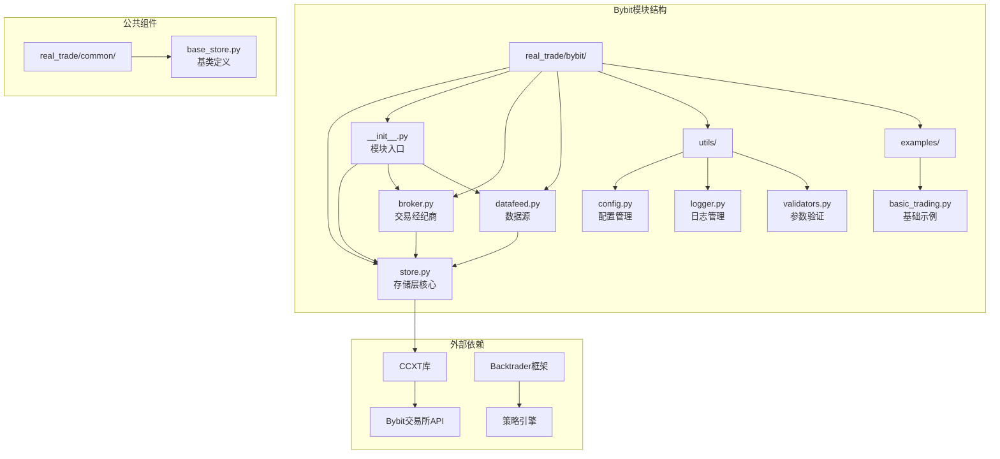
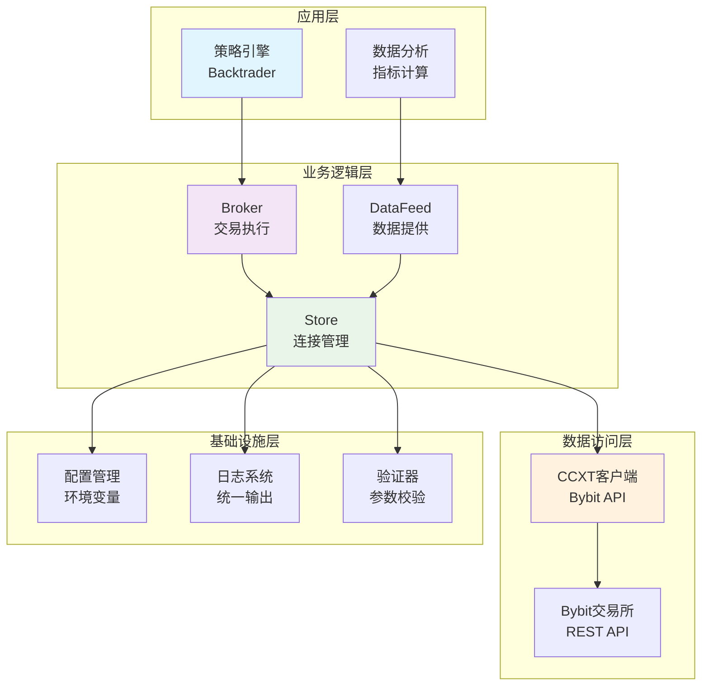
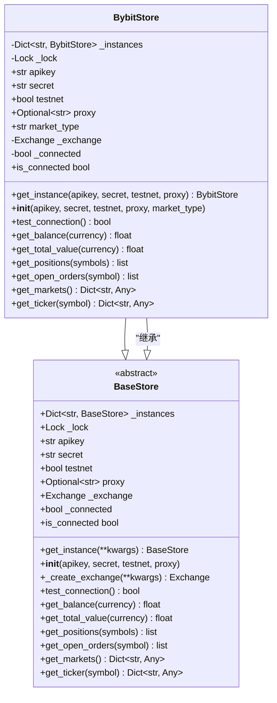
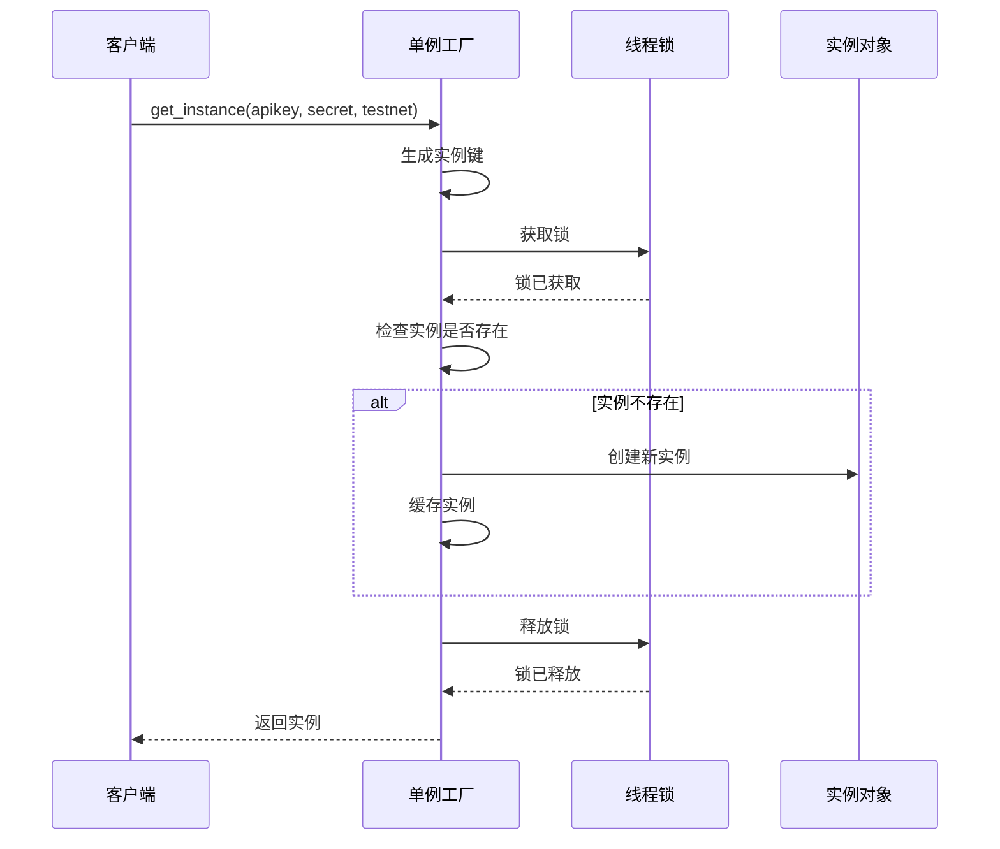
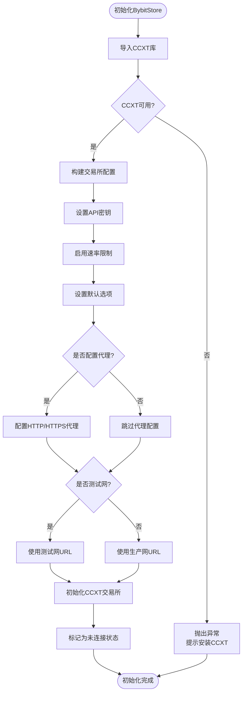
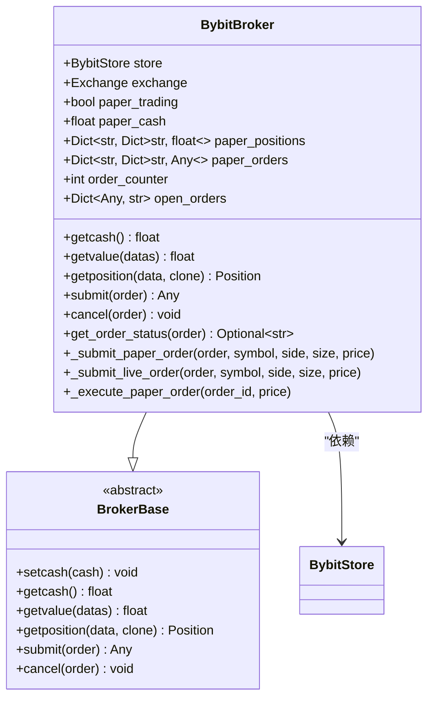
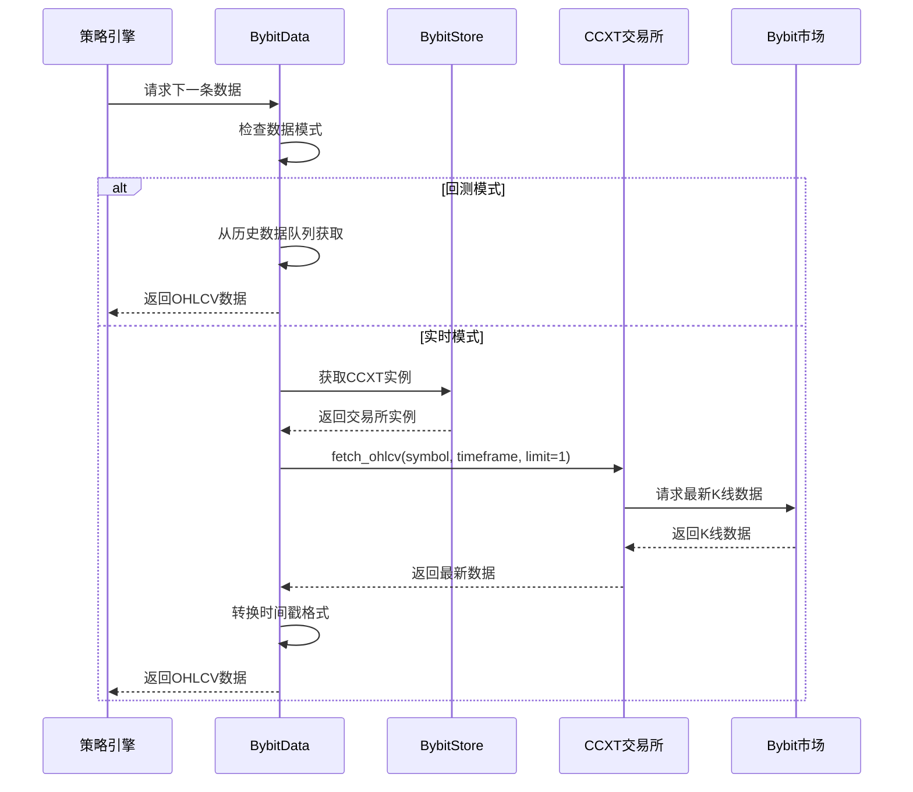
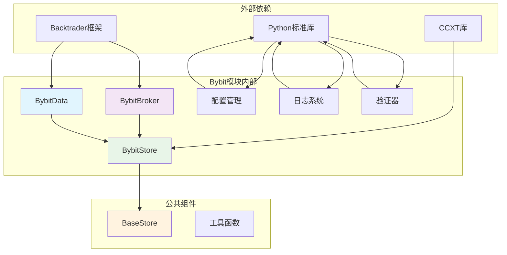

# BybitStore存储层

<cite>
**本文档引用的文件**
- [store.py](file://real_trade/bybit/store.py)
- [__init__.py](file://real_trade/bybit/__init__.py)
- [broker.py](file://real_trade/bybit/broker.py)
- [datafeed.py](file://real_trade/bybit/datafeed.py)
- [base_store.py](file://real_trade/common/base_store.py)
- [config.py](file://real_trade/bybit/utils/config.py)
- [logger.py](file://real_trade/bybit/utils/logger.py)
- [validators.py](file://real_trade/bybit/utils/validators.py)
- [basic_trading.py](file://real_trade/bybit/examples/basic_trading.py)
- [bybit-live-trading.py](file://samples/ccxt-bybit/bybit-live-trading.py)
</cite>

## 目录
1. [简介](#简介)
2. [项目结构](#项目结构)
3. [核心组件](#核心组件)
4. [架构概览](#架构概览)
5. [详细组件分析](#详细组件分析)
6. [依赖关系分析](#依赖关系分析)
7. [性能考虑](#性能考虑)
8. [故障排除指南](#故障排除指南)
9. [结论](#结论)
10. [附录](#附录)

## 简介

BybitStore存储层是Backtrader框架中专门用于连接Bybit加密货币交易所的存储组件。该组件基于CCXT库构建，提供了统一的交易所连接管理、账户信息查询、交易对管理、市场数据获取和订单状态监控等功能。通过单例模式设计，BybitStore确保了连接的高效管理和资源的合理利用。

该存储层支持多种交易模式，包括模拟交易和实盘交易，并提供了灵活的配置选项，包括测试网/实盘切换、代理配置、市场类型选择等。同时，它还集成了完整的错误处理机制和连接状态管理。

## 项目结构

Bybit模块采用清晰的分层架构设计，将不同的功能职责分离到独立的组件中：



**图表来源**
- [store.py](file://real_trade/bybit/store.py#L1-L262)
- [__init__.py](file://real_trade/bybit/__init__.py#L1-L215)
- [base_store.py](file://real_trade/common/base_store.py#L1-L194)

**章节来源**
- [store.py](file://real_trade/bybit/store.py#L1-L262)
- [__init__.py](file://real_trade/bybit/__init__.py#L1-L215)
- [base_store.py](file://real_trade/common/base_store.py#L1-L194)

## 核心组件

Bybit存储层由多个核心组件构成，每个组件都有明确的职责和功能：

### BybitStore类
- **单例模式管理**：确保同一套API凭据只创建一个连接实例
- **CCXT集成**：封装Bybit交易所的CCXT客户端
- **连接池管理**：支持多实例连接管理
- **线程安全**：使用锁机制保证并发访问的安全性

### 配置管理系统
- **环境变量支持**：从环境变量自动加载配置
- **文件配置支持**：支持JSON和Python格式的配置文件
- **默认值管理**：提供合理的默认配置参数
- **配置验证**：内置参数验证机制

### 工具模块
- **日志系统**：统一的日志记录和输出管理
- **参数验证**：交易对、时间周期、API密钥等参数验证
- **系统代理检测**：自动检测和配置系统代理

**章节来源**
- [store.py](file://real_trade/bybit/store.py#L16-L262)
- [config.py](file://real_trade/bybit/utils/config.py#L17-L145)
- [logger.py](file://real_trade/bybit/utils/logger.py#L16-L85)
- [validators.py](file://real_trade/bybit/utils/validators.py#L15-L183)

## 架构概览

Bybit存储层采用了分层架构设计，实现了清晰的关注点分离：



**图表来源**
- [store.py](file://real_trade/bybit/store.py#L16-L262)
- [broker.py](file://real_trade/bybit/broker.py#L18-L381)
- [datafeed.py](file://real_trade/bybit/datafeed.py#L19-L235)

该架构的主要特点：
- **分层清晰**：每层都有明确的职责边界
- **解耦设计**：各组件间通过接口通信，降低耦合度
- **可扩展性**：易于添加新的功能模块
- **可测试性**：每个组件都可以独立测试

## 详细组件分析

### BybitStore类深度分析

BybitStore类是整个存储层的核心，实现了单例模式和连接管理功能：

#### 类设计架构



**图表来源**
- [store.py](file://real_trade/bybit/store.py#L16-L262)
- [base_store.py](file://real_trade/common/base_store.py#L17-L194)

#### 单例模式实现

BybitStore采用了双重检查锁定的单例模式，确保线程安全和资源效率：



**图表来源**
- [store.py](file://real_trade/bybit/store.py#L30-L66)

#### CCXT集成机制

BybitStore通过CCXT库实现与Bybit交易所的连接：



**图表来源**
- [store.py](file://real_trade/bybit/store.py#L88-L132)

#### 核心功能实现

BybitStore提供了以下核心功能：

1. **账户信息查询**
   - 余额查询：`get_balance()`
   - 总价值查询：`get_total_value()`
   - 持仓查询：`get_positions()`

2. **订单管理**
   - 未完成订单查询：`get_open_orders()`
   - 订单状态监控：通过CCXT API

3. **市场数据获取**
   - 市场信息加载：`get_markets()`
   - 行情快照获取：`get_ticker()`

4. **连接状态管理**
   - 连接测试：`test_connection()`
   - 连接状态查询：`is_connected`

**章节来源**
- [store.py](file://real_trade/bybit/store.py#L139-L262)

### Broker组件分析

BybitBroker组件实现了Backtrader的BrokerBase接口，提供了完整的交易执行功能：



**图表来源**
- [broker.py](file://real_trade/bybit/broker.py#L18-L381)

#### 模拟交易与实盘交易

BybitBroker支持两种交易模式：

1. **模拟交易模式**
   - 完全在内存中执行订单
   - 不发送任何真实订单到交易所
   - 使用内部状态跟踪资金和持仓

2. **实盘交易模式**
   - 直接通过CCXT API与交易所通信
   - 发送真实订单到Bybit交易所
   - 实时获取账户状态和执行结果

**章节来源**
- [broker.py](file://real_trade/bybit/broker.py#L18-L381)

### DataFeed组件分析

BybitData组件提供了数据源功能，支持实时数据流和历史数据加载：



**图表来源**
- [datafeed.py](file://real_trade/bybit/datafeed.py#L168-L223)

**章节来源**
- [datafeed.py](file://real_trade/bybit/datafeed.py#L19-L235)

## 依赖关系分析

Bybit存储层的依赖关系体现了清晰的架构层次：



**图表来源**
- [store.py](file://real_trade/bybit/store.py#L88-L132)
- [broker.py](file://real_trade/bybit/broker.py#L13-L15)
- [datafeed.py](file://real_trade/bybit/datafeed.py#L12-L16)

### 关键依赖特性

1. **CCXT集成**：通过CCXT库实现与Bybit交易所的标准化接口
2. **Backtrader兼容**：完全遵循Backtrader的接口规范
3. **Python生态**：依赖标准库和常用第三方库
4. **模块化设计**：各组件间保持松耦合

**章节来源**
- [store.py](file://real_trade/bybit/store.py#L88-L132)
- [broker.py](file://real_trade/bybit/broker.py#L13-L15)
- [datafeed.py](file://real_trade/bybit/datafeed.py#L12-L16)

## 性能考虑

Bybit存储层在设计时充分考虑了性能优化：

### 连接管理优化

1. **单例模式**：避免重复创建连接，减少资源消耗
2. **连接池管理**：支持多实例连接，提高并发处理能力
3. **线程安全**：使用锁机制保证多线程环境下的安全性

### API调用优化

1. **速率限制**：启用CCXT的速率限制功能
2. **批量操作**：支持批量获取市场数据和订单信息
3. **缓存策略**：合理利用CCXT的内置缓存机制

### 内存管理

1. **历史数据分页**：按需加载历史数据，避免内存溢出
2. **数据格式转换**：优化时间戳转换和数据格式处理
3. **资源清理**：及时释放不再使用的资源

## 故障排除指南

### 常见问题及解决方案

#### 连接问题

**问题**：无法连接到Bybit交易所
**可能原因**：
- API密钥配置错误
- 网络连接问题
- 代理配置不当

**解决方案**：
1. 验证API密钥格式和权限
2. 检查网络连接状态
3. 配置正确的代理设置

#### 认证问题

**问题**：API认证失败
**可能原因**：
- API密钥或Secret为空
- 测试网配置错误
- 时区或时间同步问题

**解决方案**：
1. 确保API密钥和Secret正确无误
2. 验证测试网/实盘配置
3. 检查系统时间和时区设置

#### 数据获取问题

**问题**：无法获取市场数据
**可能原因**：
- 交易对不支持
- 时间周期配置错误
- CCXT版本兼容性问题

**解决方案**：
1. 验证交易对格式（如BTC/USDT）
2. 检查时间周期的有效性
3. 更新CCXT库到最新版本

**章节来源**
- [store.py](file://real_trade/bybit/store.py#L139-L154)
- [validators.py](file://real_trade/bybit/utils/validators.py#L87-L111)

## 结论

BybitStore存储层是一个设计精良、功能完整的交易所连接管理组件。它成功地将复杂的交易所API集成简化为易用的接口，为Backtrader用户提供了一站式的Bybit交易解决方案。

该组件的主要优势包括：

1. **架构清晰**：采用分层设计，职责明确
2. **功能完整**：覆盖了交易系统的各个方面
3. **易于使用**：提供简单直观的API接口
4. **可扩展性强**：支持配置定制和功能扩展
5. **稳定性高**：完善的错误处理和连接管理

通过合理使用BybitStore，开发者可以专注于策略开发，而不必担心底层的交易所连接细节。这大大提高了开发效率和系统的可靠性。

## 附录

### 配置参数详解

| 参数名 | 类型 | 默认值 | 描述 |
|--------|------|--------|------|
| apikey | str | "" | Bybit API Key |
| secret | str | "" | Bybit API Secret |
| testnet | bool | True | 是否使用测试网 |
| proxy | Optional[str] | None | 代理服务器地址 |
| market_type | str | "spot" | 市场类型（spot/linear/inverse） |
| paper_trading | bool | True | 是否启用模拟交易 |
| initial_cash | float | 10000.0 | 初始资金（模拟交易用） |

### 使用示例

#### 基础初始化
```python
from real_trade.bybit import BybitStore

store = BybitStore.get_instance(
    apikey="YOUR_API_KEY",
    secret="YOUR_SECRET",
    testnet=True,
    market_type="spot"
)
```

#### 创建交易引擎
```python
from real_trade.bybit import create_bybit_engine

store, broker, data = create_bybit_engine(
    apikey="YOUR_API_KEY",
    secret="YOUR_SECRET",
    symbol="BTC/USDT",
    timeframe="1h",
    testnet=True,
    paper_trading=True,
    cash=10000.0
)
```

### 最佳实践

1. **配置管理**：使用配置文件或环境变量管理敏感信息
2. **错误处理**：始终包含适当的异常处理机制
3. **资源清理**：在程序结束时正确关闭连接
4. **测试优先**：先在模拟交易环境中测试策略
5. **监控告警**：建立连接状态和交易执行的监控机制